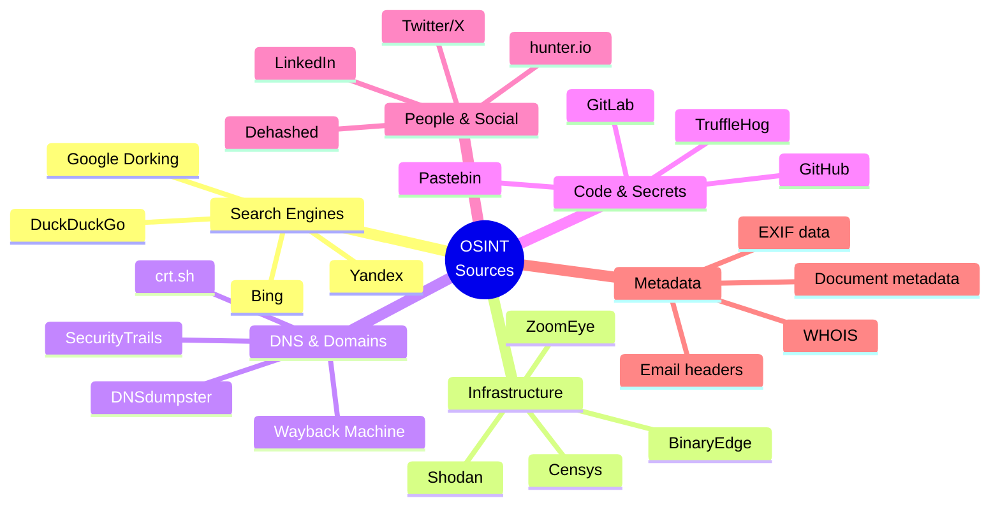
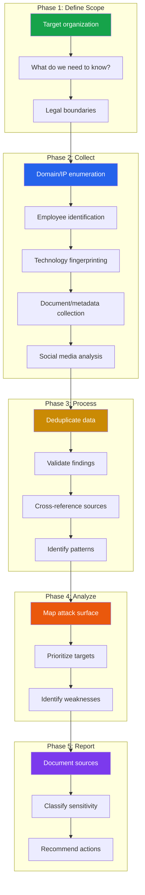

# OSINT (Open Source Intelligence)

Open Source Intelligence is the collection and analysis of publicly available information to answer security questions. Unlike active scanning, OSINT does not touch the target's systems — you use data that is already public: search engines, DNS records, certificate transparency logs, social media, code repositories, and specialized search engines like Shodan. OSINT is the first phase of any security assessment, and for bug bounty hunters, it is often the phase that separates successful hunters from everyone else.

**Related**: [Cybersecurity Overview](/cybersecurity/) | [Networking Fundamentals](/cybersecurity/networking-fundamentals) | [Web App Pentesting](/cybersecurity/web-app-pentesting) | [Cloud Pentesting](/cybersecurity/cloud-pentesting)

---

## What is OSINT?



### OSINT vs Active Reconnaissance

| Aspect | OSINT (Passive) | Active Recon |
|--------|----------------|--------------|
| **Target contact** | None — uses public sources | Direct interaction with target systems |
| **Legality** | Generally legal (public info) | Requires authorization |
| **Detection risk** | Zero — target cannot know | Detectable by IDS/IPS, logs |
| **Speed** | Can be very fast | Varies by scan depth |
| **Depth** | Broad but surface-level | Deep but narrow |
| **Examples** | Google dorking, Shodan, WHOIS | Nmap scan, Burp crawl, vulnerability scan |

::: tip Legal Considerations
OSINT uses publicly available information, but "publicly available" has limits. Accessing someone's private social media through a fake account, using leaked credential databases to log in, or scraping data in violation of terms of service may cross legal boundaries. When in doubt, consult legal counsel. For authorized penetration tests, document your OSINT methodology in the rules of engagement.
:::

---

## Passive Reconnaissance

### Shodan — The Search Engine for Internet-Connected Devices

Shodan indexes every device connected to the internet — servers, cameras, industrial control systems, databases, and more.

```bash
# Install Shodan CLI
pip install shodan
shodan init YOUR_API_KEY

# Search by organization
shodan search "org:\"Target Company\""

# Search by hostname
shodan search "hostname:target.com"

# Find specific services
shodan search "hostname:target.com port:22"
shodan search "hostname:target.com http.title:admin"

# Find exposed databases
shodan search "org:\"Target\" port:27017"    # MongoDB
shodan search "org:\"Target\" port:6379"     # Redis
shodan search "org:\"Target\" port:9200"     # Elasticsearch

# Find IoT devices
shodan search "org:\"Target\" webcam"
shodan search "org:\"Target\" scada"

# Get host details
shodan host 93.184.216.34

# Monitor for new exposures
shodan alert create "Target Monitor" 93.184.216.0/24
shodan alert triggers enable 93.184.216.0/24

# Shodan Dorks (web interface: shodan.io)
# ssl.cert.subject.cn:target.com       — Find by SSL certificate
# http.favicon.hash:116323821          — Find by favicon hash
# "Server: Apache/2.4.41"              — Find by server version
# "X-Powered-By: Express"              — Find by framework
# product:"OpenSSH" version:"7.6"      — Find vulnerable versions
```

### Censys — Internet-Wide Scanning Database

```bash
# Censys CLI
pip install censys
censys config  # Set API credentials

# Search by domain
censys search "services.tls.certificates.leaf.names: target.com"

# Find hosts
censys search "services.http.response.headers.server: nginx AND autonomous_system.name: Target"

# Search certificates
censys search "parsed.subject.common_name: target.com" --index certs
```

### Google Dorking

Google dorking uses advanced search operators to find sensitive information indexed by Google.

```
# Find login pages
site:target.com inurl:login
site:target.com inurl:admin
site:target.com intitle:"admin panel"

# Find sensitive files
site:target.com filetype:pdf
site:target.com filetype:xlsx
site:target.com filetype:docx confidential
site:target.com filetype:sql
site:target.com filetype:log
site:target.com filetype:env
site:target.com filetype:bak

# Find configuration files
site:target.com filetype:xml
site:target.com filetype:conf
site:target.com filetype:cfg
site:target.com ext:yml OR ext:yaml

# Find exposed directories
site:target.com intitle:"index of"
site:target.com intitle:"directory listing"

# Find error messages (information disclosure)
site:target.com "PHP Parse error"
site:target.com "MySQL" "syntax error"
site:target.com "Warning:" "on line"
site:target.com intext:"sql syntax near"

# Find email addresses
site:target.com intext:"@target.com"
site:target.com filetype:csv intext:"@target.com"

# Find subdomains
site:*.target.com -www

# Exclude specific sites
site:target.com -site:www.target.com -site:blog.target.com

# Find cloud storage
site:s3.amazonaws.com "target"
site:blob.core.windows.net "target"
site:storage.googleapis.com "target"

# Find API keys and secrets
site:target.com intext:"api_key"
site:target.com intext:"apikey"
site:target.com intext:"secret_key"
site:target.com intext:"access_token"
```

::: warning Google Dorking Ethics
Google dorking finds information that is publicly indexed but may not be intentionally public. If you find exposed databases, credentials, or sensitive documents, report them through responsible disclosure. Do not download or use the data.
:::

### theHarvester — Automated OSINT Collection

```bash
# Gather emails, subdomains, IPs, and URLs
theHarvester -d target.com -b all

# Use specific data sources
theHarvester -d target.com -b google,bing,linkedin,dnsdumpster,crtsh

# Limit results
theHarvester -d target.com -b google -l 500

# Output to file
theHarvester -d target.com -b all -f results.html
```

---

## DNS Enumeration

DNS is an incredibly rich source of intelligence. Subdomains reveal internal applications, development environments, and forgotten services.

### Subdomain Discovery

```bash
# subfinder — fast passive subdomain enumeration
subfinder -d target.com -o subdomains.txt
subfinder -d target.com -all  # Use all sources

# amass — comprehensive DNS enumeration
amass enum -d target.com -o amass_results.txt
amass enum -d target.com -passive  # Passive only
amass enum -d target.com -active   # Include active probing

# dnsrecon — DNS reconnaissance
dnsrecon -d target.com -t std     # Standard enumeration
dnsrecon -d target.com -t brt     # Brute force subdomains
dnsrecon -d target.com -t axfr    # Zone transfer attempt

# Combine results and check which are live
cat subdomains.txt amass_results.txt | sort -u | \
  httpx -silent -status-code -title | tee live_subdomains.txt

# Certificate Transparency — find all issued certificates
curl -s "https://crt.sh/?q=%25.target.com&output=json" | \
  jq -r '.[].name_value' | sort -u > ct_subdomains.txt

# SecurityTrails API
curl -s "https://api.securitytrails.com/v1/domain/target.com/subdomains" \
  -H "APIKEY: YOUR_KEY" | jq -r '.subdomains[]' | \
  sed "s/$/.target.com/"

# Wayback Machine — find historically known subdomains
curl -s "https://web.archive.org/cdx/search/cdx?url=*.target.com&output=text&fl=original&collapse=urlkey" | \
  sed 's|https\?://||' | cut -d/ -f1 | sort -u
```

### DNS Record Analysis

```bash
# All record types
dig target.com ANY +short

# MX records — email infrastructure
dig target.com MX +short

# TXT records — SPF, DKIM, DMARC, domain verification
dig target.com TXT +short
# SPF: reveals email-sending IPs and services
# DKIM: reveals email signing infrastructure
# DMARC: reveals email policy and reporting addresses
# Verification: reveals third-party services (Google, Microsoft, etc.)

# NS records — identify hosting provider
dig target.com NS +short

# Zone transfer attempt (if allowed = major info disclosure)
dig @ns1.target.com target.com AXFR

# Reverse DNS for IP ranges
# Find the company's IP ranges first, then reverse-resolve
for ip in $(seq 1 254); do
  dig +short -x 93.184.216.$ip
done
```

---

## Email Harvesting and Validation

```bash
# hunter.io — email pattern discovery
# API: https://api.hunter.io/v2/domain-search?domain=target.com&api_key=KEY
# Reveals email pattern: {first}.{last}@target.com

# Phonebook.cz — email enumeration
# https://phonebook.cz/ — search by domain

# Validate email addresses
# Use SMTP VRFY/RCPT TO to check if an email exists (without sending)
# Tool: smtp-user-enum
smtp-user-enum -M VRFY -U users.txt -t mail.target.com

# LinkedIn — find employees (for username generation)
# Combine with email pattern: john.smith@target.com
# Tools: linkedin2username
python3 linkedin2username.py -c "Target Company" -n "target.com"
```

---

## Social Media OSINT

| Platform | Intelligence Value | Tools |
|----------|-------------------|-------|
| **LinkedIn** | Employee names, titles, tech stack, contractors | linkedin2username, PhantomBuster |
| **Twitter/X** | Real-time disclosures, employee complaints, tech hints | TweetDeck, Twint |
| **GitHub** | Code, secrets, internal docs, employee usernames | GitDorker, gitleaks |
| **Stack Overflow** | Error messages (reveal tech stack), code snippets | Manual search |
| **Glassdoor** | Tech stack from job postings, interview questions | Manual search |
| **Crunchbase** | Corporate structure, acquisitions, subsidiaries | API |

---

## GitHub / GitLab Secret Scanning

Developers accidentally commit secrets to public repositories more often than you would think. API keys, database passwords, private keys, and tokens are found daily.

### TruffleHog — Secret Scanner

```bash
# Scan a GitHub repo for secrets
trufflehog git https://github.com/target/repo.git

# Scan a GitHub organization
trufflehog github --org target-org

# Scan local filesystem
trufflehog filesystem /path/to/code

# Scan with verified results only (actually checks if key works)
trufflehog git https://github.com/target/repo.git --only-verified
```

### Gitleaks

```bash
# Scan a repo
gitleaks detect --source /path/to/repo

# Scan a remote repo
gitleaks detect --source https://github.com/target/repo.git

# Generate report
gitleaks detect --source /path/to/repo --report-format json --report-path leaks.json
```

### GitHub Dorking

```
# Search across GitHub for leaked credentials
# In GitHub search (github.com/search):

# API keys
"target.com" filename:.env
"target.com" filename:config.json password
"target.com" filename:settings.py SECRET_KEY
org:target-company filename:.env

# AWS keys
"AKIA" filename:.env           # AWS access key prefix
"target.com" "aws_secret_access_key"
org:target-company "AWS_SECRET"

# Private keys
org:target-company filename:id_rsa
"target.com" "BEGIN RSA PRIVATE KEY"
"target.com" "BEGIN OPENSSH PRIVATE KEY"

# Database credentials
org:target-company "DB_PASSWORD"
"target.com" "mongodb+srv://"
"target.com" "postgres://" password

# Slack/Discord tokens
org:target-company "xoxb-"     # Slack bot token
org:target-company "xoxp-"     # Slack user token
```

::: danger If You Find Leaked Secrets
If you find real secrets during OSINT:
1. Do not use them to access systems
2. Report them through the organization's security contact or bug bounty program
3. If there is no security contact, try security@domain.com
4. Document the finding with timestamps for your report
5. The secret's existence in a public repo is the vulnerability, not what it accesses
:::

---

## OSINT Methodology Framework



### OSINT Workflow Checklist

```bash
# 1. Domain and infrastructure reconnaissance
whois target.com
dig target.com ANY
subfinder -d target.com -all -o subdomains.txt
cat subdomains.txt | httpx -silent -status-code -title | tee live.txt

# 2. Certificate transparency
curl -s "https://crt.sh/?q=%25.target.com&output=json" | \
  jq -r '.[].name_value' | sort -u >> subdomains.txt

# 3. Technology identification
# Use Wappalyzer browser extension or:
whatweb https://target.com

# 4. Wayback Machine — historical analysis
waybackurls target.com | sort -u > wayback_urls.txt
# Look for: old API endpoints, removed admin panels, leaked parameters

# 5. Google dorking
# Run key dorks from the list above

# 6. Shodan search
shodan search "hostname:target.com"

# 7. GitHub secret scanning
trufflehog github --org target-org --only-verified

# 8. Email harvesting
theHarvester -d target.com -b all

# 9. Compile and analyze results
# Create a report with: subdomains, IPs, technologies, emails,
# exposed services, leaked secrets, potential vulnerabilities
```

---

## OSINT Tools Reference

| Tool | Purpose | Type | Cost |
|------|---------|------|------|
| **Shodan** | Internet device search | Infrastructure | Free tier / $69/mo |
| **Censys** | Internet asset discovery | Infrastructure | Free tier / paid |
| **subfinder** | Subdomain enumeration | DNS | Free |
| **amass** | DNS enumeration (OWASP) | DNS | Free |
| **theHarvester** | Email, subdomain, IP gathering | Multi-source | Free |
| **TruffleHog** | Git secret scanning | Code | Free |
| **gitleaks** | Git secret scanning | Code | Free |
| **Maltego** | Visual link analysis | Multi-source | CE free / $999/yr |
| **SpiderFoot** | Automated OSINT | Multi-source | Free (self-hosted) |
| **Recon-ng** | Modular recon framework | Multi-source | Free |
| **httpx** | HTTP probe for live hosts | Infrastructure | Free |
| **waybackurls** | Wayback Machine URL extraction | Historical | Free |
| **Wappalyzer** | Technology fingerprinting | Web | Free extension |
| **hunter.io** | Email discovery | People | Free tier / paid |

---

## Further Reading

- [Cybersecurity Overview](/cybersecurity/) — career paths and learning roadmap
- [Networking Fundamentals](/cybersecurity/networking-fundamentals) — from OSINT to active scanning
- [Web App Pentesting](/cybersecurity/web-app-pentesting) — testing what OSINT discovers
- [Cloud Pentesting](/cybersecurity/cloud-pentesting) — cloud asset discovery and testing
- [Security Tools Encyclopedia](/cybersecurity/security-tools) — comprehensive tool reference

---

::: tip Key Takeaway
- OSINT uses publicly available data to map an organization's attack surface without ever touching their systems — it is legal, undetectable, and devastatingly effective
- The best OSINT results come from combining multiple sources: DNS, certificate transparency, Shodan, GitHub, and social media build a complete picture
- For bug bounty hunters, superior reconnaissance is the primary differentiator — the hunter who finds the most assets finds the most bugs
:::

::: details Hands-On Lab
**Lab: Full OSINT Reconnaissance of a Target Domain**

1. Choose a bug bounty target with a wide scope (e.g., `*.example.com`)
2. Run subdomain enumeration: combine results from subfinder, amass, crt.sh, and SecurityTrails
3. Probe discovered subdomains with httpx to find live hosts, their status codes, titles, and technologies
4. Run Shodan and Censys searches for the organization name to find exposed services
5. Perform Google dorking to find exposed files, login pages, and error messages
6. Scan the organization's GitHub repos with TruffleHog for leaked secrets
7. Use theHarvester to gather email addresses and identify the naming pattern
8. Compile all findings into a structured report: subdomains, IPs, technologies, emails, exposed services, and potential vulnerabilities
:::

::: details CTF Challenge
**Challenge: The Forgotten Subdomain**

An organization `targetcorp.com` had a development environment that was "decommissioned" last year. However, the DNS records were never cleaned up. Find the forgotten subdomain, identify what service it was running, and retrieve the flag from its cached version.

**Hints:**
1. Certificate transparency logs show all certificates ever issued for the domain
2. The Wayback Machine caches pages even after they are taken down
3. The subdomain name contains "staging" or "dev"

::: details Answer
Query crt.sh: `curl -s "https://crt.sh/?q=%25.targetcorp.com&output=json" | jq -r '.[].name_value' | sort -u` reveals `staging-app.targetcorp.com`. The subdomain no longer resolves, but checking the Wayback Machine (`https://web.archive.org/web/*/staging-app.targetcorp.com`) shows cached pages including a page with the flag: `CTF{dns_records_outlive_servers}`.
:::
:::

::: warning Common Misconceptions
- **"OSINT is just Google searching"** — OSINT combines dozens of specialized tools and data sources (Shodan, Censys, certificate transparency, DNS, code repositories) that search engines do not index.
- **"If it is public, it is not sensitive"** — Publicly indexed information like exposed API keys, database credentials, and internal documents can lead to full system compromise.
- **"OSINT requires no technical skills"** — Effective OSINT requires scripting, API usage, data correlation, and deep understanding of infrastructure to extract actionable intelligence.
- **"Removing a page from a website deletes it"** — The Wayback Machine, Google cache, and other archives preserve historical versions of web pages indefinitely.
:::

::: details Quiz
**1. What is certificate transparency and why is it valuable for OSINT?**

a) A tool for encrypting certificates
b) Public logs of all SSL certificates issued, revealing subdomains and infrastructure
c) A method of hiding certificates
d) A type of VPN

::: details Answer
b) Certificate transparency logs are public, append-only logs of every SSL/TLS certificate issued by CAs. They reveal all subdomains that have had certificates issued, including internal and staging environments.
:::

**2. What Shodan search finds exposed MongoDB instances for a specific organization?**

a) `shodan search "mongodb target.com"`
b) `shodan search "org:Target port:27017"`
c) `shodan search "database target"`
d) `shodan search "nosql"`

::: details Answer
b) `shodan search "org:Target port:27017"` filters by organization name and MongoDB's default port (27017).
:::

**3. What Google dork finds exposed .env files on a target domain?**

a) `site:target.com .env`
b) `site:target.com filetype:env`
c) `inurl:target.com env`
d) `"target.com" type:env`

::: details Answer
b) `site:target.com filetype:env` searches for files with the `.env` extension on the target domain, which often contain API keys, database credentials, and other secrets.
:::

**4. Why should you check hash lookups on VirusTotal by hash rather than uploading the file?**

a) Hash lookups are faster
b) Uploading exposes the sample to third parties and may alert the target
c) Hash lookups are more accurate
d) File uploads are not supported

::: details Answer
b) Uploading a file to VirusTotal makes it available to all VT subscribers, which could alert the target organization or expose sensitive data. Searching by hash checks for known results without sharing the file.
:::

**5. What tool discovers secrets in Git repository history, including deleted commits?**

a) Nmap
b) TruffleHog
c) Wireshark
d) Burp Suite

::: details Answer
b) TruffleHog scans the entire Git history, including all branches and deleted commits, for high-entropy strings and known secret patterns like API keys and credentials.
:::
:::

> **One-Liner Summary:** The best attackers never touch the target — they learn everything they need from what the target has already made public.
