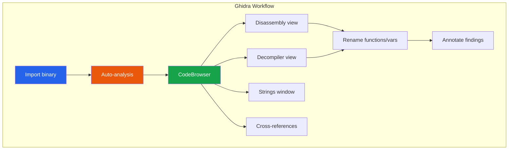
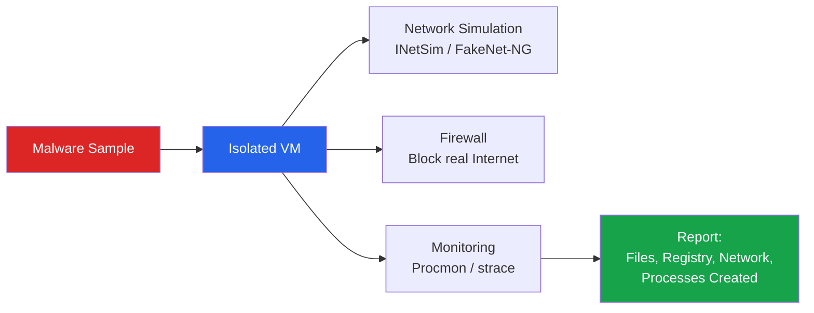
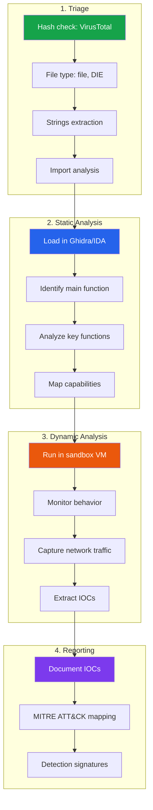

# Reverse Engineering Basics

Reverse engineering is the process of analyzing compiled software to understand what it does without access to its source code. In security, RE is used for malware analysis, vulnerability research, exploit development, and understanding proprietary protocols. It is one of the most demanding cybersecurity skills — and one of the most valuable.

This page introduces the fundamentals: enough assembly to read disassembly output, the tools that make RE possible, and the methodology that makes RE systematic rather than overwhelming.

**Related**: [Cybersecurity Overview](/cybersecurity/) | [Linux Security](/cybersecurity/linux-security) | [Practical Cryptography](/cybersecurity/cryptography-practical) | [Incident Response](/cybersecurity/incident-response-forensics)

---

## Why Reverse Engineering Matters for Security

| Use Case | What RE Reveals | Example |
|----------|----------------|---------|
| **Malware analysis** | Capabilities, C2 infrastructure, indicators of compromise | Analyzing WannaCry to understand its kill switch |
| **Vulnerability research** | Memory corruption bugs, logic flaws in closed-source software | Finding zero-days in firmware, drivers, or commercial software |
| **Exploit development** | Exact memory layout, gadget chains, bypass techniques | Building ROP chains for stack overflow exploitation |
| **Patch diffing** | What a vendor actually fixed (vs what they claim) | Comparing before/after binaries after a security patch |
| **CTF competitions** | Practicing skills in a legal, competitive environment | Crackmes, keygens, binary exploitation challenges |
| **Protocol analysis** | Proprietary protocol formats and authentication mechanisms | Understanding IoT device communication |

---

## x86/x64 Assembly Fundamentals

You do not need to write assembly. You need to read it. Every RE tool (Ghidra, IDA, GDB) shows you assembly — understanding it is the prerequisite for everything else.

### Registers

```
64-bit    32-bit    16-bit    8-bit (high/low)
RAX       EAX       AX        AH / AL          ← accumulator, return value
RBX       EBX       BX        BH / BL          ← base, general purpose
RCX       ECX       CX        CH / CL          ← counter (loops)
RDX       EDX       DX        DH / DL          ← data, I/O
RSI       ESI       SI                          ← source index
RDI       EDI       DI                          ← destination index
RBP       EBP       BP                          ← base pointer (stack frame)
RSP       ESP       SP                          ← stack pointer (top of stack)
RIP       EIP       IP                          ← instruction pointer (next instruction)
R8-R15    (x64 only)                            ← additional general purpose
```

### x64 Calling Convention (System V AMD64 — Linux)

```
Arguments:  RDI, RSI, RDX, RCX, R8, R9  (then stack)
Return:     RAX
Caller-saved: RAX, RCX, RDX, RSI, RDI, R8-R11
Callee-saved: RBX, RBP, R12-R15, RSP
```

```
Windows x64 calling convention:
Arguments:  RCX, RDX, R8, R9  (then stack, with shadow space)
Return:     RAX
```

### Essential Instructions

| Instruction | Meaning | Example |
|------------|---------|---------|
| `mov dst, src` | Copy value | `mov rax, rbx` (rax = rbx) |
| `push val` | Push to stack, decrement RSP | `push rbp` |
| `pop dst` | Pop from stack, increment RSP | `pop rbp` |
| `add dst, src` | Add | `add rax, 5` (rax += 5) |
| `sub dst, src` | Subtract | `sub rsp, 0x20` (allocate 32 bytes) |
| `xor dst, src` | XOR (used to zero registers) | `xor eax, eax` (eax = 0) |
| `and dst, src` | Bitwise AND | `and eax, 0xff` (mask lower byte) |
| `cmp a, b` | Compare (sets flags, no result stored) | `cmp eax, 0` |
| `test a, b` | Bitwise AND test (sets flags) | `test eax, eax` (check if zero) |
| `jmp addr` | Unconditional jump | `jmp 0x401000` |
| `je / jz` | Jump if equal / zero | `je target` (ZF=1) |
| `jne / jnz` | Jump if not equal / not zero | `jne target` (ZF=0) |
| `jl / jg` | Jump if less / greater (signed) | `jl smaller` |
| `jb / ja` | Jump if below / above (unsigned) | `ja bigger` |
| `call addr` | Call function (push return addr, jump) | `call 0x401234` |
| `ret` | Return from function (pop RIP) | `ret` |
| `lea dst, [addr]` | Load effective address (pointer math) | `lea rax, [rbx+rcx*4+8]` |
| `nop` | No operation | `nop` (padding, alignment) |

### Common Assembly Patterns

```nasm
; Function prologue (set up stack frame)
push rbp
mov rbp, rsp
sub rsp, 0x30        ; allocate 48 bytes for local variables

; Function epilogue (tear down stack frame)
leave                 ; equivalent to: mov rsp, rbp; pop rbp
ret

; If/else
cmp eax, 5
jle .else_branch      ; if (eax <= 5) skip to else
; ... then code ...
jmp .end_if
.else_branch:
; ... else code ...
.end_if:

; For loop: for (int i = 0; i < 10; i++)
xor ecx, ecx         ; i = 0
.loop_start:
cmp ecx, 10
jge .loop_end         ; if i >= 10, exit
; ... loop body ...
inc ecx               ; i++
jmp .loop_start
.loop_end:

; String comparison (byte by byte)
.compare:
mov al, [rsi]         ; load byte from string 1
mov bl, [rdi]         ; load byte from string 2
cmp al, bl
jne .not_equal
test al, al           ; check for null terminator
jz .equal
inc rsi
inc rdi
jmp .compare
```

---

## Static Analysis

Static analysis examines a binary without executing it. You load it into a disassembler/decompiler and study its code, strings, imports, and structure.

### Ghidra (Free, NSA-developed)



**Ghidra Essentials:**

| Action | Shortcut | Purpose |
|--------|----------|---------|
| Rename function/variable | `L` | Give meaningful names to auto-generated labels |
| Add comment | `;` | Document your understanding |
| Cross-references (xrefs) | `Ctrl+Shift+F` | Find all references to a function/address |
| Go to address | `G` | Jump to specific memory address |
| Search strings | `Search > Strings` | Find embedded strings (URLs, errors, keys) |
| Find bytes | `Search > Memory` | Search for byte patterns |
| Decompile | Automatic panel | C-like pseudocode (the most important feature) |
| Graph view | `Function Graph` | Visualize control flow |
| Undo | `Ctrl+Z` | Undo analysis changes |
| Patch bytes | Right-click > Patch | Modify binary in-place |

```bash
# Launch Ghidra
ghidraRun

# Import from command line
analyzeHeadless /path/to/project ProjectName -import binary.exe -postScript MyScript.java
```

::: tip Start with Strings
When analyzing an unknown binary, always start with the strings window (`Search > Strings`). Error messages, URLs, file paths, registry keys, and hardcoded credentials reveal enormous amounts about what the binary does.
:::

### IDA Free / IDA Pro

```
IDA is the industry standard. IDA Free supports x86/x64 and provides:
- Disassembly (no decompiler in free version)
- Cross-references
- Graph view
- String analysis
- Plugin ecosystem (IDAPython)

IDA Pro adds:
- Hex-Rays decompiler (the best decompiler available)
- Support for many architectures (ARM, MIPS, PPC)
- Debugging integration
- Team collaboration (Lumina)
```

### Binary Ninja

```
Binary Ninja offers a middle ground:
- Built-in decompiler (HLIL, MLIL, LLIL)
- Excellent API for scripting
- Cross-platform
- More affordable than IDA Pro
- Good for automation and batch analysis
```

### Static Analysis Checklist

```bash
# Before opening in Ghidra/IDA, gather basic info:

# File type
file suspicious_binary

# Strings (printable characters)
strings suspicious_binary | less
strings -e l suspicious_binary  # wide strings (Unicode)

# Shared library dependencies
ldd suspicious_binary

# Symbols (if not stripped)
nm suspicious_binary

# ELF header info
readelf -h suspicious_binary
readelf -S suspicious_binary    # sections
readelf -l suspicious_binary    # segments

# Security features
checksec suspicious_binary
# RELRO: Full, Partial, or None
# Stack Canary: found/not found
# NX: enabled/disabled
# PIE: enabled/disabled
# ASLR: OS-level, check /proc/sys/kernel/randomize_va_space
```

---

## Dynamic Analysis

Dynamic analysis runs the binary in a controlled environment and observes its behavior.

### GDB (GNU Debugger)

```bash
# Start GDB
gdb ./binary

# GDB with pwndbg or GEF (enhanced interfaces)
gdb -q ./binary

# Essential GDB commands
(gdb) run                       # Run the program
(gdb) run arg1 arg2             # Run with arguments
(gdb) break main                # Set breakpoint at main
(gdb) break *0x401234           # Set breakpoint at address
(gdb) break *main+42            # Breakpoint at offset from function
(gdb) continue                  # Continue after breakpoint
(gdb) stepi                     # Step one instruction
(gdb) nexti                     # Step over function call
(gdb) step                      # Step one source line
(gdb) finish                    # Run until function returns

# Examine memory
(gdb) x/10x $rsp               # 10 hex words at stack pointer
(gdb) x/s 0x402000              # String at address
(gdb) x/20i $rip               # 20 instructions at current IP
(gdb) x/10gx $rsp              # 10 quadwords (8-byte) at RSP

# Registers
(gdb) info registers            # Show all registers
(gdb) p $rax                    # Print RAX value
(gdb) set $rax = 1              # Modify register

# Stack
(gdb) backtrace                 # Show call stack
(gdb) info frame                # Current frame details

# Memory map
(gdb) info proc mappings        # Show memory layout

# Modify memory
(gdb) set *(int*)0x601040 = 42  # Write value to address
```

::: tip GDB Enhancement
Install `pwndbg` or `GEF` (GDB Enhanced Features). They add colored output, automatic register display, heap analysis, and many convenience commands:
```bash
# Install pwndbg
git clone https://github.com/pwndbg/pwndbg
cd pwndbg && ./setup.sh
```
:::

### ltrace and strace

```bash
# strace — trace system calls
strace ./binary                  # All syscalls
strace -e open,read,write ./binary  # Filter specific calls
strace -f ./binary               # Follow forks
strace -p 1234                   # Attach to running process
strace -e network ./binary       # Network-related calls only
strace -c ./binary               # Summary/statistics

# ltrace — trace library calls
ltrace ./binary                  # All library calls
ltrace -e strcmp,strlen ./binary  # Filter specific functions
ltrace -s 200 ./binary           # Show more string characters
```

### Dynamic Analysis in a Sandbox



```bash
# Set up network simulation
# INetSim — simulate Internet services
sudo inetsim

# FakeNet-NG — Windows-friendly network simulation
# Responds to DNS, HTTP, HTTPS, SMTP, etc.
# All traffic is captured and logged
```

---

## Decompilation, Patching, and Binary Diffing

### Decompilation

Ghidra and IDA Pro can decompile assembly back to C-like pseudocode. This is the fastest way to understand what a function does.

```c
// Example Ghidra decompiler output
// (original was compiled C, names are auto-generated)
int FUN_00401150(char *param_1) {
    int local_c;

    local_c = 0;
    while (*param_1 != '\0') {
        local_c = local_c + (int)*param_1;
        param_1 = param_1 + 1;
    }
    if (local_c == 0x4d2) {     // 1234 in decimal
        puts("Access granted!");
        return 1;
    }
    puts("Wrong password.");
    return 0;
}
// This function sums ASCII values and compares to 1234
// Now you can calculate a valid password without brute forcing
```

### Patching Binaries

```bash
# Patch with Ghidra: right-click instruction > Patch Instruction
# Example: change a conditional jump to unconditional
# Original:  74 05    (JE +5, skip over success)
# Patched:   EB 05    (JMP +5, always jump)
# Or:        90 90    (NOP NOP, fall through)

# Patch with hex editor
xxd binary | head -20
printf '\xEB' | dd of=binary bs=1 seek=4660 count=1 conv=notrunc

# Patch with radare2
r2 -w binary
[0x00401234]> s 0x00401234
[0x00401234]> wx 9090       # Write NOP NOP
[0x00401234]> quit
```

### Binary Diffing

Binary diffing compares two versions of a binary to identify changes — essential for patch analysis.

```bash
# BinDiff (IDA plugin or standalone)
# 1. Export IDB from IDA for both versions
# 2. Run BinDiff to find changed/added/removed functions

# Diaphora (free Ghidra/IDA plugin)
# Works similarly — highlights changed functions and instructions

# radare2 diffing
radiff2 old_binary new_binary

# Simple approach: compare disassembly
objdump -d old_binary > old.asm
objdump -d new_binary > new.asm
diff old.asm new.asm
```

---

## Malware Analysis Methodology



### Triage Checklist

```bash
# 1. Never analyze malware on your host — use a VM
# 2. Calculate hashes first
md5sum sample.exe
sha256sum sample.exe

# 3. Check VirusTotal (by hash, not upload)
# Upload exposes the sample — use hash API instead
curl -s "https://www.virustotal.com/api/v3/files/SHA256_HASH" \
  -H "x-apikey: YOUR_API_KEY"

# 4. Identify file type
file sample.exe
# Detect It Easy (DIE) — identify packer/compiler
diec sample.exe

# 5. Extract strings
strings -a sample.exe | grep -i "http\|password\|key\|api\|reg\|cmd"
floss sample.exe     # FLARE FLOSS extracts obfuscated strings too

# 6. Check imports — reveals capabilities
objdump -p sample.exe | grep -i "dll\|import"
# Key imports to watch for:
# CreateRemoteThread → code injection
# VirtualAllocEx → memory allocation in other process
# WriteProcessMemory → write to other process
# URLDownloadToFile → download payload
# RegSetValueEx → persistence via registry
# CreateService → persistence via service
```

### Indicators of Compromise (IOCs)

| IOC Type | Example | Where to Find |
|----------|---------|---------------|
| **File hashes** | SHA256 of malware binary | `sha256sum sample` |
| **IP addresses** | C2 server IPs | Network capture, strings |
| **Domain names** | C2 domains, DGA patterns | DNS queries, strings |
| **File paths** | Dropped files, persistence locations | Procmon, strace |
| **Registry keys** | Autorun entries | Procmon (Windows) |
| **Mutexes** | Used to prevent re-infection | API monitoring |
| **User-Agent strings** | Custom HTTP headers | Network capture |
| **YARA rules** | Pattern-based detection signatures | Write based on unique strings/bytes |

```
# Example YARA rule for detection
rule SuspiciousBinary {
    meta:
        description = "Detects suspicious binary with known C2 patterns"
        author = "Analyst"
        date = "2026-03-20"

    strings:
        $c2_domain = "evil-c2.example.com"
        $mutex = "Global\\MyMalwareMutex"
        $xor_key = { 41 42 43 44 }
        $api_1 = "VirtualAllocEx"
        $api_2 = "WriteProcessMemory"

    condition:
        uint16(0) == 0x5A4D and    // PE file
        ($c2_domain or $mutex) and
        all of ($api_*)
}
```

---

## Practice Platforms

| Platform | Focus | Difficulty |
|----------|-------|-----------|
| **Crackmes.one** | Reverse engineering challenges | Beginner to Expert |
| **Malware Traffic Analysis** | PCAP analysis with malware | Intermediate |
| **ANY.RUN** | Interactive malware sandbox | Intermediate |
| **Hack The Box** | Binary exploitation challenges | Intermediate to Expert |
| **pwnable.kr** | Binary exploitation wargames | Intermediate to Expert |
| **Flare-On (FireEye/Mandiant)** | Annual RE CTF | Advanced to Expert |

---

## Further Reading

- [Cybersecurity Overview](/cybersecurity/) — career paths and learning roadmap
- [Linux Security](/cybersecurity/linux-security) — privilege escalation, analyzing compromised systems
- [Incident Response & Forensics](/cybersecurity/incident-response-forensics) — using RE in IR workflows
- [Practical Cryptography](/cybersecurity/cryptography-practical) — analyzing crypto in binaries
- [Security Tools Encyclopedia](/cybersecurity/security-tools) — comprehensive tool reference

---

::: tip Key Takeaway
- You do not need to write assembly — you need to read it; focus on recognizing common patterns like function prologues, loops, and string comparisons
- Start every binary analysis with strings extraction and import analysis before opening a disassembler — these two steps reveal 80% of a binary's purpose
- Ghidra's decompiler is the fastest path from assembly to understanding; rename variables and functions aggressively to build comprehension
:::

::: details Hands-On Lab
**Lab: Reverse Engineer a Crackme**

1. Download a beginner crackme from crackmes.one (difficulty 1-2)
2. Run `file` and `strings` on the binary to identify its type and extract readable text
3. Check security features with `checksec` (RELRO, stack canary, NX, PIE)
4. Load the binary into Ghidra — let auto-analysis complete
5. Find the `main` function and switch to the Decompiler view
6. Identify the password validation logic in the decompiled C code
7. Determine the correct password without brute forcing — use the decompiled logic
8. Verify your answer by running the binary with the correct input
9. Bonus: Patch the binary in Ghidra to always print "Access granted" regardless of input
:::

::: details CTF Challenge
**Challenge: The License Checker**

A binary `license_check` asks for a license key. When you enter anything, it says "Invalid license." The key is validated by computing a checksum of the input and comparing it to a hardcoded value. Find the correct license key.

**Hints:**
1. The checksum function XORs each character with a rotating key
2. The expected checksum is stored as a constant in the `.rodata` section
3. The key is exactly 8 characters long and only contains uppercase letters

::: details Answer
Load in Ghidra, find the validation function. The function XORs each character of input with the bytes `[0x13, 0x37, 0x42, 0x05, 0x13, 0x37, 0x42, 0x05]` and compares against the stored bytes `[0x52, 0x56, 0x07, 0x44, 0x5E, 0x04, 0x21, 0x40]`. XOR is reversible: `0x52 ^ 0x13 = 0x41 = 'A'`, etc. The license key is `AEON_KEY` and the flag is `CTF{xor_is_not_encryption}`.
:::
:::

::: warning Common Misconceptions
- **"You need to be an expert programmer to do reverse engineering"** — You need to read code, not write it. Understanding control flow and common patterns is more important than language mastery.
- **"Obfuscation makes reverse engineering impossible"** — Obfuscation slows down analysis but never prevents it. If the CPU can execute it, a human can understand it — it just takes more time.
- **"IDA Pro is required for serious RE work"** — Ghidra (free, NSA-developed) has a world-class decompiler and handles most RE tasks. IDA Pro is excellent but not the only option.
- **"Dynamic analysis is always better than static analysis"** — Both are essential. Static analysis is safe and reveals structure; dynamic analysis reveals runtime behavior. Use both together.
:::

::: details Quiz
**1. What does the x86 instruction `xor eax, eax` do?**

a) XORs two memory values
b) Sets EAX to zero
c) Reads from memory
d) Triggers an interrupt

::: details Answer
b) XORing a register with itself always produces zero. This is a common compiler optimization for zeroing a register (more compact than `mov eax, 0`).
:::

**2. In the x64 System V calling convention (Linux), where is the first function argument passed?**

a) RAX
b) RCX
c) RDI
d) On the stack

::: details Answer
c) RDI holds the first argument, followed by RSI, RDX, RCX, R8, R9. Additional arguments go on the stack.
:::

**3. What tool would you use to monitor all system calls made by a Linux binary?**

a) Ghidra
b) strace
c) Wireshark
d) Nmap

::: details Answer
b) `strace` traces all system calls made by a process, showing file access, network connections, and memory operations in real time.
:::

**4. What is the purpose of binary diffing?**

a) Merging two binaries into one
b) Comparing two versions of a binary to identify changes
c) Encrypting a binary
d) Converting a binary to source code

::: details Answer
b) Binary diffing compares two versions of a binary (e.g., before and after a security patch) to identify exactly which functions were changed, added, or removed.
:::

**5. What does a high entropy value (> 7.0) in a PE section typically indicate?**

a) The section contains debug symbols
b) The section is compressed or encrypted (likely packed)
c) The section has many strings
d) The section is empty

::: details Answer
b) High entropy indicates data that appears random, which is characteristic of compression or encryption. Packed malware typically has sections with entropy above 7.0.
:::
:::

> **One-Liner Summary:** Reverse engineering is reading the story a compiler told in machine code — and every binary has secrets for those patient enough to read.
