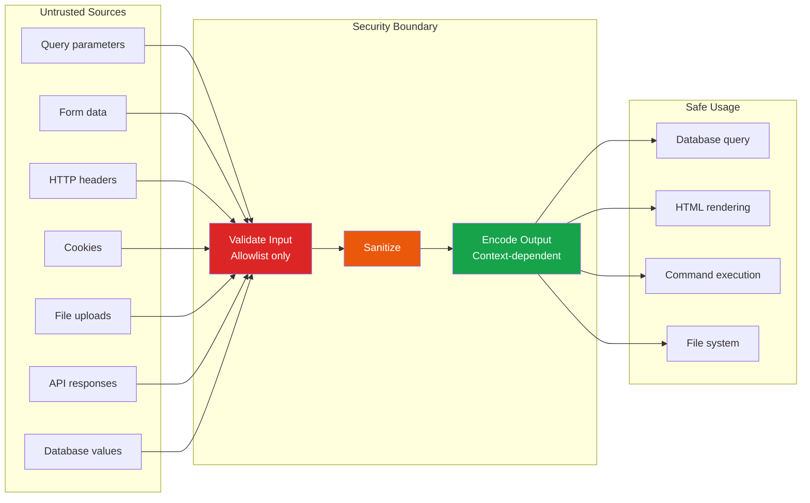

# Secure Coding Practices

The cheapest time to fix a security vulnerability is when you write the code. A bug found during development costs $10 to fix. The same bug found in production costs $10,000 — and if it becomes a breach, millions. Secure coding is not about being paranoid; it is about building habits that prevent entire classes of vulnerabilities from ever existing. This page covers the patterns, practices, and tools that make security a natural part of writing code.

**Related**: [Cybersecurity Overview](/cybersecurity/) | [Web App Pentesting](/cybersecurity/web-app-pentesting) | [OWASP Top 10](/security/owasp/) | [API Security](/security/api-security/) | [Authentication](/security/authentication/)

---

## The Core Principle: Trust No Input

Every security vulnerability can be traced to one root cause: the application trusted data it should not have. User input, HTTP headers, cookies, URL parameters, database values, API responses, file uploads — all of it is untrusted until validated.



---

## Input Validation: Allowlist over Denylist

Denylist (blocklist) validation tries to catch bad input. Allowlist validation defines exactly what good input looks like. Allowlists are always stronger because attackers constantly find new ways to bypass denylists.

### Denylist (Weak) vs Allowlist (Strong)

```python
# WEAK: Denylist — try to catch known bad patterns
def validate_username_bad(username):
    bad_chars = ["<", ">", "'", '"', ";", "--", "/*"]
    for char in bad_chars:
        if char in username:
            raise ValueError("Invalid character")
    return username
# Problem: attacker finds a character you didn't block

# STRONG: Allowlist — only permit known good patterns
import re

def validate_username_good(username):
    if not re.match(r'^[a-zA-Z0-9_]{3,20}$', username):
        raise ValueError("Username must be 3-20 alphanumeric characters or underscores")
    return username
# Only a-z, A-Z, 0-9, underscore. Everything else is rejected.
```

### Validation Patterns by Data Type

| Data Type | Allowlist Pattern | Example Regex |
|-----------|------------------|---------------|
| Username | Alphanumeric + underscore, 3-20 chars | `^[a-zA-Z0-9_]{3,20}$` |
| Email | Use a proven library, not regex | Python: `email-validator` library |
| Phone | Digits, optional +, spaces, dashes | `^\+?[\d\s\-()]{7,15}$` |
| UUID | Hex with dashes, exact format | `^[0-9a-f]{8}-[0-9a-f]{4}-[0-9a-f]{4}-[0-9a-f]{4}-[0-9a-f]{12}$` |
| Integer ID | Positive integer only | `^[1-9]\d{0,9}$` |
| URL | Protocol + domain, use URL parser | Python: `urllib.parse.urlparse()` |
| Date | ISO 8601 format | `^\d{4}-\d{2}-\d{2}$` then parse |
| File name | Alphanumeric + limited chars, no path traversal | `^[a-zA-Z0-9._-]{1,255}$` |

```javascript
// JavaScript/TypeScript validation with Zod
import { z } from 'zod';

const UserSchema = z.object({
  username: z.string().min(3).max(20).regex(/^[a-zA-Z0-9_]+$/),
  email: z.string().email(),
  age: z.number().int().min(13).max(150),
  role: z.enum(['user', 'editor']),  // Only these values allowed
  bio: z.string().max(500).optional(),
});

// This rejects anything that doesn't match exactly
const result = UserSchema.safeParse(input);
if (!result.success) {
  return { error: result.error.issues };
}
```

::: tip Validate on the Server
Client-side validation improves UX but provides zero security. Attackers bypass client-side validation trivially with Burp Suite or curl. Always validate on the server.
:::

---

## Output Encoding: Context is Everything

The same data must be encoded differently depending on where it appears in the output. Encoding for HTML does not protect against JavaScript injection, and vice versa.

### Context-Dependent Encoding

| Context | Encoding Required | Example |
|---------|------------------|---------|
| **HTML body** | HTML entity encoding | `<` becomes `&lt;` |
| **HTML attribute** | HTML attribute encoding | `"` becomes `&quot;` |
| **JavaScript string** | JavaScript hex/unicode encoding | `'` becomes `\x27` |
| **URL parameter** | Percent/URL encoding | `&` becomes `%26` |
| **CSS value** | CSS hex encoding | `(` becomes `\28` |
| **JSON** | JSON string escaping | `"` becomes `\"` |

::: code-group

```python
# Python: context-dependent encoding
from markupsafe import escape as html_escape
from urllib.parse import quote as url_encode
import json
import html

user_input = '<script>alert("xss")</script>'

# HTML context
safe_html = html.escape(user_input)
# &lt;script&gt;alert(&quot;xss&quot;)&lt;/script&gt;

# URL parameter context
safe_url = url_encode(user_input)
# %3Cscript%3Ealert%28%22xss%22%29%3C%2Fscript%3E

# JSON context
safe_json = json.dumps(user_input)
# "<script>alert(\"xss\")<\/script>"

# JavaScript string context (in a <script> tag)
# Best approach: avoid embedding user data in JS. Use data attributes instead:
# <div data-username="{​{ html_escape(username) }​}">
# Then read with: element.dataset.username
```

```javascript
// JavaScript/Node.js: Never use innerHTML with user data
// VULNERABLE
element.innerHTML = userInput;  // XSS!

// SAFE
element.textContent = userInput;  // Automatically encoded

// For templates (React, Vue):
// React: JSX auto-escapes by default
// SAFE:  <div>{userInput}</div>
// DANGEROUS: <div dangerouslySetInnerHTML={​{__html: userInput}} />

// Vue: double braces auto-escape
// SAFE:  <div>{​{ userInput }}</div>
// DANGEROUS: <div v-html="userInput"></div>
```

:::

---

## Authentication Implementation Checklist

| Requirement | Implementation | Common Mistake |
|------------|---------------|----------------|
| **Password storage** | bcrypt (cost 12+) or Argon2id | MD5, SHA256, unsalted hashes |
| **Password policy** | Min 8 chars, check against breached passwords | Requiring complexity instead of length |
| **Brute force protection** | Rate limiting + exponential backoff + account lockout | No rate limiting at all |
| **Session tokens** | 128-bit random, HttpOnly, Secure, SameSite | Sequential IDs, predictable tokens |
| **Password reset** | One-time token, 15-min expiry, invalidate after use | Token never expires, reusable |
| **MFA** | TOTP (RFC 6238) or WebAuthn, backup codes | SMS only (SIM swap vulnerable) |
| **Login errors** | Generic: "Invalid credentials" | "User not found" vs "Wrong password" |
| **Account enumeration** | Constant-time responses, same messaging | Different response time for valid vs invalid users |

```python
# Password hashing with bcrypt
import bcrypt

# Hash a password (registration)
def hash_password(password: str) -> str:
    salt = bcrypt.gensalt(rounds=12)  # Cost factor 12
    return bcrypt.hashpw(password.encode('utf-8'), salt).decode('utf-8')

# Verify a password (login)
def verify_password(password: str, hashed: str) -> bool:
    return bcrypt.checkpw(password.encode('utf-8'), hashed.encode('utf-8'))

# Check against breached passwords (Have I Been Pwned API)
import hashlib
import requests

def is_password_breached(password: str) -> bool:
    sha1 = hashlib.sha1(password.encode('utf-8')).hexdigest().upper()
    prefix, suffix = sha1[:5], sha1[5:]
    resp = requests.get(f'https://api.pwnedpasswords.com/range/{prefix}')
    return suffix in resp.text
```

---

## Secure Session Management

::: code-group

```python
# Session configuration checklist (Flask example)
app.config.update(
    SESSION_COOKIE_HTTPONLY=True,     # Prevent JS access (XSS protection)
    SESSION_COOKIE_SECURE=True,      # HTTPS only
    SESSION_COOKIE_SAMESITE='Lax',   # CSRF protection
    PERMANENT_SESSION_LIFETIME=1800,  # 30-minute timeout
    SESSION_COOKIE_NAME='__Host-session',  # Cookie prefix for extra security
)
```

```javascript
// Express.js session configuration
const session = require('express-session');

app.use(session({
  secret: process.env.SESSION_SECRET,  // From environment, never hardcoded
  name: '__Host-session',
  resave: false,
  saveUninitialized: false,
  cookie: {
    httpOnly: true,
    secure: true,           // HTTPS only
    sameSite: 'lax',
    maxAge: 30 * 60 * 1000, // 30 minutes
    domain: undefined,       // Restrict to current domain
    path: '/',
  },
}));

// Regenerate session ID after login (prevent session fixation)
app.post('/login', (req, res) => {
  // ... authenticate user ...
  req.session.regenerate((err) => {
    req.session.userId = user.id;
    req.session.save(() => res.redirect('/dashboard'));
  });
});
```

:::

---

## CSRF Protection

Cross-Site Request Forgery tricks a user's browser into making unwanted requests to a site where they are authenticated.

```python
# CSRF token implementation (framework-agnostic concept)
import secrets
import hmac

def generate_csrf_token(session_id: str) -> str:
    """Generate a CSRF token tied to the user's session."""
    random_bytes = secrets.token_hex(32)
    signature = hmac.new(
        SECRET_KEY.encode(),
        f"{session_id}:{random_bytes}".encode(),
        'sha256'
    ).hexdigest()
    return f"{random_bytes}.{signature}"

def validate_csrf_token(token: str, session_id: str) -> bool:
    """Validate the CSRF token."""
    try:
        random_bytes, signature = token.split('.')
        expected = hmac.new(
            SECRET_KEY.encode(),
            f"{session_id}:{random_bytes}".encode(),
            'sha256'
        ).hexdigest()
        return hmac.compare_digest(signature, expected)
    except (ValueError, AttributeError):
        return False
```

```html
<!-- Include CSRF token in every form -->
<form method="POST" action="/transfer">
  <input type="hidden" name="csrf_token" value="TOKEN_VALUE_HERE">
  <input type="text" name="amount">
  <button type="submit">Transfer</button>
</form>
```

### CSRF Protection Methods

| Method | How It Works | When to Use |
|--------|-------------|-------------|
| **Synchronizer token** | Random token in form + session, validated on submit | Traditional web forms |
| **Double submit cookie** | Token in cookie + header/body, compare on server | Stateless APIs |
| **SameSite cookie** | Browser prevents cross-origin cookie sending | Modern browsers, defense-in-depth |
| **Custom header** | Require custom header (e.g., `X-Requested-With`) | AJAX-only APIs (CORS blocks custom headers) |
| **Origin/Referer check** | Validate Origin header matches expected | Backup method |

---

## File Upload Security

File uploads are among the most dangerous features. An unrestricted upload can lead to remote code execution.

```python
import os
import uuid
import magic  # python-magic library

ALLOWED_EXTENSIONS = {'png', 'jpg', 'jpeg', 'gif', 'pdf'}
ALLOWED_MIME_TYPES = {'image/png', 'image/jpeg', 'image/gif', 'application/pdf'}
MAX_FILE_SIZE = 10 * 1024 * 1024  # 10 MB
UPLOAD_DIR = '/var/uploads'  # Outside web root!

def secure_upload(file_storage):
    # 1. Check file size
    file_storage.seek(0, os.SEEK_END)
    size = file_storage.tell()
    file_storage.seek(0)
    if size > MAX_FILE_SIZE:
        raise ValueError("File too large")

    # 2. Check extension (allowlist)
    original_name = file_storage.filename
    ext = original_name.rsplit('.', 1)[-1].lower() if '.' in original_name else ''
    if ext not in ALLOWED_EXTENSIONS:
        raise ValueError(f"Extension .{ext} not allowed")

    # 3. Check MIME type by reading file content (not trusting Content-Type header)
    file_content = file_storage.read()
    file_storage.seek(0)
    mime_type = magic.from_buffer(file_content, mime=True)
    if mime_type not in ALLOWED_MIME_TYPES:
        raise ValueError(f"MIME type {mime_type} not allowed")

    # 4. Generate random filename (prevent path traversal + name collision)
    safe_filename = f"{uuid.uuid4().hex}.{ext}"

    # 5. Save outside web root
    filepath = os.path.join(UPLOAD_DIR, safe_filename)
    with open(filepath, 'wb') as f:
        f.write(file_content)

    # 6. Strip metadata (for images)
    # Use Pillow to re-save, which strips EXIF data
    if ext in {'png', 'jpg', 'jpeg', 'gif'}:
        from PIL import Image
        img = Image.open(filepath)
        img.save(filepath)

    return safe_filename
```

### File Upload Checklist

| Control | Why |
|---------|-----|
| Allowlist file extensions | Prevent `.php`, `.jsp`, `.aspx` upload |
| Validate MIME type by content | Content-Type header is attacker-controlled |
| Generate random filenames | Prevent path traversal and overwrites |
| Store outside web root | Prevent direct execution |
| Set file permissions | `chmod 644` — no execute bit |
| Serve via CDN/proxy | Never serve user uploads from the same domain |
| Scan for malware | ClamAV or similar on upload |
| Strip metadata | Remove EXIF data (GPS, camera info, etc.) |
| Limit file size | Prevent DoS via large uploads |

---

## Dependency Management and SCA

Software Composition Analysis (SCA) tools find vulnerabilities in your dependencies — which represent 80-90% of your codebase.

```bash
# npm audit — Node.js dependency scanning
npm audit
npm audit fix

# pip-audit — Python dependency scanning
pip install pip-audit
pip-audit

# Snyk — multi-language SCA
snyk test
snyk monitor  # Continuous monitoring

# Trivy — container and dependency scanning
trivy fs .                         # Scan filesystem
trivy image nginx:latest          # Scan container image

# OWASP Dependency-Check
dependency-check --project "MyApp" --scan ./
```

### Dependency Security Practices

| Practice | Implementation |
|----------|---------------|
| **Lock files** | Always commit `package-lock.json`, `Pipfile.lock`, `go.sum` |
| **Automated scanning** | Dependabot, Renovate, or Snyk in CI pipeline |
| **Pin versions** | Use exact versions, not ranges (`1.2.3` not `^1.2.3`) |
| **Review updates** | Read changelogs, check for breaking changes |
| **Minimize dependencies** | Fewer deps = smaller attack surface |
| **Monitor advisories** | Subscribe to security advisories for critical deps |

---

## SAST Tools: Find Bugs Before Commit

Static Application Security Testing scans source code for vulnerability patterns.

### Semgrep

```bash
# Install Semgrep
pip install semgrep

# Run with auto-detection
semgrep --config auto .

# Run OWASP Top 10 rules
semgrep --config "p/owasp-top-ten" .

# Run language-specific rules
semgrep --config "p/python" .
semgrep --config "p/javascript" .
semgrep --config "p/typescript" .

# Custom rule example: detect hardcoded passwords
# Save as .semgrep/hardcoded-password.yml
```

```yaml
# .semgrep/hardcoded-password.yml
rules:
  - id: hardcoded-password
    patterns:
      - pattern: |
          password = "..."
      - pattern-not: |
          password = ""
      - pattern-not: |
          password = "CHANGE_ME"
    message: "Hardcoded password detected. Use environment variables or a secrets manager."
    severity: ERROR
    languages: [python, javascript, typescript]
```

### SAST Tool Comparison

| Tool | Languages | False Positive Rate | Speed | Cost |
|------|-----------|-------------------|-------|------|
| **Semgrep** | 30+ | Low (pattern-based) | Very fast | Free OSS / Team paid |
| **SonarQube** | 30+ | Medium | Moderate | Community free / Enterprise paid |
| **CodeQL** | 10+ | Low | Slow (deep analysis) | Free for OSS / GitHub Advanced Security |
| **Bandit** | Python only | Low-medium | Fast | Free |
| **ESLint security** | JavaScript/TypeScript | Low | Fast | Free |
| **Brakeman** | Ruby on Rails | Low | Fast | Free |
| **gosec** | Go | Low | Fast | Free |

### CI/CD Integration

```yaml
# GitHub Actions — Semgrep in CI
name: Security Scan
on: [push, pull_request]

jobs:
  semgrep:
    runs-on: ubuntu-latest
    steps:
      - uses: actions/checkout@v4
      - name: Run Semgrep
        uses: returntocorp/semgrep-action@v1
        with:
          config: >-
            p/owasp-top-ten
            p/javascript
            p/typescript
```

```yaml
# GitLab CI — Snyk + Semgrep
security-scan:
  stage: test
  script:
    - pip install semgrep
    - semgrep --config auto --error .
    - snyk test --severity-threshold=high
  allow_failure: false
```

---

## Secure Coding Quick Reference

| Vulnerability | Secure Pattern | See Also |
|--------------|----------------|----------|
| SQL Injection | Parameterized queries / prepared statements | [OWASP A03](/security/owasp/a03-injection) |
| XSS | Context-dependent output encoding, CSP | [API Security](/security/api-security/csp-headers) |
| CSRF | SameSite cookies + synchronizer token | Section above |
| Broken Auth | bcrypt/Argon2, rate limiting, MFA | [Authentication](/security/authentication/) |
| SSRF | Allowlist URLs, block internal ranges | [OWASP A10](/security/owasp/a10-ssrf) |
| Path Traversal | Normalize path, check prefix, use allowlist | [Input Validation](/security/api-security/input-validation) |
| Mass Assignment | Explicit allowlist of settable fields | [OWASP A04](/security/owasp/a04-insecure-design) |
| Insecure Deserialization | Never deserialize untrusted data | [OWASP A08](/security/owasp/a08-data-integrity-failures) |
| Hardcoded Secrets | Environment variables, secrets manager | [Secrets Management](/security/secrets-management/) |
| Missing Encryption | TLS 1.3, AES-256-GCM at rest | [Encryption](/security/encryption/) |

---

## Further Reading

- [Cybersecurity Overview](/cybersecurity/) — career paths and learning roadmap
- [Web App Pentesting](/cybersecurity/web-app-pentesting) — how attackers test what you build
- [OWASP Top 10](/security/owasp/) — the ten most critical web vulnerabilities
- [Authentication](/security/authentication/) — deep dives on JWT, OAuth2, sessions
- [API Security](/security/api-security/) — rate limiting, CORS, CSP, input validation
- [Secrets Management](/security/secrets-management/) — never hardcode secrets

---

::: tip Key Takeaway
- Every vulnerability traces to one root cause: trusting untrusted input — validate with allowlists, encode output based on context, and use parameterized queries for database access
- Client-side validation is UX, not security — always validate on the server because attackers bypass client-side checks trivially with Burp Suite or curl
- SAST tools like Semgrep catch vulnerability patterns before code is committed, turning security from a gate into a guardrail
:::

::: details Hands-On Lab
**Lab: Secure Coding Workshop**

1. Clone OWASP WebGoat or a similar deliberately vulnerable application
2. Identify three different vulnerability types in the source code: SQL injection, XSS, and CSRF
3. Fix each vulnerability using secure coding patterns: parameterized queries, context-dependent output encoding, and CSRF tokens
4. Set up Semgrep in your local environment and run it against the vulnerable and fixed versions
5. Verify Semgrep catches the original vulnerabilities and produces no findings on the fixed versions
6. Write a custom Semgrep rule to detect hardcoded passwords in your preferred language
7. Integrate Semgrep into a CI/CD pipeline (GitHub Actions or GitLab CI) to block PRs with security findings
8. Implement secure file upload: extension allowlist, MIME type validation by content, random filenames, and storage outside the web root
:::

::: details CTF Challenge
**Challenge: The Insecure Application**

A code review reveals the following Python Flask endpoint. Find all the vulnerabilities and write the secure version.

```python
@app.route('/search')
def search():
    query = request.args.get('q')
    results = db.execute(f"SELECT * FROM products WHERE name LIKE '%{query}%'")
    return f"<h1>Results for {query}</h1><ul>{''.join(f'<li>{r.name}</li>' for r in results)}</ul>"
```

**Hints:**
1. Count the distinct vulnerability types (there are at least 3)
2. The fix requires parameterized queries, output encoding, and input validation

::: details Answer
Vulnerabilities: (1) SQL Injection via string interpolation in the query, (2) Reflected XSS via unencoded `query` in the HTML response, (3) No input validation on the `query` parameter. Secure version: use `db.execute("SELECT * FROM products WHERE name LIKE ?", ('%' + query + '%',))` for parameterized queries, `html.escape(query)` for XSS prevention, and add input length validation. Flag: `CTF{parameterize_encode_validate}`.
:::
:::

::: warning Common Misconceptions
- **"Input validation prevents SQL injection"** — Input validation is defense-in-depth but not sufficient. Parameterized queries (prepared statements) are the primary defense because they separate code from data.
- **"Using a framework means my code is secure"** — Frameworks provide security features (auto-escaping, CSRF tokens, ORM), but developers must use them correctly. Disabling auto-escaping, using raw queries, or misconfiguring CORS defeats the framework's protections.
- **"Encoding and sanitization are the same thing"** — Encoding transforms special characters for safe rendering in a specific context. Sanitization removes or modifies unwanted content. They serve different purposes and are not interchangeable.
- **"Security is the security team's job, not developers'"** — The cheapest fix is at development time ($10 per bug). The most expensive is in production ($10,000+). Developers who write secure code prevent more breaches than any amount of pentesting.
- **"SAST tools produce too many false positives to be useful"** — Modern tools like Semgrep have low false positive rates because they use pattern-based matching rather than abstract analysis. Tune rules and start with high-severity findings.
:::

::: details Quiz
**1. What is the primary defense against SQL injection?**

a) Input validation with a denylist
b) Parameterized queries (prepared statements)
c) Web Application Firewall
d) HTTPS encryption

::: details Answer
b) Parameterized queries separate SQL code from data, making it impossible for user input to be interpreted as SQL commands. The database engine treats parameters as literal values, never as executable code.
:::

**2. Why must output encoding be context-dependent?**

a) Different browsers require different encoding
b) The same data needs different encoding for HTML body, HTML attributes, JavaScript, URLs, and CSS contexts
c) Context-dependent encoding is faster
d) It is a framework requirement

::: details Answer
b) `<script>` encoded for HTML body becomes `&lt;script&gt;`, but in a JavaScript string context it needs `\x3Cscript\x3E`. Using the wrong encoding for the context leaves the application vulnerable.
:::

**3. What is the most secure way to store user passwords?**

a) SHA-256 with a salt
b) bcrypt with cost factor 12+ or Argon2id
c) AES-256 encryption
d) Base64 encoding

::: details Answer
b) bcrypt and Argon2id are intentionally slow password hashing algorithms that resist GPU-accelerated cracking. SHA-256 is too fast (billions of hashes per second on modern GPUs).
:::

**4. What makes SameSite cookies effective against CSRF?**

a) They encrypt the cookie value
b) The browser will not send the cookie with cross-origin requests, preventing forged requests from including authentication
c) They expire faster
d) They are harder to steal via XSS

::: details Answer
b) SameSite=Lax or SameSite=Strict tells the browser not to include the cookie in requests originating from other domains, which is exactly what CSRF attacks rely on.
:::

**5. What type of security testing analyzes source code without executing it?**

a) DAST (Dynamic Application Security Testing)
b) SAST (Static Application Security Testing)
c) IAST (Interactive Application Security Testing)
d) Penetration Testing

::: details Answer
b) SAST analyzes source code, bytecode, or binaries for vulnerability patterns without executing the application. It catches bugs early in the development lifecycle before code is deployed.
:::
:::

> **One-Liner Summary:** Secure coding is not about being paranoid — it is about building the habit of never trusting input, always encoding output, and letting tools catch what humans miss.
