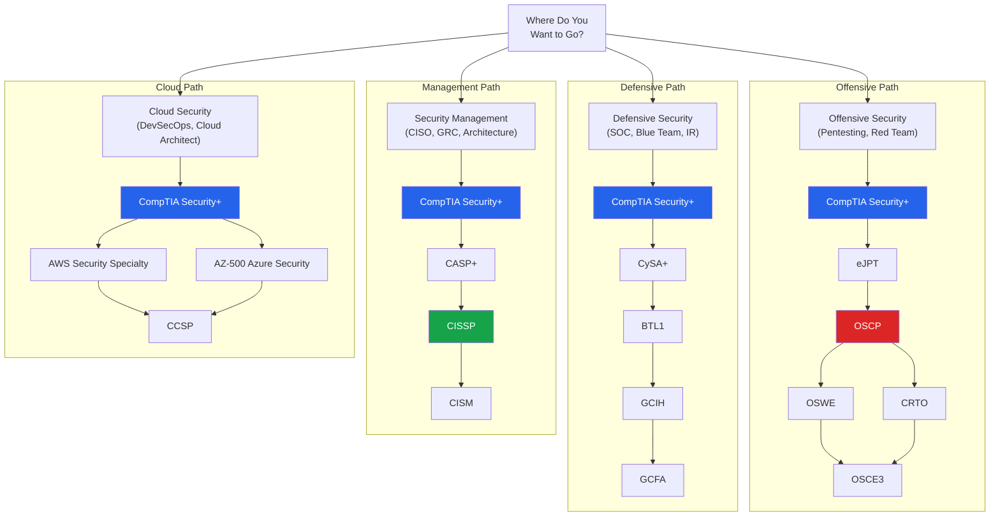
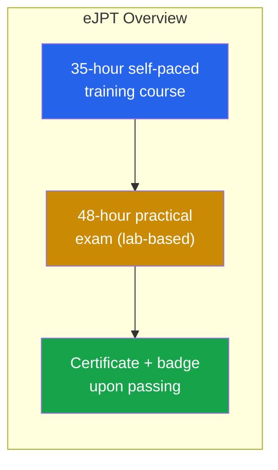
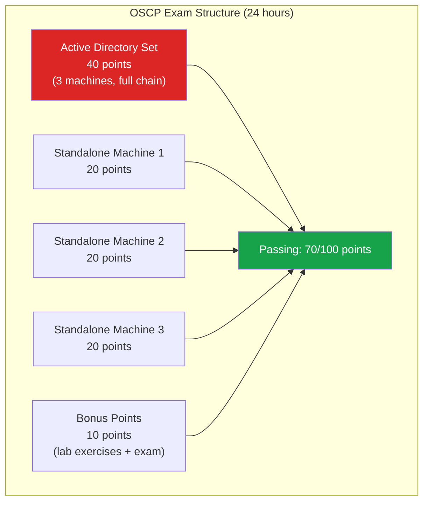
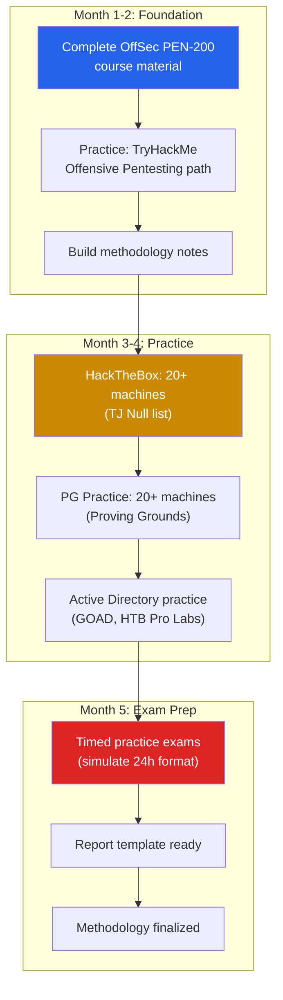
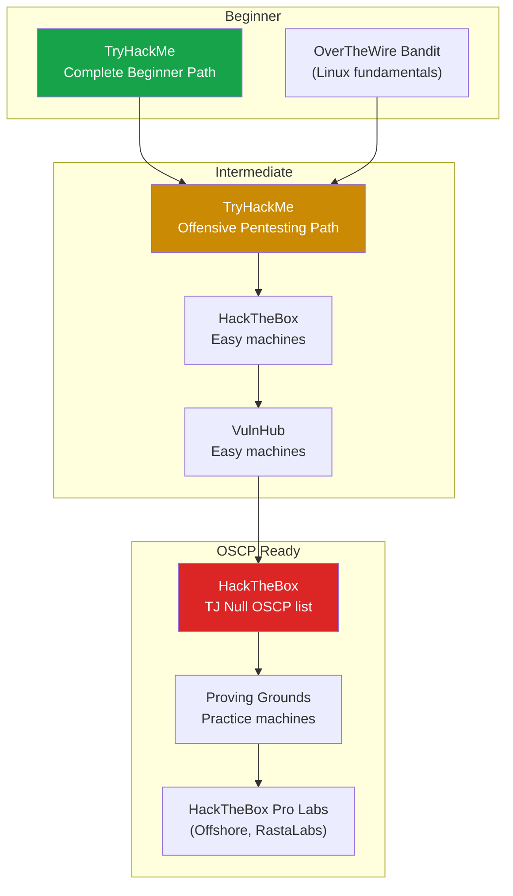

# Security Certification Roadmap

Security certifications validate your knowledge, open doors to interviews, and provide structured learning paths. But not all certifications are equal — some are respected industry-wide, others are checkbox exercises. This page breaks down every major security certification by career path, compares their value, and provides a concrete preparation strategy for the most important ones.

The cybersecurity certification landscape can be overwhelming. This guide cuts through the noise and tells you exactly which certifications to pursue based on your career goals, experience level, and budget.

**Related**: [Cybersecurity Overview](/cybersecurity/) | [Bug Bounty Hunting](/cybersecurity/bug-bounty) | [Blue Team & SOC](/cybersecurity/blue-team-soc) | [Red Team Operations](/cybersecurity/red-team-ops)

---

## Certification Path by Career Goal

---

## Entry-Level Certifications

### CompTIA Security+

The industry-standard entry-level security certification. Required or preferred for most security positions. DoD 8570 compliant for IAT Level II.

| Aspect | Details |
|--------|---------|
| **Exam Code** | SY0-701 (current version) |
| **Format** | 90 questions (MCQ + PBQ), 90 minutes |
| **Passing Score** | 750/900 |
| **Cost** | ~$400 USD |
| **Prerequisites** | None (2+ years IT experience recommended) |
| **Renewal** | Every 3 years (50 CEUs) |
| **Difficulty** | Entry level |
| **Value** | High — universally recognized, many jobs require it |

**Domains covered:**

| Domain | Weight | Topics |
|--------|--------|--------|
| General Security Concepts | 12% | CIA triad, security controls, change management |
| Threats, Vulnerabilities, and Mitigations | 22% | Threat actors, attack types, vulnerability management |
| Security Architecture | 18% | Network security, cloud, virtualization, IoT |
| Security Operations | 28% | Monitoring, incident response, automation, forensics |
| Security Program Management | 20% | Governance, risk, compliance, security awareness |

::: tip Security+ Preparation Strategy
1. **Study time:** 4-8 weeks, 2-3 hours daily
2. **Primary resource:** Professor Messer (free YouTube course) + Jason Dion practice exams
3. **Supplement:** CompTIA CertMaster Labs or TryHackMe Security+ path
4. **Practice exams:** Take at least 5 full practice exams, aim for consistent 85%+
5. **Performance-based questions (PBQs):** Practice configuring firewalls, analyzing logs, setting permissions
:::

### CompTIA CySA+ (Cybersecurity Analyst)

Blue team focused — covers threat detection, analysis, and incident response.

| Aspect | Details |
|--------|---------|
| **Exam Code** | CS0-003 |
| **Format** | 85 questions, 165 minutes |
| **Passing Score** | 750/900 |
| **Cost** | ~$400 USD |
| **Prerequisites** | Security+ recommended |
| **Difficulty** | Intermediate |
| **Value** | Good for SOC analyst and blue team roles |

### CompTIA PenTest+

Penetration testing focused — practical methodology and tools.

| Aspect | Details |
|--------|---------|
| **Exam Code** | PT0-002 |
| **Format** | 85 questions (MCQ + PBQ), 165 minutes |
| **Passing Score** | 750/900 |
| **Cost** | ~$400 USD |
| **Prerequisites** | Security+ recommended |
| **Difficulty** | Intermediate |
| **Value** | Moderate — less respected than OSCP but easier to obtain |

### eLearnSecurity eJPT (Junior Penetration Tester)

| Aspect | Details |
|--------|---------|
| **Provider** | INE (formerly eLearnSecurity) |
| **Format** | 48-hour practical lab exam |
| **Cost** | ~$250 USD (exam) or included with INE subscription |
| **Prerequisites** | None |
| **Difficulty** | Entry level |
| **Value** | Good stepping stone to OSCP, proves basic practical skills |

---

## CEH vs OSCP vs eJPT — The Great Debate

This is the most common comparison in offensive security certifications.

| Aspect | eJPT | CEH | OSCP |
|--------|------|-----|------|
| **Provider** | INE | EC-Council | OffSec |
| **Exam Type** | Practical lab (48h) | Multiple choice (4h) | Practical lab (24h) + report |
| **Cost** | ~$250 | ~$1,200+ | ~$1,600+ |
| **Difficulty** | Easy | Medium (memorization) | Very Hard |
| **Industry Respect** | Growing | Moderate (controversial) | Very High |
| **Proves** | Basic hands-on skills | Theoretical knowledge | Real-world exploitation |
| **HR Filter** | Sometimes | Often required by HR | Gold standard |
| **Best For** | Beginners, first cert | Checkbox requirements, HR compliance | Actual pentest jobs |
| **Time to Prepare** | 2-4 weeks | 4-8 weeks | 3-6 months |

::: warning The CEH Controversy
The CEH is widely criticized in the security community for being overly theoretical with outdated content. However, it remains on many job descriptions because HR departments recognize the name. If a job posting requires "CEH or equivalent," the OSCP is always the better equivalent. Some organizations require CEH specifically for compliance (e.g., DoD 8570).
:::

---

## OSCP Deep Dive

The Offensive Security Certified Professional (OSCP) is the gold standard certification for penetration testers. It is a grueling 24-hour practical exam that tests real exploitation skills.

### Exam Format

| Component | Details |
|-----------|---------|
| **Exam duration** | 23 hours 45 minutes (exam) + 24 hours (report) |
| **Passing score** | 70/100 points |
| **AD set** | 3 machines forming a domain (40 points, all-or-nothing) |
| **Standalones** | 3 independent machines (20 points each, partial credit: 10 for local, 10 for root) |
| **Bonus points** | Up to 10 points for completing lab exercises |
| **Report** | Professional pentest report required (can fail with enough points but bad report) |
| **Proctored** | Yes, screen and webcam recorded |
| **Allowed tools** | Most tools allowed; no commercial tools, no auto-exploitation (Metasploit restricted to one machine) |

### OSCP Preparation Strategy

### Essential Skills for OSCP

| Skill | Why | Practice |
|-------|-----|---------|
| **Enumeration** | 90% of the exam is enumeration | Nmap, gobuster, enum4linux, SMB enumeration |
| **Web exploitation** | At least 1-2 machines will be web-based | SQLi, file upload, LFI, command injection |
| **Linux privilege escalation** | Most standalones require privesc | SUID, capabilities, cron, kernel exploits |
| **Windows privilege escalation** | AD set is all Windows | Services, SeImpersonatePrivilege, UAC bypass |
| **Active Directory** | 40 points depend on AD | BloodHound, Kerberoasting, PtH, lateral movement |
| **Buffer overflow** | May appear as a standalone | Stack-based BOF methodology |
| **Tunneling/Pivoting** | Required for AD set | Chisel, ligolo-ng, SSH tunnels, proxychains |
| **Report writing** | Bad report = fail even with enough points | Practice writing during every lab machine |

::: tip OSCP Exam Day Tips
1. **Start with the AD set** — 40 points, high ROI
2. **Take breaks** — Eat, stretch, step away when stuck. Fresh eyes solve problems
3. **Screenshot everything** — Every command, every flag, every proof.txt
4. **Time management** — If stuck for 2 hours on one machine, move on
5. **No rabbit holes** — If something seems too complex, it probably is not the right path
6. **Sleep** — A 4-hour nap in the middle is worth more than 4 hours of exhausted staring
7. **Report immediately** — Start the report during the exam, not after
:::

---

## CISSP (Management Track)

The Certified Information Systems Security Professional is the premier certification for security management, architecture, and leadership roles. Most CISO job postings list CISSP as required.

| Aspect | Details |
|--------|---------|
| **Provider** | ISC2 |
| **Format** | 125-175 adaptive questions, 4 hours |
| **Passing Score** | 700/1000 |
| **Cost** | ~$750 USD |
| **Prerequisites** | 5 years professional experience in 2+ of 8 domains (or 4 years + relevant degree) |
| **Renewal** | Every 3 years (40 CPE credits/year) |
| **Difficulty** | Expert (breadth over depth) |
| **Value** | Very high for management roles, CISO track |

### CISSP Domains

| Domain | Weight | Focus |
|--------|--------|-------|
| Security and Risk Management | 15% | Governance, compliance, risk, legal |
| Asset Security | 10% | Data classification, ownership, retention |
| Security Architecture and Engineering | 13% | Design principles, crypto, physical security |
| Communication and Network Security | 13% | Network architecture, secure channels |
| Identity and Access Management | 13% | Authentication, authorization, identity federation |
| Security Assessment and Testing | 12% | Assessment strategies, audit, testing |
| Security Operations | 13% | Incident response, disaster recovery, forensics |
| Software Development Security | 11% | SDLC security, application vulnerabilities |

::: tip CISSP Mindset
The CISSP tests whether you think like a security **manager**, not a technician. Key principles:
- **Protect life safety first** — Always the top priority
- **Think like a risk advisor** — Cost-benefit analysis, not perfection
- **Choose the BEST answer** — Multiple answers may be correct; pick the one a CISO would recommend
- **Process over technology** — Governance and frameworks before tools
- **Least privilege, defense in depth** — Apply everywhere
:::

---

## Cloud Security Certifications

### AWS Certified Security - Specialty

| Aspect | Details |
|--------|---------|
| **Format** | 65 questions, 170 minutes |
| **Cost** | ~$300 USD |
| **Prerequisites** | AWS experience recommended (2+ years security) |
| **Domains** | Incident response, logging/monitoring, infrastructure security, IAM, data protection |
| **Difficulty** | Advanced |
| **Value** | High for AWS-focused roles |

### Microsoft AZ-500 (Azure Security Engineer)

| Aspect | Details |
|--------|---------|
| **Format** | 40-60 questions, 150 minutes |
| **Cost** | ~$165 USD |
| **Prerequisites** | AZ-104 recommended |
| **Domains** | Identity/access, network security, compute security, data security |
| **Difficulty** | Intermediate-Advanced |
| **Value** | High for Azure-focused organizations |

### Google Professional Cloud Security Engineer

| Aspect | Details |
|--------|---------|
| **Format** | 50-60 questions, 120 minutes |
| **Cost** | ~$200 USD |
| **Prerequisites** | GCP experience recommended |
| **Difficulty** | Advanced |
| **Value** | Good for GCP-focused roles, growing market |

### CCSP (Certified Cloud Security Professional)

| Aspect | Details |
|--------|---------|
| **Provider** | ISC2 |
| **Format** | 150 questions, 4 hours |
| **Cost** | ~$600 USD |
| **Prerequisites** | 5 years IT experience (3 in security, 1 in cloud) |
| **Difficulty** | Advanced |
| **Value** | High — vendor-neutral cloud security |

---

## Advanced Offensive Certifications

| Certification | Provider | Focus | Exam | Cost | Difficulty |
|--------------|----------|-------|------|------|------------|
| **OSWE** | OffSec | Web application exploitation | 48h practical | ~$1,600 | Expert |
| **OSEP** | OffSec | Advanced evasion, custom tools | 48h practical | ~$1,600 | Expert |
| **OSED** | OffSec | Windows exploit development | 48h practical | ~$1,600 | Expert |
| **OSCE3** | OffSec | OSWE + OSEP + OSED combined | All three exams | ~$5,000+ | Expert |
| **CRTO** | Zero-Point Security | Red team ops, Cobalt Strike | 48h practical | ~$450 | Advanced |
| **CRTL** | Zero-Point Security | Advanced red team, evasion | 48h practical | ~$450 | Expert |
| **GPEN** | SANS | Penetration testing | 115 questions, 3h | ~$8,500 (with course) | Advanced |
| **GXPN** | SANS | Advanced exploitation | 60 questions, 3h | ~$8,500 (with course) | Expert |

---

## Advanced Defensive Certifications

| Certification | Provider | Focus | Exam | Cost | Difficulty |
|--------------|----------|-------|------|------|------------|
| **GCIH** | SANS | Incident handling, hacker tools | 106 questions, 4h | ~$8,500 (with course) | Advanced |
| **GCFA** | SANS | Advanced forensics | 82 questions, 3h | ~$8,500 (with course) | Expert |
| **GNFA** | SANS | Network forensics | 66 questions, 3h | ~$8,500 (with course) | Expert |
| **GREM** | SANS | Reverse engineering malware | 66 questions, 2h | ~$8,500 (with course) | Expert |
| **BTL1** | Security Blue Team | Blue team level 1 | 24h practical | ~$500 | Intermediate |
| **BTL2** | Security Blue Team | Blue team level 2 | 48h practical | ~$800 | Advanced |
| **CDSA** | HTB Academy | Certified Defensive Security Analyst | Practical | ~$200 | Intermediate |

::: warning SANS Certification Costs
SANS certifications (GIAC) are world-class but extremely expensive. A single course + exam costs ~$8,500. Many employers sponsor SANS training. If paying out of pocket, consider OffSec or Security Blue Team certifications for better ROI.
:::

---

## Free Resources and Practice Labs

### Learning Platforms

| Platform | Type | Best For | Cost |
|----------|------|----------|------|
| **TryHackMe** | Guided rooms and paths | Beginners, structured learning | Free tier + $14/mo |
| **HackTheBox** | Challenge machines | Intermediate-advanced, OSCP prep | Free tier + $14/mo |
| **HackTheBox Academy** | Structured courses | CPTS certification path | Free tier + paid |
| **PentesterLab** | Web security exercises | Web app pentesting, OSWE prep | $20/mo |
| **PortSwigger Web Academy** | Web security labs | Web vulnerabilities, free | Free |
| **CyberDefenders** | Blue team challenges | DFIR, threat hunting | Free |
| **LetsDefend** | SOC analyst simulator | SOC operations, alert triage | Free tier + $25/mo |
| **OverTheWire** | Linux wargames | Linux fundamentals | Free |
| **VulnHub** | Downloadable VMs | Offline practice | Free |
| **Immersive Labs** | Cyber exercises | Enterprise training | Free for students |

### Free Courses

| Course | Provider | Topics | Length |
|--------|----------|--------|--------|
| **Security+ Full Course** | Professor Messer (YouTube) | Complete SY0-701 content | 25+ hours |
| **Introduction to Cybersecurity** | Cisco Networking Academy | Security fundamentals | 15 hours |
| **CS50 Cybersecurity** | Harvard (edX) | Security concepts | Self-paced |
| **MITRE ATT&CK Training** | MITRE (online) | Threat intelligence, ATT&CK | Self-paced |
| **Splunk Fundamentals** | Splunk Education | SIEM basics | 12 hours |
| **AWS Security Fundamentals** | AWS Skill Builder | Cloud security basics | 4 hours |

### Practice Labs for OSCP Preparation

### TJ Null's OSCP-Like Machines

| Platform | Count | Difficulty | Focus |
|----------|-------|-----------|-------|
| HackTheBox (Retired) | 50+ | Easy-Hard | Linux + Windows exploitation |
| Proving Grounds (Practice) | 30+ | Intermediate-Hard | Realistic OSCP-style |
| VulnHub | 20+ | Easy-Medium | Offline practice |

---

## Certification Comparison by ROI

| Certification | Cost | Salary Increase | Time to Prepare | Job Requirement Frequency | ROI Score |
|--------------|------|-----------------|-----------------|--------------------------|-----------|
| **Security+** | $400 | +$5-10K | 4-8 weeks | Very High | Excellent |
| **OSCP** | $1,600 | +$15-30K | 3-6 months | High (pentest roles) | Excellent |
| **CISSP** | $750 | +$20-40K | 3-6 months | Very High (management) | Excellent |
| **AWS Security** | $300 | +$10-20K | 4-8 weeks | High (cloud roles) | Very Good |
| **CySA+** | $400 | +$5-15K | 4-6 weeks | Medium | Good |
| **CEH** | $1,200 | +$5-10K | 4-6 weeks | Medium (HR filter) | Moderate |
| **GCIH** | $8,500 | +$15-25K | 8-12 weeks | Medium | Moderate (unless sponsored) |
| **CRTO** | $450 | +$10-20K | 4-8 weeks | Growing | Very Good |

---

## Building Your Certification Plan

### Step-by-Step Approach

| Year | Offensive Track | Defensive Track | Management Track |
|------|----------------|-----------------|------------------|
| **Year 1** | Security+ then eJPT | Security+ then CySA+ | Security+ |
| **Year 2** | OSCP | BTL1 then GCIH | CASP+ or CCSP |
| **Year 3** | CRTO or OSWE | GCFA or BTL2 | CISSP |
| **Year 4+** | OSCE3 | GREM or specialized SANS | CISM or CCSP |

::: tip Certification Is Not a Substitute for Skills
Certifications open doors, but skills keep you employed. The best approach:
1. **Build skills first** — Practice in labs, do CTFs, build projects
2. **Certify to validate** — Take the exam when you can already pass
3. **Never stop learning** — Certifications expire; skills compound
4. **Portfolio matters** — Blog posts, GitHub repos, and CTF rankings complement certifications
:::

---

## Further Reading

- [Cybersecurity Overview](/cybersecurity/) — Career paths and learning stack
- [Web App Pentesting](/cybersecurity/web-app-pentesting) — Core skill for OSCP
- [Active Directory](/cybersecurity/active-directory) — Critical for OSCP AD set
- [Blue Team & SOC](/cybersecurity/blue-team-soc) — Skills for CySA+, GCIH, BTL1
- [Bug Bounty Hunting](/cybersecurity/bug-bounty) — Real-world practice alongside certification study
- [Malware Analysis](/cybersecurity/malware-analysis) — Skills for GREM certification
