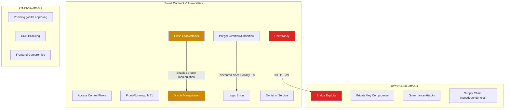
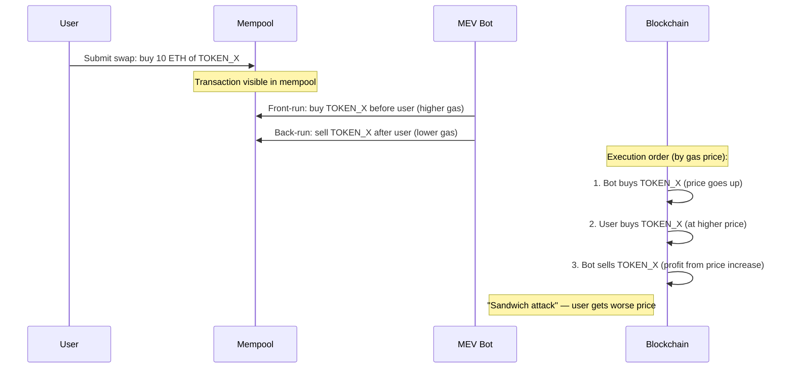
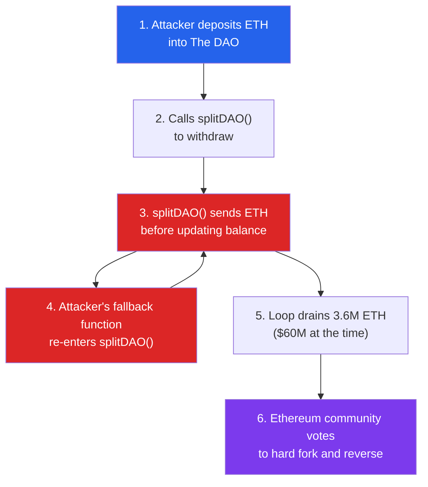
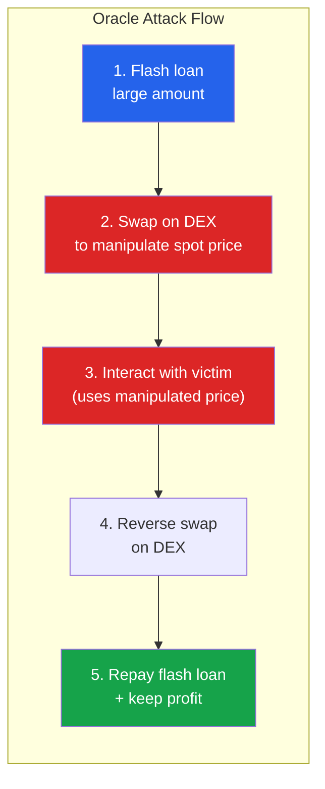
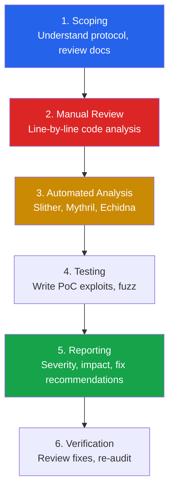

# Web3 & Smart Contract Security

Smart contracts are immutable programs that control billions of dollars in digital assets. Unlike traditional software where you can patch a vulnerability after deployment, a vulnerable smart contract is permanently exploitable unless explicitly designed with upgrade mechanisms. The stakes are absolute: a single bug can drain an entire protocol's treasury in a single transaction.

Since 2016, over $10 billion has been lost to smart contract exploits, bridge hacks, and DeFi protocol attacks. This page covers the vulnerability classes, auditing methodology, real-world case studies, and tools used by smart contract security researchers and auditors.

**Related**: [Cybersecurity Overview](/cybersecurity/) | [Web App Pentesting](/cybersecurity/web-app-pentesting) | [Practical Cryptography](/cybersecurity/cryptography-practical) | [Bug Bounty](/cybersecurity/bug-bounty)

::: danger Immutable Code, Permanent Risk
Smart contracts cannot be patched after deployment (unless they use a proxy pattern). A vulnerability discovered post-deployment may result in total loss of funds. Security audits before deployment are not optional — they are existential.
:::

---

## Smart Contract Attack Surface



---

## Solidity Vulnerabilities

### Reentrancy

The most famous smart contract vulnerability. An external call to an untrusted contract allows that contract to call back into the vulnerable function before the first execution completes.

```solidity
// VULNERABLE — state updated after external call
contract VulnerableVault {
    mapping(address => uint256) public balances;

    function withdraw() external {
        uint256 amount = balances[msg.sender];
        require(amount > 0, "No balance");

        // External call BEFORE state update — reentrancy vulnerability
        (bool success, ) = msg.sender.call{value: amount}("");
        require(success, "Transfer failed");

        // State updated AFTER external call — attacker re-enters before this line
        balances[msg.sender] = 0;
    }
}

// ATTACKER contract
contract Attacker {
    VulnerableVault public vault;

    constructor(address _vault) {
        vault = VulnerableVault(_vault);
    }

    // Fallback function — called when ETH is received
    receive() external payable {
        if (address(vault).balance >= 1 ether) {
            vault.withdraw();  // Re-enter withdraw() before balance is zeroed
        }
    }

    function attack() external payable {
        vault.deposit{value: 1 ether}();
        vault.withdraw();  // First call — triggers reentrancy loop
    }
}
```

```solidity
// SECURE — Checks-Effects-Interactions pattern
contract SecureVault {
    mapping(address => uint256) public balances;

    function withdraw() external {
        uint256 amount = balances[msg.sender];
        require(amount > 0, "No balance");

        // Effect: update state BEFORE external call
        balances[msg.sender] = 0;

        // Interaction: external call AFTER state update
        (bool success, ) = msg.sender.call{value: amount}("");
        require(success, "Transfer failed");
    }
}

// Even more secure — use ReentrancyGuard from OpenZeppelin
import "@openzeppelin/contracts/security/ReentrancyGuard.sol";

contract SecureVaultV2 is ReentrancyGuard {
    mapping(address => uint256) public balances;

    function withdraw() external nonReentrant {
        uint256 amount = balances[msg.sender];
        require(amount > 0, "No balance");
        balances[msg.sender] = 0;
        (bool success, ) = msg.sender.call{value: amount}("");
        require(success, "Transfer failed");
    }
}
```

::: tip Checks-Effects-Interactions Pattern
The fundamental defense against reentrancy:
1. **Checks** — Validate all conditions (require statements)
2. **Effects** — Update all state variables
3. **Interactions** — Make external calls last
:::

### Integer Overflow / Underflow

Before Solidity 0.8, arithmetic operations silently wrapped around on overflow/underflow. Since 0.8, overflow reverts by default.

```solidity
// Pre-Solidity 0.8 — VULNERABLE
contract VulnerableToken {
    mapping(address => uint256) public balances;

    function transfer(address to, uint256 amount) external {
        // If balances[msg.sender] = 0 and amount = 1:
        // 0 - 1 = 2^256 - 1 (max uint256) — underflow!
        balances[msg.sender] -= amount;
        balances[to] += amount;
    }
}

// Post-Solidity 0.8 — safe by default (reverts on overflow)
// But 'unchecked' blocks bypass this protection
contract ModernToken {
    mapping(address => uint256) public balances;

    function unsafeTransfer(address to, uint256 amount) external {
        unchecked {
            // DANGEROUS — overflow/underflow not checked
            balances[msg.sender] -= amount;
            balances[to] += amount;
        }
    }
}
```

### Access Control Flaws

Missing or incorrect access control is the simplest but most common vulnerability class.

```solidity
// VULNERABLE — anyone can call administrative functions
contract VulnerableAdmin {
    address public owner;
    bool public paused;

    // Missing access control — anyone can change owner
    function setOwner(address newOwner) external {
        owner = newOwner;
    }

    // Missing access control — anyone can drain funds
    function withdrawAll() external {
        payable(msg.sender).transfer(address(this).balance);
    }
}

// SECURE — proper access control
contract SecureAdmin {
    address public owner;

    modifier onlyOwner() {
        require(msg.sender == owner, "Not owner");
        _;
    }

    function setOwner(address newOwner) external onlyOwner {
        require(newOwner != address(0), "Zero address");
        owner = newOwner;
    }

    function withdrawAll() external onlyOwner {
        payable(owner).transfer(address(this).balance);
    }
}
```

### Front-Running / MEV

Transactions in the mempool are visible before execution. Miners/validators and MEV bots can reorder, insert, or censor transactions for profit.



| MEV Type | Description | Profit Source |
|----------|-------------|---------------|
| **Sandwich Attack** | Front-run + back-run a swap | User pays higher price |
| **Arbitrage** | Cross-DEX price differences | Market inefficiency |
| **Liquidation** | Front-run liquidation calls | Liquidation bonus |
| **JIT Liquidity** | Add liquidity just-in-time for a large swap | Swap fees |
| **Time-bandit** | Reorg blocks to steal MEV | Historical transactions |

---

## DeFi Exploit Case Studies

### Major Exploits Timeline

| Year | Exploit | Loss | Vulnerability | ATT&CK |
|------|---------|------|---------------|---------|
| 2016 | **The DAO** | $60M | Reentrancy | Smart contract flaw |
| 2020 | **bZx** | $8M | Flash loan + oracle manipulation | Price oracle |
| 2021 | **Poly Network** | $611M | Access control (recovered) | Cross-chain |
| 2022 | **Wormhole Bridge** | $326M | Signature verification bypass | Bridge |
| 2022 | **Ronin Bridge** | $625M | Private key compromise (5/9 validators) | Key management |
| 2022 | **Nomad Bridge** | $190M | Merkle root initialization flaw | Bridge |
| 2023 | **Euler Finance** | $197M | Donation attack + liquidation logic | Flash loan |
| 2023 | **Multichain** | $126M | Centralized key management | Infrastructure |

### Case Study: The DAO (2016)

The attack that led to the Ethereum/Ethereum Classic hard fork.



### Case Study: Wormhole Bridge (2022)

```solidity
// Simplified vulnerability — signature verification bypass
// The guardian set verification could be bypassed because
// the 'verify_signatures' instruction accepted a fabricated
// SignatureSet account

// Attacker created a fake SignatureSet with valid-looking data
// bypassing the verification that messages came from guardians

// Impact: Attacker minted 120,000 wETH ($326M) on Solana
// without depositing any ETH on Ethereum
```

---

## Oracle Manipulation

Price oracles feed external data (prices, randomness) to smart contracts. Manipulating an oracle lets attackers trick protocols into using incorrect prices.



| Oracle Type | Risk Level | Example |
|-------------|-----------|---------|
| **Spot price (single DEX)** | Critical | Uniswap `getReserves()` — trivially manipulable |
| **TWAP (Time-Weighted Average)** | Medium | Uniswap V3 TWAP — harder but not impossible |
| **Chainlink feeds** | Low | Decentralized oracle network — multiple data sources |
| **Band Protocol** | Low | Cross-chain oracle with economic incentives |

::: warning Never Use Spot Prices as Oracles
Using `getReserves()` or similar single-block price sources is the most common oracle vulnerability. Always use time-weighted averages (TWAP) or decentralized oracles like Chainlink.
:::

---

## Bridge Security

Cross-chain bridges are the highest-value targets in Web3. They hold locked assets on one chain while minting wrapped assets on another.

| Bridge Architecture | How It Works | Risk |
|--------------------|-------------|------|
| **Lock-and-Mint** | Lock on Chain A, mint on Chain B | If mint verification fails, unlimited minting |
| **Burn-and-Mint** | Burn on Chain A, mint on Chain B | If burn is faked, unlimited minting |
| **Liquidity Pool** | Swap between pools on each chain | If pool is drained, insolvency |
| **Validator Set** | N-of-M validators attest to transactions | If M/2+1 validators compromised, game over |

---

## Smart Contract Auditing Methodology

### Audit Process



### Audit Checklist

| Category | Check | Severity if Missing |
|----------|-------|-------------------|
| **Reentrancy** | All external calls follow CEI pattern | Critical |
| **Access Control** | All admin functions have proper modifiers | Critical |
| **Input Validation** | All inputs validated (zero address, bounds) | High |
| **Oracle Security** | Price feeds use TWAP or Chainlink, not spot | Critical |
| **Flash Loan** | Protocol logic safe against atomic composability | Critical |
| **Integer Safety** | Solidity 0.8+ or SafeMath used | High |
| **Front-Running** | Commit-reveal or private mempools for sensitive ops | Medium |
| **Centralization** | Multi-sig for admin, timelock for upgrades | High |
| **Upgrade Safety** | Storage layout preserved across upgrades | Critical |
| **Gas Griefing** | No unbounded loops, no external call in loops | Medium |

---

## Security Tools

### Static Analysis

```bash
# Slither — static analysis framework by Trail of Bits
pip install slither-analyzer
slither contracts/ --print human-summary
slither contracts/ --detect reentrancy-eth,reentrancy-no-eth
slither contracts/ --print contract-summary

# Mythril — symbolic execution
pip install mythril
myth analyze contracts/Vault.sol --solv 0.8.20
myth analyze contracts/Vault.sol --execution-timeout 300

# Aderyn — Rust-based Solidity analyzer
aderyn contracts/
```

### Fuzzing

```bash
# Foundry fuzzing — property-based testing
# Write invariant tests in Solidity

# Example fuzz test (Foundry)
# forge test --match-test testFuzz
```

```solidity
// Foundry fuzz test example
contract VaultFuzzTest is Test {
    Vault vault;

    function setUp() public {
        vault = new Vault();
    }

    // Foundry automatically fuzzes the 'amount' parameter
    function testFuzz_DepositWithdraw(uint256 amount) public {
        vm.assume(amount > 0 && amount < 100 ether);

        vault.deposit{value: amount}();
        assertEq(vault.balances(address(this)), amount);

        vault.withdraw();
        assertEq(vault.balances(address(this)), 0);
    }

    // Invariant test — total balance should always match contract ETH
    function invariant_solvency() public {
        assertEq(
            address(vault).balance,
            vault.totalDeposits()
        );
    }
}
```

```bash
# Run Foundry tests
forge test -vvv
forge test --match-test testFuzz -vvv

# Run invariant tests
forge test --match-test invariant -vvv

# Echidna — Haskell-based smart contract fuzzer
echidna contracts/Vault.sol --contract VaultEchidnaTest --config echidna.yaml
```

### Formal Verification

| Tool | Approach | Best For |
|------|----------|----------|
| **Certora Prover** | SMT-based formal verification | DeFi protocols, critical invariants |
| **Halmos** | Symbolic testing for Foundry | Property verification |
| **KEVM** | K Framework semantics for EVM | Low-level bytecode verification |

---

## Web3 Security Best Practices

| Practice | Description |
|----------|-------------|
| **Use OpenZeppelin** | Battle-tested, audited contracts for common patterns |
| **Multiple audits** | No single auditor catches everything; get 2-3 audits |
| **Bug bounty program** | Immunefi, HackerOne — let whitehats find bugs post-deploy |
| **Timelock on upgrades** | 48-72h delay on admin actions gives users time to exit |
| **Multi-sig admin** | Never a single EOA as admin; use Gnosis Safe (3/5 minimum) |
| **Monitoring** | Forta, OpenZeppelin Defender for real-time alerting |
| **Circuit breakers** | Pause functionality for emergency response |
| **Gradual rollout** | Cap TVL initially, increase limits over time |

---

## Web3 Bug Bounty Platforms

| Platform | Focus | Max Bounty | Programs |
|----------|-------|-----------|----------|
| **Immunefi** | DeFi, smart contracts | $10M+ (some protocols) | 300+ |
| **HackerOne** | General + Web3 | Varies | Growing |
| **Code4rena** | Competitive audits | $100K+ per contest | Regular contests |
| **Sherlock** | Audit contests + coverage | $50K+ per contest | Growing |

::: tip Getting Into Web3 Security
1. Learn Solidity fundamentals (CryptoZombies, Solidity by Example)
2. Study past exploits (Rekt.news, DeFi Hack Labs)
3. Practice: Ethernaut, Damn Vulnerable DeFi, Capture the Ether
4. Use Foundry for testing and exploitation
5. Start with Code4rena or Sherlock contests
:::

---

## Further Reading

- [Web App Pentesting](/cybersecurity/web-app-pentesting) — Traditional web security overlaps
- [Practical Cryptography](/cybersecurity/cryptography-practical) — Cryptographic primitives underlying blockchain
- [Bug Bounty Hunting](/cybersecurity/bug-bounty) — Bug bounty methodology applicable to Web3
- [API Security Testing](/cybersecurity/api-security-testing) — RPC and API security for dApps
- [Security Certifications](/cybersecurity/security-certifications) — Emerging blockchain security certifications
