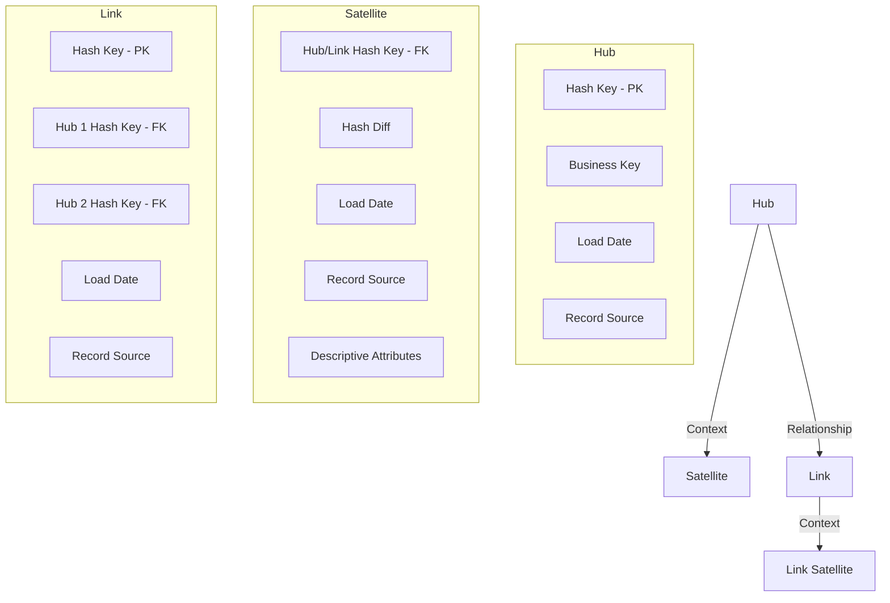
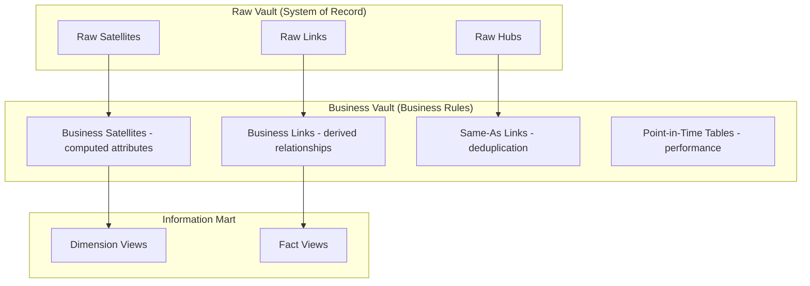

# Data Vault Modeling

## Why Data Vault Exists

Traditional dimensional models (star schemas) work well for single-source, stable-schema data warehouses. But enterprises face:

1. **Multiple source systems** — Each with different schemas, keys, and semantics
2. **Frequent source changes** — Systems get replaced, APIs change, new feeds arrive
3. **Audit requirements** — Regulators need full traceability of every data change
4. **Parallel development** — Multiple teams need to load data simultaneously without conflicts
5. **Agile delivery** — Business can't wait 6 months for a monolithic data warehouse design

Data Vault, created by Dan Linstedt in the early 2000s, addresses all five by separating **structure** (Hubs and Links) from **context** (Satellites), enabling parallel, additive development.

### Historical Context

- **2000:** Dan Linstedt develops Data Vault at the US Department of Defense
- **2013:** Data Vault 2.0 introduces hash keys, multi-active satellites, and Business Vault
- **2015-present:** Adoption grows in regulated industries (banking, healthcare, government)
- **2020s:** dbt and modern ELT tools make Data Vault implementation more accessible

### The Core Philosophy

> "The only constant is change. Model for change, not for stability."

Data Vault embraces change by making the model **additive** — new sources and entities are added without modifying existing structures. Nothing is ever updated or deleted.

## First Principles

### The Three Core Components



### Hubs: Business Entity Identity

A Hub represents a **unique business concept** identified by its **business key**. Nothing more.

**Rules:**
- Contains only the business key, hash key, load date, and record source
- One Hub per unique business concept (Customer, Product, Order, Account)
- Never updated — only inserted
- Business key is the natural key from the source system

```typescript
interface Hub {
  hash_key: string;          // MD5/SHA-256 of business key (PK)
  business_key: string;      // Natural key from source
  load_date: Date;           // When first loaded
  record_source: string;     // Source system identifier
}

// Example: Customer Hub
interface HubCustomer extends Hub {
  // hash_key = hash('CUST-12345')
  // business_key = 'CUST-12345'
  // load_date = 2026-03-18T10:00:00Z
  // record_source = 'CRM_SYSTEM'
}
```

### Satellites: Descriptive Context

A Satellite holds the **descriptive attributes** that change over time. It's like an SCD Type 2 implementation built into the model.

**Rules:**
- Contains the parent Hub/Link hash key, attributes, hash diff, load date, and record source
- One satellite per source system per rate of change
- Insert-only — new row on every change
- Hash diff enables efficient change detection

```typescript
interface Satellite {
  hub_hash_key: string;      // FK to parent Hub
  load_date: Date;           // When this version was loaded (part of composite PK)
  hash_diff: string;         // Hash of all descriptive attributes
  record_source: string;     // Source system
  load_end_date: Date | null; // When superseded (null = current)
}

// Example: Customer attributes from CRM
interface SatCustomerCRM extends Satellite {
  customer_name: string;
  email: string;
  phone: string;
  segment: string;
}

// Example: Customer attributes from billing system
interface SatCustomerBilling extends Satellite {
  billing_address: string;
  payment_method: string;
  credit_limit: number;
}
```

### Links: Relationships

A Link captures the **relationship** between two or more Hubs. It represents a business event or association.

**Rules:**
- Contains hash keys of all participating Hubs
- Has its own hash key (hash of all participating business keys)
- Insert-only
- Represents N:M relationships by default

```typescript
interface Link {
  hash_key: string;            // Hash of all participating business keys (PK)
  load_date: Date;
  record_source: string;
}

// Example: Customer-Order relationship
interface LinkCustomerOrder extends Link {
  hub_customer_hash_key: string;   // FK to Hub_Customer
  hub_order_hash_key: string;      // FK to Hub_Order
}

// Example: Order-Product relationship (with quantity in link satellite)
interface LinkOrderProduct extends Link {
  hub_order_hash_key: string;
  hub_product_hash_key: string;
}
```

## Hash Keys

Data Vault 2.0 introduced hash keys as the primary mechanism for key management. This is one of the most debated aspects of Data Vault.

### Why Hash Keys?

1. **Deterministic:** Same input always produces the same hash — enables parallel, idempotent loading
2. **Source-independent:** No need for a centralized sequence generator
3. **Equality joins:** Hash-to-hash joins are fast (fixed-width comparison)
4. **Cross-system integration:** Same business key from different sources produces the same hash

### Hash Key Generation

```typescript
import { createHash } from 'crypto';

class DataVaultHasher {
  private readonly separator = '||';
  private readonly nullReplacement = '^^';

  /**
   * Generate a hash key from one or more business key components.
   * All inputs are upper-cased and trimmed for consistency.
   */
  hashKey(...components: Array<string | number | null>): string {
    const normalized = components.map((c) => {
      if (c === null || c === undefined) return this.nullReplacement;
      return String(c).trim().toUpperCase();
    });

    const concatenated = normalized.join(this.separator);

    return createHash('md5').update(concatenated).digest('hex');
  }

  /**
   * Generate a hash diff from satellite attributes.
   * Used for change detection — if hash diff hasn't changed,
   * don't insert a new satellite record.
   */
  hashDiff(attributes: Record<string, unknown>): string {
    const sorted = Object.keys(attributes).sort();
    const values = sorted.map((key) => {
      const val = attributes[key];
      if (val === null || val === undefined) return this.nullReplacement;
      return String(val).trim().toUpperCase();
    });

    const concatenated = values.join(this.separator);
    return createHash('md5').update(concatenated).digest('hex');
  }
}

const hasher = new DataVaultHasher();

// Hub hash key
const customerHashKey = hasher.hashKey('CUST-12345');
// Always produces the same hash for the same customer

// Link hash key (composite)
const orderProductHashKey = hasher.hashKey('ORD-789', 'PROD-456');

// Satellite hash diff (for change detection)
const hashDiff = hasher.hashDiff({
  name: 'John Doe',
  email: 'john@example.com',
  segment: 'Premium',
});
```

::: warning
**Hash collision risk:** MD5 has a collision probability of approximately $\frac{1}{2^{64}}$ for randomly distributed inputs. For a warehouse with 1 billion entities, the probability of at least one collision is:

$$
P(\text{collision}) \approx 1 - e^{-\frac{n^2}{2 \times 2^{128}}} \approx 1.47 \times 10^{-21}
$$

This is negligibly small. However, if you're uncomfortable with MD5, use SHA-256 at the cost of larger key sizes (32 bytes vs 16 bytes).
:::

## Loading Patterns

### Hub Loading

```typescript
interface HubLoadResult {
  inserted: number;
  skipped: number; // Already existed
}

async function loadHub(
  sourceRecords: Array<{ businessKey: string; recordSource: string }>,
  hasher: DataVaultHasher,
  db: Database,
): Promise<HubLoadResult> {
  let inserted = 0;
  let skipped = 0;

  for (const record of sourceRecords) {
    const hashKey = hasher.hashKey(record.businessKey);

    // INSERT only if not exists (idempotent)
    const result = await db.query(
      `INSERT INTO hub_customer (hash_key, business_key, load_date, record_source)
       SELECT $1, $2, CURRENT_TIMESTAMP, $3
       WHERE NOT EXISTS (
         SELECT 1 FROM hub_customer WHERE hash_key = $1
       )`,
      [hashKey, record.businessKey, record.recordSource],
    );

    if (result.rowCount > 0) {
      inserted++;
    } else {
      skipped++;
    }
  }

  return { inserted, skipped };
}

interface Database {
  query(sql: string, params: unknown[]): Promise<{ rowCount: number }>;
}
```

### Satellite Loading with Change Detection

```typescript
interface SatelliteLoadResult {
  inserted: number;
  unchanged: number;
}

async function loadSatellite(
  sourceRecords: Array<{
    businessKey: string;
    attributes: Record<string, unknown>;
    recordSource: string;
  }>,
  hasher: DataVaultHasher,
  db: Database,
  satelliteTable: string,
): Promise<SatelliteLoadResult> {
  let inserted = 0;
  let unchanged = 0;

  for (const record of sourceRecords) {
    const hubHashKey = hasher.hashKey(record.businessKey);
    const newHashDiff = hasher.hashDiff(record.attributes);

    // Check if the latest satellite record has the same hash diff
    const existing = await db.query(
      `SELECT hash_diff FROM ${satelliteTable}
       WHERE hub_hash_key = $1
       AND load_end_date IS NULL
       ORDER BY load_date DESC
       LIMIT 1`,
      [hubHashKey],
    );

    if (existing.rowCount > 0 && (existing as any).rows[0].hash_diff === newHashDiff) {
      unchanged++;
      continue; // No change — skip
    }

    // End-date the previous current record
    if (existing.rowCount > 0) {
      await db.query(
        `UPDATE ${satelliteTable}
         SET load_end_date = CURRENT_TIMESTAMP
         WHERE hub_hash_key = $1 AND load_end_date IS NULL`,
        [hubHashKey],
      );
    }

    // Insert new satellite record
    const columns = Object.keys(record.attributes);
    const values = Object.values(record.attributes);
    const placeholders = columns.map((_, i) => `$${i + 5}`);

    await db.query(
      `INSERT INTO ${satelliteTable}
       (hub_hash_key, load_date, load_end_date, hash_diff, record_source, ${columns.join(', ')})
       VALUES ($1, CURRENT_TIMESTAMP, NULL, $2, $3, ${placeholders.join(', ')})`,
      [hubHashKey, newHashDiff, record.recordSource, ...values],
    );

    inserted++;
  }

  return { inserted, unchanged };
}
```

### Link Loading

```typescript
async function loadLink(
  sourceRecords: Array<{
    hubKeys: Array<{ hubName: string; businessKey: string }>;
    recordSource: string;
  }>,
  hasher: DataVaultHasher,
  db: Database,
  linkTable: string,
): Promise<{ inserted: number; skipped: number }> {
  let inserted = 0;
  let skipped = 0;

  for (const record of sourceRecords) {
    const businessKeys = record.hubKeys.map((h) => h.businessKey);
    const linkHashKey = hasher.hashKey(...businessKeys);

    const hubHashKeys = record.hubKeys.map((h) => ({
      column: `hub_${h.hubName}_hash_key`,
      value: hasher.hashKey(h.businessKey),
    }));

    const hubColumns = hubHashKeys.map((h) => h.column).join(', ');
    const hubPlaceholders = hubHashKeys.map((_, i) => `$${i + 4}`).join(', ');
    const hubValues = hubHashKeys.map((h) => h.value);

    const result = await db.query(
      `INSERT INTO ${linkTable}
       (hash_key, load_date, record_source, ${hubColumns})
       SELECT $1, CURRENT_TIMESTAMP, $2, ${hubPlaceholders}
       WHERE NOT EXISTS (
         SELECT 1 FROM ${linkTable} WHERE hash_key = $1
       )`,
      [linkHashKey, record.recordSource, ...hubValues],
    );

    if (result.rowCount > 0) {
      inserted++;
    } else {
      skipped++;
    }
  }

  return { inserted, skipped };
}
```

## Business Vault

The **Raw Vault** stores data as-is from sources. The **Business Vault** applies business rules and transformations on top.



### Same-As Links (Entity Resolution)

When the same real-world entity has different business keys in different systems:

```typescript
interface SameAsLink {
  hash_key: string;           // Hash of both business keys
  hub_customer_master_hash_key: string;  // "Master" record
  hub_customer_duplicate_hash_key: string; // "Duplicate" record
  load_date: Date;
  record_source: string;      // 'ENTITY_RESOLUTION_ENGINE'
  confidence_score: number;   // 0.0 to 1.0
}

// CRM says "John Doe, john@email.com" = CUST-001
// Billing says "J. Doe, john@email.com" = CUST-A001
// Same-As Link: CUST-001 <-> CUST-A001, confidence=0.95
```

### Point-in-Time (PIT) Tables

Satellites store history, but querying the current state of an entity requires joining multiple satellites and finding the latest record for each. PIT tables pre-compute this:

```typescript
interface PointInTimeRow {
  hub_hash_key: string;
  snapshot_date: Date;
  // Latest load_date from each satellite as of snapshot_date
  sat_customer_crm_load_date: Date | null;
  sat_customer_billing_load_date: Date | null;
  sat_customer_web_load_date: Date | null;
}

// Query: get all current customer attributes
// Without PIT: 3 subqueries with MAX(load_date) GROUP BY hub_hash_key
// With PIT: simple join using pre-computed load dates
```

```sql
-- PIT query (fast)
SELECT
    h.business_key,
    s1.customer_name,
    s1.email,
    s2.billing_address,
    s3.web_preferences
FROM hub_customer h
JOIN pit_customer pit ON h.hash_key = pit.hub_hash_key
    AND pit.snapshot_date = CURRENT_DATE
LEFT JOIN sat_customer_crm s1 ON h.hash_key = s1.hub_hash_key
    AND s1.load_date = pit.sat_customer_crm_load_date
LEFT JOIN sat_customer_billing s2 ON h.hash_key = s2.hub_hash_key
    AND s2.load_date = pit.sat_customer_billing_load_date
LEFT JOIN sat_customer_web s3 ON h.hash_key = s3.hub_hash_key
    AND s3.load_date = pit.sat_customer_web_load_date;
```

## Performance Characteristics

### Query Performance

Data Vault queries typically require 3-way joins minimum (Hub + Link + Satellite):

$$
\text{Basic query cost} = |H| \bowtie |L| \bowtie |S| = O(|H| + |L| + |S|) \text{ with hash joins}
$$

For complex queries spanning multiple hubs:

$$
\text{Complex query cost} = \prod_{i} |L_i| \times \sum_j |S_j|
$$

This is more expensive than star schema queries. PIT and Bridge tables mitigate this.

### Loading Performance

Data Vault loading is highly parallelizable:

$$
\text{Load time}_{\text{parallel}} = \max(\text{Hub loads}, \text{Link loads}, \text{Satellite loads})
$$

Since Hubs, Links, and Satellites can be loaded independently:

| Operation | Dependencies | Parallelizable |
|-----------|-------------|----------------|
| Hub load | None | Yes (per Hub) |
| Link load | Hub hash keys must exist | Yes (per Link, after Hubs) |
| Satellite load | Hub/Link hash keys must exist | Yes (per Satellite) |

### Storage Overhead

Data Vault stores more metadata than star schemas:

$$
\text{Overhead} = \sum_{\text{hubs}} |H| \times 48\text{B} + \sum_{\text{links}} |L| \times 64\text{B} + \sum_{\text{sats}} |S| \times 48\text{B}
$$

Where 48B and 64B account for hash keys, load dates, and record sources per row.

For 100M customers with 5 satellites averaging 3 historical records each:

$$
\text{Hub}: 100M \times 48B = 4.8\text{ GB}
$$

$$
\text{Satellites}: 100M \times 5 \times 3 \times (48B + \text{attribute\_size})
$$

## Edge Cases & Failure Modes

### Multi-Active Satellites

Some satellites have multiple active records per Hub at the same time (e.g., a customer with multiple phone numbers):

```typescript
interface MultiActiveSatellite extends Satellite {
  // Additional discriminator key(s) to identify which sub-record
  phone_type: 'home' | 'work' | 'mobile';
  phone_number: string;
}

// PK: (hub_hash_key, load_date, phone_type)
// This allows multiple active phone numbers per customer
```

### Effectivity Satellites

Track when a Link relationship is active or inactive:

```typescript
interface EffectivitySatellite {
  link_hash_key: string;
  load_date: Date;
  effective_from: Date;
  effective_to: Date | null; // null = currently effective
  record_source: string;
}

// Employee-Department relationship:
// Active from 2025-01-01 to 2026-02-15 (transferred)
// Active from 2026-02-15 to null (current department)
```

### Reference Tables

Low-volatility lookup data (country codes, currency codes) doesn't need full Hub/Satellite treatment:

```typescript
interface ReferenceTable {
  // Simple reference data — no hash keys needed
  code: string;
  description: string;
  load_date: Date;
  record_source: string;
}
```

## Mathematical Foundations

### Graph Theory Perspective

A Data Vault model is a bipartite graph:

$$
G = (H \cup L, E)
$$

Where:
- $H$ = set of Hubs (business entities)
- $L$ = set of Links (relationships)
- $E$ = edges connecting Links to their participating Hubs

A Link with $n$ participating Hubs has degree $n$ in the graph.

### Normalization Level

Data Vault achieves a form between 3NF and 6NF:

$$
\text{Hub} \in 3\text{NF (single candidate key)}
$$

$$
\text{Satellite} \approx 6\text{NF (one attribute per table, relaxed)}
$$

In practice, Satellites group attributes by source system and rate of change, which is a pragmatic relaxation of 6NF.

## Real-World War Stories

::: info War Story
**The Banking Merger**

Two banks merged, each with different customer master systems. The traditional approach would require:
1. Map all customer attributes from both systems
2. Define a unified customer schema
3. Build complex deduplication logic
4. Migrate everything at once

With Data Vault:
1. Created Hub_Customer with business keys from both systems
2. Created satellites for each bank's customer attributes (no schema unification needed)
3. Created Same-As Links for matched customers
4. Both banks' data loaded independently, in parallel
5. Business Vault applied unified rules over time

Timeline: Traditional approach estimated 18 months. Data Vault approach: 3 months to initial load, ongoing refinement.
:::

::: info War Story
**The Regulatory Audit**

A healthcare company was audited for HIPAA compliance. Auditors wanted to know: "What was Patient X's address on exactly March 15, 2025, and which system was the source of that information?"

With a star schema (SCD Type 2), they could answer WHEN the address changed but not precisely WHICH SOURCE provided the data and WHEN it was loaded.

With Data Vault:
- Satellite record: `hub_hash_key, load_date=2025-03-10, record_source='EHR_SYSTEM', address='123 Main St'`
- Next record: `hub_hash_key, load_date=2025-03-20, record_source='BILLING_SYSTEM', address='456 Oak Ave'`

On March 15, the address was "123 Main St" from the EHR system, loaded on March 10. Audit question answered in one query.
:::

## Decision Framework

### When to Use Data Vault

| Scenario | Data Vault? | Why |
|----------|------------|-----|
| Single source, simple analytics | No | Overkill — use star schema |
| 5+ source systems | Yes | Integration strength |
| Regulated industry (audit trail) | Yes | Built-in auditability |
| Agile / iterative delivery | Yes | Additive model |
| Small team (< 3 people) | No | Complexity overhead |
| Real-time analytics | No | Query complexity |
| Historical tracking required | Yes | Insert-only design |
| Frequent schema changes | Yes | Source-independent structure |

### Data Vault vs. Star Schema vs. 3NF

| Aspect | 3NF | Star Schema | Data Vault |
|--------|-----|-------------|------------|
| Load complexity | Simple | Medium | Medium-High |
| Query complexity | High | Low | High (without PIT) |
| Schema changes | Hard | Medium | Easy (additive) |
| Audit trail | None | Limited (SCD) | Full |
| Parallel loading | Limited | Limited | Excellent |
| Storage efficiency | Best | Good | Worst |
| Learning curve | Low | Medium | High |

## Advanced Topics

### Automating Data Vault with dbt

```typescript
// dbt macro concept for auto-generating Hub loading SQL
interface DbtDataVaultConfig {
  hub: {
    tableName: string;
    businessKey: string;
    sourceTable: string;
    sourceColumn: string;
  };
  satellites: Array<{
    tableName: string;
    hubReference: string;
    attributes: string[];
    sourceTable: string;
  }>;
  links: Array<{
    tableName: string;
    hubs: Array<{ hubName: string; businessKeyColumn: string }>;
    sourceTable: string;
  }>;
}

// This config generates the entire Data Vault DDL and loading SQL
const orderVaultConfig: DbtDataVaultConfig = {
  hub: {
    tableName: 'hub_order',
    businessKey: 'order_id',
    sourceTable: 'stg_orders',
    sourceColumn: 'order_id',
  },
  satellites: [
    {
      tableName: 'sat_order_details',
      hubReference: 'hub_order',
      attributes: ['status', 'total_amount', 'shipping_method'],
      sourceTable: 'stg_orders',
    },
  ],
  links: [
    {
      tableName: 'link_customer_order',
      hubs: [
        { hubName: 'hub_customer', businessKeyColumn: 'customer_id' },
        { hubName: 'hub_order', businessKeyColumn: 'order_id' },
      ],
      sourceTable: 'stg_orders',
    },
  ],
};
```

### Data Vault on Modern Cloud Warehouses

Cloud warehouses change the Data Vault calculus:

- **Snowflake/BigQuery:** Columnar storage makes the join overhead of Data Vault less painful
- **Semi-structured support:** Satellites can store JSON payloads, reducing the need for separate satellites per attribute group
- **Auto-clustering:** Reduces the need for manual partitioning of Hub and Satellite tables
- **Time travel:** Provides some of the auditability that Data Vault's insert-only design was meant to provide

### Research: Ensemble Modeling

An emerging approach that combines Data Vault for the integration layer with dimensional models for the presentation layer, using automated metadata-driven transformations.

## Cross-References

- [Data Modeling Overview](./index.md) — Paradigm comparison
- [Dimensional Modeling](./dimensional-modeling.md) — Star/snowflake for presentation layer
- [Slowly Changing Dimensions](./slowly-changing-dimensions.md) — SCD handling in Data Vault satellites
- [Schema Evolution](./schema-evolution.md) — How Data Vault handles schema changes
- [Data Lineage](../pipeline-patterns/data-lineage.md) — Traceability through Data Vault
