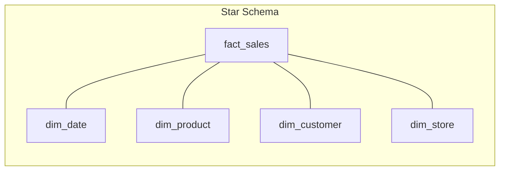
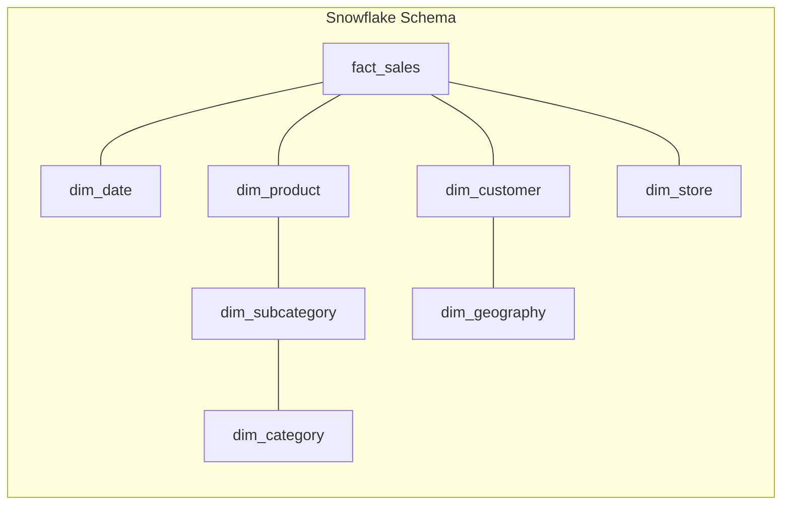
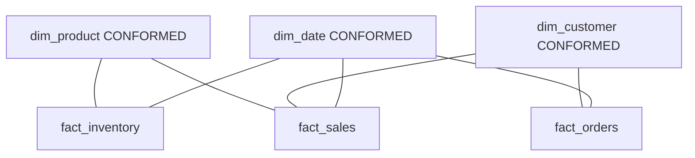
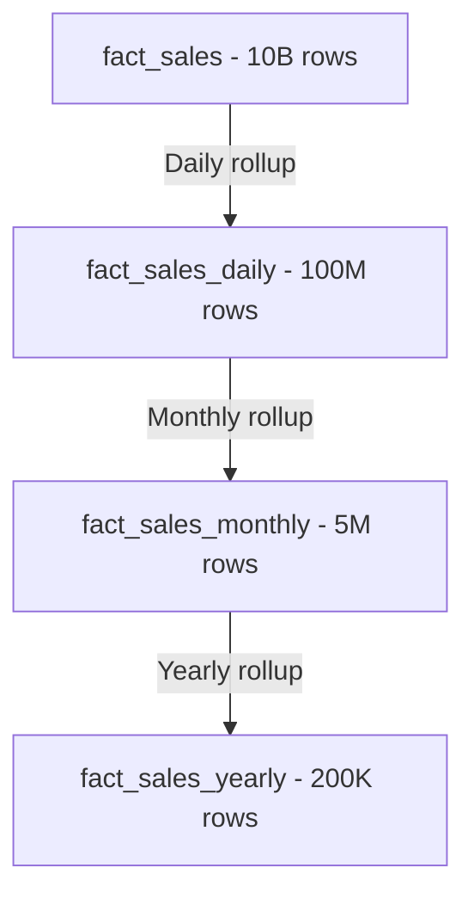
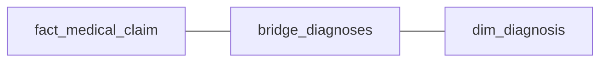

# Dimensional Modeling

## Why Dimensional Modeling Exists

Relational databases optimized for transactions (OLTP) are terrible for analytics. A normalized schema with 30 tables connected by foreign keys requires 15-way joins to answer "What were total sales by region last quarter?" — a query that should be trivial.

Ralph Kimball proposed dimensional modeling in 1996 to solve this: organize data around **business processes** with a central fact table surrounded by descriptive dimension tables. This "star" pattern makes analytical queries simple, fast, and intuitive.

### Historical Context

- **1996:** Kimball publishes "The Data Warehouse Toolkit" — introduces star schemas
- **2000s:** Star schemas become the standard for data warehouses (Oracle, Teradata, SQL Server)
- **2010s:** Columnar stores (Redshift, BigQuery, Snowflake) make star schemas even faster
- **2020s:** Some argue dimensional modeling is obsolete with modern MPP engines. It's not — the principles of grain definition, conformed dimensions, and fact table design remain essential regardless of technology.

## First Principles

### The Dimensional Modeling Mantra

Kimball's four-step design process:

1. **Select the business process** — What are you measuring?
2. **Declare the grain** — What does one row represent?
3. **Identify the dimensions** — How do users describe the data?
4. **Identify the facts** — What are the measurements?

### Fact Tables: The Center of the Star

A fact table records **measurements** of a business process at a specific **grain**.

**Properties of facts:**
- Numeric and quantitative
- Continuous values, not categorical
- Generated by business events
- Most rows in the database

**Fact types:**

| Type | Definition | Examples | Aggregation |
|------|-----------|----------|-------------|
| Additive | Can be summed across ALL dimensions | Revenue, quantity, cost | SUM always valid |
| Semi-additive | Can be summed across SOME dimensions | Account balance, inventory count | SUM across time is invalid |
| Non-additive | Cannot be summed | Ratio, percentage, unit price | Must recalculate from components |

$$
\text{Additive: } \sum_{d \in D} f(d) \text{ is meaningful for all dimensions } D
$$

$$
\text{Semi-additive: } \sum_{d \in D'} f(d) \text{ is meaningful only for } D' \subset D
$$

### Dimension Tables: The Context

Dimensions provide the **who, what, where, when, why, and how** context for facts.

**Properties of dimensions:**
- Textual and descriptive
- Used for filtering, grouping, and labeling
- Relatively few rows (thousands to millions, not billions)
- Wide (many columns — 50+ is common)

### Star vs. Snowflake





| Aspect | Star | Snowflake |
|--------|------|-----------|
| Dimension normalization | Denormalized | Normalized |
| Number of joins | Fewer | More |
| Query simplicity | Simpler | More complex |
| Storage | More (redundancy) | Less |
| ETL complexity | Simpler | More complex |
| Query performance | Faster (fewer joins) | Slower |
| Maintenance | Easier | Harder |

::: tip
Prefer star schemas over snowflakes. The storage savings of snowflaking are negligible compared to fact table size, and the query complexity cost is real. The only exception is when a dimension is very large (millions of rows) and has clearly independent hierarchies.
:::

## Core Mechanics

### Surrogate Keys

Every dimension table uses a **surrogate key** — a system-generated integer with no business meaning — as its primary key.

**Why not use natural keys (business keys)?**

1. Natural keys can change (company renames, product re-SKUs)
2. Natural keys from different sources may collide
3. Surrogate keys enable SCD Type 2 (multiple rows per entity)
4. Integer joins are faster than string joins

```typescript
interface SurrogateKeyGenerator {
  // Sequential integer generation
  next(): number;
}

class SequentialKeyGenerator implements SurrogateKeyGenerator {
  private current: number;

  constructor(startFrom: number = 1) {
    this.current = startFrom;
  }

  next(): number {
    return this.current++;
  }
}

// Dimension loading with surrogate keys
interface DimensionLoader<T> {
  lookupOrCreate(
    naturalKey: string,
    attributes: T,
  ): { surrogateKey: number; isNew: boolean };
}

class ProductDimensionLoader implements DimensionLoader<ProductAttributes> {
  private naturalKeyMap: Map<string, number> = new Map();
  private keyGen = new SequentialKeyGenerator();

  lookupOrCreate(
    naturalKey: string,
    attributes: ProductAttributes,
  ): { surrogateKey: number; isNew: boolean } {
    const existing = this.naturalKeyMap.get(naturalKey);
    if (existing !== undefined) {
      return { surrogateKey: existing, isNew: false };
    }

    const newKey = this.keyGen.next();
    this.naturalKeyMap.set(naturalKey, newKey);
    // INSERT INTO dim_product (product_key, product_id, ...) VALUES (newKey, naturalKey, ...)
    return { surrogateKey: newKey, isNew: true };
  }
}

interface ProductAttributes {
  name: string;
  category: string;
  brand: string;
  price: number;
}
```

### The Date Dimension

Every dimensional model needs a date dimension. It's the one dimension that is universal:

```sql
-- Date dimension DDL (every row is one calendar date)
CREATE TABLE dim_date (
    date_key            INT PRIMARY KEY,        -- YYYYMMDD format
    full_date           DATE NOT NULL,
    day_of_week         VARCHAR(10),             -- Monday, Tuesday, ...
    day_of_week_num     SMALLINT,                -- 1-7
    day_of_month        SMALLINT,                -- 1-31
    day_of_year         SMALLINT,                -- 1-366
    week_of_year        SMALLINT,                -- 1-53
    month_num           SMALLINT,                -- 1-12
    month_name          VARCHAR(10),             -- January, February, ...
    quarter_num         SMALLINT,                -- 1-4
    quarter_name        VARCHAR(2),              -- Q1, Q2, Q3, Q4
    year_num            INT,
    is_weekend          BOOLEAN,
    is_holiday          BOOLEAN,
    holiday_name        VARCHAR(50),
    fiscal_year         INT,
    fiscal_quarter      SMALLINT,
    fiscal_month        SMALLINT
);
```

```typescript
// Generate date dimension in TypeScript
function generateDateDimension(
  startDate: Date,
  endDate: Date,
  holidays: Map<string, string>,
): DateDimensionRow[] {
  const rows: DateDimensionRow[] = [];
  const current = new Date(startDate);

  while (current <= endDate) {
    const dateStr = current.toISOString().split('T')[0];
    const dayOfWeek = current.getDay(); // 0=Sunday

    rows.push({
      dateKey: parseInt(dateStr.replace(/-/g, ''), 10),
      fullDate: new Date(current),
      dayOfWeek: [
        'Sunday', 'Monday', 'Tuesday', 'Wednesday',
        'Thursday', 'Friday', 'Saturday',
      ][dayOfWeek],
      dayOfWeekNum: dayOfWeek === 0 ? 7 : dayOfWeek,
      dayOfMonth: current.getDate(),
      dayOfYear: getDayOfYear(current),
      weekOfYear: getWeekOfYear(current),
      monthNum: current.getMonth() + 1,
      monthName: current.toLocaleString('en', { month: 'long' }),
      quarterNum: Math.ceil((current.getMonth() + 1) / 3),
      yearNum: current.getFullYear(),
      isWeekend: dayOfWeek === 0 || dayOfWeek === 6,
      isHoliday: holidays.has(dateStr),
      holidayName: holidays.get(dateStr) ?? null,
    });

    current.setDate(current.getDate() + 1);
  }

  return rows;
}

function getDayOfYear(date: Date): number {
  const start = new Date(date.getFullYear(), 0, 0);
  const diff = date.getTime() - start.getTime();
  return Math.floor(diff / (1000 * 60 * 60 * 24));
}

function getWeekOfYear(date: Date): number {
  const d = new Date(Date.UTC(date.getFullYear(), date.getMonth(), date.getDate()));
  d.setUTCDate(d.getUTCDate() + 4 - (d.getUTCDay() || 7));
  const yearStart = new Date(Date.UTC(d.getUTCFullYear(), 0, 1));
  return Math.ceil(((d.getTime() - yearStart.getTime()) / 86400000 + 1) / 7);
}

interface DateDimensionRow {
  dateKey: number;
  fullDate: Date;
  dayOfWeek: string;
  dayOfWeekNum: number;
  dayOfMonth: number;
  dayOfYear: number;
  weekOfYear: number;
  monthNum: number;
  monthName: string;
  quarterNum: number;
  yearNum: number;
  isWeekend: boolean;
  isHoliday: boolean;
  holidayName: string | null;
}
```

### Fact Table Types

#### Transaction Fact Tables

One row per business event. The most common type.

```sql
-- Grain: one line item in a sales transaction
CREATE TABLE fact_sales (
    sale_line_id    BIGINT PRIMARY KEY,
    date_key        INT REFERENCES dim_date(date_key),
    product_key     INT REFERENCES dim_product(product_key),
    customer_key    INT REFERENCES dim_customer(customer_key),
    store_key       INT REFERENCES dim_store(store_key),
    promo_key       INT REFERENCES dim_promotion(promo_key),
    quantity        INT,
    unit_price      DECIMAL(10,2),
    total_amount    DECIMAL(12,2),
    discount_amount DECIMAL(10,2),
    cost_amount     DECIMAL(10,2)
);
```

#### Periodic Snapshot Fact Tables

One row per entity per time period. Captures the state at regular intervals.

```sql
-- Grain: one account per month
CREATE TABLE fact_account_monthly_snapshot (
    date_key        INT REFERENCES dim_date(date_key),
    account_key     INT REFERENCES dim_account(account_key),
    balance         DECIMAL(15,2),    -- Semi-additive!
    deposits_mtd    DECIMAL(15,2),    -- Additive
    withdrawals_mtd DECIMAL(15,2),    -- Additive
    interest_mtd    DECIMAL(10,2),    -- Additive
    num_transactions INT,             -- Additive
    PRIMARY KEY (date_key, account_key)
);
```

::: warning
Balance is **semi-additive** — you can sum balances across accounts (total portfolio value) but NOT across time (sum of January balance + February balance is meaningless).
:::

#### Accumulating Snapshot Fact Tables

One row per entity that gets updated as the entity progresses through a process:

```sql
-- Grain: one order lifecycle
CREATE TABLE fact_order_accumulating (
    order_key           BIGINT PRIMARY KEY,
    order_date_key      INT REFERENCES dim_date(date_key),
    payment_date_key    INT REFERENCES dim_date(date_key),
    ship_date_key       INT REFERENCES dim_date(date_key),
    delivery_date_key   INT REFERENCES dim_date(date_key),
    customer_key        INT REFERENCES dim_customer(customer_key),
    order_amount        DECIMAL(12,2),
    days_to_payment     INT,
    days_to_ship        INT,
    days_to_delivery    INT,
    current_status      VARCHAR(20)
);
```

#### Factless Fact Tables

No measurements — just records that an event occurred:

```sql
-- Student attendance: the fact IS the presence of the row
CREATE TABLE fact_student_attendance (
    date_key      INT REFERENCES dim_date(date_key),
    student_key   INT REFERENCES dim_student(student_key),
    class_key     INT REFERENCES dim_class(class_key),
    PRIMARY KEY (date_key, student_key, class_key)
);

-- Coverage: what promotions were available for what products
CREATE TABLE fact_promotion_coverage (
    date_key    INT,
    product_key INT,
    promo_key   INT,
    PRIMARY KEY (date_key, product_key, promo_key)
);
```

### Conformed Dimensions

Dimensions shared across multiple fact tables, ensuring consistent definitions:



```typescript
interface ConformedDimensionRegistry {
  dimensions: Map<string, ConformedDimension>;
}

interface ConformedDimension {
  name: string;
  owner: string;            // Team responsible
  version: number;
  attributes: DimensionAttribute[];
  conformedFacts: string[]; // Fact tables that use this dimension
}

interface DimensionAttribute {
  name: string;
  type: string;
  businessDefinition: string;  // Agreed-upon definition across teams
  sourceSystem: string;
  transformationLogic: string;
}

const customerDimension: ConformedDimension = {
  name: 'dim_customer',
  owner: 'Customer Data Team',
  version: 3,
  attributes: [
    {
      name: 'customer_segment',
      type: 'VARCHAR(20)',
      businessDefinition:
        'Classification based on LTV: Premium (>$10K), Standard ($1K-$10K), Basic (<$1K)',
      sourceSystem: 'CRM',
      transformationLogic: 'CASE WHEN ltv > 10000 THEN Premium ...',
    },
  ],
  conformedFacts: ['fact_sales', 'fact_orders', 'fact_support_tickets'],
};
```

::: danger
Non-conformed dimensions are the #1 source of conflicting analytics. When the sales team defines "active customer" differently from the marketing team, reports disagree and trust erodes. Conformed dimensions enforce a single truth.
:::

## Performance Characteristics

### Join Performance

Star schema joins are highly optimized by modern query engines:

$$
\text{Star join cost} = |F| \times \sum_{i=1}^{n} \frac{|D_i|}{B}
$$

Where $|F|$ is fact table size, $|D_i|$ is dimension size, and $B$ is the hash table bucket size. Since dimensions are small, they fit in memory, making hash joins extremely fast.

### Aggregate Navigation

Pre-computed aggregates (summary tables) speed up common queries:



```typescript
interface AggregateDefinition {
  name: string;
  sourceFact: string;
  grain: string;
  dimensions: string[];   // Dimensions retained at this level
  measures: AggMeasure[];
}

interface AggMeasure {
  name: string;
  sourceColumn: string;
  aggregation: 'SUM' | 'COUNT' | 'AVG' | 'MIN' | 'MAX' | 'COUNT_DISTINCT';
}

const dailySalesAggregate: AggregateDefinition = {
  name: 'fact_sales_daily',
  sourceFact: 'fact_sales',
  grain: 'One product per store per day',
  dimensions: ['date_key', 'product_key', 'store_key'],
  measures: [
    { name: 'total_revenue', sourceColumn: 'total_amount', aggregation: 'SUM' },
    { name: 'total_quantity', sourceColumn: 'quantity', aggregation: 'SUM' },
    { name: 'transaction_count', sourceColumn: 'sale_line_id', aggregation: 'COUNT' },
    { name: 'unique_customers', sourceColumn: 'customer_key', aggregation: 'COUNT_DISTINCT' },
    { name: 'avg_unit_price', sourceColumn: 'unit_price', aggregation: 'AVG' },
  ],
};
```

**Speedup from aggregates:**

$$
\text{Speedup} = \frac{|F_{\text{base}}|}{|F_{\text{aggregate}}|} \approx \frac{\text{rows at base grain}}{\text{rows at aggregate grain}}
$$

For daily aggregation of a fact with 1B rows over 5 years, 100K products, 500 stores:

$$
\text{Aggregate rows} = 365 \times 5 \times 100{,}000 \times 500 = 91.25\text{B (worst case)}
$$

But most products aren't sold at most stores, so realistic aggregate is ~100M rows. Speedup: 10x.

## Edge Cases & Failure Modes

### Late-Arriving Dimensions

Events arrive before the dimension data is loaded:

```
10:00:00 - Sale event: product_id=NEW_SKU (not yet in dim_product)
10:05:00 - Product master data load: NEW_SKU -> "Widget Pro"
```

**Solution: Inferred dimension members**

```typescript
class LateDimensionHandler {
  private inferredMembers: Map<string, number> = new Map();
  private keyGen = new SequentialKeyGenerator(1_000_000); // High start to avoid collision

  handleMissingDimension(
    naturalKey: string,
    dimensionTable: string,
  ): number {
    const existing = this.inferredMembers.get(naturalKey);
    if (existing) return existing;

    const surrogateKey = this.keyGen.next();
    this.inferredMembers.set(naturalKey, surrogateKey);

    // INSERT with placeholder attributes
    console.log(
      `INSERT INTO ${dimensionTable} (key, natural_key, name) ` +
        `VALUES (${surrogateKey}, '${naturalKey}', 'INFERRED - AWAITING UPDATE')`,
    );

    return surrogateKey;
  }

  updateInferredMember(
    naturalKey: string,
    actualAttributes: Record<string, unknown>,
  ): void {
    const key = this.inferredMembers.get(naturalKey);
    if (key) {
      // UPDATE dim_table SET attributes WHERE key = surrogateKey
      console.log(`Updating inferred member ${naturalKey} with actual data`);
      this.inferredMembers.delete(naturalKey);
    }
  }
}
```

### Multi-Valued Dimensions (Bridge Tables)

When a fact relates to multiple dimension values (e.g., a patient has multiple diagnoses):



```sql
CREATE TABLE bridge_diagnoses (
    diagnosis_group_key INT,       -- FK in fact table
    diagnosis_key       INT,       -- FK to dim_diagnosis
    weight_factor       DECIMAL(5,4),  -- Allocation weight (sums to 1.0)
    PRIMARY KEY (diagnosis_group_key, diagnosis_key)
);
```

::: warning
Bridge tables require weight factors to prevent double-counting in aggregations. If a claim has 3 diagnoses, each gets weight 0.333 to ensure revenue sums correctly.
:::

### Degenerate Dimensions

Dimension attributes stored directly in the fact table (no separate dimension table):

```sql
-- Transaction number is a dimension, but has no additional attributes
-- No need for dim_transaction — just store it in the fact
CREATE TABLE fact_sales (
    transaction_number  VARCHAR(20),  -- Degenerate dimension
    date_key           INT,
    product_key        INT,
    quantity           INT,
    amount             DECIMAL(12,2)
);
```

## Mathematical Foundations

### Dimensional Cardinality

The maximum number of rows in a fact table:

$$
|F|_{\text{max}} = \prod_{i=1}^{n} |D_i|
$$

But actual cardinality is much lower due to **sparsity**:

$$
\text{Sparsity} = 1 - \frac{|F|_{\text{actual}}}{\prod_{i=1}^{n} |D_i|}
$$

Real-world fact tables have sparsity > 99.99%. Not every customer buys every product in every store on every day.

### Additive Property Formalization

A measure $m$ is additive with respect to dimension $d$ if:

$$
m\left(\bigcup_{i} S_i\right) = \sum_{i} m(S_i) \quad \text{when } S_i \text{ partition the set along dimension } d
$$

This is the property of **decomposability** in aggregation theory.

## Real-World War Stories

::: info War Story
**The Missing Dimension Row**

A retail chain's daily sales ETL loaded facts before dimensions. New products sold on day 1 had no matching dimension row. The ETL inserted NULL foreign keys. Queries filtering on product category excluded all new product sales.

Over time, ~3% of revenue was "invisible" in reports. The CFO noticed that the data warehouse always reported slightly lower revenue than the POS system totals.

**Fix:** Implemented inferred dimension members with a special "Unknown" row (surrogate key = -1). Separate process backfills inferred members when dimension data arrives.
:::

::: info War Story
**The Accidental Snowflake**

A team using Snowflake (the database) decided to model their data as a snowflake (the schema) because "the database is called Snowflake, so it must be optimized for snowflake schemas." They normalized their product dimension into 7 levels of hierarchy.

Queries that previously ran in 2 seconds now required 7 joins and took 15 seconds. The irony: Snowflake (the database) is actually optimized for star schemas with its micro-partitioning and columnar storage.

**Fix:** Denormalized back to star schema. Query times returned to 2 seconds.
:::

## Decision Framework

### When to Snowflake

| Scenario | Star or Snowflake |
|----------|-------------------|
| Dimension < 10K rows | Star (always) |
| Dimension 10K-1M rows | Star (usually) |
| Dimension > 1M rows with deep hierarchy | Consider snowflake |
| BI tools (Tableau, Power BI) | Star (tools expect it) |
| Ad-hoc SQL by analysts | Star (simpler queries) |
| Storage-constrained environment | Snowflake (marginal savings) |

## Advanced Topics

### Slowly Changing Dimensions in Star Schemas

See [Slowly Changing Dimensions](./slowly-changing-dimensions.md) for comprehensive coverage. The key interaction with star schemas:

- **SCD Type 1** (overwrite): Simple, but loses history
- **SCD Type 2** (new row): Preserves history, but fact-dimension relationship captures point-in-time state
- **SCD Type 3** (new column): Tracks one previous value

### Role-Playing Dimensions

A single dimension table used multiple times with different meanings:

```sql
-- dim_date appears three times with different roles
SELECT
    order_date.full_date AS order_date,
    ship_date.full_date AS ship_date,
    delivery_date.full_date AS delivery_date,
    f.order_amount
FROM fact_orders f
JOIN dim_date order_date ON f.order_date_key = order_date.date_key
JOIN dim_date ship_date ON f.ship_date_key = ship_date.date_key
JOIN dim_date delivery_date ON f.delivery_date_key = delivery_date.date_key;
```

### Junk Dimensions

Low-cardinality flags and indicators combined into a single "junk" dimension to reduce fact table width:

```typescript
interface JunkDimensionRow {
  junk_key: number;
  is_gift_wrap: boolean;
  is_expedited: boolean;
  payment_type: 'credit' | 'debit' | 'cash' | 'check';
  is_return: boolean;
  channel: 'online' | 'in-store' | 'phone';
}

// Pre-generate all combinations
function generateJunkDimension(): JunkDimensionRow[] {
  const giftOptions = [true, false];
  const expeditedOptions = [true, false];
  const paymentOptions = ['credit', 'debit', 'cash', 'check'] as const;
  const returnOptions = [true, false];
  const channelOptions = ['online', 'in-store', 'phone'] as const;

  const rows: JunkDimensionRow[] = [];
  let key = 1;

  for (const gift of giftOptions) {
    for (const exp of expeditedOptions) {
      for (const pay of paymentOptions) {
        for (const ret of returnOptions) {
          for (const ch of channelOptions) {
            rows.push({
              junk_key: key++,
              is_gift_wrap: gift,
              is_expedited: exp,
              payment_type: pay,
              is_return: ret,
              channel: ch,
            });
          }
        }
      }
    }
  }

  return rows; // 2 * 2 * 4 * 2 * 3 = 96 rows
}
```

### Mini-Dimensions for Large Dimensions

When a dimension has millions of rows and frequently changing attributes, split volatile attributes into a separate mini-dimension:

```sql
-- Main customer dimension (SCD Type 2 on stable attributes)
CREATE TABLE dim_customer (
    customer_key    INT PRIMARY KEY,
    customer_id     VARCHAR(20),
    name            VARCHAR(100),
    signup_date     DATE,
    -- Stable attributes only
    effective_from  DATE,
    effective_to    DATE
);

-- Mini-dimension for volatile demographics (updated frequently)
CREATE TABLE dim_customer_demographics (
    demo_key        INT PRIMARY KEY,
    age_band        VARCHAR(10),    -- '18-24', '25-34', etc.
    income_band     VARCHAR(20),
    credit_score_band VARCHAR(10),
    loyalty_tier    VARCHAR(10)
);

-- Fact table has BOTH keys
CREATE TABLE fact_sales (
    customer_key    INT,
    demo_key        INT,    -- Current demographics at time of sale
    -- ... other keys and measures
);
```

This avoids creating millions of SCD Type 2 rows when demographics change frequently.

## Cross-References

- [Data Modeling Overview](./index.md) — Modeling paradigm comparison
- [Slowly Changing Dimensions](./slowly-changing-dimensions.md) — Handling dimension changes
- [Normalization & Denormalization](./normalization-denormalization.md) — Theory behind star/snowflake choices
- [Data Vault](./data-vault.md) — Alternative modeling approach
- [Schema Evolution](./schema-evolution.md) — Evolving dimensional models
