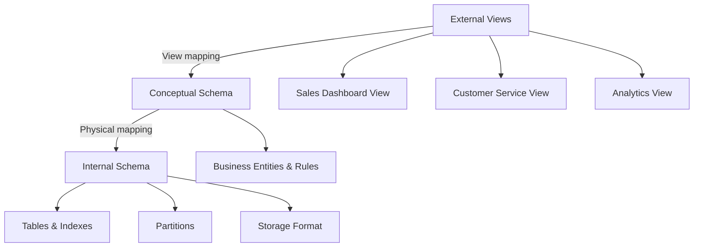
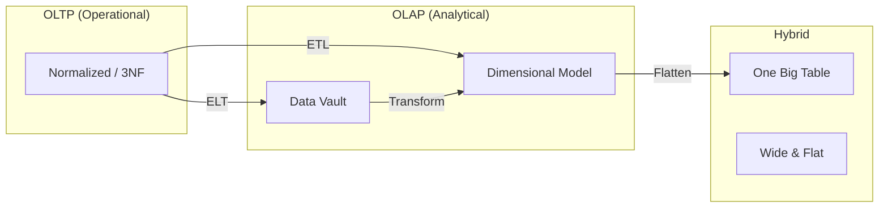
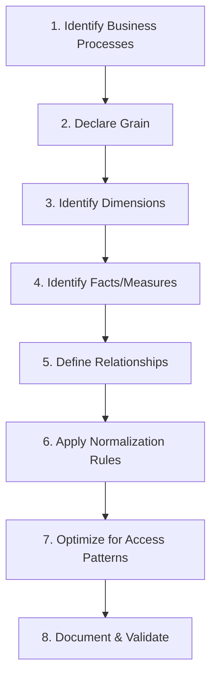
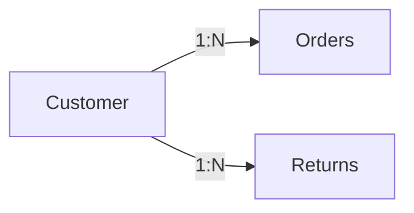
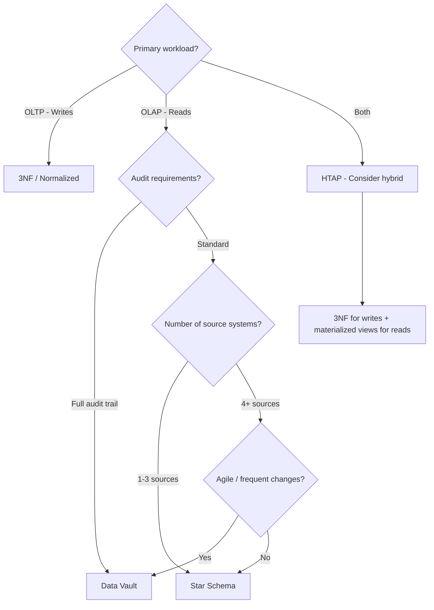

# Data Modeling Overview

## Why Data Modeling Exists

Every database stores data, but not all data organizations are equal. The way you structure data determines:

1. **Query performance** — Can you answer questions in milliseconds or hours?
2. **Data integrity** — Can invalid states be represented?
3. **Maintainability** — How hard is it to evolve the schema?
4. **Storage efficiency** — How much redundancy exists?
5. **Cognitive clarity** — Can a new team member understand the data?

Data modeling is the discipline of designing these structures deliberately, not accidentally. Without it, databases become data swamps — technically full of data, practically useless.

### Historical Context

Data modeling evolved through distinct eras:

- **1970s:** Edgar Codd's relational model — normalization theory
- **1980s:** Entity-Relationship (ER) modeling — Peter Chen's diagrams
- **1992:** Ralph Kimball's dimensional modeling — star schemas for analytics
- **1994:** Bill Inmon's Corporate Information Factory — enterprise data warehousing
- **2000s:** Dan Linstedt's Data Vault — agile, auditable modeling
- **2010s:** Schema-on-read — data lakes, ELT patterns
- **2020s:** Data mesh — domain-oriented, decentralized ownership

Each paradigm solved a specific problem. None is universally correct. The right model depends on your access patterns, consistency requirements, and organizational structure.

## First Principles

### What Is a Data Model?

A data model is a formal description of:

$$
M = (E, A, R, C)
$$

Where:
- $E$ = entities (things that exist)
- $A$ = attributes (properties of entities)
- $R$ = relationships (connections between entities)
- $C$ = constraints (rules that must hold)

### The Three Schema Architecture

The ANSI/SPARC architecture separates data modeling into three levels:



| Level | Purpose | Audience | Example |
|-------|---------|----------|---------|
| External | How users see data | Analysts, apps | Dashboard views |
| Conceptual | Business meaning | Domain experts | Entity diagrams |
| Physical | Storage implementation | DBAs, engineers | Table DDL |

### Modeling Paradigms at a Glance



## Core Modeling Paradigms

### Normalized Models (3NF)

Designed to minimize redundancy and enforce integrity. Every fact is stored exactly once.

**Use case:** Operational databases (OLTP) where writes are frequent and consistency is critical.

**Characteristics:**
- No data redundancy
- Strong referential integrity
- Complex joins for analytical queries
- Optimized for write throughput

```typescript
// Normalized schema example
interface NormalizedSchema {
  customers: {
    customer_id: number;     // PK
    name: string;
    email: string;
  };

  addresses: {
    address_id: number;      // PK
    customer_id: number;     // FK -> customers
    street: string;
    city: string;
    state: string;
    zip: string;
    address_type: 'billing' | 'shipping';
  };

  orders: {
    order_id: number;        // PK
    customer_id: number;     // FK -> customers
    order_date: Date;
    status: string;
  };

  order_items: {
    item_id: number;         // PK
    order_id: number;        // FK -> orders
    product_id: number;      // FK -> products
    quantity: number;
    unit_price: number;
  };

  products: {
    product_id: number;      // PK
    name: string;
    category_id: number;     // FK -> categories
    price: number;
  };

  categories: {
    category_id: number;     // PK
    name: string;
    parent_category_id: number | null; // Self-referencing FK
  };
}
```

### Dimensional Models (Star Schema)

Designed for analytical queries. Denormalized for read performance.

**Use case:** Data warehouses, BI tools, dashboards.

**Characteristics:**
- Central fact table + surrounding dimension tables
- Redundant data in dimensions (denormalized)
- Simple joins (star pattern)
- Optimized for read / aggregation queries

```typescript
// Star schema example
interface StarSchema {
  // Fact table — measures (numeric, additive)
  fact_sales: {
    sale_id: number;
    date_key: number;        // FK -> dim_date
    product_key: number;     // FK -> dim_product
    customer_key: number;    // FK -> dim_customer
    store_key: number;       // FK -> dim_store
    quantity: number;        // Measure
    unit_price: number;      // Measure
    total_amount: number;    // Measure
    discount_amount: number; // Measure
  };

  // Dimension tables — descriptive attributes
  dim_date: {
    date_key: number;        // Surrogate key
    full_date: Date;
    day_of_week: string;
    month: string;
    quarter: string;
    year: number;
    is_holiday: boolean;
    fiscal_year: number;
  };

  dim_product: {
    product_key: number;     // Surrogate key
    product_id: string;      // Natural key
    product_name: string;
    category: string;        // Denormalized from category table
    subcategory: string;
    brand: string;
    supplier: string;
  };
}
```

See [Dimensional Modeling](./dimensional-modeling.md) for deep coverage.

### Data Vault

Designed for auditability, agility, and enterprise-scale integration.

**Use case:** Enterprise data warehouses where sources change frequently and full audit trails are required.

**Characteristics:**
- Hubs (business keys), Links (relationships), Satellites (attributes)
- Insert-only (never update or delete)
- Full audit trail
- Highly parallelizable loading

See [Data Vault](./data-vault.md) for deep coverage.

### One Big Table (OBT)

All data flattened into a single wide table. The extreme end of denormalization.

**Use case:** Simple analytics, ML feature stores, columnar storage systems.

```typescript
interface OneBigTable {
  // Everything in one table — extreme denormalization
  analytics_events: {
    event_id: string;
    event_timestamp: Date;
    event_type: string;

    // User attributes (denormalized)
    user_id: string;
    user_name: string;
    user_email: string;
    user_signup_date: Date;
    user_plan: string;

    // Product attributes (denormalized)
    product_id: string;
    product_name: string;
    product_category: string;

    // Session attributes
    session_id: string;
    session_start: Date;
    device_type: string;
    browser: string;

    // Measures
    revenue: number;
    quantity: number;
  };
}
```

::: warning
OBT trades everything for simplicity. It works for analytics workloads with a single access pattern. For complex domains with multiple access patterns, it becomes unmaintainable.
:::

## Data Modeling Process

### Step-by-Step Framework



### Step 1: Identify Business Processes

```typescript
interface BusinessProcess {
  name: string;
  description: string;
  sourceSystem: string;
  frequency: 'real-time' | 'hourly' | 'daily' | 'weekly';
  actors: string[];
  kpis: string[];
}

const salesProcess: BusinessProcess = {
  name: 'Retail Sales',
  description: 'Customer purchases products at store or online',
  sourceSystem: 'POS System + E-commerce Platform',
  frequency: 'real-time',
  actors: ['Customer', 'Cashier', 'Website'],
  kpis: [
    'Revenue',
    'Units Sold',
    'Average Order Value',
    'Customer Acquisition Cost',
  ],
};
```

### Step 2: Declare the Grain

The grain is the most atomic level of data captured. Getting the grain wrong is the most common and most expensive modeling mistake.

$$
\text{Grain} = \text{What does one row in the fact table represent?}
$$

| Grain | Example Row |
|-------|-------------|
| One transaction line item | "Customer A bought 3 units of Product X at $10 each" |
| One transaction | "Customer A spent $150 in order #12345" |
| Daily product summary | "Product X: 450 units sold, $4,500 revenue on 2026-03-18" |
| Monthly account snapshot | "Account #123: balance $5,000 as of March 2026" |

::: danger
Mixing grains in a single fact table makes aggregations impossible. If some rows represent individual items and others represent daily summaries, summing them produces nonsense.
:::

### Step 3-4: Identify Dimensions and Facts

```typescript
interface ModelDesign {
  grain: string;
  facts: Array<{
    name: string;
    type: 'additive' | 'semi-additive' | 'non-additive';
    description: string;
  }>;
  dimensions: Array<{
    name: string;
    attributes: string[];
    scdType: 0 | 1 | 2 | 3;
  }>;
}

const salesModel: ModelDesign = {
  grain: 'One line item in a sales transaction',
  facts: [
    { name: 'quantity', type: 'additive', description: 'Units sold' },
    { name: 'unit_price', type: 'non-additive', description: 'Price per unit' },
    { name: 'total_amount', type: 'additive', description: 'quantity * unit_price' },
    { name: 'discount_pct', type: 'non-additive', description: 'Discount percentage' },
  ],
  dimensions: [
    {
      name: 'dim_date',
      attributes: ['full_date', 'day_of_week', 'month', 'quarter', 'year', 'is_holiday'],
      scdType: 0,
    },
    {
      name: 'dim_customer',
      attributes: ['name', 'email', 'segment', 'region', 'signup_date'],
      scdType: 2, // Track historical changes
    },
    {
      name: 'dim_product',
      attributes: ['name', 'category', 'brand', 'price_tier'],
      scdType: 2,
    },
    {
      name: 'dim_store',
      attributes: ['name', 'city', 'state', 'region', 'format'],
      scdType: 1, // Overwrite changes
    },
  ],
};
```

## Performance Characteristics

### Query Performance by Model Type

| Model | Simple Aggregation | Complex Join | Write Speed | Storage |
|-------|-------------------|-------------|-------------|---------|
| 3NF | Slow (many joins) | Medium | Fast | Minimal |
| Star Schema | Fast (few joins) | Medium | Medium | Moderate |
| Data Vault | Medium | Slow (3-way joins) | Fast (parallel) | High |
| OBT | Fastest (no joins) | N/A | Slow (wide rows) | Highest |

### Storage Overhead

$$
\text{Redundancy factor} = \frac{\text{Total storage}}{\text{Unique data storage}}
$$

| Model | Typical Redundancy Factor |
|-------|--------------------------|
| 3NF | 1.0x (no redundancy) |
| Star Schema | 2-5x |
| Data Vault | 1.5-3x (metadata overhead) |
| OBT | 5-20x |

### Scan Efficiency in Columnar Storage

For columnar formats (Parquet, ORC), the number of columns matters:

$$
\text{Scan time} \propto \text{columns\_accessed} \times \text{rows}
$$

A 200-column OBT where you only need 5 columns still reads only those 5 columns in columnar storage. This makes OBT surprisingly efficient for analytical queries on modern data warehouses.

## Edge Cases & Failure Modes

### The Fan Trap

When two one-to-many relationships fan out from the same entity, joins produce cartesian products:



Joining Customer -> Orders -> Returns (through Customer) creates a cross-product of orders and returns per customer, inflating aggregations.

**Fix:** Query each relationship separately, then combine results.

### The Chasm Trap

When a relationship path exists between two entities but the intermediate entity has optional participation:

```
Department --has--> Employee --manages--> Project
```

If some employees manage no projects, departments without project-managing employees disappear from the join.

**Fix:** Use LEFT JOINs or query in stages.

### Schema Evolution Disasters

Changing a data model in production is like changing a plane's engine mid-flight:

| Change | Risk | Mitigation |
|--------|------|------------|
| Add column | Low | Default value, nullable |
| Remove column | High | Deprecation period |
| Change data type | Very High | Dual-write migration |
| Change grain | Critical | New table + migration |
| Rename column | Medium | View aliases during transition |

See [Schema Evolution](./schema-evolution.md) for comprehensive coverage.

## Mathematical Foundations

### Functional Dependencies

A functional dependency $X \rightarrow Y$ means that for any two tuples $t_1, t_2$:

$$
t_1[X] = t_2[X] \implies t_1[Y] = t_2[Y]
$$

This is the foundation of normalization theory. See [Normalization & Denormalization](./normalization-denormalization.md).

### Information Entropy in Data Models

The information content of an attribute $A$ with $n$ distinct values:

$$
H(A) = -\sum_{i=1}^{n} p_i \log_2 p_i
$$

High-entropy attributes (many distinct values, evenly distributed) make good partition keys. Low-entropy attributes (few values, skewed) make good filter predicates.

### Cardinality Estimation

The number of rows in a join result:

$$
|R \bowtie S| = \frac{|R| \times |S|}{\max(V(A, R), V(A, S))}
$$

Where $V(A, R)$ is the number of distinct values of attribute $A$ in relation $R$.

## Real-World War Stories

::: info War Story
**The Grain Confusion**

A retail company built a fact table that mixed two grains: individual transactions and daily store summaries. Some rows represented "Customer A bought Widget X" and others represented "Store #42 sold 500 widgets today."

When analysts summed revenue, they double-counted — individual transactions were included in both the detail rows AND the summary rows. The error went undetected for 8 months because the double-counting was a consistent ~15% inflation that looked plausible.

**Fix:** Split into two fact tables: `fact_transaction_line_item` and `fact_daily_store_summary`. Added data quality checks comparing the two.
:::

::: info War Story
**The 400-Column OBT**

A data team, frustrated with slow joins in their star schema, decided to flatten everything into one massive table with 400 columns. Initial query performance was great.

Problems emerged:
1. Every source system change required modifying the OBT
2. Column name collisions (3 different "status" columns from 3 sources)
3. Null-heavy rows (most columns null for most rows)
4. Loading took 6 hours because every row was rebuilt
5. No one could understand what the table contained

**Fix:** Reverted to a star schema with materialized views for common query patterns.
:::

## Decision Framework

### Model Selection Matrix

| Factor | 3NF | Star Schema | Data Vault | OBT |
|--------|-----|-------------|------------|-----|
| Primary use | OLTP | OLAP | Enterprise DW | Simple analytics |
| Write pattern | Heavy writes | Batch loads | Streaming loads | Full refresh |
| Query complexity | Complex | Simple | Medium | Simplest |
| Schema changes | Difficult | Moderate | Easy | Very difficult |
| Historical tracking | Manual | SCD types | Built-in | Manual |
| Team size needed | Small | Medium | Large | Small |
| Audit requirements | Low | Low | High | Low |

### Decision Flowchart



## Advanced Topics

### Temporal Data Modeling

Every fact has a time dimension, but temporal modeling goes deeper:

- **Valid time:** When the fact was true in the real world
- **Transaction time:** When the fact was recorded in the database
- **Bi-temporal:** Tracking both independently

```typescript
interface BitemporalRecord {
  entity_id: string;

  // Valid time: when was this true in reality?
  valid_from: Date;
  valid_to: Date;

  // Transaction time: when did we know about it?
  transaction_from: Date;
  transaction_to: Date;

  // The actual data
  data: Record<string, unknown>;
}

// Query: "What did we KNOW about customer X on Jan 1, as it was TRUE on Dec 15?"
function bitemporalQuery(
  records: BitemporalRecord[],
  entityId: string,
  asOfTransaction: Date,
  asOfValid: Date,
): BitemporalRecord | undefined {
  return records
    .filter(
      (r) =>
        r.entity_id === entityId &&
        r.transaction_from <= asOfTransaction &&
        r.transaction_to > asOfTransaction &&
        r.valid_from <= asOfValid &&
        r.valid_to > asOfValid,
    )
    .sort((a, b) => b.transaction_from.getTime() - a.transaction_from.getTime())
    [0];
}
```

### Activity Schema (Event-Sourced Modeling)

Modern approach for analytics on event data:

```typescript
interface ActivitySchema {
  activity_id: string;
  activity: string;          // The verb: "purchased", "viewed", "clicked"
  entity_id: string;         // Who did it
  entity_type: string;       // User, system, etc.
  ts: Date;                  // When

  // Generic JSON for activity-specific attributes
  feature_json: Record<string, unknown>;

  // Denormalized entity attributes at time of activity
  entity_json: Record<string, unknown>;
}
```

This model works well with modern columnar stores that support semi-structured data (Snowflake VARIANT, BigQuery JSON).

### Graph-Based Data Modeling

For highly connected data, graph models outperform relational:

```typescript
interface GraphModel {
  nodes: Array<{
    id: string;
    type: string;
    properties: Record<string, unknown>;
  }>;
  edges: Array<{
    source: string;
    target: string;
    type: string;
    properties: Record<string, unknown>;
  }>;
}

// Cypher-style query: "Find all products purchased by customers who also bought Product X"
// In relational: 3-4 self-joins
// In graph: simple traversal
// MATCH (p:Product {id: 'X'})<-[:PURCHASED]-(c:Customer)-[:PURCHASED]->(other:Product)
// RETURN other, count(c) as co_purchasers
```

### Data Modeling for Machine Learning

ML feature stores require a different modeling approach:

```typescript
interface FeatureTable {
  entity_id: string;          // Join key
  feature_timestamp: Date;    // Point-in-time correctness
  features: {
    // Numeric features
    total_purchases_30d: number;
    avg_order_value_90d: number;
    days_since_last_purchase: number;

    // Categorical features
    preferred_category: string;
    customer_segment: string;

    // Array features
    recent_categories: string[];
    purchase_amounts_7d: number[];
  };
}

// Point-in-time join: get features AS OF the prediction time
function pointInTimeJoin(
  events: Array<{ entity_id: string; event_time: Date }>,
  features: FeatureTable[],
): Array<{ entity_id: string; event_time: Date; features: FeatureTable['features'] }> {
  return events.map((event) => {
    const matchingFeatures = features
      .filter(
        (f) =>
          f.entity_id === event.entity_id &&
          f.feature_timestamp <= event.event_time,
      )
      .sort(
        (a, b) =>
          b.feature_timestamp.getTime() - a.feature_timestamp.getTime(),
      );

    return {
      ...event,
      features: matchingFeatures[0]?.features ?? {} as FeatureTable['features'],
    };
  });
}
```

::: tip
Point-in-time correctness is the most important concept in ML feature engineering. Using features computed after the event causes **data leakage** and makes your model look great in training but fail in production.
:::

## Cross-References

- [Dimensional Modeling](./dimensional-modeling.md) — Star/snowflake schemas in depth
- [Data Vault](./data-vault.md) — Hub-Satellite-Link patterns
- [Slowly Changing Dimensions](./slowly-changing-dimensions.md) — Tracking historical changes
- [Normalization & Denormalization](./normalization-denormalization.md) — Normal forms theory
- [Schema Evolution](./schema-evolution.md) — Evolving models safely
- [Data Quality Checks](../pipeline-patterns/data-quality-checks.md) — Validating model integrity
- [Data Lineage](../pipeline-patterns/data-lineage.md) — Tracking data flow through models
