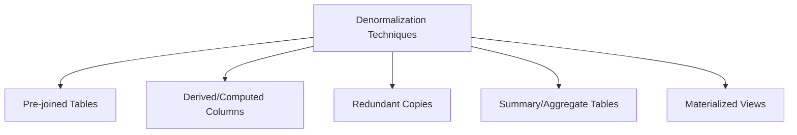
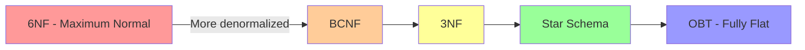

# Normalization & Denormalization

## Why Normalization Exists

Redundant data causes three types of anomalies:

1. **Update anomaly:** Changing a customer's address requires updating every row where that customer appears. Miss one, and the data is inconsistent.
2. **Insert anomaly:** You can't record a new department until at least one employee is assigned to it.
3. **Delete anomaly:** Deleting the last employee in a department also deletes the department's information.

Normalization eliminates these anomalies by decomposing tables so that every fact is stored exactly once.

### Historical Context

- **1970:** Edgar Codd defines the relational model and First Normal Form
- **1971:** Codd defines Second and Third Normal Form
- **1974:** Codd and Boyce define Boyce-Codd Normal Form (BCNF)
- **1977:** Fagin defines Fourth Normal Form (4NF)
- **1979:** Fagin defines Fifth Normal Form (5NF / Project-Join Normal Form)
- **2002:** Date, Darwen, and Lorentzos define Sixth Normal Form (6NF)

In practice, most production databases aim for 3NF or BCNF. Higher normal forms are rarely needed.

## First Principles

### Functional Dependencies

A functional dependency (FD) is the fundamental concept behind normalization:

$$
X \rightarrow Y
$$

Read: "$X$ functionally determines $Y$" — knowing the value of $X$ uniquely determines the value of $Y$.

**Examples:**
- `SSN -> Name, BirthDate` (Social Security Number determines name and birth date)
- `StudentID, CourseID -> Grade` (student-course combination determines grade)
- `ZipCode -> City, State` (zip code determines city and state)

**Formal definition:**

$$
X \rightarrow Y \iff \forall t_1, t_2 \in R: t_1[X] = t_2[X] \implies t_1[Y] = t_2[Y]
$$

### Armstrong's Axioms

The complete set of rules for reasoning about functional dependencies:

1. **Reflexivity:** If $Y \subseteq X$, then $X \rightarrow Y$
2. **Augmentation:** If $X \rightarrow Y$, then $XZ \rightarrow YZ$
3. **Transitivity:** If $X \rightarrow Y$ and $Y \rightarrow Z$, then $X \rightarrow Z$

**Derived rules:**
4. **Union:** If $X \rightarrow Y$ and $X \rightarrow Z$, then $X \rightarrow YZ$
5. **Decomposition:** If $X \rightarrow YZ$, then $X \rightarrow Y$ and $X \rightarrow Z$
6. **Pseudotransitivity:** If $X \rightarrow Y$ and $WY \rightarrow Z$, then $WX \rightarrow Z$

### Closure of Functional Dependencies

The closure of attribute set $X$ under a set of FDs $F$, written $X^+_F$, is all attributes functionally determined by $X$:

```typescript
function computeClosure(
  attributes: Set<string>,
  functionalDependencies: Array<{ lhs: Set<string>; rhs: Set<string> }>,
): Set<string> {
  const closure = new Set(attributes);
  let changed = true;

  while (changed) {
    changed = false;
    for (const fd of functionalDependencies) {
      // If lhs is a subset of closure, add rhs to closure
      if (isSubset(fd.lhs, closure)) {
        const sizeBefore = closure.size;
        for (const attr of fd.rhs) {
          closure.add(attr);
        }
        if (closure.size > sizeBefore) {
          changed = true;
        }
      }
    }
  }

  return closure;
}

function isSubset(subset: Set<string>, superset: Set<string>): boolean {
  for (const item of subset) {
    if (!superset.has(item)) return false;
  }
  return true;
}

// Example: Given FDs {A -> B, B -> C, A,D -> E}
// Closure of {A} = {A, B, C}
// Closure of {A, D} = {A, B, C, D, E}
const fds = [
  { lhs: new Set(['A']), rhs: new Set(['B']) },
  { lhs: new Set(['B']), rhs: new Set(['C']) },
  { lhs: new Set(['A', 'D']), rhs: new Set(['E']) },
];

const closureA = computeClosure(new Set(['A']), fds);
// closureA = { A, B, C }

const closureAD = computeClosure(new Set(['A', 'D']), fds);
// closureAD = { A, B, C, D, E }
```

### Candidate Keys

A candidate key is a minimal set of attributes whose closure is all attributes:

$$
K \text{ is a candidate key} \iff K^+_F = R \text{ and } \forall K' \subset K: K'^+_F \neq R
$$

```typescript
function findCandidateKeys(
  allAttributes: Set<string>,
  functionalDependencies: Array<{ lhs: Set<string>; rhs: Set<string> }>,
): Set<string>[] {
  const candidates: Set<string>[] = [];

  // Start with single attributes, grow if needed
  const queue: Set<string>[] = [...[...allAttributes].map((a) => new Set([a]))];
  const checked = new Set<string>();

  while (queue.length > 0) {
    const candidate = queue.shift()!;
    const key = [...candidate].sort().join(',');
    if (checked.has(key)) continue;
    checked.add(key);

    const closure = computeClosure(candidate, functionalDependencies);

    if (setsEqual(closure, allAttributes)) {
      // Check minimality — no proper subset is also a key
      const isMinimal = candidates.every(
        (existing) => !isSubset(existing, candidate),
      );
      if (isMinimal) {
        // Remove any existing candidates that are supersets
        const filtered = candidates.filter(
          (existing) => !isSubset(candidate, existing),
        );
        filtered.push(candidate);
        candidates.length = 0;
        candidates.push(...filtered);
      }
    } else {
      // Not a key — try adding one more attribute
      for (const attr of allAttributes) {
        if (!candidate.has(attr)) {
          const expanded = new Set(candidate);
          expanded.add(attr);
          queue.push(expanded);
        }
      }
    }
  }

  return candidates;
}

function setsEqual(a: Set<string>, b: Set<string>): boolean {
  if (a.size !== b.size) return false;
  for (const item of a) {
    if (!b.has(item)) return false;
  }
  return true;
}
```

## Normal Forms

### First Normal Form (1NF)

**Requirement:** All attributes contain only atomic (indivisible) values. No repeating groups.

**Violation:**

| OrderID | Product1 | Product2 | Product3 |
|---------|----------|----------|----------|
| 1 | Widget | Gadget | null |
| 2 | Sprocket | null | null |

**1NF (fixed):**

| OrderID | Product |
|---------|---------|
| 1 | Widget |
| 1 | Gadget |
| 2 | Sprocket |

::: warning
JSON columns and array types in modern databases technically violate 1NF. Whether this matters depends on whether you need to query individual array elements. For document-style storage (Postgres JSONB), pragmatic 1NF violations are often acceptable.
:::

### Second Normal Form (2NF)

**Requirement:** 1NF + no partial dependencies on any candidate key.

A partial dependency exists when a non-key attribute depends on only part of a composite key.

$$
\text{2NF violation: } AB \rightarrow C \text{ where } A \rightarrow C \text{ (partial dependency on key } AB\text{)}
$$

**Violation:**

| StudentID | CourseID | Grade | CourseName |
|-----------|----------|-------|------------|
| S1 | C1 | A | Math |
| S1 | C2 | B | Science |
| S2 | C1 | A | Math |

Key: `(StudentID, CourseID)`
FD: `CourseID -> CourseName` (partial dependency — CourseName depends only on CourseID)

**2NF (decomposed):**

**Enrollments:**
| StudentID | CourseID | Grade |
|-----------|----------|-------|
| S1 | C1 | A |

**Courses:**
| CourseID | CourseName |
|----------|------------|
| C1 | Math |

### Third Normal Form (3NF)

**Requirement:** 2NF + no transitive dependencies.

A transitive dependency exists when a non-key attribute determines another non-key attribute.

$$
\text{3NF violation: } A \rightarrow B \rightarrow C \text{ where } B \text{ is not a key}
$$

**Formal definition:** For every non-trivial FD $X \rightarrow A$ where $A$ is a single attribute:
- $X$ is a superkey, OR
- $A$ is a member of some candidate key (prime attribute)

**Violation:**

| EmployeeID | DepartmentID | DepartmentName | DepartmentHead |
|------------|-------------|----------------|----------------|
| E1 | D1 | Engineering | Alice |
| E2 | D1 | Engineering | Alice |
| E3 | D2 | Marketing | Bob |

FDs: `EmployeeID -> DepartmentID`, `DepartmentID -> DepartmentName, DepartmentHead`

Transitive: `EmployeeID -> DepartmentID -> DepartmentName`

**3NF (decomposed):**

**Employees:**
| EmployeeID | DepartmentID |
|------------|-------------|
| E1 | D1 |

**Departments:**
| DepartmentID | DepartmentName | DepartmentHead |
|-------------|----------------|----------------|
| D1 | Engineering | Alice |

### Boyce-Codd Normal Form (BCNF)

**Requirement:** For every non-trivial FD $X \rightarrow Y$: $X$ must be a superkey.

BCNF is stricter than 3NF — it doesn't allow the "prime attribute" exception.

$$
\text{BCNF: } \forall (X \rightarrow Y) \in F: X \text{ is a superkey}
$$

**Where 3NF and BCNF differ:**

| StudentID | Subject | Professor |
|-----------|---------|-----------|
| S1 | Math | Prof. A |
| S2 | Math | Prof. B |
| S1 | Science | Prof. C |

Candidate keys: `(StudentID, Subject)` and `(StudentID, Professor)`
FD: `Professor -> Subject` (each professor teaches one subject)

This is in 3NF (Subject is a prime attribute) but NOT in BCNF (Professor is not a superkey).

**BCNF decomposition:**

**StudentProfessor:**
| StudentID | Professor |
|-----------|-----------|
| S1 | Prof. A |

**ProfessorSubject:**
| Professor | Subject |
|-----------|---------|
| Prof. A | Math |

::: warning
BCNF decomposition may not preserve all functional dependencies. In the example above, the FD `(StudentID, Subject) -> Professor` is lost. In practice, this means you lose the ability to enforce that constraint through table structure alone. You need application-level or trigger-based enforcement.
:::

### BCNF Decomposition Algorithm

```typescript
interface Relation {
  name: string;
  attributes: Set<string>;
  fds: Array<{ lhs: Set<string>; rhs: Set<string> }>;
}

function decomposeToBCNF(relation: Relation): Relation[] {
  // Find a violating FD
  const violation = findBCNFViolation(relation);

  if (!violation) {
    return [relation]; // Already in BCNF
  }

  // Decompose: R into R1(X, Y) and R2(X, R-Y)
  const r1Attrs = new Set([...violation.lhs, ...violation.rhs]);
  const r2Attrs = new Set([...relation.attributes].filter(
    (a) => !violation.rhs.has(a) || violation.lhs.has(a),
  ));

  const r1: Relation = {
    name: `${relation.name}_1`,
    attributes: r1Attrs,
    fds: projectFDs(relation.fds, r1Attrs),
  };

  const r2: Relation = {
    name: `${relation.name}_2`,
    attributes: r2Attrs,
    fds: projectFDs(relation.fds, r2Attrs),
  };

  // Recursively decompose each part
  return [...decomposeToBCNF(r1), ...decomposeToBCNF(r2)];
}

function findBCNFViolation(
  relation: Relation,
): { lhs: Set<string>; rhs: Set<string> } | null {
  for (const fd of relation.fds) {
    // Check if lhs is a superkey
    const closure = computeClosure(fd.lhs, relation.fds);
    if (!isSubset(relation.attributes, closure)) {
      // lhs is not a superkey -> BCNF violation
      return fd;
    }
  }
  return null;
}

function projectFDs(
  fds: Array<{ lhs: Set<string>; rhs: Set<string> }>,
  attributes: Set<string>,
): Array<{ lhs: Set<string>; rhs: Set<string> }> {
  // Keep only FDs where all attributes are in the projection
  return fds.filter(
    (fd) =>
      isSubset(fd.lhs, attributes) && isSubset(fd.rhs, attributes),
  );
}
```

### Higher Normal Forms (Brief)

| Normal Form | Eliminates | Practical Use |
|-------------|-----------|---------------|
| 4NF | Multi-valued dependencies | Rare — specific patterns |
| 5NF (PJNF) | Join dependencies | Academic |
| 6NF | All non-trivial dependencies | Temporal databases, Data Vault |

## Denormalization

### Why Denormalize?

Normalization optimizes for write operations and data integrity. But analytical queries often need to read across many normalized tables, requiring expensive joins:

$$
\text{Query cost}_{\text{normalized}} = \sum_{i=1}^{n} |T_i| + \text{join\_cost}(T_1 \bowtie T_2 \bowtie \ldots \bowtie T_n)
$$

$$
\text{Query cost}_{\text{denormalized}} = |T_{\text{flat}}|
$$

Denormalization trades write complexity for read performance.

### Strategic Denormalization Techniques



#### Pre-Joined Tables

```sql
-- Normalized: 3 tables
SELECT o.order_id, c.name, p.product_name, oi.quantity
FROM orders o
JOIN customers c ON o.customer_id = c.customer_id
JOIN order_items oi ON o.order_id = oi.order_id
JOIN products p ON oi.product_id = p.product_id;

-- Denormalized: 1 table
SELECT order_id, customer_name, product_name, quantity
FROM order_details_flat;
```

#### Computed Columns

```sql
-- Instead of computing age from birth_date every query:
ALTER TABLE customers ADD COLUMN age INT;

-- Updated by trigger or batch job
UPDATE customers
SET age = EXTRACT(YEAR FROM AGE(CURRENT_DATE, birth_date));
```

#### Summary Tables

```typescript
interface SummaryTableDefinition {
  name: string;
  sourceTable: string;
  grain: string;
  dimensions: string[];
  measures: Array<{
    name: string;
    expression: string;
    aggregation: 'SUM' | 'COUNT' | 'AVG' | 'MIN' | 'MAX';
  }>;
  refreshSchedule: string;
}

const dailySalesSummary: SummaryTableDefinition = {
  name: 'summary_daily_sales',
  sourceTable: 'fact_sales JOIN dim_product JOIN dim_store',
  grain: 'product_category by store by day',
  dimensions: ['date_key', 'product_category', 'store_id'],
  measures: [
    { name: 'total_revenue', expression: 'SUM(total_amount)', aggregation: 'SUM' },
    { name: 'total_units', expression: 'SUM(quantity)', aggregation: 'SUM' },
    { name: 'transaction_count', expression: 'COUNT(*)', aggregation: 'SUM' },
    { name: 'avg_transaction_value', expression: 'AVG(total_amount)', aggregation: 'AVG' },
  ],
  refreshSchedule: 'DAILY 02:00 UTC',
};
```

### Denormalization Decision Matrix

| Factor | Normalize | Denormalize |
|--------|-----------|-------------|
| Write-heavy workload | Yes | No |
| Read-heavy workload | No | Yes |
| Data integrity critical | Yes | With constraints |
| Complex ad-hoc queries | Depends | Yes |
| Storage constrained | Yes | No |
| Query latency critical | No | Yes |
| Multiple update sources | Yes | Carefully |
| Reporting workload | No | Yes |

## Performance Characteristics

### Join Cost Analysis

For hash joins (most common in analytical databases):

$$
\text{Cost}(R \bowtie S) = O(|R| + |S|) \text{ (build + probe)}
$$

For $n$ tables:

$$
\text{Cost}(T_1 \bowtie T_2 \bowtie \ldots \bowtie T_n) = O\left(\sum_{i=1}^{n} |T_i| + |T_1 \bowtie T_2 \bowtie \ldots \bowtie T_n|\right)
$$

The result size depends on join selectivity:

$$
|R \bowtie_A S| = \frac{|R| \times |S|}{V(A)} \text{ (under uniform distribution)}
$$

Where $V(A)$ is the number of distinct values of the join attribute.

### Storage vs. Query Tradeoff

$$
\text{Redundancy factor} = \frac{|T_{\text{denormalized}}| \times \text{avg\_row\_size}_{\text{denorm}}}{sum(|T_i| \times \text{avg\_row\_size}_i)}
$$

Typical values:
- Mild denormalization: 1.2-2x storage
- Star schema: 2-5x storage
- Full flattening: 5-20x storage

### Index Efficiency

Normalized tables with proper indexes:

$$
\text{Lookup cost} = O(\log_B N) \text{ per index (B-tree)}
$$

Denormalized tables can use composite indexes more effectively:

$$
\text{Covering index cost} = O(\log_B N) \text{ with no table access}
$$

## Edge Cases & Failure Modes

### Denormalization Update Anomalies

The very anomalies normalization was designed to prevent return with denormalization:

```typescript
// DANGER: Denormalized table with customer name in every order
interface OrderFlat {
  orderId: number;
  customerName: string;  // Redundant — also in customers table
  productName: string;   // Redundant — also in products table
  amount: number;
}

// Customer renames: must update EVERY order row
async function updateCustomerName(
  customerId: string,
  newName: string,
  db: Database,
): Promise<number> {
  // This could update millions of rows
  const result = await db.query(
    'UPDATE order_details_flat SET customer_name = $1 WHERE customer_id = $2',
    [newName, customerId],
  );
  return result.rowCount; // Could be 100,000+ rows
}
```

**Mitigation strategies:**

1. **Materialized views:** Database manages consistency
2. **Event-driven updates:** CDC triggers denormalized table updates
3. **Accept staleness:** For analytical workloads, slightly stale denormalized data is often acceptable
4. **Rebuild pattern:** Drop and rebuild the denormalized table daily

### Over-Normalization

Excessive normalization creates its own problems:

```sql
-- Over-normalized: separate table for each attribute
CREATE TABLE person_names (person_id INT, name VARCHAR);
CREATE TABLE person_emails (person_id INT, email VARCHAR);
CREATE TABLE person_phones (person_id INT, phone VARCHAR);
CREATE TABLE person_addresses (person_id INT, address VARCHAR);
-- ... 20 more tables

-- Simple query requires 20+ joins
SELECT n.name, e.email, p.phone, a.address
FROM person_names n
JOIN person_emails e ON n.person_id = e.person_id
JOIN person_phones p ON n.person_id = p.person_id
JOIN person_addresses a ON n.person_id = a.person_id;
-- This is 6NF — almost never necessary
```

::: danger
6NF is almost never the right choice for production systems. It's useful in specialized temporal databases and Data Vault satellites, but for general-purpose use, 3NF or BCNF is sufficient.
:::

## Mathematical Foundations

### Lossless Decomposition

A decomposition of $R$ into $R_1$ and $R_2$ is lossless (no spurious tuples) iff:

$$
R_1 \cap R_2 \rightarrow R_1 \text{ or } R_1 \cap R_2 \rightarrow R_2
$$

The common attributes must functionally determine at least one of the decomposed relations.

**Proof:** If neither FD holds, the natural join $R_1 \bowtie R_2$ may contain tuples not in the original $R$ (spurious tuples).

### Dependency Preservation

A decomposition preserves dependencies if every FD in $F$ can be enforced using only the FDs within individual decomposed relations:

$$
\left(\bigcup_{i} F_i\right)^+ = F^+
$$

Where $F_i$ is the projection of $F$ onto $R_i$.

::: warning
BCNF decomposition is always lossless but may NOT preserve dependencies. 3NF decomposition is always both lossless AND dependency-preserving (Synthesis Algorithm).
:::

### Minimal Cover

A minimal (canonical) cover $F_c$ of FD set $F$ has:

1. Every FD has a single attribute on the right side
2. No FD can be removed without changing $F^+$
3. No attribute can be removed from the left side of any FD without changing $F^+$

```typescript
function computeMinimalCover(
  fds: Array<{ lhs: Set<string>; rhs: Set<string> }>,
): Array<{ lhs: Set<string>; rhs: string }> {
  // Step 1: Split right-hand sides
  let split: Array<{ lhs: Set<string>; rhs: string }> = [];
  for (const fd of fds) {
    for (const attr of fd.rhs) {
      split.push({ lhs: new Set(fd.lhs), rhs: attr });
    }
  }

  // Step 2: Remove redundant attributes from left sides
  for (const fd of split) {
    for (const attr of [...fd.lhs]) {
      const reduced = new Set(fd.lhs);
      reduced.delete(attr);
      if (reduced.size === 0) continue;

      const closure = computeClosure(
        reduced,
        split.map((f) => ({ lhs: f.lhs, rhs: new Set([f.rhs]) })),
      );
      if (closure.has(fd.rhs)) {
        fd.lhs = reduced;
      }
    }
  }

  // Step 3: Remove redundant FDs
  split = split.filter((fd, index) => {
    const remaining = split.filter((_, i) => i !== index);
    const closure = computeClosure(
      fd.lhs,
      remaining.map((f) => ({ lhs: f.lhs, rhs: new Set([f.rhs]) })),
    );
    return !closure.has(fd.rhs);
  });

  return split;
}
```

## Real-World War Stories

::: info War Story
**The Join of Death**

A SaaS company's analytics database had a perfectly normalized schema with 47 tables. Their most important dashboard required a 23-table join. During peak hours, this query took 45 seconds and consumed 100% of the database CPU.

**Analysis:**
- 23 tables joined produced 14 intermediate result sets
- Query optimizer chose suboptimal join ordering
- Several intermediate results were larger than any source table (Cartesian-like expansion)

**Fix:**
1. Created a denormalized `analytics_events` table with the 12 most-used attributes
2. Materialized view refreshed every 5 minutes
3. Dashboard query dropped from 23 joins to 0 joins
4. Query time: 45 seconds → 200 milliseconds
5. Storage increase: 3x for the denormalized table, but trivial compared to total database size
:::

::: info War Story
**The Normalization Religion**

A team of database purists insisted on 5NF for an e-commerce application. The product catalog had 8 levels of normalization with separate tables for each attribute domain.

Adding a new product required INSERT statements to 12 tables. The product page required JOINs across all 12 tables. During Black Friday, the product page load time exceeded 5 seconds, and the database connection pool was exhausted.

**Lesson:** Normal form is a tool, not a religion. OLTP systems typically need 3NF. OLAP systems need denormalization. Using 5NF for a web application was the wrong tool for the job.
:::

## Decision Framework

### Normalization Level Selection

| Application Type | Recommended Normal Form | Rationale |
|-----------------|----------------------|-----------|
| OLTP (operational) | 3NF or BCNF | Balance integrity and performance |
| OLAP (analytical) | Denormalized (star) | Read performance |
| Mixed workload | 3NF + materialized views | Best of both |
| Microservice DB | 3NF within service | Bounded context |
| Data Vault | ~6NF (satellites) | Maximum flexibility |
| Document store | 1NF or none | Schema-on-read |

### The Normalization/Denormalization Spectrum



Most production systems sit between 3NF and Star Schema. The extremes (6NF and OBT) are for specialized use cases.

## Advanced Topics

### Temporal Normalization

Traditional normalization doesn't account for time-varying data. Temporal databases extend the theory:

$$
\text{Temporal FD: } X \xrightarrow{t} Y \iff \forall t: X(t) \rightarrow Y(t)
$$

This means the FD holds at every point in time, not just in the current state.

### Normalization in NoSQL

NoSQL databases intentionally denormalize for specific access patterns:

```typescript
// DynamoDB: Denormalized single-table design
interface DynamoDBItem {
  PK: string;    // Partition key
  SK: string;    // Sort key
  // All attributes for all entity types in one table
  type: 'Customer' | 'Order' | 'OrderItem';
  customerName?: string;
  orderDate?: string;
  productName?: string;
  quantity?: number;
}

// Access pattern 1: Get customer by ID
// PK = 'CUSTOMER#123', SK = 'PROFILE'

// Access pattern 2: Get all orders for a customer
// PK = 'CUSTOMER#123', SK begins_with 'ORDER#'

// Access pattern 3: Get all items in an order
// PK = 'ORDER#456', SK begins_with 'ITEM#'
```

This is the antithesis of normalization — data is modeled around access patterns, not entities.

### Automated Denormalization with dbt

```sql
-- dbt model: automatically denormalize for analytics
-- models/marts/order_details.sql

SELECT
    o.order_id,
    o.order_date,
    c.customer_name,
    c.customer_segment,
    c.city AS customer_city,
    p.product_name,
    p.category AS product_category,
    oi.quantity,
    oi.unit_price,
    oi.quantity * oi.unit_price AS line_total
FROM {{ ref('stg_orders') }} o
JOIN {{ ref('stg_customers') }} c ON o.customer_id = c.customer_id
JOIN {{ ref('stg_order_items') }} oi ON o.order_id = oi.order_id
JOIN {{ ref('stg_products') }} p ON oi.product_id = p.product_id
```

## Cross-References

- [Data Modeling Overview](./index.md) — Context for normalization decisions
- [Dimensional Modeling](./dimensional-modeling.md) — How denormalization applies to star schemas
- [Schema Evolution](./schema-evolution.md) — Evolving normalized and denormalized schemas
- [Data Quality Checks](../pipeline-patterns/data-quality-checks.md) — Validating integrity constraints
