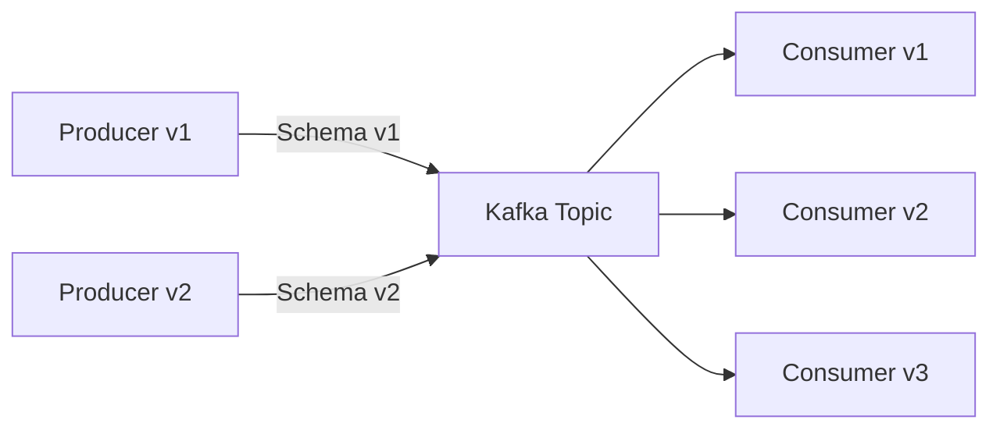
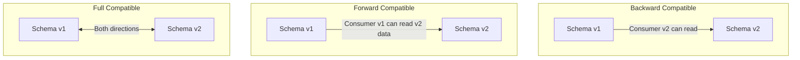
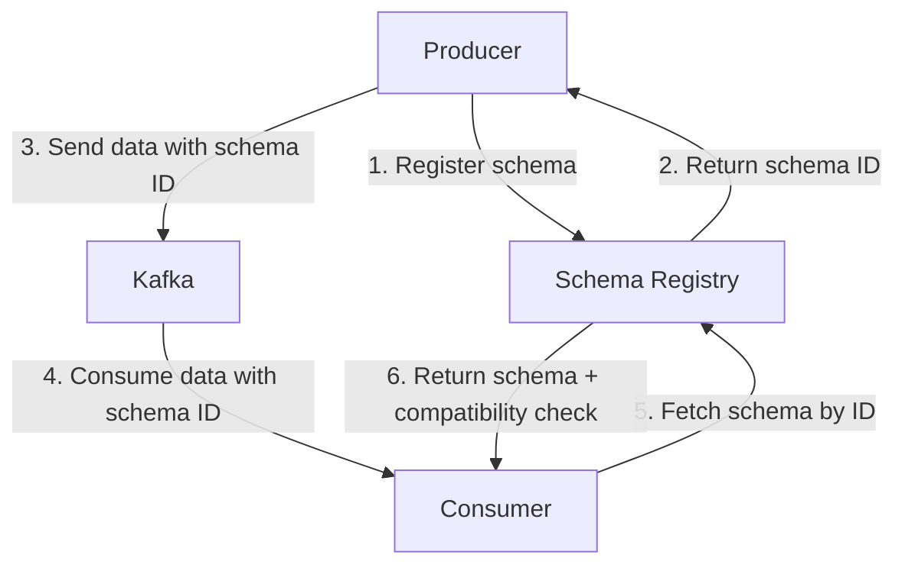
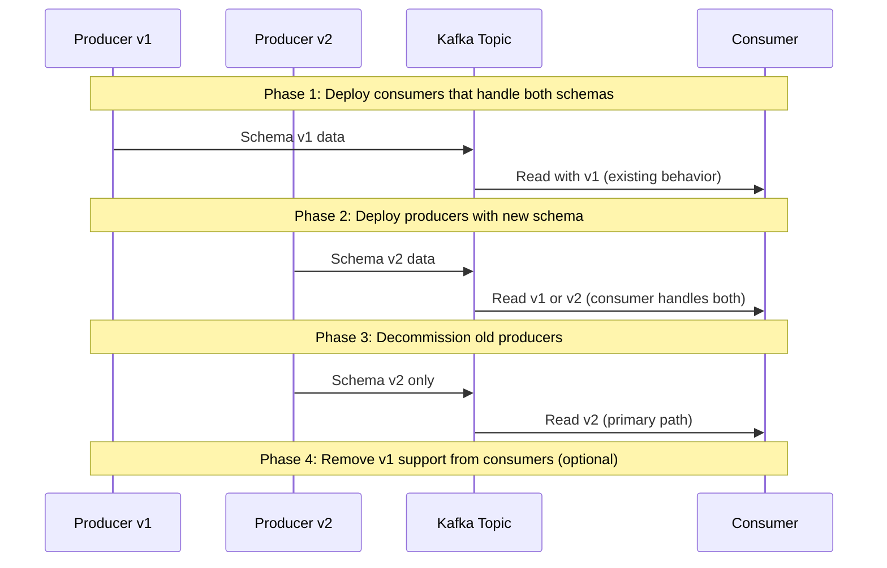
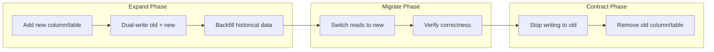

# Schema Evolution

## Why Schema Evolution Exists

Data schemas change. Business requirements evolve, new features need new fields, old fields become irrelevant, and data types need correction. In a monolithic batch system, you can stop everything, migrate the schema, and restart. In distributed streaming systems with multiple producers and consumers at different versions, this luxury doesn't exist.

Schema evolution is the discipline of changing data structures while maintaining compatibility between producers and consumers at different versions.

### The Core Problem



Producer v2 writes data with a new field. Consumer v1 doesn't know about this field. Consumer v3 expects a field that was removed in v2. Can everyone coexist?

### Historical Context

- **2009:** Apache Avro designed with schema evolution as a first-class feature
- **2011:** Google's Protocol Buffers v2 formalized field numbering for evolution
- **2014:** Confluent Schema Registry introduced for Kafka
- **2020s:** Schema evolution is now considered essential infrastructure for data platforms
- **2025:** Event-driven architectures and data contracts make schema evolution a critical concern

## First Principles

### Compatibility Types

There are four types of schema compatibility:

| Type | Producer | Consumer | Rule |
|------|----------|----------|------|
| **Backward** | Old schema | New schema | New consumers can read old data |
| **Forward** | New schema | Old schema | Old consumers can read new data |
| **Full** | Both directions | Both directions | Backward AND Forward |
| **None** | No guarantee | No guarantee | Anything goes (dangerous) |

Additionally, **transitive** variants check compatibility across ALL previous versions, not just the immediately preceding one.



### The Compatibility Contract

Formally, schema $S_2$ is backward compatible with $S_1$ if:

$$
\forall d \in \text{valid}(S_1): \text{decode}(S_2, \text{encode}(S_1, d)) \text{ succeeds}
$$

Schema $S_2$ is forward compatible with $S_1$ if:

$$
\forall d \in \text{valid}(S_2): \text{decode}(S_1, \text{encode}(S_2, d)) \text{ succeeds}
$$

## Schema Evolution Rules by Format

### Avro Evolution Rules

Avro uses a writer schema (used to encode) and a reader schema (used to decode). The reader must resolve differences.

| Change | Backward | Forward | Full |
|--------|----------|---------|------|
| Add field with default | Yes | Yes | Yes |
| Add field without default | No | Yes | No |
| Remove field with default | Yes | No | No |
| Remove field without default | No | No | No |
| Rename field (with alias) | Yes | Yes | Yes |
| Change type (promotable) | Depends | Depends | Depends |

```typescript
// Avro schema evolution example
const schemaV1 = {
  type: 'record',
  name: 'User',
  fields: [
    { name: 'id', type: 'string' },
    { name: 'name', type: 'string' },
    { name: 'email', type: 'string' },
  ],
};

// V2: Added 'age' with default (backward + forward compatible)
const schemaV2 = {
  type: 'record',
  name: 'User',
  fields: [
    { name: 'id', type: 'string' },
    { name: 'name', type: 'string' },
    { name: 'email', type: 'string' },
    { name: 'age', type: 'int', default: 0 }, // New field WITH default
  ],
};

// V3: Removed 'email', added 'phone' (ONLY backward compatible)
const schemaV3 = {
  type: 'record',
  name: 'User',
  fields: [
    { name: 'id', type: 'string' },
    { name: 'name', type: 'string' },
    { name: 'age', type: 'int', default: 0 },
    { name: 'phone', type: ['null', 'string'], default: null }, // Nullable with default
    // 'email' removed — old data still has it, reader ignores it
  ],
};
```

### Avro Schema Resolution

```typescript
interface AvroField {
  name: string;
  type: string | string[] | Record<string, unknown>;
  default?: unknown;
  aliases?: string[];
}

interface AvroSchema {
  type: 'record';
  name: string;
  fields: AvroField[];
}

class AvroSchemaResolver {
  /**
   * Resolve differences between writer and reader schemas.
   * Returns a resolution plan for each field.
   */
  resolve(
    writerSchema: AvroSchema,
    readerSchema: AvroSchema,
  ): FieldResolution[] {
    const resolutions: FieldResolution[] = [];

    for (const readerField of readerSchema.fields) {
      const writerField = this.findWriterField(readerField, writerSchema);

      if (writerField) {
        resolutions.push({
          fieldName: readerField.name,
          action: 'read_from_writer',
          writerFieldName: writerField.name,
        });
      } else if (readerField.default !== undefined) {
        resolutions.push({
          fieldName: readerField.name,
          action: 'use_default',
          defaultValue: readerField.default,
        });
      } else {
        resolutions.push({
          fieldName: readerField.name,
          action: 'error',
          errorMessage: `No matching field in writer and no default for '${readerField.name}'`,
        });
      }
    }

    // Writer fields not in reader are simply ignored
    return resolutions;
  }

  private findWriterField(
    readerField: AvroField,
    writerSchema: AvroSchema,
  ): AvroField | undefined {
    // Match by name
    const byName = writerSchema.fields.find(
      (f) => f.name === readerField.name,
    );
    if (byName) return byName;

    // Match by alias
    if (readerField.aliases) {
      for (const alias of readerField.aliases) {
        const byAlias = writerSchema.fields.find((f) => f.name === alias);
        if (byAlias) return byAlias;
      }
    }

    return undefined;
  }
}

interface FieldResolution {
  fieldName: string;
  action: 'read_from_writer' | 'use_default' | 'error';
  writerFieldName?: string;
  defaultValue?: unknown;
  errorMessage?: string;
}
```

### Protocol Buffers Evolution Rules

Protobuf uses field numbers for identification, making field names irrelevant for wire format compatibility.

| Change | Safe | Unsafe |
|--------|------|--------|
| Add new field | Yes (new number) | If number reused |
| Remove field | Yes (mark reserved) | If number reused |
| Rename field | Yes (numbers matter, not names) | N/A |
| Change field type | Some (int32 <-> int64) | Most type changes |
| Change field number | Never | Always breaks |

```protobuf
// v1
message User {
  string id = 1;
  string name = 2;
  string email = 3;
}

// v2 (compatible evolution)
message User {
  string id = 1;
  string name = 2;
  // Field 3 removed — mark as reserved
  reserved 3;
  reserved "email";
  int32 age = 4;      // New field
  string phone = 5;   // New field
}

// v3 (DANGEROUS — reuses field number 3!)
message User {
  string id = 1;
  string name = 2;
  string address = 3; // WRONG: reuses field number 3 (was email)
  int32 age = 4;
}
```

::: danger
Never reuse field numbers in Protobuf. Old data encoded with `email` at field 3 will be decoded as `address` at field 3, producing corrupted data. Always use `reserved` to retire field numbers permanently.
:::

### JSON Schema Evolution

JSON is the most permissive format — no built-in evolution rules. You must enforce them yourself:

```typescript
interface JSONSchemaEvolutionChecker {
  checkBackwardCompatibility(
    oldSchema: JSONSchema,
    newSchema: JSONSchema,
  ): CompatibilityResult;
}

interface JSONSchema {
  type: string;
  properties: Record<string, { type: string; required?: boolean; default?: unknown }>;
  required: string[];
}

interface CompatibilityResult {
  compatible: boolean;
  issues: string[];
}

class JSONSchemaEvolution implements JSONSchemaEvolutionChecker {
  checkBackwardCompatibility(
    oldSchema: JSONSchema,
    newSchema: JSONSchema,
  ): CompatibilityResult {
    const issues: string[] = [];

    // Check 1: No required field removed
    for (const field of oldSchema.required) {
      if (!newSchema.properties[field]) {
        issues.push(
          `Required field '${field}' was removed (breaks backward compat)`,
        );
      }
    }

    // Check 2: No new required fields without defaults
    for (const field of newSchema.required) {
      if (!oldSchema.properties[field] && !newSchema.properties[field]?.default) {
        issues.push(
          `New required field '${field}' has no default (breaks backward compat)`,
        );
      }
    }

    // Check 3: No type changes
    for (const [field, spec] of Object.entries(newSchema.properties)) {
      const oldSpec = oldSchema.properties[field];
      if (oldSpec && oldSpec.type !== spec.type) {
        issues.push(
          `Field '${field}' type changed from '${oldSpec.type}' to '${spec.type}'`,
        );
      }
    }

    return {
      compatible: issues.length === 0,
      issues,
    };
  }
}
```

## Schema Registry

### Architecture



### Implementation

```typescript
interface SchemaRegistryClient {
  register(subject: string, schema: AvroSchema): Promise<number>;
  getById(id: number): Promise<AvroSchema>;
  getLatest(subject: string): Promise<{ id: number; schema: AvroSchema }>;
  checkCompatibility(
    subject: string,
    schema: AvroSchema,
  ): Promise<{ compatible: boolean; messages: string[] }>;
  setCompatibility(
    subject: string,
    level: CompatibilityLevel,
  ): Promise<void>;
}

type CompatibilityLevel =
  | 'NONE'
  | 'BACKWARD'
  | 'BACKWARD_TRANSITIVE'
  | 'FORWARD'
  | 'FORWARD_TRANSITIVE'
  | 'FULL'
  | 'FULL_TRANSITIVE';

class SchemaRegistry implements SchemaRegistryClient {
  private schemas: Map<number, AvroSchema> = new Map();
  private subjects: Map<string, Array<{ id: number; version: number; schema: AvroSchema }>> =
    new Map();
  private compatibility: Map<string, CompatibilityLevel> = new Map();
  private nextId = 1;

  async register(subject: string, schema: AvroSchema): Promise<number> {
    // Check compatibility before registering
    const existing = this.subjects.get(subject) ?? [];
    const level = this.compatibility.get(subject) ?? 'BACKWARD';

    if (existing.length > 0 && level !== 'NONE') {
      const compatible = await this.checkCompatibility(subject, schema);
      if (!compatible.compatible) {
        throw new Error(
          `Schema incompatible: ${compatible.messages.join(', ')}`,
        );
      }
    }

    // Check if this exact schema already exists
    const existingEntry = existing.find(
      (e) => JSON.stringify(e.schema) === JSON.stringify(schema),
    );
    if (existingEntry) return existingEntry.id;

    const id = this.nextId++;
    this.schemas.set(id, schema);

    const versions = this.subjects.get(subject) ?? [];
    versions.push({ id, version: versions.length + 1, schema });
    this.subjects.set(subject, versions);

    return id;
  }

  async getById(id: number): Promise<AvroSchema> {
    const schema = this.schemas.get(id);
    if (!schema) throw new Error(`Schema not found: ${id}`);
    return schema;
  }

  async getLatest(
    subject: string,
  ): Promise<{ id: number; schema: AvroSchema }> {
    const versions = this.subjects.get(subject);
    if (!versions || versions.length === 0) {
      throw new Error(`Subject not found: ${subject}`);
    }
    const latest = versions[versions.length - 1];
    return { id: latest.id, schema: latest.schema };
  }

  async checkCompatibility(
    subject: string,
    schema: AvroSchema,
  ): Promise<{ compatible: boolean; messages: string[] }> {
    const level = this.compatibility.get(subject) ?? 'BACKWARD';
    const versions = this.subjects.get(subject) ?? [];

    if (versions.length === 0) {
      return { compatible: true, messages: [] };
    }

    const messages: string[] = [];
    const toCheck =
      level.includes('TRANSITIVE') ? versions : [versions[versions.length - 1]];

    for (const existing of toCheck) {
      const result = this.checkPairCompatibility(
        existing.schema,
        schema,
        level,
      );
      messages.push(...result.messages);
    }

    return { compatible: messages.length === 0, messages };
  }

  private checkPairCompatibility(
    oldSchema: AvroSchema,
    newSchema: AvroSchema,
    level: CompatibilityLevel,
  ): { messages: string[] } {
    const messages: string[] = [];

    if (level.startsWith('BACKWARD') || level === 'FULL' || level === 'FULL_TRANSITIVE') {
      // New reader must be able to read old data
      for (const newField of newSchema.fields) {
        const oldField = oldSchema.fields.find((f) => f.name === newField.name);
        if (!oldField && newField.default === undefined) {
          messages.push(
            `New field '${newField.name}' has no default (backward incompatible)`,
          );
        }
      }
    }

    if (level.startsWith('FORWARD') || level === 'FULL' || level === 'FULL_TRANSITIVE') {
      // Old reader must be able to read new data
      for (const oldField of oldSchema.fields) {
        const newField = newSchema.fields.find((f) => f.name === oldField.name);
        if (!newField && oldField.default === undefined) {
          messages.push(
            `Removed field '${oldField.name}' has no default in old schema (forward incompatible)`,
          );
        }
      }
    }

    return { messages };
  }

  async setCompatibility(
    subject: string,
    level: CompatibilityLevel,
  ): Promise<void> {
    this.compatibility.set(subject, level);
  }
}
```

### Subject Naming Strategies

| Strategy | Pattern | Use Case |
|----------|---------|----------|
| TopicName | `orders-value` | One schema per topic |
| RecordName | `com.company.Order` | Multiple event types per topic |
| TopicRecordName | `orders-com.company.Order` | Full isolation |

## Migration Strategies

### Online Schema Migration (Zero Downtime)



### Dual-Write Migration

For database schema changes that can't be done in a single step:

```typescript
interface DualWriteMigrator<T, U> {
  // Phase 1: Write to both old and new schema
  writeToOld(data: T): Promise<void>;
  writeToNew(data: U): Promise<void>;

  // Phase 2: Backfill old data into new schema
  backfill(batchSize: number): Promise<number>;

  // Phase 3: Verify consistency
  verify(sampleSize: number): Promise<VerificationResult>;

  // Phase 4: Switch reads to new schema
  switchReads(): Promise<void>;

  // Phase 5: Stop writes to old schema
  stopOldWrites(): Promise<void>;
}

interface VerificationResult {
  totalChecked: number;
  mismatches: number;
  mismatchExamples: Array<{ id: string; oldValue: unknown; newValue: unknown }>;
}

class ColumnAdditionMigrator {
  constructor(
    private readonly db: Database,
    private readonly table: string,
    private readonly newColumn: string,
    private readonly defaultValue: unknown,
  ) {}

  async migrate(): Promise<void> {
    // Phase 1: Add nullable column
    await this.db.query(
      `ALTER TABLE ${this.table} ADD COLUMN ${this.newColumn} TEXT`,
      [],
    );

    // Phase 2: Backfill default values
    let updated = 0;
    do {
      const result = await this.db.query(
        `UPDATE ${this.table}
         SET ${this.newColumn} = $1
         WHERE ${this.newColumn} IS NULL
         LIMIT 10000`,
        [this.defaultValue],
      );
      updated = result.rowCount;
      // Yield to avoid blocking other operations
      await new Promise((resolve) => setTimeout(resolve, 100));
    } while (updated > 0);

    // Phase 3: Add NOT NULL constraint (if needed)
    await this.db.query(
      `ALTER TABLE ${this.table}
       ALTER COLUMN ${this.newColumn} SET NOT NULL`,
      [],
    );
  }
}

interface Database {
  query(sql: string, params: unknown[]): Promise<{ rowCount: number }>;
}
```

### Expand-Contract Pattern

The safest approach for breaking changes:



## Performance Characteristics

### Schema Registry Overhead

| Operation | Latency | Frequency |
|-----------|---------|-----------|
| Register schema | 10-50ms | Once per deployment |
| Get schema by ID | 1-5ms (cached) | Once per consumer startup |
| Compatibility check | 5-20ms | Once per registration |

Schemas are cached client-side, so the per-message overhead is zero after the initial fetch.

### Serialization Format Comparison

| Format | Schema Evolution | Encoding Size | Encode Speed | Decode Speed |
|--------|-----------------|---------------|-------------|-------------|
| JSON | Manual | Large (100%) | Fast | Fast |
| Avro | Excellent | Small (30-50%) | Medium | Medium |
| Protobuf | Good | Smallest (20-40%) | Fastest | Fastest |
| Thrift | Good | Small (30-50%) | Fast | Fast |
| MessagePack | None | Medium (60-80%) | Fast | Fast |

### Schema Evolution Impact on Storage

$$
\text{Storage with evolution} = \sum_{v=1}^{V} |D_v| \times \text{row\_size}(v)
$$

Where $V$ is the number of schema versions and $|D_v|$ is the amount of data written with version $v$.

Avro handles this efficiently because the schema is stored once in the Schema Registry, not with every record. The per-record overhead is just the schema ID (4 bytes).

## Edge Cases & Failure Modes

### Breaking Change Detection

```typescript
class BreakingChangeDetector {
  detectBreakingChanges(
    oldSchema: AvroSchema,
    newSchema: AvroSchema,
  ): BreakingChange[] {
    const changes: BreakingChange[] = [];

    // Removed fields without defaults
    for (const oldField of oldSchema.fields) {
      const newField = newSchema.fields.find((f) => f.name === oldField.name);
      if (!newField) {
        changes.push({
          type: 'field_removed',
          field: oldField.name,
          severity: oldField.default !== undefined ? 'warning' : 'breaking',
          message: `Field '${oldField.name}' was removed`,
        });
      }
    }

    // Type changes
    for (const newField of newSchema.fields) {
      const oldField = oldSchema.fields.find((f) => f.name === newField.name);
      if (oldField && JSON.stringify(oldField.type) !== JSON.stringify(newField.type)) {
        changes.push({
          type: 'type_changed',
          field: newField.name,
          severity: 'breaking',
          message: `Field '${newField.name}' type changed from ${JSON.stringify(oldField.type)} to ${JSON.stringify(newField.type)}`,
        });
      }
    }

    // Required field added without default
    for (const newField of newSchema.fields) {
      const oldField = oldSchema.fields.find((f) => f.name === newField.name);
      if (!oldField && newField.default === undefined) {
        changes.push({
          type: 'required_field_added',
          field: newField.name,
          severity: 'breaking',
          message: `New field '${newField.name}' has no default value`,
        });
      }
    }

    return changes;
  }
}

interface BreakingChange {
  type: string;
  field: string;
  severity: 'info' | 'warning' | 'breaking';
  message: string;
}
```

### Schema Registry Unavailability

If the Schema Registry is down, producers cannot register new schemas and consumers cannot fetch unknown schemas:

```typescript
class ResilientSchemaRegistryClient {
  private cache: Map<number, AvroSchema> = new Map();
  private subjectCache: Map<string, { id: number; schema: AvroSchema }> = new Map();

  constructor(
    private readonly client: SchemaRegistryClient,
    private readonly fallbackSchemas: Map<number, AvroSchema>,
  ) {}

  async getById(id: number): Promise<AvroSchema> {
    // Check local cache first
    const cached = this.cache.get(id);
    if (cached) return cached;

    try {
      const schema = await this.client.getById(id);
      this.cache.set(id, schema);
      return schema;
    } catch (error) {
      // Fall back to pre-loaded schemas
      const fallback = this.fallbackSchemas.get(id);
      if (fallback) {
        console.warn(
          `Schema Registry unavailable, using fallback for schema ${id}`,
        );
        return fallback;
      }
      throw new Error(
        `Schema Registry unavailable and no fallback for schema ${id}`,
      );
    }
  }
}
```

### Transitive Compatibility Violations

Schema v1 is compatible with v2, and v2 is compatible with v3, but v1 may NOT be compatible with v3:

```
v1: { name: string, email: string }
v2: { name: string, email: string, age: int (default=0) }  -- backward compat with v1
v3: { name: string, age: int }                               -- backward compat with v2

But v3 is NOT backward compatible with v1!
(v1 data has 'email' which v3 ignores — OK
 v1 data lacks 'age' which v3 expects — v3 has default for age — OK in Avro)

Actually this specific example IS compatible. The real problem is:
v1: { name: string, email: string }
v2: { name: string, email: string, age: int (default=0) }
v3: { name: string, age: int (NO DEFAULT) }  -- compatible with v2 but not v1
```

This is why **BACKWARD_TRANSITIVE** exists — it checks compatibility against ALL versions, not just the latest.

## Mathematical Foundations

### Schema Lattice

Schemas under the subtyping relation form a lattice:

$$
S_1 \leq S_2 \iff \text{every valid instance of } S_1 \text{ is also valid under } S_2
$$

The lattice has:
- Top element: the "any" type (accepts everything)
- Bottom element: the "empty" type (accepts nothing)

Schema evolution is movement within this lattice:
- Backward compatible: moving up (becoming more permissive)
- Forward compatible: moving down (becoming more restrictive)
- Full compatible: moving to a comparable element

### Information Theory Perspective

$$
\text{Schema information content}: I(S) = -\sum_{t \in \text{types}} p(t) \log p(t)
$$

More restrictive schemas have higher information content (they tell you more about the data). Schema evolution that adds optional fields increases the type space, reducing information density per field.

## Real-World War Stories

::: info War Story
**The Protobuf Field Number Reuse Disaster**

A team removed a `user_email` field (field number 5) from a Protobuf message and later added a `user_phone` field at field number 5. Old messages stored in Kafka still had email data at field 5.

When consumers read these old messages, they decoded the email bytes as a phone number. Some "phone numbers" were valid enough to not cause errors but contained email addresses, which were then sent via SMS as part of an identity verification flow.

Over 10,000 customers received SMS messages to email addresses (which obviously failed). The incident required a full topic rewrite.

**Fix:**
1. Used `reserved 5;` to permanently retire the field number
2. Added a CI check that compares current Protobuf files against the Schema Registry to detect field number reuse
3. All field removals now go through a review that checks the field number is reserved
:::

::: info War Story
**The Avro Default Value Trap**

A team added a new field `risk_score` to their user event schema with `"default": 0`. All existing consumers were backward compatible — they'd read 0 for old events.

The problem: the risk model that populated `risk_score` treated 0 as "lowest risk." Old events (pre-upgrade) were treated as lowest risk, skewing the risk distribution and causing the fraud detection system to miss high-risk historical patterns.

**Lesson:** The default value must be semantically meaningful. Use `null` (with a union type `["null", "int"]`) when the value is truly unknown, not 0.
:::

## Decision Framework

### Compatibility Level Selection

| Scenario | Recommended Level |
|----------|------------------|
| Internal microservices, single team | BACKWARD |
| Shared platform, multiple teams | FULL_TRANSITIVE |
| Public API events | FULL_TRANSITIVE |
| Log/metrics data (read by many) | FORWARD |
| Single consumer, controlled upgrade | BACKWARD |
| Long-lived topics (years of data) | FULL_TRANSITIVE |

### Schema Format Selection

| Factor | Avro | Protobuf | JSON |
|--------|------|----------|------|
| Schema evolution support | Best | Good | Manual |
| Human readability | Medium | Low | Best |
| Encoding efficiency | Good | Best | Worst |
| Language support | Good | Best | Universal |
| Schema Registry integration | Native | Good | Limited |
| Learning curve | Medium | Medium | Low |

## Advanced Topics

### Data Contracts

Schema evolution is evolving into **data contracts** — formal agreements between producers and consumers:

```typescript
interface DataContract {
  apiVersion: string;
  kind: 'DataContract';
  metadata: {
    name: string;
    version: string;
    owner: string;
    team: string;
  };
  schema: {
    type: 'avro' | 'protobuf' | 'json';
    specification: unknown; // The actual schema
  };
  quality: {
    checks: Array<{
      name: string;
      type: 'not_null' | 'unique' | 'range' | 'regex' | 'freshness';
      field?: string;
      parameters?: Record<string, unknown>;
    }>;
  };
  sla: {
    freshness: string;       // e.g., "PT5M" (5 minutes)
    availability: number;    // e.g., 0.999
    completeness: number;    // e.g., 0.99
  };
  compatibility: CompatibilityLevel;
}
```

### Schema Evolution in Data Lakes

Parquet/Delta Lake/Iceberg handle schema evolution at the file level:

```typescript
interface TableSchemaEvolution {
  // Adding columns
  addColumn(name: string, type: string, position?: 'first' | 'after'): void;

  // Renaming columns
  renameColumn(oldName: string, newName: string): void;

  // Changing types (limited: widening only)
  widenType(column: string, newType: string): void;

  // Partition evolution (Iceberg-specific)
  evolvePartition(oldSpec: PartitionSpec, newSpec: PartitionSpec): void;
}

interface PartitionSpec {
  fields: Array<{
    sourceColumn: string;
    transform: 'identity' | 'year' | 'month' | 'day' | 'hour' | 'bucket' | 'truncate';
    parameters?: Record<string, unknown>;
  }>;
}
```

Apache Iceberg's schema evolution is the most advanced — it supports adding, dropping, renaming, reordering, and type-widening columns without rewriting existing data files.

### CI/CD Schema Validation

```typescript
class SchemaCICheck {
  async validateSchemaChange(
    oldSchemaPath: string,
    newSchemaPath: string,
    compatibilityLevel: CompatibilityLevel,
  ): Promise<{ pass: boolean; report: string }> {
    const oldSchema = await this.loadSchema(oldSchemaPath);
    const newSchema = await this.loadSchema(newSchemaPath);

    const detector = new BreakingChangeDetector();
    const changes = detector.detectBreakingChanges(oldSchema, newSchema);

    const breakingChanges = changes.filter((c) => c.severity === 'breaking');

    if (breakingChanges.length > 0) {
      return {
        pass: false,
        report: [
          'SCHEMA COMPATIBILITY CHECK FAILED',
          `Compatibility level: ${compatibilityLevel}`,
          '',
          'Breaking changes detected:',
          ...breakingChanges.map(
            (c) => `  - [${c.type}] ${c.message}`,
          ),
          '',
          'To fix:',
          '  - Add default values to new required fields',
          '  - Use reserved field numbers instead of removing fields',
          '  - Use type widening instead of type changes',
        ].join('\n'),
      };
    }

    return {
      pass: true,
      report: `Schema change compatible (${changes.length} non-breaking changes)`,
    };
  }

  private async loadSchema(_path: string): Promise<AvroSchema> {
    // Load and parse schema from file
    return { type: 'record', name: '', fields: [] };
  }
}
```

## Cross-References

- [Data Modeling Overview](./index.md) — Schema design context
- [Normalization & Denormalization](./normalization-denormalization.md) — Schema structure decisions
- [CDC Patterns](../pipeline-patterns/cdc-patterns.md) — Schema evolution in CDC pipelines
- [Data Quality Checks](../pipeline-patterns/data-quality-checks.md) — Schema validation as quality check
- [Testing Data Pipelines](../pipeline-patterns/testing-data-pipelines.md) — Schema evolution testing
