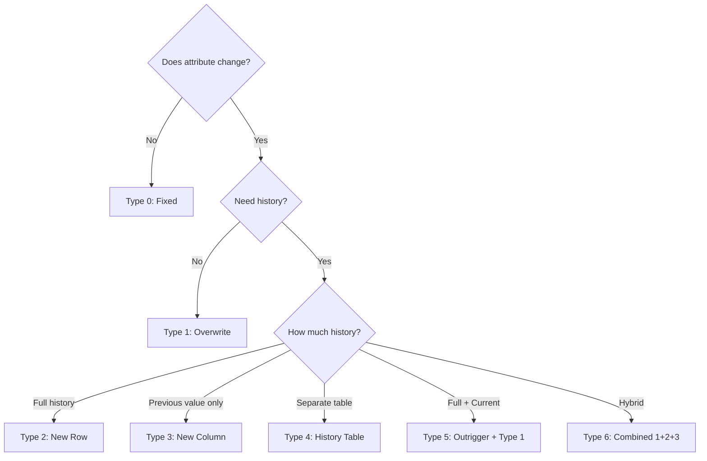

# Slowly Changing Dimensions (SCD)

## Why SCDs Exist

Dimension attributes change over time. A customer moves to a new city. A product gets reclassified into a different category. An employee switches departments.

The question is: **when you look at historical facts, which version of the dimension do you want to see?**

- "How much revenue came from customers in California?" — Do you mean customers who are **currently** in California, or customers who were in California **at the time of the sale**?

These two questions can give dramatically different answers, and the SCD type you choose determines which question your model can answer.

### Historical Context

Ralph Kimball defined the original SCD types (1-3) in "The Data Warehouse Toolkit" (1996). Types 4-6 were added later by the community. SCD Type 2 remains the most commonly used approach in production data warehouses.

## First Principles

### The Temporal Dimension Problem

Every dimension attribute has a time component:

$$
\text{attribute}(t) = \text{the value of the attribute at time } t
$$

The SCD type determines how we store and query this temporal relationship:

$$
\text{SCD Type} \rightarrow \text{How we model } \text{attribute}: T \rightarrow V
$$

Where $T$ is the time domain and $V$ is the value domain.

### Classification Framework



## SCD Types In Depth

### SCD Type 0: Fixed (Retain Original)

The attribute value is assigned once and never changes, even if the real-world value changes.

**Use case:** Original customer signup date, first order date, birth date.

```sql
-- Type 0: These columns never update
CREATE TABLE dim_customer (
    customer_key    INT PRIMARY KEY,
    customer_id     VARCHAR(20),
    original_name   VARCHAR(100),    -- Name at signup (never changes)
    signup_date     DATE,            -- Fixed
    birth_date      DATE             -- Fixed
);
```

**Characteristics:**
- Simplest implementation
- No ETL update logic needed
- Cannot reflect corrections (if birth date was entered wrong, it stays wrong)

### SCD Type 1: Overwrite

The current value replaces the old value. No history is preserved.

```typescript
interface SCDType1Update {
  dimensionTable: string;
  naturalKey: string;
  changedAttributes: Record<string, unknown>;
}

async function applyType1(
  update: SCDType1Update,
  db: Database,
): Promise<void> {
  const setClauses = Object.entries(update.changedAttributes)
    .map(([key, _], i) => `${key} = $${i + 2}`)
    .join(', ');

  await db.query(
    `UPDATE ${update.dimensionTable}
     SET ${setClauses}
     WHERE customer_id = $1`,
    [update.naturalKey, ...Object.values(update.changedAttributes)],
  );
}

// Before: { customer_id: 'C1', city: 'New York', segment: 'Basic' }
// After:  { customer_id: 'C1', city: 'San Francisco', segment: 'Basic' }
// History of 'New York' is LOST
```

**Characteristics:**
- Simple implementation (just UPDATE)
- No storage growth from changes
- Historical analysis is impossible
- All facts retroactively reflect the current dimension state

**When to use:**
- Correcting data entry errors
- Attributes that don't matter historically (phone number format changes)
- Low-importance attributes

### SCD Type 2: New Row (Versioned)

Every change creates a new dimension row. Facts link to the version that was current at the time of the fact.

This is the most important and most commonly used SCD type.

```sql
CREATE TABLE dim_customer (
    customer_key    INT PRIMARY KEY,        -- Surrogate key (unique per version)
    customer_id     VARCHAR(20),            -- Natural/business key
    customer_name   VARCHAR(100),
    city            VARCHAR(50),
    segment         VARCHAR(20),
    effective_from  DATE NOT NULL,
    effective_to    DATE,                   -- NULL = current
    is_current      BOOLEAN DEFAULT TRUE,
    version         INT DEFAULT 1
);

-- History:
-- Key=1, ID=C1, City=New York,       2024-01-01 to 2025-06-15, is_current=false, v=1
-- Key=7, ID=C1, City=San Francisco,  2025-06-15 to 2026-01-10, is_current=false, v=2
-- Key=15, ID=C1, City=Seattle,       2026-01-10 to NULL,        is_current=true,  v=3
```

```typescript
interface SCDType2Config {
  dimensionTable: string;
  surrogateKeyColumn: string;
  naturalKeyColumn: string;
  trackingColumns: string[];
  effectiveFromColumn: string;
  effectiveToColumn: string;
  isCurrentColumn: string;
}

async function applyType2(
  naturalKey: string,
  newAttributes: Record<string, unknown>,
  config: SCDType2Config,
  db: Database,
  keyGen: SurrogateKeyGenerator,
): Promise<{ action: 'insert' | 'update' | 'none'; newKey?: number }> {
  // 1. Get current record
  const current = await db.query(
    `SELECT * FROM ${config.dimensionTable}
     WHERE ${config.naturalKeyColumn} = $1
     AND ${config.isCurrentColumn} = TRUE`,
    [naturalKey],
  );

  if (current.rowCount === 0) {
    // New entity — insert first version
    const newKey = keyGen.next();
    await db.query(
      `INSERT INTO ${config.dimensionTable}
       (${config.surrogateKeyColumn}, ${config.naturalKeyColumn},
        ${config.trackingColumns.join(', ')},
        ${config.effectiveFromColumn}, ${config.effectiveToColumn},
        ${config.isCurrentColumn}, version)
       VALUES ($1, $2, ${config.trackingColumns.map((_, i) => `$${i + 3}`).join(', ')},
        CURRENT_DATE, NULL, TRUE, 1)`,
      [newKey, naturalKey, ...config.trackingColumns.map((c) => newAttributes[c])],
    );
    return { action: 'insert', newKey };
  }

  // 2. Check if any tracked attributes changed
  const currentRow = (current as any).rows[0];
  const hasChange = config.trackingColumns.some(
    (col) => currentRow[col] !== newAttributes[col],
  );

  if (!hasChange) {
    return { action: 'none' };
  }

  // 3. Close the current record
  await db.query(
    `UPDATE ${config.dimensionTable}
     SET ${config.effectiveToColumn} = CURRENT_DATE,
         ${config.isCurrentColumn} = FALSE
     WHERE ${config.surrogateKeyColumn} = $1`,
    [currentRow[config.surrogateKeyColumn]],
  );

  // 4. Insert new version
  const newKey = keyGen.next();
  const newVersion = currentRow.version + 1;
  await db.query(
    `INSERT INTO ${config.dimensionTable}
     (${config.surrogateKeyColumn}, ${config.naturalKeyColumn},
      ${config.trackingColumns.join(', ')},
      ${config.effectiveFromColumn}, ${config.effectiveToColumn},
      ${config.isCurrentColumn}, version)
     VALUES ($1, $2, ${config.trackingColumns.map((_, i) => `$${i + 3}`).join(', ')},
      CURRENT_DATE, NULL, TRUE, $${config.trackingColumns.length + 3})`,
    [
      newKey,
      naturalKey,
      ...config.trackingColumns.map((c) => newAttributes[c]),
      newVersion,
    ],
  );

  return { action: 'update', newKey };
}

interface SurrogateKeyGenerator {
  next(): number;
}

interface Database {
  query(sql: string, params: unknown[]): Promise<{ rowCount: number; rows?: unknown[] }>;
}
```

**Point-in-time query:**

```sql
-- What segment was customer C1 in on 2025-09-01?
SELECT customer_name, city, segment
FROM dim_customer
WHERE customer_id = 'C1'
  AND effective_from <= '2025-09-01'
  AND (effective_to > '2025-09-01' OR effective_to IS NULL);
```

**Characteristics:**
- Full history preserved
- Facts link to correct version automatically
- Dimension table grows with changes (can be large for volatile attributes)
- Requires surrogate keys
- Most complex ETL logic

### SCD Type 3: Previous Value Column

Add a column to store the previous value. Only tracks one change.

```sql
CREATE TABLE dim_customer (
    customer_key        INT PRIMARY KEY,
    customer_id         VARCHAR(20),
    current_city        VARCHAR(50),
    previous_city       VARCHAR(50),
    city_change_date    DATE,
    current_segment     VARCHAR(20),
    previous_segment    VARCHAR(20),
    segment_change_date DATE
);
```

```typescript
async function applyType3(
  naturalKey: string,
  attributeName: string,
  newValue: string,
  db: Database,
): Promise<void> {
  await db.query(
    `UPDATE dim_customer
     SET previous_${attributeName} = current_${attributeName},
         current_${attributeName} = $1,
         ${attributeName}_change_date = CURRENT_DATE
     WHERE customer_id = $2`,
    [newValue, naturalKey],
  );
}
```

**Characteristics:**
- Only tracks one previous value (not full history)
- No dimension row growth
- Schema changes needed for each tracked attribute
- Rarely used in practice

### SCD Type 4: History Table

Current values in the main dimension table, full history in a separate table.

```sql
-- Main dimension (current values only — fast for queries)
CREATE TABLE dim_customer (
    customer_key    INT PRIMARY KEY,
    customer_id     VARCHAR(20),
    customer_name   VARCHAR(100),
    city            VARCHAR(50),
    segment         VARCHAR(20)
);

-- History table (all changes)
CREATE TABLE dim_customer_history (
    history_id      BIGINT PRIMARY KEY,
    customer_key    INT REFERENCES dim_customer(customer_key),
    customer_name   VARCHAR(100),
    city            VARCHAR(50),
    segment         VARCHAR(20),
    effective_from  DATE,
    effective_to    DATE
);
```

**Characteristics:**
- Current-value queries are fast (no filtering)
- Full history available when needed
- Two tables to maintain
- Fact table must decide which table to reference

### SCD Type 5: Type 4 + Type 1 Mini-Dimension

Adds a foreign key from the fact table to the current mini-dimension, plus a Type 4 history table:

```sql
-- Mini-dimension with current values (embedded in fact)
CREATE TABLE fact_sales (
    sale_id         BIGINT PRIMARY KEY,
    date_key        INT,
    customer_key    INT,           -- Links to current customer dimension
    customer_profile_key INT,      -- Links to current profile mini-dimension
    -- ... measures
    amount          DECIMAL(12,2)
);

CREATE TABLE dim_customer_profile (
    profile_key     INT PRIMARY KEY,
    age_band        VARCHAR(10),
    income_band     VARCHAR(20),
    loyalty_tier    VARCHAR(10)
);
```

### SCD Type 6: Hybrid (1 + 2 + 3)

Combines Types 1, 2, and 3. New rows for changes (Type 2), plus previous value columns (Type 3), plus overwriting current values across all rows (Type 1).

```sql
CREATE TABLE dim_customer (
    customer_key      INT PRIMARY KEY,
    customer_id       VARCHAR(20),
    -- Type 2 attributes (versioned)
    historical_city   VARCHAR(50),     -- Value at the time of this version
    -- Type 3 attribute (previous value)
    previous_city     VARCHAR(50),
    -- Type 1 attribute (always current, overwritten across all rows)
    current_city      VARCHAR(50),
    -- Tracking
    effective_from    DATE,
    effective_to      DATE,
    is_current        BOOLEAN
);
```

```typescript
async function applyType6(
  naturalKey: string,
  newCity: string,
  db: Database,
  keyGen: SurrogateKeyGenerator,
): Promise<void> {
  // Get current record
  const current = await db.query(
    `SELECT * FROM dim_customer WHERE customer_id = $1 AND is_current = TRUE`,
    [naturalKey],
  );

  const currentRow = (current as any).rows[0];
  const oldCity = currentRow.historical_city;

  // Type 1: Update current_city across ALL versions
  await db.query(
    `UPDATE dim_customer SET current_city = $1 WHERE customer_id = $2`,
    [newCity, naturalKey],
  );

  // Type 2: Close current version, create new
  await db.query(
    `UPDATE dim_customer
     SET effective_to = CURRENT_DATE, is_current = FALSE
     WHERE customer_key = $1`,
    [currentRow.customer_key],
  );

  const newKey = keyGen.next();
  await db.query(
    `INSERT INTO dim_customer
     (customer_key, customer_id, historical_city, previous_city,
      current_city, effective_from, effective_to, is_current)
     VALUES ($1, $2, $3, $4, $5, CURRENT_DATE, NULL, TRUE)`,
    [newKey, naturalKey, newCity, oldCity, newCity],
  );
}
```

**Query capabilities with Type 6:**

```sql
-- Current city for all time: WHERE customer_id = 'C1' (use current_city)
-- City at time of event: JOIN on customer_key (use historical_city)
-- Previous city: SELECT previous_city WHERE is_current = TRUE
```

## Comparison Table

| Type | History | Row Growth | Complexity | Query Speed | Use Case |
|------|---------|-----------|------------|-------------|----------|
| 0 | None | None | Lowest | Fastest | Fixed attributes |
| 1 | None (overwrite) | None | Low | Fastest | Error corrections |
| 2 | Full | Linear with changes | High | Medium | Most common for analytics |
| 3 | One previous | None | Medium | Fast | Limited history needs |
| 4 | Full (separate) | Separate table | Medium | Fast for current | Separate hot/cold |
| 5 | Full + embedded | Mini-dimension | High | Fastest for current | Large dimensions |
| 6 | Full + current + previous | Linear | Highest | Fast for all queries | Maximum flexibility |

## Performance Characteristics

### SCD Type 2 Dimension Growth

$$
|\text{dim\_table}| = |E| + \sum_{e \in E} (\text{changes}(e) - 1)
$$

Where $|E|$ is the number of entities and changes($e$) is the number of attribute changes for entity $e$.

For a customer dimension with 10M customers, average 3 changes per customer over 5 years:

$$
|\text{dim\_customer}| = 10M + 10M \times (3 - 1) = 30M \text{ rows}
$$

With 20 columns averaging 30 bytes: $30M \times 600B \approx 18$ GB.

### Query Performance Impact

| Query Type | Type 1 | Type 2 |
|-----------|--------|--------|
| Current state lookup | $O(1)$ indexed | $O(1)$ with `is_current` index |
| Historical lookup | N/A | $O(\log n)$ with date range index |
| Full table scan | $n$ rows | $n \times \text{avg\_versions}$ rows |
| Join with fact table | Direct FK | FK matches one version |

::: tip
Always create a composite index on `(natural_key, effective_from, effective_to)` for Type 2 dimensions. Without it, point-in-time lookups require a full table scan.
:::

## Edge Cases & Failure Modes

### Rapid Changes (Flash Dimensions)

Some attributes change so frequently that SCD Type 2 creates millions of rows:

```
Customer C1: segment changed 500 times in one year (marketing system updates)
→ 500 version rows per customer × 10M customers = 5 BILLION rows
```

**Mitigation:**
1. Don't track rapidly changing attributes in the same satellite
2. Use a mini-dimension (Type 5) for volatile attributes
3. Batch daily changes — only capture the end-of-day state
4. Question whether the attribute truly needs historical tracking

### Backdated Changes

Changes that should have taken effect in the past but are reported now:

```
Today: March 18, 2026
Notification: "Customer C1 actually moved to Seattle on January 1, 2026"
Current Type 2 shows: City = San Francisco from 2025-06-15 to present
```

This requires:
1. Close the current row at the backdated date (not today)
2. Insert a new row effective from the backdated date
3. Potentially re-point fact records in the affected date range

```typescript
async function backdatedType2Change(
  naturalKey: string,
  newAttributes: Record<string, unknown>,
  effectiveDate: Date, // The backdated effective date
  config: SCDType2Config,
  db: Database,
  keyGen: SurrogateKeyGenerator,
): Promise<void> {
  // Find the record that was active at the effective date
  const activeAtDate = await db.query(
    `SELECT * FROM ${config.dimensionTable}
     WHERE ${config.naturalKeyColumn} = $1
     AND ${config.effectiveFromColumn} <= $2
     AND (${config.effectiveToColumn} > $2 OR ${config.effectiveToColumn} IS NULL)`,
    [naturalKey, effectiveDate],
  );

  if (activeAtDate.rowCount === 0) return;

  const activeRow = (activeAtDate as any).rows[0];

  // Close the active record at the backdated date
  await db.query(
    `UPDATE ${config.dimensionTable}
     SET ${config.effectiveToColumn} = $1
     WHERE ${config.surrogateKeyColumn} = $2`,
    [effectiveDate, activeRow[config.surrogateKeyColumn]],
  );

  // Insert new version from the backdated date
  const newKey = keyGen.next();
  await db.query(
    `INSERT INTO ${config.dimensionTable}
     (${config.surrogateKeyColumn}, ${config.naturalKeyColumn},
      ${config.trackingColumns.join(', ')},
      ${config.effectiveFromColumn}, ${config.effectiveToColumn},
      ${config.isCurrentColumn})
     VALUES ($1, $2, ${config.trackingColumns.map((_, i) => `$${i + 3}`).join(', ')},
      $${config.trackingColumns.length + 3}, $${config.trackingColumns.length + 4},
      $${config.trackingColumns.length + 5})`,
    [
      newKey,
      naturalKey,
      ...config.trackingColumns.map((c) => newAttributes[c]),
      effectiveDate,
      activeRow[config.effectiveToColumn], // Inherit the original end date
      activeRow[config.effectiveToColumn] === null, // is_current if the original was current
    ],
  );

  // WARNING: Fact records between effectiveDate and today may now
  // point to the wrong dimension version. This requires a separate
  // fact table update process.
}
```

::: danger
Backdated changes in SCD Type 2 are dangerous. They can break existing fact-dimension relationships. Consider whether the change should instead be modeled as a correction (Type 1) applied only to the current record.
:::

### Same-Day Multiple Changes

If a customer changes city twice in one day, what happens with date-level Type 2 tracking?

```
10:00 AM: City changes from New York to Boston
 3:00 PM: City changes from Boston to Chicago

With date-level effective dates, you can't represent both changes.
```

**Solutions:**
1. Use timestamp-level effective dates instead of date-level
2. Use sequence numbers within a date
3. Accept that only the end-of-day state matters (most common)

## Mathematical Foundations

### Temporal Data Model

SCD Type 2 is a temporal relational model where each tuple has a validity interval:

$$
r = (\text{key}, a_1, a_2, \ldots, a_n, [t_s, t_e))
$$

Where $[t_s, t_e)$ is a half-open interval of validity.

**Temporal consistency constraint:**

For any natural key $k$, the set of validity intervals must be:

1. **Non-overlapping:** $\forall i \neq j: [t_{s_i}, t_{e_i}) \cap [t_{s_j}, t_{e_j}) = \emptyset$
2. **Contiguous:** $\forall i: t_{e_i} = t_{s_{i+1}}$ (no gaps)
3. **Covering:** $\bigcup_i [t_{s_i}, t_{e_i}) = [t_{\text{first}}, \infty)$

Violation of these constraints indicates data quality issues.

### Cardinality Growth Model

If each entity changes with probability $p$ per time period, after $T$ periods:

$$
E[\text{versions per entity}] = 1 + pT
$$

$$
\text{Var}[\text{versions per entity}] = pT(1-p)
$$

For 10M entities with $p = 0.02$ (2% change rate per month) over 60 months:

$$
E[\text{total rows}] = 10M \times (1 + 0.02 \times 60) = 10M \times 2.2 = 22M
$$

## Real-World War Stories

::: info War Story
**The Billion-Row Dimension**

A telecommunications company tracked customer plan changes using SCD Type 2. With 50M customers and aggressive plan migration campaigns every quarter, the dimension grew to 1.2 billion rows in 3 years.

Problems:
1. Dimension joins became slower than fact table scans
2. ETL processing time for the dimension exceeded the batch window
3. Analysts couldn't comprehend query results with multiple versions

**Fix:**
1. Separated plan attributes into a mini-dimension (Type 5)
2. Limited Type 2 tracking to key attributes (name, address)
3. Used Type 1 for frequently changing but analytically unimportant attributes
4. Dimension dropped from 1.2B to 80M rows
:::

::: info War Story
**The SCD Race Condition**

A team ran parallel ETL loads from two source systems into the same SCD Type 2 dimension. Both checked `is_current = TRUE`, both found the same current record, both tried to close it and insert a new version.

Result: Two "current" records for the same customer, with overlapping effective date ranges. Downstream fact loads picked one randomly based on query ordering.

**Fix:** Added a serialization lock on the natural key during SCD processing. Only one process can update a given entity's dimension records at a time.
:::

## Decision Framework

### SCD Type Selection Guide

| Question | If Yes | If No |
|----------|--------|-------|
| Does the attribute ever change? | Continue | Type 0 |
| Do you need ANY history? | Continue | Type 1 |
| Do you need FULL history? | Type 2 or 6 | Type 3 |
| Do changes happen frequently (> 10%/month)? | Mini-dimension (Type 5) | Type 2 |
| Do you need both current and historical in same query? | Type 6 | Type 2 |
| Is the dimension very large (> 10M rows)? | Consider Type 4/5 | Type 2 is fine |

## Advanced Topics

### Bi-Temporal SCDs

Track both when the change happened in reality AND when we learned about it:

```sql
CREATE TABLE dim_customer_bitemporal (
    customer_key    INT,
    customer_id     VARCHAR(20),
    city            VARCHAR(50),
    -- When was this true in reality?
    valid_from      TIMESTAMP,
    valid_to        TIMESTAMP,
    -- When did we record this in the system?
    system_from     TIMESTAMP,
    system_to       TIMESTAMP
);
```

This enables queries like: "What did we THINK the customer's city was on March 1, as of the data we had on February 15?"

### SCD in Streaming Pipelines

Traditional SCD processing assumes batch loading. For streaming:

```typescript
class StreamingSCDType2Processor<T extends Record<string, unknown>> {
  private currentVersions: Map<string, { key: number; attributes: T }> = new Map();

  constructor(
    private readonly trackedAttributes: string[],
    private readonly keyGen: SurrogateKeyGenerator,
    private readonly onNewVersion: (record: {
      surrogateKey: number;
      naturalKey: string;
      attributes: T;
      effectiveFrom: Date;
    }) => void,
    private readonly onCloseVersion: (surrogateKey: number, effectiveTo: Date) => void,
  ) {}

  processEvent(naturalKey: string, attributes: T): void {
    const current = this.currentVersions.get(naturalKey);

    if (!current) {
      // New entity
      const newKey = this.keyGen.next();
      this.currentVersions.set(naturalKey, { key: newKey, attributes });
      this.onNewVersion({
        surrogateKey: newKey,
        naturalKey,
        attributes,
        effectiveFrom: new Date(),
      });
      return;
    }

    // Check for changes in tracked attributes
    const hasChange = this.trackedAttributes.some(
      (attr) => current.attributes[attr] !== attributes[attr],
    );

    if (hasChange) {
      // Close current version
      this.onCloseVersion(current.key, new Date());

      // Create new version
      const newKey = this.keyGen.next();
      this.currentVersions.set(naturalKey, { key: newKey, attributes });
      this.onNewVersion({
        surrogateKey: newKey,
        naturalKey,
        attributes,
        effectiveFrom: new Date(),
      });
    }
  }
}
```

### Temporal Joins for Fact-Dimension Alignment

Ensuring fact records join to the correct dimension version:

```sql
-- Temporal join: fact gets the dimension version active at fact's event time
SELECT
    f.sale_id,
    f.sale_date,
    f.amount,
    d.customer_name,
    d.city,
    d.segment
FROM fact_sales f
JOIN dim_customer d
    ON f.customer_key = d.customer_key;  -- Direct FK (already points to correct version)

-- Alternative: natural key temporal join (when facts don't have surrogate keys)
SELECT
    f.sale_id,
    f.sale_date,
    f.amount,
    d.customer_name,
    d.city,
    d.segment
FROM fact_sales f
JOIN dim_customer d
    ON f.customer_id = d.customer_id
    AND f.sale_date >= d.effective_from
    AND (f.sale_date < d.effective_to OR d.effective_to IS NULL);
```

::: warning
Natural key temporal joins are expensive — they prevent the use of hash joins and require range scans. Always prefer surrogate key joins where the fact table already carries the correct dimension surrogate key.
:::

## Cross-References

- [Dimensional Modeling](./dimensional-modeling.md) — Context for SCD within star schemas
- [Data Vault](./data-vault.md) — Data Vault's satellite approach to change tracking
- [Normalization & Denormalization](./normalization-denormalization.md) — Normal forms and temporal data
- [Schema Evolution](./schema-evolution.md) — Evolving SCD schemas safely
- [CDC Patterns](../pipeline-patterns/cdc-patterns.md) — Capturing changes for SCD processing

---

::: tip Key Takeaway
- SCD Type 1 overwrites old values (current state only), Type 2 adds new rows with date ranges (full history), and Type 3 adds columns for previous values (limited history).
- The choice of SCD type answers a business question: "When I look at historical facts, do I want the dimension values as they are NOW or as they were THEN?"
- Type 2 is the most common in practice because business stakeholders almost always eventually need historical attribution -- and retrofitting Type 2 onto a Type 1 dimension is painful.
:::

::: details Exercise
**Choose SCD Types for a Retail Data Warehouse**

A retail company has these dimension attributes that change:
1. Customer's mailing address (used for geographic sales analysis)
2. Product's list price (used for margin calculations)
3. Employee's department (used for sales territory attribution)
4. Store's square footage (updated during renovations)
5. Product's name (correcting typos)

For each attribute, choose the SCD type, justify your choice, and describe the impact on a historical sales report.

::: details Solution
1. **Customer address: Type 2.** Geographic sales analysis needs to know where the customer lived WHEN they made the purchase. If a customer moves from California to New York, past California sales should stay in California.

2. **Product list price: Type 2.** Margin calculations require the price at the time of sale. Overwriting with the current price would make historical margin analysis wrong.

3. **Employee department: Type 2 + Type 3 hybrid (Type 6).** Keep full history (Type 2) but also store `current_department` as a Type 1 overwrite column. This supports both "who was in what department when they made the sale" AND "what department are they in now."

4. **Store square footage: Type 1.** Square footage is a physical attribute that analytics rarely segments by historically. Overwrite with current values; past reports don't need "what was the store size 3 years ago."

5. **Product name: Type 1.** Typo corrections should be fixed everywhere. No one wants to see the typo in historical reports. Overwrite immediately.
:::

::: warning Common Misconceptions
- **"Type 2 doubles your table size."** In practice, most dimension records change rarely. A 10M customer dimension with 5% annual churn might have 10.5M rows after a year, not 20M.
- **"Type 1 is simpler, so start there and switch to Type 2 later."** Switching from Type 1 to Type 2 requires backfilling history that was already destroyed. You cannot recover overwritten values. Start with Type 2 if there is any chance you will need historical tracking.
- **"SCD Type 3 gives you full history."** Type 3 only stores the previous value (one column). It cannot answer "what was the value 3 changes ago." For full history, use Type 2.
- **"You should use the same SCD type for all attributes."** Different attributes in the same dimension can use different SCD types. A customer's name correction (Type 1) and address change (Type 2) should be handled differently.
- **"Surrogate keys are optional in Type 2."** Without surrogate keys, fact tables would need to join on business key + date range, which is complex and slow. Surrogate keys are essential for Type 2 dimensions.
:::

::: tip In Production
- **Airbnb** uses SCD Type 2 for host and listing dimensions, tracking changes to listing descriptions, pricing tiers, and host verification status with full date-range history.
- **Uber** implements SCD Type 2 for driver dimensions (city, vehicle type, rating tier) to ensure trip revenue is attributed to the driver's state at the time of the trip.
- **Netflix** uses SCD Type 2 for member plan dimensions, preserving the exact plan a subscriber was on when they watched specific content for accurate churn and engagement analysis.
- **Spotify** uses SCD Type 6 (hybrid 1+2+3) for artist dimensions: full history via Type 2 rows, current genre via Type 1 overwrite, and previous genre via Type 3 column for migration analysis.
:::

::: details Quiz
**1. What business question does the SCD type choice answer?**

A) How to store data most efficiently
B) Whether to see dimension values as they are now or as they were at the time of the fact event
C) How often to run the ETL pipeline
D) Which database engine to use

::: details Answer
**B)** SCD Type 1 shows "as-is now" (current state). SCD Type 2 shows "as-was then" (historical state at the time of the associated fact). This is the fundamental business decision.
:::

**2. In SCD Type 2, what do the `effective_start_date` and `effective_end_date` columns represent?**

A) When the ETL pipeline ran
B) The date range during which that version of the dimension record was the current/active version
C) The date range of the source data
D) The date range for data retention

::: details Answer
**B)** `effective_start_date` is when this version became active, `effective_end_date` is when it was superseded by a new version (or NULL/9999-12-31 for the current active version). Fact tables join to the dimension row whose date range encompasses the fact event date.
:::

**3. What is a Type 6 SCD?**

A) A combination of Types 1, 2, and 3 -- new rows for history (Type 2), overwrite column for current value (Type 1), and previous value column (Type 3)
B) A new type that replaces all others
C) A type that stores 6 historical versions
D) A type specific to date dimensions

::: details Answer
**A)** Type 6 (sometimes written as 1+2+3) combines all three approaches: Type 2 rows for full history, a Type 1 overwrite column showing the current value on every row, and a Type 3 column showing the immediately previous value.
:::

**4. Why are surrogate keys essential in SCD Type 2?**

A) They compress better than natural keys
B) Because the same business key can have multiple active versions (rows), surrogate keys provide a unique identifier for each version
C) They are required by database constraints
D) They improve query performance by 10x

::: details Answer
**B)** In Type 2, a customer with business key "CUST-42" may have 5 rows representing 5 versions. Fact tables need to reference the specific version that was active at the time of the fact, which requires a unique surrogate key per version.
:::

**5. When should you NOT use SCD Type 2?**

A) When historical tracking is important
B) When the attribute changes are corrections (typos), not meaningful business changes
C) When you have a large dimension table
D) When using a cloud data warehouse

::: details Answer
**B)** Typo corrections, data quality fixes, and formatting changes should use Type 1 (overwrite). Historical reports should not show the typo -- they should show the corrected value. Type 2 is for meaningful business changes (address moved, price changed, status upgraded).
:::
:::

---

> **One-Liner Summary:** SCD Type determines whether historical reports see dimensions as they are now (Type 1) or as they were then (Type 2) -- choose Type 2 by default because you cannot recover destroyed history.
