# Data Engineering

Data engineering is the invisible foundation beneath every dashboard, ML model, and business decision. Without reliable pipelines, clean schemas, and observable data flows, analytics is fiction and machine learning is garbage-in-garbage-out. This section gives you the engineering rigor to build data infrastructure that is correct, scalable, and maintainable.

## Why This Section Exists

Data engineering sits at the intersection of software engineering, distributed systems, and domain modeling. Most resources teach tools (Spark, Airflow, dbt) without teaching the underlying patterns that make those tools effective. Here, we lead with patterns and principles, then show how they manifest in specific technologies.

You will leave this section able to design a data pipeline from source to serving layer, reason about exactly-once delivery semantics, choose the right data modeling strategy for your use case, and debug a broken pipeline at 2 AM without panicking.

## What You Will Learn

### ETL & ELT Patterns
The classic extract-transform-load paradigm and its modern inversion. When to transform before loading (ETL) versus after (ELT), how to handle schema evolution gracefully, and idempotency patterns that make pipelines safe to retry.

### Stream Processing
Kafka, Flink, and the conceptual model behind them: event time vs. processing time, windowing strategies (tumbling, sliding, session), watermarks, and late-arriving data. Includes working examples with exactly-once semantics.

### Change Data Capture (CDC)
Turning your database's write-ahead log into a real-time event stream. Debezium, logical replication, and the patterns for keeping derived data stores in sync without dual-write bugs.

### Data Modeling
Star schema, snowflake schema, Data Vault 2.0, and the One Big Table pattern. When each shines, when each breaks, and how to evolve schemas without breaking downstream consumers. Slowly changing dimensions handled properly.

### Pipeline Orchestration
DAG-based scheduling with Airflow, Dagster, and Prefect. Dependency management, backfill strategies, alerting, and the operational reality of keeping hundreds of pipelines healthy.

## Data Pipeline Maturity Model

Teams evolve through predictable stages. Knowing where you are helps you invest in the right capabilities:

| Level | Name | Characteristics | Key Investment |
|-------|------|-----------------|----------------|
| **0** | Ad Hoc | Manual CSV exports, cron scripts, no lineage | Pick a scheduler, any scheduler |
| **1** | Managed Batch | Scheduled ETL, basic monitoring, single warehouse | Schema governance, testing |
| **2** | Tested & Governed | Data contracts, automated quality checks, catalog | Stream processing, CDC |
| **3** | Real-Time Hybrid | Streaming + batch (Lambda/Kappa), event-driven | Self-service, data mesh |
| **4** | Self-Service Platform | Domain teams own pipelines, platform team provides primitives | Optimization, cost management |

## Concept Map

```mermaid
flowchart LR
    Sources["Data Sources"] --> Ingestion

    subgraph Ingestion
        Batch["Batch\n(Files, APIs, DB dumps)"]
        Stream["Stream\n(Kafka, Kinesis, Pub/Sub)"]
        CDC["CDC\n(Debezium, WAL)"]
    end

    Ingestion --> Processing

    subgraph Processing
        ETL["ETL / ELT\n(dbt, Spark, Flink)"]
        Quality["Data Quality\n(Great Expectations, Soda)"]
        Transform["Transformations\n(Cleaning, Enrichment,\nAggregation)"]
    end

    Processing --> Storage

    subgraph Storage
        Warehouse["Warehouse\n(BigQuery, Snowflake,\nRedshift)"]
        Lake["Data Lake\n(S3, GCS + Iceberg/Delta)"]
        Serving["Serving Layer\n(Redis, Elasticsearch,\nPinot)"]
    end

    Storage --> Consumption

    subgraph Consumption
        BI["BI & Dashboards"]
        ML["ML Training"]
        Apps["Application APIs"]
        Reverse["Reverse ETL"]
    end

    Orchestration["Orchestration\n(Airflow, Dagster)"] -.->|schedules & monitors| Processing
    Catalog["Data Catalog\n(DataHub, Amundsen)"] -.->|documents| Storage
```

## Learning Path

| Order | Topic | Difficulty | Time |
|-------|-------|------------|------|
| 1 | Batch ETL fundamentals | Beginner | 1.5 hr |
| 2 | Data modeling (star schema, Data Vault) | Intermediate | 2.5 hr |
| 3 | Pipeline orchestration with Airflow | Intermediate | 2 hr |
| 4 | Stream processing concepts | Intermediate | 2 hr |
| 5 | Kafka deep-dive | Advanced | 3 hr |
| 6 | Change data capture | Advanced | 2 hr |
| 7 | Data quality & testing | Intermediate | 1.5 hr |
| 8 | Data mesh & platform design | Advanced | 2 hr |

## Subsections

- **[ETL & ELT Patterns](/data-engineering/etl-patterns/)** — Extract, transform, load in all its variations
- **[Stream Processing](/data-engineering/stream-processing/)** — Real-time data with Kafka, Flink, and event-time semantics
- **[Change Data Capture](/data-engineering/cdc/)** — Database replication as an event stream
- **[Data Modeling](/data-engineering/data-modeling/)** — Schema design for analytics and operational workloads
- **[Pipeline Orchestration](/data-engineering/orchestration/)** — DAGs, scheduling, backfills, and operational patterns
- **[Data Quality](/data-engineering/data-quality/)** — Testing, contracts, and observability for data pipelines
- **[Data Platform Design](/data-engineering/platform/)** — Building self-service data infrastructure at scale

---

> *"Bad data is worse than no data. No data forces you to think. Bad data lets you be confidently wrong."*
