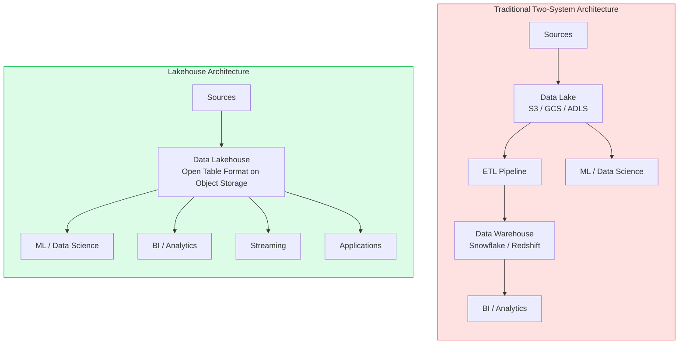
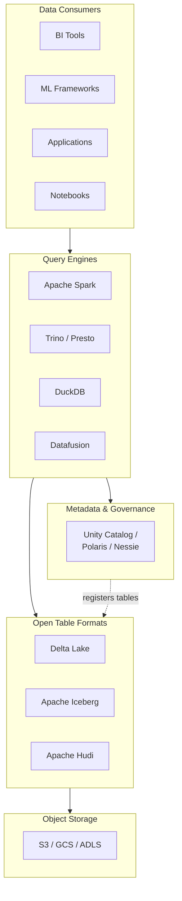
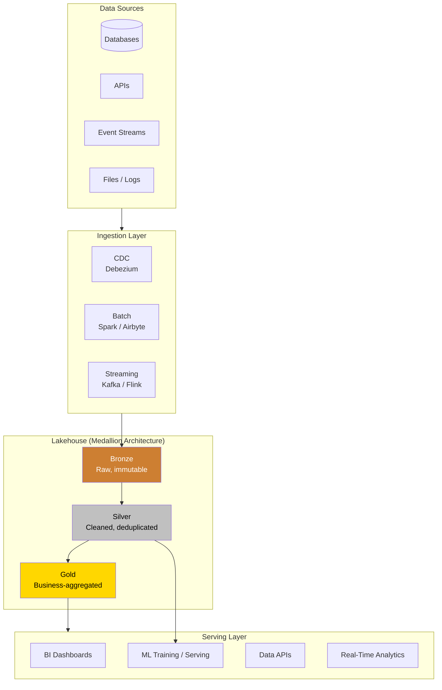

# Data Lakehouse

## The Problem That Created Lakehouses

For two decades, the data world lived with a painful split. You had two systems, each good at one thing and terrible at the other.

**Data warehouses** (Teradata, Redshift, Snowflake, BigQuery) gave you fast SQL queries, schema enforcement, ACID transactions, and governance. But they were expensive, locked to proprietary formats, and terrible at handling unstructured data (logs, images, JSON blobs, ML feature vectors).

**Data lakes** (HDFS, S3, GCS, ADLS) gave you cheap, scalable storage for any data format. But they had no transactions, no schema enforcement, no consistency guarantees, and querying them was slow and painful. Data lakes became "data swamps" — petabytes of files nobody trusted.

Most organizations ran both. They landed raw data in the lake, transformed it, then loaded it into the warehouse. This two-system architecture created a cascade of problems:

```
Source Systems → Data Lake (raw) → ETL → Data Warehouse (curated)
                     ↓                          ↓
               ML / Data Science          BI / Analytics
```

The problems with this split:

1. **Data duplication** — the same data exists in two places, doubling storage costs
2. **Staleness** — by the time data moves from lake to warehouse, it is already stale
3. **Governance nightmare** — two systems means two sets of access controls, two audit logs
4. **No single source of truth** — analysts query the warehouse, ML engineers query the lake, and they get different answers
5. **ETL tax** — every byte of data must be transformed and moved between systems, creating fragile pipelines

The data lakehouse exists to eliminate this split.

## What Is a Data Lakehouse?

A data lakehouse combines the cheap, scalable storage of a data lake with the management features of a data warehouse — ACID transactions, schema enforcement, governance, and fast SQL queries — all on a single copy of the data stored in open formats.



The key insight: you do not need a separate warehouse if you add warehouse-like capabilities directly to the lake. Open table formats (Delta Lake, Iceberg, Hudi) provide the transaction layer, metadata management, and query optimization that lakes previously lacked.

## Architecture of a Lakehouse

A lakehouse has four layers:

| Layer | Purpose | Technologies |
|-------|---------|-------------|
| **Storage** | Cheap, durable, scalable object storage | S3, GCS, ADLS, MinIO |
| **Table Format** | ACID transactions, schema enforcement, time travel | Delta Lake, Apache Iceberg, Apache Hudi |
| **Query Engine** | Fast SQL and programmatic access | Spark, Trino, DuckDB, Datafusion |
| **Catalog** | Metadata management, discovery, governance | Unity Catalog, Hive Metastore, Nessie, Polaris |



### Storage Layer

Object storage (S3, GCS, ADLS) is the foundation. It costs roughly $0.02/GB/month, scales to exabytes, and stores any file format. The lakehouse treats object storage as its disk, storing data in columnar formats like Parquet or ORC.

### Table Format Layer

This is the innovation that makes lakehouses possible. An open table format adds a metadata layer on top of Parquet files that provides:

- **ACID transactions** — concurrent reads and writes don't corrupt data
- **Schema enforcement** — writes that violate the schema are rejected
- **Time travel** — query data as it existed at any point in the past
- **Partition evolution** — change partitioning without rewriting data
- **File-level statistics** — skip irrelevant files during queries (data skipping)

::: tip The Table Format Is Just Metadata
A common misconception is that Delta Lake, Iceberg, or Hudi are new file formats. They are not. Your data is still stored as Parquet files. The table format adds a metadata layer (JSON files, Avro manifests, or a transaction log) that tracks which Parquet files belong to the table, their schema, statistics, and transaction history.
:::

See [Open Table Formats](./table-formats) for a deep comparison of Delta Lake, Iceberg, and Hudi.

### Query Engine Layer

Multiple engines can read the same lakehouse table concurrently because the table format is open. Spark processes batch ETL, Trino runs interactive SQL, DuckDB handles local analytics, and ML frameworks read directly from the same Parquet files.

See [Query Engines](./query-engines) for a comparison of Spark, Trino, DuckDB, and Datafusion.

### Catalog Layer

The catalog is the registry of all tables — their schemas, locations, access policies, and lineage. Without a catalog, the lakehouse is just a pile of files. Modern catalogs like Unity Catalog and Project Nessie add Git-like branching, fine-grained access control, and cross-engine interoperability.

## Data Lake vs Data Warehouse vs Data Lakehouse

| Dimension | Data Lake | Data Warehouse | Data Lakehouse |
|-----------|-----------|----------------|----------------|
| **Storage cost** | Low ($0.02/GB/mo) | High ($12-25/TB/mo) | Low ($0.02/GB/mo) |
| **Data types** | Structured, semi-structured, unstructured | Structured only | All types |
| **ACID transactions** | No | Yes | Yes |
| **Schema enforcement** | Schema-on-read (none) | Schema-on-write (strict) | Both supported |
| **Query performance** | Poor without optimization | Excellent | Good to excellent |
| **Time travel** | No | Limited | Yes (full history) |
| **Governance** | Weak | Strong | Strong |
| **ML support** | Native (direct file access) | Poor (data must be exported) | Native |
| **Open format** | Yes (Parquet, ORC) | No (proprietary) | Yes (open table formats) |
| **Concurrent writes** | Unsafe | Safe | Safe |
| **Real-time ingestion** | Append only, no consistency | Near real-time | Streaming + ACID |
| **Vendor lock-in** | Low | High | Low |

::: warning Data Lakes Are Not Dead
The lakehouse does not replace the raw data lake — it sits on top of it. You still land raw data into object storage. The lakehouse adds structure to that raw data through table formats. Think of it as a "managed layer" over your existing lake, not a replacement for it.
:::

## Why Lakehouses Emerged

Several technological shifts converged around 2019-2021:

1. **Object storage became the universal substrate** — every cloud provider offered cheap, durable object storage with S3-compatible APIs
2. **Parquet became the de facto columnar format** — high compression, columnar pruning, and universal reader support
3. **Open table formats matured** — Delta Lake (Databricks), Iceberg (Netflix/Apple), and Hudi (Uber) proved ACID on object storage was possible and performant
4. **Separation of compute and storage** — decoupled pricing and scaling, making multi-engine access economical
5. **ML demanded direct data access** — ML frameworks (PyTorch, TensorFlow) needed to read training data directly from storage, not through a SQL warehouse

The tipping point was the realization that the "warehouse features" people wanted (transactions, schema enforcement, time travel, governance) were properties of the metadata layer, not the storage engine. By moving those features into an open table format, any engine could provide warehouse-like guarantees on lake-priced storage.

## Open Table Formats Overview

Three open table formats dominate the lakehouse ecosystem:

| Feature | Delta Lake | Apache Iceberg | Apache Hudi |
|---------|-----------|----------------|-------------|
| **Origin** | Databricks (2019) | Netflix (2017) | Uber (2016) |
| **Transaction log** | JSON-based log in `_delta_log/` | Avro manifest files with snapshot metadata | Timeline-based in `.hoodie/` |
| **Primary ecosystem** | Databricks, Spark | Multi-engine (Spark, Trino, Flink, Dremio) | Spark, Flink |
| **Partition evolution** | Requires rewrite | In-place (hidden partitioning) | Limited |
| **Catalog** | Unity Catalog | Nessie, Polaris, Hive | Hive |
| **Adoption trend** | Strong in Databricks shops | Fastest growing overall | Strong in streaming use cases |

::: tip Which Format Should You Choose?
If you are a Databricks shop, Delta Lake is the path of least resistance. If you want maximum engine flexibility and are building a multi-engine architecture, Iceberg is the safest bet in 2026. If your primary use case is streaming upserts and CDC, Hudi has the most mature support. See [Open Table Formats](./table-formats) for the full deep-dive comparison.
:::

## Lakehouse Reference Architecture

A production lakehouse typically follows the [Medallion Architecture](./medallion-architecture) (Bronze/Silver/Gold layers), layered on top of the storage and format layers:



## When a Lakehouse Is the Right Choice

**Use a lakehouse when:**

- You have both structured and unstructured data
- Multiple teams (analytics, ML, engineering) need to access the same data
- You want to avoid vendor lock-in with open formats
- You need time travel and audit capabilities
- Cost control on storage is important
- You are building a multi-engine architecture (Spark + Trino + DuckDB)

**Use a traditional warehouse when:**

- Your data is exclusively structured and SQL is the only access pattern
- You need sub-second query latency for dashboards (managed warehouses like Snowflake/BigQuery are still faster for interactive BI)
- You have a small data team that wants managed infrastructure
- Total data volume is under 10 TB (the complexity overhead of a lakehouse may not be justified)

**Use a raw data lake when:**

- You are only storing data for archival purposes
- You do not need query capabilities (data is consumed by downstream pipelines)
- Cost is the only consideration

## Section Contents

| Page | What You Will Learn |
|------|---------------------|
| [Open Table Formats](./table-formats) | Delta Lake, Iceberg, Hudi — ACID transactions, time travel, schema evolution, performance features |
| [Medallion Architecture](./medallion-architecture) | Bronze/Silver/Gold layers, data quality gates, implementation patterns |
| [Query Engines](./query-engines) | Spark, Trino, DuckDB, Datafusion — federated query, pushdown, performance comparison |

## Further Reading

- Databricks, *"Lakehouse: A New Generation of Open Platforms that Unify Data Warehousing and Advanced Analytics"* (CIDR 2021)
- [Delta Lake documentation](https://docs.delta.io/)
- [Apache Iceberg documentation](https://iceberg.apache.org/)
- [Apache Hudi documentation](https://hudi.apache.org/)
- Related Archon pages:
  - [ETL vs ELT](/data-engineering/etl-patterns/etl-vs-elt) — extract-transform-load patterns that feed the lakehouse
  - [Stream Processing](/data-engineering/stream-processing/) — real-time ingestion into lakehouse tables
  - [Data Modeling](/data-engineering/data-modeling/) — schema design for analytical workloads
  - [CDC Patterns](/data-engineering/pipeline-patterns/cdc-patterns) — change data capture for lakehouse ingestion
