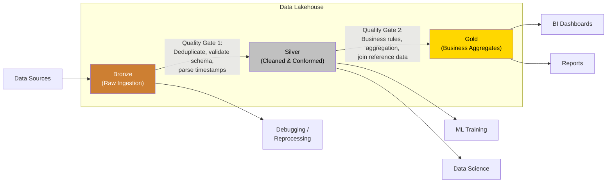
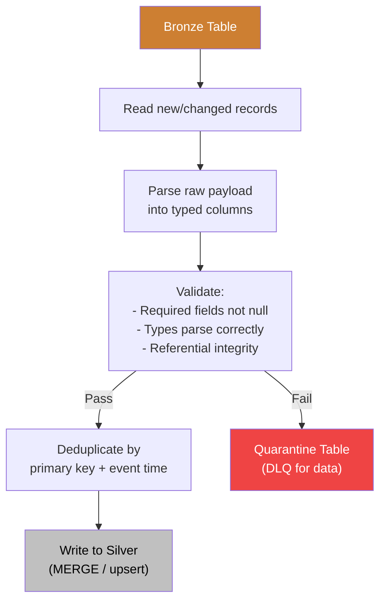
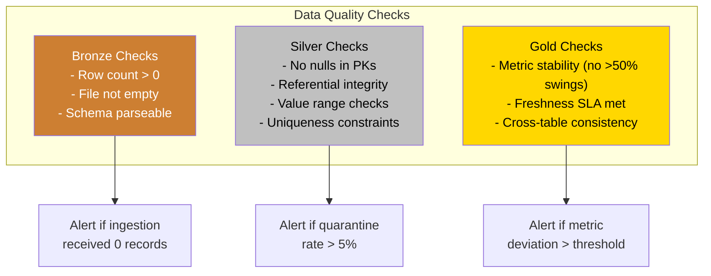

# Medallion Architecture

## What Is Medallion Architecture?

Medallion architecture organizes data in a lakehouse into three layers of increasing quality and business value: **Bronze** (raw), **Silver** (cleaned), and **Gold** (business-ready). Each layer applies progressively stricter data quality transformations, creating a clear lineage from raw source data to trustworthy analytics.

The metaphor is intentional: bronze is unrefined, silver is processed, gold is the finished product. Data flows in one direction — from Bronze to Silver to Gold — and each transition enforces data quality gates that prevent bad data from propagating downstream.



## Why Medallion Architecture Exists

Without a layered approach, data pipelines become tangled. Raw data feeds directly into dashboards. Analysts write complex queries that handle data cleaning, deduplication, and business logic all at once. When something breaks, nobody knows if the issue is in the source data, the cleaning logic, or the business rules.

Medallion architecture provides:

1. **Debuggability** — Bronze retains the raw data exactly as it arrived, so you can always go back and understand what happened
2. **Reprocessability** — if Silver or Gold logic changes, you reprocess from Bronze without re-ingesting from sources
3. **Separation of concerns** — ingestion, cleaning, and business logic are separate, independently testable pipelines
4. **Progressive quality** — each layer guarantees a higher level of data quality
5. **Multiple consumers** — ML teams read from Silver (they want clean but flexible data), BI teams read from Gold (they want pre-aggregated, fast data)

## Bronze Layer: Raw Ingestion

### Purpose

Bronze is the immutable landing zone for all source data. Data arrives in its original format and structure, with minimal transformation. The only guarantees at the Bronze level are: the data was received, it is stored durably, and ingestion metadata (timestamp, source, batch ID) is attached.

### Design Principles

| Principle | Rationale |
|-----------|-----------|
| **Append-only** | Never update or delete Bronze data — it is the system of record |
| **Schema-on-read** | Accept any schema; enforce nothing (use `STRING` or `VARIANT` for unknown structures) |
| **Add metadata** | Every record gets `_ingested_at`, `_source_system`, `_batch_id` |
| **Partition by ingestion time** | Not by business time (you don't trust it yet) |
| **Retain everything** | Even "bad" records — they are evidence for debugging |

### Implementation

```python
from pyspark.sql import functions as F
from datetime import datetime

# Bronze ingestion: CDC events from Kafka
raw_df = (
    spark.readStream
    .format("kafka")
    .option("kafka.bootstrap.servers", "broker:9092")
    .option("subscribe", "orders.cdc")
    .option("startingOffsets", "earliest")
    .load()
)

# Minimal transformation: parse Kafka envelope, add metadata
bronze_df = (
    raw_df
    .select(
        F.col("key").cast("string").alias("_kafka_key"),
        F.col("value").cast("string").alias("raw_payload"),
        F.col("topic").alias("_source_topic"),
        F.col("partition").alias("_kafka_partition"),
        F.col("offset").alias("_kafka_offset"),
        F.col("timestamp").alias("_kafka_timestamp"),
        F.lit(datetime.utcnow().isoformat()).alias("_ingested_at"),
        F.lit("orders-cdc-pipeline").alias("_pipeline_name"),
    )
)

# Write to Bronze Delta table, partitioned by ingestion date
(
    bronze_df.writeStream
    .format("delta")
    .outputMode("append")
    .option("checkpointLocation", "s3://lake/checkpoints/orders_bronze")
    .partitionBy("_ingested_at_date")
    .toTable("bronze.orders_raw")
)
```

::: tip Store the Raw Payload as a String
It is tempting to parse JSON into typed columns at the Bronze layer. Do not. Store the raw payload as a STRING or BINARY column. Schema inference at ingestion time is fragile — if the source schema changes, your Bronze ingestion breaks. Parse it in Silver where you control the schema evolution.
:::

### Bronze Anti-Patterns

| Anti-Pattern | Why It Is Wrong | What to Do Instead |
|---|---|---|
| Parsing/transforming at Bronze | Couples ingestion to source schema | Store raw payload, parse in Silver |
| Deduplicating at Bronze | You lose evidence of duplicates | Deduplicate in Silver |
| Filtering "bad" records | You lose debugging information | Keep everything, flag bad records in Silver |
| Partitioning by business date | Source timestamps may be wrong | Partition by ingestion time |
| Overwriting Bronze data | Destroys audit trail | Append only |

## Silver Layer: Cleaned and Conformed

### Purpose

Silver is where raw data becomes trustworthy. Transformations in the Silver layer focus on structural quality: parsing, deduplication, type casting, null handling, and schema conformance. After the Silver layer, every record has a consistent schema and passes basic quality checks.

### Design Principles

| Principle | Rationale |
|-----------|-----------|
| **Schema-on-write** | Enforce a typed schema — reject or quarantine records that don't conform |
| **Deduplicate** | Use record keys + event timestamps to keep only the latest version of each record |
| **Conform** | Standardize naming conventions, time zones, and data types across sources |
| **Track lineage** | Preserve `_bronze_id` or `_source_file` so every Silver record traces back to Bronze |
| **Quality gates** | Run checks after each batch; quarantine rows that fail |

### Quality Gate 1: Bronze to Silver



### Implementation

```python
from pyspark.sql import functions as F
from pyspark.sql.types import StructType, StructField, StringType, LongType, DoubleType, TimestampType
from delta.tables import DeltaTable

# Define expected Silver schema
silver_schema = StructType([
    StructField("order_id", LongType(), False),
    StructField("customer_id", LongType(), False),
    StructField("product_id", LongType(), False),
    StructField("quantity", LongType(), False),
    StructField("amount", DoubleType(), False),
    StructField("currency", StringType(), False),
    StructField("order_status", StringType(), False),
    StructField("ordered_at", TimestampType(), False),
    StructField("updated_at", TimestampType(), False),
])

# Read incremental Bronze data (only new records since last run)
bronze_incremental = (
    spark.readStream
    .format("delta")
    .option("readChangeFeed", "true")
    .option("startingVersion", last_processed_version)
    .table("bronze.orders_raw")
)

# Parse raw payload
parsed_df = (
    bronze_incremental
    .select(
        F.from_json(F.col("raw_payload"), silver_schema).alias("data"),
        F.col("_kafka_offset").alias("_bronze_offset"),
        F.col("_ingested_at").alias("_bronze_ingested_at"),
    )
    .select("data.*", "_bronze_offset", "_bronze_ingested_at")
)

# Validation: flag bad records
validated_df = parsed_df.withColumn(
    "_is_valid",
    (F.col("order_id").isNotNull()) &
    (F.col("amount") > 0) &
    (F.col("currency").isin("USD", "EUR", "GBP"))
)

# Route: valid records to Silver, invalid to quarantine
valid_df = validated_df.filter(F.col("_is_valid"))
quarantine_df = validated_df.filter(~F.col("_is_valid"))

# Upsert into Silver (merge on primary key)
def upsert_to_silver(batch_df, batch_id):
    silver_table = DeltaTable.forName(spark, "silver.orders")
    (
        silver_table.alias("target")
        .merge(
            batch_df.alias("source"),
            "target.order_id = source.order_id"
        )
        .whenMatchedUpdate(
            condition="source.updated_at > target.updated_at",
            set={"*": "source.*"}
        )
        .whenNotMatchedInsertAll()
        .execute()
    )

valid_df.writeStream \
    .foreachBatch(upsert_to_silver) \
    .option("checkpointLocation", "s3://lake/checkpoints/orders_silver") \
    .start()
```

### Quarantine Table

Records that fail validation are not discarded. They are written to a quarantine table with the failure reason, enabling data engineers to investigate and fix upstream issues.

```python
quarantine_with_reason = quarantine_df.withColumn(
    "_failure_reason",
    F.when(F.col("order_id").isNull(), "missing_order_id")
     .when(F.col("amount") <= 0, "invalid_amount")
     .when(~F.col("currency").isin("USD", "EUR", "GBP"), "unsupported_currency")
     .otherwise("unknown")
)

quarantine_with_reason.writeStream \
    .format("delta") \
    .outputMode("append") \
    .option("checkpointLocation", "s3://lake/checkpoints/orders_quarantine") \
    .toTable("quarantine.orders")
```

::: warning The Quarantine Table Is Not Optional
In production, 1-5% of records fail validation on any given day. Without a quarantine table, these records silently disappear. You only discover the issue weeks later when a finance report does not reconcile. Always implement quarantine.
:::

## Gold Layer: Business-Ready

### Purpose

Gold tables are curated, business-logic-enriched datasets optimized for specific consumption patterns. They are pre-aggregated, pre-joined, and denormalized for fast queries. A Gold table answers a specific business question directly — no further joins or transformations needed.

### Design Principles

| Principle | Rationale |
|-----------|-----------|
| **Business-aligned** | Each Gold table serves a specific business domain or dashboard |
| **Pre-aggregated** | Metrics are pre-computed (daily revenue, monthly active users) |
| **Denormalized** | Join dimension tables into facts — consumers should not need multi-table joins |
| **SLA-governed** | Gold tables have freshness SLAs (e.g., "updated within 1 hour of source change") |
| **Access-controlled** | Fine-grained permissions — not everyone sees all Gold tables |

### Quality Gate 2: Silver to Gold

```python
# Gold table: daily order summary by product category
from pyspark.sql import functions as F

# Read from Silver
orders = spark.table("silver.orders")
products = spark.table("silver.products")
customers = spark.table("silver.customers")

# Business logic: join, aggregate, enrich
daily_order_summary = (
    orders
    .join(products, "product_id")
    .join(customers, "customer_id")
    .groupBy(
        F.date_trunc("day", "ordered_at").alias("order_date"),
        products.category.alias("product_category"),
        customers.region.alias("customer_region"),
    )
    .agg(
        F.count("order_id").alias("total_orders"),
        F.sum("amount").alias("total_revenue"),
        F.avg("amount").alias("avg_order_value"),
        F.countDistinct("customer_id").alias("unique_customers"),
    )
    .withColumn("_computed_at", F.current_timestamp())
)

# Overwrite partition (idempotent)
(
    daily_order_summary.write
    .format("delta")
    .mode("overwrite")
    .option("replaceWhere", f"order_date = '{target_date}'")
    .saveAsTable("gold.daily_order_summary")
)
```

### Gold Table Patterns

| Pattern | Description | Example |
|---------|-------------|---------|
| **Aggregated metrics** | Pre-computed measures at a fixed granularity | Daily revenue by region |
| **Wide denormalized** | Fact + all dimensions joined into a single table | Order with customer, product, and shipping details |
| **Feature store** | ML features pre-computed and versioned | User purchase frequency, avg session duration |
| **Snapshot** | Point-in-time state of an entity | Customer profile as of end of day |
| **SCD (Slowly Changing Dimension)** | Historical tracking of dimension changes | Customer address history with valid_from/valid_to |

## Data Quality Framework

### Automated Checks at Each Layer



### Great Expectations Integration

```python
import great_expectations as gx

context = gx.get_context()

# Define expectation suite for Silver orders
suite = context.add_expectation_suite("silver_orders_quality")

suite.add_expectation(
    gx.expectations.ExpectColumnValuesToNotBeNull(column="order_id")
)
suite.add_expectation(
    gx.expectations.ExpectColumnValuesToBeUnique(column="order_id")
)
suite.add_expectation(
    gx.expectations.ExpectColumnValuesToBeBetween(
        column="amount", min_value=0.01, max_value=1000000
    )
)
suite.add_expectation(
    gx.expectations.ExpectColumnValuesToBeInSet(
        column="currency", value_set=["USD", "EUR", "GBP"]
    )
)

# Run validation
results = context.run_validation(
    batch=silver_batch,
    expectation_suite=suite
)

if not results.success:
    # Alert and halt pipeline
    raise DataQualityError(f"Silver validation failed: {results.statistics}")
```

## Naming Conventions

Consistent naming is critical when you have hundreds of tables. A common convention:

```
{layer}.{domain}_{entity}_{qualifier}

Examples:
  bronze.orders_raw
  bronze.payments_raw
  silver.orders                 (cleaned, deduplicated)
  silver.customers              (conformed from multiple sources)
  gold.daily_order_summary      (aggregated metric)
  gold.customer_360             (wide denormalized)
  quarantine.orders             (failed validation)
```

## Medallion Architecture Anti-Patterns

| Anti-Pattern | Problem | Solution |
|---|---|---|
| **Skipping Silver** | Business logic applied directly to raw data; fragile and unreproducible | Always materialize Silver |
| **Silver = Gold** | Silver tables contain business logic; changes to business rules require reprocessing from Bronze | Keep Silver focused on structural quality only |
| **No quarantine** | Bad records disappear silently | Always route invalid records to a quarantine table |
| **Mutable Bronze** | Updates/deletes in Bronze destroy audit trail | Bronze is append-only, always |
| **Gold without SLAs** | Nobody knows when data was last refreshed | Define freshness SLAs for every Gold table |
| **Too many Gold tables** | Hundreds of one-off Gold tables that nobody maintains | Consolidate around business domains; retire unused tables |

## When Medallion Architecture Is Overkill

Medallion architecture adds complexity. For small teams with simple data flows, it may be unnecessary:

- **< 5 data sources, < 1 TB total** — a single curated layer (Silver-equivalent) may suffice
- **Single consumer pattern** — if only one team reads the data, the separation overhead may not pay off
- **Pure streaming** — if your pipeline is a single Flink job from Kafka to a serving layer, adding Bronze/Silver/Gold intermediates adds latency and storage cost

The architecture is most valuable when you have multiple sources, multiple consumer types (BI, ML, application APIs), and a team large enough to maintain the layer boundaries.

## Further Reading

- Databricks, *"Medallion Architecture"* — the original Databricks documentation that popularized the pattern
- [dbt documentation on multi-layer modeling](https://docs.getdbt.com/)
- Related Archon pages:
  - [Data Lakehouse Overview](./index) — the architecture that medallion layers organize
  - [Open Table Formats](./table-formats) — Delta Lake, Iceberg, Hudi that power each layer
  - [ETL vs ELT](/data-engineering/etl-patterns/etl-vs-elt) — extraction patterns that feed Bronze
  - [Data Quality Checks](/data-engineering/pipeline-patterns/data-quality-checks) — automated quality gates
  - [CDC Patterns](/data-engineering/pipeline-patterns/cdc-patterns) — change data capture for continuous Bronze ingestion
  - [Dimensional Modeling](/data-engineering/data-modeling/dimensional-modeling) — star schema design for Gold tables

---

::: tip Key Takeaway
- Medallion architecture organizes lakehouse data into Bronze (raw, as-is), Silver (cleaned, validated), and Gold (business-ready aggregations) with quality gates between each layer.
- Bronze is append-only and schema-on-read; Silver enforces schema, deduplicates, and validates; Gold applies business logic and dimensional modeling.
- Each layer serves different consumers: Bronze for data engineers debugging, Silver for data scientists exploring, Gold for business analysts and dashboards.
:::

::: details Exercise
**Implement Medallion Architecture for IoT Sensor Data**

A manufacturing company collects data from 10,000 sensors across 5 factories, generating 50M events/day. Each event has: `sensor_id`, `factory_id`, `reading_type`, `value`, `timestamp`, `metadata` (JSON blob).

Design the Bronze, Silver, and Gold layers:
1. What does each layer's schema look like?
2. What quality gates exist between layers?
3. What is the retention policy for each layer?
4. How do you handle late-arriving sensor data?

::: details Solution
**Bronze Layer:**
- Schema: raw JSON as-is + `_ingested_at`, `_source_file`, `_batch_id`
- Storage: append-only, partitioned by `_ingested_date`
- Retention: 90 days (regulatory requirement for raw data)
- No validation -- store everything, even malformed events

**Silver Layer:**
- Schema: `sensor_id (STRING)`, `factory_id (STRING)`, `reading_type (STRING)`, `value (DECIMAL)`, `event_timestamp (TIMESTAMP)`, `metadata (MAP<STRING,STRING>)`, `_processed_at`
- Quality gates: NOT NULL on sensor_id/factory_id/value, value within physical limits (e.g., temperature -50 to 500), valid timestamp (not in future, not older than 7 days)
- Deduplication: deduplicate on (sensor_id, event_timestamp)
- Partitioned by: event_date, factory_id
- Retention: 2 years

**Gold Layer:**
- `gold_sensor_hourly_stats`: hourly aggregates per sensor (min, max, avg, stddev, count)
- `gold_factory_daily_health`: daily factory-level metrics (uptime, anomaly_count, avg_readings)
- `gold_anomaly_events`: detected anomalies (value > 3 sigma from rolling average)
- Partitioned by: event_date
- Retention: 5 years

**Late data:** Silver uses MERGE with event_timestamp as part of the key. Late data within 7 days is merged normally. Data older than 7 days routes to a "late_data" quarantine table for manual review.
:::

::: warning Common Misconceptions
- **"Bronze should validate and clean data."** Bronze is intentionally raw. If you reject data at Bronze, you lose it forever. Store everything; validate at the Silver gate.
- **"Every dataset needs all three layers."** Simple, single-source datasets may only need Bronze and Gold. The Silver layer adds value when you have multiple sources, complex cleaning logic, or data science consumers who need clean-but-unaggregated data.
- **"Gold tables replace Silver tables."** Gold tables serve specific business use cases (dashboards, reports). Data scientists and ML engineers often need Silver-level data (cleaned but not aggregated) for feature engineering and exploratory analysis.
- **"Medallion architecture requires Databricks."** The pattern works with any lakehouse stack: Spark + Iceberg, dbt + Snowflake, or even Python + DuckDB + Parquet. It is a design pattern, not a product.
- **"More layers means better data quality."** Some teams add "Platinum" or "Diamond" layers. Extra layers add complexity without proportional benefit. Three layers (raw, clean, business) are sufficient for most use cases.
:::

::: tip In Production
- **Uber** implements a medallion architecture for their trip data: raw events in Bronze, cleaned/enriched trip records in Silver, and aggregated city-level metrics in Gold for ops dashboards.
- **Netflix** uses three-tier data processing: raw event ingestion (Bronze), cleaned/sessionized viewing data (Silver), and content performance metrics (Gold) for their recommendation team.
- **Airbnb** applies medallion architecture with dbt: staging models (Silver) clean and deduplicate source data, mart models (Gold) build business metrics, with automated quality checks at each layer transition.
- **Spotify** uses the medallion pattern for their listening data pipeline: raw Kafka events (Bronze), validated/enriched play events (Silver), and per-user/per-artist aggregations (Gold) for analytics and ML.
:::

::: details Quiz
**1. What is the primary purpose of the Bronze layer?**

A) To serve clean data to analysts
B) To store raw, unmodified source data as a permanent record of truth, ensuring no data is lost
C) To aggregate business metrics
D) To enforce schema validation

::: details Answer
**B)** Bronze is the "landing zone" that stores data exactly as received from sources. No cleaning, no validation, no transformation. This preserves the raw data for debugging, reprocessing, and compliance.
:::

**2. What quality gates should exist at the Bronze-to-Silver boundary?**

A) No gates -- data flows freely between layers
B) Schema validation, null checks on required fields, deduplication, and data type enforcement
C) Only row count checks
D) Business rule validation

::: details Answer
**B)** The Bronze-to-Silver gate enforces technical data quality: correct schema, required fields present, valid data types, no duplicates. Business rules (e.g., "order amount must be positive") belong at the Silver-to-Gold gate.
:::

**3. Who are the primary consumers of each layer?**

A) All consumers use Gold exclusively
B) Data engineers use Bronze (debugging), data scientists use Silver (exploration/ML), business analysts use Gold (dashboards/reports)
C) Everyone uses Silver
D) Only executives use Gold

::: details Answer
**B)** Each layer serves different needs: Bronze for raw data investigation, Silver for clean-but-granular data exploration and ML features, Gold for pre-aggregated business metrics and dashboards.
:::

**4. Why is the Bronze layer typically append-only?**

A) Because databases require append-only tables
B) To preserve a complete, immutable record of all data received, enabling reprocessing and auditing
C) Because it is faster
D) Because Bronze data is never queried

::: details Answer
**B)** Append-only Bronze ensures that no data is ever lost or modified. If a Silver transformation has a bug, you can reprocess from Bronze. If an audit requires the original data, Bronze has it unchanged.
:::

**5. When is medallion architecture overkill?**

A) When you have multiple data sources
B) When you have fewer than 5 sources, under 1 TB total, a single consumer team, and no audit requirements
C) When using cloud storage
D) When processing streaming data

::: details Answer
**B)** For small, simple setups with one source and one consumer, the overhead of maintaining three layers does not pay off. A single curated layer (Silver-equivalent) may be sufficient.
:::
:::

---

> **One-Liner Summary:** Medallion architecture is Bronze (store everything raw), Silver (clean and validate), Gold (aggregate for business) -- three layers with quality gates that transform raw data into trusted analytics.
