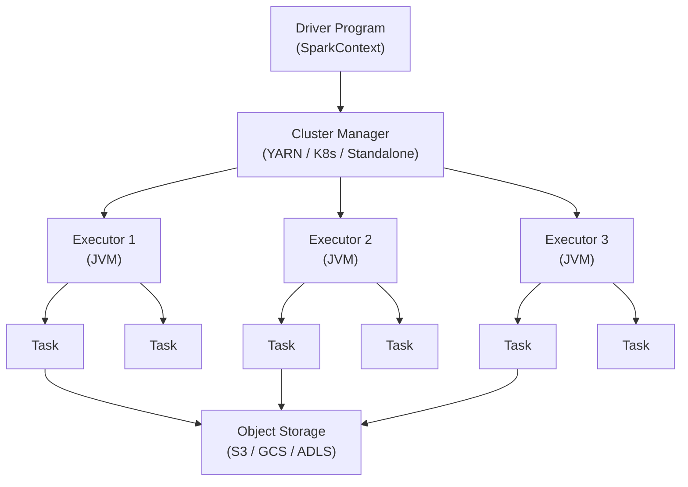
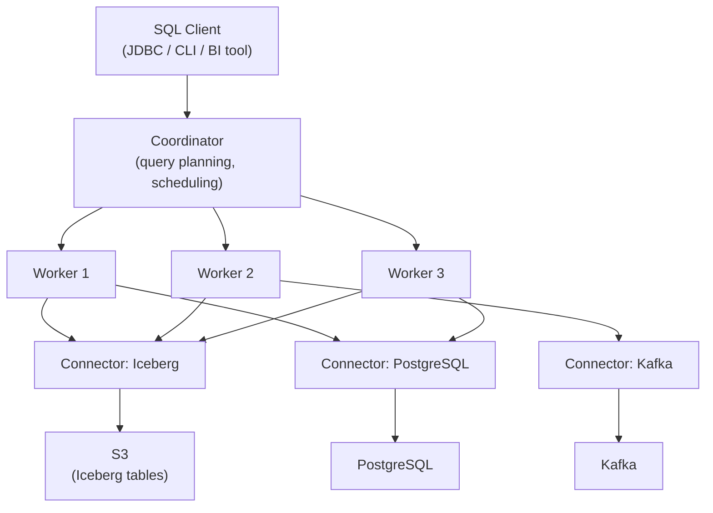
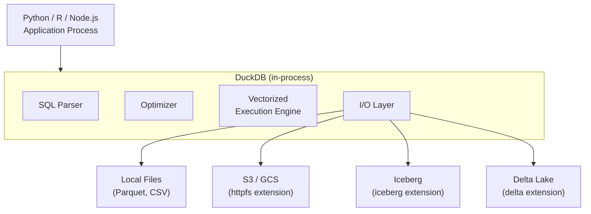
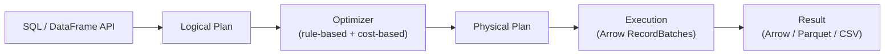
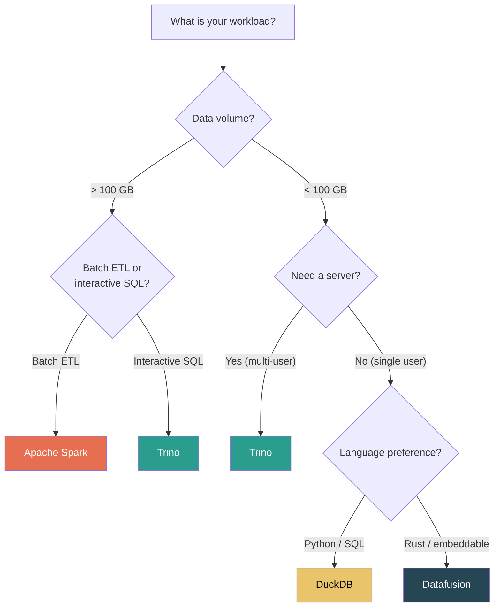

# Query Engines

## Why Multiple Engines Exist

A data lakehouse stores data in open formats (Parquet + Delta Lake/Iceberg/Hudi) on object storage. Because the format is open, any engine that can read Parquet and understand the table format's metadata can query the data. This is fundamentally different from a traditional data warehouse where the storage engine and query engine are fused together.

This decoupling is a feature, not a bug. Different workloads have radically different requirements:

| Workload | Requirement | Best Engine |
|----------|-------------|-------------|
| ETL/ELT batch transformations | Process terabytes, complex joins, UDFs | Apache Spark |
| Interactive SQL analytics | Sub-second query on large tables, JDBC/ODBC | Trino / Presto |
| Local exploration / notebooks | Zero setup, single-machine, fast on GBs | DuckDB |
| Embedded analytics / WASM | Lightweight, embeddable, Rust-based | Datafusion |
| Streaming transformations | Continuous processing, exactly-once | Flink (with Iceberg/Hudi) |

No single engine is best at everything. The lakehouse architecture lets you pick the right engine for each workload while sharing the same underlying data.

## Apache Spark

### Overview

Spark is the workhorse of the lakehouse. Created at UC Berkeley in 2009 and open-sourced through Apache, Spark provides distributed batch and streaming data processing with a rich API for SQL, DataFrames, ML, and graph processing.

### Architecture



Spark distributes work across a cluster of executors, each running in a JVM. The driver program coordinates execution by creating a DAG (directed acyclic graph) of stages and tasks.

### Strengths

- **Mature ecosystem** — the largest open-source data processing project, with thousands of connectors
- **Native support for all table formats** — Delta Lake (first-class), Iceberg, Hudi
- **Unified batch + streaming** — Structured Streaming provides exactly-once guarantees
- **Rich API** — SQL, DataFrame (Python/Scala/Java/R), MLlib, GraphX
- **Adaptive Query Execution (AQE)** — runtime optimization: coalescing partitions, switching join strategies, handling skew

### When Spark Falls Short

- **Startup overhead** — even a simple query takes 10-30 seconds to initialize the JVM, connect to the cluster manager, and launch executors
- **Not interactive** — latency is too high for dashboard-style SQL queries
- **Resource hungry** — requires a cluster even for small datasets
- **JVM memory management** — garbage collection pauses can cause unpredictable latency spikes

### Example: Spark with Iceberg

```python
from pyspark.sql import SparkSession

spark = (
    SparkSession.builder
    .appName("lakehouse-etl")
    .config("spark.sql.catalog.lakehouse", "org.apache.iceberg.spark.SparkCatalog")
    .config("spark.sql.catalog.lakehouse.type", "hadoop")
    .config("spark.sql.catalog.lakehouse.warehouse", "s3://bucket/warehouse")
    .getOrCreate()
)

# Read from Iceberg table
orders = spark.table("lakehouse.db.orders")

# Complex transformation
daily_revenue = (
    orders
    .filter("order_status = 'completed'")
    .groupBy("order_date", "region")
    .agg(
        {"amount": "sum", "order_id": "count"}
    )
    .withColumnRenamed("sum(amount)", "total_revenue")
    .withColumnRenamed("count(order_id)", "order_count")
)

# Write back to Iceberg (atomic, ACID)
daily_revenue.writeTo("lakehouse.db.daily_revenue").overwritePartitions()
```

## Trino (formerly PrestoSQL)

### Overview

Trino is a distributed SQL query engine designed for interactive analytics. Created at Facebook as Presto, it split into two projects: Trino (the community-driven fork led by the original creators) and PrestoDB (the Meta-maintained fork). Trino is the dominant choice for lakehouse SQL.

### Architecture



The key architectural difference from Spark: Trino is designed for **low-latency, high-concurrency** queries. It processes data in a streaming pipeline (operator-to-operator), not in batch stages. Data flows through the query plan as it is read, with no intermediate materialization to disk (unless memory pressure forces a spill).

### Strengths

- **Interactive latency** — queries return in seconds, not minutes
- **Federated query** — a single SQL query can join data from Iceberg, PostgreSQL, Kafka, Elasticsearch, and more
- **No JVM startup** — always-on cluster, ready to serve queries immediately
- **ANSI SQL compliance** — richer SQL dialect than Spark SQL
- **High concurrency** — handles dozens of concurrent queries efficiently

### Federated Query Example

```sql
-- Single query joining lakehouse data with operational database
SELECT
    o.order_id,
    o.amount,
    c.name AS customer_name,
    c.email,
    p.name AS product_name,
    p.category
FROM iceberg.warehouse.orders o
JOIN postgresql.production.customers c ON o.customer_id = c.id
JOIN iceberg.warehouse.products p ON o.product_id = p.id
WHERE o.order_date >= DATE '2025-06-01'
  AND c.region = 'US'
ORDER BY o.amount DESC
LIMIT 100;
```

::: tip Federated Query Is Powerful but Dangerous
Joining a lakehouse table with a production PostgreSQL database is technically easy with Trino. But if the query scans millions of lakehouse rows and for each one makes a lookup against PostgreSQL, you will crush your production database. Always ensure the operational database side of the join is small and indexed, or materialize the operational data into the lakehouse first.
:::

### When Trino Falls Short

- **No native write support for table formats** — Trino can write to Iceberg/Delta, but it is not designed for heavy ETL workloads
- **No streaming** — Trino is a batch query engine (queries run and return results). For continuous processing, use Spark or Flink
- **Memory-intensive** — large aggregations or joins can exceed available memory and fail
- **No UDFs in Python** — custom functions must be written in Java

## DuckDB

### Overview

DuckDB is an in-process analytical database — think "SQLite for analytics." It runs inside your Python process (or any other language binding) with zero external dependencies, no server, and no configuration. Despite being single-machine, it achieves remarkable performance through vectorized execution, columnar storage, and aggressive optimization.

### Architecture



DuckDB's execution engine processes data in vectors (batches of 2048 values), exploiting CPU cache lines and SIMD instructions. This makes it orders of magnitude faster than row-at-a-time processing.

### Strengths

- **Zero infrastructure** — `pip install duckdb` and you have a full analytical database
- **Blazing fast on single machine** — processes GBs in seconds by exploiting modern CPU features
- **Reads everything** — Parquet, CSV, JSON, Arrow, Iceberg, Delta Lake (via extensions)
- **SQL-first** — full SQL dialect with window functions, CTEs, lateral joins
- **Embeddable** — runs inside Python, R, Node.js, Rust, Go, WASM

### Example: DuckDB with Lakehouse

```python
import duckdb

# Connect (in-memory by default)
conn = duckdb.connect()

# Install and load extensions
conn.execute("INSTALL httpfs; LOAD httpfs;")
conn.execute("INSTALL iceberg; LOAD iceberg;")
conn.execute("SET s3_region = 'us-east-1';")

# Query Iceberg table directly from S3
result = conn.execute("""
    SELECT
        order_date,
        product_category,
        SUM(amount) AS total_revenue,
        COUNT(*) AS order_count
    FROM iceberg_scan('s3://bucket/warehouse/orders')
    WHERE order_date >= '2025-06-01'
    GROUP BY order_date, product_category
    ORDER BY total_revenue DESC
    LIMIT 20
""").fetchdf()  # Returns a Pandas DataFrame

print(result)
```

```python
# DuckDB + Pandas: analyze lakehouse data locally
import duckdb
import pandas as pd

# Read a sample from the lakehouse into Pandas
sample = duckdb.sql("""
    SELECT * FROM read_parquet('s3://bucket/warehouse/orders/*.parquet')
    USING SAMPLE 1%
""").df()

# Now use DuckDB to query the Pandas DataFrame (zero copy)
duckdb.sql("""
    SELECT
        product_category,
        AVG(amount) AS avg_amount,
        PERCENTILE_CONT(0.95) WITHIN GROUP (ORDER BY amount) AS p95_amount
    FROM sample
    GROUP BY product_category
""").show()
```

### When DuckDB Falls Short

- **Single machine** — cannot scale beyond the memory and CPU of one machine
- **Not a server** — no concurrent multi-user access (use MotherDuck for hosted)
- **No streaming** — processes finite datasets, not continuous streams
- **Write support** — limited write support for Iceberg/Delta (read-heavy by design)

::: warning DuckDB Is Not a Replacement for Spark
DuckDB is phenomenal for datasets that fit on a single machine (up to ~100 GB compressed Parquet with 64 GB RAM). Beyond that, you need Spark or Trino. The sweet spot for DuckDB is local development, notebooks, CI/CD data tests, and small-to-medium analytics.
:::

## Apache Arrow Datafusion

### Overview

Datafusion is a query engine written in Rust, built on Apache Arrow. It is embeddable, extensible, and serves as the query engine inside several other projects (InfluxDB IOx, Ballista, Delta Lake Rust). Think of it as "DuckDB's Rust-native competitor" with a focus on extensibility.

### Architecture



Datafusion operates on Apache Arrow RecordBatches — a columnar, zero-copy in-memory format. This means data passed between Datafusion and other Arrow-based tools (Pandas via PyArrow, Polars, DuckDB) involves no serialization overhead.

### Strengths

- **Rust-native** — memory-safe, no GC pauses, excellent performance
- **Embeddable** — use as a library, not a server
- **Arrow-native** — zero-copy interop with the Arrow ecosystem
- **Extensible** — custom table providers, functions, and optimizers
- **WASM-compatible** — can run in the browser

### Example: Datafusion in Rust

::: code-group

```rust
use datafusion::prelude::*;

#[tokio::main]
async fn main() -> datafusion::error::Result<()> {
    let ctx = SessionContext::new();

    // Register a Parquet file from S3
    ctx.register_parquet(
        "orders",
        "s3://bucket/warehouse/orders/",
        ParquetReadOptions::default(),
    ).await?;

    // Query with SQL
    let df = ctx.sql(
        "SELECT order_date, SUM(amount) as revenue
         FROM orders
         WHERE order_date >= '2025-06-01'
         GROUP BY order_date
         ORDER BY revenue DESC
         LIMIT 10"
    ).await?;

    df.show().await?;
    Ok(())
}
```

```python
# Python binding (datafusion-python)
import datafusion
from datafusion import SessionContext

ctx = SessionContext()
ctx.register_parquet("orders", "s3://bucket/warehouse/orders/")

df = ctx.sql("""
    SELECT order_date, SUM(amount) as revenue
    FROM orders
    WHERE order_date >= '2025-06-01'
    GROUP BY order_date
    ORDER BY revenue DESC
    LIMIT 10
""")

print(df.to_pandas())
```

:::

### When Datafusion Falls Short

- **Younger ecosystem** — fewer connectors and integrations than Spark or Trino
- **Single machine** — Ballista provides distributed execution but is less mature
- **Smaller community** — less documentation, fewer Stack Overflow answers

## Performance Comparison

### Benchmarks (TPC-H SF100, 100GB Parquet on local NVMe)

| Engine | Query 1 (Scan + Agg) | Query 9 (Complex Join) | Query 21 (Subquery) | Cold Start |
|--------|----------------------|------------------------|---------------------|------------|
| **Spark (local)** | 12.4s | 28.7s | 34.1s | 15-30s |
| **Trino (3 workers)** | 3.2s | 8.9s | 11.5s | ~0s (always on) |
| **DuckDB** | 1.8s | 5.1s | 6.3s | ~0s (in-process) |
| **Datafusion** | 2.1s | 6.4s | 7.8s | ~0s (in-process) |

::: tip Benchmarks Are Misleading
These numbers are for single-machine performance on a fixed dataset. Spark's advantage is horizontal scaling — on 100 nodes, it will finish a 10 TB query in the time DuckDB takes to run out of memory. Always benchmark with your data, your queries, and your infrastructure.
:::

### Query Pushdown

Query pushdown means pushing filters, projections, and aggregations down to the storage layer so less data is read from object storage.

| Pushdown Type | Spark | Trino | DuckDB | Datafusion |
|---------------|-------|-------|--------|------------|
| **Partition pruning** | Yes | Yes | Yes | Yes |
| **Column pruning** | Yes | Yes | Yes | Yes |
| **Predicate pushdown (file-level)** | Yes | Yes | Yes | Yes |
| **Predicate pushdown (row-group)** | Yes | Yes | Yes | Yes |
| **Aggregate pushdown** | Limited | Yes | Yes | Yes |
| **Limit pushdown** | Yes | Yes | Yes | Yes |
| **Iceberg manifest pruning** | Yes | Yes | Extension | Extension |

### Memory Model

| Engine | Memory Model | Spill to Disk | OOM Behavior |
|--------|-------------|---------------|--------------|
| **Spark** | JVM heap + off-heap (Tungsten) | Yes (sort, shuffle) | Task fails, retried |
| **Trino** | JVM heap, memory tracking per query | Limited (revocable memory) | Query killed |
| **DuckDB** | Native (OS memory allocator) | Yes (buffer manager) | Graceful degradation |
| **Datafusion** | Rust allocator (jemalloc) | Partial (via spill extension) | Process crash |

## Choosing the Right Engine



### The Multi-Engine Lakehouse

In practice, most lakehouse deployments use multiple engines:

| Layer | Engine | Why |
|-------|--------|-----|
| **Ingestion (Bronze)** | Spark Structured Streaming | Handles massive throughput, exactly-once semantics |
| **Transformation (Silver/Gold)** | Spark (batch) | Complex joins, UDFs, ML feature engineering |
| **Interactive analytics** | Trino | Low-latency SQL for BI tools |
| **Ad-hoc exploration** | DuckDB | Data scientists exploring in notebooks |
| **CI/CD data tests** | DuckDB | Fast, zero-infrastructure validation in pipelines |
| **Embedded analytics** | Datafusion | Custom analytics inside applications |

::: tip Start with DuckDB, Scale with Spark
For new projects, start by developing and testing your transformations locally with DuckDB. When data volume exceeds what a single machine can handle, port the SQL to Spark. The SQL is nearly identical — the migration cost is low.
:::

## Further Reading

- Apache Spark documentation: [spark.apache.org](https://spark.apache.org/)
- Trino documentation: [trino.io](https://trino.io/)
- DuckDB documentation: [duckdb.org](https://duckdb.org/)
- Apache Arrow Datafusion: [arrow.apache.org/datafusion](https://arrow.apache.org/datafusion/)
- *"Lakehouse: A New Generation of Open Platforms"* (CIDR 2021)
- Related Archon pages:
  - [Data Lakehouse Overview](./index) — the architecture these engines serve
  - [Open Table Formats](./table-formats) — Delta Lake, Iceberg, Hudi that engines read
  - [Medallion Architecture](./medallion-architecture) — Bronze/Silver/Gold layers that engines power
  - [Stream Processing](/data-engineering/stream-processing/) — Flink and Spark Streaming for continuous processing
  - [Elasticsearch Internals](/system-design/databases/elasticsearch-internals) — a different kind of query engine for search
