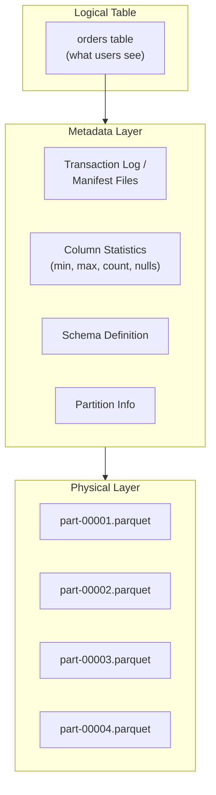
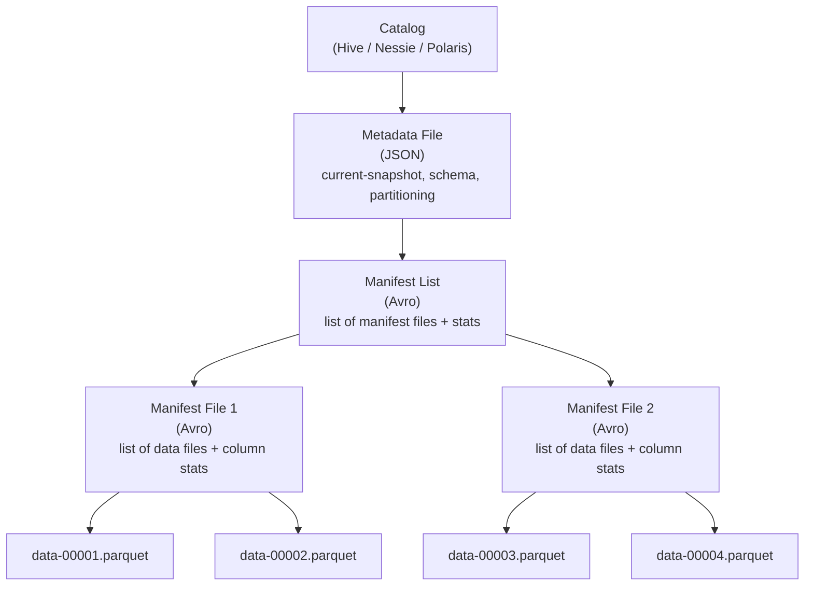
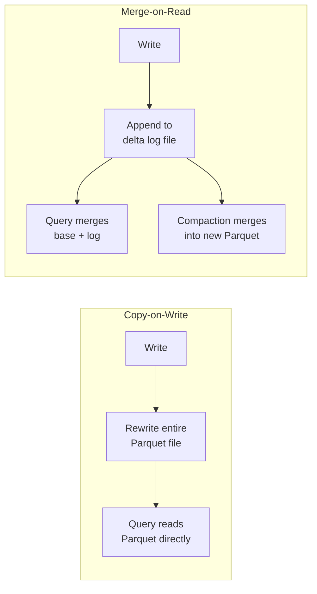
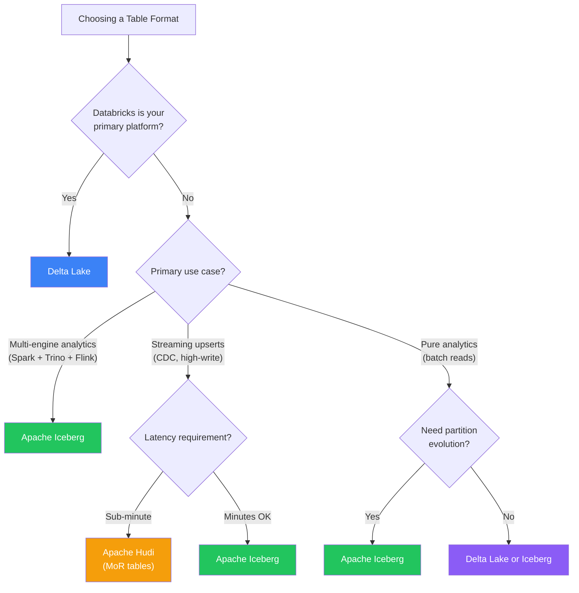

# Open Table Formats

## The Problem: Files Are Not Tables

Object storage (S3, GCS, ADLS) stores files. Files are not tables. A directory of Parquet files has no concept of transactions, schema enforcement, consistent snapshots, or safe concurrent writes. If two Spark jobs write to the same directory simultaneously, you get corrupted data. If a write fails halfway, you get partial data. If you want to query "what did this table look like yesterday," you cannot.

Open table formats solve this by adding a metadata layer on top of Parquet files that turns a directory of files into a proper table with database-like guarantees. The three dominant formats — Delta Lake, Apache Iceberg, and Apache Hudi — take different approaches to the same core problem.

## How Table Formats Work: First Principles

Every table format follows the same fundamental pattern:



1. **Data files** — Parquet (or ORC) files containing the actual data, stored in object storage
2. **Metadata files** — track which data files belong to the current table version, their schemas, column statistics, and partition information
3. **Transaction protocol** — defines how writes are committed atomically by adding new metadata entries

The critical insight: reads never touch the data files until the metadata layer tells them exactly which files to read and which row groups to scan. This enables data skipping, time travel, and snapshot isolation.

## Delta Lake

### Architecture

Delta Lake, created by Databricks, uses a JSON-based transaction log stored in a `_delta_log/` directory alongside the Parquet data files.

```
my_table/
  _delta_log/
    00000000000000000000.json    # Version 0 (table creation)
    00000000000000000001.json    # Version 1 (insert)
    00000000000000000002.json    # Version 2 (update)
    00000000000000000010.checkpoint.parquet  # Checkpoint every 10 versions
  year=2025/
    month=01/
      part-00001.parquet
      part-00002.parquet
    month=02/
      part-00003.parquet
```

Each JSON log entry contains **actions**:

```json
// 00000000000000000001.json
{
  "add": {
    "path": "year=2025/month=01/part-00001.parquet",
    "size": 1048576,
    "partitionValues": {"year": "2025", "month": "01"},
    "modificationTime": 1711929600000,
    "dataChange": true,
    "stats": "{\"numRecords\":50000,\"minValues\":{\"id\":1,\"amount\":0.01},\"maxValues\":{\"id\":50000,\"amount\":9999.99}}"
  }
}
```

### ACID Transactions in Delta Lake

Delta Lake achieves atomicity through **optimistic concurrency control**:

1. A writer reads the current log version (e.g., version 5)
2. The writer computes the changes (new files to add, old files to remove)
3. The writer attempts to write `00000000000000000006.json` atomically
4. If another writer already created version 6, the current writer retries — it re-reads the log, checks for conflicts, and attempts version 7

Conflict detection depends on the operation: two appends to different partitions never conflict, but two updates to the same partition might.

::: warning Checkpoint Files
Reading all JSON log files from version 0 on every query would be slow. Delta Lake creates **checkpoint files** (Parquet format) every 10 commits by default. A checkpoint contains the cumulative state of the table at that version, so readers only need to read the checkpoint plus any subsequent JSON files.
:::

### Time Travel

```sql
-- Query the table as it was at version 5
SELECT * FROM my_table VERSION AS OF 5;

-- Query the table as it was at a specific timestamp
SELECT * FROM my_table TIMESTAMP AS OF '2025-06-15 10:00:00';
```

```python
# PySpark
df = spark.read.format("delta").option("versionAsOf", 5).load("s3://bucket/my_table")

# Or by timestamp
df = spark.read.format("delta").option("timestampAsOf", "2025-06-15").load("s3://bucket/my_table")
```

### Z-Ordering

Delta Lake supports Z-ordering, which co-locates related data in the same files based on multiple columns. This dramatically improves data skipping when queries filter on those columns.

```sql
OPTIMIZE my_table ZORDER BY (country, product_category);
```

Without Z-ordering, a query filtering on `country = 'US' AND product_category = 'electronics'` might scan 90% of files. With Z-ordering, it might scan 5%.

## Apache Iceberg

### Architecture

Iceberg, created at Netflix, uses a three-level metadata tree: metadata files, manifest lists, and manifest files.



This three-level tree is the key design advantage of Iceberg. Each level contains statistics about the levels below it, enabling aggressive pruning:

- The **manifest list** knows which manifest files contain data matching a filter
- Each **manifest file** knows the min/max values for each column in its data files
- A query can skip entire manifest files (and their thousands of data files) without reading them

### Hidden Partitioning

Iceberg's most distinctive feature. In Hive-style partitioning, you partition by a column directly (e.g., `event_date`), and the partition value appears in the directory path. In Iceberg, you define partition **transforms** that derive partition values from source columns:

```sql
CREATE TABLE events (
    event_id BIGINT,
    event_ts TIMESTAMP,
    user_id BIGINT,
    event_type STRING,
    payload STRING
)
USING iceberg
PARTITIONED BY (days(event_ts), bucket(16, user_id));
```

The `days(event_ts)` transform partitions by day without requiring users to add a `event_date` column. The `bucket(16, user_id)` transform hashes `user_id` into 16 buckets. Queries automatically benefit from partition pruning without needing to know the partitioning scheme:

```sql
-- Iceberg automatically applies partition pruning
-- No need to add WHERE event_date = '2025-06-15'
SELECT * FROM events WHERE event_ts > '2025-06-15 00:00:00';
```

### Partition Evolution

This is where Iceberg pulls ahead of Delta Lake and Hudi. You can change the partitioning scheme of a table without rewriting any data:

```sql
-- Original partitioning: by day
ALTER TABLE events SET PARTITION SPEC (days(event_ts));

-- Later: add hour-level partitioning for recent data
ALTER TABLE events SET PARTITION SPEC (hours(event_ts), bucket(16, user_id));
```

Old data files retain their original partitioning. New data files use the new scheme. Iceberg's query planner handles both transparently.

### Snapshot Isolation and Time Travel

```python
# Read a specific snapshot
spark.read.option("snapshot-id", 10963874102873L).format("iceberg").load("db.events")

# Read as of a timestamp
spark.read.option("as-of-timestamp", "1655290800000").format("iceberg").load("db.events")

# Incremental reads between snapshots
spark.read.option("start-snapshot-id", 100).option("end-snapshot-id", 200) \
    .format("iceberg").load("db.events")
```

::: tip Incremental Reads
Iceberg's incremental read capability is critical for building efficient streaming pipelines. You can read only the data that changed between two snapshots, avoiding full table scans for each pipeline run.
:::

## Apache Hudi

### Architecture

Hudi (Hadoop Upserts Deletes and Incrementals), created at Uber, was designed specifically for streaming upserts — the use case where CDC events flow in continuously and must be merged into existing records.

Hudi has two table types:

| Table Type | Write Pattern | Query Performance | Use Case |
|------------|--------------|-------------------|----------|
| **Copy-on-Write (CoW)** | Rewrites entire file on update | Fast reads (pure Parquet) | Read-heavy, batch updates |
| **Merge-on-Read (MoR)** | Writes delta logs, merges on read | Faster writes, slower reads | Write-heavy, streaming |



### Record-Level Indexing

Hudi maintains a record-level index that maps each record key to the file that contains it. This makes upserts efficient — instead of scanning the entire table to find which file contains a record, Hudi looks it up in the index.

```python
hudi_options = {
    'hoodie.table.name': 'orders',
    'hoodie.datasource.write.recordkey.field': 'order_id',
    'hoodie.datasource.write.precombine.field': 'updated_at',
    'hoodie.datasource.write.partitionpath.field': 'order_date',
    'hoodie.datasource.write.operation': 'upsert',
    'hoodie.index.type': 'BLOOM',  # BLOOM, SIMPLE, HBASE, BUCKET
}

df.write.format("hudi") \
    .options(**hudi_options) \
    .mode("append") \
    .save("s3://bucket/orders")
```

### Incremental Queries

Hudi was built for incremental consumption. You can query only the records that changed since a given commit:

```python
incremental_df = spark.read.format("hudi") \
    .option("hoodie.datasource.query.type", "incremental") \
    .option("hoodie.datasource.read.begin.instanttime", "20250615100000") \
    .load("s3://bucket/orders")
```

This is the foundation for building CDC pipelines and [Medallion Architecture](./medallion-architecture) transformations that process only changed data.

## Deep Comparison

### Transaction Guarantees

| Feature | Delta Lake | Apache Iceberg | Apache Hudi |
|---------|-----------|----------------|-------------|
| **ACID compliance** | Full | Full | Full |
| **Concurrency control** | Optimistic (log-based) | Optimistic (snapshot-based) | Optimistic (timeline-based) |
| **Conflict resolution** | Automatic retry for compatible ops | Automatic retry with conflict detection | Lock-based + timeline ordering |
| **Row-level deletes** | Deletion vectors (3.x) | Position delete files + equality deletes | Native (MoR delta logs) |
| **Concurrent writers** | Supported with conflict detection | Supported with retry | Supported with locking |

### Schema Evolution

| Operation | Delta Lake | Apache Iceberg | Apache Hudi |
|-----------|-----------|----------------|-------------|
| **Add column** | Yes | Yes | Yes |
| **Drop column** | Yes | Yes | Yes |
| **Rename column** | Yes | Yes (by ID, not name) | Limited |
| **Reorder columns** | No | Yes | No |
| **Widen type** | Yes (int→long, float→double) | Yes (full type promotion) | Limited |
| **Nested schema evolution** | Limited | Full (struct, list, map) | Limited |

::: tip Iceberg's Column ID Advantage
Iceberg tracks columns by ID, not by name. This means renaming a column does not break compatibility — readers match on the internal ID. Delta Lake and Hudi track by name or position, making renames riskier.
:::

### Performance Features

| Feature | Delta Lake | Apache Iceberg | Apache Hudi |
|---------|-----------|----------------|-------------|
| **Data skipping** | File-level stats in log | Multi-level stats (manifest → file → row group) | File-level stats via metadata table |
| **Z-ordering / sorting** | `OPTIMIZE ... ZORDER BY` | `sort-order` on table creation | Clustering |
| **Compaction** | `OPTIMIZE` | `rewrite_data_files` | Compaction service (inline or async) |
| **Partition evolution** | Requires full rewrite | In-place, no rewrite | Limited |
| **Merge-on-read** | Deletion vectors (3.x) | Delete files | Native MoR table type |
| **Bloom filter index** | No | Yes (on manifests) | Yes (record-level) |

### Ecosystem Compatibility

| Engine | Delta Lake | Apache Iceberg | Apache Hudi |
|--------|-----------|----------------|-------------|
| **Apache Spark** | Native | Excellent | Excellent |
| **Trino / Presto** | Good | Excellent | Good |
| **Apache Flink** | Limited | Good | Good |
| **DuckDB** | Good (via extension) | Good (via extension) | Limited |
| **Snowflake** | Yes (Iceberg tables) | Native | No |
| **BigQuery** | Via BigLake | Native (BigLake) | No |
| **Dremio** | Limited | Excellent (primary format) | No |
| **Databricks** | Native | Good (via UniForm) | Limited |

## Choosing a Table Format



::: warning Format Convergence
The three formats are converging. Delta Lake 3.x added deletion vectors (Iceberg had them first). Iceberg added row-level merge capabilities. Hudi is improving multi-engine support. Databricks' UniForm generates Iceberg metadata alongside Delta metadata, blurring the lines further. Pick based on your current ecosystem, not theoretical feature lists.
:::

## ACID Transactions on Object Storage

Object stores like S3 provide **eventual consistency for listing** and **strong consistency for individual object reads/writes** (as of December 2020 for S3). Table formats build ACID on top of this:

1. **Atomicity** — a new commit is a single metadata file write. Either the file exists (committed) or it doesn't (aborted). No partial commits.
2. **Consistency** — the metadata always points to a valid, complete set of data files. Readers see a consistent snapshot.
3. **Isolation** — snapshot isolation. Each reader sees the table as of a specific version. Writers don't interfere with readers.
4. **Durability** — once the metadata file is written to object storage, it is durable (object storage provides 99.999999999% durability).

```python
# Delta Lake: write transaction example
from delta.tables import DeltaTable

delta_table = DeltaTable.forPath(spark, "s3://bucket/orders")

# This is a single atomic transaction:
# 1. Read existing data matching the condition
# 2. Merge new data with existing data
# 3. Write new Parquet files
# 4. Commit a new log entry atomically
delta_table.alias("target") \
    .merge(
        new_orders.alias("source"),
        "target.order_id = source.order_id"
    ) \
    .whenMatchedUpdateAll() \
    .whenNotMatchedInsertAll() \
    .execute()
```

## Compaction and Optimization

All three formats accumulate small files over time, especially with streaming ingestion. Small files degrade query performance because each file has fixed overhead (metadata reads, HTTP requests to object storage).

| Operation | Purpose | Frequency |
|-----------|---------|-----------|
| **Compaction** | Merge small files into larger ones | Hourly / daily |
| **Z-ordering** | Co-locate related data for better data skipping | After large ingestion batches |
| **Vacuum / expire snapshots** | Delete old data files no longer referenced | Daily / weekly |
| **Analyze / compute stats** | Update column statistics for query planning | After schema or data changes |

```sql
-- Delta Lake: compact small files
OPTIMIZE my_table;

-- Delta Lake: remove old files (retain 7 days for time travel)
VACUUM my_table RETAIN 168 HOURS;

-- Iceberg: rewrite data files targeting 512MB file size
CALL catalog.system.rewrite_data_files(
    table => 'db.my_table',
    options => map('target-file-size-bytes', '536870912')
);

-- Iceberg: expire old snapshots
CALL catalog.system.expire_snapshots('db.my_table', TIMESTAMP '2025-06-01 00:00:00');
```

::: danger Vacuum Safety
Never set the vacuum retention period shorter than the longest-running query against your table. If a query started 2 hours ago and is still reading files, vacuuming with a 1-hour retention will delete files that query needs, causing it to fail.
:::

## Further Reading

- Databricks, *"Delta Lake: High-Performance ACID Table Storage over Cloud Object Stores"* (VLDB 2020)
- Netflix, *"Iceberg: A Modern Table Format for Big Data"* (2018)
- Uber, *"Apache Hudi: The Streaming Data Lake Platform"* (2020)
- Related Archon pages:
  - [Data Lakehouse Overview](./index) — the architecture that open table formats enable
  - [Medallion Architecture](./medallion-architecture) — organizing lakehouse data into Bronze/Silver/Gold layers
  - [Query Engines](./query-engines) — engines that read these table formats
  - [Storage Engines](/system-design/databases/storage-engines) — how databases store data at the page level
  - [Stream Processing](/data-engineering/stream-processing/) — real-time ingestion into lakehouse tables
