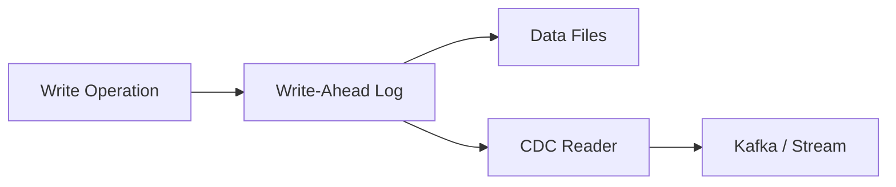
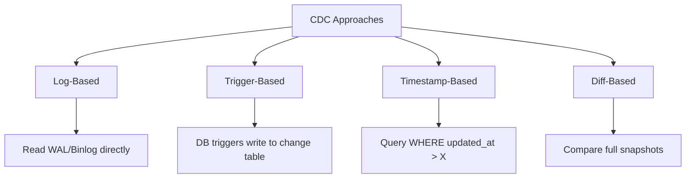
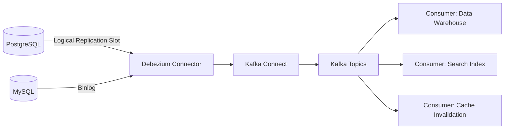
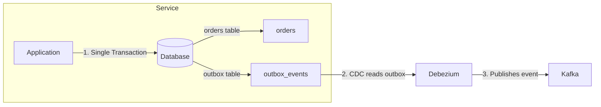
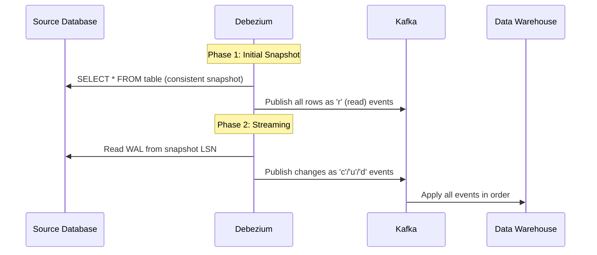
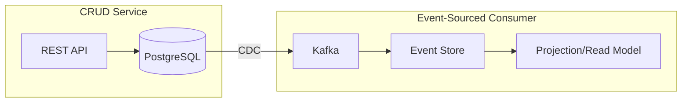

# Change Data Capture (CDC) Patterns

## Why CDC Exists

Traditional data extraction uses full table scans: `SELECT * FROM orders WHERE updated_at > last_run`. This approach has critical flaws:

1. **Deletes are invisible** — deleted rows don't appear in the next scan
2. **Schema dependency** — requires an `updated_at` column that the source may not have
3. **Source load** — full scans hammer the production database
4. **Latency** — batch scheduling means hours of delay
5. **Missed updates** — clock skew or non-monotonic timestamps can cause gaps

Change Data Capture (CDC) reads the database's **transaction log** (WAL/binlog/redo log) to capture every INSERT, UPDATE, and DELETE as it happens. It's like getting a real-time stream of all database mutations.

### Historical Context

- **1990s:** Database replication (Oracle GoldenGate, SQL Server replication) — proprietary, expensive
- **2010:** LinkedIn develops Databus for change streaming
- **2017:** Debezium launched as an open-source CDC platform on Kafka Connect
- **2020s:** CDC becomes the standard pattern for data integration, powering event-driven architectures
- **2025:** Every modern data platform (Fivetran, Airbyte, Striim) offers CDC connectors

## First Principles

### The Transaction Log

Every relational database maintains a write-ahead log (WAL) that records all mutations before they're applied to the data files:



| Database | Log Name | Format |
|----------|----------|--------|
| PostgreSQL | WAL (Write-Ahead Log) | Binary, logical decoding |
| MySQL | Binlog (Binary Log) | Row-based, statement-based |
| SQL Server | Transaction Log | Binary |
| Oracle | Redo Log / Archive Log | Binary |
| MongoDB | Oplog (Operations Log) | BSON |

### CDC Approaches



| Approach | Captures Deletes | Source Impact | Latency | Complexity |
|----------|-----------------|---------------|---------|------------|
| Log-based | Yes | Minimal | Seconds | High |
| Trigger-based | Yes | High (trigger overhead) | Seconds | Medium |
| Timestamp-based | No | Moderate (query) | Minutes-Hours | Low |
| Diff-based | Yes | High (two full scans) | Hours | Low |

::: tip
Log-based CDC is the gold standard. Use it whenever possible. Fall back to timestamp-based only when you cannot access the transaction log (e.g., third-party SaaS databases).
:::

## Log-Based CDC with Debezium

### Architecture



### Debezium Change Event Format

```typescript
interface DebeziumChangeEvent {
  schema: {
    type: string;
    fields: unknown[];
  };
  payload: {
    before: Record<string, unknown> | null;  // Previous state (null for INSERT)
    after: Record<string, unknown> | null;   // New state (null for DELETE)
    source: {
      version: string;
      connector: string;
      name: string;
      ts_ms: number;        // Source timestamp
      snapshot: string;      // 'true', 'false', 'last'
      db: string;
      schema: string;
      table: string;
      txId: number;
      lsn: number;          // Log Sequence Number
      xmin: number | null;
    };
    op: 'c' | 'u' | 'd' | 'r';  // create, update, delete, read (snapshot)
    ts_ms: number;           // Debezium processing timestamp
    transaction: {
      id: string;
      total_order: number;
      data_collection_order: number;
    } | null;
  };
}

// Example: Customer update event
const exampleEvent: DebeziumChangeEvent = {
  schema: { type: 'struct', fields: [] },
  payload: {
    before: { id: 1, name: 'John Doe', email: 'john@old.com', city: 'NYC' },
    after: { id: 1, name: 'John Doe', email: 'john@new.com', city: 'NYC' },
    source: {
      version: '2.5.0.Final',
      connector: 'postgresql',
      name: 'production-db',
      ts_ms: 1742292000000,
      snapshot: 'false',
      db: 'myapp',
      schema: 'public',
      table: 'customers',
      txId: 12345,
      lsn: 98765432,
      xmin: null,
    },
    op: 'u', // Update
    ts_ms: 1742292001000,
    transaction: null,
  },
};
```

### Processing CDC Events

```typescript
interface CDCProcessor<T> {
  handleInsert(after: T, metadata: CDCMetadata): Promise<void>;
  handleUpdate(before: T, after: T, metadata: CDCMetadata): Promise<void>;
  handleDelete(before: T, metadata: CDCMetadata): Promise<void>;
  handleSnapshot(record: T, metadata: CDCMetadata): Promise<void>;
}

interface CDCMetadata {
  sourceTimestamp: number;
  lsn: number;
  transactionId: number;
  table: string;
  database: string;
}

class WarehouseCDCProcessor<T extends Record<string, unknown>>
  implements CDCProcessor<T>
{
  constructor(
    private readonly db: Database,
    private readonly targetTable: string,
    private readonly primaryKey: string,
  ) {}

  async handleInsert(after: T, metadata: CDCMetadata): Promise<void> {
    const columns = Object.keys(after);
    const placeholders = columns.map((_, i) => `$${i + 1}`);
    const metaCols = ', _cdc_operation, _cdc_timestamp, _cdc_lsn';
    const metaPlaceholders = `, $${columns.length + 1}, $${columns.length + 2}, $${columns.length + 3}`;

    await this.db.query(
      `INSERT INTO ${this.targetTable} (${columns.join(', ')}${metaCols})
       VALUES (${placeholders.join(', ')}${metaPlaceholders})
       ON CONFLICT (${this.primaryKey}) DO UPDATE SET
       ${columns.map((c, i) => `${c} = $${i + 1}`).join(', ')},
       _cdc_operation = $${columns.length + 1},
       _cdc_timestamp = $${columns.length + 2}`,
      [...Object.values(after), 'INSERT', metadata.sourceTimestamp, metadata.lsn],
    );
  }

  async handleUpdate(before: T, after: T, metadata: CDCMetadata): Promise<void> {
    // Same as insert with UPSERT pattern
    await this.handleInsert(after, { ...metadata });
  }

  async handleDelete(before: T, metadata: CDCMetadata): Promise<void> {
    // Soft delete: mark as deleted with metadata
    await this.db.query(
      `UPDATE ${this.targetTable}
       SET _cdc_operation = 'DELETE',
           _cdc_timestamp = $1,
           _cdc_deleted_at = NOW()
       WHERE ${this.primaryKey} = $2`,
      [metadata.sourceTimestamp, before[this.primaryKey]],
    );
  }

  async handleSnapshot(record: T, metadata: CDCMetadata): Promise<void> {
    await this.handleInsert(record, metadata);
  }
}

interface Database {
  query(sql: string, params: unknown[]): Promise<unknown>;
}
```

## The Outbox Pattern

### The Problem

Microservices often need to update a database AND publish an event. These two operations can't be done atomically:

```
1. Update database: SUCCESS
2. Publish to Kafka: FAILURE (network issue)
→ Database is updated but no event was published
→ Downstream consumers are out of sync
```

### The Solution: Transactional Outbox

Write the event to an "outbox" table in the same database transaction. CDC then reads the outbox table and publishes to Kafka.



```typescript
// Application code: single transaction
async function createOrder(
  order: Order,
  db: TransactionalDatabase,
): Promise<void> {
  await db.transaction(async (tx) => {
    // 1. Insert the order
    await tx.query(
      'INSERT INTO orders (id, customer_id, total, status) VALUES ($1, $2, $3, $4)',
      [order.id, order.customerId, order.total, 'CREATED'],
    );

    // 2. Insert the event into the outbox (SAME TRANSACTION)
    await tx.query(
      `INSERT INTO outbox_events
       (id, aggregate_type, aggregate_id, event_type, payload, created_at)
       VALUES ($1, $2, $3, $4, $5, NOW())`,
      [
        crypto.randomUUID(),
        'Order',
        order.id,
        'OrderCreated',
        JSON.stringify({
          orderId: order.id,
          customerId: order.customerId,
          total: order.total,
          createdAt: new Date().toISOString(),
        }),
      ],
    );
  });
  // Both succeed or both fail — guaranteed by the database transaction
}

interface Order {
  id: string;
  customerId: string;
  total: number;
}

interface TransactionalDatabase {
  transaction(fn: (tx: Database) => Promise<void>): Promise<void>;
}
```

### Outbox Table Schema

```sql
CREATE TABLE outbox_events (
    id              UUID PRIMARY KEY,
    aggregate_type  VARCHAR(100) NOT NULL,   -- e.g., 'Order', 'Customer'
    aggregate_id    VARCHAR(100) NOT NULL,   -- e.g., order ID
    event_type      VARCHAR(100) NOT NULL,   -- e.g., 'OrderCreated'
    payload         JSONB NOT NULL,          -- Event payload
    created_at      TIMESTAMP NOT NULL DEFAULT NOW(),
    -- Debezium will capture this row via CDC and publish to Kafka
    -- After publishing, the row can be deleted (or archived)
);

-- Index for cleanup
CREATE INDEX idx_outbox_created ON outbox_events(created_at);
```

### Outbox Cleanup

After CDC captures outbox events, they should be cleaned up to prevent table bloat:

```typescript
class OutboxCleaner {
  constructor(
    private readonly db: Database,
    private readonly retentionHours: number = 24,
  ) {}

  async cleanup(): Promise<number> {
    const result = await this.db.query(
      `DELETE FROM outbox_events
       WHERE created_at < NOW() - INTERVAL '${this.retentionHours} hours'`,
      [],
    );
    return result.rowCount;
  }
}
```

## CDC Pipeline Architecture

### Initial Snapshot + Streaming

When first setting up CDC, you need an initial snapshot of existing data:



```typescript
interface CDCPipelineConfig {
  sourceDatabase: {
    host: string;
    port: number;
    database: string;
    user: string;
    password: string;
    replicationSlot: string;    // PostgreSQL
    publication: string;         // PostgreSQL logical replication
  };
  kafka: {
    bootstrapServers: string;
    topicPrefix: string;
    schemaRegistryUrl: string;
  };
  tables: Array<{
    schema: string;
    table: string;
    primaryKey: string[];
    includeColumns?: string[];
    excludeColumns?: string[];
  }>;
  snapshot: {
    mode: 'initial' | 'always' | 'never' | 'when_needed';
    parallelism: number;
    batchSize: number;
  };
}

const productionConfig: CDCPipelineConfig = {
  sourceDatabase: {
    host: 'prod-db.internal',
    port: 5432,
    database: 'myapp',
    user: 'debezium',
    password: '***',
    replicationSlot: 'debezium_slot',
    publication: 'debezium_pub',
  },
  kafka: {
    bootstrapServers: 'kafka-1:9092,kafka-2:9092,kafka-3:9092',
    topicPrefix: 'cdc.myapp',
    schemaRegistryUrl: 'http://schema-registry:8081',
  },
  tables: [
    {
      schema: 'public',
      table: 'orders',
      primaryKey: ['id'],
      excludeColumns: ['internal_notes'], // PII exclusion
    },
    {
      schema: 'public',
      table: 'customers',
      primaryKey: ['id'],
      excludeColumns: ['ssn', 'credit_card'], // PII exclusion
    },
  ],
  snapshot: {
    mode: 'initial',
    parallelism: 4,
    batchSize: 10000,
  },
};
```

## Edge Cases & Failure Modes

### WAL Retention and Slot Overflow

PostgreSQL's logical replication slots prevent WAL cleanup until the consumer has read all changes. If the consumer falls behind:

$$
\text{WAL growth rate} = \text{write throughput} \times \text{lag duration}
$$

A database writing 100 MB/s of WAL with a consumer 1 hour behind:

$$
\text{WAL accumulation} = 100 \text{ MB/s} \times 3600 \text{ s} = 360 \text{ GB}
$$

::: danger
An unmonitored replication slot can fill the disk and crash the production database. Always set `max_slot_wal_keep_size` in PostgreSQL (13+) and monitor `pg_replication_slots` lag.
:::

```typescript
class ReplicationSlotMonitor {
  async checkSlotHealth(db: Database): Promise<SlotHealth[]> {
    const result = await db.query(
      `SELECT
         slot_name,
         active,
         pg_wal_lsn_diff(pg_current_wal_lsn(), restart_lsn) as lag_bytes,
         pg_size_pretty(pg_wal_lsn_diff(pg_current_wal_lsn(), restart_lsn)) as lag_pretty
       FROM pg_replication_slots
       WHERE slot_type = 'logical'`,
      [],
    );

    return (result as any).rows.map((row: any) => ({
      slotName: row.slot_name,
      active: row.active,
      lagBytes: parseInt(row.lag_bytes, 10),
      lagPretty: row.lag_pretty,
      status: row.lag_bytes > 10_000_000_000 ? 'CRITICAL' :
              row.lag_bytes > 1_000_000_000 ? 'WARNING' : 'OK',
    }));
  }
}

interface SlotHealth {
  slotName: string;
  active: boolean;
  lagBytes: number;
  lagPretty: string;
  status: 'OK' | 'WARNING' | 'CRITICAL';
}
```

### Schema Changes During CDC

When the source schema changes, CDC events may contain different fields:

```typescript
class SchemaAwareCDCProcessor {
  private schemaVersions: Map<string, number> = new Map();

  async processEvent(event: DebeziumChangeEvent): Promise<void> {
    const table = event.payload.source.table;
    const fields = event.payload.after
      ? Object.keys(event.payload.after)
      : [];

    const currentVersion = this.schemaVersions.get(table) ?? 0;
    const knownFieldCount = currentVersion; // Simplified

    if (fields.length !== knownFieldCount && currentVersion > 0) {
      console.warn(
        `Schema change detected on ${table}: ` +
          `expected ${knownFieldCount} fields, got ${fields.length}`,
      );

      // Option 1: Pause and alert
      // Option 2: Adapt automatically (add new columns)
      // Option 3: Route to a dead letter queue for manual handling
      await this.handleSchemaChange(table, fields);
    }

    this.schemaVersions.set(table, fields.length);
  }

  private async handleSchemaChange(
    table: string,
    newFields: string[],
  ): Promise<void> {
    // Auto-evolution: ALTER TABLE ADD COLUMN for new fields
    // This is what Debezium's schema evolution feature does
    console.log(`Evolving schema for ${table}: ${newFields.join(', ')}`);
  }
}
```

### Transaction Ordering

CDC captures changes in transaction commit order, not the order operations were executed within a transaction:

```
Transaction 1 (committed at t=10):
  UPDATE accounts SET balance = 50 WHERE id = 1;   -- executed at t=1
  UPDATE accounts SET balance = 150 WHERE id = 2;  -- executed at t=2

Transaction 2 (committed at t=5):
  UPDATE accounts SET balance = 100 WHERE id = 3;  -- executed at t=3

CDC order: Transaction 2 first (committed earlier), then Transaction 1
```

This is correct behavior — it reflects the database's committed state order.

### Tombstone Events for Kafka Compaction

For DELETE events, Debezium publishes a tombstone (null value) to enable Kafka log compaction:

```typescript
// Normal delete event
const deleteEvent = {
  key: { id: 123 },
  value: {
    payload: {
      before: { id: 123, name: 'Deleted User' },
      after: null,
      op: 'd',
    },
  },
};

// Tombstone event (published after the delete event)
const tombstoneEvent = {
  key: { id: 123 },
  value: null, // NULL value = tombstone
};
```

Kafka compaction removes all records with the same key once a tombstone is seen.

## Performance Characteristics

### CDC Latency

$$
\text{Latency}_{\text{CDC}} = T_{\text{WAL write}} + T_{\text{Debezium poll}} + T_{\text{serialization}} + T_{\text{Kafka produce}} + T_{\text{consumer poll}}
$$

Typical breakdown:

| Component | Latency | Notes |
|-----------|---------|-------|
| WAL write | < 1ms | Already happening |
| Debezium poll | 100-500ms | Configurable polling interval |
| Serialization | 1-10ms | Depends on format (Avro, JSON) |
| Kafka produce | 5-50ms | Depends on acks setting |
| Consumer poll | 100-500ms | Depends on consumer config |
| **Total** | **200ms - 1s** | Typical end-to-end |

### Throughput

Debezium throughput depends on the WAL read speed:

| Database | Typical Throughput | Bottleneck |
|----------|-------------------|------------|
| PostgreSQL | 10K-50K events/s | Logical decoding CPU |
| MySQL | 20K-100K events/s | Binlog read speed |
| MongoDB | 30K-100K events/s | Oplog tailing |

### Source Database Impact

Log-based CDC has minimal impact on the source:

$$
\text{Additional load} \approx \text{WAL read I/O} + \text{Replication slot bookkeeping}
$$

In practice: < 5% CPU overhead, < 10% additional I/O.

::: tip
Log-based CDC is the lowest-impact extraction method. It adds less load than a single analyst running ad-hoc queries against the production database.
:::

## Mathematical Foundations

### CDC Consistency Model

CDC provides **eventual consistency** with the source database:

$$
\forall t: \exists \Delta t > 0: \text{State}_{\text{target}}(t + \Delta t) = \text{State}_{\text{source}}(t)
$$

The target state at time $t + \Delta t$ equals the source state at time $t$, where $\Delta t$ is the CDC latency.

### Ordering Guarantees

Within a single partition (keyed by primary key):

$$
\text{event}_1 \prec \text{event}_2 \iff \text{LSN}_1 < \text{LSN}_2
$$

Across partitions, only transaction-level ordering is guaranteed (through Debezium's transaction metadata).

## Real-World War Stories

::: info War Story
**The Replication Slot That Ate the Disk**

A company's Debezium connector went down on a Friday evening (Kafka Connect node failure). The PostgreSQL replication slot continued accumulating WAL. By Monday morning, 800 GB of WAL had accumulated, filling the disk. The production database crashed with "no space left on device."

Recovery:
1. Emergency: Drop the replication slot to allow WAL cleanup
2. Restart the database
3. Re-create the replication slot
4. Re-snapshot all tables (since the slot was dropped, CDC continuity was lost)

Total downtime: 4 hours. Data re-snapshot: 12 hours.

**Fix:**
1. Set `max_slot_wal_keep_size = 100GB` (PostgreSQL 13+)
2. Added monitoring on replication slot lag with PagerDuty alerts at 10 GB
3. Deployed Debezium in HA mode (multiple Kafka Connect workers)
:::

::: info War Story
**The CDC Event Storm After Schema Migration**

A team ran `ALTER TABLE customers ADD COLUMN loyalty_tier VARCHAR(20) DEFAULT 'Bronze'`. This UPDATE touched all 15 million rows. Debezium captured 15 million UPDATE events and published them to Kafka.

The downstream consumer (data warehouse loader) was overwhelmed — it usually processed 50K events/hour but received 15M in minutes. Kafka consumer lag grew to 12 hours.

**Fix:**
1. Set `column.exclude.list` to ignore columns that don't need CDC tracking
2. Added rate limiting on the consumer side
3. For future schema migrations, use `ALTER TABLE ADD COLUMN ... DEFAULT ... (no rewrite)` in PostgreSQL 11+ to avoid touching existing rows
:::

## Decision Framework

### CDC Approach Selection

| Factor | Log-Based (Debezium) | Query-Based | Trigger-Based |
|--------|---------------------|-------------|---------------|
| Captures deletes | Yes | No | Yes |
| Source DB impact | Minimal | Moderate | High |
| Latency | Seconds | Minutes-Hours | Seconds |
| Schema changes | Auto-detected | Manual | Manual |
| Setup complexity | High | Low | Medium |
| Database access needed | Replication user | Read-only user | Admin (create triggers) |
| Source DB support | Major RDBMSs | Any SQL DB | Any SQL DB |

## Advanced Topics

### Multi-Table CDC with Transaction Boundaries

Debezium can capture events from multiple tables within a single transaction:

```typescript
interface TransactionAwareCDCConsumer {
  onTransactionBegin(txId: string): void;
  onEvent(event: DebeziumChangeEvent, txId: string): void;
  onTransactionEnd(txId: string): void;
}

class OrderSystemCDCConsumer implements TransactionAwareCDCConsumer {
  private transactionBuffers: Map<string, DebeziumChangeEvent[]> = new Map();

  onTransactionBegin(txId: string): void {
    this.transactionBuffers.set(txId, []);
  }

  onEvent(event: DebeziumChangeEvent, txId: string): void {
    this.transactionBuffers.get(txId)?.push(event);
  }

  async onTransactionEnd(txId: string): Promise<void> {
    const events = this.transactionBuffers.get(txId) ?? [];
    this.transactionBuffers.delete(txId);

    // Process all events in the transaction atomically
    // This ensures the target is consistent with the source
    // (e.g., order header + line items together)
    await this.applyTransactionAtomically(events);
  }

  private async applyTransactionAtomically(
    events: DebeziumChangeEvent[],
  ): Promise<void> {
    // Apply all events in a single target database transaction
    console.log(`Applying ${events.length} events atomically`);
  }
}
```

### CDC for Microservice Event Sourcing

Use CDC as a bridge between traditional CRUD services and event-sourced consumers:



This allows legacy services to remain unchanged while enabling event-driven patterns downstream.

## Cross-References

- [Pipeline Patterns Overview](./index.md) — Context for CDC within pipeline architecture
- [Exactly-Once Processing](../stream-processing/exactly-once-processing.md) — Exactly-once CDC delivery
- [Schema Evolution](../data-modeling/schema-evolution.md) — Schema changes in CDC pipelines
- [Data Quality Checks](./data-quality-checks.md) — Validating CDC data
- [Slowly Changing Dimensions](../data-modeling/slowly-changing-dimensions.md) — CDC driving SCD updates

---

::: tip Key Takeaway
- CDC reads from the database's write-ahead log (WAL/binlog) to capture all changes (inserts, updates, deletes) with zero load on the source database.
- The outbox pattern solves the dual-write problem: write the event to an outbox table in the same transaction as the data change, then CDC captures it from the outbox.
- Initial snapshot + ongoing CDC streaming provides a complete, continuously updated replica of the source database.
:::

::: details Exercise
**Design a CDC Pipeline for Microservices Migration**

Your company is migrating from a monolith (PostgreSQL) to microservices. During the migration, both the monolith and new services need to stay in sync. The monolith has 50 tables, 3 of which are high-traffic (10K writes/sec each).

Design a CDC architecture that:
1. Streams changes from the monolith to a Kafka topic per table
2. Handles the initial snapshot of 500M rows across the 50 tables
3. Maintains ordering guarantees for the 3 high-traffic tables
4. Supports the new microservices gradually taking over ownership of tables

::: details Solution
1. **CDC Setup:** Deploy Debezium with PostgreSQL connector using logical replication. One Kafka topic per table with the table's primary key as the Kafka message key (ensures ordering per-key within a partition).

2. **Initial Snapshot:** Use Debezium's snapshot mode = "initial". For the 3 high-traffic tables (large), use "initial_only" mode first to snapshot without CDC, then switch to "always" mode. Snapshot 50 tables in parallel batches of 10 to avoid overwhelming PostgreSQL's replication slots.

3. **Ordering:** Kafka guarantees ordering within a partition. Set the message key to the table's primary key. For the 3 high-traffic tables, use 12 Kafka partitions each (3x the consumer count) to balance throughput while maintaining per-key ordering.

4. **Migration Strategy:**
   - Phase 1: CDC streams all 50 tables to Kafka. New services consume from Kafka (read-only).
   - Phase 2: New service takes ownership of one table -- writes go to the new service, which publishes changes to Kafka. Monolith consumes from Kafka to stay in sync (reverse CDC).
   - Phase 3: Repeat for each table. Decommission monolith tables one by one.
   - Phase 4: CDC infrastructure becomes the permanent inter-service event bus.
:::

::: warning Common Misconceptions
- **"CDC is just another way to do SELECT queries."** CDC reads from the WAL, not the main tables. It captures changes as they happen with zero impact on query performance, unlike polling-based approaches.
- **"CDC captures everything automatically."** CDC misses DDL changes (schema changes) by default. You must configure schema history topics and handle schema evolution explicitly.
- **"The outbox pattern is unnecessary if you have CDC."** Without the outbox, you face the dual-write problem: writing data AND publishing an event are two separate operations that can fail independently. The outbox makes them atomic.
- **"CDC events arrive in global order."** CDC guarantees ordering per-key within a partition, not global ordering. Events from different keys may arrive out of order relative to each other.
- **"You can CDC any database."** CDC requires the database to expose its change log. Not all databases support this, and those that do have varying levels of capability and performance impact.
:::

::: tip In Production
- **Uber** uses Debezium CDC to replicate data from hundreds of microservice databases into their centralized data lake, processing billions of change events daily with exactly-once semantics.
- **Airbnb** uses CDC with the outbox pattern for their booking system, ensuring that every booking state change is reliably propagated to search indexing, pricing, and analytics services.
- **Netflix** uses CDC to stream changes from their content metadata database to downstream recommendation and search services with sub-second latency.
- **LinkedIn** built their own CDC framework (Databus) to replicate changes from their social graph database to read replicas and derived data stores serving 800M+ members.
:::

::: details Quiz
**1. What is the fundamental advantage of log-based CDC over query-based change detection?**

A) Log-based CDC is simpler to implement
B) Log-based CDC captures all changes (including deletes) with zero impact on source database performance
C) Log-based CDC requires less storage
D) Log-based CDC works with all database types

::: details Answer
**B)** Log-based CDC reads from the WAL/binlog, which the database already writes for its own replication and crash recovery. This means zero additional load on the source database, and it captures inserts, updates, AND deletes.
:::

**2. What problem does the outbox pattern solve?**

A) Performance issues with CDC
B) The dual-write problem: ensuring data changes and events are produced atomically in a single transaction
C) Schema evolution in CDC events
D) Ordering of CDC events

::: details Answer
**B)** Without the outbox, writing to a database and publishing to Kafka are two separate operations. If the app crashes between them, either the event is lost (data changed but no event) or the event is sent but data was rolled back (phantom event). The outbox table is written in the same transaction as the data change, and CDC captures it reliably.
:::

**3. Why is Kafka typically used as the transport layer for CDC?**

A) Kafka is the only system that supports CDC
B) Kafka provides durable, ordered, replayable event streams with configurable retention, enabling consumers to process at their own pace
C) Kafka is faster than all alternatives
D) CDC requires exactly-once semantics which only Kafka provides

::: details Answer
**B)** Kafka's durability (data survives broker failures), ordering (per-partition), replayability (consumers can seek to any offset), and configurable retention (keep events for days/weeks) make it ideal for CDC. Consumers can be added, fail, and catch up independently.
:::

**4. How does Debezium handle the initial snapshot of existing data?**

A) It reads the WAL from the beginning of time
B) It performs a consistent snapshot (SELECT * with a lock or consistent read) to capture existing data, then switches to streaming WAL changes
C) It requires manual data loading before CDC can start
D) It only captures changes, not existing data

::: details Answer
**B)** Debezium's "initial" snapshot mode reads all existing data from the source tables using consistent reads (snapshot isolation), publishes them as "read" events (op=r), then transitions to streaming new changes from the WAL.
:::

**5. What happens if the WAL retention is shorter than a CDC consumer's downtime?**

A) The consumer automatically catches up
B) CDC events are permanently lost for the gap period, requiring a new initial snapshot to resync
C) The database automatically extends retention
D) Debezium buffers the events internally

::: details Answer
**B)** If the WAL rotates away segments that the CDC consumer has not yet read, those changes are permanently lost. The consumer must perform a new snapshot to re-establish a consistent baseline. Set WAL retention longer than your maximum acceptable downtime.
:::
:::

---

> **One-Liner Summary:** CDC captures every database change (insert, update, delete) from the write-ahead log with zero source impact -- pair it with the outbox pattern for reliable event-driven architectures.
