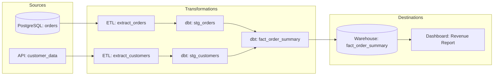
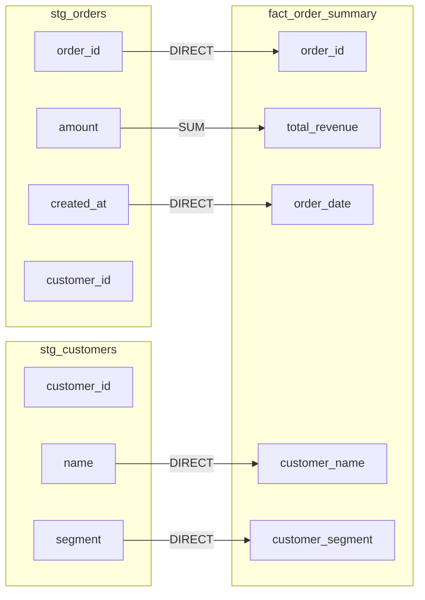

# Data Lineage

## Why Data Lineage Exists

When a dashboard shows wrong numbers, the first question is: "Where did this data come from?" Without lineage, answering this requires manual investigation — tracing SQL queries backwards, reading pipeline code, asking other teams. This can take days.

Data lineage automatically tracks the complete journey of data from source to destination, answering:

1. **Where did this data come from?** (upstream lineage / provenance)
2. **What depends on this data?** (downstream lineage / impact analysis)
3. **How was this data transformed?** (transformation lineage)
4. **When was this data last updated?** (freshness lineage)
5. **Who is responsible for this data?** (ownership lineage)

### Historical Context

- **2000s:** Manual data dictionaries and documentation (quickly outdated)
- **2010s:** ETL tool metadata (Informatica, SSIS) — tool-specific, siloed
- **2016:** Apache Atlas released for Hadoop ecosystem lineage
- **2018:** Marquez (WeWork/LF AI) — open-source lineage service
- **2020:** OpenLineage standard proposed — vendor-neutral lineage API
- **2022:** OpenLineage becomes Linux Foundation project
- **2024-2025:** Column-level lineage becomes standard; AI-powered lineage extraction from SQL

## First Principles

### The Lineage Graph

Data lineage is a directed acyclic graph (DAG):

$$
G = (V, E)
$$

Where:
- $V = \text{Datasets} \cup \text{Jobs}$ (datasets and transformations)
- $E \subseteq V \times V$ (data flows from one node to another)



### Lineage Granularity

| Level | Tracks | Example |
|-------|--------|---------|
| Dataset-level | Table/file dependencies | `orders` -> `fact_orders` |
| Column-level | Individual field flows | `orders.amount` -> `fact_orders.total_revenue` |
| Row-level | Individual record provenance | Row 12345 came from source rows 100, 200, 300 |
| Cell-level | Individual value provenance | `revenue = $150` came from `amount = $150` in `orders` |

Column-level lineage is the sweet spot — granular enough to be useful, feasible to implement at scale.

## OpenLineage Standard

### The OpenLineage Event Model

```typescript
interface OpenLineageRunEvent {
  eventType: 'START' | 'RUNNING' | 'COMPLETE' | 'FAIL' | 'ABORT';
  eventTime: string; // ISO 8601
  run: Run;
  job: Job;
  inputs: InputDataset[];
  outputs: OutputDataset[];
  producer: string; // URI identifying the producer
  schemaURL: string;
}

interface Run {
  runId: string; // UUID
  facets?: {
    nominalTime?: {
      nominalStartTime: string;
      nominalEndTime: string;
    };
    parent?: {
      run: { runId: string };
      job: { namespace: string; name: string };
    };
    errorMessage?: {
      message: string;
      programmingLanguage: string;
      stackTrace: string;
    };
  };
}

interface Job {
  namespace: string;
  name: string;
  facets?: {
    sourceCodeLocation?: {
      type: string;
      url: string;
    };
    sql?: {
      query: string;
    };
    documentation?: {
      description: string;
    };
  };
}

interface InputDataset {
  namespace: string;
  name: string;
  facets?: {
    schema?: {
      fields: Array<{
        name: string;
        type: string;
        description?: string;
      }>;
    };
    dataQualityMetrics?: {
      rowCount: number;
      bytes: number;
      columnMetrics: Record<
        string,
        {
          nullCount: number;
          distinctCount: number;
          min: unknown;
          max: unknown;
        }
      >;
    };
  };
  inputFacets?: {
    dataQualityAssertions?: {
      assertions: Array<{
        assertion: string;
        success: boolean;
        column?: string;
      }>;
    };
  };
}

interface OutputDataset {
  namespace: string;
  name: string;
  facets?: {
    schema?: {
      fields: Array<{
        name: string;
        type: string;
        description?: string;
      }>;
    };
    columnLineage?: {
      fields: Record<
        string,
        {
          inputFields: Array<{
            namespace: string;
            name: string;
            field: string;
          }>;
          transformationDescription?: string;
          transformationType?: string;
        }
      >;
    };
    outputStatistics?: {
      rowCount: number;
      size: number;
    };
  };
}
```

### Emitting OpenLineage Events

```typescript
class OpenLineageEmitter {
  constructor(
    private readonly endpoint: string,
    private readonly producer: string,
  ) {}

  async emitStart(
    jobNamespace: string,
    jobName: string,
    runId: string,
    inputs: InputDataset[],
    outputs: OutputDataset[],
  ): Promise<void> {
    const event: OpenLineageRunEvent = {
      eventType: 'START',
      eventTime: new Date().toISOString(),
      run: { runId },
      job: { namespace: jobNamespace, name: jobName },
      inputs,
      outputs,
      producer: this.producer,
      schemaURL: 'https://openlineage.io/spec/2-0-2/OpenLineage.json#/definitions/RunEvent',
    };

    await this.send(event);
  }

  async emitComplete(
    jobNamespace: string,
    jobName: string,
    runId: string,
    inputs: InputDataset[],
    outputs: OutputDataset[],
  ): Promise<void> {
    const event: OpenLineageRunEvent = {
      eventType: 'COMPLETE',
      eventTime: new Date().toISOString(),
      run: { runId },
      job: { namespace: jobNamespace, name: jobName },
      inputs,
      outputs,
      producer: this.producer,
      schemaURL: 'https://openlineage.io/spec/2-0-2/OpenLineage.json#/definitions/RunEvent',
    };

    await this.send(event);
  }

  async emitFail(
    jobNamespace: string,
    jobName: string,
    runId: string,
    error: Error,
  ): Promise<void> {
    const event: OpenLineageRunEvent = {
      eventType: 'FAIL',
      eventTime: new Date().toISOString(),
      run: {
        runId,
        facets: {
          errorMessage: {
            message: error.message,
            programmingLanguage: 'TypeScript',
            stackTrace: error.stack ?? '',
          },
        },
      },
      job: { namespace: jobNamespace, name: jobName },
      inputs: [],
      outputs: [],
      producer: this.producer,
      schemaURL: 'https://openlineage.io/spec/2-0-2/OpenLineage.json#/definitions/RunEvent',
    };

    await this.send(event);
  }

  private async send(event: OpenLineageRunEvent): Promise<void> {
    const response = await fetch(`${this.endpoint}/api/v1/lineage`, {
      method: 'POST',
      headers: { 'Content-Type': 'application/json' },
      body: JSON.stringify(event),
    });

    if (!response.ok) {
      console.error(`Failed to emit lineage event: ${response.status}`);
    }
  }
}
```

## Column-Level Lineage

### SQL-Based Column Lineage Extraction

```typescript
interface ColumnLineage {
  outputColumn: string;
  inputColumns: Array<{
    table: string;
    column: string;
    transformationType: 'DIRECT' | 'AGGREGATION' | 'CONDITIONAL' | 'EXPRESSION';
  }>;
  transformationSQL?: string;
}

class SQLColumnLineageExtractor {
  /**
   * Extract column-level lineage from a SQL query.
   * This is a simplified version — production implementations
   * use SQL parsers (sqllineage, SQLFluff, or custom ANTLR grammars).
   */
  extractLineage(sql: string): ColumnLineage[] {
    const lineages: ColumnLineage[] = [];

    // This is highly simplified — real implementations parse the AST
    const selectMatch = sql.match(
      /SELECT\s+([\s\S]+?)\s+FROM\s+([\s\S]+?)(?:WHERE|GROUP|ORDER|LIMIT|$)/i,
    );

    if (!selectMatch) return lineages;

    const selectClause = selectMatch[1];
    const columns = selectClause.split(',').map((c) => c.trim());

    for (const col of columns) {
      const lineage = this.parseSelectExpression(col);
      if (lineage) lineages.push(lineage);
    }

    return lineages;
  }

  private parseSelectExpression(expr: string): ColumnLineage | null {
    // Handle alias: "expression AS alias"
    const aliasMatch = expr.match(/(.+)\s+AS\s+(\w+)/i);
    const outputColumn = aliasMatch ? aliasMatch[2] : expr.trim();
    const expression = aliasMatch ? aliasMatch[1].trim() : expr.trim();

    // Handle direct column reference: "table.column"
    const directMatch = expression.match(/^(\w+)\.(\w+)$/);
    if (directMatch) {
      return {
        outputColumn,
        inputColumns: [
          {
            table: directMatch[1],
            column: directMatch[2],
            transformationType: 'DIRECT',
          },
        ],
      };
    }

    // Handle aggregation: "SUM(table.column)"
    const aggMatch = expression.match(
      /^(SUM|COUNT|AVG|MIN|MAX)\((\w+)\.(\w+)\)$/i,
    );
    if (aggMatch) {
      return {
        outputColumn,
        inputColumns: [
          {
            table: aggMatch[2],
            column: aggMatch[3],
            transformationType: 'AGGREGATION',
          },
        ],
        transformationSQL: expression,
      };
    }

    return null;
  }
}
```

### Visualizing Column Lineage



## Impact Analysis

### Downstream Impact

When a source table changes, what breaks?

```typescript
class ImpactAnalyzer {
  private lineageGraph: Map<string, Set<string>> = new Map(); // dataset -> downstream datasets

  addEdge(upstream: string, downstream: string): void {
    const existing = this.lineageGraph.get(upstream) ?? new Set();
    existing.add(downstream);
    this.lineageGraph.set(upstream, existing);
  }

  /**
   * Find all datasets that would be affected by a change to the given dataset.
   * BFS traversal of the lineage graph.
   */
  findDownstreamImpact(dataset: string): string[] {
    const visited = new Set<string>();
    const queue = [dataset];
    const impacted: string[] = [];

    while (queue.length > 0) {
      const current = queue.shift()!;
      if (visited.has(current)) continue;
      visited.add(current);

      if (current !== dataset) {
        impacted.push(current);
      }

      const downstream = this.lineageGraph.get(current) ?? new Set();
      for (const ds of downstream) {
        if (!visited.has(ds)) {
          queue.push(ds);
        }
      }
    }

    return impacted;
  }

  /**
   * Find all upstream sources for a given dataset.
   * Reverse BFS traversal.
   */
  findUpstreamSources(dataset: string): string[] {
    const reverseGraph = this.buildReverseGraph();
    const visited = new Set<string>();
    const queue = [dataset];
    const sources: string[] = [];

    while (queue.length > 0) {
      const current = queue.shift()!;
      if (visited.has(current)) continue;
      visited.add(current);

      if (current !== dataset) {
        sources.push(current);
      }

      const upstream = reverseGraph.get(current) ?? new Set();
      for (const us of upstream) {
        if (!visited.has(us)) {
          queue.push(us);
        }
      }
    }

    return sources;
  }

  /**
   * Column-level impact: what columns downstream are affected
   * by a change to a specific column?
   */
  findColumnImpact(
    dataset: string,
    column: string,
    columnLineage: Map<string, ColumnLineage[]>,
  ): Array<{ dataset: string; column: string }> {
    const impacted: Array<{ dataset: string; column: string }> = [];
    const visited = new Set<string>();

    const queue: Array<{ dataset: string; column: string }> = [{ dataset, column }];

    while (queue.length > 0) {
      const current = queue.shift()!;
      const key = `${current.dataset}.${current.column}`;
      if (visited.has(key)) continue;
      visited.add(key);

      if (key !== `${dataset}.${column}`) {
        impacted.push(current);
      }

      // Find all downstream columns that depend on this column
      const downstreamDatasets = this.lineageGraph.get(current.dataset) ?? new Set();
      for (const ds of downstreamDatasets) {
        const lineages = columnLineage.get(ds) ?? [];
        for (const lineage of lineages) {
          const dependsOnCurrent = lineage.inputColumns.some(
            (ic) => ic.table === current.dataset && ic.column === current.column,
          );
          if (dependsOnCurrent) {
            queue.push({ dataset: ds, column: lineage.outputColumn });
          }
        }
      }
    }

    return impacted;
  }

  private buildReverseGraph(): Map<string, Set<string>> {
    const reverse = new Map<string, Set<string>>();
    for (const [upstream, downstreamSet] of this.lineageGraph) {
      for (const downstream of downstreamSet) {
        const existing = reverse.get(downstream) ?? new Set();
        existing.add(upstream);
        reverse.set(downstream, existing);
      }
    }
    return reverse;
  }
}
```

## Performance Characteristics

### Lineage Collection Overhead

| Collection Method | Overhead | Accuracy |
|------------------|----------|----------|
| SQL parsing (static) | None (offline) | High for simple queries |
| Runtime instrumentation | 1-5% latency | Highest |
| Log analysis | None (post-hoc) | Medium |
| API-based (OpenLineage) | < 1ms per event | Depends on emitter |

### Lineage Storage

For a typical enterprise with 10,000 datasets and 5,000 jobs:

$$
\text{Graph nodes} = 10{,}000 + 5{,}000 = 15{,}000
$$

$$
\text{Graph edges} \approx 3 \times 5{,}000 = 15{,}000 \text{ (avg 3 datasets per job)}
$$

$$
\text{Column lineage edges} \approx 15{,}000 \times 10 = 150{,}000 \text{ (avg 10 columns per dataset)}
$$

Storage: ~100 MB for the graph, ~1 GB for historical run metadata.

## Edge Cases & Failure Modes

### Dynamic SQL and Lineage Gaps

Dynamically generated SQL (string concatenation, templates) is invisible to static analysis:

```typescript
// Static analysis CAN extract lineage from this:
const sql1 = 'SELECT a.id, b.name FROM table_a a JOIN table_b b ON a.id = b.id';

// Static analysis CANNOT extract lineage from this:
const tableName = getTableName(); // runtime-determined
const sql2 = `SELECT * FROM ${tableName}`;
```

**Mitigation:** Use runtime lineage collection (OpenLineage emitters) in addition to static SQL analysis.

### Cross-System Lineage

Data flows across systems are the hardest to track:

```
PostgreSQL -> Debezium -> Kafka -> Flink -> S3 -> Snowflake -> dbt -> Tableau
```

Each system has its own lineage mechanism. Connecting them requires a unified lineage service (Marquez, DataHub, Atlan).

## Mathematical Foundations

### Graph Reachability

Upstream lineage = reverse reachability:

$$
\text{upstream}(v) = \{u \in V : \exists \text{ path from } u \text{ to } v\}
$$

Downstream lineage = forward reachability:

$$
\text{downstream}(v) = \{u \in V : \exists \text{ path from } v \text{ to } u\}
$$

For a DAG with $V$ vertices and $E$ edges, reachability queries via BFS:

$$
\text{Time complexity} = O(V + E)
$$

### Lineage Completeness Metric

$$
\text{Completeness} = \frac{|\text{tracked edges}|}{|\text{actual edges}|}
$$

Most organizations achieve 60-80% lineage completeness. The missing 20-40% comes from dynamic SQL, cross-system gaps, and manual data movement.

## Real-World War Stories

::: info War Story
**The Phantom Column**

A BI team reported that the `customer_segment` field in their dashboard showed wrong values. Using lineage, the data team traced the field:

1. Dashboard: `customer_segment` from `gold.fact_orders`
2. `gold.fact_orders.customer_segment` from `silver.dim_customer.segment`
3. `silver.dim_customer.segment` from `bronze.crm_export.customer_type`
4. `bronze.crm_export.customer_type` from CRM API endpoint

The CRM team had changed the API response: `customer_type` now contained `"enterprise"` instead of `"Enterprise"` (case change). The silver layer's CASE WHEN mapping didn't handle lowercase, routing 30% of customers to "Unknown."

Without lineage, this investigation would have taken days. With lineage, it took 15 minutes.
:::

::: info War Story
**The Impact Analysis That Saved a Migration**

A team planned to rename a column in a source table (`user_name` -> `full_name`). They ran impact analysis before making the change:

- 47 downstream datasets affected
- 12 dbt models directly reference `user_name`
- 3 ML feature pipelines use the column
- 8 dashboards display it
- 2 data contracts specify it

Without impact analysis, they would have broken all of these. With it, they coordinated the change across all consumers before deploying.
:::

## Decision Framework

### Lineage Tool Selection

| Factor | Marquez | DataHub | Atlan | OpenMetadata |
|--------|---------|---------|-------|-------------|
| Open source | Yes | Yes | No | Yes |
| OpenLineage support | Native | Good | Good | Good |
| Column-level lineage | Yes | Yes | Yes | Yes |
| UI quality | Basic | Good | Best | Good |
| Self-hosted | Yes | Yes | No | Yes |
| Enterprise features | Limited | Good | Best | Good |
| Community size | Medium | Large | N/A | Medium |

## Advanced Topics

### Automated Lineage from SQL Parsing

Modern tools use SQL AST parsing to extract lineage automatically:

```typescript
interface SQLLineageParser {
  parse(sql: string): {
    inputs: Array<{ table: string; columns: string[] }>;
    outputs: Array<{ table: string; columns: string[] }>;
    columnMappings: ColumnLineage[];
  };
}

// Integration with dbt: extract lineage from compiled SQL
class DbtLineageExtractor {
  async extractFromManifest(
    manifestPath: string,
  ): Promise<Map<string, { inputs: string[]; outputs: string[] }>> {
    const lineageMap = new Map();

    // dbt's manifest.json contains dependency information
    // Plus compiled SQL for column-level extraction
    // Real implementation reads the manifest and parses SQL

    return lineageMap;
  }
}
```

### Real-Time Lineage

For streaming pipelines, lineage is captured continuously:

```typescript
class StreamingLineageCollector {
  private eventBuffer: OpenLineageRunEvent[] = [];
  private readonly flushIntervalMs: number = 5000;

  constructor(private readonly emitter: OpenLineageEmitter) {
    setInterval(() => this.flush(), this.flushIntervalMs);
  }

  recordProcessing(
    jobName: string,
    inputDatasets: string[],
    outputDatasets: string[],
  ): void {
    // Buffer lineage events for batch emission
    this.eventBuffer.push({
      eventType: 'COMPLETE',
      eventTime: new Date().toISOString(),
      run: { runId: crypto.randomUUID() },
      job: { namespace: 'streaming', name: jobName },
      inputs: inputDatasets.map((ds) => ({
        namespace: 'streaming',
        name: ds,
      })),
      outputs: outputDatasets.map((ds) => ({
        namespace: 'streaming',
        name: ds,
      })),
      producer: 'streaming-pipeline',
      schemaURL: 'https://openlineage.io/spec/2-0-2/OpenLineage.json',
    });
  }

  private async flush(): Promise<void> {
    const events = [...this.eventBuffer];
    this.eventBuffer = [];
    // Emit buffered events
    for (const event of events) {
      // Send to lineage service
    }
  }
}
```

## Cross-References

- [Pipeline Patterns Overview](./index.md) — Lineage within pipeline architecture
- [Data Quality Checks](./data-quality-checks.md) — Quality metrics as lineage facets
- [Orchestration](./orchestration.md) — Pipeline DAG as lineage source
- [CDC Patterns](./cdc-patterns.md) — Source lineage from CDC events
- [Data Vault](../data-modeling/data-vault.md) — Record source as lineage metadata

---

::: tip Key Takeaway
- Data lineage tracks the complete journey of data from source to destination, answering "where did this data come from?" (upstream) and "what depends on this data?" (downstream).
- OpenLineage provides a standard API for emitting lineage events from pipelines; Marquez and DataHub serve as lineage metadata stores.
- Column-level lineage (tracking which source columns flow into which target columns) is the gold standard for impact analysis and debugging.
:::

::: details Exercise
**Implement Impact Analysis with Lineage**

A business user reports that the `monthly_revenue` metric on their dashboard is wrong. You have a lineage graph showing:

```
raw.stripe_payments -> stg_payments -> fct_payments -> rpt_monthly_revenue
raw.salesforce_deals -> stg_deals -> fct_deals -> rpt_monthly_revenue
raw.exchange_rates -> stg_exchange_rates -> fct_payments (currency conversion)
```

Using lineage:
1. Identify all possible root causes by tracing upstream
2. Determine the blast radius if `stg_exchange_rates` had a bug
3. Design a lineage-based alerting rule that would have caught this issue earlier

::: details Solution
1. **Upstream root causes (tracing backward from `rpt_monthly_revenue`):**
   - `raw.stripe_payments` -- missing or late payment events from Stripe
   - `raw.salesforce_deals` -- incorrect deal amounts or stages in Salesforce
   - `raw.exchange_rates` -- stale or wrong exchange rates
   - `stg_payments` -- bug in payment cleaning/dedup logic
   - `stg_deals` -- bug in deal stage mapping
   - `stg_exchange_rates` -- currency conversion calculation error
   - `fct_payments` or `fct_deals` -- join logic, aggregation errors
   - `rpt_monthly_revenue` -- report-level logic (date filtering, currency display)

2. **Blast radius of `stg_exchange_rates` bug (tracing downstream):**
   - `fct_payments` (uses exchange rates for currency conversion)
   - `rpt_monthly_revenue` (aggregates from fct_payments)
   - Any OTHER downstream tables/reports that join with `fct_payments`
   - Column-level lineage narrows it further: only the `amount_usd` column in `fct_payments` is affected, not `amount_local`.

3. **Lineage-based alerting rule:**
   - "If any upstream source of `rpt_monthly_revenue` has a data quality failure, freshness breach, or schema change, immediately alert the revenue reporting team with the affected lineage path."
   - Implementation: register a lineage-aware alert on `rpt_monthly_revenue` that monitors all upstream nodes for quality facets (row count anomalies, freshness SLA breaches, schema drift).
:::

::: warning Common Misconceptions
- **"Lineage is just documentation."** Lineage is operational infrastructure. It powers impact analysis (what breaks if I change this table?), root cause analysis (why is this dashboard wrong?), and compliance (where does PII flow?).
- **"Table-level lineage is sufficient."** Table-level lineage tells you that `table_a` feeds `table_b`, but not which columns. Column-level lineage is essential for precise impact analysis and GDPR compliance (tracking PII flows).
- **"Lineage is only useful for data engineers."** Data analysts use lineage to understand metric definitions. Compliance teams use it for PII tracking. Platform teams use it for migration planning.
- **"You need a dedicated lineage tool from day one."** Start with pipeline metadata (Airflow task dependencies) and dbt model references. These provide basic lineage. Add OpenLineage/DataHub when you need cross-platform lineage.
:::

::: tip In Production
- **Airbnb** built Dataportal, their internal data discovery and lineage tool, which tracks column-level lineage across thousands of Airflow DAGs and Spark jobs for impact analysis.
- **Uber** uses their lineage system to power automated impact analysis: before any schema change deploys, the system identifies all downstream consumers and requires acknowledgment.
- **Netflix** uses lineage metadata to power their data quality alerting: when a source table has a quality issue, all downstream consumers are automatically notified with the full lineage path.
- **LinkedIn** integrates lineage into their DataHub platform, enabling both upstream "where did this come from?" and downstream "what will break if I change this?" queries across 100K+ datasets.
:::

::: details Quiz
**1. What are the two directions of data lineage?**

A) Left and right
B) Upstream (provenance: where did this data come from?) and downstream (impact: what depends on this data?)
C) Input and output
D) Source and sink

::: details Answer
**B)** Upstream lineage traces data back to its origins (for debugging). Downstream lineage traces forward to find all consumers (for impact analysis). Both directions are essential for production data operations.
:::

**2. What is the OpenLineage standard?**

A) A database query language
B) An open API specification for emitting and collecting data lineage events, enabling cross-platform lineage across different tools
C) A data storage format
D) A pipeline orchestration framework

::: details Answer
**B)** OpenLineage defines a standard JSON event format and API for emitting lineage metadata. Producers (Airflow, Spark, dbt) emit events; consumers (Marquez, DataHub) collect and store them. This decouples lineage producers from consumers.
:::

**3. Why is column-level lineage important for GDPR compliance?**

A) It improves query performance
B) It tracks exactly which source columns containing PII flow into which downstream tables, enabling precise data subject deletion and access reporting
C) It reduces storage costs
D) It is required by the GDPR regulation text

::: details Answer
**B)** GDPR requires knowing exactly where personal data is stored and how it flows through your systems. Column-level lineage traces PII fields (email, name, address) from source through transformations to every downstream location, enabling complete data subject access requests and right-to-deletion compliance.
:::

**4. What is a lineage "facet" in OpenLineage?**

A) A type of database index
B) Additional metadata attached to a lineage event, such as data quality metrics, schema information, or source code location
C) A visual element in a lineage diagram
D) A lineage query filter

::: details Answer
**B)** Facets are extensible metadata attached to lineage events. Examples: schema facet (column names and types), data quality facet (row count, null percentage), source code facet (Git commit, SQL query text). They enrich lineage with operational context.
:::

**5. How does lineage differ from a pipeline DAG?**

A) They are the same thing
B) A pipeline DAG shows task execution order; lineage shows data flow across datasets, potentially spanning multiple pipelines and tools
C) Lineage is more detailed than a DAG
D) DAGs are for batch; lineage is for streaming

::: details Answer
**B)** A pipeline DAG (e.g., Airflow) shows task dependencies within one pipeline. Lineage shows how DATA flows across datasets, potentially spanning Airflow, Spark, dbt, and manual processes. Lineage is data-centric; DAGs are task-centric.
:::
:::

---

> **One-Liner Summary:** Data lineage is your data's GPS trail -- it tells you where data came from, how it was transformed, and what downstream systems will break if something goes wrong.
