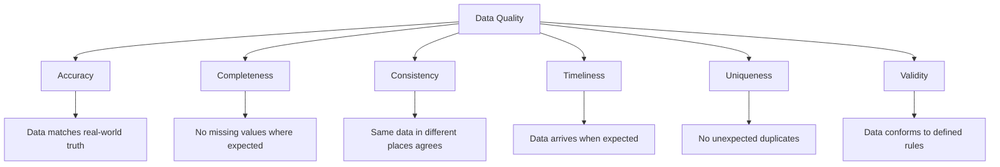
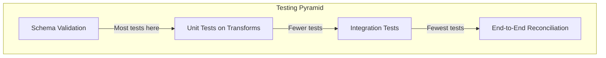

# Data Quality Checks

## Why Data Quality Checks Exist

Bad data is worse than no data. No data causes a visible failure — dashboards show errors, models refuse to train, reports are empty. Bad data causes silent failures — dashboards show wrong numbers, models train on garbage, executives make decisions based on fiction.

Studies consistently show that data quality issues cost organizations 15-25% of revenue. The cost of fixing bad data increases exponentially the further downstream it gets:

$$
\text{Cost}_{\text{fix}}(stage) = C_0 \times 10^{stage}
$$

Where stage 0 = source, stage 1 = pipeline, stage 2 = warehouse, stage 3 = report, stage 4 = business decision.

### Historical Context

- **2000s:** Manual data quality checks in ETL tools (Informatica Data Quality)
- **2010s:** SQL-based testing (custom scripts, stored procedures)
- **2018:** Great Expectations launched — declarative data quality testing
- **2019:** dbt tests — data quality integrated into transformation workflows
- **2022:** Data contracts emerge — producer-consumer quality agreements
- **2024-2025:** ML-powered anomaly detection for data quality becomes mainstream

## First Principles

### Dimensions of Data Quality



| Dimension | Definition | Example Check |
|-----------|-----------|---------------|
| Accuracy | Data reflects reality | Revenue matches financial system |
| Completeness | Required data is present | email is not null for active users |
| Consistency | Data agrees across systems | Order count in DW = count in source |
| Timeliness | Data arrives on schedule | Table updated within last 2 hours |
| Uniqueness | No unintended duplicates | order_id is unique in fact_orders |
| Validity | Data conforms to rules | age is between 0 and 150 |

### The Testing Pyramid for Data



## dbt Tests

### Built-In Tests

```sql
-- schema.yml in dbt
version: 2

models:
  - name: fact_orders
    columns:
      - name: order_id
        tests:
          - unique
          - not_null

      - name: customer_id
        tests:
          - not_null
          - relationships:
              to: ref('dim_customer')
              field: customer_id

      - name: order_amount
        tests:
          - not_null
          - dbt_utils.accepted_range:
              min_value: 0
              max_value: 1000000
              inclusive: true

      - name: status
        tests:
          - accepted_values:
              values: ['pending', 'shipped', 'delivered', 'cancelled', 'returned']
```

### Custom dbt Tests

```sql
-- tests/assert_total_revenue_positive.sql
-- Custom test: total daily revenue should be positive

SELECT
    order_date,
    SUM(order_amount) as daily_revenue
FROM {{ ref('fact_orders') }}
GROUP BY order_date
HAVING SUM(order_amount) <= 0
```

```sql
-- tests/assert_no_future_orders.sql
-- No orders should have a date in the future

SELECT *
FROM {{ ref('fact_orders') }}
WHERE order_date > CURRENT_DATE
```

```sql
-- tests/assert_row_count_within_range.sql
-- Row count should be within expected range

WITH counts AS (
    SELECT COUNT(*) as row_count
    FROM {{ ref('fact_orders') }}
    WHERE order_date = CURRENT_DATE - INTERVAL '1 day'
)
SELECT *
FROM counts
WHERE row_count < 1000     -- Minimum expected orders per day
   OR row_count > 1000000  -- Maximum expected orders per day
```

### dbt Test Severity Levels

```yaml
models:
  - name: fact_orders
    columns:
      - name: order_id
        tests:
          - unique:
              severity: error    # Fails the pipeline
          - not_null:
              severity: error    # Fails the pipeline

      - name: discount_code
        tests:
          - not_null:
              severity: warn     # Logs warning, doesn't fail
              warn_if: ">100"    # Warn if >100 nulls
              error_if: ">1000"  # Fail if >1000 nulls
```

## Great Expectations

### Core Concepts

```typescript
interface Expectation {
  expectationType: string;
  kwargs: Record<string, unknown>;
  meta?: Record<string, unknown>;
}

interface ExpectationSuite {
  expectationSuiteName: string;
  expectations: Expectation[];
  meta: {
    greatExpectationsVersion: string;
  };
}

interface ValidationResult {
  success: boolean;
  expectationConfig: Expectation;
  result: {
    observedValue: unknown;
    elementCount: number;
    missingCount: number;
    missingPercent: number;
    unexpectedCount: number;
    unexpectedPercent: number;
    partialUnexpectedList: unknown[];
  };
}

// Example expectation suite for an orders table
const ordersSuite: ExpectationSuite = {
  expectationSuiteName: 'orders_quality_suite',
  expectations: [
    // Table-level expectations
    {
      expectationType: 'expect_table_row_count_to_be_between',
      kwargs: { min_value: 10000, max_value: 10000000 },
    },
    {
      expectationType: 'expect_table_column_count_to_equal',
      kwargs: { value: 12 },
    },

    // Column-level expectations
    {
      expectationType: 'expect_column_values_to_not_be_null',
      kwargs: { column: 'order_id' },
    },
    {
      expectationType: 'expect_column_values_to_be_unique',
      kwargs: { column: 'order_id' },
    },
    {
      expectationType: 'expect_column_values_to_be_between',
      kwargs: { column: 'order_amount', min_value: 0, max_value: 1000000 },
    },
    {
      expectationType: 'expect_column_values_to_be_in_set',
      kwargs: {
        column: 'status',
        value_set: ['pending', 'shipped', 'delivered', 'cancelled'],
      },
    },
    {
      expectationType: 'expect_column_mean_to_be_between',
      kwargs: { column: 'order_amount', min_value: 10, max_value: 500 },
    },

    // Distribution expectations
    {
      expectationType: 'expect_column_stdev_to_be_between',
      kwargs: { column: 'order_amount', min_value: 5, max_value: 200 },
    },
  ],
  meta: {
    greatExpectationsVersion: '0.18.0',
  },
};
```

### Implementing Custom Expectations

```typescript
interface CustomExpectation {
  name: string;
  validate(data: DataBatch, params: Record<string, unknown>): ValidationResult;
}

class ExpectColumnCorrelation implements CustomExpectation {
  name = 'expect_column_pair_correlation_to_be_between';

  validate(
    data: DataBatch,
    params: { column_a: string; column_b: string; min_value: number; max_value: number },
  ): ValidationResult {
    const valuesA = data.getColumn(params.column_a) as number[];
    const valuesB = data.getColumn(params.column_b) as number[];

    const correlation = this.pearsonCorrelation(valuesA, valuesB);

    return {
      success: correlation >= params.min_value && correlation <= params.max_value,
      expectationConfig: {
        expectationType: this.name,
        kwargs: params,
      },
      result: {
        observedValue: correlation,
        elementCount: valuesA.length,
        missingCount: 0,
        missingPercent: 0,
        unexpectedCount: correlation < params.min_value || correlation > params.max_value ? 1 : 0,
        unexpectedPercent: 0,
        partialUnexpectedList: [],
      },
    };
  }

  private pearsonCorrelation(x: number[], y: number[]): number {
    const n = x.length;
    const sumX = x.reduce((a, b) => a + b, 0);
    const sumY = y.reduce((a, b) => a + b, 0);
    const sumXY = x.reduce((acc, xi, i) => acc + xi * y[i], 0);
    const sumX2 = x.reduce((acc, xi) => acc + xi * xi, 0);
    const sumY2 = y.reduce((acc, yi) => acc + yi * yi, 0);

    const numerator = n * sumXY - sumX * sumY;
    const denominator = Math.sqrt(
      (n * sumX2 - sumX * sumX) * (n * sumY2 - sumY * sumY),
    );

    return denominator === 0 ? 0 : numerator / denominator;
  }
}

interface DataBatch {
  getColumn(name: string): unknown[];
  rowCount(): number;
}
```

## Data Contracts

### Contract Definition

```typescript
interface DataContract {
  apiVersion: 'v1';
  kind: 'DataContract';
  metadata: {
    name: string;
    version: string;
    owner: string;
    team: string;
    description: string;
  };
  schema: SchemaDefinition;
  quality: QualityDefinition;
  sla: SLADefinition;
}

interface SchemaDefinition {
  type: 'avro' | 'protobuf' | 'json-schema' | 'sql-ddl';
  fields: Array<{
    name: string;
    type: string;
    description: string;
    required: boolean;
    pii: boolean;
    businessDefinition: string;
    examples: unknown[];
  }>;
}

interface QualityDefinition {
  completeness: Array<{
    field: string;
    threshold: number;  // 0.0 to 1.0
  }>;
  uniqueness: Array<{
    fields: string[];
  }>;
  freshness: {
    maxAgeMinutes: number;
    checkColumn: string;
  };
  customRules: Array<{
    name: string;
    sql: string;
    threshold: number;
  }>;
}

interface SLADefinition {
  availability: number;       // e.g., 0.999
  latency: {
    maxMinutes: number;
    p99Minutes: number;
  };
  support: {
    team: string;
    slackChannel: string;
    oncallRotation: string;
  };
}

// Example data contract
const ordersContract: DataContract = {
  apiVersion: 'v1',
  kind: 'DataContract',
  metadata: {
    name: 'orders',
    version: '2.1.0',
    owner: 'order-service-team',
    team: 'commerce',
    description: 'All customer orders from the commerce platform',
  },
  schema: {
    type: 'json-schema',
    fields: [
      {
        name: 'order_id',
        type: 'string',
        description: 'Unique order identifier (UUID v4)',
        required: true,
        pii: false,
        businessDefinition: 'System-generated unique ID for each order',
        examples: ['550e8400-e29b-41d4-a716-446655440000'],
      },
      {
        name: 'customer_email',
        type: 'string',
        description: 'Customer email address',
        required: true,
        pii: true,
        businessDefinition: 'Email used for order confirmation',
        examples: ['user@example.com'],
      },
    ],
  },
  quality: {
    completeness: [
      { field: 'order_id', threshold: 1.0 },
      { field: 'customer_email', threshold: 0.99 },
      { field: 'order_amount', threshold: 1.0 },
    ],
    uniqueness: [{ fields: ['order_id'] }],
    freshness: {
      maxAgeMinutes: 60,
      checkColumn: 'created_at',
    },
    customRules: [
      {
        name: 'positive_amount',
        sql: "SELECT COUNT(*) FROM orders WHERE order_amount <= 0",
        threshold: 0,
      },
      {
        name: 'valid_status',
        sql: "SELECT COUNT(*) FROM orders WHERE status NOT IN ('pending','shipped','delivered','cancelled')",
        threshold: 0,
      },
    ],
  },
  sla: {
    availability: 0.999,
    latency: { maxMinutes: 60, p99Minutes: 30 },
    support: {
      team: 'commerce-team',
      slackChannel: '#commerce-data',
      oncallRotation: 'commerce-oncall',
    },
  },
};
```

### Contract Validation Engine

```typescript
class DataContractValidator {
  async validate(
    contract: DataContract,
    db: Database,
    tableName: string,
  ): Promise<ContractValidationResult> {
    const results: CheckResult[] = [];

    // Schema checks
    for (const field of contract.schema.fields) {
      if (field.required) {
        const nullCount = await this.countNulls(db, tableName, field.name);
        results.push({
          check: `${field.name}_not_null`,
          passed: nullCount === 0,
          details: `${nullCount} null values found`,
        });
      }
    }

    // Completeness checks
    for (const rule of contract.quality.completeness) {
      const completeness = await this.measureCompleteness(
        db, tableName, rule.field,
      );
      results.push({
        check: `${rule.field}_completeness`,
        passed: completeness >= rule.threshold,
        details: `Completeness: ${(completeness * 100).toFixed(2)}% (threshold: ${(rule.threshold * 100).toFixed(2)}%)`,
      });
    }

    // Uniqueness checks
    for (const rule of contract.quality.uniqueness) {
      const duplicates = await this.countDuplicates(
        db, tableName, rule.fields,
      );
      results.push({
        check: `${rule.fields.join('_')}_unique`,
        passed: duplicates === 0,
        details: `${duplicates} duplicate combinations found`,
      });
    }

    // Freshness check
    const freshness = contract.quality.freshness;
    const maxAge = await this.measureFreshness(
      db, tableName, freshness.checkColumn,
    );
    results.push({
      check: 'freshness',
      passed: maxAge <= freshness.maxAgeMinutes,
      details: `Data age: ${maxAge} minutes (max: ${freshness.maxAgeMinutes})`,
    });

    // Custom rules
    for (const rule of contract.quality.customRules) {
      const count = await this.executeCustomRule(db, rule.sql);
      results.push({
        check: rule.name,
        passed: count <= rule.threshold,
        details: `Violations: ${count} (threshold: ${rule.threshold})`,
      });
    }

    return {
      contractName: contract.metadata.name,
      contractVersion: contract.metadata.version,
      timestamp: new Date(),
      allPassed: results.every((r) => r.passed),
      results,
    };
  }

  private async countNulls(
    db: Database, table: string, column: string,
  ): Promise<number> {
    const result = await db.query(
      `SELECT COUNT(*) as cnt FROM ${table} WHERE ${column} IS NULL`, [],
    );
    return (result as any).rows[0].cnt;
  }

  private async measureCompleteness(
    db: Database, table: string, column: string,
  ): Promise<number> {
    const result = await db.query(
      `SELECT
         COUNT(*) as total,
         COUNT(${column}) as non_null
       FROM ${table}`, [],
    );
    const row = (result as any).rows[0];
    return row.total > 0 ? row.non_null / row.total : 1;
  }

  private async countDuplicates(
    db: Database, table: string, columns: string[],
  ): Promise<number> {
    const cols = columns.join(', ');
    const result = await db.query(
      `SELECT COUNT(*) as cnt FROM (
         SELECT ${cols}, COUNT(*) as c FROM ${table}
         GROUP BY ${cols} HAVING COUNT(*) > 1
       ) dupes`, [],
    );
    return (result as any).rows[0].cnt;
  }

  private async measureFreshness(
    db: Database, table: string, column: string,
  ): Promise<number> {
    const result = await db.query(
      `SELECT EXTRACT(EPOCH FROM (NOW() - MAX(${column}))) / 60 as age_minutes
       FROM ${table}`, [],
    );
    return Math.round((result as any).rows[0].age_minutes);
  }

  private async executeCustomRule(db: Database, sql: string): Promise<number> {
    const result = await db.query(sql, []);
    return (result as any).rows[0]?.count ?? (result as any).rows.length;
  }
}

interface CheckResult {
  check: string;
  passed: boolean;
  details: string;
}

interface ContractValidationResult {
  contractName: string;
  contractVersion: string;
  timestamp: Date;
  allPassed: boolean;
  results: CheckResult[];
}

interface Database {
  query(sql: string, params: unknown[]): Promise<unknown>;
}
```

## Anomaly Detection

### Statistical Anomaly Detection

```typescript
class StatisticalAnomalyDetector {
  private history: Map<string, number[]> = new Map();

  recordMetric(metricName: string, value: number): void {
    const values = this.history.get(metricName) ?? [];
    values.push(value);
    // Keep last 90 days
    if (values.length > 90) values.shift();
    this.history.set(metricName, values);
  }

  detectAnomaly(
    metricName: string,
    currentValue: number,
    sensitivitySigma: number = 3,
  ): AnomalyResult {
    const history = this.history.get(metricName);
    if (!history || history.length < 7) {
      return { isAnomaly: false, reason: 'Insufficient history' };
    }

    const mean = history.reduce((a, b) => a + b, 0) / history.length;
    const variance =
      history.reduce((acc, v) => acc + Math.pow(v - mean, 2), 0) /
      history.length;
    const stddev = Math.sqrt(variance);

    const zScore = stddev > 0 ? (currentValue - mean) / stddev : 0;

    return {
      isAnomaly: Math.abs(zScore) > sensitivitySigma,
      reason: Math.abs(zScore) > sensitivitySigma
        ? `z-score ${zScore.toFixed(2)} exceeds ${sensitivitySigma} sigma threshold`
        : 'Within normal range',
      details: {
        currentValue,
        mean,
        stddev,
        zScore,
        lowerBound: mean - sensitivitySigma * stddev,
        upperBound: mean + sensitivitySigma * stddev,
      },
    };
  }
}

interface AnomalyResult {
  isAnomaly: boolean;
  reason: string;
  details?: {
    currentValue: number;
    mean: number;
    stddev: number;
    zScore: number;
    lowerBound: number;
    upperBound: number;
  };
}
```

### Row Count Monitoring

$$
\text{Expected row count}(t) = \mu + A \sin\left(\frac{2\pi t}{P}\right)
$$

Where $\mu$ is the mean, $A$ is the seasonal amplitude, and $P$ is the period (typically 7 days for weekly seasonality).

## Performance Characteristics

### Testing Overhead

| Test Type | Overhead | Frequency |
|-----------|----------|-----------|
| NOT NULL | O(n) scan | Every load |
| UNIQUE | O(n log n) sort | Every load |
| Row count | O(1) metadata | Every load |
| Referential integrity | O(n) join | Every load |
| Distribution checks | O(n) aggregate | Daily |
| Cross-system reconciliation | O(n) per system | Daily/Weekly |

### Cost-Benefit of Data Quality

$$
\text{ROI}_{\text{DQ}} = \frac{\text{Cost of bad data prevented}}{\text{Cost of quality checks}}
$$

Typical ratios: 10:1 to 100:1. The cost of a bad dashboard decision far exceeds the compute cost of running quality checks.

## Edge Cases & Failure Modes

### False Positives

Overly strict quality checks block valid data:

- Holiday traffic patterns trigger row count anomaly alerts
- Legitimate new product categories fail `accepted_values` tests
- Seasonal revenue fluctuations breach statistical bounds

**Mitigation:** Use dynamic thresholds based on historical patterns, not static rules.

### The Observer Effect

Quality checks that run heavy queries can impact the production database:

```typescript
class ThrottledQualityChecker {
  private readonly maxConcurrentChecks: number;
  private activeChecks: number = 0;

  constructor(maxConcurrent: number = 3) {
    this.maxConcurrentChecks = maxConcurrent;
  }

  async runCheck<T>(check: () => Promise<T>): Promise<T> {
    while (this.activeChecks >= this.maxConcurrentChecks) {
      await new Promise((r) => setTimeout(r, 1000));
    }
    this.activeChecks++;
    try {
      return await check();
    } finally {
      this.activeChecks--;
    }
  }
}
```

## Real-World War Stories

::: info War Story
**The Silent Schema Change**

A source team changed a column from `VARCHAR(100)` to `VARCHAR(50)` in their API response. No notification was sent to downstream consumers. The data pipeline silently truncated long values, causing 2,000 customer names to be cut off in the CRM.

The issue was discovered 2 weeks later when a customer complained that their name appeared as "Christopher Alexande" in all communications.

**Fix:** Added schema validation at ingestion: column types and lengths are checked against a contract. Any schema change triggers an alert before data is loaded.
:::

::: info War Story
**The Duplicate Order Disaster**

A payment service had an idempotency bug that caused 0.3% of orders to be duplicated. The data pipeline loaded these duplicates into the warehouse. Total revenue reported was $45M instead of $44.85M — a $150K discrepancy.

The error compounded: marketing budgets were set based on the inflated revenue, leading to overspending. The sales team received incorrect commissions. Month-end reconciliation caught it, but by then the damage was done.

**Fix:** Added a uniqueness check on `(order_id)` as a BLOCKING test — the pipeline fails if duplicates are detected. Added a daily reconciliation between the warehouse and the payment system's transaction log.
:::

## Decision Framework

### Quality Check Priority

| Check Type | Priority | When to Implement |
|-----------|----------|-------------------|
| NOT NULL on PKs | Critical | Day 1 |
| UNIQUE on PKs | Critical | Day 1 |
| Row count bounds | High | Week 1 |
| Referential integrity | High | Week 1 |
| Freshness | High | Week 1 |
| Value range checks | Medium | Month 1 |
| Distribution checks | Medium | Month 1 |
| Cross-system reconciliation | Medium | Quarter 1 |
| ML anomaly detection | Low | Year 1 |

## Advanced Topics

### Data Quality Scoring

Assign a composite quality score to each dataset:

$$
\text{Quality Score} = \sum_{i=1}^{n} w_i \times s_i
$$

Where $w_i$ is the weight and $s_i$ is the score (0 or 1) for each check.

### Data Observability

Beyond testing, continuous monitoring of data health:

```typescript
interface DataObservabilityMetrics {
  freshness: Date;
  volume: { rowCount: number; byteSize: number };
  schema: { columnCount: number; typeHash: string };
  distribution: Record<string, { mean: number; stddev: number; nullPct: number }>;
  lineage: { upstreamTables: string[]; downstreamTables: string[] };
}
```

## Cross-References

- [Pipeline Patterns Overview](./index.md) — Quality checks in pipeline context
- [Data Lineage](./data-lineage.md) — Tracing quality issues to their source
- [Testing Data Pipelines](./testing-data-pipelines.md) — Broader testing strategies
- [Schema Evolution](../data-modeling/schema-evolution.md) — Schema validation as quality check
- [Data Contracts](./data-quality-checks.md#data-contracts) — Formal quality agreements
