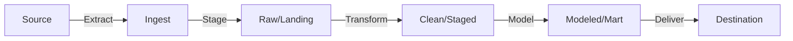
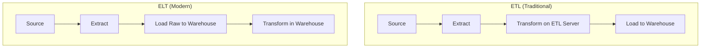
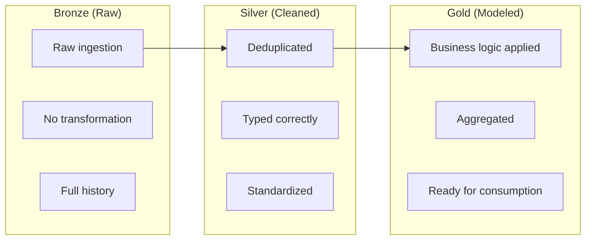
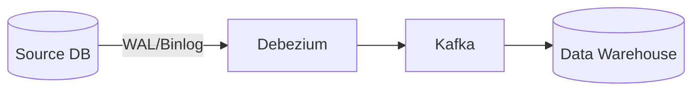
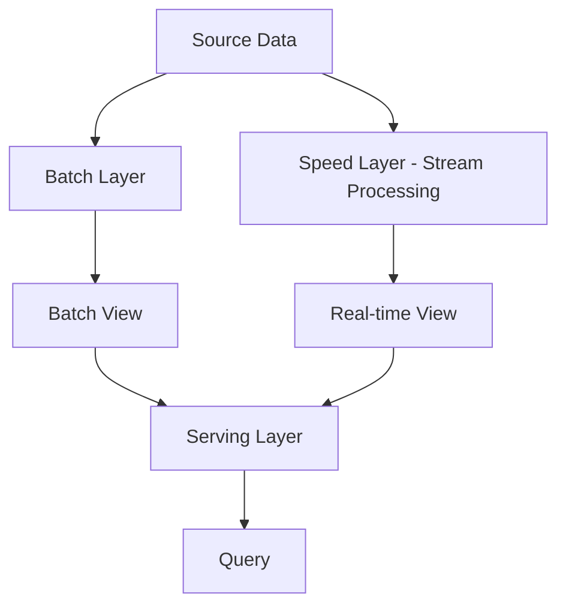
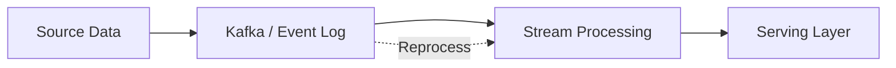
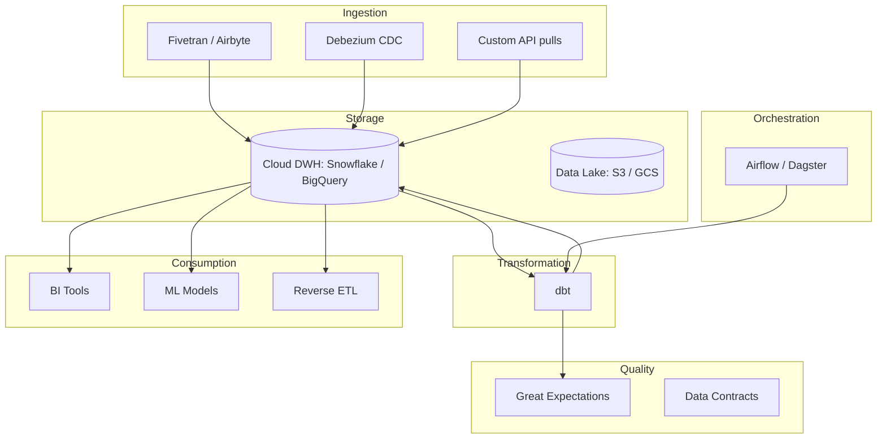
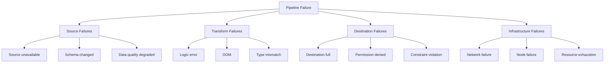
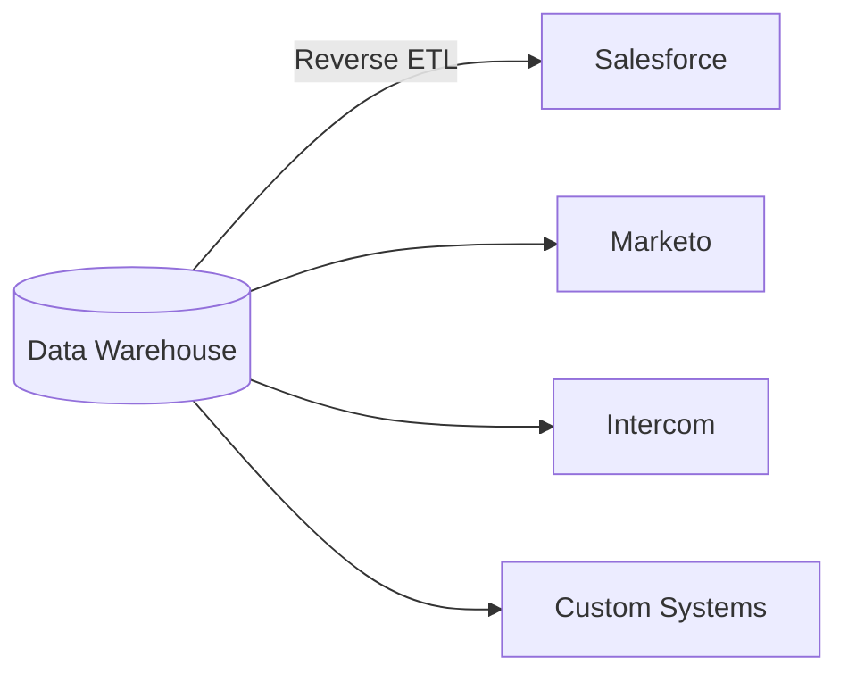

# Pipeline Patterns Overview

## Why Pipeline Patterns Exist

Data doesn't magically appear in the right place, in the right format, at the right time. Getting data from where it's generated (operational systems, APIs, events) to where it's consumed (warehouses, ML models, dashboards) requires a systematic approach — a **data pipeline**.

Data pipelines are the plumbing of the modern data stack. They're invisible when they work and catastrophic when they don't. Pipeline patterns are the accumulated wisdom of decades of building, operating, and debugging these systems.

### Historical Context

- **1970s-1990s:** ETL (Extract, Transform, Load) — data is transformed before loading into the warehouse
- **2000s:** ELT (Extract, Load, Transform) — data is loaded raw and transformed in the warehouse
- **2010s:** Lambda Architecture (batch + stream), Kappa Architecture (stream only)
- **2015s:** ELT becomes dominant with cloud warehouses (Snowflake, BigQuery)
- **2020s:** Data Mesh (decentralized), Data Contracts, dbt-driven transformations, Reverse ETL
- **2025s:** Real-time data products, event-driven architectures, AI-powered pipeline observability

## First Principles

### The Pipeline Abstraction

Every data pipeline, regardless of complexity, consists of:

$$
\text{Pipeline} = \text{Source} \rightarrow \text{Transform}_1 \rightarrow \text{Transform}_2 \rightarrow \ldots \rightarrow \text{Sink}
$$



### ETL vs. ELT



| Aspect | ETL | ELT |
|--------|-----|-----|
| Transform location | ETL server (Informatica, DataStage) | In the warehouse (dbt, SQL) |
| Scalability | Limited by ETL server | Warehouse compute |
| Raw data retention | Often lost after transform | Always available |
| Schema flexibility | Fixed at design time | Schema-on-read possible |
| Cost | ETL license + compute | Warehouse compute |
| Dominant era | 2000-2015 | 2015-present |

### The Medallion Architecture

The most common modern pipeline layering:



```typescript
interface MedallionLayer {
  name: 'bronze' | 'silver' | 'gold';
  purpose: string;
  dataQuality: string;
  consumers: string[];
  refreshPattern: string;
}

const layers: MedallionLayer[] = [
  {
    name: 'bronze',
    purpose: 'Raw ingestion — exact copy of source',
    dataQuality: 'Source fidelity only',
    consumers: ['Data engineers', 'Debug/audit'],
    refreshPattern: 'Append-only, event-driven or scheduled',
  },
  {
    name: 'silver',
    purpose: 'Cleaned, deduplicated, typed, standardized',
    dataQuality: 'Schema enforcement, null handling, dedup',
    consumers: ['Data engineers', 'Advanced analysts'],
    refreshPattern: 'Incremental merge on primary key',
  },
  {
    name: 'gold',
    purpose: 'Business-level aggregations and models',
    dataQuality: 'Business rules validated, tested',
    consumers: ['Analysts', 'Dashboards', 'ML models', 'APIs'],
    refreshPattern: 'Full rebuild or incremental depending on logic',
  },
];
```

## Core Pipeline Patterns

### Pattern 1: Change Data Capture (CDC)

Capture only the changes from source systems instead of full extracts.



See [CDC Patterns](./cdc-patterns.md) for comprehensive coverage.

### Pattern 2: Idempotent Pipelines

A pipeline that produces the same result regardless of how many times it runs:

$$
f(f(x)) = f(x)
$$

```typescript
interface IdempotentPipelineStep<T> {
  /**
   * Process input and produce output.
   * Running this multiple times with the same input produces the same output.
   */
  execute(input: T): Promise<T>;

  /**
   * Unique identifier for this execution.
   * Used for deduplication and retry safety.
   */
  executionId(input: T): string;
}

class IdempotentUpsert implements IdempotentPipelineStep<DataBatch> {
  constructor(private readonly db: Database) {}

  async execute(input: DataBatch): Promise<DataBatch> {
    for (const record of input.records) {
      await this.db.query(
        `INSERT INTO target_table (id, data, updated_at)
         VALUES ($1, $2, $3)
         ON CONFLICT (id) DO UPDATE
         SET data = EXCLUDED.data,
             updated_at = EXCLUDED.updated_at
         WHERE target_table.updated_at < EXCLUDED.updated_at`,
        [record.id, record.data, record.updatedAt],
      );
    }
    return input;
  }

  executionId(input: DataBatch): string {
    return `upsert-${input.batchId}`;
  }
}

interface DataBatch {
  batchId: string;
  records: Array<{ id: string; data: unknown; updatedAt: Date }>;
}

interface Database {
  query(sql: string, params: unknown[]): Promise<unknown>;
}
```

### Pattern 3: Incremental Processing

Process only new or changed data, not the entire dataset:

```typescript
interface IncrementalProcessor {
  /**
   * Get the high-water mark from the last successful run.
   */
  getHighWaterMark(): Promise<Date | number | string>;

  /**
   * Process records after the high-water mark.
   */
  processIncremental(
    afterMark: Date | number | string,
  ): Promise<{ recordsProcessed: number; newHighWaterMark: Date | number | string }>;

  /**
   * Update the high-water mark after successful processing.
   */
  updateHighWaterMark(mark: Date | number | string): Promise<void>;
}

class TimestampBasedIncremental implements IncrementalProcessor {
  constructor(
    private readonly sourceDb: Database,
    private readonly targetDb: Database,
    private readonly stateDb: Database,
    private readonly pipelineId: string,
  ) {}

  async getHighWaterMark(): Promise<Date> {
    const result = await this.stateDb.query(
      'SELECT high_water_mark FROM pipeline_state WHERE pipeline_id = $1',
      [this.pipelineId],
    );
    return (result as any).rows[0]?.high_water_mark ?? new Date('1970-01-01');
  }

  async processIncremental(
    afterMark: Date | number | string,
  ): Promise<{ recordsProcessed: number; newHighWaterMark: Date }> {
    // Extract new records
    const records = await this.sourceDb.query(
      'SELECT * FROM source_table WHERE updated_at > $1 ORDER BY updated_at',
      [afterMark],
    );

    if ((records as any).rows.length === 0) {
      return { recordsProcessed: 0, newHighWaterMark: afterMark as Date };
    }

    // Load into target
    for (const record of (records as any).rows) {
      await this.targetDb.query(
        `INSERT INTO target_table (id, data, updated_at)
         VALUES ($1, $2, $3)
         ON CONFLICT (id) DO UPDATE SET data = EXCLUDED.data, updated_at = EXCLUDED.updated_at`,
        [record.id, record.data, record.updated_at],
      );
    }

    const lastRow = (records as any).rows[(records as any).rows.length - 1];
    return {
      recordsProcessed: (records as any).rows.length,
      newHighWaterMark: lastRow.updated_at,
    };
  }

  async updateHighWaterMark(mark: Date | number | string): Promise<void> {
    await this.stateDb.query(
      `INSERT INTO pipeline_state (pipeline_id, high_water_mark, updated_at)
       VALUES ($1, $2, NOW())
       ON CONFLICT (pipeline_id)
       DO UPDATE SET high_water_mark = EXCLUDED.high_water_mark, updated_at = NOW()`,
      [this.pipelineId, mark],
    );
  }
}
```

### Pattern 4: Full Refresh vs. Incremental

| Aspect | Full Refresh | Incremental |
|--------|-------------|-------------|
| Correctness | Guaranteed (rebuild from scratch) | Depends on change tracking |
| Performance | Slow for large datasets | Fast (only delta) |
| Complexity | Simple | Complex (state, watermarks) |
| Recovery | Trivial (just re-run) | Must handle edge cases |
| Data volume | Entire dataset every run | Only changes |
| Source impact | High (full scan) | Low (indexed reads) |

**When to use full refresh:**
- Small tables (< 10M rows)
- Source doesn't support change tracking
- Complex transformations where incremental is error-prone
- Periodic reconciliation alongside incremental

### Pattern 5: Dead Letter Queue

Route failed records to a separate queue for investigation instead of failing the entire pipeline:

```typescript
interface DeadLetterQueue<T> {
  send(
    failedRecord: T,
    error: Error,
    metadata: {
      pipelineId: string;
      step: string;
      attemptNumber: number;
      timestamp: Date;
    },
  ): Promise<void>;

  getFailedRecords(
    pipelineId: string,
    limit: number,
  ): Promise<Array<{
    record: T;
    error: string;
    metadata: Record<string, unknown>;
  }>>;

  retry(recordId: string): Promise<void>;
}

class PipelineWithDLQ<T> {
  constructor(
    private readonly processor: (record: T) => Promise<void>,
    private readonly dlq: DeadLetterQueue<T>,
    private readonly pipelineId: string,
    private readonly maxRetries: number = 3,
  ) {}

  async processRecord(record: T): Promise<void> {
    for (let attempt = 1; attempt <= this.maxRetries; attempt++) {
      try {
        await this.processor(record);
        return; // Success
      } catch (error) {
        if (attempt === this.maxRetries) {
          // Max retries exceeded — send to DLQ
          await this.dlq.send(record, error as Error, {
            pipelineId: this.pipelineId,
            step: 'process',
            attemptNumber: attempt,
            timestamp: new Date(),
          });
          return; // Don't fail the pipeline
        }
        // Exponential backoff
        await new Promise((r) =>
          setTimeout(r, Math.pow(2, attempt) * 1000),
        );
      }
    }
  }
}
```

## Pipeline Architecture Patterns

### Lambda Architecture



**Problem:** Two codebases (batch + stream) computing the same logic.

### Kappa Architecture



**Advantage:** Single codebase. Reprocessing = replay from the event log.

### Modern Data Stack



## Performance Characteristics

### Pipeline Throughput Factors

$$
\text{Throughput} = \min(\text{Source rate}, \text{Transform rate}, \text{Sink rate})
$$

The pipeline is as fast as its slowest component.

### Batch Size Optimization

$$
\text{Optimal batch size} = \sqrt{\frac{2 \times \text{fixed\_overhead} \times \text{target\_throughput}}{\text{per\_record\_cost}}}
$$

Too small: overhead dominates. Too large: latency suffers.

| Batch Size | Throughput | Latency | Memory |
|-----------|-----------|---------|--------|
| 1 (record-by-record) | Low | Lowest | Lowest |
| 100-1000 | Medium | Medium | Medium |
| 10,000-100,000 | High | Higher | Higher |
| 1,000,000+ | Highest | Highest | Risk of OOM |

### Pipeline Latency Breakdown

$$
\text{Latency}_{e2e} = T_{\text{extract}} + T_{\text{transfer}} + T_{\text{transform}} + T_{\text{load}} + T_{\text{scheduling}}
$$

For scheduled batch pipelines, scheduling overhead often dominates:

| Component | Typical Range | Optimization |
|-----------|--------------|-------------|
| Scheduling | 0-60 min (cron) | Event-driven triggers |
| Extract | 1-30 min | Incremental, parallel |
| Transfer | 1-10 min | Compression, streaming |
| Transform | 1-60 min | Incremental, caching |
| Load | 1-10 min | Bulk load, staging |

## Edge Cases & Failure Modes

### Pipeline Failure Categories



### Partial Failure Handling

When a batch pipeline fails halfway through:

```typescript
interface CheckpointedPipeline {
  /**
   * Save progress so we can resume from where we left off.
   */
  saveCheckpoint(state: PipelineCheckpoint): Promise<void>;
  loadCheckpoint(): Promise<PipelineCheckpoint | null>;

  /**
   * Process a batch with checkpoint-based resumability.
   */
  processWithResume(
    batches: AsyncIterable<DataBatch>,
  ): Promise<PipelineResult>;
}

interface PipelineCheckpoint {
  pipelineRunId: string;
  lastProcessedBatchId: string;
  lastProcessedOffset: number;
  timestamp: Date;
  metadata: Record<string, unknown>;
}

interface PipelineResult {
  totalBatches: number;
  successfulBatches: number;
  failedBatches: number;
  skippedBatches: number; // Already processed (from checkpoint)
}
```

## Mathematical Foundations

### Pipeline Reliability

For a pipeline with $n$ independent stages, each with reliability $r_i$:

$$
R_{\text{pipeline}} = \prod_{i=1}^{n} r_i
$$

A 5-stage pipeline with each stage at 99% reliability:

$$
R = 0.99^5 = 0.951 \approx 95.1\%
$$

To achieve 99.9% pipeline reliability with 5 stages, each stage needs:

$$
r = 0.999^{1/5} = 0.9998 = 99.98\%
$$

### Throughput with Parallelism

For embarrassingly parallel pipelines:

$$
\text{Throughput}(P) = \text{Throughput}(1) \times P \times \eta(P)
$$

Where $P$ is parallelism and $\eta(P)$ is the efficiency factor (accounts for coordination overhead):

$$
\eta(P) \approx \frac{1}{1 + \alpha \times (P - 1)}
$$

Where $\alpha$ is the serialization fraction (Amdahl's Law applied to pipelines).

## Real-World War Stories

::: info War Story
**The Midnight Pipeline Pileup**

A company scheduled 200 dbt models to run at midnight. Each model ran as an independent Airflow task, all starting simultaneously. The Snowflake warehouse hit its concurrency limit, queries queued, timeouts cascaded, and 80% of models failed.

**Fix:**
1. Implemented a dependency graph in dbt (models depend on upstream models)
2. Used Airflow's pool feature to limit concurrent Snowflake queries to 20
3. Staggered non-dependent models across a 2-hour window
4. Pipeline completion time actually decreased from 4 hours to 2 hours (less contention)
:::

::: info War Story
**The Incremental Pipeline That Lost Data**

A team built an incremental pipeline using `updated_at > last_run_timestamp`. One day, the source system performed a bulk update that set `updated_at` to the same timestamp for 500K records. Their high-water mark logic used `>` (strictly greater than), not `>=`, causing the 500K records to be skipped.

The data gap was discovered 3 weeks later when a business user noticed missing records in a report.

**Fix:**
1. Changed to `>=` comparison
2. Made the pipeline idempotent (UPSERT) so re-processing is safe
3. Added a daily reconciliation that compares source and target row counts
4. Added data quality alerts for unusual changes in row counts
:::

## Decision Framework

### Pipeline Architecture Selection

| Factor | Batch | Micro-Batch | Streaming |
|--------|-------|------------|-----------|
| Latency requirement | Hours | Minutes | Seconds |
| Data volume | Any | Any | High continuous |
| Complexity | Low | Medium | High |
| Cost | Lowest | Medium | Highest |
| Operational overhead | Low | Medium | High |
| Debugging ease | Easiest | Medium | Hardest |

## Advanced Topics

### Data Mesh Pipeline Patterns

In a data mesh, pipelines are owned by domain teams:

```typescript
interface DataProduct {
  name: string;
  domain: string;
  owner: string;
  inputPorts: DataPort[];
  outputPorts: DataPort[];
  sla: {
    freshness: string;
    availability: number;
    quality: number;
  };
  pipeline: PipelineDefinition;
}

interface DataPort {
  name: string;
  type: 'kafka-topic' | 'table' | 'api' | 'file';
  schema: unknown;
  accessControl: string[];
}

interface PipelineDefinition {
  type: 'batch' | 'streaming' | 'hybrid';
  schedule?: string;
  steps: PipelineStep[];
}

interface PipelineStep {
  name: string;
  type: 'extract' | 'transform' | 'load' | 'quality-check';
  config: Record<string, unknown>;
}
```

### Reverse ETL

Moving data from the warehouse back to operational systems:



This closes the loop: operational data flows to the warehouse for analysis, and enriched data flows back to operational systems.

### Pipeline as Code

Modern pipelines are defined as code, version-controlled, and tested:

```typescript
// Pipeline definition as TypeScript (Dagster-style)
interface PipelineAsCode {
  name: string;
  version: string;
  assets: AssetDefinition[];
  schedules: ScheduleDefinition[];
  sensors: SensorDefinition[];
}

interface AssetDefinition {
  name: string;
  dependencies: string[];
  compute: (context: ComputeContext) => Promise<void>;
  freshness: {
    maximumLagMinutes: number;
    cronSchedule: string;
  };
  metadata: Record<string, unknown>;
}

interface ScheduleDefinition {
  name: string;
  cron: string;
  targetAssets: string[];
}

interface SensorDefinition {
  name: string;
  trigger: 'file-arrival' | 'kafka-message' | 'api-poll';
  config: Record<string, unknown>;
  targetAssets: string[];
}

interface ComputeContext {
  log: (message: string) => void;
  getConfig(key: string): unknown;
  getUpstreamData(assetName: string): Promise<unknown>;
}
```

## Cross-References

- [CDC Patterns](./cdc-patterns.md) — Change Data Capture implementation
- [Data Quality Checks](./data-quality-checks.md) — Quality validation in pipelines
- [Data Lineage](./data-lineage.md) — Tracking data flow through pipelines
- [Orchestration](./orchestration.md) — Pipeline scheduling and coordination
- [Testing Data Pipelines](./testing-data-pipelines.md) — Ensuring pipeline correctness
- [Schema Evolution](../data-modeling/schema-evolution.md) — Handling schema changes in pipelines
