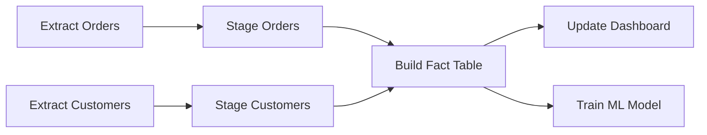
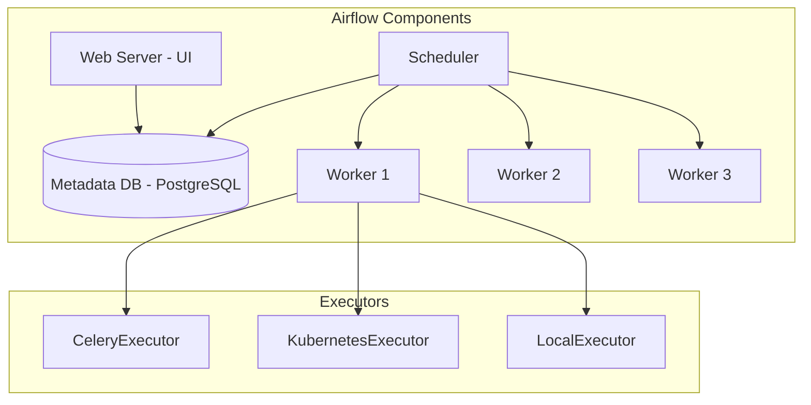
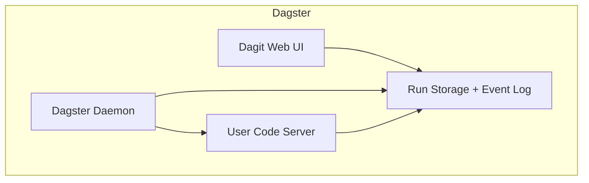
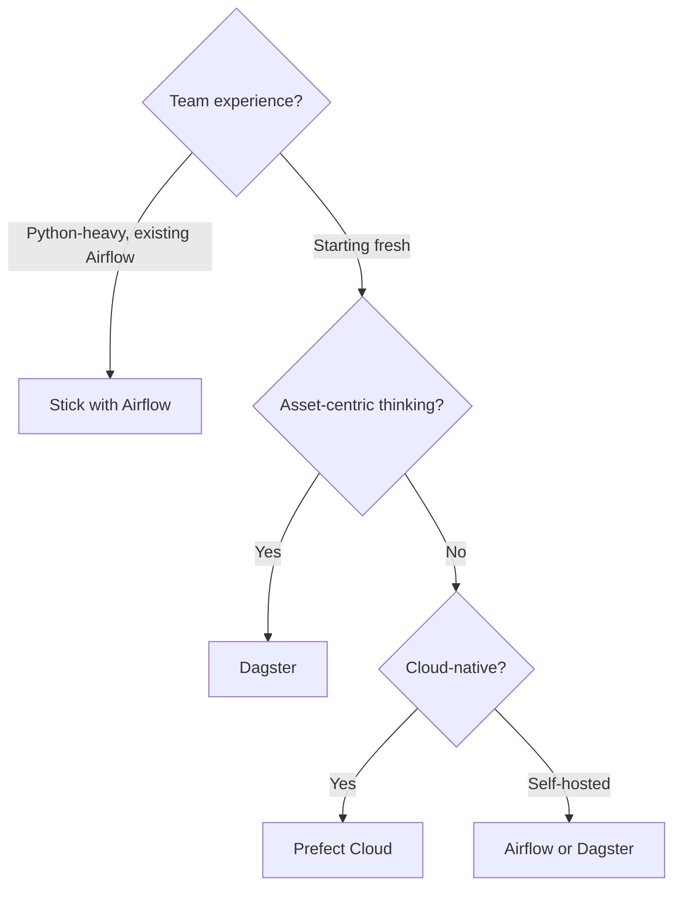

# Pipeline Orchestration

## Why Orchestration Exists

Data pipelines don't run in isolation. They have dependencies, schedules, and failure modes. Consider:

- Model A depends on staging tables B and C
- Table C depends on an external API that is only available 6 AM-10 PM
- If B fails, A must not run (it would produce wrong results)
- If A fails, it needs to be retried, but only B needs to be re-run first
- The whole thing runs daily, but sometimes needs a manual backfill for the last 30 days

An orchestrator manages this complexity: it schedules tasks, resolves dependencies, handles failures, enables retries, and provides visibility into pipeline health.

### Historical Context

- **2000s:** Cron + custom scripts — fragile, no dependency management
- **2014:** Luigi (Spotify) — first popular open-source orchestrator
- **2015:** Apache Airflow (Airbnb) — became the dominant standard
- **2018:** Prefect — "Airflow reimagined" with dynamic DAGs
- **2019:** Dagster — software-defined assets, type system
- **2022:** Dagster adopts asset-based paradigm; Airflow 2.x improves significantly
- **2025:** Asset-based orchestration (Dagster) gaining ground; Airflow remains dominant by install base

## First Principles

### The DAG Model

An orchestration DAG (Directed Acyclic Graph) represents task dependencies:



**Properties:**
- **Directed:** Task A runs before Task B (clear ordering)
- **Acyclic:** No circular dependencies (prevents infinite loops)
- **Graph:** Multiple paths, fan-in, fan-out

### Task vs. Asset-Based Orchestration

The industry is shifting from **task-based** (Airflow) to **asset-based** (Dagster) thinking:

| Aspect | Task-Based (Airflow) | Asset-Based (Dagster) |
|--------|---------------------|---------------------|
| Core concept | "Run this code at this time" | "Ensure this dataset is up-to-date" |
| Dependency | Task A -> Task B | Asset A depends on Asset B |
| Scheduling | Cron-based | Freshness-based |
| Backfill | Manual, error-prone | Built-in, partition-aware |
| Testing | Difficult | First-class support |
| Observability | Task status | Asset materialization history |

## Airflow

### Architecture



### DAG Definition

```typescript
// Airflow DAG definition (Python-style, represented in TypeScript for consistency)
interface AirflowDAG {
  dagId: string;
  schedule: string;          // Cron expression
  startDate: Date;
  catchup: boolean;          // Run missed intervals?
  maxActiveRuns: number;
  defaultArgs: {
    owner: string;
    retries: number;
    retryDelay: number;      // seconds
    executionTimeout: number; // seconds
    emailOnFailure: boolean;
    email: string[];
  };
  tags: string[];
}

interface AirflowTask {
  taskId: string;
  operator: string; // PythonOperator, BashOperator, etc.
  dependencies: string[]; // upstream task IDs
  pool: string;
  priority: number;
  params: Record<string, unknown>;
}

// Example DAG structure
const dailyETL: AirflowDAG = {
  dagId: 'daily_etl_pipeline',
  schedule: '0 6 * * *', // 6 AM UTC daily
  startDate: new Date('2026-01-01'),
  catchup: false,
  maxActiveRuns: 1,
  defaultArgs: {
    owner: 'data-team',
    retries: 2,
    retryDelay: 300,
    executionTimeout: 3600,
    emailOnFailure: true,
    email: ['data-alerts@company.com'],
  },
  tags: ['etl', 'production', 'daily'],
};

const tasks: AirflowTask[] = [
  {
    taskId: 'extract_orders',
    operator: 'PythonOperator',
    dependencies: [],
    pool: 'default_pool',
    priority: 1,
    params: { source: 'production_db', table: 'orders' },
  },
  {
    taskId: 'extract_customers',
    operator: 'PythonOperator',
    dependencies: [],
    pool: 'default_pool',
    priority: 1,
    params: { source: 'crm_api', endpoint: '/customers' },
  },
  {
    taskId: 'transform_orders',
    operator: 'DbtOperator',
    dependencies: ['extract_orders', 'extract_customers'],
    pool: 'dbt_pool',
    priority: 2,
    params: { model: 'stg_orders' },
  },
  {
    taskId: 'build_mart',
    operator: 'DbtOperator',
    dependencies: ['transform_orders'],
    pool: 'dbt_pool',
    priority: 3,
    params: { model: 'mart_order_summary' },
  },
  {
    taskId: 'quality_checks',
    operator: 'GreatExpectationsOperator',
    dependencies: ['build_mart'],
    pool: 'default_pool',
    priority: 4,
    params: { suite: 'mart_order_summary_suite' },
  },
];
```

### Airflow Executor Comparison

| Executor | Concurrency | Isolation | Setup | Use Case |
|----------|------------|-----------|-------|----------|
| LocalExecutor | Low (single machine) | None | Simple | Dev, small teams |
| CeleryExecutor | High (distributed) | Process-level | Medium | Production, fixed infra |
| KubernetesExecutor | High (elastic) | Container-level | Complex | Production, cloud |
| CeleryKubernetesExecutor | Highest | Both | Complex | Large-scale production |

## Dagster

### Asset-Based Paradigm

```typescript
// Dagster-style asset definition
interface SoftwareDefinedAsset {
  name: string;
  description: string;
  dependencies: string[];
  partitionDefinition?: PartitionDefinition;
  freshnessPolicy?: FreshnessPolicy;
  autoMaterializePolicy?: AutoMaterializePolicy;
  compute: (context: AssetContext) => Promise<MaterializationResult>;
  metadata: Record<string, unknown>;
}

interface PartitionDefinition {
  type: 'daily' | 'weekly' | 'monthly' | 'static';
  startDate?: Date;
  endDate?: Date;
  staticPartitions?: string[];
}

interface FreshnessPolicy {
  maximumLagMinutes: number;
  cronSchedule?: string; // When freshness is evaluated
}

interface AutoMaterializePolicy {
  // Automatically materialize when dependencies are updated
  eager: boolean;
  // Or materialize on a schedule
  cronSchedule?: string;
}

interface AssetContext {
  log: (message: string) => void;
  partition: string | null;
  getUpstreamAsset(name: string): Promise<unknown>;
  reportAssetMaterialization(metadata: Record<string, unknown>): void;
}

interface MaterializationResult {
  metadata: Record<string, unknown>;
}

// Example: Dagster-style asset definitions
const stagingOrders: SoftwareDefinedAsset = {
  name: 'stg_orders',
  description: 'Cleaned and deduplicated orders from production database',
  dependencies: ['raw_orders'],
  partitionDefinition: {
    type: 'daily',
    startDate: new Date('2026-01-01'),
  },
  freshnessPolicy: {
    maximumLagMinutes: 120, // Must be updated within 2 hours
    cronSchedule: '0 8 * * *', // Evaluate at 8 AM
  },
  autoMaterializePolicy: {
    eager: true, // Auto-run when raw_orders is updated
  },
  compute: async (context) => {
    context.log(`Processing partition: ${context.partition}`);
    // Transform logic here
    return {
      metadata: {
        rowCount: 150000,
        qualityScore: 0.99,
      },
    };
  },
  metadata: {
    owner: 'data-engineering',
    tier: 'silver',
  },
};

const factOrderSummary: SoftwareDefinedAsset = {
  name: 'fact_order_summary',
  description: 'Aggregated order metrics by customer and date',
  dependencies: ['stg_orders', 'stg_customers'],
  partitionDefinition: { type: 'daily', startDate: new Date('2026-01-01') },
  freshnessPolicy: { maximumLagMinutes: 180 },
  autoMaterializePolicy: { eager: true },
  compute: async (context) => {
    const orders = await context.getUpstreamAsset('stg_orders');
    const customers = await context.getUpstreamAsset('stg_customers');
    // Build fact table
    return { metadata: { rowCount: 50000 } };
  },
  metadata: { owner: 'analytics', tier: 'gold' },
};
```

### Dagster vs. Airflow Architecture



Key differences:
- **Code isolation:** User code runs in a separate process/container
- **Asset catalog:** Built-in asset registry with metadata
- **Type system:** Resources and IO managers enforce contracts
- **Partition-native:** Partitions are first-class, not an afterthought

## Prefect

### Flow-Based Design

```typescript
// Prefect-style flow definition
interface PrefectFlow {
  name: string;
  description: string;
  retries: number;
  retryDelaySeconds: number;
  timeout: number;
  tags: string[];
  tasks: PrefectTask[];
}

interface PrefectTask {
  name: string;
  fn: (...args: unknown[]) => Promise<unknown>;
  retries: number;
  cacheKeyFn?: (...args: unknown[]) => string;
  cacheExpiration: number; // seconds
  tags: string[];
}

// Prefect distinguishes itself with:
// 1. Dynamic DAGs (tasks can be created at runtime)
// 2. Hybrid execution (cloud orchestration + local execution)
// 3. First-class caching and result persistence
```

## Orchestrator Comparison

### Feature Matrix

| Feature | Airflow | Dagster | Prefect |
|---------|---------|---------|---------|
| DAG definition | Python | Python/YAML | Python |
| Scheduling | Cron | Freshness + cron | Cron + events |
| Partitions | Plugin (Airflow 2.3+) | First-class | Limited |
| Asset tracking | No (tasks only) | First-class | Limited |
| Dynamic DAGs | Limited | Yes | Yes |
| Testing | Difficult | First-class | Good |
| UI quality | Good | Excellent | Excellent |
| Community size | Largest | Growing | Growing |
| Cloud offering | MWAA, Cloud Composer | Dagster Cloud | Prefect Cloud |
| Learning curve | Medium | Medium-High | Low |
| Maturity | Very mature | Mature | Mature |
| Backfill | Manual | Built-in | Manual |

### Performance Characteristics

| Metric | Airflow | Dagster | Prefect |
|--------|---------|---------|---------|
| Scheduler loop time | 5-30s | 1-5s | 1-10s |
| Max concurrent tasks | 1000+ (CeleryExecutor) | 500+ | 500+ |
| DAG parsing time (1000 DAGs) | 30-60s | 10-20s | N/A |
| Cold start time | 5-15s | 2-5s | 1-3s |

## Production Patterns

### Retry and Alerting Strategy

```typescript
interface RetryStrategy {
  maxRetries: number;
  retryDelay: number;           // seconds
  exponentialBackoff: boolean;
  maxRetryDelay: number;        // seconds
  retryableExceptions: string[];
  alertOnRetry: boolean;
  alertOnFinalFailure: boolean;
}

const productionRetryStrategy: RetryStrategy = {
  maxRetries: 3,
  retryDelay: 300,              // 5 minutes
  exponentialBackoff: true,     // 5min, 10min, 20min
  maxRetryDelay: 1800,          // 30 minutes max
  retryableExceptions: [
    'ConnectionError',
    'TimeoutError',
    'ResourceExhaustedError',
  ],
  alertOnRetry: false,          // Don't alert on first retry
  alertOnFinalFailure: true,    // Alert on final failure
};
```

### Backfill Patterns

```typescript
interface BackfillConfig {
  startDate: Date;
  endDate: Date;
  parallelism: number;         // How many partitions to process concurrently
  strategy: 'oldest-first' | 'newest-first' | 'random';
  skipExisting: boolean;       // Skip partitions that already have data
  dryRun: boolean;
}

class BackfillManager {
  async executeBackfill(
    config: BackfillConfig,
    processPartition: (date: Date) => Promise<void>,
  ): Promise<BackfillResult> {
    const partitions = this.generatePartitions(config);
    let completed = 0;
    let failed = 0;
    let skipped = 0;

    // Process in batches of config.parallelism
    for (let i = 0; i < partitions.length; i += config.parallelism) {
      const batch = partitions.slice(i, i + config.parallelism);

      const results = await Promise.allSettled(
        batch.map(async (partition) => {
          if (config.skipExisting && (await this.partitionExists(partition))) {
            skipped++;
            return;
          }
          if (!config.dryRun) {
            await processPartition(partition);
          }
          completed++;
        }),
      );

      failed += results.filter((r) => r.status === 'rejected').length;
    }

    return { total: partitions.length, completed, failed, skipped };
  }

  private generatePartitions(config: BackfillConfig): Date[] {
    const partitions: Date[] = [];
    const current = new Date(config.startDate);

    while (current <= config.endDate) {
      partitions.push(new Date(current));
      current.setDate(current.getDate() + 1);
    }

    if (config.strategy === 'newest-first') {
      partitions.reverse();
    } else if (config.strategy === 'random') {
      this.shuffle(partitions);
    }

    return partitions;
  }

  private shuffle<T>(array: T[]): void {
    for (let i = array.length - 1; i > 0; i--) {
      const j = Math.floor(Math.random() * (i + 1));
      [array[i], array[j]] = [array[j], array[i]];
    }
  }

  private async partitionExists(_date: Date): Promise<boolean> {
    return false; // Check target system
  }
}

interface BackfillResult {
  total: number;
  completed: number;
  failed: number;
  skipped: number;
}
```

### SLA Monitoring

```typescript
interface SLADefinition {
  dagId: string;
  expectedCompletionTime: string; // "08:00 UTC"
  criticalPath: string[];          // Tasks on the critical path
  alertChannels: string[];
}

class SLAMonitor {
  private slas: SLADefinition[] = [];

  registerSLA(sla: SLADefinition): void {
    this.slas.push(sla);
  }

  async checkSLAs(): Promise<SLAViolation[]> {
    const violations: SLAViolation[] = [];
    const now = new Date();

    for (const sla of this.slas) {
      const expectedTime = this.parseTime(sla.expectedCompletionTime);

      if (now > expectedTime) {
        const dagStatus = await this.getDagStatus(sla.dagId);
        if (dagStatus !== 'success') {
          violations.push({
            dagId: sla.dagId,
            expectedBy: expectedTime,
            currentStatus: dagStatus,
            minutesLate: Math.round(
              (now.getTime() - expectedTime.getTime()) / 60000,
            ),
            criticalPath: sla.criticalPath,
          });
        }
      }
    }

    return violations;
  }

  private parseTime(time: string): Date {
    const [hours, minutes] = time.split(':').map(Number);
    const today = new Date();
    today.setUTCHours(hours, minutes, 0, 0);
    return today;
  }

  private async getDagStatus(_dagId: string): Promise<string> {
    return 'running'; // Check orchestrator API
  }
}

interface SLAViolation {
  dagId: string;
  expectedBy: Date;
  currentStatus: string;
  minutesLate: number;
  criticalPath: string[];
}
```

## Edge Cases & Failure Modes

### Scheduler Deadlock

When all worker slots are occupied by tasks waiting for upstream tasks that also need worker slots:

```
Pool capacity: 5 tasks
Running: Task A (5 instances, each waiting for Task B)
Task B: Cannot start — no pool slots available
→ DEADLOCK
```

**Mitigation:** Use task priorities to ensure upstream tasks run first. Set pool slots higher than the maximum parallel DAG width.

### Clock Skew in Distributed Schedulers

Multiple scheduler instances (Airflow HA mode) may disagree on the current time:

$$
\text{Skew risk} = P(\text{clock}_1 - \text{clock}_2 > \text{schedule\_resolution})
$$

**Mitigation:** Use NTP synchronization and set schedule resolution to at least 1 minute (not seconds).

## Mathematical Foundations

### Critical Path Analysis

The minimum pipeline execution time is determined by the longest path through the DAG:

$$
T_{\text{min}} = \max_{\text{paths}} \sum_{t \in \text{path}} \text{duration}(t)
$$

This is the **critical path**. Parallelism cannot reduce execution time below this.

$$
\text{Speedup from parallelism} = \frac{\sum_t \text{duration}(t)}{T_{\text{critical\_path}}}
$$

### Resource Scheduling

Optimal scheduling of tasks with resource constraints is NP-hard in general (reduction from job-shop scheduling). Heuristics used in practice:
- **FIFO:** Simple, unfair to short tasks
- **Priority-based:** Critical path tasks get priority
- **Earliest deadline first:** Minimize SLA violations

## Real-World War Stories

::: info War Story
**The DAG That Ran For 47 Hours**

A team's daily ETL DAG typically ran in 2 hours. One day, it ran for 47 hours without anyone noticing. The cause: a source API started returning paginated results instead of full results, and the extraction task was retrying each page individually with exponential backoff.

Each retry increased the delay: 5min, 10min, 20min, 40min, 80min... With 500 pages and 3 retries per page, the total runtime was astronomical.

**Fix:**
1. Set `execution_timeout` on all tasks (max 4 hours)
2. Added SLA monitoring (alert if DAG hasn't completed by 10 AM)
3. Changed retry strategy: circuit breaker after 5 consecutive failures
:::

::: info War Story
**The Backfill That Broke Production**

A team needed to backfill 90 days of data. They launched all 90 partitions simultaneously. Each partition launched 10 dbt models. 900 concurrent warehouse queries overwhelmed Snowflake, causing query queuing. The regular production pipeline scheduled for 8 AM couldn't get warehouse resources and failed.

**Fix:**
1. Backfills use a separate Snowflake warehouse (dedicated compute)
2. Backfill parallelism limited to 5 partitions at a time
3. Production pipeline uses Snowflake's priority queues
:::

## Decision Framework

### Choosing an Orchestrator



| If you... | Choose |
|-----------|--------|
| Have existing Airflow infra | Airflow (upgrade to 2.x) |
| Value asset lineage | Dagster |
| Want simplest setup | Prefect |
| Need maximum community support | Airflow |
| Build ML pipelines | Dagster |
| Need strong backfill | Dagster |

## Advanced Topics

### Event-Driven Orchestration

Instead of cron-based scheduling, trigger pipelines from events:

```typescript
interface EventTrigger {
  type: 'file-arrival' | 'kafka-message' | 'api-webhook' | 'database-change';
  config: Record<string, unknown>;
  targetDag: string;
  debounceSeconds?: number; // Avoid triggering too frequently
}

const s3FileTrigger: EventTrigger = {
  type: 'file-arrival',
  config: {
    bucket: 'data-lake',
    prefix: 'raw/orders/',
    suffix: '.parquet',
  },
  targetDag: 'process_new_orders',
  debounceSeconds: 60, // Wait 60s for more files before triggering
};
```

### Multi-Environment Orchestration

```typescript
interface EnvironmentConfig {
  name: 'dev' | 'staging' | 'production';
  warehouse: { host: string; database: string };
  schedule: string | null; // null = manual trigger only
  alerting: boolean;
  slaChecks: boolean;
  concurrency: number;
}

const environments: EnvironmentConfig[] = [
  {
    name: 'dev',
    warehouse: { host: 'dev-dw', database: 'dev_db' },
    schedule: null,
    alerting: false,
    slaChecks: false,
    concurrency: 2,
  },
  {
    name: 'staging',
    warehouse: { host: 'staging-dw', database: 'staging_db' },
    schedule: '0 7 * * *', // 7 AM daily
    alerting: true,
    slaChecks: false,
    concurrency: 5,
  },
  {
    name: 'production',
    warehouse: { host: 'prod-dw', database: 'prod_db' },
    schedule: '0 6 * * *', // 6 AM daily
    alerting: true,
    slaChecks: true,
    concurrency: 20,
  },
];
```

## Cross-References

- [Pipeline Patterns Overview](./index.md) — Pipeline architecture context
- [Data Quality Checks](./data-quality-checks.md) — Quality checks in orchestrated pipelines
- [Data Lineage](./data-lineage.md) — Lineage from orchestration metadata
- [Testing Data Pipelines](./testing-data-pipelines.md) — Testing orchestrated workflows
- [Backpressure](../stream-processing/backpressure.md) — Flow control in streaming orchestration
