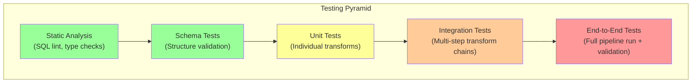
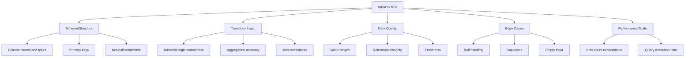
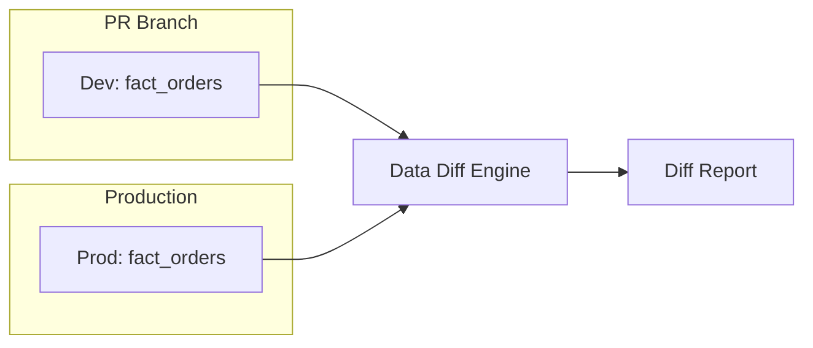
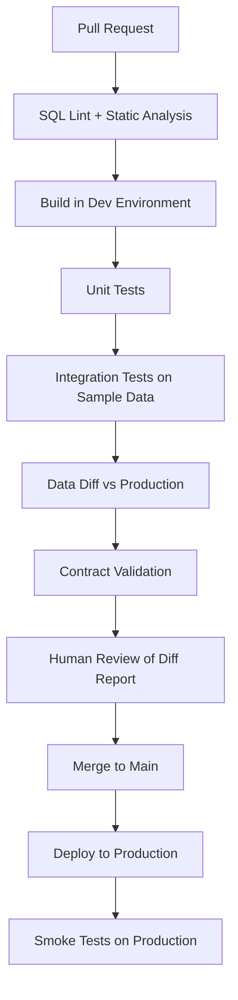

# Testing Data Pipelines

## Why Testing Data Pipelines Matters

Software engineers have been writing unit tests for decades. Data engineers often skip testing entirely, relying on eyeballing query results or checking row counts. This gap causes:

1. **Silent data corruption** — Wrong values propagate undetected for weeks
2. **Regression on change** — A "simple" SQL fix breaks three downstream tables
3. **Fear of refactoring** — Nobody touches the pipeline because it might break
4. **Slow debugging** — Without tests, investigating issues means manually re-running queries

Data pipeline testing is fundamentally different from application testing because:
- Input data is unpredictable (from external sources)
- Correctness depends on business logic that changes frequently
- "Expected output" is often hard to define precisely
- State accumulates over time (incremental pipelines)

### Historical Context

- **2000s:** Manual QA — run the pipeline, spot-check results
- **2010s:** SQL-based assertions (custom scripts)
- **2018:** dbt tests — declarative data quality testing integrated into transformation
- **2020:** data-diff tools emerge (Datafold) — compare datasets across environments
- **2022:** Contract testing for data (Soda, Great Expectations) becomes standard
- **2024-2025:** CI/CD for data becomes mainstream with automated schema + data testing in PR pipelines

## First Principles

### The Data Testing Pyramid



| Level | Speed | Coverage | Confidence | Cost |
|-------|-------|----------|-----------|------|
| Static analysis | Milliseconds | Syntax, style | Low | Lowest |
| Schema tests | Seconds | Structure | Medium-Low | Low |
| Unit tests | Seconds | Transform logic | Medium | Medium |
| Integration tests | Minutes | Multi-step flow | Medium-High | Medium-High |
| End-to-end tests | Minutes-Hours | Full pipeline | Highest | Highest |

### What to Test



## Unit Testing Transforms

### Testing SQL Transforms

```typescript
interface SQLTestCase {
  name: string;
  description: string;
  inputTables: Record<string, Record<string, unknown>[]>;
  expectedOutput: Record<string, unknown>[];
  sqlTransform: string;
}

class SQLTransformTester {
  constructor(private readonly db: TestDatabase) {}

  async runTest(testCase: SQLTestCase): Promise<TestResult> {
    // 1. Create temporary tables with test input data
    for (const [tableName, rows] of Object.entries(testCase.inputTables)) {
      await this.db.createTempTable(tableName, rows);
    }

    // 2. Execute the SQL transform
    const actualOutput = await this.db.query(testCase.sqlTransform);

    // 3. Compare with expected output
    const comparison = this.compareResults(
      (actualOutput as any).rows,
      testCase.expectedOutput,
    );

    // 4. Clean up
    for (const tableName of Object.keys(testCase.inputTables)) {
      await this.db.dropTempTable(tableName);
    }

    return {
      testName: testCase.name,
      passed: comparison.passed,
      details: comparison.details,
    };
  }

  private compareResults(
    actual: Record<string, unknown>[],
    expected: Record<string, unknown>[],
  ): { passed: boolean; details: string } {
    if (actual.length !== expected.length) {
      return {
        passed: false,
        details: `Row count mismatch: got ${actual.length}, expected ${expected.length}`,
      };
    }

    // Sort both by all columns for deterministic comparison
    const sortKey = Object.keys(expected[0] ?? {}).join(',');
    const sortedActual = [...actual].sort((a, b) =>
      JSON.stringify(a) < JSON.stringify(b) ? -1 : 1,
    );
    const sortedExpected = [...expected].sort((a, b) =>
      JSON.stringify(a) < JSON.stringify(b) ? -1 : 1,
    );

    for (let i = 0; i < sortedExpected.length; i++) {
      for (const key of Object.keys(sortedExpected[i])) {
        const actualVal = sortedActual[i][key];
        const expectedVal = sortedExpected[i][key];

        if (!this.valuesEqual(actualVal, expectedVal)) {
          return {
            passed: false,
            details: `Row ${i}, column "${key}": got ${JSON.stringify(actualVal)}, expected ${JSON.stringify(expectedVal)}`,
          };
        }
      }
    }

    return { passed: true, details: 'All rows match' };
  }

  private valuesEqual(a: unknown, b: unknown): boolean {
    // Handle numeric comparison with tolerance
    if (typeof a === 'number' && typeof b === 'number') {
      return Math.abs(a - b) < 0.0001;
    }
    return JSON.stringify(a) === JSON.stringify(b);
  }
}

interface TestDatabase {
  createTempTable(name: string, rows: Record<string, unknown>[]): Promise<void>;
  dropTempTable(name: string): Promise<void>;
  query(sql: string): Promise<unknown>;
}

interface TestResult {
  testName: string;
  passed: boolean;
  details: string;
}
```

### Example: Testing an Order Summary Transform

```typescript
const orderSummaryTest: SQLTestCase = {
  name: 'order_summary_aggregation',
  description: 'Orders should be correctly aggregated by customer and date',
  inputTables: {
    stg_orders: [
      { order_id: 1, customer_id: 'C1', order_date: '2026-03-18', amount: 100 },
      { order_id: 2, customer_id: 'C1', order_date: '2026-03-18', amount: 50 },
      { order_id: 3, customer_id: 'C2', order_date: '2026-03-18', amount: 200 },
      { order_id: 4, customer_id: 'C1', order_date: '2026-03-17', amount: 75 },
    ],
  },
  expectedOutput: [
    { customer_id: 'C1', order_date: '2026-03-17', total_orders: 1, total_amount: 75 },
    { customer_id: 'C1', order_date: '2026-03-18', total_orders: 2, total_amount: 150 },
    { customer_id: 'C2', order_date: '2026-03-18', total_orders: 1, total_amount: 200 },
  ],
  sqlTransform: `
    SELECT
      customer_id,
      order_date,
      COUNT(*) as total_orders,
      SUM(amount) as total_amount
    FROM stg_orders
    GROUP BY customer_id, order_date
    ORDER BY customer_id, order_date
  `,
};
```

### Testing Edge Cases

```typescript
const edgeCaseTests: SQLTestCase[] = [
  {
    name: 'null_amounts_handled',
    description: 'NULL amounts should be treated as 0 in SUM',
    inputTables: {
      stg_orders: [
        { order_id: 1, customer_id: 'C1', order_date: '2026-03-18', amount: 100 },
        { order_id: 2, customer_id: 'C1', order_date: '2026-03-18', amount: null },
      ],
    },
    expectedOutput: [
      { customer_id: 'C1', order_date: '2026-03-18', total_orders: 2, total_amount: 100 },
    ],
    sqlTransform: `
      SELECT
        customer_id,
        order_date,
        COUNT(*) as total_orders,
        COALESCE(SUM(amount), 0) as total_amount
      FROM stg_orders
      GROUP BY customer_id, order_date
    `,
  },
  {
    name: 'empty_input',
    description: 'Empty input should produce empty output',
    inputTables: {
      stg_orders: [],
    },
    expectedOutput: [],
    sqlTransform: `
      SELECT
        customer_id,
        order_date,
        COUNT(*) as total_orders,
        SUM(amount) as total_amount
      FROM stg_orders
      GROUP BY customer_id, order_date
    `,
  },
  {
    name: 'duplicate_orders_handled',
    description: 'Duplicate order_ids should be deduplicated before aggregation',
    inputTables: {
      stg_orders: [
        { order_id: 1, customer_id: 'C1', order_date: '2026-03-18', amount: 100 },
        { order_id: 1, customer_id: 'C1', order_date: '2026-03-18', amount: 100 }, // Duplicate
      ],
    },
    expectedOutput: [
      { customer_id: 'C1', order_date: '2026-03-18', total_orders: 1, total_amount: 100 },
    ],
    sqlTransform: `
      WITH deduplicated AS (
        SELECT DISTINCT ON (order_id) *
        FROM stg_orders
        ORDER BY order_id
      )
      SELECT
        customer_id,
        order_date,
        COUNT(*) as total_orders,
        SUM(amount) as total_amount
      FROM deduplicated
      GROUP BY customer_id, order_date
    `,
  },
];
```

## Data Diff Testing

### Concept

Data diff compares datasets across environments (dev vs. prod) or across time (before vs. after a change):



### Implementation

```typescript
interface DataDiffConfig {
  table1: { connection: string; table: string; label: string };
  table2: { connection: string; table: string; label: string };
  primaryKey: string[];
  compareColumns: string[];
  sampleSize?: number; // For large tables
  tolerance?: Record<string, number>; // Numeric tolerance per column
}

interface DataDiffResult {
  summary: {
    totalRows1: number;
    totalRows2: number;
    matchedRows: number;
    onlyIn1: number;
    onlyIn2: number;
    differentValues: number;
  };
  columnDiffs: Record<
    string,
    {
      matchRate: number;
      sampleDifferences: Array<{
        primaryKey: Record<string, unknown>;
        value1: unknown;
        value2: unknown;
      }>;
    }
  >;
}

class DataDiffEngine {
  async diff(config: DataDiffConfig): Promise<DataDiffResult> {
    // Step 1: Get row counts
    const count1 = await this.getRowCount(config.table1);
    const count2 = await this.getRowCount(config.table2);

    // Step 2: Find rows only in one table
    const onlyIn1 = await this.findExclusive(
      config.table1, config.table2, config.primaryKey,
    );
    const onlyIn2 = await this.findExclusive(
      config.table2, config.table1, config.primaryKey,
    );

    // Step 3: Compare values for matching rows
    const columnDiffs: Record<string, { matchRate: number; sampleDifferences: Array<{ primaryKey: Record<string, unknown>; value1: unknown; value2: unknown }> }> = {};

    for (const column of config.compareColumns) {
      const tolerance = config.tolerance?.[column] ?? 0;
      const diff = await this.compareColumn(
        config.table1,
        config.table2,
        config.primaryKey,
        column,
        tolerance,
      );
      columnDiffs[column] = diff;
    }

    const matchedRows = count1 - onlyIn1;

    return {
      summary: {
        totalRows1: count1,
        totalRows2: count2,
        matchedRows,
        onlyIn1,
        onlyIn2,
        differentValues: Object.values(columnDiffs).reduce(
          (sum, d) => sum + d.sampleDifferences.length,
          0,
        ),
      },
      columnDiffs,
    };
  }

  private async getRowCount(
    table: { connection: string; table: string },
  ): Promise<number> {
    // Execute: SELECT COUNT(*) FROM table
    return 0; // Placeholder
  }

  private async findExclusive(
    table1: { connection: string; table: string },
    table2: { connection: string; table: string },
    primaryKey: string[],
  ): Promise<number> {
    // Execute: SELECT COUNT(*) FROM table1 WHERE pk NOT IN (SELECT pk FROM table2)
    return 0; // Placeholder
  }

  private async compareColumn(
    _table1: { connection: string; table: string },
    _table2: { connection: string; table: string },
    _primaryKey: string[],
    _column: string,
    _tolerance: number,
  ): Promise<{ matchRate: number; sampleDifferences: Array<{ primaryKey: Record<string, unknown>; value1: unknown; value2: unknown }> }> {
    return { matchRate: 1.0, sampleDifferences: [] };
  }
}
```

### Data Diff in CI/CD

```typescript
interface CIDataDiffCheck {
  // Run data diff as part of PR checks
  async runCheck(prNumber: number): Promise<CICheckResult>;
}

class PRDataDiffChecker implements CIDataDiffCheck {
  constructor(
    private readonly diffEngine: DataDiffEngine,
    private readonly config: {
      devConnection: string;
      prodConnection: string;
      models: string[];
      maxAcceptableDiffPercent: number;
    },
  ) {}

  async runCheck(prNumber: number): Promise<CICheckResult> {
    const results: ModelDiffResult[] = [];

    for (const model of this.config.models) {
      const diff = await this.diffEngine.diff({
        table1: {
          connection: this.config.devConnection,
          table: `pr_${prNumber}_${model}`,
          label: 'PR branch',
        },
        table2: {
          connection: this.config.prodConnection,
          table: model,
          label: 'Production',
        },
        primaryKey: ['id'], // Simplified
        compareColumns: ['*'],
      });

      const diffPercent =
        diff.summary.totalRows1 > 0
          ? ((diff.summary.differentValues + diff.summary.onlyIn1 + diff.summary.onlyIn2) /
              diff.summary.totalRows1) *
            100
          : 0;

      results.push({
        model,
        diffPercent,
        passed: diffPercent <= this.config.maxAcceptableDiffPercent,
        summary: diff.summary,
      });
    }

    const allPassed = results.every((r) => r.passed);

    return {
      passed: allPassed,
      message: allPassed
        ? `All ${results.length} models within acceptable diff range`
        : `${results.filter((r) => !r.passed).length} models exceed diff threshold`,
      details: results,
    };
  }
}

interface CICheckResult {
  passed: boolean;
  message: string;
  details: ModelDiffResult[];
}

interface ModelDiffResult {
  model: string;
  diffPercent: number;
  passed: boolean;
  summary: DataDiffResult['summary'];
}
```

## Contract Testing

### Producer-Consumer Contract Test

```typescript
interface DataContractTest {
  contractName: string;
  producer: string;
  consumer: string;
  schemaChecks: SchemaCheck[];
  qualityChecks: QualityCheck[];
  semanticChecks: SemanticCheck[];
}

interface SchemaCheck {
  type: 'column_exists' | 'column_type' | 'column_not_nullable';
  column: string;
  expectedType?: string;
}

interface QualityCheck {
  type: 'uniqueness' | 'completeness' | 'range' | 'freshness';
  column?: string;
  threshold?: number;
  min?: number;
  max?: number;
}

interface SemanticCheck {
  description: string;
  sql: string;
  expectation: 'empty' | 'not_empty' | 'count_equals';
  expectedValue?: number;
}

class DataContractTester {
  constructor(private readonly db: TestDatabase) {}

  async testContract(
    contract: DataContractTest,
    tableName: string,
  ): Promise<ContractTestResult> {
    const results: IndividualTestResult[] = [];

    // Schema checks
    for (const check of contract.schemaChecks) {
      const result = await this.runSchemaCheck(tableName, check);
      results.push(result);
    }

    // Quality checks
    for (const check of contract.qualityChecks) {
      const result = await this.runQualityCheck(tableName, check);
      results.push(result);
    }

    // Semantic checks
    for (const check of contract.semanticChecks) {
      const result = await this.runSemanticCheck(check);
      results.push(result);
    }

    return {
      contractName: contract.contractName,
      allPassed: results.every((r) => r.passed),
      results,
      timestamp: new Date(),
    };
  }

  private async runSchemaCheck(
    tableName: string,
    check: SchemaCheck,
  ): Promise<IndividualTestResult> {
    // Query information_schema to verify column existence and type
    const sql = `
      SELECT column_name, data_type, is_nullable
      FROM information_schema.columns
      WHERE table_name = '${tableName}' AND column_name = '${check.column}'
    `;
    const result = await this.db.query(sql);
    const rows = (result as any).rows;

    if (rows.length === 0) {
      return {
        name: `schema.${check.type}.${check.column}`,
        passed: false,
        message: `Column '${check.column}' does not exist`,
      };
    }

    return {
      name: `schema.${check.type}.${check.column}`,
      passed: true,
      message: `Column '${check.column}' exists with type ${rows[0].data_type}`,
    };
  }

  private async runQualityCheck(
    tableName: string,
    check: QualityCheck,
  ): Promise<IndividualTestResult> {
    if (check.type === 'completeness' && check.column) {
      const sql = `
        SELECT
          COUNT(*) as total,
          COUNT(${check.column}) as non_null
        FROM ${tableName}
      `;
      const result = await this.db.query(sql);
      const row = (result as any).rows[0];
      const completeness = row.total > 0 ? row.non_null / row.total : 1;

      return {
        name: `quality.completeness.${check.column}`,
        passed: completeness >= (check.threshold ?? 1.0),
        message: `Completeness: ${(completeness * 100).toFixed(2)}%`,
      };
    }

    return { name: `quality.${check.type}`, passed: true, message: 'Check passed' };
  }

  private async runSemanticCheck(
    check: SemanticCheck,
  ): Promise<IndividualTestResult> {
    const result = await this.db.query(check.sql);
    const rows = (result as any).rows;

    let passed = false;
    switch (check.expectation) {
      case 'empty':
        passed = rows.length === 0;
        break;
      case 'not_empty':
        passed = rows.length > 0;
        break;
      case 'count_equals':
        passed = rows.length === check.expectedValue;
        break;
    }

    return {
      name: `semantic.${check.description}`,
      passed,
      message: `${check.description}: ${passed ? 'PASS' : 'FAIL'} (${rows.length} rows)`,
    };
  }
}

interface ContractTestResult {
  contractName: string;
  allPassed: boolean;
  results: IndividualTestResult[];
  timestamp: Date;
}

interface IndividualTestResult {
  name: string;
  passed: boolean;
  message: string;
}
```

## CI/CD for Data Pipelines

### Pipeline Testing Workflow



```typescript
interface DataPipelineCIConfig {
  // Stage 1: Static checks (seconds)
  lint: {
    tool: 'sqlfluff' | 'sqlfmt';
    rules: string[];
    failOnWarning: boolean;
  };

  // Stage 2: Unit tests (seconds)
  unitTests: {
    framework: 'pytest' | 'jest' | 'dbt-test';
    testDirectory: string;
    parallelism: number;
  };

  // Stage 3: Integration build (minutes)
  integrationBuild: {
    environment: 'dev-ephemeral' | 'staging';
    models: string[];      // Which dbt models to build
    sampleData: boolean;   // Use sample data or full data
    samplePercent: number;
  };

  // Stage 4: Data diff (minutes)
  dataDiff: {
    enabled: boolean;
    models: string[];
    maxDiffPercent: number;
    blockOnDiff: boolean;
  };

  // Stage 5: Contract tests (seconds)
  contractTests: {
    contracts: string[];   // Paths to contract definitions
    strictMode: boolean;
  };
}

const ciConfig: DataPipelineCIConfig = {
  lint: {
    tool: 'sqlfluff',
    rules: ['L001', 'L002', 'L003', 'L010', 'L014'],
    failOnWarning: false,
  },
  unitTests: {
    framework: 'dbt-test',
    testDirectory: 'tests/',
    parallelism: 4,
  },
  integrationBuild: {
    environment: 'dev-ephemeral',
    models: ['stg_orders', 'stg_customers', 'fact_order_summary'],
    sampleData: true,
    samplePercent: 10,
  },
  dataDiff: {
    enabled: true,
    models: ['fact_order_summary'],
    maxDiffPercent: 5,
    blockOnDiff: false, // Warn but don't block
  },
  contractTests: {
    contracts: ['contracts/orders.yaml', 'contracts/customers.yaml'],
    strictMode: true,
  },
};
```

## Performance Testing

### Transform Performance Benchmarks

```typescript
interface PerformanceBenchmark {
  name: string;
  query: string;
  dataSize: number;        // rows
  maxDurationMs: number;   // performance budget
  maxMemoryMB: number;     // memory budget
}

class PerformanceTestRunner {
  async runBenchmark(
    benchmark: PerformanceBenchmark,
    db: TestDatabase,
  ): Promise<BenchmarkResult> {
    const startTime = Date.now();
    const startMemory = process.memoryUsage().heapUsed;

    await db.query(benchmark.query);

    const durationMs = Date.now() - startTime;
    const memoryUsedMB =
      (process.memoryUsage().heapUsed - startMemory) / (1024 * 1024);

    return {
      name: benchmark.name,
      durationMs,
      memoryUsedMB,
      passedDuration: durationMs <= benchmark.maxDurationMs,
      passedMemory: memoryUsedMB <= benchmark.maxMemoryMB,
      throughput: benchmark.dataSize / (durationMs / 1000), // rows/sec
    };
  }
}

interface BenchmarkResult {
  name: string;
  durationMs: number;
  memoryUsedMB: number;
  passedDuration: boolean;
  passedMemory: boolean;
  throughput: number;
}
```

## Edge Cases & Failure Modes

### Test Data Management

Maintaining test fixtures is the hardest part of data pipeline testing:

```typescript
interface TestFixture {
  name: string;
  tables: Record<string, Record<string, unknown>[]>;
  description: string;
  tags: string[];
}

class TestFixtureManager {
  private fixtures: Map<string, TestFixture> = new Map();

  register(fixture: TestFixture): void {
    this.fixtures.set(fixture.name, fixture);
  }

  /**
   * Generate test data programmatically instead of maintaining static fixtures.
   * This approach scales better and catches more edge cases.
   */
  generateFixture(config: {
    rows: number;
    schema: Record<string, 'string' | 'number' | 'date' | 'boolean'>;
    nullRate: number;
    duplicateRate: number;
  }): Record<string, unknown>[] {
    const rows: Record<string, unknown>[] = [];

    for (let i = 0; i < config.rows; i++) {
      const row: Record<string, unknown> = {};
      for (const [col, type] of Object.entries(config.schema)) {
        // Introduce nulls at specified rate
        if (Math.random() < config.nullRate) {
          row[col] = null;
          continue;
        }

        switch (type) {
          case 'string':
            row[col] = `value_${i}_${col}`;
            break;
          case 'number':
            row[col] = Math.round(Math.random() * 10000) / 100;
            break;
          case 'date':
            row[col] = new Date(
              Date.now() - Math.random() * 365 * 24 * 60 * 60 * 1000,
            ).toISOString().split('T')[0];
            break;
          case 'boolean':
            row[col] = Math.random() > 0.5;
            break;
        }
      }

      rows.push(row);

      // Introduce duplicates at specified rate
      if (Math.random() < config.duplicateRate) {
        rows.push({ ...row });
      }
    }

    return rows;
  }
}
```

### Flaky Data Tests

Data tests can be flaky due to:
- Timing issues (freshness checks on actively loading tables)
- Sampling (random sample may not represent the full dataset)
- External dependencies (source systems returning different data)

**Mitigation:**

```typescript
class FlakyTestHandler {
  private testHistory: Map<string, boolean[]> = new Map();

  recordResult(testName: string, passed: boolean): void {
    const history = this.testHistory.get(testName) ?? [];
    history.push(passed);
    if (history.length > 10) history.shift();
    this.testHistory.set(testName, history);
  }

  isFlakyTest(testName: string): boolean {
    const history = this.testHistory.get(testName) ?? [];
    if (history.length < 5) return false;

    const passRate = history.filter(Boolean).length / history.length;
    // Flaky: passes between 20% and 80% of the time
    return passRate > 0.2 && passRate < 0.8;
  }

  getReliability(testName: string): number {
    const history = this.testHistory.get(testName) ?? [];
    if (history.length === 0) return 1;
    return history.filter(Boolean).length / history.length;
  }
}
```

## Mathematical Foundations

### Test Coverage for Data

Unlike code coverage, data test coverage considers both structural and value coverage:

$$
\text{Structural coverage} = \frac{|\text{tested columns}|}{|\text{total columns}|}
$$

$$
\text{Value coverage} = \frac{|\text{tested value ranges}|}{|\text{possible value ranges}|}
$$

$$
\text{Edge case coverage} = \frac{|\text{tested edge cases}|}{|\text{identified edge cases}|}
$$

### Statistical Power of Data Tests

For anomaly detection tests:

$$
\text{Power} = P(\text{detect anomaly} | \text{anomaly exists})
$$

$$
\text{Power} = 1 - \beta = 1 - P(\text{miss anomaly} | \text{anomaly exists})
$$

With a z-score threshold of $k$ and an actual shift of $\delta$ standard deviations:

$$
\text{Power} = \Phi\left(\frac{\delta \sqrt{n} - k}{\sigma}\right)
$$

Where $\Phi$ is the standard normal CDF and $n$ is the sample size.

## Real-World War Stories

::: info War Story
**The Test That Caught a $2M Error**

A data team added a simple dbt test: `assert total daily revenue is within 2 standard deviations of the 30-day average`. One morning, the test failed — revenue was 10x the normal amount.

Investigation revealed: a pricing service bug had set all product prices to $999.99. Without the test, the incorrect revenue would have flowed to executive dashboards, triggering misguided business decisions (inventory ordering, marketing budget allocation).

**Lesson:** Simple statistical tests catch catastrophic errors. The test took 5 minutes to write and saved $2M in potential downstream consequences.
:::

::: info War Story
**The Data Diff That Revealed a Silent Bug**

A team was refactoring their revenue calculation from a complex CTE to a simpler window function. They ran data diff between the old and new versions and found: 99.7% match, but 0.3% of rows had different values.

The 0.3% were all orders with partial refunds. The old CTE had a subtle bug that double-counted partial refunds. The new version was correct.

Without data diff, they would have deployed and introduced a regression (making the correct calculation look like a bug since it didn't match historical numbers).

**Lesson:** Data diff doesn't just prevent regressions — it discovers existing bugs.
:::

## Decision Framework

### Test Strategy by Pipeline Type

| Pipeline Type | Unit Tests | Integration | Data Diff | Contract | E2E |
|--------------|-----------|------------|-----------|----------|-----|
| dbt models | Yes (dbt tests) | Yes | Yes | Yes | Weekly |
| Streaming | Yes (transform logic) | Yes | No | Yes | Continuous |
| Batch ETL | Yes | Yes | Yes | Yes | Daily |
| ML features | Yes | Yes | Yes | Critical | Before training |
| Reverse ETL | Yes | Yes | No | Yes | Per-sync |

## Advanced Topics

### Property-Based Testing for Data

Instead of specific test cases, define properties that must always hold:

```typescript
interface DataProperty {
  name: string;
  description: string;
  check: (data: Record<string, unknown>[]) => boolean;
}

const revenueProperties: DataProperty[] = [
  {
    name: 'revenue_non_negative',
    description: 'Revenue should never be negative',
    check: (data) => data.every((row) => (row.revenue as number) >= 0),
  },
  {
    name: 'quantity_integer',
    description: 'Quantity should always be a whole number',
    check: (data) =>
      data.every((row) => Number.isInteger(row.quantity as number)),
  },
  {
    name: 'revenue_equals_quantity_times_price',
    description: 'Revenue should equal quantity * unit_price',
    check: (data) =>
      data.every((row) => {
        const expected =
          (row.quantity as number) * (row.unit_price as number);
        return Math.abs((row.revenue as number) - expected) < 0.01;
      }),
  },
  {
    name: 'dates_not_future',
    description: 'No dates should be in the future',
    check: (data) =>
      data.every(
        (row) => new Date(row.order_date as string) <= new Date(),
      ),
  },
];
```

### Mutation Testing for Data

Deliberately introduce data mutations to verify that tests catch them:

```typescript
class DataMutationTester {
  /**
   * Introduce controlled mutations and verify tests catch them.
   * If a mutation is NOT caught, the test suite has a gap.
   */
  async testMutationDetection(
    originalData: Record<string, unknown>[],
    testSuite: DataProperty[],
  ): Promise<MutationReport> {
    const mutations = this.generateMutations(originalData);
    const report: MutationReport = {
      totalMutations: mutations.length,
      caughtMutations: 0,
      missedMutations: [],
    };

    for (const mutation of mutations) {
      const mutatedData = this.applyMutation(originalData, mutation);
      const caught = testSuite.some((test) => !test.check(mutatedData));

      if (caught) {
        report.caughtMutations++;
      } else {
        report.missedMutations.push(mutation);
      }
    }

    return report;
  }

  private generateMutations(
    _data: Record<string, unknown>[],
  ): DataMutation[] {
    return [
      { type: 'negate_value', column: 'revenue', description: 'Make revenue negative' },
      { type: 'null_value', column: 'customer_id', description: 'Null out customer ID' },
      { type: 'duplicate_row', rowIndex: 0, description: 'Duplicate first row' },
      { type: 'future_date', column: 'order_date', description: 'Set date to future' },
      { type: 'wrong_type', column: 'quantity', description: 'Set quantity to string' },
    ];
  }

  private applyMutation(
    data: Record<string, unknown>[],
    mutation: DataMutation,
  ): Record<string, unknown>[] {
    const mutated = data.map((row) => ({ ...row }));

    switch (mutation.type) {
      case 'negate_value':
        if (mutated.length > 0 && mutation.column) {
          mutated[0][mutation.column] = -(mutated[0][mutation.column] as number);
        }
        break;
      case 'null_value':
        if (mutated.length > 0 && mutation.column) {
          mutated[0][mutation.column] = null;
        }
        break;
      case 'duplicate_row':
        if (mutated.length > 0) {
          mutated.push({ ...mutated[0] });
        }
        break;
    }

    return mutated;
  }
}

interface DataMutation {
  type: string;
  column?: string;
  rowIndex?: number;
  description: string;
}

interface MutationReport {
  totalMutations: number;
  caughtMutations: number;
  missedMutations: DataMutation[];
}
```

## Cross-References

- [Pipeline Patterns Overview](./index.md) — Testing within pipeline architecture
- [Data Quality Checks](./data-quality-checks.md) — Quality validation frameworks
- [Schema Evolution](../data-modeling/schema-evolution.md) — Testing schema changes
- [Orchestration](./orchestration.md) — CI/CD integration with orchestrators
- [Data Lineage](./data-lineage.md) — Impact analysis for test prioritization
