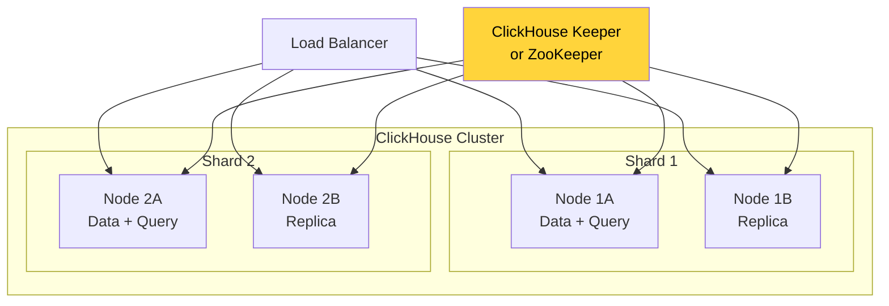
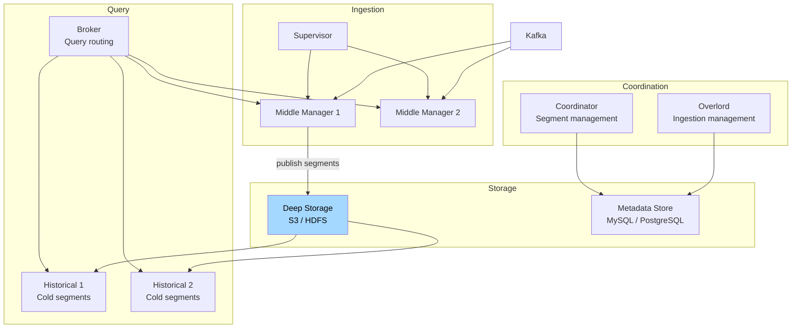
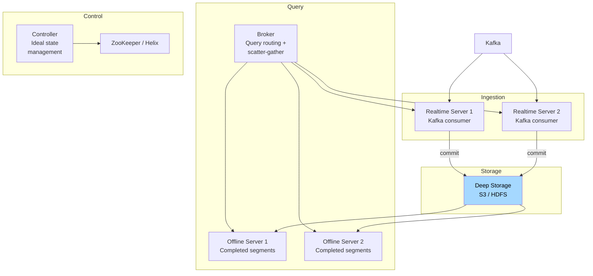
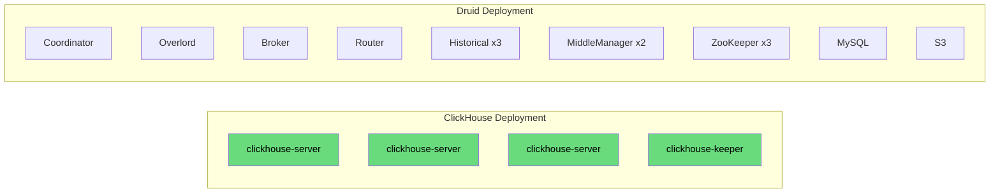
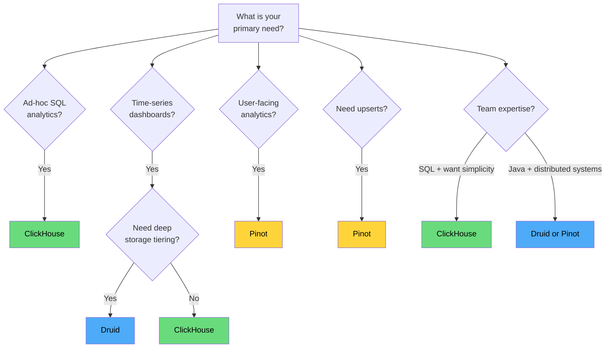

# ClickHouse vs Druid vs Pinot

ClickHouse, Apache Druid, and Apache Pinot are the three dominant open-source real-time OLAP engines. All three can ingest millions of events per second and serve analytical queries in milliseconds — but they achieve this through fundamentally different architectures, and each excels in different scenarios.

This page is a deep technical comparison. For the general real-time analytics architecture, see the [Real-Time Analytics Stack](/data-engineering/real-time-analytics/) overview.

---

## At a Glance

| Dimension | ClickHouse | Apache Druid | Apache Pinot |
|-----------|-----------|-------------|-------------|
| **Origin** | Yandex (2016) | Metamarkets → Imply (2011) | LinkedIn → Apache (2015) |
| **Architecture** | Shared-nothing MPP | Micro-services (separate ingest/query/storage) | Micro-services (similar to Druid) |
| **Primary use** | General analytics, log analytics | Time-series analytics, dashboards | User-facing analytics at scale |
| **Query language** | SQL (near-complete) | Druid SQL + native JSON queries | SQL (PQL legacy, multi-stage engine) |
| **Storage format** | Columnar (MergeTree) | Columnar (segments) | Columnar (segments) |
| **Real-time ingestion** | Kafka engine, async insert | Kafka supervisor (native) | Kafka consumer (native) |
| **Used by** | Cloudflare, GitLab, eBay, Uber | Airbnb, Netflix, Confluent, Salesforce | LinkedIn, Uber, Stripe, Microsoft |
| **License** | Apache 2.0 | Apache 2.0 | Apache 2.0 |
| **Managed offerings** | ClickHouse Cloud | Imply Cloud | StarTree Cloud |

---

## Architecture Comparison

### ClickHouse Architecture

ClickHouse uses a **shared-nothing** architecture. Every node is equal — each stores data and serves queries. Coordination is minimal.



**Key characteristics:**
- Every node does everything (ingest + query + storage)
- Sharding by hash or range; replication via Replicated*MergeTree
- ClickHouse Keeper (built-in Raft) replaces ZooKeeper for coordination
- No separation of compute and storage (disk-local)

### Druid Architecture

Druid separates concerns into specialized node types:



**Key characteristics:**
- Middle Managers handle real-time ingestion
- Historicals serve completed (immutable) segments from deep storage
- Broker routes queries to the appropriate nodes
- Deep storage (S3/HDFS) decouples storage from compute

### Pinot Architecture

Pinot's architecture is similar to Druid but designed for LinkedIn's scale:



**Key characteristics:**
- Realtime servers consume from Kafka and serve in-progress segments
- Offline servers serve completed, immutable segments
- Controller manages the "ideal state" — which segments each server should host
- Apache Helix for cluster management (or ZooKeeper directly)

---

## Ingestion Comparison

| Feature | ClickHouse | Druid | Pinot |
|---------|-----------|-------|-------|
| **Kafka native** | Yes (Kafka engine table) | Yes (Kafka supervisor) | Yes (realtime table) |
| **Batch ingestion** | INSERT, S3, local files | HDFS/S3 batch indexing tasks | Batch ingestion from HDFS/S3 |
| **Ingestion transforms** | Materialized views at ingest | Ingestion spec (JSON-based) | Transform functions |
| **Schema evolution** | ALTER TABLE (limited) | Auto-discover new dimensions | Schema config changes |
| **Exactly-once** | At-least-once (dedup via ReplacingMergeTree) | At-least-once (dedup via hash) | At-least-once (upsert mode) |
| **Upsert support** | ReplacingMergeTree (eventual) | Not supported | Native upsert tables |
| **Ingestion rate** | 1-2M events/s/node | 100-500K events/s/node | 200K-1M events/s/node |

### ClickHouse Kafka Ingestion

```sql
-- Direct Kafka consumption
CREATE TABLE events_kafka (
    event_id String,
    user_id UInt64,
    event_type LowCardinality(String),
    timestamp DateTime64(3)
) ENGINE = Kafka
SETTINGS
    kafka_broker_list = 'broker1:9092,broker2:9092',
    kafka_topic_list = 'events',
    kafka_group_name = 'ch_analytics',
    kafka_format = 'JSONEachRow',
    kafka_num_consumers = 8,
    kafka_max_block_size = 65536;

-- Materialized view triggers on every Kafka batch
CREATE MATERIALIZED VIEW events_mv TO events_final AS
SELECT * FROM events_kafka;
```

### Druid Kafka Ingestion

```json
{
  "type": "kafka",
  "spec": {
    "dataSchema": {
      "dataSource": "events",
      "timestampSpec": {
        "column": "timestamp",
        "format": "iso"
      },
      "dimensionsSpec": {
        "dimensions": ["user_id", "event_type", "page"]
      },
      "metricsSpec": [
        { "type": "count", "name": "event_count" },
        { "type": "longSum", "name": "total_amount", "fieldName": "amount" }
      ],
      "granularitySpec": {
        "segmentGranularity": "HOUR",
        "queryGranularity": "MINUTE"
      }
    },
    "ioConfig": {
      "consumerProperties": {
        "bootstrap.servers": "broker1:9092,broker2:9092"
      },
      "topic": "events",
      "useEarliestOffset": true
    }
  }
}
```

### Pinot Realtime Table

```json
{
  "tableName": "events_REALTIME",
  "tableType": "REALTIME",
  "segmentsConfig": {
    "timeColumnName": "timestamp",
    "schemaName": "events",
    "replicasPerPartition": "2",
    "retentionTimeUnit": "DAYS",
    "retentionTimeValue": "30"
  },
  "ingestionConfig": {
    "streamIngestionConfig": {
      "streamConfigMaps": [{
        "stream.kafka.broker.list": "broker1:9092,broker2:9092",
        "stream.kafka.topic.name": "events",
        "stream.kafka.consumer.type": "lowlevel",
        "stream.kafka.decoder.class.name": "org.apache.pinot.plugin.stream.kafka.KafkaJSONMessageDecoder"
      }]
    }
  }
}
```

---

## Query Performance Comparison

### Benchmark: 1 Billion Events, 30 Days

| Query Type | ClickHouse | Druid | Pinot |
|-----------|-----------|-------|-------|
| **Simple count** (`SELECT count(*) WHERE date = today`) | 15 ms | 50 ms | 45 ms |
| **Group by + count** (top 10 pages) | 35 ms | 80 ms | 70 ms |
| **Time-series** (hourly counts, last 24h) | 25 ms | 40 ms | 35 ms |
| **High-cardinality group by** (per user_id) | 200 ms | 800 ms | 500 ms |
| **Complex join** (events JOIN users) | 300 ms | Not supported | Limited |
| **Approximate distinct** (HLL uniques) | 20 ms | 30 ms | 25 ms |
| **Percentile** (P95 latency) | 50 ms | 120 ms (approx) | 80 ms (approx) |
| **Concurrent queries** (100 parallel) | Good | Good | Excellent |

::: warning
These benchmarks are illustrative and based on published community benchmarks. Real performance depends heavily on schema design, hardware, data distribution, and query patterns. Always benchmark with your own data.
:::

### Query Language Comparison

```sql
-- ClickHouse: full SQL with extensions
SELECT
    toStartOfHour(timestamp) AS hour,
    page,
    count() AS views,
    uniqHLL12(user_id) AS unique_users,
    quantile(0.95)(duration_ms) AS p95_duration
FROM events
WHERE timestamp >= now() - INTERVAL 24 HOUR
  AND country IN ('US', 'GB', 'DE')
GROUP BY hour, page
HAVING views > 100
ORDER BY views DESC
LIMIT 20;

-- Druid: SQL (via Calcite) — similar but some differences
SELECT
    TIME_FLOOR(__time, 'PT1H') AS "hour",
    page,
    COUNT(*) AS views,
    APPROX_COUNT_DISTINCT_DS_HLL(user_id) AS unique_users,
    APPROX_QUANTILE_DS(duration_ms, 0.95) AS p95_duration
FROM events
WHERE __time >= CURRENT_TIMESTAMP - INTERVAL '24' HOUR
  AND country IN ('US', 'GB', 'DE')
GROUP BY 1, 2
HAVING COUNT(*) > 100
ORDER BY views DESC
LIMIT 20;

-- Pinot: SQL (multi-stage engine for joins)
SELECT
    DATETIMECONVERT(timestamp, '1:MILLISECONDS:EPOCH',
                    '1:HOURS:EPOCH', '1:HOURS') AS hour,
    page,
    COUNT(*) AS views,
    DISTINCTCOUNTHLL(user_id) AS unique_users,
    PERCENTILEEST(duration_ms, 95) AS p95_duration
FROM events
WHERE timestamp >= ago('PT24H')
  AND country IN ('US', 'GB', 'DE')
GROUP BY hour, page
HAVING COUNT(*) > 100
ORDER BY views DESC
LIMIT 20
```

---

## Feature Comparison Matrix

| Feature | ClickHouse | Druid | Pinot |
|---------|-----------|-------|-------|
| **SQL support** | Near-complete | Good (via Calcite) | Good (multi-stage engine) |
| **JOINs** | Full support (distributed) | Limited (lookup joins) | Multi-stage joins (newer) |
| **Subqueries** | Full support | Limited | Growing support |
| **Window functions** | Full support | Limited | Limited |
| **UDFs** | Yes (C++, SQL) | No | Yes (Groovy, limited) |
| **Materialized views** | Yes (powerful, at ingest) | No (pre-aggregation at ingest) | No |
| **Pre-aggregation** | Via AggregatingMergeTree | At ingestion (rollup) | Star-tree index |
| **Tiered storage** | Yes (hot/warm/cold) | Deep storage (S3) + cache | Deep storage + tiering |
| **Multi-tenancy** | Basic (quotas, profiles) | Limited | Good (quota, isolation) |
| **Upsert** | ReplacingMergeTree | No | Yes (native upserts) |
| **Geospatial** | Basic (H3, geo functions) | Limited | Basic |
| **Text search** | Experimental (FTS) | No | Text index (Lucene-based) |
| **Exact dedup** | ReplacingMergeTree | No | Dedup at ingestion |

---

## Operational Complexity

| Dimension | ClickHouse | Druid | Pinot |
|-----------|-----------|-------|-------|
| **Component count** | 1 binary (+ Keeper) | 6+ node types | 4+ node types |
| **ZooKeeper dependency** | ClickHouse Keeper (built-in) or ZK | Required | Required (or Helix) |
| **Minimum production cluster** | 3 nodes | 8-10 nodes | 6-8 nodes |
| **Configuration complexity** | Medium (SQL DDL) | High (JSON specs) | High (JSON configs) |
| **Upgrade process** | Rolling restart | Node-by-node, complex | Node-by-node |
| **Monitoring** | system.* tables, Prometheus | Metrics endpoint | Metrics endpoint |
| **Learning curve** | Low (SQL) | High (Druid-specific) | Medium |
| **Community size** | Very large | Large | Large |
| **Documentation** | Excellent | Good | Good |



::: tip
ClickHouse is dramatically simpler to operate. One binary, SQL configuration, and a built-in coordination layer. Druid and Pinot require multiple node types, external dependencies, and JSON-based configuration. If operational simplicity is a priority, ClickHouse has a significant advantage.
:::

---

## When to Use Which

### Choose ClickHouse When

- You want **SQL-first** analytics with full JOIN, subquery, and window function support
- Your team values **operational simplicity** (single binary, familiar SQL)
- You need **materialized views** for complex aggregation pipelines
- **Ad-hoc queries** are common (data exploration, not just dashboards)
- Log analytics and observability (Grafana + ClickHouse is a popular stack)
- You are replacing Elasticsearch for log search or analytics

### Choose Druid When

- Your workload is **time-series heavy** with pre-defined dimensions
- You need **deep storage** (S3/HDFS) with automatic tiering
- You are building **real-time dashboards** with Superset or Turnilo
- Event data has **consistent schema** and does not need complex JOINs
- You have the operational capacity to run a multi-service architecture
- You need **high concurrent query throughput** for many dashboard users

### Choose Pinot When

- You are building **user-facing analytics** (each user queries their own data)
- **Upsert support** is required (e.g., updating order status, user profiles)
- **Multi-tenant** workloads with per-tenant query isolation
- You need to serve **thousands of concurrent queries** with guaranteed latency SLAs
- LinkedIn-scale requirements (Pinot was built for this exact use case)
- You need **text search** alongside analytics (Lucene-based text index)

### Decision Matrix



---

## Cost Comparison

| Factor | ClickHouse | Druid | Pinot |
|--------|-----------|-------|-------|
| **Compute (3-node min)** | 3 x c6i.4xlarge | 8-10 mixed instances | 6-8 mixed instances |
| **Storage** | Local SSD (EBS) | S3 (deep) + SSD (cache) | S3 (deep) + SSD (cache) |
| **Managed service** | ClickHouse Cloud (~$0.30/GB) | Imply Cloud (~$0.50/GB) | StarTree (~$0.45/GB) |
| **External dependencies** | Keeper (built-in) | ZooKeeper + MySQL + S3 | ZooKeeper + S3 |
| **Human ops cost** | Low | High | Medium |

::: tip
For teams under 50 engineers, ClickHouse is usually the best choice due to lower operational burden. Druid and Pinot shine at LinkedIn/Airbnb scale where dedicated platform teams can manage the complexity and the workload demands their specific strengths (deep storage tiering, user-facing analytics at extreme concurrency).
:::

---

## Migration Patterns

### Moving Between Engines

| From | To | Strategy |
|------|-----|----------|
| **Elasticsearch** | ClickHouse | Export via Logstash/Kafka, recreate as ClickHouse tables |
| **BigQuery** | ClickHouse | Export to GCS, load with `s3()` table function |
| **Druid** | ClickHouse | Export segments to S3, parse and load |
| **Druid** | Pinot | Repoint Kafka consumers, parallel run, switch broker |
| **ClickHouse** | Pinot | Dual-write via Kafka during migration window |

---

## Key Takeaways

1. **ClickHouse for SQL-first simplicity** — best SQL support, easiest to operate, excellent for ad-hoc analytics and log search
2. **Druid for time-series dashboards** — mature deep storage tiering, strong Kafka integration, battle-tested at Netflix and Airbnb
3. **Pinot for user-facing analytics** — built for LinkedIn-scale multi-tenancy, native upserts, extreme concurrent query throughput
4. **All three are excellent** — the "wrong" choice among these three is still much better than using PostgreSQL or Elasticsearch for OLAP workloads
5. **Operational cost matters** — ClickHouse (1 binary) vs Druid/Pinot (6-10 components) is a significant operational difference
6. **Start simple, migrate if needed** — ClickHouse is the easiest starting point; migrate to Druid or Pinot only when you hit their specific strengths
