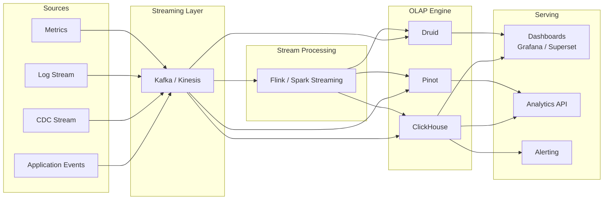
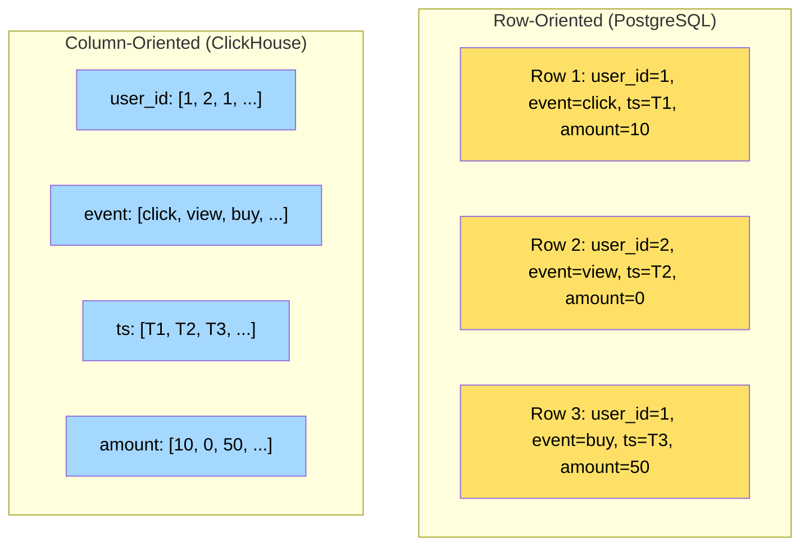
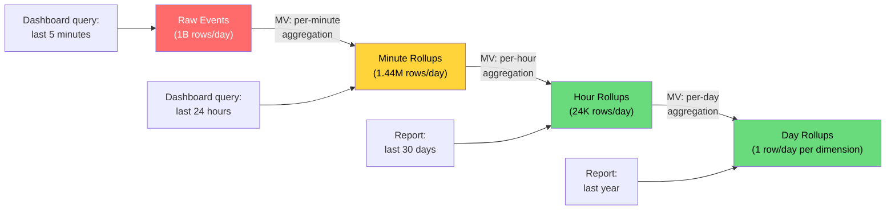
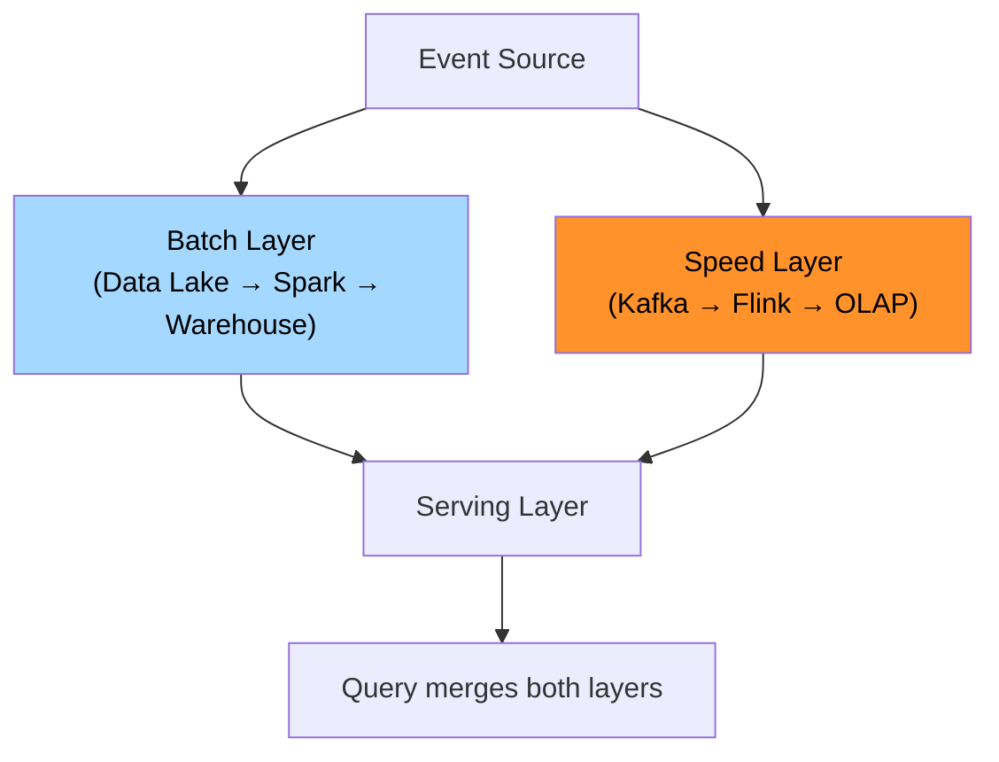
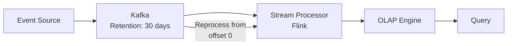

# Real-Time Analytics Stack

Traditional analytics relies on batch ETL — events land in a data lake overnight, get transformed, and appear in dashboards the next morning. Real-time analytics eliminates this delay. Events flow from your application through a streaming layer, into a purpose-built OLAP engine, and are queryable within seconds. The dashboard shows what is happening now, not what happened yesterday.

This page covers the architecture of a real-time analytics stack, OLAP engine design principles, stream-to-OLAP ingestion patterns, and materialized views. For head-to-head engine comparisons, see the companion [ClickHouse vs Druid vs Pinot](/data-engineering/real-time-analytics/clickhouse-vs-druid-vs-pinot) page.

---

## Why Real-Time Analytics?

| Use Case | Batch Latency | Real-Time Latency | Business Impact of Delay |
|----------|-------------|-------------------|-------------------------|
| Fraud detection dashboards | Hours | Seconds | Missed fraud = financial loss |
| Ad campaign performance | Next day | Minutes | Wasted ad spend |
| Infrastructure monitoring | 5-15 min | Seconds | Missed outages |
| E-commerce conversion funnels | Hours | Seconds | Cannot react to drop in conversions |
| Gaming leaderboards | Minutes | Sub-second | Bad player experience |
| IoT fleet monitoring | Hours | Seconds | Equipment failure |
| Social media trending topics | 30 min | Seconds | Missed trending content |

::: tip
Real-time analytics does not replace batch analytics — it complements it. Batch pipelines handle complex joins, historical reprocessing, and data quality. Real-time handles operational dashboards, alerting, and time-sensitive decisions. Most mature data platforms run both.
:::

---

## Architecture Overview



### The Three Ingestion Patterns

| Pattern | Flow | When to Use |
|---------|------|-------------|
| **Direct ingestion** | Kafka → OLAP engine | Engine has native Kafka connector (ClickHouse, Pinot, Druid) |
| **Stream processing first** | Kafka → Flink → OLAP | Need enrichment, joins, or aggregation before storage |
| **Dual write** | App writes to both OLTP and OLAP | Simple setups, low volume (not recommended at scale) |

::: danger
Never dual-write from your application to both OLTP and OLAP. This creates consistency issues — if one write succeeds and the other fails, your analytics diverge from your source of truth. Use CDC (Change Data Capture) from the OLTP database or write to Kafka and fan out from there.
:::

---

## OLAP Engine Design Principles

Real-time OLAP engines are fundamentally different from row-oriented OLTP databases. Understanding these design choices explains why ClickHouse can scan billions of rows in seconds.

### Column-Oriented Storage



| Property | Row Store | Column Store |
|----------|-----------|-------------|
| **Best for** | Point lookups, CRUD | Analytical queries (aggregation) |
| **Scan efficiency** | Reads all columns even if query needs one | Reads only queried columns |
| **Compression** | Low (mixed types per row) | High (same type per column, 10-20x) |
| **Insert pattern** | Single-row inserts | Batch inserts (append-only) |
| **Update/Delete** | Fast (in-place) | Slow or unsupported (immutable segments) |
| **Query pattern** | WHERE id = 123 | SELECT count(*), avg(amount) WHERE date > X |

### Key OLAP Design Choices

```mermaid
graph TD
    subgraph "Storage"
        CS[Column-Oriented Storage]
        COMP[Heavy Compression\nLZ4, ZSTD, delta, dictionary]
        PART[Time-Based Partitioning]
        SORT[Sorted by Primary Key]
    end

    subgraph "Query Execution"
        VEC[Vectorized Execution\nProcess columns in batches]
        PAR[Massive Parallelism\nAll cores + distributed]
        PIPE[Pipeline / Streaming\nNo full materialization]
    end

    subgraph "Indexing"
        SKIP[Skip Indexes\n(min/max per block)]
        BLOOM[Bloom Filters\nfor high-cardinality]
        BITMAP[Bitmap Indexes\nfor low-cardinality]
    end

    CS --> VEC
    COMP --> VEC
    SORT --> SKIP
```

---

## Stream-to-OLAP Pipeline

### Direct Kafka Ingestion

Most OLAP engines can consume directly from Kafka:

```sql
-- ClickHouse: Kafka engine table
CREATE TABLE events_queue (
    event_id String,
    user_id UInt64,
    event_type LowCardinality(String),
    properties String,          -- JSON
    timestamp DateTime64(3)
) ENGINE = Kafka
SETTINGS
    kafka_broker_list = 'kafka:9092',
    kafka_topic_list = 'events',
    kafka_group_name = 'clickhouse_consumer',
    kafka_format = 'JSONEachRow',
    kafka_num_consumers = 4;

-- Materialized view to transform and insert into final table
CREATE MATERIALIZED VIEW events_mv TO events AS
SELECT
    event_id,
    user_id,
    event_type,
    JSONExtractString(properties, 'page') AS page,
    JSONExtractFloat(properties, 'duration') AS duration_ms,
    timestamp,
    toDate(timestamp) AS event_date
FROM events_queue;

-- Final analytics table
CREATE TABLE events (
    event_id String,
    user_id UInt64,
    event_type LowCardinality(String),
    page LowCardinality(String),
    duration_ms Float32,
    timestamp DateTime64(3),
    event_date Date
) ENGINE = MergeTree()
PARTITION BY event_date
ORDER BY (event_type, user_id, timestamp)
TTL event_date + INTERVAL 90 DAY;
```

### Enriched Ingestion via Flink

When you need to join streaming events with reference data before loading:

```python
# Flink SQL: enrich events with user data before loading into OLAP
"""
CREATE TABLE events_raw (
    event_id STRING,
    user_id BIGINT,
    event_type STRING,
    properties STRING,
    event_time TIMESTAMP(3),
    WATERMARK FOR event_time AS event_time - INTERVAL '5' SECOND
) WITH (
    'connector' = 'kafka',
    'topic' = 'events',
    'properties.bootstrap.servers' = 'kafka:9092',
    'format' = 'json'
);

CREATE TABLE users_dim (
    user_id BIGINT,
    country STRING,
    plan_type STRING,
    signup_date DATE
) WITH (
    'connector' = 'jdbc',
    'url' = 'jdbc:postgresql://pg:5432/app',
    'table-name' = 'users',
    'lookup.cache.ttl' = '1 hour'
);

-- Enriched output to ClickHouse
CREATE TABLE events_enriched (
    event_id STRING,
    user_id BIGINT,
    event_type STRING,
    country STRING,
    plan_type STRING,
    event_time TIMESTAMP(3)
) WITH (
    'connector' = 'clickhouse',
    'url' = 'clickhouse://ch:8123',
    'table-name' = 'events_enriched'
);

INSERT INTO events_enriched
SELECT
    e.event_id,
    e.user_id,
    e.event_type,
    u.country,
    u.plan_type,
    e.event_time
FROM events_raw e
JOIN users_dim FOR SYSTEM_TIME AS OF e.event_time AS u
    ON e.user_id = u.user_id;
"""
```

---

## Materialized Views for Real-Time Aggregation

Materialized views pre-compute aggregations at ingestion time, making queries instant instead of scanning raw data.

### The Aggregation Pipeline



### ClickHouse Materialized View Example

```sql
-- Raw events table
CREATE TABLE page_views (
    timestamp DateTime64(3),
    user_id UInt64,
    page LowCardinality(String),
    country LowCardinality(String),
    device LowCardinality(String),
    duration_ms UInt32
) ENGINE = MergeTree()
PARTITION BY toDate(timestamp)
ORDER BY (page, country, timestamp)
TTL toDate(timestamp) + INTERVAL 7 DAY;

-- Pre-aggregated per-minute rollup
CREATE MATERIALIZED VIEW page_views_per_minute
ENGINE = SummingMergeTree()
PARTITION BY toDate(minute)
ORDER BY (page, country, device, minute)
AS SELECT
    toStartOfMinute(timestamp) AS minute,
    page,
    country,
    device,
    count() AS view_count,
    uniqHLL12(user_id) AS unique_users,
    sum(duration_ms) AS total_duration_ms,
    avg(duration_ms) AS avg_duration_ms
FROM page_views
GROUP BY minute, page, country, device;

-- Query the rollup instead of raw data
-- This scans thousands of rows instead of billions
SELECT
    page,
    sum(view_count) AS views,
    uniqMerge(unique_users) AS uniques,
    sum(total_duration_ms) / sum(view_count) AS avg_duration
FROM page_views_per_minute
WHERE minute >= now() - INTERVAL 1 HOUR
GROUP BY page
ORDER BY views DESC
LIMIT 20;
```

::: tip
The key insight with materialized views is that you trade storage for query speed. A 5-minute rollup reduces data volume by 300x (from per-event to per-5-minute-bucket), making dashboard queries instant. Store both raw and rollup tables — raw for drill-down, rollups for dashboards.
:::

---

## Query Patterns for Real-Time Dashboards

### Common Query Types

| Query Type | Example | Optimization |
|-----------|---------|--------------|
| **Time-series aggregation** | Page views per minute, last 1h | Materialized view, time-sorted partitions |
| **Top-N** | Top 10 pages by views | Pre-aggregated rollup + ORDER BY LIMIT |
| **Distinct count** | Unique users in last 24h | HyperLogLog (approximate, O(1) merge) |
| **Percentiles** | P95 latency per endpoint | t-digest or quantile sketches |
| **Funnel analysis** | Signup → Activation → Purchase | Window functions on user event sequences |
| **Retention** | Day-1, Day-7, Day-30 retention | Bitmap intersection across date cohorts |

### Approximate Algorithms

Exact aggregations over billions of rows are slow. OLAP engines use probabilistic data structures for speed:

| Algorithm | Use Case | Error | Speed vs Exact |
|-----------|----------|-------|---------------|
| **HyperLogLog** | COUNT DISTINCT | ~2% | 1000x faster |
| **t-digest** | Percentiles (P50, P95, P99) | ~1% | 100x faster |
| **Count-Min Sketch** | Frequency estimation | Overestimates by epsilon | 10x faster |
| **Theta Sketch** | Set operations (union, intersection) | ~2% | 100x faster |
| **Bloom Filter** | Membership testing | False positives only | Constant time |

```sql
-- ClickHouse: HyperLogLog for approximate unique users
SELECT
    toStartOfHour(timestamp) AS hour,
    uniqHLL12(user_id) AS approx_unique_users
FROM events
WHERE timestamp >= now() - INTERVAL 24 HOUR
GROUP BY hour
ORDER BY hour;

-- Exact count for comparison (much slower)
SELECT
    toStartOfHour(timestamp) AS hour,
    uniqExact(user_id) AS exact_unique_users
FROM events
WHERE timestamp >= now() - INTERVAL 24 HOUR
GROUP BY hour
ORDER BY hour;
```

---

## Lambda vs Kappa Architecture

Two competing approaches for combining batch and real-time:

### Lambda Architecture



### Kappa Architecture



| Aspect | Lambda | Kappa |
|--------|--------|-------|
| **Complexity** | High (two codepaths) | Low (one codepath) |
| **Correctness** | Batch layer is source of truth | Stream reprocessing is source of truth |
| **Reprocessing** | Easy (rerun batch job) | Requires Kafka retention + replay |
| **Cost** | Higher (dual infrastructure) | Lower |
| **Maturity** | Battle-tested | Requires mature streaming infrastructure |
| **Use when** | Complex joins, ML training needs batch | Event-driven, append-only analytics |

::: tip
Start with Kappa if your analytics are primarily event-driven and append-only. Graduate to Lambda only if you need complex historical reprocessing, ML feature computation, or your streaming pipeline cannot guarantee correctness (e.g., late-arriving data beyond Kafka retention).
:::

---

## Operational Concerns

### Data Freshness Monitoring

```python
class FreshnessMonitor:
    """Alert when data falls behind real-time."""

    def check_freshness(self, table_name):
        # Query the max timestamp in the OLAP table
        result = self.olap.query(f"""
            SELECT max(timestamp) AS latest
            FROM {table_name}
        """)

        lag_seconds = (datetime.utcnow() - result.latest).total_seconds()

        if lag_seconds > 300:  # 5 minutes
            self.alert(
                severity="warning",
                message=f"{table_name} is {lag_seconds:.0f}s behind real-time"
            )

        if lag_seconds > 900:  # 15 minutes
            self.alert(
                severity="critical",
                message=f"{table_name} is {lag_seconds:.0f}s behind — check ingestion pipeline"
            )

        return lag_seconds
```

### Capacity Planning

| Dimension | How to Size | Rule of Thumb |
|-----------|-------------|---------------|
| **Ingestion rate** | Events/second x avg event size | ClickHouse: 1M events/s per node |
| **Storage** | Daily volume x retention x compression | Column store compresses 5-20x |
| **Query concurrency** | Dashboard users x refresh rate | 10-50 concurrent queries typical |
| **Memory** | Active partitions + query buffers | 64-256 GB RAM per node |
| **CPU** | Query complexity x concurrency | 16-64 cores per node |

---

## What to Learn Next

| Topic | Link |
|-------|------|
| ClickHouse vs Druid vs Pinot comparison | [OLAP Engine Comparison](/data-engineering/real-time-analytics/clickhouse-vs-druid-vs-pinot) |
| Stream processing fundamentals | [Stream Processing](/data-engineering/stream-processing/) |
| ETL and ELT pipeline patterns | [ETL Patterns](/data-engineering/etl-patterns/) |
| Kafka and message queues | [Message Queues](/system-design/message-queues/) |
| Observability and monitoring | [Observability](/infrastructure/observability/) |

---

## Key Takeaways

1. **Column-oriented + compression + vectorized execution** — this is why OLAP engines scan billions of rows in seconds
2. **Materialized views are your best friend** — pre-aggregate at ingestion time to make dashboard queries instant
3. **Approximate algorithms are essential** — HyperLogLog for uniques, t-digest for percentiles, at 1-2% error for 100-1000x speedup
4. **Stream directly into OLAP when possible** — most engines have native Kafka connectors; add Flink only when you need enrichment or joins
5. **Start with Kappa, upgrade to Lambda** — one codepath is easier to maintain until you genuinely need batch reprocessing
6. **Monitor data freshness** — a real-time dashboard showing stale data is worse than no dashboard (it creates false confidence)
7. **Never dual-write** — use CDC or Kafka fan-out, not application-level writes to both OLTP and OLAP
