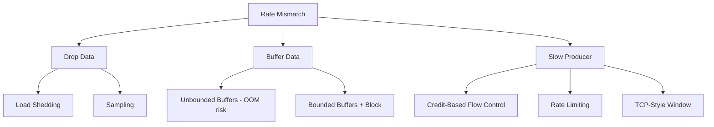
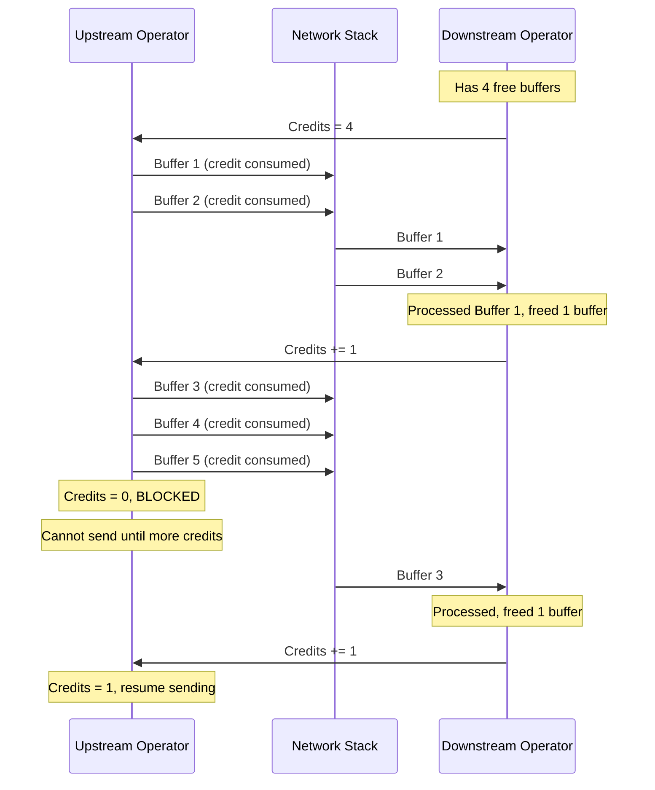
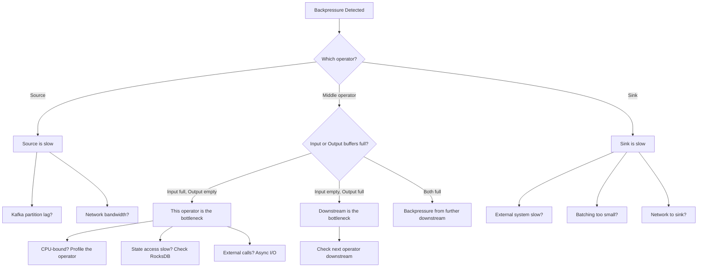
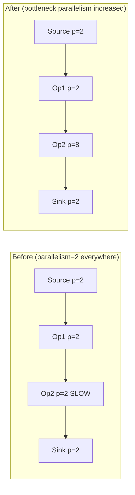
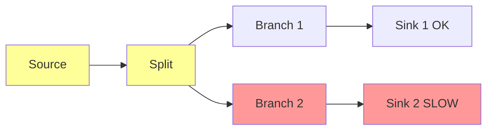

# Backpressure in Stream Processing

## Why Backpressure Exists

In any pipeline, different stages process data at different rates. When a downstream operator is slower than an upstream operator, data accumulates. Without a mechanism to slow down the producer, buffers overflow, memory is exhausted, and the system crashes.

**Backpressure** is the mechanism by which slow consumers signal fast producers to slow down. It is fundamental to the stability of any streaming system.

### The Fundamental Mismatch

$$
\text{If } \text{rate}_{\text{producer}} > \text{rate}_{\text{consumer}} \text{ for sustained period } T:
$$

$$
\text{Buffer growth} = (\text{rate}_{\text{producer}} - \text{rate}_{\text{consumer}}) \times T
$$

Without backpressure, this growth is unbounded and the system will eventually OOM.

### Historical Context

TCP flow control (1981) was the original backpressure mechanism — the receiver advertises a window size, and the sender cannot exceed it. Reactive Streams (2013) brought this concept to application-level streaming with the `Publisher.subscribe(Subscriber)` pattern. Apache Flink uses credit-based flow control inspired by TCP. Kafka Streams relies on Kafka's consumer-driven pull model, which provides natural backpressure.

## First Principles

### Flow Control Models

There are three fundamental approaches to handling rate mismatches:



**Backpressure = Option D**: slow the producer to match the consumer's rate.

### The Backpressure Propagation Chain

In a multi-stage pipeline, backpressure propagates backwards:

```
Source → Op1 → Op2 → Op3 (SLOW) → Sink
                       ↑
                   Backpressure originates here

Source ← Op1 ← Op2 ← Op3 (SLOW)
                       ↑
                   Propagates upstream to source
```

The source must ultimately slow down, which may mean pausing Kafka consumption, reducing file read rate, or throttling API polling.

### Little's Law and Backpressure

Little's Law relates throughput, latency, and concurrency:

$$
L = \lambda \times W
$$

Where:
- $L$ = average number of items in the system (queue length)
- $\lambda$ = arrival rate (throughput)
- $W$ = average time in system (latency)

Under backpressure:
- $\lambda$ is fixed by the producer
- $W$ increases as buffers fill
- $L$ grows until the system intervenes

Backpressure reduces $\lambda$ (arrival rate) to bring $L$ back to a sustainable level.

## Credit-Based Flow Control (Flink)

Flink uses a credit-based system inspired by TCP's sliding window. Each receiver tells the sender how many buffers (credits) it can accept.

### How It Works



### Implementation

```typescript
interface NetworkBuffer {
  data: Uint8Array;
  size: number;
  sequenceNumber: number;
}

class CreditBasedFlowController {
  private availableCredits: number;
  private pendingBuffers: NetworkBuffer[] = [];
  private readonly maxCredits: number;

  // Metrics
  private blockedTimeMs: number = 0;
  private lastBlockedAt: number | null = null;
  private totalBuffersSent: number = 0;

  constructor(initialCredits: number) {
    this.availableCredits = initialCredits;
    this.maxCredits = initialCredits;
  }

  /**
   * Attempt to send a buffer. Returns true if sent, false if blocked.
   */
  trySend(buffer: NetworkBuffer): boolean {
    if (this.availableCredits > 0) {
      this.availableCredits--;
      this.totalBuffersSent++;

      if (this.lastBlockedAt !== null) {
        this.blockedTimeMs += Date.now() - this.lastBlockedAt;
        this.lastBlockedAt = null;
      }

      return true; // Buffer sent
    }

    // No credits — queue the buffer and signal backpressure
    this.pendingBuffers.push(buffer);
    if (this.lastBlockedAt === null) {
      this.lastBlockedAt = Date.now();
    }
    return false;
  }

  /**
   * Called when downstream grants additional credits.
   */
  receiveCredits(credits: number): NetworkBuffer[] {
    this.availableCredits += credits;
    const toSend: NetworkBuffer[] = [];

    while (this.pendingBuffers.length > 0 && this.availableCredits > 0) {
      toSend.push(this.pendingBuffers.shift()!);
      this.availableCredits--;
      this.totalBuffersSent++;
    }

    if (this.pendingBuffers.length === 0 && this.lastBlockedAt !== null) {
      this.blockedTimeMs += Date.now() - this.lastBlockedAt;
      this.lastBlockedAt = null;
    }

    return toSend;
  }

  getBackpressureRatio(): number {
    const totalTime = Date.now(); // Simplified — should track from start
    return totalTime > 0 ? this.blockedTimeMs / totalTime : 0;
  }

  isBackpressured(): boolean {
    return this.availableCredits === 0 && this.pendingBuffers.length > 0;
  }
}
```

### Buffer Pool Management

Flink manages a fixed pool of network buffers per TaskManager:

```typescript
class NetworkBufferPool {
  private freeBuffers: Uint8Array[] = [];
  private totalBuffers: number;
  private bufferSize: number;
  private waitingRequests: Array<(buffer: Uint8Array) => void> = [];

  constructor(totalMemoryBytes: number, bufferSizeBytes: number) {
    this.bufferSize = bufferSizeBytes;
    this.totalBuffers = Math.floor(totalMemoryBytes / bufferSizeBytes);

    // Pre-allocate all buffers
    for (let i = 0; i < this.totalBuffers; i++) {
      this.freeBuffers.push(new Uint8Array(this.bufferSize));
    }
  }

  /**
   * Request a buffer. Returns immediately if available,
   * otherwise blocks (backpressure at the buffer pool level).
   */
  async requestBuffer(): Promise<Uint8Array> {
    const free = this.freeBuffers.pop();
    if (free) return free;

    // No free buffers — wait (this is where backpressure happens)
    return new Promise<Uint8Array>((resolve) => {
      this.waitingRequests.push(resolve);
    });
  }

  /**
   * Return a buffer to the pool after processing.
   */
  recycleBuffer(buffer: Uint8Array): void {
    // Clear the buffer
    buffer.fill(0);

    // If someone is waiting, give it directly
    const waiting = this.waitingRequests.shift();
    if (waiting) {
      waiting(buffer);
      return;
    }

    this.freeBuffers.push(buffer);
  }

  getUsageRatio(): number {
    return 1 - this.freeBuffers.length / this.totalBuffers;
  }

  getStats(): {
    total: number;
    free: number;
    inUse: number;
    waiting: number;
  } {
    return {
      total: this.totalBuffers,
      free: this.freeBuffers.length,
      inUse: this.totalBuffers - this.freeBuffers.length,
      waiting: this.waitingRequests.length,
    };
  }
}
```

**Buffer pool sizing:**

$$
\text{Buffers}_{\text{total}} = \text{taskmanager.memory.network.fraction} \times \text{total\_memory}
$$

$$
\text{Buffers per channel} = \frac{\text{Buffers}_{\text{total}}}{\text{input\_channels} + \text{output\_channels}}
$$

::: warning
Under-provisioning network buffers is the #1 cause of unnecessary backpressure. Each network connection needs at least 2 buffers (one being filled, one being sent). With high parallelism (hundreds of channels), the buffer pool must be sized accordingly.
:::

## Dynamic Rate Adjustment

### Adaptive Source Throttling

When backpressure reaches the source, the source must reduce its consumption rate:

```typescript
class AdaptiveKafkaSourceThrottler {
  private currentPollInterval: number;
  private readonly minPollInterval: number = 10;   // 10ms
  private readonly maxPollInterval: number = 5000; // 5s
  private readonly adjustmentFactor: number = 1.5;

  private backpressureHistory: boolean[] = [];
  private readonly historySize: number = 20;

  constructor(initialPollInterval: number = 100) {
    this.currentPollInterval = initialPollInterval;
  }

  /**
   * Called after each poll cycle.
   * Adjusts the poll interval based on backpressure signals.
   */
  adjustRate(isBackpressured: boolean): number {
    this.backpressureHistory.push(isBackpressured);
    if (this.backpressureHistory.length > this.historySize) {
      this.backpressureHistory.shift();
    }

    const backpressureRatio =
      this.backpressureHistory.filter(Boolean).length /
      this.backpressureHistory.length;

    if (backpressureRatio > 0.7) {
      // Heavy backpressure: slow down significantly
      this.currentPollInterval = Math.min(
        this.currentPollInterval * this.adjustmentFactor,
        this.maxPollInterval,
      );
    } else if (backpressureRatio > 0.3) {
      // Moderate backpressure: slow down slightly
      this.currentPollInterval = Math.min(
        this.currentPollInterval * 1.1,
        this.maxPollInterval,
      );
    } else if (backpressureRatio < 0.1) {
      // No backpressure: speed up
      this.currentPollInterval = Math.max(
        this.currentPollInterval / this.adjustmentFactor,
        this.minPollInterval,
      );
    }
    // Else: in the sweet spot, maintain current rate

    return this.currentPollInterval;
  }

  getCurrentRate(): number {
    return 1000 / this.currentPollInterval; // Polls per second
  }
}
```

### AIMD (Additive Increase, Multiplicative Decrease)

The same algorithm used in TCP congestion control:

$$
\text{On no backpressure: } \text{rate} \leftarrow \text{rate} + \alpha
$$

$$
\text{On backpressure: } \text{rate} \leftarrow \text{rate} \times \beta \quad (\beta < 1)
$$

```typescript
class AIMDRateController {
  private rate: number;
  private readonly additiveIncrease: number;
  private readonly multiplicativeDecrease: number;
  private readonly minRate: number;
  private readonly maxRate: number;

  constructor(config: {
    initialRate: number;
    additiveIncrease: number;
    multiplicativeDecrease: number;
    minRate: number;
    maxRate: number;
  }) {
    this.rate = config.initialRate;
    this.additiveIncrease = config.additiveIncrease;
    this.multiplicativeDecrease = config.multiplicativeDecrease;
    this.minRate = config.minRate;
    this.maxRate = config.maxRate;
  }

  onSuccess(): void {
    this.rate = Math.min(this.rate + this.additiveIncrease, this.maxRate);
  }

  onBackpressure(): void {
    this.rate = Math.max(
      this.rate * this.multiplicativeDecrease,
      this.minRate,
    );
  }

  getRate(): number {
    return this.rate;
  }
}

// TCP-like: increase by 1 per success, halve on backpressure
const aimd = new AIMDRateController({
  initialRate: 1000,        // 1000 records/s
  additiveIncrease: 100,    // +100 per interval
  multiplicativeDecrease: 0.5, // halve on backpressure
  minRate: 100,
  maxRate: 100_000,
});
```

## Backpressure Detection & Monitoring

### Detection Metrics

```typescript
interface BackpressureMetrics {
  // Per-operator metrics
  operatorId: string;

  // Input buffer usage: high means operator is slow (being backpressured)
  inputBufferUsage: number; // 0.0 to 1.0

  // Output buffer usage: high means downstream is slow (causing backpressure)
  outputBufferUsage: number; // 0.0 to 1.0

  // Time spent waiting for output buffers (blocked on downstream)
  backpressuredTimeMs: number;

  // Time spent waiting for input data (idle, waiting for upstream)
  idleTimeMs: number;

  // Time spent processing
  busyTimeMs: number;

  // Derived
  backpressureRatio: number; // backpressuredTime / totalTime
  busyRatio: number;         // busyTime / totalTime
  idleRatio: number;         // idleTime / totalTime
}

class BackpressureDetector {
  private metrics: Map<string, BackpressureMetrics> = new Map();

  /**
   * Analyze the operator graph to find the backpressure bottleneck.
   *
   * The bottleneck is the operator that is:
   * 1. Busy (high busyRatio)
   * 2. Has high output buffer usage (downstream is slow)
   * OR
   * 3. Has high input buffer usage but low output buffer usage
   *    (this operator is the slow one)
   */
  findBottleneck(): {
    operatorId: string;
    type: 'slow_operator' | 'slow_downstream' | 'slow_source';
    confidence: number;
  } | null {
    let worstOperator: string | null = null;
    let worstScore = 0;
    let bottleneckType: 'slow_operator' | 'slow_downstream' | 'slow_source' =
      'slow_operator';

    for (const [opId, m] of this.metrics) {
      // High busy ratio + high input buffer = this operator is the bottleneck
      if (m.busyRatio > 0.8 && m.inputBufferUsage > 0.8) {
        const score = m.busyRatio * m.inputBufferUsage;
        if (score > worstScore) {
          worstScore = score;
          worstOperator = opId;
          bottleneckType = 'slow_operator';
        }
      }

      // High output buffer usage + low busy ratio = downstream is the bottleneck
      if (m.outputBufferUsage > 0.8 && m.busyRatio < 0.5) {
        const score = m.outputBufferUsage * (1 - m.busyRatio);
        if (score > worstScore) {
          worstScore = score;
          worstOperator = opId;
          bottleneckType = 'slow_downstream';
        }
      }
    }

    if (!worstOperator) return null;

    return {
      operatorId: worstOperator,
      type: bottleneckType,
      confidence: worstScore,
    };
  }

  updateMetrics(operatorId: string, metrics: BackpressureMetrics): void {
    this.metrics.set(operatorId, metrics);
  }
}
```

### Diagnosing Backpressure Sources



### Thread Dump Analysis

When an operator is the bottleneck, thread dumps reveal what it's waiting on:

```typescript
class BackpressureProfiler {
  private samples: Map<string, Map<string, number>> = new Map();

  /**
   * Periodically sample thread stack traces to identify
   * what operators are spending time on.
   */
  recordSample(
    operatorId: string,
    stackTrace: string,
  ): void {
    const opSamples = this.samples.get(operatorId) ?? new Map();
    const category = this.categorizeStack(stackTrace);
    opSamples.set(category, (opSamples.get(category) ?? 0) + 1);
    this.samples.set(operatorId, opSamples);
  }

  private categorizeStack(stackTrace: string): string {
    if (stackTrace.includes('requestBuffer')) return 'BACKPRESSURED';
    if (stackTrace.includes('getNextBuffer')) return 'WAITING_FOR_INPUT';
    if (stackTrace.includes('RocksDB')) return 'STATE_ACCESS';
    if (stackTrace.includes('serialize')) return 'SERIALIZATION';
    if (stackTrace.includes('Socket')) return 'NETWORK_IO';
    if (stackTrace.includes('process')) return 'USER_CODE';
    return 'OTHER';
  }

  getProfile(operatorId: string): Map<string, number> {
    return this.samples.get(operatorId) ?? new Map();
  }

  /**
   * Example output:
   * BACKPRESSURED: 45% (waiting for downstream)
   * USER_CODE: 30% (processing logic)
   * STATE_ACCESS: 20% (RocksDB reads)
   * SERIALIZATION: 5% (ser/deser overhead)
   */
  printProfile(operatorId: string): void {
    const profile = this.getProfile(operatorId);
    let total = 0;
    for (const count of profile.values()) total += count;

    console.log(`Profile for ${operatorId}:`);
    for (const [category, count] of profile) {
      console.log(`  ${category}: ${((count / total) * 100).toFixed(1)}%`);
    }
  }
}
```

## Performance Characteristics

### Backpressure Latency Impact

Under backpressure, end-to-end latency increases linearly with buffer depth:

$$
\text{Latency}_{\text{backpressured}} = \text{Latency}_{\text{normal}} + \sum_{i=1}^{n} \frac{\text{buffer\_size}_i}{\text{drain\_rate}_i}
$$

For a pipeline with $n$ operators, each with buffer capacity $B$ and drain rate $r$:

$$
\text{Max added latency} = n \times \frac{B}{r}
$$

### Throughput Under Backpressure

The pipeline throughput is limited by the slowest operator:

$$
\text{Throughput}_{\text{pipeline}} = \min_{i \in \text{operators}} \text{Throughput}_i
$$

This is true regardless of how fast other operators are — the pipeline is only as fast as its bottleneck.

### Buffer Sizing Tradeoffs

| Buffer Size | Pros | Cons |
|------------|------|------|
| Small (1-2 per channel) | Fast backpressure signal | Throughput loss from frequent blocking |
| Medium (4-8 per channel) | Good balance | Moderate latency under backpressure |
| Large (16+ per channel) | High throughput | Slow backpressure propagation, high memory |

**Optimal buffer count per channel:**

$$
\text{Optimal buffers} = \lceil \text{RTT} \times \text{throughput} / \text{buffer\_size} \rceil + 2
$$

Where RTT is the round-trip time for credit acknowledgments.

## Mitigation Strategies

### Strategy 1: Increase Parallelism at the Bottleneck



### Strategy 2: Async I/O for External Calls

If the bottleneck is external I/O (database lookups, API calls):

```typescript
class AsyncEnrichmentOperator<T, E> {
  private pendingRequests: Map<
    string,
    { element: T; resolve: (enriched: T & E) => void }
  > = new Map();
  private readonly maxConcurrency: number;
  private activeRequests: number = 0;

  constructor(
    private readonly enrichmentFn: (element: T) => Promise<E>,
    maxConcurrency: number = 100,
  ) {
    this.maxConcurrency = maxConcurrency;
  }

  /**
   * Process elements asynchronously, up to maxConcurrency in parallel.
   * This prevents a single slow external call from blocking the entire pipeline.
   */
  async processElement(element: T): Promise<T & E> {
    // Wait if we've hit max concurrency (backpressure at the async boundary)
    while (this.activeRequests >= this.maxConcurrency) {
      await this.waitForSlot();
    }

    this.activeRequests++;
    try {
      const enrichment = await this.enrichmentFn(element);
      return { ...element, ...enrichment };
    } finally {
      this.activeRequests--;
    }
  }

  private waitForSlot(): Promise<void> {
    return new Promise((resolve) => setTimeout(resolve, 10));
  }
}
```

### Strategy 3: Load Shedding

When backpressure exceeds a threshold, strategically drop low-priority data:

```typescript
interface PriorityEvent {
  priority: 'critical' | 'high' | 'medium' | 'low';
  data: unknown;
  timestamp: number;
}

class LoadShedder {
  private readonly thresholds = {
    low: 0.5,      // Start dropping 'low' at 50% buffer usage
    medium: 0.7,   // Start dropping 'medium' at 70%
    high: 0.9,     // Start dropping 'high' at 90%
    critical: 1.0, // Never drop 'critical'
  };

  private droppedCounts: Record<string, number> = {
    low: 0,
    medium: 0,
    high: 0,
    critical: 0,
  };

  shouldDrop(event: PriorityEvent, bufferUsage: number): boolean {
    const dropThreshold = this.thresholds[event.priority];
    if (bufferUsage >= dropThreshold && event.priority !== 'critical') {
      this.droppedCounts[event.priority]++;
      return true;
    }
    return false;
  }

  getDropStats(): Record<string, number> {
    return { ...this.droppedCounts };
  }
}
```

::: danger
Load shedding means data loss. Only use it when:
1. The data is non-critical (logs, metrics — not transactions)
2. The alternative is system crash
3. You have monitoring to track drop rates
:::

### Strategy 4: Spillover to Disk

Buffer overflow data to disk instead of dropping:

```typescript
class DiskSpillBufffer<T> {
  private memoryBuffer: T[] = [];
  private diskBuffer: string[] = []; // File paths
  private readonly maxMemoryItems: number;
  private diskFileIndex: number = 0;

  constructor(
    maxMemoryItems: number,
    private readonly spillDirectory: string,
    private readonly serializer: {
      serialize(item: T): Uint8Array;
      deserialize(data: Uint8Array): T;
    },
  ) {
    this.maxMemoryItems = maxMemoryItems;
  }

  async add(item: T): Promise<void> {
    if (this.memoryBuffer.length < this.maxMemoryItems) {
      this.memoryBuffer.push(item);
    } else {
      // Spill to disk
      await this.spillToDisk(item);
    }
  }

  async drain(): AsyncGenerator<T> {
    // First yield memory items
    for (const item of this.memoryBuffer) {
      yield item;
    }
    this.memoryBuffer = [];

    // Then yield disk items
    for (const filePath of this.diskBuffer) {
      const items = await this.readFromDisk(filePath);
      for (const item of items) {
        yield item;
      }
      // Delete the spill file after reading
      await this.deleteFile(filePath);
    }
    this.diskBuffer = [];
  }

  private async spillToDisk(item: T): Promise<void> {
    const path = `${this.spillDirectory}/spill_${this.diskFileIndex++}.bin`;
    const data = this.serializer.serialize(item);
    await this.writeFile(path, data);
    this.diskBuffer.push(path);
  }

  private async readFromDisk(_path: string): Promise<T[]> {
    // Read and deserialize
    return [];
  }

  private async writeFile(_path: string, _data: Uint8Array): Promise<void> {
    // Write to disk
  }

  private async deleteFile(_path: string): Promise<void> {
    // Delete file
  }
}
```

## Edge Cases & Failure Modes

### Backpressure-Induced Checkpoint Timeouts

Backpressure slows barrier propagation. If barriers cannot reach all operators within the checkpoint timeout, the checkpoint fails:

$$
T_{\text{barrier}} = \sum_{i=1}^{n} \frac{\text{buffer\_depth}_i}{\text{processing\_rate}_i}
$$

Under heavy backpressure, buffers are full, and barriers must wait behind all buffered data.

**Mitigation:** Use unaligned checkpoints (Flink 1.11+), which allow barriers to overtake buffered data.

### Cascading Backpressure

One slow sink can cascade backpressure through the entire pipeline, affecting unrelated branches:



The slow Sink 2 backpressures Branch 2, which backpressures Split, which backpressures Source, which slows down Branch 1 even though Sink 1 is fine.

**Mitigation:** Use separate buffer pools per output branch, or use an async boundary between branches.

### GC-Induced Backpressure

Garbage collection pauses create artificial backpressure that propagates through the pipeline:

```
Timeline:
t=0: Normal processing, 100K events/s
t=1: Full GC pause on Operator 3 (500ms)
t=1: Op3 stops consuming → Op2 output buffers fill
t=1.2: Op2 backpressured → Op1 output buffers fill
t=1.4: Op1 backpressured → Source pauses
t=1.5: GC completes, Op3 resumes
t=1.5-2.0: Burst of buffered data flows through
t=2.0: System stabilizes
```

::: info War Story
A team experienced periodic throughput drops every 30 seconds. The cause was a 200ms GC pause on the TaskManager running their heaviest operator. During each GC, the entire pipeline would stall.

**Fix:** Migrated from HeapStateBackend to RocksDB, reducing heap usage from 12 GB to 2 GB. GC pauses dropped from 200ms to 10ms. Throughput stabilized.
:::

### Network Congestion vs. Processing Backpressure

It's crucial to distinguish between network backpressure and processing backpressure:

| Symptom | Network Congestion | Processing Bottleneck |
|---------|-------------------|---------------------|
| Output buffer usage | High on all channels | High on specific channels |
| Network throughput | Saturated | Below capacity |
| CPU usage | Low | High on bottleneck operator |
| Latency pattern | Uniform increase | Varies by path |

## Mathematical Foundations

### Queuing Theory Model

A streaming pipeline can be modeled as a network of M/M/1 queues:

$$
\text{For each operator with arrival rate } \lambda \text{ and service rate } \mu:
$$

$$
\text{Utilization: } \rho = \frac{\lambda}{\mu}
$$

$$
\text{Queue length: } L_q = \frac{\rho^2}{1 - \rho}
$$

$$
\text{Wait time: } W_q = \frac{\rho}{\mu(1 - \rho)}
$$

The system is stable only when $\rho < 1$ for ALL operators. When $\rho \geq 1$ for any operator, the queue grows unboundedly — this is where backpressure kicks in.

### Stability Condition

$$
\text{Pipeline is stable} \iff \forall i: \lambda_i < \mu_i
$$

$$
\text{Effective throughput} = \min_i \mu_i
$$

### Backpressure Response Time

The time from a bottleneck starting to the source slowing down:

$$
T_{\text{response}} = \sum_{i=1}^{n} \frac{B_i}{\mu_i - \lambda_i} + T_{\text{credit\_propagation}}
$$

where $B_i$ is the buffer capacity of stage $i$. Smaller buffers = faster backpressure response.

## Real-World War Stories

::: info War Story
**The Black Friday Meltdown**

An e-commerce company's real-time recommendation pipeline handled 50K events/sec normally. On Black Friday, traffic surged to 500K events/sec. The ML inference operator (bottleneck) could only handle 100K events/sec.

What happened:
1. Source consumed 500K/s from Kafka
2. Buffers filled in 30 seconds
3. Backpressure propagated to source
4. Source paused Kafka consumption
5. Kafka consumer lag grew to 50M messages
6. Consumer group rebalance triggered (heartbeat timeout)
7. After rebalance, consumer restarted from committed offsets
8. Old events re-processed, causing duplicate recommendations
9. Cycle repeated every 5 minutes

**Fix:**
1. Deployed load shedding at the source (sample 20% during overload)
2. Increased ML inference parallelism 5x
3. Set Kafka `max.poll.interval.ms` to 10 minutes (prevent rebalance during backpressure)
4. Added auto-scaling based on consumer lag
:::

::: info War Story
**The Silent Backpressure**

A team's pipeline appeared healthy — no errors, no alerts. But end-to-end latency was 45 minutes instead of the expected 5 seconds. The cause: a slow database sink was backpressuring the entire pipeline, but their monitoring only checked for errors, not latency.

The database was performing batch inserts of 1000 rows, but each batch took 2 seconds due to a missing index. At 500 events/sec input, they needed 0.5 batches/sec but could only do 0.5 batches/sec — right at the tipping point. Any small traffic increase pushed them into backpressure.

**Fix:** Added a composite index on the target table. Batch insert time dropped from 2s to 50ms. Added latency monitoring with alerts at p99 > 30 seconds.
:::

## Decision Framework

### Backpressure Mitigation Strategy Selection

| Root Cause | Mitigation | When to Use |
|-----------|------------|-------------|
| Slow operator (CPU-bound) | Increase parallelism | Can scale horizontally |
| Slow operator (I/O-bound) | Async I/O | External calls dominate |
| Slow sink | Batch + buffer | Sink supports batching |
| Traffic spike | Load shedding | Temporary overload, data is droppable |
| State access slow | Upgrade state backend / SSD | RocksDB on HDD |
| GC pauses | Reduce heap / use RocksDB | HeapStateBackend too large |
| Network congestion | Compress data / increase bandwidth | Network-bound |
| Uneven load | Re-key / key splitting | Hot key problem |

## Advanced Topics

### Reactive Streams Backpressure

The Reactive Streams specification (implemented by Project Reactor, RxJava) uses request-based backpressure:

```typescript
interface Subscriber<T> {
  onSubscribe(subscription: Subscription): void;
  onNext(item: T): void;
  onError(error: Error): void;
  onComplete(): void;
}

interface Subscription {
  request(n: number): void; // Request N more items
  cancel(): void;
}

class BackpressuredSubscriber<T> implements Subscriber<T> {
  private subscription!: Subscription;
  private readonly batchSize: number;
  private pending: number = 0;
  private processedSinceLastRequest: number = 0;

  constructor(batchSize: number = 256) {
    this.batchSize = batchSize;
  }

  onSubscribe(subscription: Subscription): void {
    this.subscription = subscription;
    this.pending = this.batchSize;
    subscription.request(this.batchSize); // Initial request
  }

  onNext(item: T): void {
    this.processItem(item);
    this.processedSinceLastRequest++;

    // Request more when 75% of the batch is processed (prefetch strategy)
    if (this.processedSinceLastRequest >= this.batchSize * 0.75) {
      this.subscription.request(this.processedSinceLastRequest);
      this.processedSinceLastRequest = 0;
    }
  }

  onError(error: Error): void {
    console.error('Stream error:', error);
  }

  onComplete(): void {
    console.log('Stream completed');
  }

  private processItem(_item: T): void {
    // Process the item
  }
}
```

### Predictive Backpressure

Instead of reacting to backpressure after it occurs, predict it based on trends:

```typescript
class PredictiveBackpressureController {
  private bufferUsageHistory: Array<{ timestamp: number; usage: number }> = [];
  private readonly predictionHorizonMs: number = 5000; // 5 seconds ahead

  recordBufferUsage(usage: number): void {
    this.bufferUsageHistory.push({ timestamp: Date.now(), usage });
    // Keep last 60 seconds
    const cutoff = Date.now() - 60_000;
    this.bufferUsageHistory = this.bufferUsageHistory.filter(
      (h) => h.timestamp > cutoff,
    );
  }

  predictBackpressure(): {
    willOccur: boolean;
    estimatedTimeMs: number;
    confidence: number;
  } {
    if (this.bufferUsageHistory.length < 10) {
      return { willOccur: false, estimatedTimeMs: Infinity, confidence: 0 };
    }

    // Linear regression on buffer usage trend
    const recent = this.bufferUsageHistory.slice(-20);
    const { slope, rSquared } = this.linearRegression(
      recent.map((h) => h.timestamp),
      recent.map((h) => h.usage),
    );

    if (slope <= 0) {
      return { willOccur: false, estimatedTimeMs: Infinity, confidence: rSquared };
    }

    const currentUsage = recent[recent.length - 1].usage;
    const timeToFull = (1.0 - currentUsage) / slope * 1000; // ms per usage unit

    return {
      willOccur: timeToFull < this.predictionHorizonMs,
      estimatedTimeMs: timeToFull,
      confidence: rSquared,
    };
  }

  private linearRegression(
    x: number[],
    y: number[],
  ): { slope: number; intercept: number; rSquared: number } {
    const n = x.length;
    const sumX = x.reduce((a, b) => a + b, 0);
    const sumY = y.reduce((a, b) => a + b, 0);
    const sumXY = x.reduce((acc, xi, i) => acc + xi * y[i], 0);
    const sumXX = x.reduce((acc, xi) => acc + xi * xi, 0);

    const slope = (n * sumXY - sumX * sumY) / (n * sumXX - sumX * sumX);
    const intercept = (sumY - slope * sumX) / n;

    // R-squared
    const yMean = sumY / n;
    const ssRes = y.reduce((acc, yi, i) => {
      const predicted = slope * x[i] + intercept;
      return acc + (yi - predicted) ** 2;
    }, 0);
    const ssTot = y.reduce((acc, yi) => acc + (yi - yMean) ** 2, 0);
    const rSquared = ssTot > 0 ? 1 - ssRes / ssTot : 0;

    return { slope, intercept, rSquared };
  }
}
```

### Research: Elastic Stream Processing

Auto-scaling stream processing based on backpressure signals:

$$
\text{Desired parallelism} = \left\lceil \frac{\lambda_{\text{current}}}{\mu_{\text{per\_instance}}} \right\rceil \times (1 + \text{headroom})
$$

Where headroom (typically 20-30%) absorbs traffic spikes. Systems like DS2 (Kalavri et al.) and Flink's reactive mode implement this, but practical challenges remain:
- State redistribution during rescaling takes time
- Scale-up is faster than scale-down (conservative approach)
- Oscillation between parallelism levels wastes resources

## Cross-References

- [State Management](./state-management.md) — State access as a backpressure source
- [Exactly-Once Processing](./exactly-once-processing.md) — Checkpoint barriers under backpressure
- [Watermarks](./watermarks.md) — Watermark propagation during backpressure
- [Windowing](./windowing.md) — Window accumulation under backpressure
- [Orchestration](../pipeline-patterns/orchestration.md) — Pipeline-level backpressure management
