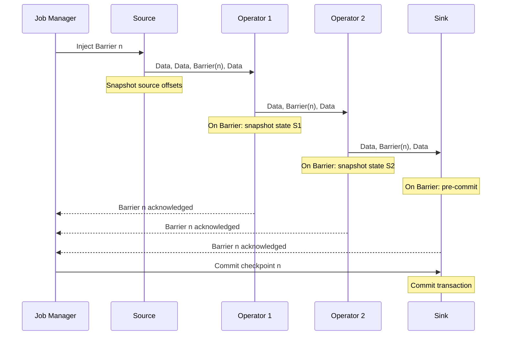
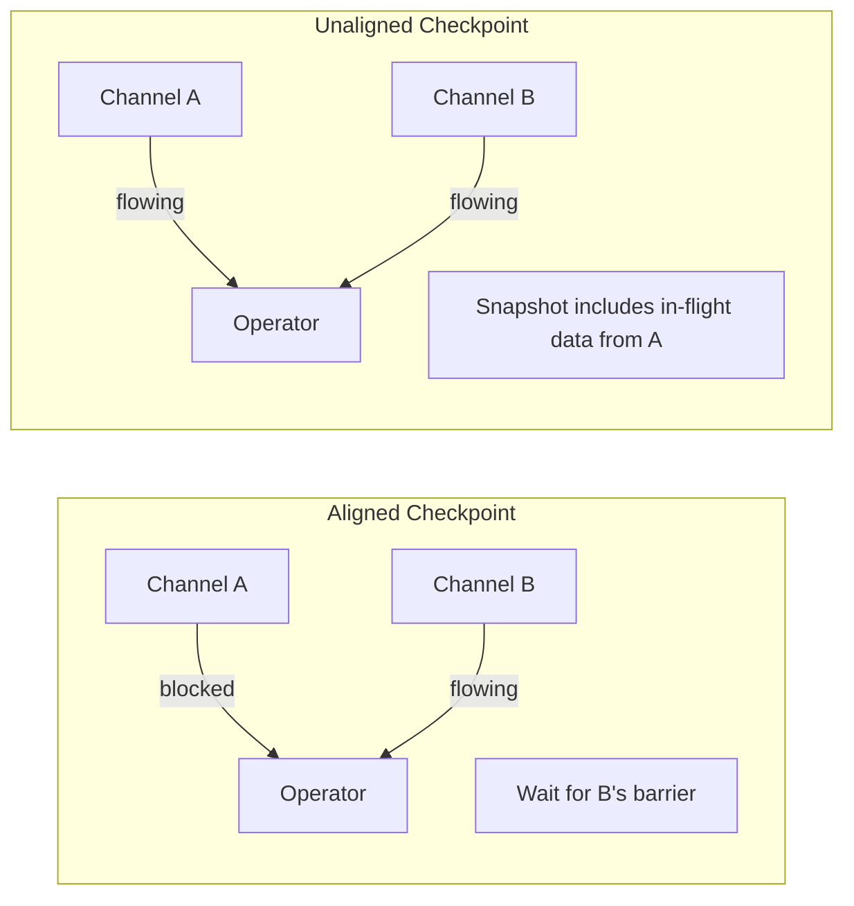
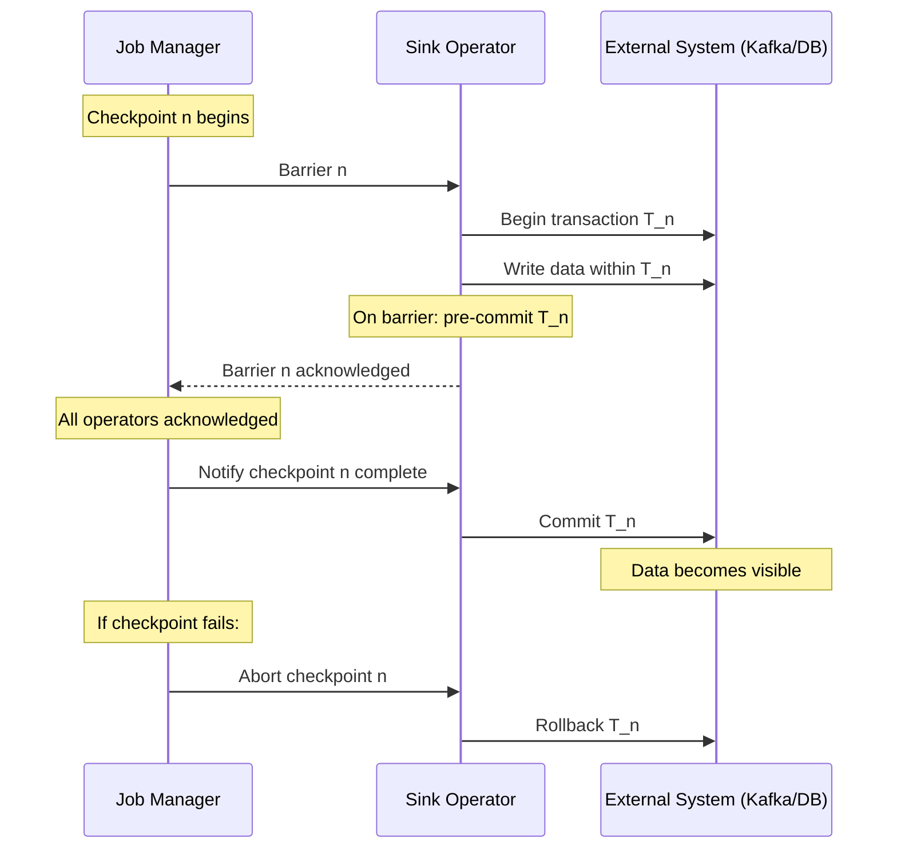
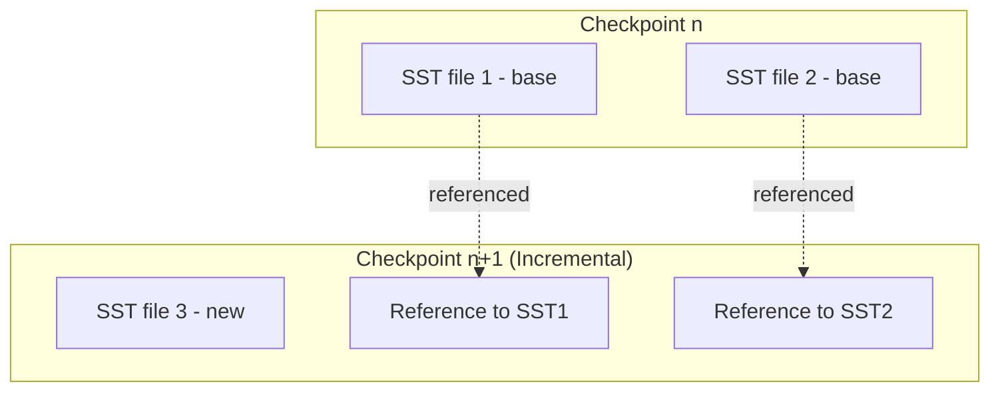
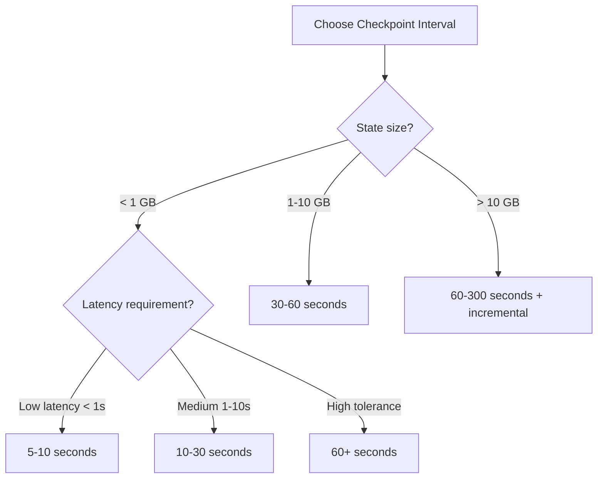

# Exactly-Once Stream Processing

## Why Exactly-Once Exists

In distributed systems, three delivery guarantees are commonly discussed:

1. **At-most-once:** Fire and forget. Events may be lost.
2. **At-least-once:** Retry on failure. Events may be duplicated.
3. **Exactly-once:** Each event is processed precisely once — no loss, no duplication.

The first two are straightforward to implement. Exactly-once is notoriously difficult because distributed systems face network partitions, node failures, and partial failures. The famous "Two Generals' Problem" proves that perfect agreement is impossible over unreliable channels.

Yet streaming applications — financial transactions, billing events, inventory management — require exactly-once semantics. The question is: how do we achieve it in practice?

### Historical Context

Early stream processors (Storm, S4) provided at-most-once or at-least-once guarantees. Storm's Trident layer added exactly-once through micro-batching, but with significant latency overhead. Apache Flink (2015) introduced distributed snapshots based on the Chandy-Lamport algorithm, enabling exactly-once without micro-batching. Kafka Streams achieved exactly-once through Kafka's idempotent producer and transactional APIs (KIP-98, 2017). Today, exactly-once is a solved problem for most practical use cases, but understanding the mechanics is essential for correct system design.

### The Key Insight

True exactly-once is impossible in the general case (you cannot prevent a side effect from happening more than once if the side effect is external). What streaming systems actually provide is **effectively-once** — the combination of:

1. Exactly-once **state updates** (via checkpointing)
2. Exactly-once **output** (via transactional sinks or idempotent writes)

## First Principles

### The Checkpoint Model

A checkpoint is a consistent snapshot of the entire pipeline state at a logical point in time:

$$
\text{Checkpoint } C_n = \{S_1^n, S_2^n, \ldots, S_k^n, O_1^n, O_2^n, \ldots, O_m^n\}
$$

Where:
- $S_i^n$ = state of operator $i$ at checkpoint $n$
- $O_j^n$ = offset/position of source $j$ at checkpoint $n$

On failure, the system restores from the latest successful checkpoint and replays events from the source offsets:

$$
\text{Recovery: } \forall i: S_i \leftarrow S_i^n, \quad \forall j: \text{seek}(j, O_j^n)
$$

### The Chandy-Lamport Algorithm

The distributed snapshot algorithm that underlies Flink's checkpointing:



**Key properties:**
1. **Barriers are injected into the data stream** — no pause needed
2. **Each operator snapshots state when it receives the barrier** — asynchronous
3. **Barriers align at operators with multiple inputs** — ensures consistency

### Barrier Alignment

For operators with multiple inputs, barrier alignment ensures that the state snapshot is consistent:

```typescript
enum AlignmentState {
  WAITING_FOR_BARRIERS = 'WAITING_FOR_BARRIERS',
  ALL_BARRIERS_RECEIVED = 'ALL_BARRIERS_RECEIVED',
}

interface CheckpointBarrier {
  checkpointId: number;
  timestamp: number;
}

class BarrierAligner {
  private receivedBarriers: Set<string> = new Set();
  private blockedChannels: Set<string> = new Set();
  private bufferedElements: Map<string, unknown[]> = new Map();

  constructor(private readonly inputChannels: string[]) {}

  /**
   * Process an incoming barrier from one input channel.
   * Returns true when all barriers have been received.
   */
  processBarrier(
    channelId: string,
    barrier: CheckpointBarrier,
  ): { aligned: boolean; bufferedData: Map<string, unknown[]> } {
    this.receivedBarriers.add(channelId);
    this.blockedChannels.add(channelId);

    if (this.receivedBarriers.size === this.inputChannels.length) {
      // All barriers received — snapshot state now
      const buffered = new Map(this.bufferedElements);
      this.reset();
      return { aligned: true, bufferedData: buffered };
    }

    return { aligned: false, bufferedData: new Map() };
  }

  /**
   * Buffer data from channels that have already sent their barrier.
   * Data from non-blocked channels is processed normally.
   */
  processElement(channelId: string, element: unknown): boolean {
    if (this.blockedChannels.has(channelId)) {
      // Buffer this element — it belongs to checkpoint n+1
      const buffer = this.bufferedElements.get(channelId) ?? [];
      buffer.push(element);
      this.bufferedElements.set(channelId, buffer);
      return false; // Element not processed yet
    }
    return true; // Process normally — belongs to checkpoint n
  }

  private reset(): void {
    this.receivedBarriers.clear();
    this.blockedChannels.clear();
    this.bufferedElements.clear();
  }
}
```

::: warning
Barrier alignment causes **backpressure** on channels that have received their barrier. This is the cost of exactly-once with aligned barriers. Flink 1.11+ introduced **unaligned checkpoints** that avoid this at the cost of larger checkpoint sizes.
:::

## Unaligned Checkpoints

Aligned checkpoints block fast channels while waiting for slow ones. Unaligned checkpoints avoid this by including in-flight data in the checkpoint:



**Tradeoffs:**

| Aspect | Aligned | Unaligned |
|--------|---------|-----------|
| Checkpoint latency | High under skew | Low, predictable |
| Checkpoint size | Smaller | Larger (includes buffers) |
| Processing latency | Spikes during alignment | Smooth |
| Recovery time | Faster (less state) | Slower (more state to restore) |

```typescript
interface UnalignedCheckpointState {
  operatorState: Uint8Array;
  inFlightBuffers: Map<string, Uint8Array[]>; // channel -> buffered elements
  sourceOffsets: Map<string, number>;
}

class UnalignedCheckpointCoordinator {
  /**
   * On receiving a barrier from ANY input, immediately:
   * 1. Snapshot operator state
   * 2. Capture all buffered elements in input/output channels
   * 3. Forward barrier to all outputs
   */
  onBarrier(
    channelId: string,
    barrier: CheckpointBarrier,
    operatorState: Uint8Array,
    inputBuffers: Map<string, Uint8Array[]>,
    outputBuffers: Map<string, Uint8Array[]>,
  ): UnalignedCheckpointState {
    return {
      operatorState,
      inFlightBuffers: new Map([...inputBuffers, ...outputBuffers]),
      sourceOffsets: new Map(), // populated by source operators
    };
  }

  /**
   * On recovery, restore in-flight data to the correct channels
   * before resuming processing.
   */
  restore(state: UnalignedCheckpointState): void {
    // 1. Restore operator state
    // 2. Re-inject buffered elements into their channels
    // 3. Seek sources to saved offsets
    for (const [channel, buffers] of state.inFlightBuffers) {
      for (const buffer of buffers) {
        this.reinjectToChannel(channel, buffer);
      }
    }
  }

  private reinjectToChannel(_channel: string, _data: Uint8Array): void {
    // Implementation: push data back into the channel's input buffer
  }
}
```

## Two-Phase Commit for Sinks

Checkpointing handles internal state, but what about external systems? If Flink commits a checkpoint but the sink has already written data, on recovery the data would be written again (duplicates).

The **two-phase commit** protocol ensures sinks participate in the checkpoint:



### Implementation: Kafka Exactly-Once Sink

```typescript
interface KafkaTransaction {
  id: string;
  state: 'active' | 'pre-committed' | 'committed' | 'aborted';
  records: Array<{ topic: string; key: string; value: string }>;
}

class ExactlyOnceKafkaSink {
  private currentTransaction: KafkaTransaction | null = null;
  private pendingTransactions: KafkaTransaction[] = [];
  private committedCheckpoints: Set<number> = new Set();

  constructor(
    private readonly transactionalId: string,
    private readonly producer: KafkaTransactionalProducer,
  ) {}

  /**
   * Called for each output record.
   * Writes within the current transaction.
   */
  async write(record: { topic: string; key: string; value: string }): Promise<void> {
    if (!this.currentTransaction) {
      this.currentTransaction = await this.beginTransaction();
    }
    this.currentTransaction.records.push(record);
    await this.producer.send(record, this.currentTransaction.id);
  }

  /**
   * Phase 1: Pre-commit on checkpoint barrier.
   * Flush all buffered records and mark transaction as pre-committed.
   */
  async preCommit(checkpointId: number): Promise<void> {
    if (!this.currentTransaction) return;

    await this.producer.flush(this.currentTransaction.id);
    this.currentTransaction.state = 'pre-committed';
    this.pendingTransactions.push(this.currentTransaction);
    this.currentTransaction = null;

    // Start a new transaction for the next checkpoint epoch
    this.currentTransaction = await this.beginTransaction();
  }

  /**
   * Phase 2: Commit when checkpoint is confirmed complete.
   */
  async commit(checkpointId: number): Promise<void> {
    this.committedCheckpoints.add(checkpointId);

    for (const tx of this.pendingTransactions) {
      if (tx.state === 'pre-committed') {
        await this.producer.commitTransaction(tx.id);
        tx.state = 'committed';
      }
    }

    // Clean up committed transactions
    this.pendingTransactions = this.pendingTransactions.filter(
      (tx) => tx.state !== 'committed',
    );
  }

  /**
   * Abort on checkpoint failure.
   */
  async abort(checkpointId: number): Promise<void> {
    for (const tx of this.pendingTransactions) {
      if (tx.state === 'pre-committed') {
        await this.producer.abortTransaction(tx.id);
        tx.state = 'aborted';
      }
    }
    this.pendingTransactions = [];
  }

  private async beginTransaction(): Promise<KafkaTransaction> {
    const id = `${this.transactionalId}-${Date.now()}`;
    await this.producer.beginTransaction(id);
    return { id, state: 'active', records: [] };
  }
}

// Type stubs for the Kafka producer interface
interface KafkaTransactionalProducer {
  beginTransaction(id: string): Promise<void>;
  send(record: { topic: string; key: string; value: string }, txId: string): Promise<void>;
  flush(txId: string): Promise<void>;
  commitTransaction(id: string): Promise<void>;
  abortTransaction(id: string): Promise<void>;
}
```

## Idempotent Sinks

An alternative to two-phase commit is making writes **idempotent**: writing the same data twice has the same effect as writing it once.

$$
f(f(x)) = f(x) \quad \text{(idempotency)}
$$

### Idempotent Database Writes

```typescript
interface IdempotentWrite {
  // Unique identifier derived deterministically from the input
  idempotencyKey: string;
  // The data to write
  payload: Record<string, unknown>;
}

class IdempotentDatabaseSink {
  constructor(private readonly db: Database) {}

  /**
   * Upsert pattern: INSERT ... ON CONFLICT DO UPDATE
   * The idempotency key ensures re-processing produces the same result.
   */
  async write(record: IdempotentWrite): Promise<void> {
    await this.db.query(
      `INSERT INTO output_table (idempotency_key, data, updated_at)
       VALUES ($1, $2, NOW())
       ON CONFLICT (idempotency_key)
       DO UPDATE SET data = EXCLUDED.data, updated_at = NOW()`,
      [record.idempotencyKey, JSON.stringify(record.payload)],
    );
  }

  /**
   * Generate deterministic idempotency key from event data.
   * CRITICAL: Must be the same across re-processing.
   */
  static generateKey(
    eventId: string,
    windowStart: number,
    windowEnd: number,
  ): string {
    return `${eventId}:${windowStart}:${windowEnd}`;
  }
}

interface Database {
  query(sql: string, params: unknown[]): Promise<void>;
}
```

### Idempotent vs. Transactional Sinks

| Aspect | Transactional (2PC) | Idempotent |
|--------|-------------------|------------|
| Complexity | High | Medium |
| Latency | Higher (transaction overhead) | Lower |
| Supported sinks | Must support transactions | Must support upserts |
| Exactly-once scope | Full pipeline | Per-sink |
| Recovery overhead | Rollback uncommitted | Re-write (no-op) |

## Checkpoint Storage & Performance

### Checkpoint Size Estimation

$$
\text{Checkpoint size} = \sum_{i=1}^{k} |S_i| + \sum_{j=1}^{m} |\text{offset}_j| + \text{metadata}
$$

Where:
- $|S_i|$ = serialized size of operator $i$'s state
- Key-value state: $|S_i| = \sum_{\text{keys}} (|\text{key}| + |\text{value}|)$
- Window state: $|S_i| = |\text{windows}| \times \text{avg\_window\_state}$

### Checkpoint Duration

$$
T_{\text{checkpoint}} = T_{\text{barrier\_propagation}} + T_{\text{snapshot}} + T_{\text{upload}}
$$

$$
T_{\text{barrier\_propagation}} = \frac{\text{pipeline\_depth}}{throughput} + \text{alignment\_delay}
$$

$$
T_{\text{upload}} = \frac{\text{checkpoint\_size}}{\text{upload\_bandwidth}}
$$

### Incremental Checkpoints

Full checkpoints serialize all state every time. Incremental checkpoints only serialize changes since the last checkpoint:

$$
\text{Incremental size} = \Delta S = S_n - S_{n-1}
$$

**RocksDB's SST file approach:**



```typescript
interface IncrementalCheckpoint {
  checkpointId: number;
  // New SST files created since last checkpoint
  newSstFiles: string[];
  // SST files from previous checkpoints still needed
  referencedSstFiles: Map<number, string[]>; // checkpointId -> files
  // Files that can be garbage collected
  obsoleteSstFiles: string[];
}

class IncrementalCheckpointManager {
  private checkpointHistory: IncrementalCheckpoint[] = [];

  async createIncrementalCheckpoint(
    currentCheckpointId: number,
    allSstFiles: string[],
    previousSstFiles: Set<string>,
  ): Promise<IncrementalCheckpoint> {
    const newFiles = allSstFiles.filter((f) => !previousSstFiles.has(f));
    const referencedFiles = allSstFiles.filter((f) => previousSstFiles.has(f));

    const checkpoint: IncrementalCheckpoint = {
      checkpointId: currentCheckpointId,
      newSstFiles: newFiles,
      referencedSstFiles: this.resolveReferences(referencedFiles),
      obsoleteSstFiles: this.findObsoleteFiles(allSstFiles),
    };

    // Only upload new SST files
    for (const file of newFiles) {
      await this.uploadToCheckpointStorage(file);
    }

    this.checkpointHistory.push(checkpoint);
    return checkpoint;
  }

  private resolveReferences(
    _files: string[],
  ): Map<number, string[]> {
    // Map each referenced file to the checkpoint that created it
    return new Map();
  }

  private findObsoleteFiles(_currentFiles: string[]): string[] {
    // Files in old checkpoints not referenced by any active checkpoint
    return [];
  }

  private async uploadToCheckpointStorage(_file: string): Promise<void> {
    // Upload to S3, HDFS, etc.
  }
}
```

### Benchmark: Checkpoint Performance

| State Size | Full Checkpoint | Incremental Checkpoint | Ratio |
|-----------|----------------|----------------------|-------|
| 1 GB | 5s | 0.5s | 10x |
| 10 GB | 45s | 2s | 22x |
| 100 GB | 8min | 10s | 48x |
| 1 TB | 80min | 30s | 160x |

::: tip
Always use incremental checkpoints for state sizes > 1 GB. The savings grow super-linearly because most state is unchanged between checkpoints.
:::

## Edge Cases & Failure Modes

### Checkpoint Timeout

If a checkpoint takes too long, the system must decide whether to fail the job or continue without that checkpoint:

```typescript
interface CheckpointConfig {
  intervalMs: number;          // How often to trigger checkpoints
  timeoutMs: number;           // Max time for a checkpoint to complete
  minPauseBetweenMs: number;   // Min time between checkpoints
  maxConcurrentCheckpoints: number;
  tolerableFailureCount: number; // How many consecutive failures before job fails
  externalizedCheckpoint: boolean; // Keep checkpoint on cancellation
}

const productionConfig: CheckpointConfig = {
  intervalMs: 60_000,           // Every minute
  timeoutMs: 600_000,          // 10 minute timeout
  minPauseBetweenMs: 30_000,   // At least 30s between
  maxConcurrentCheckpoints: 1, // No overlap
  tolerableFailureCount: 3,    // Fail after 3 consecutive failures
  externalizedCheckpoint: true,
};
```

### The Zombie Transaction Problem

After recovery, old sink transactions may still be pending in external systems:

```
Timeline:
1. Checkpoint n committed → Kafka transaction T_n committed
2. Processing continues, Kafka transaction T_{n+1} started
3. FAILURE! Before checkpoint n+1 completes
4. Recovery from checkpoint n
5. T_{n+1} is now a "zombie" — pre-committed but never committed

Problem: Kafka consumers with read_committed see T_{n+1}'s data
after the transaction timeout (default: 15 min)
```

**Solution: Fencing with epoch numbers**

```typescript
class FencedTransactionalProducer {
  private epoch: number = 0;

  /**
   * On recovery, increment the epoch.
   * Any transactions from previous epochs are automatically fenced (aborted).
   */
  async recover(): Promise<void> {
    this.epoch++;
    // The new producer with the same transactional.id but higher epoch
    // automatically aborts any pending transactions from previous epochs
    await this.initializeTransactionalProducer(
      `${this.transactionalId}-${this.epoch}`,
    );
  }

  private transactionalId: string = 'my-sink';

  private async initializeTransactionalProducer(_id: string): Promise<void> {
    // Kafka broker fences old producers with same transactional.id
  }
}
```

### Split-Brain During Checkpoint

If a network partition occurs during checkpointing, some operators may acknowledge while others don't:

$$
\text{Operators} = \{O_1, O_2, O_3, O_4\}
$$

$$
\text{Partition 1} = \{O_1, O_2\} \quad \text{ack'd checkpoint}
$$

$$
\text{Partition 2} = \{O_3, O_4\} \quad \text{timed out}
$$

The checkpoint coordinator must receive ALL acknowledgments to consider the checkpoint complete. Partial acknowledgment means checkpoint failure — safe, but wastes the work done by the acknowledged operators.

### Exactly-Once With Side Effects

The hardest case: your processing function has external side effects:

```typescript
// DANGEROUS: This breaks exactly-once
async function processEvent(event: Event): Promise<void> {
  await sendEmail(event.userId, 'Your order is confirmed'); // Side effect!
  await updateState(event); // State update
  // If failure occurs after email but before state update,
  // on recovery the email will be sent AGAIN
}

// CORRECT: Make side effects idempotent
async function processEventCorrectly(event: Event): Promise<void> {
  const emailId = `order-confirm-${event.orderId}`; // Deterministic ID
  await sendEmailIdempotent(emailId, event.userId, 'Your order is confirmed');
  await updateState(event);
}

// Or: defer side effects to the commit phase
async function processEventDeferred(event: Event): Promise<void> {
  await updateState(event);
  await bufferSideEffect({
    type: 'email',
    key: `order-confirm-${event.orderId}`,
    payload: { userId: event.userId, message: 'Your order is confirmed' },
  });
  // Side effects executed only after checkpoint commits
}
```

::: danger
HTTP calls, emails, SMS, push notifications — any non-idempotent side effect will be duplicated on recovery. Either make them idempotent (with unique keys) or defer them to after checkpoint confirmation.
:::

## Performance Characteristics

### Throughput Impact

Checkpointing reduces throughput due to:
1. Barrier alignment (blocking fast channels)
2. State serialization (CPU overhead)
3. State upload (I/O overhead)

$$
\text{Throughput}_{\text{effective}} = \text{Throughput}_{\text{raw}} \times \frac{T_{\text{interval}} - T_{\text{checkpoint}}}{T_{\text{interval}}}
$$

For a 60-second interval with 5-second checkpoints: $\frac{55}{60} = 91.7\%$ throughput.

### Recovery Time

$$
T_{\text{recovery}} = T_{\text{state\_restore}} + T_{\text{replay}}
$$

$$
T_{\text{replay}} = \frac{\text{events\_since\_last\_checkpoint}}{\text{throughput}}
$$

$$
\text{events\_since\_last\_checkpoint} = \text{throughput} \times T_{\text{interval}}
$$

**Lower checkpoint interval = faster recovery but higher overhead.**

## Mathematical Foundations

### Chandy-Lamport Correctness Proof

The algorithm produces a **consistent cut** — a global state that could have occurred during execution.

**Definition:** A cut $C$ is consistent if for every event $e$ in $C$, all events that causally precede $e$ are also in $C$:

$$
\forall e \in C: \text{causes}(e) \subseteq C
$$

**Proof sketch:**
1. Barriers travel through the same channels as data
2. An operator snapshots state only after receiving barriers from ALL inputs
3. Therefore, the snapshot includes exactly the events that arrived before the barrier
4. No event after the barrier is included in the snapshot
5. This forms a consistent cut because the barrier ordering respects causal ordering

### Exactly-Once as Idempotent Replay

The system provides exactly-once through:

$$
\text{replay}(C_n, E_{n+1}) = C_{n+1}
$$

where $C_n$ is the checkpoint state and $E_{n+1}$ are the events between checkpoints. Because:
1. $C_n$ is deterministic (consistent snapshot)
2. Replay is deterministic (same events, same order)
3. $C_{n+1}$ is the same regardless of how many times replay occurs

$$
\text{replay}(\text{replay}(C_n, E_{n+1}), \emptyset) = \text{replay}(C_n, E_{n+1})
$$

## Real-World War Stories

::: info War Story
**The Double-Charge Incident**

A payment processing company migrated from at-least-once to exactly-once processing. During the migration, they kept the old at-least-once idempotency layer "just in case." After the migration, they removed the idempotency layer since "Flink provides exactly-once."

Three months later, a Flink cluster upgrade caused a 20-minute outage. During recovery, the checkpoint was corrupted and the job restarted from an older checkpoint. Without the idempotency layer, 47,000 transactions were processed twice, resulting in double charges totaling $2.3M.

**Lesson:** Exactly-once in the streaming layer does NOT eliminate the need for idempotency at the sink. Defense in depth. Always.
:::

::: info War Story
**The 100GB Checkpoint That Wouldn't Complete**

A team running a session windowing job with millions of active sessions found that checkpoints started failing after 3 months in production. The session state had grown to 100 GB, and checkpoints couldn't complete within the 10-minute timeout.

Timeline:
- Month 1: Checkpoint = 2 GB, duration = 30s
- Month 2: Checkpoint = 20 GB, duration = 3min
- Month 3: Checkpoint = 100 GB, duration = timeout

**Root cause:** Session windows for bot users never closed (bots never went inactive). A single bot session accumulated 3 months of events.

**Fix:**
1. Switched to incremental checkpoints (100 GB → 500 MB incremental)
2. Added maximum session duration TTL (24 hours)
3. Added state size monitoring with alerts
:::

::: info War Story
**The Exactly-Once That Wasn't**

A team believed they had end-to-end exactly-once because Flink checkpointing was enabled. But their sink wrote to Elasticsearch using the bulk API without idempotency keys. On every checkpoint recovery, the replay period wrote duplicate documents to Elasticsearch.

Over 6 months, 12% of their analytics data was duplicated. They only discovered it when a user reported that their dashboard showed impossible numbers.

**Root cause:** Exactly-once checkpointing only guarantees consistent internal state. The Elasticsearch sink was not part of the checkpoint (no 2PC support).

**Fix:** Added document IDs derived from event ID + window boundaries, making Elasticsearch writes idempotent via `PUT /{index}/_doc/{id}`.
:::

## Decision Framework

### Choosing the Right Guarantee

| Scenario | Required Guarantee | Implementation |
|----------|-------------------|----------------|
| Log aggregation, metrics | At-least-once | Simple, no checkpointing overhead |
| User analytics, dashboards | At-least-once + dedup | Idempotent sinks |
| Financial transactions | Exactly-once | Checkpointing + transactional sinks |
| Regulatory compliance | Exactly-once + audit | Full 2PC + audit log |
| Ad impressions, clicks | At-least-once + dedup | Bloom filter deduplication |

### Checkpoint Interval Selection



## Advanced Topics

### Exactly-Once Across Multiple Sinks

When a pipeline writes to multiple sinks, each sink must participate in the checkpoint:

```typescript
class MultiSinkCheckpointCoordinator {
  private sinks: Map<string, TransactionalSink> = new Map();

  registerSink(name: string, sink: TransactionalSink): void {
    this.sinks.set(name, sink);
  }

  async preCommitAll(checkpointId: number): Promise<boolean> {
    const results = await Promise.allSettled(
      Array.from(this.sinks.entries()).map(([name, sink]) =>
        sink.preCommit(checkpointId).then(() => ({ name, success: true })),
      ),
    );

    const failures = results.filter((r) => r.status === 'rejected');
    if (failures.length > 0) {
      // Any pre-commit failure → abort all
      await this.abortAll(checkpointId);
      return false;
    }
    return true;
  }

  async commitAll(checkpointId: number): Promise<void> {
    // Commit all sinks — if any fails, it will be retried on recovery
    await Promise.all(
      Array.from(this.sinks.values()).map((sink) =>
        sink.commit(checkpointId),
      ),
    );
  }

  async abortAll(checkpointId: number): Promise<void> {
    await Promise.allSettled(
      Array.from(this.sinks.values()).map((sink) =>
        sink.abort(checkpointId),
      ),
    );
  }
}

interface TransactionalSink {
  preCommit(checkpointId: number): Promise<void>;
  commit(checkpointId: number): Promise<void>;
  abort(checkpointId: number): Promise<void>;
}
```

### Savepoints vs. Checkpoints

| Aspect | Checkpoint | Savepoint |
|--------|-----------|-----------|
| Triggered by | System (periodic) | User (manual) |
| Purpose | Fault tolerance | Operational (upgrades, migration) |
| Format | Optimized (incremental) | Portable (full) |
| Retained | Last N checkpoints | Until explicitly deleted |
| State mapping | Automatic | Can remap operator IDs |

### Research: Lightweight Asynchronous Snapshots

Recent research (Carbone et al.) explores snapshot algorithms that avoid barrier alignment entirely by using **output determinism** — tracking which outputs each operator has produced, rather than synchronizing with barriers. This promises lower checkpoint latency for high-throughput pipelines but requires deterministic operators.

$$
\text{Snapshot}_{async}(O_i) = (S_i, \text{output\_log}_i[C_{n-1}:C_n])
$$

On recovery, operators replay their output logs to reconstruct the downstream state, avoiding the need for synchronized barriers.

## Cross-References

- [State Management](./state-management.md) — State backends for checkpoint storage
- [Watermarks](./watermarks.md) — Watermark consistency across checkpoints
- [Windowing](./windowing.md) — Window state in checkpoints
- [Backpressure](./backpressure.md) — Checkpoint barrier alignment and backpressure
- [CDC Patterns](../pipeline-patterns/cdc-patterns.md) — Exactly-once with CDC sources
