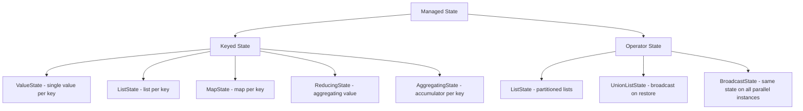
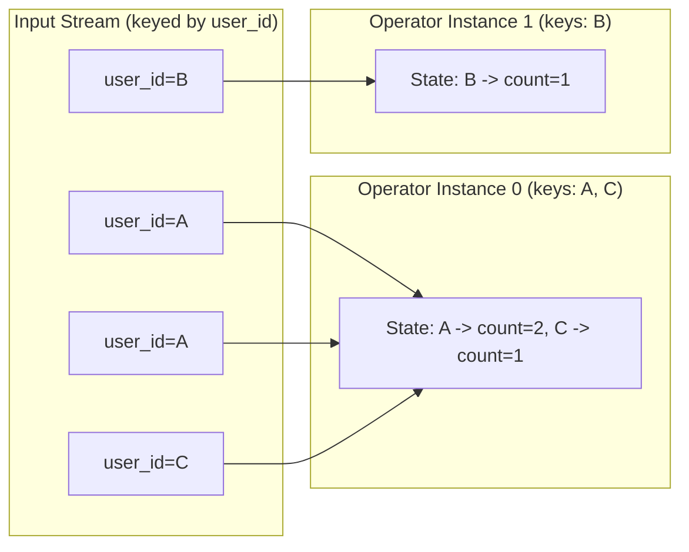
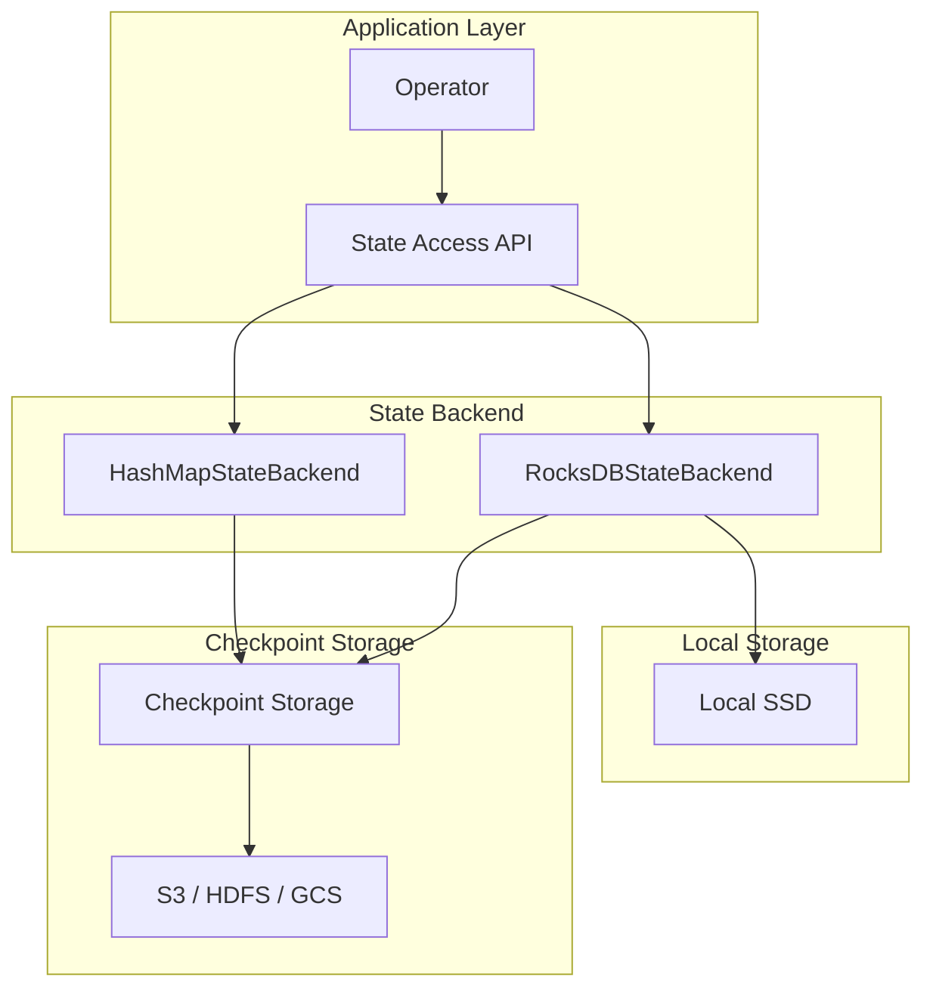
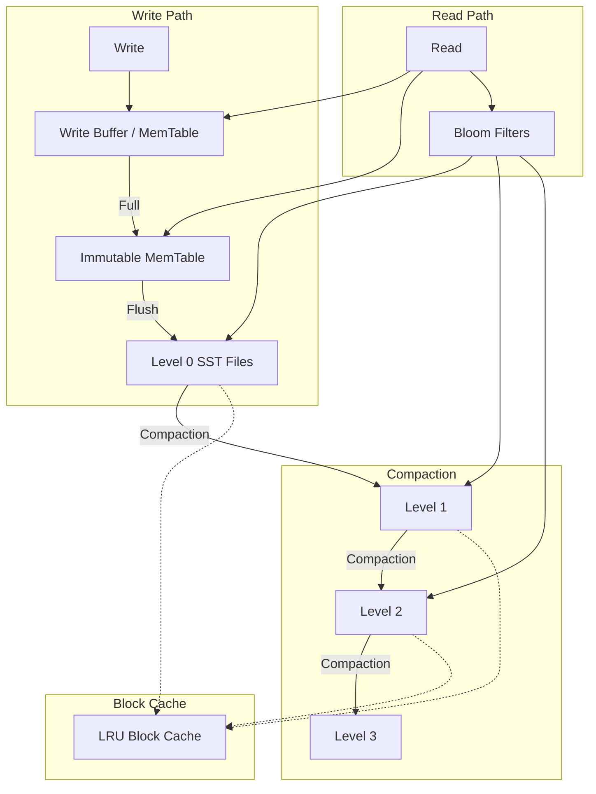
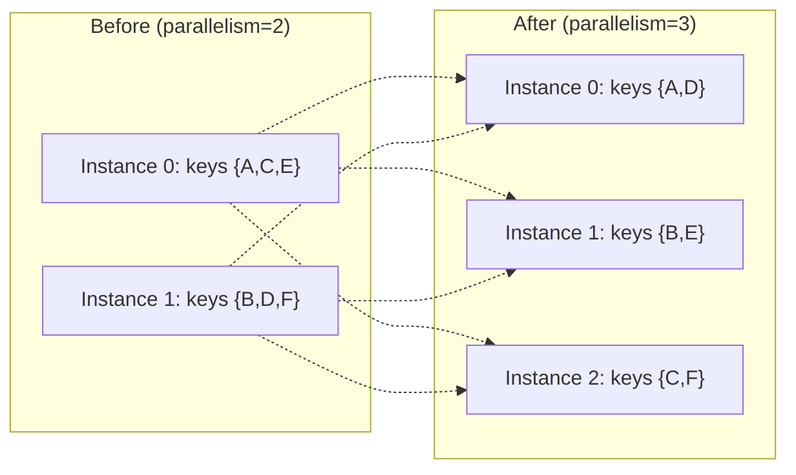
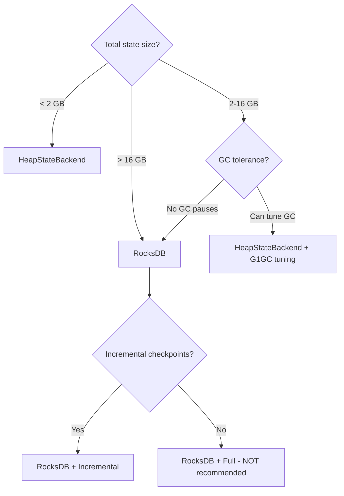

# Stream Processing State Management

## Why State Management Exists

Stateless stream processing is trivial — apply a function to each element independently. But most useful streaming operations are stateful:

- **Aggregations:** Sum, count, average over a window
- **Joins:** Match events from two streams within a time window
- **Pattern detection:** Identify sequences of events (CEP)
- **Deduplication:** Track seen event IDs
- **Session tracking:** Maintain per-user session state

Without managed state, operators would need to query external databases for every event, destroying throughput (network round-trips dominate). Managed state colocates computation and data, enabling millions of stateful operations per second.

### Historical Context

Early stream processors (Storm) had no built-in state management — users implemented their own using Redis or Cassandra. This was error-prone and impossible to make consistent with processing semantics. Apache Samza (2014) introduced local state stores backed by RocksDB. Flink (2015) formalized managed state with automatic checkpointing and exactly-once guarantees. Today, managed state is a core feature of every production stream processor.

## First Principles

### State Categories

Stream processing state falls into two categories:



**Keyed state** is partitioned by key. Each key has its own isolated state that is only accessible when processing elements with that key. This enables:
- Automatic key-based partitioning across parallel instances
- No synchronization needed between keys
- Horizontal scalability

**Operator state** is bound to an operator instance, not a key. Used for:
- Source offsets (Kafka consumer positions)
- Buffer state
- Global counters

### State Partitioning

In a parallel stream processor, keyed state is distributed across operator instances by key:

$$
\text{instance}(k) = \text{hash}(k) \bmod P
$$

where $P$ is the parallelism (number of instances).



## Core State Interfaces

### Keyed State Types

```typescript
// Core state interfaces
interface ValueState<T> {
  value(): T | null;
  update(value: T): void;
  clear(): void;
}

interface ListState<T> {
  get(): Iterable<T>;
  add(value: T): void;
  addAll(values: T[]): void;
  update(values: T[]): void;
  clear(): void;
}

interface MapState<K, V> {
  get(key: K): V | null;
  put(key: K, value: V): void;
  putAll(entries: Map<K, V>): void;
  remove(key: K): void;
  contains(key: K): boolean;
  keys(): Iterable<K>;
  values(): Iterable<V>;
  entries(): Iterable<[K, V]>;
  isEmpty(): boolean;
  clear(): void;
}

interface ReducingState<T> {
  get(): T | null;
  add(value: T): void; // Applies the reduce function
  clear(): void;
}

interface AggregatingState<IN, OUT> {
  get(): OUT | null;
  add(value: IN): void; // Applies the aggregate function
  clear(): void;
}

// State descriptor — metadata for state registration
interface StateDescriptor<T> {
  name: string;
  defaultValue: T;
  serializer?: Serializer<T>;
  ttlConfig?: StateTtlConfig;
}

interface StateTtlConfig {
  ttl: number; // milliseconds
  updateType: 'OnCreateAndWrite' | 'OnReadAndWrite';
  stateVisibility: 'NeverReturnExpired' | 'ReturnExpiredIfNotCleanedUp';
  cleanupStrategy: 'FullSnapshot' | 'IncrementalCleanup' | 'RocksdbCompaction';
}
```

### Practical Stateful Operator

```typescript
interface RuntimeContext {
  getState<T>(descriptor: StateDescriptor<T>): ValueState<T>;
  getListState<T>(descriptor: StateDescriptor<T[]>): ListState<T>;
  getMapState<K, V>(descriptor: StateDescriptor<Map<K, V>>): MapState<K, V>;
  getReducingState<T>(
    descriptor: StateDescriptor<T>,
    reducer: (a: T, b: T) => T,
  ): ReducingState<T>;
}

class UserSessionTracker {
  private sessionState!: ValueState<UserSession>;
  private eventBuffer!: ListState<SessionEvent>;
  private featureMap!: MapState<string, number>;

  open(ctx: RuntimeContext): void {
    this.sessionState = ctx.getState<UserSession>({
      name: 'session',
      defaultValue: { startTime: 0, eventCount: 0, totalDuration: 0 },
      ttlConfig: {
        ttl: 24 * 60 * 60 * 1000, // 24 hours
        updateType: 'OnCreateAndWrite',
        stateVisibility: 'NeverReturnExpired',
        cleanupStrategy: 'RocksdbCompaction',
      },
    });

    this.eventBuffer = ctx.getListState<SessionEvent>({
      name: 'events',
      defaultValue: [],
    });

    this.featureMap = ctx.getMapState<string, number>({
      name: 'features',
      defaultValue: new Map(),
    });
  }

  processElement(event: SessionEvent): SessionOutput | null {
    const session = this.sessionState.value() ?? {
      startTime: event.timestamp,
      eventCount: 0,
      totalDuration: 0,
    };

    session.eventCount += 1;
    session.totalDuration = event.timestamp - session.startTime;

    // Track feature usage
    const currentCount = this.featureMap.get(event.feature) ?? 0;
    this.featureMap.put(event.feature, currentCount + 1);

    // Buffer events for pattern detection
    this.eventBuffer.add(event);

    this.sessionState.update(session);

    // Emit session summary every 100 events
    if (session.eventCount % 100 === 0) {
      return {
        sessionDuration: session.totalDuration,
        eventCount: session.eventCount,
        topFeatures: this.getTopFeatures(5),
      };
    }
    return null;
  }

  private getTopFeatures(n: number): Array<[string, number]> {
    const features: Array<[string, number]> = [];
    for (const [key, value] of this.featureMap.entries()) {
      features.push([key, value]);
    }
    return features.sort((a, b) => b[1] - a[1]).slice(0, n);
  }
}

interface UserSession {
  startTime: number;
  eventCount: number;
  totalDuration: number;
}

interface SessionEvent {
  userId: string;
  feature: string;
  timestamp: number;
}

interface SessionOutput {
  sessionDuration: number;
  eventCount: number;
  topFeatures: Array<[string, number]>;
}
```

## State Backends

### Architecture Overview



### HashMapStateBackend (Heap-Based)

State is stored in Java/JVM HashMap objects on the heap.

**Characteristics:**
- **Speed:** Fastest access — direct object references
- **Capacity:** Limited by JVM heap size (typically 1-16 GB useful)
- **Serialization:** Only during checkpoints
- **GC pressure:** High for large state (GC pauses)

```typescript
class HeapStateBackend<K, V> {
  private state: Map<string, Map<K, V>> = new Map();

  getOrCreateNamespace(namespace: string): Map<K, V> {
    let ns = this.state.get(namespace);
    if (!ns) {
      ns = new Map();
      this.state.set(namespace, ns);
    }
    return ns;
  }

  get(namespace: string, key: K): V | undefined {
    return this.state.get(namespace)?.get(key);
  }

  put(namespace: string, key: K, value: V): void {
    this.getOrCreateNamespace(namespace).set(key, value);
  }

  delete(namespace: string, key: K): void {
    this.state.get(namespace)?.delete(key);
  }

  /**
   * Snapshot all state for checkpointing.
   * BLOCKS processing during serialization for heap backend.
   */
  snapshot(): Map<string, Map<K, V>> {
    // Deep copy — this is the expensive part
    const copy = new Map<string, Map<K, V>>();
    for (const [ns, map] of this.state) {
      copy.set(ns, new Map(map));
    }
    return copy;
  }

  getMemoryUsage(): number {
    let size = 0;
    for (const [, map] of this.state) {
      size += map.size; // Approximate — actual memory depends on object sizes
    }
    return size;
  }
}
```

### RocksDB State Backend

State is stored in RocksDB — an embedded key-value store that uses LSM trees with SSD storage.

**Characteristics:**
- **Speed:** Slower than heap (serialization on every access)
- **Capacity:** Limited only by disk space (terabytes)
- **Serialization:** On every read/write
- **GC pressure:** Minimal — data lives outside the heap
- **Checkpointing:** Incremental (SST file upload)

```typescript
interface RocksDBConfig {
  // Memory management
  blockCacheSize: number;        // Read cache (default: 8 MB per slot)
  writeBufferSize: number;       // Write buffer (default: 64 MB)
  writeBufferCount: number;      // Number of write buffers (default: 2)
  maxOpenFiles: number;          // File handle limit (default: -1 = unlimited)

  // Compaction
  compactionStyle: 'level' | 'universal' | 'fifo';
  targetFileSizeBase: number;    // SST file target size (default: 64 MB)
  maxBytesForLevelBase: number;  // L1 size limit (default: 256 MB)
  levelCompactionDynamicLevelBytes: boolean;

  // Performance tuning
  bloomFilterBitsPerKey: number; // Bloom filter bits (default: 10)
  blockSize: number;             // Block size in SST files (default: 4 KB)
  compressionType: 'none' | 'snappy' | 'lz4' | 'zstd';
}

const productionRocksDBConfig: RocksDBConfig = {
  blockCacheSize: 256 * 1024 * 1024,     // 256 MB block cache
  writeBufferSize: 128 * 1024 * 1024,    // 128 MB write buffer
  writeBufferCount: 3,
  maxOpenFiles: 5000,
  compactionStyle: 'level',
  targetFileSizeBase: 128 * 1024 * 1024,
  maxBytesForLevelBase: 512 * 1024 * 1024,
  levelCompactionDynamicLevelBytes: true,
  bloomFilterBitsPerKey: 10,
  blockSize: 16 * 1024,                  // 16 KB blocks
  compressionType: 'lz4',
};
```

### RocksDB LSM Tree Internals



**Write amplification:**

$$
\text{Write Amplification} = \frac{\text{bytes written to disk}}{\text{bytes written by application}}
$$

For level compaction:

$$
WA \approx 1 + \frac{\text{size\_ratio} \times (\text{num\_levels} - 1)}{1} \approx 10\text{-}30\times
$$

**Read amplification:**

$$
\text{Read Amplification} = L_0\text{ files} + \text{num\_levels} \approx 5\text{-}15 \text{ reads}
$$

Bloom filters reduce this dramatically:

$$
\text{Read Amplification}_{\text{bloom}} \approx 1 + \text{FPR} \times (\text{num\_levels} - 1)
$$

With FPR (false positive rate) at 1%: $\approx 1.05$ reads on average for point queries.

### State Backend Comparison

| Metric | HeapStateBackend | RocksDBStateBackend |
|--------|-----------------|-------------------|
| Read latency | ~10 ns | ~1-10 us (100-1000x slower) |
| Write latency | ~10 ns | ~1-10 us |
| Max state size | ~16 GB (heap) | Terabytes (disk) |
| Checkpoint type | Full only | Incremental |
| Checkpoint speed | Slow (serialize all) | Fast (upload new SSTs) |
| GC impact | Severe at >4 GB | Negligible |
| CPU overhead | Minimal | Serialization on every access |

::: tip
**Rule of thumb:** Use HeapStateBackend if state fits in 2-4 GB per TaskManager. Use RocksDB for anything larger. In production, RocksDB is almost always the right choice due to incremental checkpoints and predictable memory usage.
:::

## State TTL (Time-To-Live)

State that is never cleaned up grows unboundedly. TTL automatically expires old state:

```typescript
class StateTTLManager<K, V> {
  private state: Map<K, { value: V; lastAccess: number; lastWrite: number }> =
    new Map();

  constructor(
    private readonly ttlMs: number,
    private readonly updateType: 'OnCreateAndWrite' | 'OnReadAndWrite',
  ) {}

  get(key: K): V | null {
    const entry = this.state.get(key);
    if (!entry) return null;

    const now = Date.now();
    const relevantTime =
      this.updateType === 'OnReadAndWrite'
        ? entry.lastAccess
        : entry.lastWrite;

    if (now - relevantTime > this.ttlMs) {
      this.state.delete(key);
      return null; // Expired
    }

    if (this.updateType === 'OnReadAndWrite') {
      entry.lastAccess = now;
    }

    return entry.value;
  }

  put(key: K, value: V): void {
    const now = Date.now();
    this.state.set(key, {
      value,
      lastAccess: now,
      lastWrite: now,
    });
  }

  /**
   * Background cleanup — run periodically to reclaim memory.
   * Incremental: process N entries per invocation to avoid latency spikes.
   */
  incrementalCleanup(maxEntriesToProcess: number): number {
    const now = Date.now();
    let processed = 0;
    let cleaned = 0;

    for (const [key, entry] of this.state) {
      if (processed >= maxEntriesToProcess) break;

      const relevantTime =
        this.updateType === 'OnReadAndWrite'
          ? entry.lastAccess
          : entry.lastWrite;

      if (now - relevantTime > this.ttlMs) {
        this.state.delete(key);
        cleaned++;
      }
      processed++;
    }

    return cleaned;
  }
}
```

### TTL Cleanup Strategies

| Strategy | When Cleanup Runs | Latency Impact | Completeness |
|----------|------------------|----------------|-------------|
| Full Snapshot | During checkpoint | High spike | Complete |
| Incremental | Per-record (N entries) | Low per-record | Gradual |
| RocksDB Compaction | During compaction | Background | Complete |

## State Migration & Schema Evolution

### Rescaling State

When changing parallelism, state must be redistributed:



**Keyed state rescaling:** Key groups are redistributed. Each key group maps to exactly one operator instance:

$$
\text{key\_group}(k) = \text{hash}(k) \bmod \text{max\_parallelism}
$$

$$
\text{instance}(kg) = \left\lfloor \frac{kg \times P}{\text{max\_parallelism}} \right\rfloor
$$

where $P$ is the current parallelism and max_parallelism is the configured upper bound.

### State Schema Evolution

When the state schema changes (e.g., adding a field), the system must migrate existing state:

```typescript
// Version 1 state schema
interface UserStateV1 {
  version: 1;
  userId: string;
  loginCount: number;
}

// Version 2 state schema (added lastLogin field)
interface UserStateV2 {
  version: 2;
  userId: string;
  loginCount: number;
  lastLogin: number; // NEW FIELD
}

// Version 3 (renamed field, added email)
interface UserStateV3 {
  version: 3;
  userId: string;
  totalLogins: number; // RENAMED from loginCount
  lastLogin: number;
  email: string | null; // NEW FIELD
}

type UserState = UserStateV1 | UserStateV2 | UserStateV3;

class StateMigrator {
  migrate(state: UserState): UserStateV3 {
    let current: UserState = state;

    if (current.version === 1) {
      current = this.v1ToV2(current);
    }
    if (current.version === 2) {
      current = this.v2ToV3(current);
    }

    return current as UserStateV3;
  }

  private v1ToV2(state: UserStateV1): UserStateV2 {
    return {
      version: 2,
      userId: state.userId,
      loginCount: state.loginCount,
      lastLogin: 0, // Default value for new field
    };
  }

  private v2ToV3(state: UserStateV2): UserStateV3 {
    return {
      version: 3,
      userId: state.userId,
      totalLogins: state.loginCount, // Renamed field
      lastLogin: state.lastLogin,
      email: null, // Default value
    };
  }
}
```

## Performance Characteristics

### State Access Patterns

The performance of state access depends heavily on access patterns:

| Pattern | HeapBackend | RocksDB | Recommendation |
|---------|-------------|---------|----------------|
| Point lookup | O(1) ~10ns | O(1) ~5us | Heap if small |
| Range scan | O(n) | O(n) but sorted | RocksDB |
| High write rate | O(1) ~10ns | O(1) ~5us amortized | Either |
| Large values | GC pressure | Efficient | RocksDB |
| Many small keys | Fine | Key overhead | Merge state |

### Memory Budget Calculation

For RocksDB state backend:

$$
\text{Memory}_{\text{total}} = \text{block\_cache} + \text{write\_buffers} + \text{index\_filters}
$$

$$
\text{write\_buffers} = \text{write\_buffer\_size} \times \text{write\_buffer\_count} \times \text{state\_count}
$$

$$
\text{index\_filters} \approx 0.05 \times \text{total\_state\_size}
$$

Example: 10 GB state, 128 MB write buffer, 2 buffers, 3 state descriptors:

$$
\text{write\_buffers} = 128 \text{ MB} \times 2 \times 3 = 768 \text{ MB}
$$

$$
\text{index\_filters} = 0.05 \times 10 \text{ GB} = 512 \text{ MB}
$$

$$
\text{block\_cache} = 256 \text{ MB (configured)}
$$

$$
\text{Total} = 256 + 768 + 512 = 1,536 \text{ MB} = 1.5 \text{ GB}
$$

::: warning
RocksDB memory usage can exceed expectations. The managed memory fraction in Flink controls the total RocksDB memory budget. Set `state.backend.rocksdb.memory.managed: true` to let Flink manage it.
:::

### Serialization Overhead

RocksDB requires serialization on every state access:

$$
\text{Overhead}_{\text{per\_access}} = T_{\text{serialize}} + T_{\text{rocksdb}} + T_{\text{deserialize}}
$$

For a typical 100-byte state value:

$$
T_{\text{serialize}} \approx 200\text{ ns}
$$

$$
T_{\text{rocksdb}} \approx 3\text{ us (cache hit)} \text{ or } 50\text{ us (cache miss)}
$$

$$
T_{\text{deserialize}} \approx 200\text{ ns}
$$

**Optimization: Reduce serialization frequency**

```typescript
class BatchedStateAccessor<K, V> {
  private localCache: Map<K, V> = new Map();
  private dirty: Set<K> = new Set();

  constructor(private readonly backend: MapState<K, V>) {}

  get(key: K): V | null {
    // Check local cache first
    if (this.localCache.has(key)) {
      return this.localCache.get(key)!;
    }
    // Cache miss: go to RocksDB
    const value = this.backend.get(key);
    if (value !== null) {
      this.localCache.set(key, value);
    }
    return value;
  }

  put(key: K, value: V): void {
    this.localCache.set(key, value);
    this.dirty.add(key);
  }

  /**
   * Flush dirty entries to backend.
   * Call at the end of processing each element.
   */
  flush(): void {
    for (const key of this.dirty) {
      const value = this.localCache.get(key);
      if (value !== undefined) {
        this.backend.put(key, value);
      }
    }
    this.dirty.clear();
    // Optionally evict cache entries to limit memory
    if (this.localCache.size > 10000) {
      this.localCache.clear();
    }
  }
}
```

## Edge Cases & Failure Modes

### State Size Explosion

**Symptom:** Checkpoint size grows linearly over time, eventually causing timeouts.

**Common causes:**
1. Missing TTL configuration
2. Session windows that never close
3. Deduplication state without expiry
4. ListState that only appends, never truncates

```typescript
class StateMonitor {
  private stateSizeHistory: Array<{ timestamp: number; sizeBytes: number }> = [];

  recordCheckpointSize(sizeBytes: number): void {
    this.stateSizeHistory.push({ timestamp: Date.now(), sizeBytes });
  }

  detectGrowthAnomaly(): {
    isGrowing: boolean;
    growthRatePerHour: number;
    estimatedTimeToLimit: number;
  } {
    if (this.stateSizeHistory.length < 10) {
      return { isGrowing: false, growthRatePerHour: 0, estimatedTimeToLimit: Infinity };
    }

    const recent = this.stateSizeHistory.slice(-10);
    const oldest = recent[0];
    const newest = recent[recent.length - 1];

    const durationHours =
      (newest.timestamp - oldest.timestamp) / (3600 * 1000);
    const growthRatePerHour =
      (newest.sizeBytes - oldest.sizeBytes) / durationHours;

    const stateLimit = 100 * 1024 * 1024 * 1024; // 100 GB
    const estimatedTimeToLimit =
      growthRatePerHour > 0
        ? (stateLimit - newest.sizeBytes) / growthRatePerHour
        : Infinity;

    return {
      isGrowing: growthRatePerHour > 1024 * 1024, // Growing > 1 MB/hour
      growthRatePerHour,
      estimatedTimeToLimit,
    };
  }
}
```

### Hot Keys

When a few keys receive disproportionate traffic, the operator instances handling those keys become bottlenecks:

$$
\text{Skew factor} = \frac{\max_i(\text{events for instance } i)}{\text{avg events per instance}}
$$

A skew factor > 3 indicates a hot key problem.

**Mitigation: Key splitting**

```typescript
class HotKeyDetector<K> {
  private keyCounts: Map<string, number> = new Map();
  private totalCount: number = 0;

  recordKey(key: K): void {
    const keyStr = String(key);
    this.keyCounts.set(keyStr, (this.keyCounts.get(keyStr) ?? 0) + 1);
    this.totalCount++;
  }

  getHotKeys(thresholdMultiplier: number): string[] {
    const avgCount = this.totalCount / this.keyCounts.size;
    const threshold = avgCount * thresholdMultiplier;

    const hotKeys: string[] = [];
    for (const [key, count] of this.keyCounts) {
      if (count > threshold) {
        hotKeys.push(key);
      }
    }
    return hotKeys;
  }

  /**
   * Split a hot key into N sub-keys for parallel processing.
   * Requires a combine step to merge results.
   */
  static splitKey<K>(key: K, numSplits: number): Array<{ originalKey: K; splitId: number }> {
    return Array.from({ length: numSplits }, (_, i) => ({
      originalKey: key,
      splitId: i,
    }));
  }
}
```

### Corrupted State

State corruption can occur due to serialization bugs, version mismatches, or storage failures:

```typescript
class StateValidator<T> {
  constructor(
    private readonly validate: (state: T) => boolean,
    private readonly repair: (state: T) => T,
  ) {}

  accessWithValidation(state: ValueState<T>): T | null {
    const value = state.value();
    if (value === null) return null;

    if (!this.validate(value)) {
      console.error('Corrupted state detected, attempting repair');
      const repaired = this.repair(value);
      state.update(repaired);
      return repaired;
    }

    return value;
  }
}

// Example: validate that counts are non-negative
const counterValidator = new StateValidator<{ count: number }>(
  (state) => state.count >= 0,
  (state) => ({ count: Math.max(0, state.count) }),
);
```

## Mathematical Foundations

### State Consistency Model

For a stream processing system with state, the consistency model is defined by:

**Sequential consistency:** The result of execution is the same as if all operations were executed in some sequential order, consistent with the program order of each individual operator.

$$
\forall \text{op}_1, \text{op}_2: \text{op}_1 \prec \text{op}_2 \implies S(\text{op}_1) \text{ happens before } S(\text{op}_2)
$$

where $\prec$ is the happens-before relation.

With checkpointing:

$$
C_n \text{ is consistent} \iff \forall \text{op}_i, \text{op}_j: \text{the state snapshot is a consistent cut}
$$

### State Space Complexity

For keyed state with $K$ keys, each with state size $s$:

$$
\text{Total state} = K \times s + O(K) \text{ (metadata overhead)}
$$

For window state:

$$
\text{Window state} = K \times W \times \text{avg\_elements\_per\_window} \times \text{element\_size}
$$

where $W$ is the average number of active windows per key.

## Real-World War Stories

::: info War Story
**The 2 TB State Nightmare**

A ride-sharing company maintained per-driver state including location history, current ride details, and driver score. With 5 million active drivers and growing state per driver, the total state grew to 2 TB.

Problems:
1. Checkpoints took 15 minutes (even incremental)
2. Rescaling required 45 minutes of downtime
3. Recovery from failure took 20 minutes

**Solution:**
1. Split state into "hot" (current ride) and "cold" (historical) paths
2. Hot state in Flink: ~50 GB
3. Cold state offloaded to async writes to DynamoDB
4. Checkpoint duration dropped to 30 seconds
5. Recovery time: 2 minutes
:::

::: info War Story
**The Serializer That Ate Throughput**

A team processing 2 million events/second noticed throughput dropped to 500K after enabling RocksDB state backend. Profiling revealed that 70% of CPU time was spent in serialization.

**Root cause:** They used JSON serialization for state. Each state access serialized/deserialized complex nested objects.

**Fix:** Switched to a binary serializer (Avro) and flattened the state schema. Throughput recovered to 1.8M events/second.

Serialization benchmark:
- JSON: 50 us per object
- Avro: 2 us per object
- Protobuf: 1.5 us per object
- Custom binary: 0.5 us per object
:::

## Decision Framework

### Choosing a State Backend



## Advanced Topics

### Queryable State

Expose streaming state for external queries without going through a database:

```typescript
interface QueryableStateServer {
  register(stateName: string, state: MapState<string, unknown>): void;
  query(stateName: string, key: string): Promise<unknown>;
}

class SimpleQueryableState implements QueryableStateServer {
  private states: Map<string, MapState<string, unknown>> = new Map();

  register(stateName: string, state: MapState<string, unknown>): void {
    this.states.set(stateName, state);
  }

  async query(stateName: string, key: string): Promise<unknown> {
    const state = this.states.get(stateName);
    if (!state) throw new Error(`Unknown state: ${stateName}`);
    return state.get(key);
  }
}
```

::: warning
Queryable state provides stale reads (eventual consistency). The result reflects the state at the last checkpoint, not the current processing position.
:::

### State Processor API

For advanced state manipulation (migration, cleanup, analysis):

```typescript
interface StateProcessor<K, V> {
  process(key: K, value: V, context: StateProcessorContext): V | null;
}

interface StateProcessorContext {
  currentKey(): unknown;
  timestamp(): number;
  delete(): void;
}

// Example: Bulk cleanup of expired state
class ExpiredStateCleanup implements StateProcessor<string, UserStateV3> {
  process(
    _key: string,
    value: UserStateV3,
    context: StateProcessorContext,
  ): UserStateV3 | null {
    const now = context.timestamp();
    const thirtyDays = 30 * 24 * 60 * 60 * 1000;

    if (now - value.lastLogin > thirtyDays) {
      context.delete();
      return null;
    }

    return value;
  }
}
```

### Research: Disaggregated State

Current state backends colocate state with compute. Research systems (S-Store, Saber) explore disaggregated state where state lives on separate storage nodes:

$$
\text{Access latency}_{\text{disaggregated}} = \text{network RTT} + \text{storage access}
$$

$$
\approx 100\text{ us (RDMA)} + 10\text{ us (NVMe)} = 110\text{ us}
$$

Compared to colocated RocksDB: ~5 us. The 22x latency increase is offset by:
- Independent scaling of compute and storage
- Instant rescaling (no state migration)
- Better resource utilization

This is the direction Flink's remote state backend research is heading.

## Cross-References

- [Exactly-Once Processing](./exactly-once-processing.md) — State consistency during checkpointing
- [Windowing](./windowing.md) — Window state management
- [Backpressure](./backpressure.md) — State growth under backpressure
- [Schema Evolution](../data-modeling/schema-evolution.md) — State schema evolution patterns

---

::: tip Key Takeaway
- Keyed state is partitioned by key for horizontal scalability; operator state is per-instance for source offsets and buffers.
- Use HeapStateBackend for state under 2-4 GB; use RocksDB for anything larger due to incremental checkpoints and predictable memory usage.
- Always configure State TTL to prevent unbounded state growth -- without it, state will grow linearly until checkpoints fail.
:::

::: details Exercise
**Diagnose a State Performance Issue**

Your Flink pipeline processes 2M events/second for user session tracking. After switching from HeapStateBackend to RocksDB, throughput dropped from 2M to 500K events/second. The team is considering switching back to heap.

Given:
- State size: 15 GB (too large for heap)
- State schema: nested JSON objects with 20+ fields
- Serialization: Jackson JSON
- Each event accesses state 3 times (read, modify, write)

Diagnose the root cause and propose a fix without switching back to heap.

::: details Solution
**Root Cause:** RocksDB serializes/deserializes state on every access. With JSON serialization at ~50us per operation and 3 accesses per event, the serialization overhead is 150us per event. At 2M events/sec, this requires 300 seconds of CPU per second -- impossible.

**Fix (layered):**
1. **Switch serializer:** Replace Jackson JSON (~50us) with Avro (~2us) or Protobuf (~1.5us). This alone recovers most throughput.
2. **Flatten state schema:** Nested objects require recursive serialization. Flatten to a single-level struct with primitive fields.
3. **Batch state access:** Use a local cache (`BatchedStateAccessor`) that reads once from RocksDB, makes all modifications in memory, and writes back once. Reduces RocksDB operations from 3 to 2 per event.
4. **Tune RocksDB:** Increase block cache to 512 MB for better read hit rate. Set bloom filter bits = 10 for fast negative lookups.

**Expected result:** Avro serialization + batched access should recover throughput to ~1.8M events/sec.
:::

::: warning Common Misconceptions
- **"RocksDB is always slower than heap state."** RocksDB is slower per-access (microseconds vs nanoseconds), but it avoids GC pauses, supports incremental checkpoints, and scales to terabytes. For state > 4 GB, RocksDB is actually more stable.
- **"State TTL handles cleanup instantly."** TTL expiration is lazy -- records are cleaned up during reads, incremental cleanup passes, or RocksDB compaction. Expired state may linger temporarily.
- **"Increasing parallelism always fixes hot key problems."** If one key receives 50% of traffic, no amount of parallelism helps -- that key's state lives on a single instance. You must split the hot key.
- **"Queryable state provides real-time reads."** Queryable state reads reflect the state at the last checkpoint, not the current processing position. This means reads can be seconds or minutes stale.
- **"State schema changes require pipeline restart from scratch."** Versioned state migration (v1 -> v2 -> v3) can be done via savepoints with state schema evolution, preserving all accumulated state.
:::

::: tip In Production
- **Uber** splits their streaming state into "hot" (current ride, ~50 GB in Flink) and "cold" (historical data, async writes to DynamoDB), reducing checkpoint duration from 15 minutes to 30 seconds.
- **Spotify** uses RocksDB with incremental checkpoints for their 500 GB+ real-time listening session state, with per-state TTL of 24 hours to prevent unbounded growth from inactive users.
- **Netflix** monitors state size growth rate as a key operational metric, with alerts when projected time-to-state-limit drops below 7 days, catching runaway state early.
- **LinkedIn** implements hot-key detection and automatic key splitting for their high-cardinality feed ranking pipeline, dynamically splitting keys that exceed 10x the average traffic.
:::

::: details Quiz
**1. What is the fundamental difference between keyed state and operator state?**

A) Keyed state is faster than operator state
B) Keyed state is partitioned by key and only accessible when processing elements with that key; operator state is bound to an operator instance
C) Keyed state uses RocksDB; operator state uses heap
D) Keyed state is for reads; operator state is for writes

::: details Answer
**B)** Keyed state is automatically partitioned across parallel instances by key hash, with each key having isolated state. Operator state is per-instance (e.g., Kafka consumer offsets) and not partitioned by data keys.
:::

**2. When should you choose RocksDB over HeapStateBackend?**

A) When you need the fastest possible state access
B) When state size exceeds 2-4 GB, or when you need incremental checkpoints
C) When processing less than 1000 events per second
D) When using session windows

::: details Answer
**B)** RocksDB is the right choice when state exceeds what fits comfortably in JVM heap (2-4 GB) because it stores state on disk, supports incremental checkpoints, and avoids GC pressure. The tradeoff is higher per-access latency (microseconds vs nanoseconds).
:::

**3. What causes "state size explosion" in streaming pipelines?**

A) Too many Kafka partitions
B) Missing TTL configuration, session windows that never close, or deduplication state without expiry
C) Using too many operators in the pipeline
D) High event throughput

::: details Answer
**B)** State grows without bound when there is no mechanism to remove old entries. Common causes: no TTL configured, bot sessions that keep session windows open indefinitely, and dedup state that tracks every event ID forever.
:::

**4. How does state rescaling work when changing pipeline parallelism?**

A) All state is discarded and recomputed
B) Key groups are redistributed across the new number of instances based on hash-modulo assignment
C) State is copied to every instance
D) Parallelism changes are not supported

::: details Answer
**B)** Keys are assigned to key groups via `hash(key) mod max_parallelism`. Key groups are then distributed across instances via `floor(key_group * P / max_parallelism)`. Changing P redistributes key groups without re-hashing keys.
:::

**5. Why is JSON serialization problematic for RocksDB state?**

A) JSON files are too large
B) JSON serialization is slow (~50us per object), and RocksDB serializes on every state access, making it the dominant cost per event
C) JSON does not support nested objects
D) RocksDB cannot store JSON

::: details Answer
**B)** RocksDB must serialize state on every read and deserialize on every write (unlike heap, which uses direct object references). At 50us per JSON serialization and multiple state accesses per event, serialization dominates CPU time. Binary formats (Avro: ~2us, Protobuf: ~1.5us) are 25-30x faster.
:::
:::

---

> **One-Liner Summary:** Managed state colocates data with computation for million-ops-per-second performance -- use heap for small state, RocksDB for large state, and always set TTL to prevent unbounded growth.
