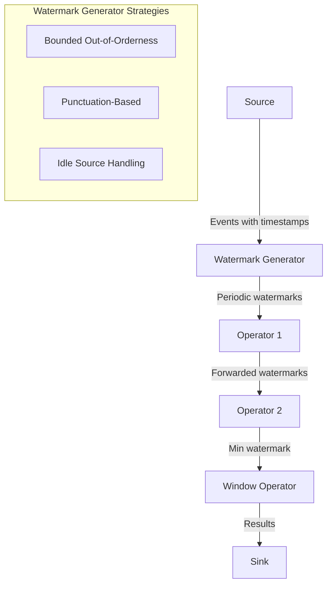
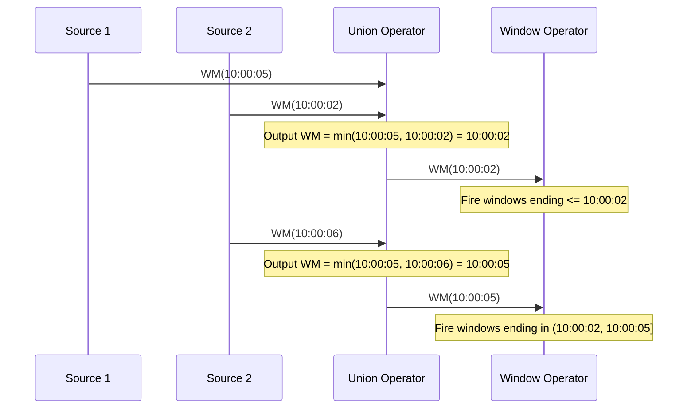

# Watermarks in Stream Processing

## Why Watermarks Exist

In a perfect world, events arrive in order and instantly. Reality is different — events arrive late, out of order, and with unpredictable delays. Consider a mobile analytics pipeline:

1. User performs action at 10:00:00 (event time)
2. Phone buffers event due to poor connectivity
3. Phone reconnects at 10:05:00
4. Event arrives at server at 10:05:02 (processing time)

The system must decide: when is it safe to compute results for the 10:00-10:05 window? If it waits too long, latency suffers. If it computes too early, results are incomplete.

**Watermarks** are the mechanism that answers this question. A watermark is an assertion: "No more events with timestamp less than W will arrive."

### Historical Context

Google's MillWheel (2013) introduced the concept of low watermarks for tracking event-time completeness. The Dataflow Model paper (Akidau et al., 2015) formalized watermarks as a first-class primitive. Apache Flink was the first open-source system to implement full watermark semantics. Kafka Streams, Spark Structured Streaming, and others followed with varying levels of support.

## First Principles

### The Two Clocks Problem

Every streaming system operates with two clocks:

$$
t_e(e) = \text{event time — when the event actually occurred}
$$

$$
t_p(e) = \text{processing time — when the system processes the event}
$$

The relationship between them:

$$
t_p(e) = t_e(e) + \text{network\_delay}(e) + \text{buffering\_delay}(e) + \text{clock\_skew}(e)
$$

In aggregate, plotting event time against processing time shows the **event-time skew distribution**:

```
Processing Time
    |          . . .
    |        . .     ideal (slope = 1)
    |      . .   /
    |    . .   /
    |  . .   / actual (events arrive late)
    | ..   /
    |.   /
    +------------ Event Time
```

The gap between the ideal line and actual data points is the **watermark lag**.

### Formal Definition

A watermark $W(t_p)$ at processing time $t_p$ is a monotonically non-decreasing function:

$$
W: \mathbb{R}^+ \rightarrow \mathbb{R}^+ \cup \{-\infty, +\infty\}
$$

Such that:

$$
\forall e \text{ arriving after } t_p: t_e(e) \geq W(t_p)
$$

**Monotonicity guarantee:**

$$
t_{p1} \leq t_{p2} \implies W(t_{p1}) \leq W(t_{p2})
$$

### Perfect vs. Heuristic Watermarks

**Perfect watermark:** Guarantees that no late data will ever arrive. Possible only when the input source provides completeness information (e.g., a bounded file, or a system that tracks all outstanding events).

$$
W_{\text{perfect}}(t_p) = \min_{e \in \text{pending}} t_e(e)
$$

**Heuristic watermark:** Estimates completeness based on observed data patterns. May allow late data.

$$
W_{\text{heuristic}}(t_p) = \text{estimated\_min}(\text{pending events})
$$

::: warning
Most production systems use heuristic watermarks. You MUST handle late data even with watermarks in place. Watermarks are a best-effort signal, not a guarantee.
:::

## Core Mechanics

### Watermark Generation



#### Strategy 1: Bounded Out-of-Orderness

The most common strategy. Assumes events can arrive at most $d$ time units late:

$$
W(t_p) = \max_{e \in \text{seen}} t_e(e) - d
$$

```typescript
class BoundedOutOfOrdernessWatermarkGenerator {
  private maxTimestampSeen: number = -Infinity;
  private lastEmittedWatermark: number = -Infinity;

  constructor(
    private readonly maxOutOfOrdernessMs: number,
  ) {}

  /**
   * Called for every event. Updates internal state.
   */
  onEvent(eventTimestamp: number): void {
    if (eventTimestamp > this.maxTimestampSeen) {
      this.maxTimestampSeen = eventTimestamp;
    }
  }

  /**
   * Called periodically (e.g., every 200ms) to emit watermarks.
   * Watermarks should not be emitted per-event for performance.
   */
  generateWatermark(): number {
    const potentialWatermark =
      this.maxTimestampSeen - this.maxOutOfOrdernessMs;

    // Ensure monotonicity
    if (potentialWatermark > this.lastEmittedWatermark) {
      this.lastEmittedWatermark = potentialWatermark;
    }

    return this.lastEmittedWatermark;
  }
}

// Allow up to 5 seconds of out-of-orderness
const generator = new BoundedOutOfOrdernessWatermarkGenerator(5_000);

// Simulate events
generator.onEvent(Date.parse('2026-03-18T10:00:03Z'));
generator.onEvent(Date.parse('2026-03-18T10:00:01Z')); // out of order
generator.onEvent(Date.parse('2026-03-18T10:00:07Z'));

const wm = generator.generateWatermark();
// wm = 10:00:07 - 5s = 10:00:02
// Event at 10:00:01 is NOT late (10:00:01 < 10:00:02 but it arrived before watermark)
```

#### Strategy 2: Punctuation-Based (Watermark Markers in Source)

Some sources embed explicit watermark signals in the data stream:

```typescript
type StreamElement<T> =
  | { type: 'data'; value: T; timestamp: number }
  | { type: 'watermark'; timestamp: number };

class PunctuationWatermarkGenerator<T> {
  private currentWatermark: number = -Infinity;

  processElement(element: StreamElement<T>): {
    watermarkAdvanced: boolean;
    newWatermark: number;
  } {
    if (element.type === 'watermark') {
      if (element.timestamp > this.currentWatermark) {
        this.currentWatermark = element.timestamp;
        return { watermarkAdvanced: true, newWatermark: this.currentWatermark };
      }
    }
    return { watermarkAdvanced: false, newWatermark: this.currentWatermark };
  }

  getCurrentWatermark(): number {
    return this.currentWatermark;
  }
}
```

#### Strategy 3: Processing-Time Based (Fallback)

When event timestamps are unreliable:

```typescript
class ProcessingTimeWatermarkGenerator {
  generateWatermark(): number {
    return Date.now();
  }
}
```

::: danger
Processing-time watermarks provide no ordering guarantees. Use only when event timestamps are unavailable or meaningless.
:::

### Watermark Propagation

In a DAG of operators, watermarks flow downstream. Each operator computes its output watermark as a function of its input watermarks:



**Multi-input operator watermark rule:**

$$
W_{\text{out}} = \min_{i \in \text{inputs}} W_i
$$

**Single-input operator with buffering (e.g., sort):**

$$
W_{\text{out}} = \min(W_{\text{in}}, \min_{e \in \text{buffer}} t_e(e))
$$

```typescript
class WatermarkPropagator {
  private inputWatermarks: Map<string, number> = new Map();
  private outputWatermark: number = -Infinity;

  constructor(private readonly inputIds: string[]) {
    for (const id of inputIds) {
      this.inputWatermarks.set(id, -Infinity);
    }
  }

  /**
   * Called when an input channel advances its watermark.
   * Returns the new output watermark if it advanced, null otherwise.
   */
  updateInputWatermark(
    inputId: string,
    watermark: number,
  ): number | null {
    const current = this.inputWatermarks.get(inputId);
    if (current === undefined) {
      throw new Error(`Unknown input: ${inputId}`);
    }
    if (watermark < current) {
      throw new Error(
        `Watermark regression on ${inputId}: ${watermark} < ${current}`,
      );
    }

    this.inputWatermarks.set(inputId, watermark);

    // Output watermark = min of all input watermarks
    const newOutput = Math.min(
      ...Array.from(this.inputWatermarks.values()),
    );

    if (newOutput > this.outputWatermark) {
      this.outputWatermark = newOutput;
      return this.outputWatermark;
    }

    return null; // No advancement
  }

  getCurrentOutputWatermark(): number {
    return this.outputWatermark;
  }
}
```

### Idle Source Handling

A common production problem: one of N partitions stops producing events. Its watermark freezes, holding back the global watermark:

```
Partition 0: events flowing, WM = 10:05:00
Partition 1: events flowing, WM = 10:04:50
Partition 2: no events for 10 minutes, WM = 09:55:00  <-- STUCK

Global WM = min(10:05:00, 10:04:50, 09:55:00) = 09:55:00
```

**Solution: Idle timeout with watermark advancement**

```typescript
interface PartitionState {
  lastEventTime: number;
  lastActivityProcessingTime: number;
  watermark: number;
  idle: boolean;
}

class IdleAwareWatermarkTracker {
  private partitions: Map<string, PartitionState> = new Map();

  constructor(
    private readonly idleTimeoutMs: number,
    private readonly maxOutOfOrdernessMs: number,
  ) {}

  registerPartition(partitionId: string): void {
    this.partitions.set(partitionId, {
      lastEventTime: -Infinity,
      lastActivityProcessingTime: Date.now(),
      watermark: -Infinity,
      idle: false,
    });
  }

  onEvent(partitionId: string, eventTimestamp: number): void {
    const state = this.partitions.get(partitionId);
    if (!state) return;

    state.lastEventTime = Math.max(state.lastEventTime, eventTimestamp);
    state.lastActivityProcessingTime = Date.now();
    state.watermark = state.lastEventTime - this.maxOutOfOrdernessMs;
    state.idle = false;
  }

  computeGlobalWatermark(): number {
    const now = Date.now();
    let globalWm = Infinity;

    for (const [partitionId, state] of this.partitions) {
      // Check if partition is idle
      if (now - state.lastActivityProcessingTime > this.idleTimeoutMs) {
        if (!state.idle) {
          console.log(`Partition ${partitionId} marked as idle`);
          state.idle = true;
        }
        continue; // Exclude idle partitions from watermark computation
      }

      globalWm = Math.min(globalWm, state.watermark);
    }

    return globalWm === Infinity ? -Infinity : globalWm;
  }
}
```

## Watermark Delay Analysis

### Quantifying Watermark Lag

Watermark lag measures how far behind real-time the watermark is:

$$
\text{lag}(t_p) = t_p - W(t_p)
$$

For bounded out-of-orderness with max delay $d$:

$$
\text{lag}_{\text{best}} = d
$$

$$
\text{lag}_{\text{worst}} = d + \text{source\_idle\_time}
$$

### Impact on End-to-End Latency

Total latency from event occurrence to result emission:

$$
\text{latency}_{\text{total}} = \text{ingestion\_delay} + \text{watermark\_delay} + \text{window\_delay} + \text{processing\_delay}
$$

Where:
- $\text{ingestion\_delay}$: time from event to source
- $\text{watermark\_delay}$: bounded out-of-orderness parameter $d$
- $\text{window\_delay}$: remaining time until window closes
- $\text{processing\_delay}$: computation time

$$
E[\text{latency}] = E[\text{ingestion}] + d + \frac{\text{window\_size}}{2} + O(\text{processing})
$$

::: tip
The watermark delay $d$ is the single most impactful tuning parameter for streaming latency. Set it too low: data loss. Set it too high: unnecessary latency. Profile your actual data's out-of-orderness distribution to choose the right value.
:::

### Choosing the Right Bounded Delay

Analyze the empirical distribution of event-time skew:

```typescript
class SkewAnalyzer {
  private skewValues: number[] = [];

  recordSkew(eventTime: number, processingTime: number): void {
    this.skewValues.push(processingTime - eventTime);
  }

  getPercentile(p: number): number {
    const sorted = [...this.skewValues].sort((a, b) => a - b);
    const index = Math.ceil((p / 100) * sorted.length) - 1;
    return sorted[Math.max(0, index)];
  }

  recommend(): {
    conservative: number;
    balanced: number;
    aggressive: number;
  } {
    return {
      conservative: this.getPercentile(99.9), // Lose 0.1% of events
      balanced: this.getPercentile(99),        // Lose 1% of events
      aggressive: this.getPercentile(95),      // Lose 5% of events
    };
  }

  printDistribution(): void {
    const percentiles = [50, 75, 90, 95, 99, 99.5, 99.9];
    console.log('Event-time skew distribution:');
    for (const p of percentiles) {
      console.log(`  p${p}: ${this.getPercentile(p)}ms`);
    }
  }
}
```

Example real-world skew distributions:

| Source Type | p50 | p95 | p99 | p99.9 |
|------------|-----|-----|-----|-------|
| Server logs (same DC) | 10ms | 50ms | 200ms | 1s |
| Mobile app events | 500ms | 5s | 30s | 5min |
| IoT sensors (cellular) | 1s | 10s | 2min | 1hr |
| Cross-region replication | 50ms | 200ms | 1s | 10s |

## Edge Cases & Failure Modes

### Watermark Regression

Watermarks must be monotonically non-decreasing. A regression indicates a bug:

```typescript
class WatermarkValidator {
  private lastWatermark: number = -Infinity;
  private regressionCount: number = 0;

  validate(watermark: number): boolean {
    if (watermark < this.lastWatermark) {
      this.regressionCount++;
      console.error(
        `Watermark regression detected! ` +
          `Current: ${watermark}, Previous: ${this.lastWatermark}, ` +
          `Regression count: ${this.regressionCount}`,
      );
      return false;
    }
    this.lastWatermark = watermark;
    return true;
  }
}
```

**Common causes of watermark regression:**
1. Source rebalancing (Kafka consumer group rebalance)
2. Checkpoint restore with inconsistent state
3. Clock synchronization issues (NTP jumps)

### The Stale Watermark Problem

If no events arrive, the watermark stalls. This prevents windows from firing even though real time is advancing:

$$
\text{If } \nexists e : t_e(e) > W_{\text{current}} \text{ for time } T, \text{ then } W \text{ is stale for } T
$$

**Solutions:**
1. **Idle timeouts:** Mark partitions as idle after N seconds of inactivity
2. **Processing-time timers:** Fire windows after a wall-clock deadline even without watermark advancement
3. **Synthetic events:** Inject heartbeat events with current timestamps

### Watermark in Multi-Tenant Systems

When multiple logical streams share physical infrastructure, watermarks from one stream can contaminate another:

```typescript
class IsolatedWatermarkTracker {
  private perTenantWatermarks: Map<string, number> = new Map();

  updateWatermark(tenantId: string, watermark: number): void {
    const current = this.perTenantWatermarks.get(tenantId) ?? -Infinity;
    if (watermark > current) {
      this.perTenantWatermarks.set(tenantId, watermark);
    }
  }

  getWatermark(tenantId: string): number {
    return this.perTenantWatermarks.get(tenantId) ?? -Infinity;
  }

  // Do NOT compute global min across tenants — that defeats isolation
}
```

::: danger
Never compute a global watermark across tenants. A single slow tenant will freeze all other tenants' windows.
:::

## Performance Characteristics

### Watermark Emission Frequency

Emitting watermarks too frequently wastes resources (each watermark is broadcast to all downstream operators). Too infrequently increases latency.

**Recommended intervals:**

| Throughput | Watermark Interval | Rationale |
|------------|-------------------|-----------|
| < 1K events/s | 1000ms | Low volume, latency tolerance |
| 1K-100K events/s | 200ms | Default Flink setting |
| 100K-1M events/s | 100ms | Balance latency/overhead |
| > 1M events/s | 50ms | Minimize window-fire delay |

**Overhead per watermark emission:**

$$
\text{Cost}_{\text{watermark}} = O(P) \text{ where } P = \text{parallelism (number of subtasks)}
$$

Each watermark must be sent to all downstream subtasks, creating $O(P^2)$ messages per watermark in fully connected topologies.

### Memory Overhead

Watermark tracking requires per-partition state:

$$
\text{Memory} = |\text{partitions}| \times (\text{sizeof}(\text{timestamp}) + \text{sizeof}(\text{metadata}))
$$

Typically 16-32 bytes per partition. For 10,000 partitions: ~320 KB. Negligible.

## Mathematical Foundations

### Watermark as a Progress Measure

Formally, a watermark is a **progress measure** in a partially ordered computation:

$$
(E, \leq_e) \text{ is a partial order on events by event time}
$$

$$
W: \text{ProcessingTime} \rightarrow E \text{ is a monotone function}
$$

$$
W(t_1) \leq_e W(t_2) \text{ whenever } t_1 \leq t_2
$$

### Completeness vs. Latency Tradeoff

The fundamental tradeoff is captured by:

$$
\text{Completeness}(W) = P(t_e(e) \geq W(t_p) \mid e \text{ arrives after } t_p)
$$

$$
\text{Latency}(W) = E[t_p^{\text{emit}} - t_e^{\text{window\_end}}]
$$

These are inversely related:

$$
\frac{\partial \text{Completeness}}{\partial d} > 0 \quad \text{and} \quad \frac{\partial \text{Latency}}{\partial d} > 0
$$

where $d$ is the bounded out-of-orderness delay.

The optimal $d$ minimizes a loss function:

$$
\mathcal{L}(d) = \alpha \cdot (1 - \text{Completeness}(d)) + \beta \cdot \text{Latency}(d)
$$

where $\alpha$ and $\beta$ are application-specific weights.

### Information-Theoretic Bounds

For a perfect watermark, you need complete information about all in-flight events. The information required is:

$$
I_{\text{perfect}} = H(\text{pending events}) = -\sum_{e} p(e) \log p(e)
$$

This is generally unbounded in open systems, which is why perfect watermarks are only possible in closed systems (bounded sources).

## Real-World War Stories

::: info War Story
**The Midnight Watermark Cliff**

An e-commerce company processing clickstream data noticed that every night at midnight, their real-time dashboards would freeze for 10-15 minutes. Investigation revealed:

1. Their watermark delay was set to 30 seconds
2. At midnight, traffic dropped 95%, but a few automated systems still generated events
3. One system had a clock skewed 10 minutes ahead
4. Events from this system at "00:10" prevented the watermark from advancing past midnight
5. All midnight-boundary windows (daily aggregations) were delayed 10 minutes

**Fix:** Added per-source watermark tracking with outlier detection. Sources whose timestamps were more than 2 standard deviations from the median were excluded from watermark computation.
:::

::: info War Story
**The Kafka Rebalance Watermark Storm**

A team running Flink with Kafka sources experienced watermark "storms" during consumer group rebalances:

1. Rebalance occurs: consumers stop reading for 5-10 seconds
2. After rebalance: consumers resume from committed offsets
3. Old events (from before rebalance) flood in with old timestamps
4. Watermark cannot advance past the oldest re-read event
5. All downstream windows are blocked

**Root cause:** After rebalance, consumers re-read events already processed. The watermark generator sees these old timestamps as "new" events and refuses to advance.

**Fix:** Track per-partition high-water marks across rebalances. After rebalance, initialize the watermark generator with the previous partition's watermark, not from the re-read events.
:::

::: info War Story
**The IoT Watermark That Traveled Back in Time**

An IoT platform ingesting sensor data set a 1-hour bounded delay watermark. One class of sensors stored events in flash memory when offline and uploaded in bulk when reconnecting. A sensor that was offline for 3 weeks uploaded 500,000 events spanning 3 weeks of event time.

The watermark plummeted 3 weeks into the past, causing:
1. Every window in the last 3 weeks to "reopen"
2. State explosion (all those windows needed to be reconstructed)
3. Checkpoint size grew from 2 GB to 200 GB
4. Checkpoint timeouts → no checkpoints → no fault tolerance

**Fix:** Ingestion-time filtering. Events older than 24 hours are routed to a batch processing pipeline instead of the streaming pipeline. The streaming pipeline only handles "recent" data.
:::

## Decision Framework

### Watermark Strategy Selection

| Scenario | Strategy | Delay Setting |
|----------|----------|---------------|
| Controlled sources (internal services) | Bounded out-of-orderness | p99 of observed skew |
| Uncontrolled sources (mobile, IoT) | Bounded + idle detection | p99.9 + idle timeout |
| Sources with embedded watermarks | Punctuation-based | N/A (source provides) |
| No event timestamps available | Processing-time | N/A |
| Mixed sources | Per-source strategy | Varies |

### Monitoring Watermark Health

Key metrics to track:

```typescript
interface WatermarkMetrics {
  // Current watermark value
  currentWatermark: number;

  // Lag: processing time - watermark
  watermarkLag: number;

  // Rate of watermark advancement (should be ~1 second per second)
  watermarkAdvancementRate: number;

  // Number of late events (arrived after watermark)
  lateEventCount: number;

  // Late event ratio
  lateEventRatio: number;

  // Idle partitions count
  idlePartitions: number;
}

class WatermarkMonitor {
  private lastWatermark: number = -Infinity;
  private lastCheckTime: number = Date.now();
  private lateEvents: number = 0;
  private totalEvents: number = 0;

  recordEvent(eventTime: number, currentWatermark: number): void {
    this.totalEvents++;
    if (eventTime < currentWatermark) {
      this.lateEvents++;
    }
  }

  getMetrics(currentWatermark: number): WatermarkMetrics {
    const now = Date.now();
    const elapsed = now - this.lastCheckTime;

    const advancementRate =
      elapsed > 0
        ? (currentWatermark - this.lastWatermark) / elapsed
        : 0;

    const metrics: WatermarkMetrics = {
      currentWatermark,
      watermarkLag: now - currentWatermark,
      watermarkAdvancementRate: advancementRate,
      lateEventCount: this.lateEvents,
      lateEventRatio:
        this.totalEvents > 0 ? this.lateEvents / this.totalEvents : 0,
      idlePartitions: 0, // populated externally
    };

    this.lastWatermark = currentWatermark;
    this.lastCheckTime = now;

    return metrics;
  }
}
```

::: tip
Set alerts on these thresholds:
- **watermarkLag > 5 minutes**: Something is blocking watermark advancement
- **lateEventRatio > 5%**: Your bounded delay is too aggressive
- **watermarkAdvancementRate < 0.5**: Watermark advancing at less than half real-time speed
- **idlePartitions > 20% of total**: Possible partition starvation
:::

## Advanced Topics

### Adaptive Watermarks

Instead of a fixed bounded delay, adapt based on observed patterns:

```typescript
class AdaptiveWatermarkGenerator {
  private skewHistory: number[] = [];
  private readonly historySize = 10_000;
  private readonly targetCompleteness = 0.99; // 99% completeness

  onEvent(eventTime: number, processingTime: number): void {
    const skew = processingTime - eventTime;
    this.skewHistory.push(skew);
    if (this.skewHistory.length > this.historySize) {
      this.skewHistory.shift();
    }
  }

  computeAdaptiveDelay(): number {
    if (this.skewHistory.length < 100) {
      return 30_000; // Default 30s until enough data
    }

    const sorted = [...this.skewHistory].sort((a, b) => a - b);
    const percentileIndex = Math.ceil(
      this.targetCompleteness * sorted.length,
    ) - 1;
    return sorted[percentileIndex];
  }

  generateWatermark(maxTimestampSeen: number): number {
    const adaptiveDelay = this.computeAdaptiveDelay();
    return maxTimestampSeen - adaptiveDelay;
  }
}
```

### Multi-Dimensional Watermarks

Some systems require watermarks on multiple dimensions (e.g., event time + ingestion time):

$$
W: \text{ProcessingTime} \rightarrow \mathbb{R}^n
$$

$$
W(t_p) = (W_{\text{event}}(t_p), W_{\text{ingestion}}(t_p), W_{\text{custom}}(t_p))
$$

This is an active area of research for systems processing data with multiple time attributes.

### Watermark Alignment Across Joins

When joining two streams, each with its own watermark, the joined operator's watermark is:

$$
W_{\text{join}} = \min(W_{\text{left}}, W_{\text{right}})
$$

This means the slower stream dictates join completeness. For interval joins:

$$
\text{left event } l \text{ joins right event } r \text{ iff } |t_e(l) - t_e(r)| \leq \text{interval}
$$

State retention for the join must account for the watermark of the *other* stream:

$$
\text{retain}(l) \text{ while } W_{\text{right}} \leq t_e(l) + \text{interval}
$$

```typescript
class IntervalJoinWatermarkManager {
  private leftWatermark: number = -Infinity;
  private rightWatermark: number = -Infinity;

  constructor(private readonly intervalMs: number) {}

  updateLeftWatermark(wm: number): void {
    this.leftWatermark = wm;
  }

  updateRightWatermark(wm: number): void {
    this.rightWatermark = wm;
  }

  /**
   * Can we safely evict a left-side element with this timestamp?
   * Only if no future right-side element can join with it.
   */
  canEvictLeft(leftTimestamp: number): boolean {
    return this.rightWatermark > leftTimestamp + this.intervalMs;
  }

  canEvictRight(rightTimestamp: number): boolean {
    return this.leftWatermark > rightTimestamp + this.intervalMs;
  }

  getOutputWatermark(): number {
    return Math.min(this.leftWatermark, this.rightWatermark);
  }
}
```

### Source-Specific Watermark Strategies

#### Kafka

Kafka provides per-partition ordering. The watermark for a Kafka source:

$$
W_{\text{kafka}} = \min_{p \in \text{assigned\_partitions}} W_p
$$

where $W_p$ is the watermark for partition $p$, typically:

$$
W_p = \max_{e \in \text{consumed}(p)} t_e(e) - d
$$

#### Database CDC (Change Data Capture)

For CDC sources (Debezium), the watermark is based on the transaction log position:

$$
W_{\text{cdc}} = t_e(\text{last committed transaction}) - d
$$

Transaction ordering guarantees make CDC watermarks more reliable than general-purpose ones.

#### File Sources (Bounded)

For bounded sources, perfect watermarks are possible:

$$
W_{\text{file}} = \begin{cases} \max_{e \in \text{read}} t_e(e) & \text{if not exhausted} \\ +\infty & \text{if exhausted} \end{cases}
$$

## Cross-References

- [Windowing](./windowing.md) — How watermarks trigger window computations
- [Exactly-Once Processing](./exactly-once-processing.md) — Watermark consistency during checkpointing
- [State Management](./state-management.md) — Watermark state in distributed operators
- [Backpressure](./backpressure.md) — How backpressure affects watermark propagation
- [CDC Patterns](../pipeline-patterns/cdc-patterns.md) — Watermarks for CDC sources
