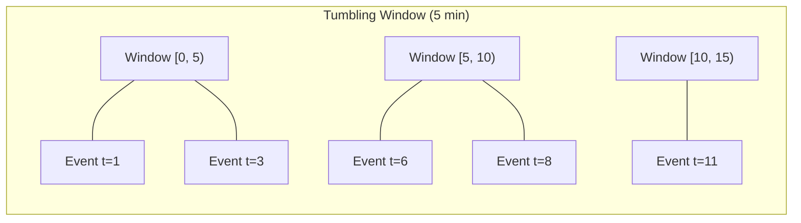
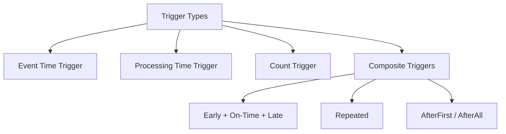
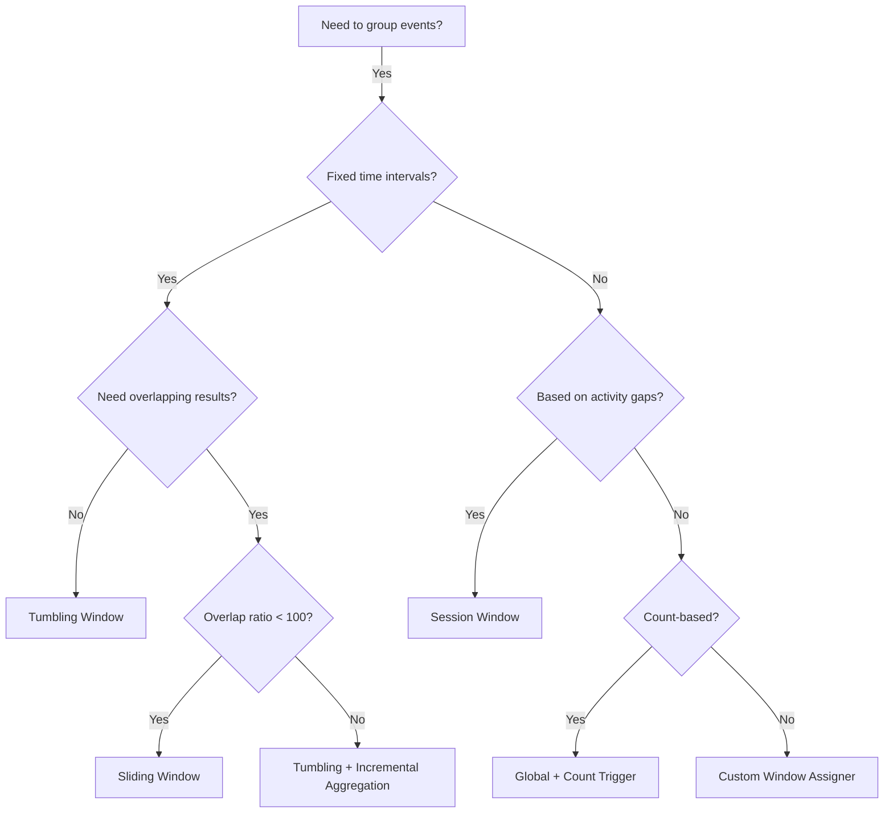
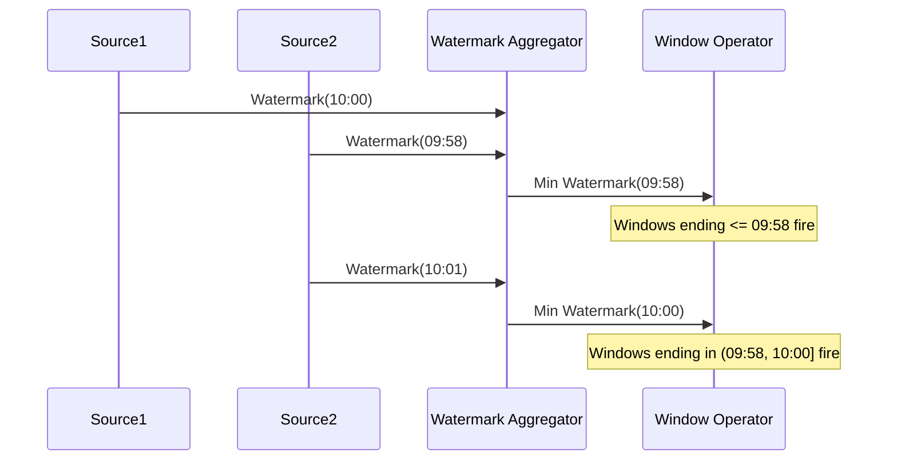

# Stream Processing Windowing

## Why Windowing Exists

Streaming data is unbounded — it never ends. Yet virtually every useful computation requires grouping elements into finite chunks. You cannot compute an average over infinite elements, rank the top-N items from an endless feed, or trigger an alert when a metric breaches a threshold "over the last 5 minutes" without first defining what "the last 5 minutes" means.

In batch processing, boundaries are natural: a file, a partition, a day's worth of data. In streaming, boundaries must be **imposed**. This is what windowing does — it slices an infinite stream into finite, computable segments.

### Historical Context

Early streaming systems (Storm, S4) treated every event independently or used simplistic time-based batching. Google's MillWheel (2013) introduced sophisticated windowing with event-time semantics. The Dataflow Model paper (2015) formalized the theory, and Apache Beam / Flink adopted it as the standard. Today, every serious stream processor implements the windowing model from that paper.

### The Core Problem

Given an unbounded stream of events, each carrying a timestamp:

```
Event(user=A, action=click, time=10:00:01)
Event(user=B, action=click, time=10:00:02)
Event(user=A, action=click, time=10:00:05)
...
```

How do you group these events into finite collections so you can compute aggregations, and when do you emit results?

This decomposes into four questions (the "four questions of stream processing"):

1. **What** results are being computed? (Transformations)
2. **Where** in event time are results calculated? (Windowing)
3. **When** in processing time are results materialized? (Triggers + Watermarks)
4. **How** do refinements of results relate? (Accumulation)

## First Principles

### Time Domains

Every event exists in two time domains simultaneously:

$$
\text{Event Time: } t_e = \text{when the event actually occurred}
$$

$$
\text{Processing Time: } t_p = \text{when the system observes the event}
$$

The skew between them is:

$$
\text{skew}(e) = t_p(e) - t_e(e) \geq 0
$$

In an ideal world, skew is zero. In reality, network delays, buffering, and retransmission cause skew that varies from milliseconds to hours.

### Window Assignment Function

A window assignment function maps each element to one or more windows:

$$
W: E \rightarrow \mathcal{P}(\text{Windows})
$$

where $E$ is the set of elements and $\mathcal{P}$ is the power set. An element can belong to multiple windows (sliding windows) or exactly one (tumbling windows).

### Window Merging

Some window types (session windows) are defined by dynamic merging rather than static assignment:

$$
\text{merge}(w_1, w_2) = \begin{cases} w_1 \cup w_2 & \text{if } \text{gap}(w_1, w_2) \leq \text{threshold} \\ \{w_1, w_2\} & \text{otherwise} \end{cases}
$$

## Core Window Types

### Tumbling Windows

Tumbling windows partition the time axis into non-overlapping, fixed-size intervals.

```
Window size = 5 minutes

|--- W1 ---|--- W2 ---|--- W3 ---|--- W4 ---|
0          5          10         15         20  (minutes)
```

**Properties:**
- Every element belongs to exactly one window
- Windows are aligned to the epoch (or a configurable offset)
- No data duplication

**Window assignment:**

$$
w(t_e) = \left\lfloor \frac{t_e - \text{offset}}{\text{size}} \right\rfloor \times \text{size} + \text{offset}
$$



**Implementation (TypeScript with Kafka Streams semantics):**

```typescript
interface WindowAssignment<T> {
  element: T;
  window: TimeWindow;
  timestamp: number;
}

interface TimeWindow {
  start: number; // inclusive
  end: number;   // exclusive
}

class TumblingWindowAssigner {
  constructor(
    private readonly sizeMs: number,
    private readonly offsetMs: number = 0,
  ) {
    if (sizeMs <= 0) {
      throw new Error(`Window size must be positive, got ${sizeMs}`);
    }
  }

  assignWindows(timestamp: number): TimeWindow[] {
    const windowStart =
      Math.floor((timestamp - this.offsetMs) / this.sizeMs) * this.sizeMs +
      this.offsetMs;
    return [{ start: windowStart, end: windowStart + this.sizeMs }];
  }
}

// Usage: 5-minute tumbling windows
const assigner = new TumblingWindowAssigner(5 * 60 * 1000);

// Event at 10:03:00 -> Window [10:00:00, 10:05:00)
const windows = assigner.assignWindows(
  new Date('2026-03-18T10:03:00Z').getTime(),
);
console.log(windows);
// [{ start: 1742292000000, end: 1742292300000 }]
```

### Sliding Windows (Hopping Windows)

Sliding windows have a fixed size but advance by a configurable "slide" interval, creating overlapping windows.

```
Window size = 10 min, Slide = 5 min

|-------- W1 --------|
          |-------- W2 --------|
                    |-------- W3 --------|
0         5         10        15        20  (minutes)
```

**Properties:**
- An element belongs to `ceil(size / slide)` windows
- When `slide == size`, it degenerates to tumbling windows
- When `slide < size`, windows overlap (data is duplicated)

**Window assignment:**

$$
\text{windows}(t_e) = \left\{ \left[ s, s + \text{size} \right) \mid s = t_e - t_e \bmod \text{slide} - i \times \text{slide}, \ i \in [0, \lceil \text{size} / \text{slide} \rceil) \right\}
$$

```typescript
class SlidingWindowAssigner {
  private readonly windowsPerElement: number;

  constructor(
    private readonly sizeMs: number,
    private readonly slideMs: number,
    private readonly offsetMs: number = 0,
  ) {
    if (sizeMs <= 0 || slideMs <= 0) {
      throw new Error('Window size and slide must be positive');
    }
    if (slideMs > sizeMs) {
      throw new Error('Slide must not exceed window size');
    }
    this.windowsPerElement = Math.ceil(sizeMs / slideMs);
  }

  assignWindows(timestamp: number): TimeWindow[] {
    const windows: TimeWindow[] = [];
    const adjustedTs = timestamp - this.offsetMs;
    const lastStart =
      Math.floor(adjustedTs / this.slideMs) * this.slideMs + this.offsetMs;

    for (let i = 0; i < this.windowsPerElement; i++) {
      const windowStart = lastStart - i * this.slideMs;
      const windowEnd = windowStart + this.sizeMs;
      if (timestamp >= windowStart && timestamp < windowEnd) {
        windows.push({ start: windowStart, end: windowEnd });
      }
    }
    return windows;
  }
}

// 10-minute windows sliding every 2 minutes
const slider = new SlidingWindowAssigner(10 * 60_000, 2 * 60_000);

// Event at 10:07:00 belongs to 5 windows
const wins = slider.assignWindows(
  new Date('2026-03-18T10:07:00Z').getTime(),
);
console.log(`Element belongs to ${wins.length} windows`);
```

### Session Windows

Session windows are **data-driven** — they group events that are close together in time, separated by gaps of inactivity.

```
Gap timeout = 5 min

Events:  *  * *       *  *          * *  *
Time:    0  1 2       8  9          20 21 22

Sessions: [0-2]       [8-9]        [20-22]
          gap=6>5     gap=11>5
```

**Properties:**
- Windows are per-key (user sessions)
- Window boundaries are determined by data, not configuration
- Requires a **merging** window implementation
- Most expensive window type (state management overhead)

**Merging algorithm:**

```typescript
interface SessionWindow {
  start: number;
  end: number;    // end = timestamp of last event + gap
  events: number; // count of events in this session
}

class SessionWindowAssigner {
  constructor(private readonly gapMs: number) {}

  /**
   * Merges a new event into existing sessions.
   * Returns the new set of sessions after potential merges.
   */
  mergeInto(
    existingSessions: SessionWindow[],
    eventTimestamp: number,
  ): SessionWindow[] {
    const newSession: SessionWindow = {
      start: eventTimestamp,
      end: eventTimestamp + this.gapMs,
      events: 1,
    };

    // Find all sessions that overlap with or are adjacent to the new event
    const overlapping: SessionWindow[] = [];
    const nonOverlapping: SessionWindow[] = [];

    for (const session of existingSessions) {
      if (
        session.start <= newSession.end &&
        session.end >= newSession.start
      ) {
        overlapping.push(session);
      } else {
        nonOverlapping.push(session);
      }
    }

    // Merge all overlapping sessions into one
    let merged = newSession;
    for (const session of overlapping) {
      merged = {
        start: Math.min(merged.start, session.start),
        end: Math.max(merged.end, session.end),
        events: merged.events + session.events,
      };
    }

    return [...nonOverlapping, merged].sort((a, b) => a.start - b.start);
  }
}

// 30-minute session gap
const sessionAssigner = new SessionWindowAssigner(30 * 60_000);

let sessions: SessionWindow[] = [];
const events = [
  Date.parse('2026-03-18T10:00:00Z'),
  Date.parse('2026-03-18T10:05:00Z'),
  Date.parse('2026-03-18T10:10:00Z'),
  Date.parse('2026-03-18T11:00:00Z'), // new session (50 min gap)
  Date.parse('2026-03-18T11:15:00Z'),
];

for (const ts of events) {
  sessions = sessionAssigner.mergeInto(sessions, ts);
}

console.log(`Sessions: ${sessions.length}`); // 2
```

### Global Windows

A single window that encompasses all data. Useful with custom triggers.

```typescript
class GlobalWindowAssigner {
  assignWindows(_timestamp: number): TimeWindow[] {
    return [{ start: -Infinity, end: Infinity }];
  }
}
```

Global windows make sense when your trigger logic, not time boundaries, determines when to emit results (e.g., "emit after every 100 elements").

## Triggers

Triggers determine **when** a window's results are materialized. Without triggers, results would only emit when the window closes (when the watermark passes the window end).

### Trigger Types



### Event-Time Trigger

Fires when the watermark passes the window's end time:

$$
\text{fire}(w) \iff \text{watermark} \geq w.\text{end}
$$

This is the default trigger for most window types.

### Processing-Time Trigger

Fires based on wall-clock time, regardless of event time:

```typescript
interface Trigger<W extends Window> {
  onElement(
    element: unknown,
    timestamp: number,
    window: W,
    ctx: TriggerContext,
  ): TriggerResult;
  onProcessingTime(time: number, window: W, ctx: TriggerContext): TriggerResult;
  onEventTime(watermark: number, window: W, ctx: TriggerContext): TriggerResult;
  clear(window: W, ctx: TriggerContext): void;
}

enum TriggerResult {
  CONTINUE = 'CONTINUE',
  FIRE = 'FIRE',
  PURGE = 'PURGE',
  FIRE_AND_PURGE = 'FIRE_AND_PURGE',
}

interface TriggerContext {
  registerProcessingTimeTimer(time: number): void;
  registerEventTimeTimer(time: number): void;
  deleteProcessingTimeTimer(time: number): void;
  deleteEventTimeTimer(time: number): void;
  currentWatermark(): number;
  currentProcessingTime(): number;
  getPartitionedState<T>(descriptor: StateDescriptor<T>): T;
}

class CountTrigger<W extends Window> implements Trigger<W> {
  constructor(private readonly maxCount: number) {}

  onElement(
    _element: unknown,
    _timestamp: number,
    _window: W,
    ctx: TriggerContext,
  ): TriggerResult {
    const countState = ctx.getPartitionedState<{ count: number }>({
      name: 'count',
      defaultValue: { count: 0 },
    });
    countState.count += 1;
    if (countState.count >= this.maxCount) {
      countState.count = 0;
      return TriggerResult.FIRE_AND_PURGE;
    }
    return TriggerResult.CONTINUE;
  }

  onProcessingTime(): TriggerResult {
    return TriggerResult.CONTINUE;
  }

  onEventTime(): TriggerResult {
    return TriggerResult.CONTINUE;
  }

  clear(_window: W, ctx: TriggerContext): void {
    const countState = ctx.getPartitionedState<{ count: number }>({
      name: 'count',
      defaultValue: { count: 0 },
    });
    countState.count = 0;
  }
}
```

### Composite Triggers: Early, On-Time, Late

The most powerful pattern combines multiple triggers:

```typescript
class EarlyOnTimeLate<W extends Window> implements Trigger<W> {
  constructor(
    private readonly earlyTrigger: Trigger<W>,     // speculative results
    private readonly onTimeTrigger: Trigger<W>,     // watermark arrival
    private readonly lateTrigger: Trigger<W>,       // late data refinements
  ) {}

  onElement(
    element: unknown,
    timestamp: number,
    window: W,
    ctx: TriggerContext,
  ): TriggerResult {
    const watermark = ctx.currentWatermark();
    const windowEnd = (window as unknown as TimeWindow).end;

    if (watermark < windowEnd) {
      // Before watermark: use early trigger
      return this.earlyTrigger.onElement(element, timestamp, window, ctx);
    } else {
      // After watermark: use late trigger
      return this.lateTrigger.onElement(element, timestamp, window, ctx);
    }
  }

  onEventTime(watermark: number, window: W, ctx: TriggerContext): TriggerResult {
    const windowEnd = (window as unknown as TimeWindow).end;
    if (watermark >= windowEnd) {
      return this.onTimeTrigger.onEventTime(watermark, window, ctx);
    }
    return TriggerResult.CONTINUE;
  }

  onProcessingTime(time: number, window: W, ctx: TriggerContext): TriggerResult {
    return this.earlyTrigger.onProcessingTime(time, window, ctx);
  }

  clear(window: W, ctx: TriggerContext): void {
    this.earlyTrigger.clear(window, ctx);
    this.onTimeTrigger.clear(window, ctx);
    this.lateTrigger.clear(window, ctx);
  }
}
```

## Accumulation Modes

When a trigger fires multiple times for the same window, how do subsequent results relate to previous ones?

| Mode | Behavior | Use Case |
|------|----------|----------|
| **Discarding** | Each pane is independent; only new data since last fire | Downstream summing (e.g., counters) |
| **Accumulating** | Each pane contains the full window result | Downstream replacement (e.g., dashboards) |
| **Accumulating & Retracting** | Emits new result + retraction of previous result | Downstream correction (e.g., joins) |

### Mathematical Model

Let $P_i$ be the set of elements that arrived between trigger firings $i-1$ and $i$:

$$
\text{Discarding: } \text{result}_i = \text{aggr}(P_i)
$$

$$
\text{Accumulating: } \text{result}_i = \text{aggr}\left(\bigcup_{j=1}^{i} P_j\right)
$$

$$
\text{Acc+Retract: } \text{result}_i = \left(\text{aggr}\left(\bigcup_{j=1}^{i} P_j\right), -\text{aggr}\left(\bigcup_{j=1}^{i-1} P_j\right)\right)
$$

## Handling Late Data

### Allowed Lateness

After the watermark passes a window's end, the window is considered complete. But late data can still arrive. The **allowed lateness** parameter controls how long to keep window state around for late arrivals:

```
Window end time: T
Watermark passes T: results emitted
Allowed lateness: L

State kept until: T + L
Late elements arriving in [T, T+L]: trigger late firing
Late elements arriving after T+L: dropped (or sent to side output)
```

```typescript
interface WindowConfig {
  windowSize: number;
  allowedLateness: number;
  trigger: Trigger<TimeWindow>;
  accumulationMode: 'discarding' | 'accumulating' | 'accumulating_retracting';
}

class WindowOperator<K, V> {
  private windowState: Map<string, { window: TimeWindow; elements: V[] }> =
    new Map();
  private cleanupTimers: Map<string, number> = new Map();

  constructor(
    private readonly config: WindowConfig,
    private readonly assigner: { assignWindows(ts: number): TimeWindow[] },
  ) {}

  processElement(key: K, value: V, timestamp: number, watermark: number): void {
    const windows = this.assigner.assignWindows(timestamp);

    for (const window of windows) {
      const windowKey = `${String(key)}:${window.start}:${window.end}`;

      // Check if element is too late
      if (
        watermark > window.end + this.config.allowedLateness
      ) {
        this.handleDroppedElement(key, value, timestamp, window);
        continue;
      }

      // Add element to window state
      const state = this.windowState.get(windowKey) ?? {
        window,
        elements: [],
      };
      state.elements.push(value);
      this.windowState.set(windowKey, state);

      // Register cleanup timer
      if (!this.cleanupTimers.has(windowKey)) {
        this.cleanupTimers.set(
          windowKey,
          window.end + this.config.allowedLateness,
        );
      }
    }
  }

  onWatermarkAdvance(newWatermark: number): void {
    // Fire windows whose end time has been reached
    for (const [key, state] of this.windowState) {
      if (newWatermark >= state.window.end) {
        this.emitWindowResult(key, state);
      }
    }

    // Cleanup expired windows
    for (const [key, cleanupTime] of this.cleanupTimers) {
      if (newWatermark >= cleanupTime) {
        this.windowState.delete(key);
        this.cleanupTimers.delete(key);
      }
    }
  }

  private emitWindowResult(
    key: string,
    state: { window: TimeWindow; elements: V[] },
  ): void {
    // Emit result based on accumulation mode
    console.log(
      `Emitting window [${state.window.start}, ${state.window.end}): ` +
        `${state.elements.length} elements`,
    );

    if (this.config.accumulationMode === 'discarding') {
      state.elements = []; // Clear for next firing
    }
  }

  private handleDroppedElement(
    _key: K,
    _value: V,
    timestamp: number,
    window: TimeWindow,
  ): void {
    console.warn(
      `Dropping late element at ${timestamp} for window ` +
        `[${window.start}, ${window.end})`,
    );
    // Send to side output / dead letter queue
  }
}
```

### Side Outputs for Dropped Data

Late data that exceeds allowed lateness should not be silently dropped. Production systems route it to a side output:

```typescript
interface SideOutput<T> {
  tag: string;
  emit(element: T, timestamp: number, metadata: Record<string, unknown>): void;
}

class LateDataSideOutput<T> implements SideOutput<T> {
  tag = 'late-data';
  private buffer: Array<{ element: T; timestamp: number; metadata: Record<string, unknown> }> = [];

  emit(element: T, timestamp: number, metadata: Record<string, unknown>): void {
    this.buffer.push({ element, timestamp, metadata });
    // In production: write to Kafka topic, S3, or dead letter queue
  }

  flush(): Array<{ element: T; timestamp: number; metadata: Record<string, unknown> }> {
    const items = [...this.buffer];
    this.buffer = [];
    return items;
  }
}
```

## Performance Characteristics

### Memory Overhead per Window Type

| Window Type | State per Key | State per Element | Total State |
|------------|---------------|-------------------|-------------|
| Tumbling | $O(1)$ active windows | $O(1)$ per element | $O(n)$ where $n$ = elements in window |
| Sliding | $O(\lceil \text{size}/\text{slide} \rceil)$ active windows | $O(\lceil \text{size}/\text{slide} \rceil)$ per element | $O(n \times \text{overlap})$ |
| Session | $O(s)$ where $s$ = active sessions | $O(1)$ per element | $O(n)$ but merge cost is $O(s \log s)$ |
| Global | $O(1)$ | $O(1)$ per element | $O(N)$ — unbounded without purging |

### Latency Characteristics

$$
\text{Tumbling latency} = \text{window\_size} + \text{watermark\_delay}
$$

$$
\text{Sliding latency} = \text{slide\_interval} + \text{watermark\_delay}
$$

$$
\text{Session latency} = \text{gap\_duration} + \text{watermark\_delay}
$$

### Throughput Impact

Sliding windows with high overlap ratio are the most expensive:

$$
\text{Throughput multiplier} = \frac{1}{\lceil \text{size} / \text{slide} \rceil}
$$

A 1-hour window with 1-second slide creates 3600x element duplication — this will destroy throughput.

::: danger
Never use sliding windows with an overlap ratio greater than 100:1. A 1-hour window with 1-minute slides (60:1) is the practical upper limit. Beyond this, use a tumbling window with incremental aggregation.
:::

## Edge Cases & Failure Modes

### Clock Skew Between Partitions

When different Kafka partitions have different event-time progress, the minimum watermark across partitions determines the global watermark. A single slow partition holds back all windows:

```
Partition 0: event time = 10:05:00
Partition 1: event time = 10:04:30
Partition 2: event time = 09:55:00  <-- stalled!

Global watermark: 09:55:00  <-- 10 minutes behind
All windows [9:55, *) are blocked
```

**Mitigation:** Set per-partition idle timeouts so stalled partitions don't hold back the watermark.

### Session Window State Explosion

With high-cardinality keys and long session gaps, session window state can grow unboundedly:

$$
\text{State size} = |\text{keys}| \times \text{avg\_sessions\_per\_key} \times \text{avg\_session\_size}
$$

For 10M users with average 3 active sessions of 1KB each: 30 GB of state.

::: warning
Session windows with gaps > 1 hour on high-cardinality keys require RocksDB state backend. In-memory state backends will OOM.
:::

### Out-of-Order Elements Within a Window

Elements within a window may arrive out of order. If your aggregation is order-dependent (e.g., "first event"), you must sort within the window before emitting:

```typescript
function processWindowWithOrdering<T>(
  elements: Array<{ value: T; timestamp: number }>,
): T[] {
  return elements
    .sort((a, b) => a.timestamp - b.timestamp)
    .map((e) => e.value);
}
```

## Mathematical Foundations

### Window Algebra

Windows form a lattice under the subset relation:

$$
(w_1 \sqcap w_2) = w_1 \cap w_2 \quad \text{(meet)}
$$

$$
(w_1 \sqcup w_2) = w_1 \cup w_2 \quad \text{(join)}
$$

For session windows, the merge operation must satisfy:

$$
\text{merge}(w_1, \text{merge}(w_2, w_3)) = \text{merge}(\text{merge}(w_1, w_2), w_3) \quad \text{(associativity)}
$$

$$
\text{merge}(w_1, w_2) = \text{merge}(w_2, w_1) \quad \text{(commutativity)}
$$

These properties ensure that regardless of the order in which elements arrive, the final set of session windows is the same.

### Completeness and Correctness

A windowing system is **complete** if every element is assigned to at least one window:

$$
\forall e \in E: |W(e)| \geq 1
$$

It is **correct** if the window assignment is deterministic:

$$
W(e_1) = W(e_2) \iff t_e(e_1) = t_e(e_2) \text{ (for non-session windows)}
$$

::: info War Story
At a fintech company, a subtle bug in session window merging caused duplicate session attributions. The merge function was not commutative — merging sessions A+B gave a different boundary than B+A due to floating-point rounding in gap calculation. The fix was to use integer millisecond timestamps exclusively and ensure deterministic merge ordering by always processing windows sorted by start time. This cost $200K in incorrectly attributed transactions before detection.
:::

## Real-World War Stories

::: info War Story
**The Sliding Window OOM Incident**

A team at an ad-tech company configured 24-hour sliding windows with 1-second slides to compute rolling daily metrics. This created 86,400 overlapping windows per key. With 50K active keys, the system needed to maintain 4.3 billion window instances. The Flink cluster ran out of memory within minutes.

**Root cause:** Misunderstanding of sliding window semantics. They thought the system would "slide" a single window, not maintain 86,400 separate ones.

**Fix:** Switched to a 1-minute tumbling window with a custom incremental aggregation that maintained a 24-hour rolling sum using a circular buffer. State dropped from 4.3B windows to 50K keys with 1440-element buffers each.
:::

::: info War Story
**The Session Window That Never Closed**

A gaming company used session windows with a 30-minute gap to track player sessions. One bot player sent a heartbeat event every 29 minutes, creating a single session that lasted 47 days. The session's state grew to 2.3 GB (tracking every in-game action). When the session finally closed, the output function tried to serialize the entire session and timed out.

**Fix:** Added a maximum session duration limit. Sessions exceeding 24 hours were force-closed and a new session started.
:::

## Decision Framework

### When to Use Each Window Type

| Scenario | Window Type | Why |
|----------|-------------|-----|
| Fixed reporting intervals (hourly metrics) | Tumbling | Clean, non-overlapping |
| "Last N minutes" dashboards | Sliding | Continuous updates |
| User behavior analysis | Session | Natural activity grouping |
| Event counting with no time boundary | Global + Count Trigger | Pure count-based |
| Complex multi-stage processing | Tumbling + rewindowing | Compose simple windows |

### Window Type Selection Flowchart



## Advanced Topics

### Custom Window Assigners

For domain-specific windowing that doesn't fit standard types:

```typescript
interface CustomWindowAssigner<W extends Window> {
  assignWindows(
    element: unknown,
    timestamp: number,
    context: WindowAssignerContext,
  ): W[];
  getDefaultTrigger(): Trigger<W>;
  isEventTime(): boolean;
}

// Example: market trading hours window
class TradingSessionWindowAssigner implements CustomWindowAssigner<TimeWindow> {
  private readonly tradingHours = {
    NYSE: { open: 9.5, close: 16 },     // 9:30 AM - 4:00 PM ET
    LSE: { open: 8, close: 16.5 },      // 8:00 AM - 4:30 PM GMT
    TSE: { open: 9, close: 15 },         // 9:00 AM - 3:00 PM JST
  };

  constructor(private readonly exchange: keyof typeof TradingSessionWindowAssigner.prototype.tradingHours) {}

  assignWindows(_element: unknown, timestamp: number): TimeWindow[] {
    const date = new Date(timestamp);
    const hours = this.tradingHours[this.exchange];
    const dayStart = new Date(date);
    dayStart.setHours(0, 0, 0, 0);
    const start = dayStart.getTime() + hours.open * 3_600_000;
    const end = dayStart.getTime() + hours.close * 3_600_000;

    if (timestamp >= start && timestamp < end) {
      return [{ start, end }];
    }
    return []; // Outside trading hours — drop or side-output
  }

  getDefaultTrigger(): Trigger<TimeWindow> {
    return new EventTimeTrigger();
  }

  isEventTime(): boolean {
    return true;
  }
}
```

### Incremental Aggregation for Sliding Windows

Instead of maintaining full element lists, use combinable aggregation functions:

```typescript
interface IncrementalAggregator<IN, ACC, OUT> {
  createAccumulator(): ACC;
  add(value: IN, accumulator: ACC): ACC;
  merge(a: ACC, b: ACC): ACC;
  getResult(accumulator: ACC): OUT;
  // For retracting old elements from sliding windows:
  retract(value: IN, accumulator: ACC): ACC;
}

class SlidingCountAggregator
  implements IncrementalAggregator<number, { sum: number; count: number }, number>
{
  createAccumulator() {
    return { sum: 0, count: 0 };
  }
  add(value: number, acc: { sum: number; count: number }) {
    return { sum: acc.sum + value, count: acc.count + 1 };
  }
  merge(a: { sum: number; count: number }, b: { sum: number; count: number }) {
    return { sum: a.sum + b.sum, count: a.count + b.count };
  }
  getResult(acc: { sum: number; count: number }) {
    return acc.count === 0 ? 0 : acc.sum / acc.count;
  }
  retract(value: number, acc: { sum: number; count: number }) {
    return { sum: acc.sum - value, count: acc.count - 1 };
  }
}
```

This reduces per-window state from $O(n)$ to $O(1)$ for decomposable aggregations.

### Windowing in Distributed Systems

In a distributed stream processor, windows are partitioned by key. This creates coordination challenges:



The minimum watermark across all input partitions determines when windows fire. This is why balanced partition consumption is critical for windowing latency.

### Research: Reactive Windowing

Recent research explores **reactive windows** that adapt their size based on data characteristics:

$$
\text{size}(t) = \text{base\_size} \times \left(1 + \alpha \cdot \frac{\text{rate}(t)}{\text{rate}_{\text{avg}}}\right)
$$

Where $\alpha$ is a sensitivity parameter. During traffic spikes, windows shrink to produce faster results; during low traffic, they expand to reduce overhead.

This is an active area of research and not yet available in mainstream frameworks, but implementations exist in academic systems like Cutty and Scotty.

## Cross-References

- [Watermarks](./watermarks.md) — How watermarks drive window completion
- [State Management](./state-management.md) — Window state backends
- [Exactly-Once Processing](./exactly-once-processing.md) — Ensuring window results are not duplicated
- [Backpressure](./backpressure.md) — What happens when windows accumulate faster than downstream can process

---

::: tip Key Takeaway
- Windowing slices an infinite stream into finite, computable segments -- tumbling for non-overlapping intervals, sliding for overlapping, and session for activity-based grouping.
- Triggers determine when window results are emitted; accumulation mode determines how multiple firings relate (discarding, accumulating, or retracting).
- Never use sliding windows with overlap ratios greater than 100:1 -- the element duplication will destroy throughput and memory.
:::

::: details Exercise
**Choose the Right Window for These Scenarios**

For each scenario, choose the window type, specify configuration parameters, and explain why:

1. A dashboard showing "orders per minute" updated every minute
2. A fraud detection system that needs "transaction count in the last 10 minutes" updated every 30 seconds
3. A user analytics system tracking "session duration" where a session ends after 30 minutes of inactivity
4. A system that triggers an alert after receiving 100 error events regardless of time
5. A financial reporting system computing daily totals from market-hours-only data

::: details Solution
1. **Tumbling window, 1 minute.** Non-overlapping, each order counted once. Simple and efficient.
2. **Sliding window, size=10 min, slide=30 sec.** Each element belongs to 20 windows (10min/30sec). Overlap ratio = 20:1, well within the safe limit.
3. **Session window, gap=30 min.** Data-driven boundaries that merge events close together. Per-key (per-user) windows that close when inactivity exceeds the gap.
4. **Global window + count trigger (100).** No time boundary -- fires purely based on element count. Use FIRE_AND_PURGE to reset the count after each trigger.
5. **Custom window assigner (TradingSessionWindow).** Maps events to market-hours windows (e.g., 9:30 AM - 4:00 PM ET). Events outside trading hours are dropped or sent to a side output.
:::

::: warning Common Misconceptions
- **"Sliding windows just 'slide' a single window forward."** In reality, each element is duplicated into `ceil(size/slide)` separate windows. A 24-hour window with 1-second slides creates 86,400 copies of each element.
- **"Session windows are just tumbling windows with dynamic size."** Session windows require a fundamentally different implementation (merging) because window boundaries depend on data, not configuration.
- **"Triggers only fire once per window."** Triggers can fire multiple times -- early (speculative), on-time (watermark), and late (after watermark). The accumulation mode determines how these multiple firings relate.
- **"Late data is always dropped."** Late data is only dropped if it arrives after the allowed lateness period. Within the lateness window, it triggers a late firing that updates the result.
- **"Bigger windows are always better for accuracy."** Larger windows increase latency and memory usage. Choose the smallest window that satisfies your business requirements.
:::

::: tip In Production
- **Uber** uses session windows with a 5-minute gap to track rider sessions, merging ride-request events, driver-matching events, and trip events into unified session objects for analytics.
- **Netflix** uses tumbling 1-minute windows for real-time streaming health metrics, triggering alerts when error rates exceed thresholds within a window.
- **LinkedIn** uses sliding windows for "trending topics" computation -- 1-hour windows with 5-minute slides provide smooth, continuously updated trending scores.
- **Spotify** tracks listening sessions with session windows (30-minute gap) per user, computing session-level features like "songs played," "skips," and "genre diversity" for recommendation models.
:::

::: details Quiz
**1. How many windows does an element belong to in a sliding window with size=10 min and slide=2 min?**

A) 2
B) 5
C) 10
D) 20

::: details Answer
**B)** An element belongs to `ceil(size/slide) = ceil(10/2) = 5` windows. Each window overlaps with its neighbors, so a single event at time T is in the 5 windows whose ranges include T.
:::

**2. What happens when a tumbling window's size equals a sliding window's slide interval?**

A) The system crashes
B) The sliding window degenerates into a tumbling window (non-overlapping, one window per element)
C) Elements are dropped
D) The window size doubles

::: details Answer
**B)** When `slide == size`, sliding windows become non-overlapping -- each element belongs to exactly one window. This is mathematically identical to a tumbling window.
:::

**3. Why do session windows require a "merging" implementation?**

A) Because they need to compress data
B) Because window boundaries are determined by data arrival, and two initially separate sessions may need to merge when a connecting event arrives
C) Because they use more memory
D) Because they process events faster

::: details Answer
**B)** When a new event arrives in the gap between two existing sessions, those sessions must merge into one. Static window assignment cannot handle this -- the system must dynamically merge windows as data arrives.
:::

**4. What is the difference between FIRE and FIRE_AND_PURGE trigger results?**

A) FIRE is faster than FIRE_AND_PURGE
B) FIRE emits the window result but keeps state for future firings; FIRE_AND_PURGE emits and clears the state
C) FIRE_AND_PURGE sends data to a dead letter queue
D) There is no difference

::: details Answer
**B)** FIRE emits the current window result while retaining all accumulated elements (useful for accumulating mode). FIRE_AND_PURGE emits and then clears the window state, so the next firing starts fresh (useful for discarding mode).
:::

**5. What is the throughput multiplier for a sliding window with size=1 hour and slide=1 second?**

A) 1x (no impact)
B) 60x
C) 1/3600 of normal throughput
D) 3600x element duplication, approximately 1/3600 throughput

::: details Answer
**D)** The overlap ratio is `ceil(3600/1) = 3600`. Each element is duplicated 3600 times -- one copy per window. This creates 3600x state overhead, effectively reducing throughput to 1/3600 of normal. This configuration should never be used in production.
:::
:::

---

> **One-Liner Summary:** Windowing imposes finite boundaries on infinite streams -- choose tumbling for clean intervals, sliding for rolling metrics, session for user behavior, and never exceed a 100:1 overlap ratio.
