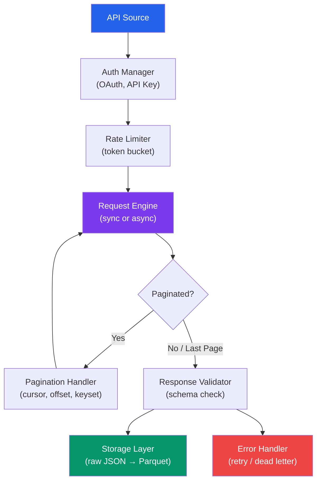

# API Data Ingestion

APIs are the most structured and reliable data source you will work with. Unlike web scraping, APIs give you predictable schemas, documented rate limits, and versioned contracts. The challenge is not parsing — it is handling pagination correctly, managing authentication tokens that expire, respecting rate limits without losing throughput, and building ingestion pipelines that survive API changes without silent data loss.

---

## API Ingestion Architecture



---

## Pagination Patterns

APIs rarely return all data in a single response. Understanding pagination patterns is essential for complete data extraction.

### Pattern 1: Offset-Based Pagination

```python
# offset_pagination.py — Classic offset/limit pattern
import requests
import time
import logging
from typing import Iterator

logger = logging.getLogger(__name__)


def paginate_offset(
    base_url: str,
    headers: dict,
    page_size: int = 100,
    max_records: int | None = None,
    delay: float = 0.5,
) -> Iterator[dict]:
    """
    Fetch all records using offset-based pagination.

    API pattern: GET /items?offset=0&limit=100
    Response: { "data": [...], "total": 5000 }

    WARNING: Offset pagination can miss or duplicate records
    if data is inserted/deleted during the fetch.
    """
    offset = 0
    total_fetched = 0
    session = requests.Session()
    session.headers.update(headers)

    while True:
        params = {"offset": offset, "limit": page_size}
        response = session.get(base_url, params=params, timeout=30)
        response.raise_for_status()
        body = response.json()

        records = body.get("data", [])
        total = body.get("total", None)

        if not records:
            logger.info(f"No more records at offset {offset}")
            break

        for record in records:
            yield record
            total_fetched += 1
            if max_records and total_fetched >= max_records:
                return

        offset += len(records)

        if total and offset >= total:
            logger.info(f"Reached total: {total}")
            break

        logger.info(f"Fetched {total_fetched} records (offset={offset})")
        time.sleep(delay)


# Usage
records = list(paginate_offset(
    base_url="https://api.example.com/v1/products",
    headers={"Authorization": "Bearer token123"},
    page_size=100,
))
print(f"Total records: {len(records)}")
```

### Pattern 2: Cursor-Based Pagination

```python
# cursor_pagination.py — Cursor/token pagination (recommended)
import requests
import time
import logging
from typing import Iterator

logger = logging.getLogger(__name__)


def paginate_cursor(
    base_url: str,
    headers: dict,
    cursor_field: str = "next_cursor",
    data_field: str = "data",
    page_size: int = 100,
    delay: float = 0.5,
) -> Iterator[dict]:
    """
    Fetch all records using cursor-based pagination.

    API pattern: GET /items?cursor=abc123&limit=100
    Response: { "data": [...], "next_cursor": "def456" }

    Cursor pagination is the SAFEST pattern — it handles
    concurrent inserts/deletes correctly because the cursor
    points to a stable position in the dataset.
    """
    session = requests.Session()
    session.headers.update(headers)
    cursor = None
    total_fetched = 0
    page_num = 0

    while True:
        page_num += 1
        params = {"limit": page_size}
        if cursor:
            params["cursor"] = cursor

        response = session.get(base_url, params=params, timeout=30)
        response.raise_for_status()
        body = response.json()

        records = body.get(data_field, [])
        if not records:
            break

        for record in records:
            yield record
            total_fetched += 1

        cursor = body.get(cursor_field)
        if not cursor:
            logger.info(f"No next cursor — pagination complete")
            break

        logger.info(
            f"Page {page_num}: {len(records)} records, "
            f"total={total_fetched}, next_cursor={cursor[:20]}..."
        )
        time.sleep(delay)

    logger.info(f"Cursor pagination complete: {total_fetched} total records")
```

### Pattern 3: Keyset Pagination

```python
# keyset_pagination.py — Using last record's ID/timestamp as cursor
import requests
import time
import logging
from typing import Iterator
from datetime import datetime

logger = logging.getLogger(__name__)


def paginate_keyset(
    base_url: str,
    headers: dict,
    sort_field: str = "created_at",
    id_field: str = "id",
    page_size: int = 100,
    since: str | None = None,
    delay: float = 0.5,
) -> Iterator[dict]:
    """
    Keyset pagination using the last record's sort key.

    API pattern: GET /items?since=2024-01-01T00:00:00Z&limit=100
    Response: { "data": [...] }

    Use when: API does not provide cursors but results are
    sorted by a monotonically increasing field (timestamp, ID).
    """
    session = requests.Session()
    session.headers.update(headers)
    last_key = since
    total_fetched = 0

    while True:
        params = {"limit": page_size, "sort": sort_field}
        if last_key:
            params["since"] = last_key

        response = session.get(base_url, params=params, timeout=30)
        response.raise_for_status()
        body = response.json()

        records = body.get("data", [])
        if not records:
            break

        for record in records:
            yield record
            total_fetched += 1

        # Use last record's key as the starting point for next page
        last_record = records[-1]
        last_key = last_record.get(sort_field)

        if len(records) < page_size:
            # Last page (fewer records than requested)
            break

        logger.info(
            f"Fetched {total_fetched} records, last_key={last_key}"
        )
        time.sleep(delay)


# Usage for incremental extraction
records = list(paginate_keyset(
    base_url="https://api.example.com/v1/orders",
    headers={"Authorization": "Bearer token123"},
    sort_field="updated_at",
    since="2024-01-01T00:00:00Z",  # Only fetch records after this
))
```

### Pattern 4: Link Header Pagination (GitHub style)

```python
# link_header_pagination.py — Follow Link headers
import requests
import re
import time
import logging
from typing import Iterator

logger = logging.getLogger(__name__)


def parse_link_header(header: str) -> dict[str, str]:
    """Parse RFC 5988 Link header into {rel: url} dict."""
    links = {}
    if not header:
        return links
    for part in header.split(","):
        match = re.match(r'<([^>]+)>;\s*rel="([^"]+)"', part.strip())
        if match:
            links[match.group(2)] = match.group(1)
    return links


def paginate_link_header(
    start_url: str,
    headers: dict,
    delay: float = 0.5,
) -> Iterator[dict]:
    """
    Follow pagination via HTTP Link headers.

    Response headers: Link: <url?page=2>; rel="next", <url?page=10>; rel="last"
    Used by: GitHub API, many REST APIs following HTTP standards.
    """
    session = requests.Session()
    session.headers.update(headers)
    url = start_url
    total_fetched = 0

    while url:
        response = session.get(url, timeout=30)
        response.raise_for_status()

        records = response.json()
        if isinstance(records, dict):
            records = records.get("data", records.get("items", []))

        for record in records:
            yield record
            total_fetched += 1

        # Parse Link header for next URL
        link_header = response.headers.get("Link", "")
        links = parse_link_header(link_header)
        url = links.get("next")

        if url:
            logger.info(f"Following next link, total so far: {total_fetched}")
            time.sleep(delay)

    logger.info(f"Link header pagination complete: {total_fetched} records")


# Usage (GitHub API example)
repos = list(paginate_link_header(
    start_url="https://api.github.com/orgs/microsoft/repos?per_page=100",
    headers={
        "Authorization": "token ghp_xxxxxxxxxxxx",
        "Accept": "application/vnd.github.v3+json",
    },
))
```

---

## OAuth Token Management

### OAuth2 Client Credentials Flow

```python
# oauth_manager.py — Automatic token refresh
import requests
import time
import threading
import logging
from dataclasses import dataclass

logger = logging.getLogger(__name__)


@dataclass
class TokenInfo:
    access_token: str
    token_type: str
    expires_at: float  # Unix timestamp
    refresh_token: str | None = None


class OAuth2Manager:
    """
    Manages OAuth2 tokens with automatic refresh.
    Thread-safe for use in concurrent pipelines.
    """

    def __init__(
        self,
        token_url: str,
        client_id: str,
        client_secret: str,
        scopes: list[str] | None = None,
        refresh_buffer_seconds: int = 300,
    ):
        self.token_url = token_url
        self.client_id = client_id
        self.client_secret = client_secret
        self.scopes = scopes or []
        self.refresh_buffer = refresh_buffer_seconds
        self._token: TokenInfo | None = None
        self._lock = threading.Lock()

    @property
    def access_token(self) -> str:
        """Get a valid access token, refreshing if needed."""
        with self._lock:
            if self._token is None or self._is_expired():
                self._refresh_token()
            return self._token.access_token

    @property
    def auth_header(self) -> dict:
        """Get Authorization header dict."""
        return {"Authorization": f"Bearer {self.access_token}"}

    def _is_expired(self) -> bool:
        """Check if token is expired or about to expire."""
        if self._token is None:
            return True
        return time.time() >= (self._token.expires_at - self.refresh_buffer)

    def _refresh_token(self):
        """Obtain a new token from the OAuth2 server."""
        logger.info("Refreshing OAuth2 token...")

        data = {
            "grant_type": "client_credentials",
            "client_id": self.client_id,
            "client_secret": self.client_secret,
        }
        if self.scopes:
            data["scope"] = " ".join(self.scopes)

        # If we have a refresh token, use refresh_token grant
        if self._token and self._token.refresh_token:
            data = {
                "grant_type": "refresh_token",
                "refresh_token": self._token.refresh_token,
                "client_id": self.client_id,
                "client_secret": self.client_secret,
            }

        response = requests.post(self.token_url, data=data, timeout=30)
        response.raise_for_status()
        body = response.json()

        self._token = TokenInfo(
            access_token=body["access_token"],
            token_type=body.get("token_type", "Bearer"),
            expires_at=time.time() + body.get("expires_in", 3600),
            refresh_token=body.get("refresh_token"),
        )
        logger.info(
            f"Token refreshed, expires in {body.get('expires_in', 3600)}s"
        )


# Usage
oauth = OAuth2Manager(
    token_url="https://auth.example.com/oauth/token",
    client_id="my-app-id",
    client_secret="my-app-secret",
    scopes=["read:data", "read:analytics"],
)

# Token is automatically refreshed when needed
response = requests.get(
    "https://api.example.com/v1/data",
    headers=oauth.auth_header,
)
```

### API Key Rotation

```python
# api_key_rotation.py — Rotate between multiple API keys
import itertools
import threading
import time
import logging
from dataclasses import dataclass, field

logger = logging.getLogger(__name__)


@dataclass
class APIKeyState:
    key: str
    requests_made: int = 0
    rate_limit_remaining: int = 1000
    rate_limit_reset: float = 0.0
    is_blocked: bool = False


class APIKeyRotator:
    """Rotate through multiple API keys to increase throughput."""

    def __init__(self, api_keys: list[str]):
        self.keys = [APIKeyState(key=k) for k in api_keys]
        self._lock = threading.Lock()

    def get_key(self) -> str:
        """Get the best available API key."""
        with self._lock:
            now = time.time()

            # Unblock keys whose rate limit has reset
            for key_state in self.keys:
                if key_state.is_blocked and now >= key_state.rate_limit_reset:
                    key_state.is_blocked = False
                    key_state.rate_limit_remaining = 1000
                    logger.info(f"Key ...{key_state.key[-4:]} unblocked")

            # Find key with most remaining requests
            available = [k for k in self.keys if not k.is_blocked]
            if not available:
                # All keys blocked — wait for earliest reset
                earliest = min(k.rate_limit_reset for k in self.keys)
                wait_time = earliest - now + 1
                logger.warning(f"All keys blocked, waiting {wait_time:.1f}s")
                time.sleep(max(wait_time, 0))
                return self.get_key()  # Retry

            best = max(available, key=lambda k: k.rate_limit_remaining)
            best.requests_made += 1
            return best.key

    def report_response(self, key: str, headers: dict):
        """Update key state from response headers."""
        with self._lock:
            key_state = next(k for k in self.keys if k.key == key)

            remaining = headers.get("X-RateLimit-Remaining")
            reset = headers.get("X-RateLimit-Reset")

            if remaining is not None:
                key_state.rate_limit_remaining = int(remaining)
            if reset is not None:
                key_state.rate_limit_reset = float(reset)

            if key_state.rate_limit_remaining <= 0:
                key_state.is_blocked = True
                logger.warning(
                    f"Key ...{key[-4:]} rate limited, "
                    f"resets at {key_state.rate_limit_reset}"
                )


# Usage
rotator = APIKeyRotator([
    "key_aaaa1111", "key_bbbb2222", "key_cccc3333"
])

key = rotator.get_key()
response = requests.get(
    "https://api.example.com/data",
    headers={"X-API-Key": key},
)
rotator.report_response(key, dict(response.headers))
```

---

## Rate Limit Handling with Backoff

```python
# rate_limit_handler.py — Comprehensive rate limit handling
import requests
import time
import random
import logging
from functools import wraps
from typing import Callable, Any

logger = logging.getLogger(__name__)


class RateLimitError(Exception):
    """Raised when API rate limit is hit."""
    def __init__(self, retry_after: float | None = None):
        self.retry_after = retry_after
        super().__init__(f"Rate limited, retry after {retry_after}s")


def with_rate_limit_handling(
    max_retries: int = 5,
    base_delay: float = 1.0,
    max_delay: float = 120.0,
    jitter: bool = True,
) -> Callable:
    """Decorator that handles rate limits with exponential backoff."""

    def decorator(func: Callable) -> Callable:
        @wraps(func)
        def wrapper(*args, **kwargs) -> Any:
            for attempt in range(max_retries):
                try:
                    return func(*args, **kwargs)
                except RateLimitError as e:
                    if attempt == max_retries - 1:
                        raise

                    if e.retry_after:
                        delay = e.retry_after
                    else:
                        delay = min(base_delay * (2 ** attempt), max_delay)

                    if jitter:
                        delay += random.uniform(0, delay * 0.1)

                    logger.warning(
                        f"Rate limited (attempt {attempt + 1}/{max_retries}), "
                        f"waiting {delay:.1f}s"
                    )
                    time.sleep(delay)

            raise RuntimeError(f"Max retries ({max_retries}) exceeded")
        return wrapper
    return decorator


class RateLimitedClient:
    """HTTP client with built-in rate limit handling."""

    def __init__(
        self,
        base_url: str,
        auth_headers: dict,
        requests_per_second: float = 5.0,
    ):
        self.base_url = base_url
        self.session = requests.Session()
        self.session.headers.update(auth_headers)
        self.min_interval = 1.0 / requests_per_second
        self._last_request_time = 0.0

    def _throttle(self):
        """Enforce minimum interval between requests."""
        elapsed = time.monotonic() - self._last_request_time
        if elapsed < self.min_interval:
            time.sleep(self.min_interval - elapsed)
        self._last_request_time = time.monotonic()

    @with_rate_limit_handling(max_retries=5, base_delay=2.0)
    def get(self, endpoint: str, params: dict | None = None) -> dict:
        """GET request with automatic rate limit handling."""
        self._throttle()

        url = f"{self.base_url}/{endpoint.lstrip('/')}"
        response = self.session.get(url, params=params, timeout=30)

        if response.status_code == 429:
            retry_after = response.headers.get("Retry-After")
            raise RateLimitError(
                retry_after=float(retry_after) if retry_after else None
            )

        response.raise_for_status()
        return response.json()

    def get_all(
        self,
        endpoint: str,
        params: dict | None = None,
        page_size: int = 100,
    ) -> list[dict]:
        """GET all pages from a paginated endpoint."""
        params = params or {}
        params["limit"] = page_size
        all_records = []
        offset = 0

        while True:
            params["offset"] = offset
            body = self.get(endpoint, params=params)

            records = body.get("data", [])
            all_records.extend(records)

            if len(records) < page_size:
                break
            offset += len(records)

        return all_records


# Usage
client = RateLimitedClient(
    base_url="https://api.example.com/v1",
    auth_headers={"Authorization": "Bearer token123"},
    requests_per_second=2.0,
)

products = client.get_all("products", params={"status": "active"})
print(f"Fetched {len(products)} products")
```

---

## Webhook Receivers

Instead of polling an API, let the API push data to you.

```python
# webhook_receiver.py — Receive and store webhook events
from flask import Flask, request, jsonify
import hashlib
import hmac
import json
import logging
from datetime import datetime, timezone
from pathlib import Path
from queue import Queue
from threading import Thread

logging.basicConfig(level=logging.INFO)
logger = logging.getLogger(__name__)

app = Flask(__name__)

# Thread-safe queue for async processing
event_queue: Queue = Queue(maxsize=10_000)


def verify_webhook_signature(
    payload: bytes,
    signature: str,
    secret: str,
    algorithm: str = "sha256",
) -> bool:
    """Verify webhook payload signature (HMAC)."""
    expected = hmac.new(
        secret.encode(),
        payload,
        getattr(hashlib, algorithm),
    ).hexdigest()

    # Prefix format varies: "sha256=abc123" or just "abc123"
    actual = signature.split("=", 1)[-1] if "=" in signature else signature
    return hmac.compare_digest(expected, actual)


@app.route("/webhooks/events", methods=["POST"])
def receive_webhook():
    """Endpoint that receives webhook events."""
    # 1. Verify signature
    signature = request.headers.get("X-Webhook-Signature", "")
    webhook_secret = "your-webhook-secret"

    if not verify_webhook_signature(request.data, signature, webhook_secret):
        logger.warning("Invalid webhook signature")
        return jsonify({"error": "Invalid signature"}), 401

    # 2. Parse event
    try:
        event = request.json
    except Exception:
        return jsonify({"error": "Invalid JSON"}), 400

    # 3. Add metadata and enqueue
    event["_received_at"] = datetime.now(timezone.utc).isoformat()
    event["_source_ip"] = request.remote_addr

    try:
        event_queue.put_nowait(event)
    except Exception:
        logger.error("Event queue full, dropping event")
        return jsonify({"error": "Queue full"}), 503

    # 4. Return 200 quickly (process async)
    return jsonify({"status": "accepted"}), 200


class WebhookEventProcessor(Thread):
    """Background thread that processes webhook events."""

    def __init__(self, output_dir: str = "./webhook_data"):
        super().__init__(daemon=True)
        self.output_dir = Path(output_dir)
        self.output_dir.mkdir(parents=True, exist_ok=True)
        self.batch: list[dict] = []
        self.batch_size = 100

    def run(self):
        """Continuously process events from the queue."""
        while True:
            event = event_queue.get()
            self.batch.append(event)

            if len(self.batch) >= self.batch_size:
                self._flush()

    def _flush(self):
        if not self.batch:
            return

        timestamp = datetime.utcnow().strftime("%Y%m%d_%H%M%S")
        path = self.output_dir / f"events_{timestamp}.jsonl"

        with open(path, "w") as f:
            for event in self.batch:
                f.write(json.dumps(event, default=str) + "\n")

        logger.info(f"Flushed {len(self.batch)} events to {path}")
        self.batch = []


# Start background processor
processor = WebhookEventProcessor()
processor.start()

if __name__ == "__main__":
    app.run(host="0.0.0.0", port=8080)
```

---

## Async Ingestion with aiohttp

For high-throughput ingestion, async I/O lets you make hundreds of concurrent requests.

```python
# async_ingestion.py — High-throughput async API ingestion
import asyncio
import aiohttp
import json
import logging
import time
from dataclasses import dataclass, field
from pathlib import Path
from datetime import datetime, timezone

logger = logging.getLogger(__name__)


@dataclass
class IngestionStats:
    """Track ingestion performance metrics."""
    requests_made: int = 0
    requests_failed: int = 0
    records_fetched: int = 0
    bytes_received: int = 0
    started_at: float = field(default_factory=time.monotonic)

    @property
    def elapsed(self) -> float:
        return time.monotonic() - self.started_at

    @property
    def requests_per_second(self) -> float:
        return self.requests_made / self.elapsed if self.elapsed > 0 else 0

    def report(self) -> str:
        return (
            f"Requests: {self.requests_made} "
            f"({self.requests_failed} failed) | "
            f"Records: {self.records_fetched} | "
            f"Rate: {self.requests_per_second:.1f} req/s | "
            f"Time: {self.elapsed:.1f}s"
        )


class AsyncAPIIngester:
    """
    Async API ingestion with concurrency control and rate limiting.

    Uses aiohttp for non-blocking HTTP requests with a semaphore
    to control maximum concurrent requests.
    """

    def __init__(
        self,
        base_url: str,
        headers: dict,
        max_concurrent: int = 10,
        requests_per_second: float = 20.0,
    ):
        self.base_url = base_url
        self.headers = headers
        self.semaphore = asyncio.Semaphore(max_concurrent)
        self.rate_limit_interval = 1.0 / requests_per_second
        self._last_request = 0.0
        self.stats = IngestionStats()

    async def _rate_limit(self):
        """Enforce rate limit between requests."""
        now = time.monotonic()
        elapsed = now - self._last_request
        if elapsed < self.rate_limit_interval:
            await asyncio.sleep(self.rate_limit_interval - elapsed)
        self._last_request = time.monotonic()

    async def fetch_one(
        self,
        session: aiohttp.ClientSession,
        endpoint: str,
        params: dict | None = None,
    ) -> dict | None:
        """Fetch a single endpoint with rate limiting and error handling."""
        async with self.semaphore:
            await self._rate_limit()
            url = f"{self.base_url}/{endpoint.lstrip('/')}"

            try:
                async with session.get(
                    url, params=params, timeout=aiohttp.ClientTimeout(total=30)
                ) as response:
                    self.stats.requests_made += 1

                    if response.status == 429:
                        retry_after = float(
                            response.headers.get("Retry-After", "5")
                        )
                        logger.warning(f"Rate limited, waiting {retry_after}s")
                        await asyncio.sleep(retry_after)
                        return await self.fetch_one(session, endpoint, params)

                    response.raise_for_status()
                    body = await response.json()
                    self.stats.bytes_received += len(await response.read())
                    return body

            except Exception as e:
                self.stats.requests_failed += 1
                logger.error(f"Failed {endpoint}: {e}")
                return None

    async def fetch_many(
        self,
        endpoints: list[str],
        params_list: list[dict] | None = None,
    ) -> list[dict]:
        """Fetch multiple endpoints concurrently."""
        if params_list is None:
            params_list = [None] * len(endpoints)

        async with aiohttp.ClientSession(headers=self.headers) as session:
            tasks = [
                self.fetch_one(session, endpoint, params)
                for endpoint, params in zip(endpoints, params_list)
            ]
            results = await asyncio.gather(*tasks, return_exceptions=True)

        valid_results = []
        for result in results:
            if isinstance(result, dict):
                valid_results.append(result)

        self.stats.records_fetched += len(valid_results)
        return valid_results

    async def fetch_paginated(
        self,
        endpoint: str,
        page_size: int = 100,
    ) -> list[dict]:
        """Fetch all pages from a paginated endpoint asynchronously."""
        all_records = []

        async with aiohttp.ClientSession(headers=self.headers) as session:
            # First request to get total count
            first_page = await self.fetch_one(
                session, endpoint, {"limit": page_size, "offset": 0}
            )
            if not first_page:
                return []

            records = first_page.get("data", [])
            all_records.extend(records)
            total = first_page.get("total", len(records))

            if total <= page_size:
                return all_records

            # Calculate remaining pages
            remaining_offsets = list(range(page_size, total, page_size))
            logger.info(
                f"Total: {total}, fetching {len(remaining_offsets)} more pages"
            )

            # Fetch remaining pages concurrently
            tasks = [
                self.fetch_one(
                    session, endpoint,
                    {"limit": page_size, "offset": offset}
                )
                for offset in remaining_offsets
            ]
            results = await asyncio.gather(*tasks, return_exceptions=True)

            for result in results:
                if isinstance(result, dict):
                    all_records.extend(result.get("data", []))

        self.stats.records_fetched = len(all_records)
        return all_records


# Usage
async def main():
    ingester = AsyncAPIIngester(
        base_url="https://api.example.com/v1",
        headers={"Authorization": "Bearer token123"},
        max_concurrent=5,
        requests_per_second=10.0,
    )

    # Fetch all products with concurrent pagination
    products = await ingester.fetch_paginated("products", page_size=100)
    print(f"Fetched {len(products)} products")
    print(ingester.stats.report())

    # Fetch details for multiple IDs concurrently
    product_ids = [p["id"] for p in products[:50]]
    endpoints = [f"products/{pid}" for pid in product_ids]
    details = await ingester.fetch_many(endpoints)
    print(f"Fetched {len(details)} product details")

asyncio.run(main())
```

---

## Storing API Responses

### Raw Response Archival

```python
# response_storage.py — Store raw API responses for reprocessing
import json
import gzip
from pathlib import Path
from datetime import datetime, timezone
from dataclasses import dataclass, asdict


@dataclass
class APIResponseRecord:
    """Metadata for a stored API response."""
    endpoint: str
    params: dict
    status_code: int
    headers: dict
    fetched_at: str
    record_count: int
    file_path: str


class APIResponseStore:
    """
    Store raw API responses with metadata for audit trails
    and reprocessing.
    """

    def __init__(self, base_dir: str = "./api_responses"):
        self.base_dir = Path(base_dir)
        self.base_dir.mkdir(parents=True, exist_ok=True)
        self.manifest_path = self.base_dir / "manifest.jsonl"

    def store(
        self,
        endpoint: str,
        params: dict,
        status_code: int,
        headers: dict,
        body: dict | list,
        compress: bool = True,
    ) -> Path:
        """Store a raw API response."""
        timestamp = datetime.now(timezone.utc).strftime("%Y%m%d_%H%M%S_%f")
        safe_endpoint = endpoint.replace("/", "_").strip("_")

        if compress:
            filename = f"{safe_endpoint}_{timestamp}.json.gz"
            filepath = self.base_dir / filename
            with gzip.open(filepath, "wt", encoding="utf-8") as f:
                json.dump(body, f, default=str)
        else:
            filename = f"{safe_endpoint}_{timestamp}.json"
            filepath = self.base_dir / filename
            with open(filepath, "w") as f:
                json.dump(body, f, indent=2, default=str)

        # Record in manifest
        record_count = len(body) if isinstance(body, list) else 1
        record = APIResponseRecord(
            endpoint=endpoint,
            params=params,
            status_code=status_code,
            headers={
                k: v for k, v in headers.items()
                if k.lower().startswith(("x-ratelimit", "content-type", "date"))
            },
            fetched_at=datetime.now(timezone.utc).isoformat(),
            record_count=record_count,
            file_path=str(filepath),
        )

        with open(self.manifest_path, "a") as f:
            f.write(json.dumps(asdict(record), default=str) + "\n")

        return filepath

    def load_latest(self, endpoint: str) -> dict | list | None:
        """Load the most recent response for an endpoint."""
        safe_endpoint = endpoint.replace("/", "_").strip("_")
        files = sorted(
            self.base_dir.glob(f"{safe_endpoint}_*"),
            reverse=True,
        )
        if not files:
            return None

        filepath = files[0]
        if filepath.suffix == ".gz":
            with gzip.open(filepath, "rt") as f:
                return json.load(f)
        else:
            with open(filepath) as f:
                return json.load(f)
```

---

## Handling API Changes

APIs change without warning. Your pipeline must detect and handle breaking changes.

```python
# api_change_detector.py — Detect schema changes in API responses
import json
import logging
from pathlib import Path
from deepdiff import DeepDiff  # pip install deepdiff

logger = logging.getLogger(__name__)


class APISchemaMonitor:
    """
    Detect structural changes in API responses between runs.
    Catches: new fields, removed fields, type changes, value changes.
    """

    def __init__(self, schema_dir: str = "./api_schemas"):
        self.schema_dir = Path(schema_dir)
        self.schema_dir.mkdir(parents=True, exist_ok=True)

    def _extract_schema(self, data: dict | list) -> dict:
        """Extract structural schema from a response (types only, no values)."""
        if isinstance(data, list):
            if not data:
                return {"_type": "list", "_items": {}}
            return {
                "_type": "list",
                "_items": self._extract_schema(data[0]),
                "_length": len(data),
            }
        elif isinstance(data, dict):
            schema = {"_type": "dict"}
            for key, value in data.items():
                if isinstance(value, (dict, list)):
                    schema[key] = self._extract_schema(value)
                else:
                    schema[key] = type(value).__name__
            return schema
        else:
            return {"_type": type(data).__name__}

    def check_response(
        self,
        endpoint: str,
        response_data: dict | list,
        fail_on_change: bool = False,
    ) -> list[str]:
        """
        Compare response schema against last known schema.
        Returns list of changes detected.
        """
        current_schema = self._extract_schema(response_data)
        schema_file = self.schema_dir / f"{endpoint.replace('/', '_')}.json"

        if not schema_file.exists():
            # First run — save baseline
            schema_file.write_text(json.dumps(current_schema, indent=2))
            logger.info(f"Saved baseline schema for {endpoint}")
            return []

        previous_schema = json.loads(schema_file.read_text())
        diff = DeepDiff(previous_schema, current_schema, ignore_order=True)

        changes = []
        if "dictionary_item_added" in diff:
            for item in diff["dictionary_item_added"]:
                changes.append(f"NEW FIELD: {item}")
        if "dictionary_item_removed" in diff:
            for item in diff["dictionary_item_removed"]:
                changes.append(f"REMOVED FIELD: {item}")
        if "type_changes" in diff:
            for item, change in diff["type_changes"].items():
                changes.append(
                    f"TYPE CHANGE: {item} "
                    f"({change['old_type'].__name__} -> {change['new_type'].__name__})"
                )
        if "values_changed" in diff:
            for item, change in diff["values_changed"].items():
                if "_type" in item:
                    changes.append(
                        f"STRUCTURAL CHANGE: {item} "
                        f"({change['old_value']} -> {change['new_value']})"
                    )

        if changes:
            logger.warning(
                f"API schema changed for {endpoint}:\n"
                + "\n".join(f"  - {c}" for c in changes)
            )
            if fail_on_change:
                raise RuntimeError(
                    f"Breaking API change detected for {endpoint}: {changes}"
                )
            # Update saved schema
            schema_file.write_text(json.dumps(current_schema, indent=2))

        return changes


# Usage
monitor = APISchemaMonitor()
response = requests.get("https://api.example.com/v1/products").json()

changes = monitor.check_response("v1/products", response, fail_on_change=False)
if changes:
    print("API has changed! Review before continuing:")
    for change in changes:
        print(f"  - {change}")
```

---

## Complete API Ingestion Pipeline

```python
# complete_api_pipeline.py — Production-ready API ingestion
import asyncio
import json
import logging
from dataclasses import dataclass
from datetime import datetime, timezone
from pathlib import Path

import aiohttp
import pandas as pd

logging.basicConfig(level=logging.INFO)
logger = logging.getLogger(__name__)


@dataclass
class PipelineConfig:
    name: str
    base_url: str
    endpoints: list[str]
    auth_header: dict
    output_dir: str = "./ingested"
    page_size: int = 100
    max_concurrent: int = 5
    rate_per_second: float = 5.0


class APIIngestionPipeline:
    """End-to-end API ingestion: fetch, validate, store, report."""

    def __init__(self, config: PipelineConfig):
        self.config = config
        self.output_dir = Path(config.output_dir) / config.name
        self.output_dir.mkdir(parents=True, exist_ok=True)
        self.semaphore = asyncio.Semaphore(config.max_concurrent)

    async def run(self) -> dict:
        """Execute full ingestion pipeline."""
        report = {
            "pipeline": self.config.name,
            "started_at": datetime.now(timezone.utc).isoformat(),
            "endpoints": {},
        }

        async with aiohttp.ClientSession(
            headers=self.config.auth_header
        ) as session:
            for endpoint in self.config.endpoints:
                logger.info(f"Ingesting: {endpoint}")
                try:
                    records = await self._ingest_endpoint(session, endpoint)
                    filepath = self._store_records(endpoint, records)
                    report["endpoints"][endpoint] = {
                        "status": "success",
                        "records": len(records),
                        "file": str(filepath),
                    }
                except Exception as e:
                    logger.error(f"Failed {endpoint}: {e}")
                    report["endpoints"][endpoint] = {
                        "status": "error",
                        "error": str(e),
                    }

        report["finished_at"] = datetime.now(timezone.utc).isoformat()
        self._save_report(report)
        return report

    async def _ingest_endpoint(
        self, session: aiohttp.ClientSession, endpoint: str
    ) -> list[dict]:
        """Fetch all records from a paginated endpoint."""
        all_records = []
        offset = 0
        url = f"{self.config.base_url}/{endpoint}"

        while True:
            async with self.semaphore:
                params = {
                    "limit": self.config.page_size,
                    "offset": offset,
                }
                async with session.get(url, params=params, timeout=aiohttp.ClientTimeout(total=30)) as resp:
                    if resp.status == 429:
                        retry_after = float(resp.headers.get("Retry-After", "10"))
                        await asyncio.sleep(retry_after)
                        continue
                    resp.raise_for_status()
                    body = await resp.json()

            records = body.get("data", [])
            all_records.extend(records)

            if len(records) < self.config.page_size:
                break
            offset += len(records)

            await asyncio.sleep(1.0 / self.config.rate_per_second)

        return all_records

    def _store_records(self, endpoint: str, records: list[dict]) -> Path:
        """Store records as Parquet."""
        if not records:
            return Path("/dev/null")

        df = pd.DataFrame(records)
        timestamp = datetime.utcnow().strftime("%Y%m%d_%H%M%S")
        safe_name = endpoint.replace("/", "_")
        filepath = self.output_dir / f"{safe_name}_{timestamp}.parquet"
        df.to_parquet(filepath, index=False)
        logger.info(f"Stored {len(df)} records to {filepath}")
        return filepath

    def _save_report(self, report: dict):
        """Save ingestion report."""
        report_path = self.output_dir / "ingestion_report.json"
        with open(report_path, "w") as f:
            json.dump(report, f, indent=2)


# Usage
async def main():
    config = PipelineConfig(
        name="ecommerce_api",
        base_url="https://api.example.com/v1",
        endpoints=["products", "orders", "customers", "categories"],
        auth_header={"Authorization": "Bearer token123"},
        page_size=100,
        max_concurrent=3,
        rate_per_second=5.0,
    )

    pipeline = APIIngestionPipeline(config)
    report = await pipeline.run()

    for endpoint, result in report["endpoints"].items():
        status = result["status"]
        records = result.get("records", 0)
        print(f"  {endpoint}: {status} ({records} records)")

asyncio.run(main())
```

---

## Quick Reference

| Pagination Type | Best For | Pitfall |
|----------------|----------|---------|
| Offset/Limit | Small, static datasets | Misses records during concurrent writes |
| Cursor | Large, changing datasets | Must process sequentially |
| Keyset | Time-series, ordered data | Requires stable sort key |
| Link Header | Standards-compliant APIs | Extra header parsing |

| Auth Method | Use When |
|-------------|----------|
| API Key | Simple, single-user access |
| OAuth2 Client Credentials | Server-to-server, no user context |
| OAuth2 Authorization Code | User-delegated access |
| JWT Bearer | Microservice-to-microservice |

| Rate Limit Strategy | Description |
|---------------------|-------------|
| Fixed delay | Simple `time.sleep()` between requests |
| Token bucket | Burst-friendly, configurable rate |
| Exponential backoff | On 429 errors, double wait time |
| Key rotation | Spread load across multiple API keys |

---

::: tip Key Takeaway
- Always handle pagination to completion -- partial ingestion is worse than no ingestion because downstream systems assume the data is complete.
- Implement automatic retry with exponential backoff for transient errors (429, 5xx) and fail-fast for permanent errors (401, 404).
- Store raw API responses before transformation so you can re-process without re-fetching when business logic changes.
:::

::: details Exercise
**Build a Paginated API Ingestion Pipeline**

Use a public API (e.g., the GitHub REST API) to build an ingestion pipeline that:
1. Fetches all repositories for a given organization using cursor-based pagination.
2. Handles rate limiting by reading `X-RateLimit-Remaining` headers and sleeping when near the limit.
3. Stores raw JSON responses to disk and converts the final dataset to Parquet.
4. Implements a watermark so re-running only fetches repos updated since the last run.

**Solution Sketch**

```python
import requests, json, time
import pandas as pd
from pathlib import Path

def ingest_repos(org: str, token: str, state_file: str = "watermark.json"):
    headers = {"Authorization": f"token {token}"}
    state = json.loads(Path(state_file).read_text()) if Path(state_file).exists() else {}
    since = state.get("last_updated", "1970-01-01T00:00:00Z")

    repos, page = [], 1
    while True:
        resp = requests.get(
            f"https://api.github.com/orgs/{org}/repos",
            headers=headers, params={"page": page, "per_page": 100,
                                     "sort": "updated", "direction": "desc"},
        )
        remaining = int(resp.headers.get("X-RateLimit-Remaining", 100))
        if remaining < 5:
            time.sleep(60)
        resp.raise_for_status()
        batch = resp.json()
        if not batch:
            break
        repos.extend(batch)
        page += 1

    df = pd.DataFrame(repos)
    df.to_parquet(f"{org}_repos.parquet", index=False)
    if len(df):
        state["last_updated"] = df["updated_at"].max()
        Path(state_file).write_text(json.dumps(state))
    return df
```
:::

::: details Debugging Scenario
**Your pipeline ingests data from an API nightly, but after a month you discover that 15% of records are missing. The API returns 200 OK for every request, and no errors appear in logs.**

Diagnose and fix it.

**Answer**

The most likely cause is **incomplete pagination**. Common root causes:

1. **Offset-based pagination with concurrent writes**: new records inserted between paginated requests shift data, causing some records to appear on no page and others to appear twice. Fix: switch to **cursor/keyset pagination** if the API supports it.
2. **Silent last-page detection failure**: your loop stops when a page returns fewer results than `per_page`, but one intermediate page legitimately had fewer results due to deletions. Fix: stop only when the page is **empty**, not when it has fewer than `per_page` results.
3. **API rate limiting returning truncated responses**: some APIs return partial results when under load rather than a 429. Fix: validate that each page has the expected schema and row count, and log page-level metrics.
4. **Timezone mismatch in watermark**: your incremental filter uses `updated_at > last_watermark`, but the API and your pipeline use different timezones. Fix: always store and query watermarks in UTC.
:::

::: warning Common Misconceptions
- **"A 200 OK means the response is correct."** Many APIs return 200 with an error body, empty data, or partial results. Always validate the response schema.
- **"Offset pagination is fine for large datasets."** Offset pagination suffers from skipped/duplicated records on mutable datasets. Cursor or keyset pagination is strictly superior.
- **"Rate limits only matter when you hit 429."** Many APIs silently degrade response quality or latency before returning 429. Proactively reading rate limit headers avoids this.
- **"OAuth tokens last forever."** Access tokens expire. Your pipeline must refresh tokens automatically or it will silently fail at 2 AM.
:::

::: details Quiz
**1. What is the fundamental difference between offset pagination and cursor pagination?**

> Offset pagination uses a numeric offset (skip N records), which breaks when records are inserted or deleted during iteration. Cursor pagination uses an opaque token pointing to a specific position, making it stable across concurrent writes.

**2. Why should you implement exponential backoff instead of a fixed sleep on 429 errors?**

> Exponential backoff progressively increases the wait time, preventing a thundering herd when the API recovers, and adapts to varying recovery times.

**3. What is a high-water mark in the context of API ingestion?**

> A high-water mark is a saved state value (like the latest `updated_at` timestamp) that tracks the last successfully ingested record, enabling incremental ingestion on subsequent runs.

**4. When should you use async HTTP (aiohttp/httpx) over synchronous requests?**

> When you need to ingest from multiple endpoints concurrently or handle many slow API calls. Async allows overlapping I/O waits without threads.

**5. Why is it important to store raw API responses before transforming them?**

> Raw responses let you re-process data when business logic changes, debug transformation errors, and audit data lineage -- all without making additional API calls.
:::

> **One-Liner Summary:** Production API ingestion requires correct pagination, automatic retries with backoff, token refresh, and raw response storage -- a 200 OK alone tells you nothing about data completeness.
