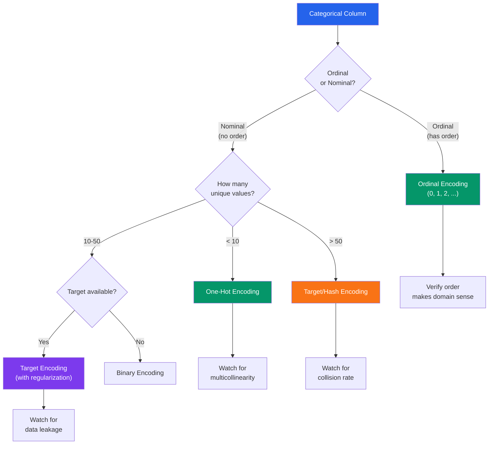

# Categorical Preprocessing

Categorical data is strings pretending to be structured. A "country" column with "US", "USA", "United States", "united states", and "U.S.A." has five representations of one value. A product category with 10,000 unique labels — 9,500 of them appearing fewer than 5 times — makes encoding useless. A column with "High", "Medium", "Low" has an order that one-hot encoding destroys. This page covers every technique for turning messy categorical data into clean, consistently labeled, properly encoded features.

---

## Inconsistency Detection

```python
# inconsistency_detection.py — Find messy categorical values
import pandas as pd
import numpy as np
from collections import Counter
from rapidfuzz import fuzz, process
import logging

logger = logging.getLogger(__name__)


class CategoricalAnalyzer:
    """Detect inconsistencies in categorical columns."""

    def __init__(self, df: pd.DataFrame):
        self.df = df

    def profile_column(self, column: str) -> dict:
        """Generate a comprehensive profile of a categorical column."""
        series = self.df[column]
        value_counts = series.value_counts()

        return {
            "total_values": len(series),
            "null_count": series.isnull().sum(),
            "null_pct": series.isnull().mean() * 100,
            "unique_count": series.nunique(),
            "cardinality_ratio": series.nunique() / len(series),
            "top_5": value_counts.head(5).to_dict(),
            "bottom_5": value_counts.tail(5).to_dict(),
            "has_whitespace_issues": self._check_whitespace(series),
            "has_case_issues": self._check_case(series),
            "rare_categories": self._count_rare(series, threshold=5),
            "potential_duplicates": self._find_fuzzy_duplicates(series),
        }

    def _check_whitespace(self, series: pd.Series) -> dict:
        """Check for leading/trailing whitespace issues."""
        non_null = series.dropna().astype(str)
        stripped = non_null.str.strip()
        diff_count = (non_null != stripped).sum()
        return {
            "has_issues": diff_count > 0,
            "affected_count": int(diff_count),
            "examples": non_null[non_null != stripped].head(3).tolist(),
        }

    def _check_case(self, series: pd.Series) -> dict:
        """Check for case inconsistencies."""
        non_null = series.dropna().astype(str)
        lowered = non_null.str.lower()
        unique_original = non_null.nunique()
        unique_lowered = lowered.nunique()

        if unique_original != unique_lowered:
            # Find specific case conflicts
            conflicts = {}
            for lower_val in lowered.unique():
                originals = non_null[lowered == lower_val].unique()
                if len(originals) > 1:
                    conflicts[lower_val] = list(originals)

            return {
                "has_issues": True,
                "unique_before_fix": unique_original,
                "unique_after_fix": unique_lowered,
                "conflicts": dict(list(conflicts.items())[:5]),
            }

        return {"has_issues": False}

    def _count_rare(self, series: pd.Series, threshold: int = 5) -> dict:
        """Count categories with fewer than `threshold` occurrences."""
        counts = series.value_counts()
        rare = counts[counts < threshold]
        return {
            "count": len(rare),
            "pct_of_categories": len(rare) / len(counts) * 100 if len(counts) > 0 else 0,
            "pct_of_rows": rare.sum() / len(series) * 100 if len(series) > 0 else 0,
            "examples": rare.head(5).to_dict(),
        }

    def _find_fuzzy_duplicates(
        self,
        series: pd.Series,
        threshold: float = 80,
    ) -> list[dict]:
        """Find potential duplicate categories using fuzzy matching."""
        unique_values = series.dropna().unique().tolist()
        if len(unique_values) > 1000:
            # Sample for performance
            unique_values = list(np.random.choice(unique_values, 1000, replace=False))

        duplicates = []
        checked = set()

        for value in unique_values:
            if value in checked:
                continue
            matches = process.extract(
                value,
                [v for v in unique_values if v != value and v not in checked],
                scorer=fuzz.token_sort_ratio,
                limit=3,
                score_cutoff=threshold,
            )
            for match_val, score, _ in matches:
                duplicates.append({
                    "value1": value,
                    "value2": match_val,
                    "similarity": score,
                })
                checked.add(match_val)

        return sorted(duplicates, key=lambda x: x["similarity"], reverse=True)[:10]


# Usage
analyzer = CategoricalAnalyzer(df)
profile = analyzer.profile_column("category")
print(f"Unique values: {profile['unique_count']}")
print(f"Case issues: {profile['has_case_issues']}")
print(f"Rare categories: {profile['rare_categories']['count']}")
if profile["potential_duplicates"]:
    print("Potential duplicates:")
    for dup in profile["potential_duplicates"][:5]:
        print(f"  '{dup['value1']}' ~ '{dup['value2']}' ({dup['similarity']}%)")
```

---

## Fuzzy Category Merging

```python
# fuzzy_merge.py — Merge similar category values
import pandas as pd
from rapidfuzz import fuzz, process
from collections import defaultdict
import logging

logger = logging.getLogger(__name__)


class CategoryMerger:
    """Merge similar categories into canonical values."""

    def __init__(
        self,
        threshold: float = 85,
        scorer=fuzz.token_sort_ratio,
    ):
        self.threshold = threshold
        self.scorer = scorer

    def auto_merge(
        self,
        series: pd.Series,
        canonical_values: list[str] | None = None,
    ) -> tuple[pd.Series, dict]:
        """
        Automatically merge similar categories.

        If canonical_values provided: map all values to the nearest canonical.
        If not: cluster similar values, use most frequent as canonical.
        """
        unique_values = series.dropna().unique().tolist()

        if canonical_values:
            mapping = self._map_to_canonical(unique_values, canonical_values)
        else:
            mapping = self._cluster_and_map(unique_values)

        result = series.map(mapping).fillna(series)
        n_merged = len(unique_values) - len(set(mapping.values()))
        logger.info(f"Merged {n_merged} categories ({len(unique_values)} -> {len(set(mapping.values()))})")

        return result, mapping

    def _map_to_canonical(
        self,
        values: list[str],
        canonical: list[str],
    ) -> dict:
        """Map each value to the nearest canonical value."""
        mapping = {}
        for value in values:
            if value in canonical:
                mapping[value] = value
                continue

            match = process.extractOne(
                value,
                canonical,
                scorer=self.scorer,
                score_cutoff=self.threshold,
            )
            if match:
                mapping[value] = match[0]
            else:
                mapping[value] = value  # Keep original if no match

        return mapping

    def _cluster_and_map(self, values: list[str]) -> dict:
        """Cluster similar values, use most common as canonical."""
        # Sort by length (longer strings are usually more complete)
        sorted_values = sorted(values, key=len, reverse=True)
        clusters = defaultdict(list)
        assigned = set()

        for value in sorted_values:
            if value in assigned:
                continue

            # Find all similar values
            matches = process.extract(
                value,
                [v for v in sorted_values if v not in assigned],
                scorer=self.scorer,
                limit=None,
                score_cutoff=self.threshold,
            )

            cluster_members = [m[0] for m in matches]
            for member in cluster_members:
                assigned.add(member)
                clusters[value].append(member)

        # Build mapping using cluster representative
        mapping = {}
        for canonical, members in clusters.items():
            for member in members:
                mapping[member] = canonical

        return mapping


# Manual merge with rules
class RuleBasedMerger:
    """Merge categories using explicit rules."""

    def __init__(self):
        self.rules: list[dict] = []

    def add_mapping(self, canonical: str, variants: list[str]):
        """Map multiple variants to one canonical value."""
        self.rules.append({
            "canonical": canonical,
            "variants": set(v.lower() for v in variants),
        })
        return self

    def apply(self, series: pd.Series) -> pd.Series:
        """Apply merge rules to a Series."""
        result = series.copy()
        for rule in self.rules:
            mask = result.str.lower().isin(rule["variants"])
            result[mask] = rule["canonical"]
        return result


# Usage
merger = RuleBasedMerger()
merger.add_mapping("Electronics", [
    "electronics", "Electronics", "ELECTRONICS",
    "electronic", "elec", "electr.",
])
merger.add_mapping("Clothing", [
    "clothing", "clothes", "apparel", "garments",
    "wear", "fashion",
])
merger.add_mapping("Food & Beverage", [
    "food", "food & beverage", "f&b", "food and beverage",
    "grocery", "groceries", "edibles",
])

df["category_clean"] = merger.apply(df["category"])
```

---

## Hierarchical Category Handling

```python
# hierarchical_categories.py — Handle multi-level category hierarchies
import pandas as pd
from typing import Optional


class CategoryHierarchy:
    """
    Manage hierarchical categories like:
    Electronics > Computers > Laptops > Gaming Laptops
    """

    def __init__(self, separator: str = " > "):
        self.separator = separator
        self.hierarchy: dict[str, str | None] = {}  # child -> parent

    def add_level(self, parent: str | None, child: str):
        self.hierarchy[child] = parent
        return self

    def build_from_column(
        self,
        series: pd.Series,
        separator: str | None = None,
    ):
        """Build hierarchy from delimited strings."""
        sep = separator or self.separator
        for value in series.dropna().unique():
            parts = [p.strip() for p in value.split(sep)]
            for i, part in enumerate(parts):
                parent = parts[i - 1] if i > 0 else None
                self.hierarchy[part] = parent

    def get_level(self, category: str, level: int) -> Optional[str]:
        """Get the ancestor at a specific level (0 = root)."""
        path = self.get_path(category)
        if level < len(path):
            return path[level]
        return None

    def get_path(self, category: str) -> list[str]:
        """Get the full path from root to this category."""
        path = [category]
        current = category
        while self.hierarchy.get(current) is not None:
            current = self.hierarchy[current]
            path.insert(0, current)
        return path

    def extract_levels(
        self,
        series: pd.Series,
        max_levels: int = 4,
    ) -> pd.DataFrame:
        """Extract hierarchy levels into separate columns."""
        sep = self.separator
        split = series.str.split(sep, expand=True)

        columns = {}
        for i in range(min(max_levels, split.shape[1])):
            columns[f"level_{i}"] = split[i].str.strip()

        return pd.DataFrame(columns)


# Usage
df["category_full"] = pd.Series([
    "Electronics > Computers > Laptops",
    "Electronics > Phones > Smartphones",
    "Clothing > Men > Shirts",
    "Electronics > Computers > Desktops",
    "Clothing > Women > Dresses",
])

hierarchy = CategoryHierarchy()
levels_df = hierarchy.extract_levels(df["category_full"], max_levels=3)
# level_0: Electronics, Clothing
# level_1: Computers, Phones, Men, Women
# level_2: Laptops, Smartphones, Shirts, Desktops, Dresses
```

---

## Rare Category Strategies

```python
# rare_categories.py — Handle categories with few observations
import pandas as pd
import numpy as np


class RareCategoryHandler:
    """Strategies for categories with too few observations."""

    @staticmethod
    def group_rare(
        series: pd.Series,
        min_count: int = 10,
        min_pct: float | None = None,
        other_label: str = "Other",
    ) -> pd.Series:
        """Group rare categories into an 'Other' bucket."""
        counts = series.value_counts()

        if min_pct is not None:
            threshold = len(series) * min_pct
        else:
            threshold = min_count

        frequent = counts[counts >= threshold].index
        result = series.copy()
        result[~result.isin(frequent)] = other_label

        n_grouped = (~series.isin(frequent) & series.notna()).sum()
        print(
            f"Grouped {n_grouped} values into '{other_label}' "
            f"({len(counts) - len(frequent)} rare categories)"
        )
        return result

    @staticmethod
    def group_by_top_n(
        series: pd.Series,
        n: int = 10,
        other_label: str = "Other",
    ) -> pd.Series:
        """Keep only the top N most frequent categories."""
        top_n = series.value_counts().head(n).index
        result = series.copy()
        result[~result.isin(top_n)] = other_label
        return result

    @staticmethod
    def merge_into_parent(
        series: pd.Series,
        child_to_parent: dict[str, str],
        min_count: int = 10,
    ) -> pd.Series:
        """Merge rare categories into their parent category."""
        result = series.copy()
        counts = result.value_counts()
        rare = counts[counts < min_count].index

        for value in rare:
            if value in child_to_parent:
                result[result == value] = child_to_parent[value]

        return result

    @staticmethod
    def target_encode_rare(
        series: pd.Series,
        target: pd.Series,
        min_count: int = 10,
        smoothing: float = 10.0,
    ) -> pd.Series:
        """
        Replace rare categories with smoothed target mean.
        Combines category information with the target for rare groups.
        """
        global_mean = target.mean()
        counts = series.value_counts()

        result = pd.Series(index=series.index, dtype=float)

        for category in series.unique():
            mask = series == category
            cat_count = counts.get(category, 0)

            if pd.isna(category):
                result[mask] = global_mean
            elif cat_count >= min_count:
                cat_mean = target[mask].mean()
                result[mask] = cat_mean
            else:
                # Smooth rare categories toward global mean
                cat_mean = target[mask].mean() if mask.any() else global_mean
                weight = cat_count / (cat_count + smoothing)
                smoothed = weight * cat_mean + (1 - weight) * global_mean
                result[mask] = smoothed

        return result
```

---

## Encoding Selection



### Encoding Implementations

```python
# encodings.py — All major categorical encoding methods
import pandas as pd
import numpy as np
from sklearn.preprocessing import OrdinalEncoder, LabelEncoder
from category_encoders import (
    TargetEncoder,
    BinaryEncoder,
    HashingEncoder,
    LeaveOneOutEncoder,
)
import hashlib


class EncodingToolkit:
    """All major categorical encoding methods in one place."""

    @staticmethod
    def one_hot(
        df: pd.DataFrame,
        columns: list[str],
        drop_first: bool = True,
        max_categories: int = 20,
    ) -> pd.DataFrame:
        """
        One-hot encoding: create binary column per category.

        drop_first=True avoids multicollinearity
        (the dropped category is implicit when all others are 0).
        """
        result = df.copy()
        for col in columns:
            n_unique = result[col].nunique()
            if n_unique > max_categories:
                print(
                    f"WARNING: '{col}' has {n_unique} categories. "
                    f"One-hot will create {n_unique} columns. "
                    f"Consider target or hash encoding."
                )

        return pd.get_dummies(
            result,
            columns=columns,
            drop_first=drop_first,
            dtype=int,
        )

    @staticmethod
    def ordinal(
        df: pd.DataFrame,
        column: str,
        order: list[str],
    ) -> pd.DataFrame:
        """
        Ordinal encoding: map categories to ordered integers.

        ONLY use when categories have a natural order.
        """
        mapping = {val: idx for idx, val in enumerate(order)}
        result = df.copy()
        result[f"{column}_encoded"] = result[column].map(mapping)

        unmapped = result[column][~result[column].isin(mapping)].unique()
        if len(unmapped) > 0:
            print(f"WARNING: Unmapped values in '{column}': {unmapped}")

        return result

    @staticmethod
    def target_encode(
        df: pd.DataFrame,
        column: str,
        target: str,
        smoothing: float = 10.0,
    ) -> pd.DataFrame:
        """
        Target encoding: replace category with mean of target variable.

        WARNING: Must be fit on training data only to avoid leakage.
        Use leave-one-out or k-fold to reduce overfitting.
        """
        result = df.copy()
        global_mean = result[target].mean()

        # Calculate smoothed means
        stats = result.groupby(column)[target].agg(["mean", "count"])
        smoothed = (
            stats["count"] * stats["mean"] + smoothing * global_mean
        ) / (stats["count"] + smoothing)

        result[f"{column}_target_encoded"] = result[column].map(smoothed)
        result[f"{column}_target_encoded"] = result[f"{column}_target_encoded"].fillna(global_mean)

        return result

    @staticmethod
    def frequency_encode(
        df: pd.DataFrame,
        column: str,
    ) -> pd.DataFrame:
        """Frequency encoding: replace with occurrence count or proportion."""
        result = df.copy()
        freq = result[column].value_counts(normalize=True)
        result[f"{column}_freq"] = result[column].map(freq)
        return result

    @staticmethod
    def binary_encode(
        df: pd.DataFrame,
        columns: list[str],
    ) -> pd.DataFrame:
        """
        Binary encoding: encode integer rank in binary.
        Creates log2(n) columns instead of n columns (one-hot).

        Example: 5 categories -> 3 binary columns instead of 5
        """
        encoder = BinaryEncoder(cols=columns)
        return encoder.fit_transform(df)

    @staticmethod
    def hash_encode(
        df: pd.DataFrame,
        columns: list[str],
        n_components: int = 8,
    ) -> pd.DataFrame:
        """
        Hash encoding: fixed number of output dimensions regardless
        of cardinality. Good for very high cardinality.
        Trade-off: hash collisions lose information.
        """
        encoder = HashingEncoder(cols=columns, n_components=n_components)
        return encoder.fit_transform(df)

    @staticmethod
    def label_encode_safe(
        series: pd.Series,
        unknown_value: int = -1,
    ) -> tuple[pd.Series, dict]:
        """
        Label encoding with handling for unseen values.
        Returns encoded series and the mapping dictionary.
        """
        unique_vals = series.dropna().unique()
        mapping = {val: idx for idx, val in enumerate(sorted(unique_vals))}

        result = series.map(mapping)
        result = result.fillna(unknown_value).astype(int)

        return result, mapping


# Encoding selection helper
def select_encoding(
    series: pd.Series,
    has_target: bool = False,
    is_ordinal: bool = False,
    model_type: str = "tree",
) -> str:
    """Recommend encoding method based on column characteristics."""
    n_unique = series.nunique()

    if is_ordinal:
        return "ordinal"

    if model_type in ("tree", "random_forest", "xgboost", "lightgbm"):
        # Tree models can handle ordinal encoding natively
        if n_unique <= 50:
            return "ordinal (label)"
        return "target encoding"

    # Linear/distance-based models
    if n_unique <= 5:
        return "one-hot"
    elif n_unique <= 15:
        return "one-hot (drop_first=True)"
    elif n_unique <= 50:
        if has_target:
            return "target encoding"
        return "binary encoding"
    else:
        if has_target:
            return "target encoding"
        return "hash encoding"
```

---

## Ordinal vs Nominal: Getting It Right

```python
# ordinal_detection.py — Detect and handle ordered categories
import pandas as pd


# Common ordinal patterns in data
KNOWN_ORDINALS = {
    "education": [
        "No formal education", "Primary school", "High school",
        "Associate degree", "Bachelor's degree", "Master's degree",
        "Doctoral degree",
    ],
    "satisfaction": [
        "Very Dissatisfied", "Dissatisfied", "Neutral",
        "Satisfied", "Very Satisfied",
    ],
    "priority": ["Low", "Medium", "High", "Critical"],
    "size": ["XS", "S", "M", "L", "XL", "XXL"],
    "frequency": ["Never", "Rarely", "Sometimes", "Often", "Always"],
    "agreement": [
        "Strongly Disagree", "Disagree", "Neutral",
        "Agree", "Strongly Agree",
    ],
    "risk": ["Negligible", "Low", "Medium", "High", "Critical"],
    "quality": ["Poor", "Fair", "Good", "Very Good", "Excellent"],
}


def detect_ordinal(series: pd.Series) -> dict:
    """Try to detect if a categorical column is ordinal."""
    values = set(series.dropna().str.lower().unique())

    for category_name, order in KNOWN_ORDINALS.items():
        order_lower = set(v.lower() for v in order)
        overlap = values & order_lower

        if len(overlap) >= 3 and len(overlap) / len(values) > 0.5:
            return {
                "is_ordinal": True,
                "matched_pattern": category_name,
                "suggested_order": order,
                "coverage": len(overlap) / len(values),
            }

    # Check for numeric-like ordering
    numeric_ordinals = {"1", "2", "3", "4", "5"}
    if values.issubset(numeric_ordinals | {""}):
        return {
            "is_ordinal": True,
            "matched_pattern": "numeric scale",
            "suggested_order": sorted(values - {""}),
            "coverage": 1.0,
        }

    return {"is_ordinal": False, "matched_pattern": None}


# Usage
result = detect_ordinal(df["satisfaction_level"])
if result["is_ordinal"]:
    print(f"Ordinal detected: {result['matched_pattern']}")
    print(f"Order: {result['suggested_order']}")
    # Apply ordinal encoding
    order_map = {v: i for i, v in enumerate(result["suggested_order"])}
    df["satisfaction_encoded"] = df["satisfaction_level"].str.lower().map(order_map)
```

---

## Quick Reference

| Encoding | Cardinality | Creates N Columns | Preserves Order | Needs Target | Collision Risk |
|----------|------------|-------------------|-----------------|-------------|----------------|
| One-Hot | Low (<15) | N (or N-1) | No | No | No |
| Ordinal | Any | 1 | Yes | No | No |
| Target | Any | 1 | No | Yes | No |
| Frequency | Any | 1 | No | No | No |
| Binary | Medium | log2(N) | No | No | No |
| Hash | High (1000+) | Fixed K | No | No | Yes |
| Leave-One-Out | Any | 1 | No | Yes | No |

| Rare Category Strategy | When to Use |
|-----------------------|-------------|
| Group into "Other" | Categories with < 10 observations |
| Merge into parent | Hierarchical categories |
| Target encoding | When rare categories have meaningful signal |
| Drop rows | When rare categories are errors |
| Frequency encoding | When rarity itself is the signal |

---

::: tip Key Takeaway
- Categorical columns must be cleaned (case, whitespace, fuzzy duplicates) before encoding, or you create separate features for "Electronics" and "electronics".
- Encoding choice depends on cardinality, model type, and whether the variable is ordinal or nominal -- there is no universal best encoding.
- Rare categories should be grouped or merged before encoding; a category appearing 3 times in 1M rows adds noise, not signal.
:::

::: details Exercise
**Clean and Encode a Product Category Column**

Given a DataFrame with a messy `category` column containing values like "Electronics", "electronics", "ELECTRONICS", "Elec.", "Clothing", "clothes", and 500 rare categories each appearing once:
1. Fix case inconsistencies (lowercase all).
2. Merge fuzzy duplicates using rapidfuzz with an 80% threshold.
3. Group rare categories (fewer than 10 occurrences) into "Other".
4. Detect if the column is ordinal using known patterns.
5. Apply the appropriate encoding (one-hot for < 10 categories, target encoding otherwise).

**Solution Sketch**

```python
from rapidfuzz import fuzz, process
import pandas as pd

def clean_and_encode(df, col, target_col=None):
    result = df.copy()
    # Step 1: lowercase
    result[col] = result[col].str.lower().str.strip()
    # Step 2: fuzzy merge
    uniques = result[col].dropna().unique().tolist()
    mapping = {}
    for val in sorted(uniques, key=len, reverse=True):
        if val not in mapping:
            matches = process.extract(val, uniques, scorer=fuzz.token_sort_ratio, score_cutoff=80)
            canonical = max([m[0] for m in matches], key=len)
            for m in matches:
                mapping[m[0]] = canonical
    result[col] = result[col].map(mapping)
    # Step 3: group rare
    counts = result[col].value_counts()
    rare = counts[counts < 10].index
    result.loc[result[col].isin(rare), col] = "other"
    # Step 5: encode
    n_unique = result[col].nunique()
    if n_unique < 10:
        result = pd.get_dummies(result, columns=[col], drop_first=True, dtype=int)
    elif target_col:
        means = result.groupby(col)[target_col].mean()
        result[f"{col}_encoded"] = result[col].map(means)
    return result
```
:::

::: details Debugging Scenario
**Your target encoding produces a perfect-looking model on training data but terrible performance on the test set.**

Diagnose and fix it.

**Answer**

This is **target leakage** through target encoding. When you compute the mean target per category on the training set, each row's own target value influences the encoding it receives. Rare categories with 1-2 rows get an encoding that perfectly matches their target value.

Fixes:
1. **Leave-one-out encoding**: for each row, compute the category mean excluding that row's target value.
2. **K-fold target encoding**: split the training data into K folds and compute category means using only the out-of-fold data.
3. **Smoothing**: blend the category mean with the global mean, weighting by category frequency. Low-frequency categories get pulled toward the global mean: `(count * cat_mean + smoothing * global_mean) / (count + smoothing)`.
4. **Add noise**: add random Gaussian noise to encoded values during training to reduce overfitting.
:::

::: warning Common Misconceptions
- **"One-hot encoding works for any categorical variable."** With 1,000 categories, one-hot creates 1,000 sparse columns that slow training and add noise. Use target or hash encoding for high cardinality.
- **"Label encoding (0, 1, 2, ...) is fine for nominal variables."** Linear models interpret label-encoded nominals as having an order (3 > 2 > 1), creating false relationships. Only use for tree-based models or true ordinals.
- **"Target encoding always leaks information."** Properly implemented target encoding (with smoothing, k-fold, or leave-one-out) avoids leakage. Naive implementation (global mean per category on the full training set) is the leaky version.
- **"Rare categories are harmless."** A category with 2 observations creates an encoding based on 2 data points -- essentially noise. Models memorize these, hurting generalization.
:::

::: details Quiz
**1. What is the difference between ordinal and nominal categorical variables?**

> Ordinal variables have a meaningful order (e.g., Low < Medium < High). Nominal variables have no inherent order (e.g., Red, Blue, Green). Ordinal encoding preserves order; one-hot encoding treats all categories as equidistant.

**2. Why should you use `drop_first=True` in one-hot encoding?**

> Dropping one column avoids multicollinearity (the dummy variable trap). The dropped category is implicitly represented when all other dummy columns are 0.

**3. What is binary encoding, and when is it better than one-hot?**

> Binary encoding maps each category to an integer, then represents that integer in binary (e.g., category 5 becomes columns 1-0-1). It creates log2(N) columns instead of N, useful for medium cardinality (10-50 categories).

**4. How does frequency encoding work?**

> Each category is replaced by its relative frequency (count / total rows) in the training data. It captures rarity as a signal without creating new columns.

**5. When should you use hash encoding?**

> When cardinality exceeds 50-100 categories and no target variable is available. Hash encoding maps categories to a fixed number of columns (e.g., 8) using a hash function, with the trade-off of information loss from hash collisions.
:::

> **One-Liner Summary:** Categorical preprocessing is the pipeline from messy strings ("Electronics", "elec.", "ELECTRONICS") to model-ready features, where the right encoding depends on cardinality, variable type, and downstream model.
