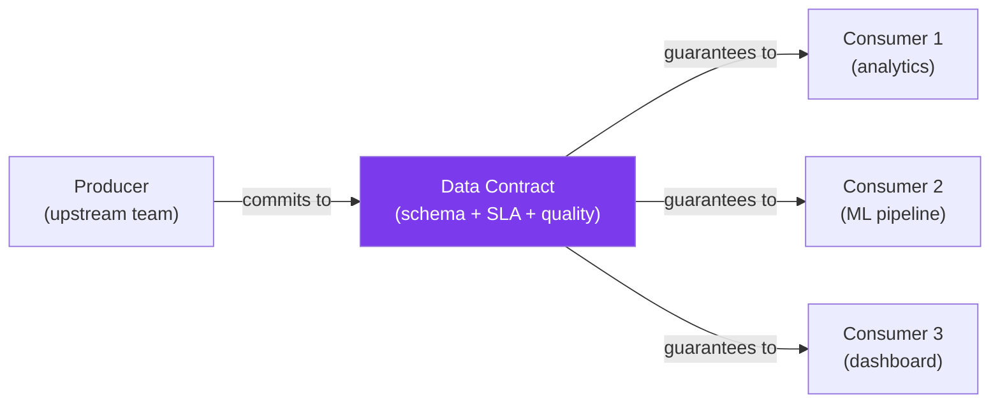

# Data Contracts

A data contract is a formal agreement between a data producer and its consumers about what the data will look like, when it will arrive, and what guarantees come with it. Without contracts, a team that changes a column name breaks every downstream dashboard, model, and report — and nobody finds out until the CEO asks why the numbers are wrong. Data contracts make these dependencies explicit, testable, and enforceable.

---

## What Is a Data Contract?



A data contract specifies:

| Component | What It Covers | Example |
|-----------|---------------|---------|
| **Schema** | Column names, types, constraints | `price FLOAT NOT NULL, price >= 0` |
| **SLA** | Freshness and availability | Data available by 6 AM UTC daily |
| **Quality** | Statistical properties | Null rate < 5%, row count > 1000 |
| **Semantics** | What values mean | `status='active'` means currently available for purchase |
| **Ownership** | Who maintains it | Platform team, contact: data-platform@company.com |
| **Versioning** | How changes are managed | Semantic versioning, 30-day deprecation notice |

---

## Contract Definition Format

```python
# contract_definition.py — Define data contracts in code
from dataclasses import dataclass, field
from datetime import time
from enum import Enum
from typing import Any
import json
import yaml
from pathlib import Path


class ColumnType(Enum):
    STRING = "string"
    INTEGER = "integer"
    FLOAT = "float"
    BOOLEAN = "boolean"
    DATETIME = "datetime"
    DATE = "date"
    JSON = "json"


class ChangeType(Enum):
    BACKWARD_COMPATIBLE = "backward_compatible"  # Can add nullable columns
    BREAKING = "breaking"  # Removed/renamed columns, type changes


@dataclass
class ColumnContract:
    """Contract for a single column."""
    name: str
    type: ColumnType
    description: str
    nullable: bool = True
    unique: bool = False
    primary_key: bool = False
    min_value: Any = None
    max_value: Any = None
    allowed_values: list[str] | None = None
    pattern: str | None = None  # Regex
    deprecated: bool = False
    deprecated_by: str | None = None  # Replacement column


@dataclass
class QualityContract:
    """Quality guarantees for the dataset."""
    min_row_count: int = 1
    max_row_count: int | None = None
    max_null_rate: dict[str, float] = field(default_factory=dict)
    max_duplicate_rate: float = 0.0
    freshness_hours: float = 24.0
    custom_checks: list[dict] = field(default_factory=list)


@dataclass
class SLAContract:
    """Service Level Agreement for data delivery."""
    availability_target: float = 0.99  # 99% uptime
    delivery_deadline_utc: str = "06:00"
    max_latency_minutes: int = 60
    support_contact: str = ""
    escalation_policy: str = ""


@dataclass
class DataContract:
    """Complete data contract between producer and consumers."""
    name: str
    version: str
    description: str
    owner: str
    domain: str

    schema: list[ColumnContract]
    quality: QualityContract
    sla: SLAContract

    consumers: list[str] = field(default_factory=list)
    tags: list[str] = field(default_factory=list)

    def to_yaml(self, path: str):
        """Export contract to YAML for version control."""
        data = {
            "contract": {
                "name": self.name,
                "version": self.version,
                "description": self.description,
                "owner": self.owner,
                "domain": self.domain,
                "consumers": self.consumers,
                "tags": self.tags,
            },
            "schema": [
                {
                    "name": col.name,
                    "type": col.type.value,
                    "description": col.description,
                    "nullable": col.nullable,
                    "unique": col.unique,
                    **({f"min_value": col.min_value} if col.min_value is not None else {}),
                    **({f"max_value": col.max_value} if col.max_value is not None else {}),
                    **({f"allowed_values": col.allowed_values} if col.allowed_values else {}),
                    **({f"pattern": col.pattern} if col.pattern else {}),
                }
                for col in self.schema
            ],
            "quality": {
                "min_row_count": self.quality.min_row_count,
                "max_null_rate": self.quality.max_null_rate,
                "freshness_hours": self.quality.freshness_hours,
            },
            "sla": {
                "availability_target": self.sla.availability_target,
                "delivery_deadline_utc": self.sla.delivery_deadline_utc,
                "max_latency_minutes": self.sla.max_latency_minutes,
                "support_contact": self.sla.support_contact,
            },
        }
        Path(path).write_text(yaml.dump(data, default_flow_style=False, sort_keys=False))

    @classmethod
    def from_yaml(cls, path: str) -> "DataContract":
        """Load contract from YAML."""
        data = yaml.safe_load(Path(path).read_text())
        contract_info = data["contract"]
        schema_data = data.get("schema", [])
        quality_data = data.get("quality", {})
        sla_data = data.get("sla", {})

        return cls(
            name=contract_info["name"],
            version=contract_info["version"],
            description=contract_info["description"],
            owner=contract_info["owner"],
            domain=contract_info["domain"],
            consumers=contract_info.get("consumers", []),
            tags=contract_info.get("tags", []),
            schema=[
                ColumnContract(
                    name=col["name"],
                    type=ColumnType(col["type"]),
                    description=col.get("description", ""),
                    nullable=col.get("nullable", True),
                    unique=col.get("unique", False),
                    min_value=col.get("min_value"),
                    max_value=col.get("max_value"),
                    allowed_values=col.get("allowed_values"),
                    pattern=col.get("pattern"),
                )
                for col in schema_data
            ],
            quality=QualityContract(
                min_row_count=quality_data.get("min_row_count", 1),
                max_null_rate=quality_data.get("max_null_rate", {}),
                freshness_hours=quality_data.get("freshness_hours", 24),
            ),
            sla=SLAContract(
                availability_target=sla_data.get("availability_target", 0.99),
                delivery_deadline_utc=sla_data.get("delivery_deadline_utc", "06:00"),
                max_latency_minutes=sla_data.get("max_latency_minutes", 60),
                support_contact=sla_data.get("support_contact", ""),
            ),
        )


# Define a contract
orders_contract = DataContract(
    name="orders",
    version="2.1.0",
    description="Customer order data from the checkout service",
    owner="checkout-team",
    domain="commerce",
    consumers=["analytics", "ml-recommendations", "finance-dashboard"],
    tags=["critical", "pii"],
    schema=[
        ColumnContract("order_id", ColumnType.INTEGER, "Unique order identifier", nullable=False, unique=True, primary_key=True),
        ColumnContract("customer_id", ColumnType.INTEGER, "Reference to customer", nullable=False),
        ColumnContract("total", ColumnType.FLOAT, "Order total in USD", nullable=False, min_value=0),
        ColumnContract("status", ColumnType.STRING, "Order status", nullable=False, allowed_values=["pending", "confirmed", "shipped", "delivered", "cancelled"]),
        ColumnContract("created_at", ColumnType.DATETIME, "When the order was placed", nullable=False),
        ColumnContract("updated_at", ColumnType.DATETIME, "Last modification timestamp", nullable=False),
    ],
    quality=QualityContract(
        min_row_count=100,
        max_null_rate={"customer_id": 0.0, "total": 0.0, "status": 0.0},
        freshness_hours=4,
    ),
    sla=SLAContract(
        availability_target=0.999,
        delivery_deadline_utc="06:00",
        max_latency_minutes=30,
        support_contact="checkout-team@company.com",
    ),
)

orders_contract.to_yaml("contracts/orders.yaml")
```

---

## Contract Validation

```python
# contract_validator.py — Validate data against a contract
import pandas as pd
import numpy as np
from datetime import datetime
import re
import logging
from dataclasses import dataclass

logger = logging.getLogger(__name__)


@dataclass
class ContractViolation:
    contract_name: str
    check_type: str  # "schema", "quality", "sla"
    column: str | None
    message: str
    severity: str  # "error", "warning"


class ContractValidator:
    """Validate DataFrames against data contracts."""

    def __init__(self, contract):
        self.contract = contract

    def validate(self, df: pd.DataFrame) -> list[ContractViolation]:
        """Run all contract validations."""
        violations = []
        violations.extend(self._validate_schema(df))
        violations.extend(self._validate_quality(df))
        return violations

    def _validate_schema(self, df: pd.DataFrame) -> list[ContractViolation]:
        violations = []

        # Check required columns
        expected_cols = {col.name for col in self.contract.schema if not col.deprecated}
        actual_cols = set(df.columns)
        missing = expected_cols - actual_cols

        for col_name in missing:
            violations.append(ContractViolation(
                contract_name=self.contract.name,
                check_type="schema",
                column=col_name,
                message=f"Required column '{col_name}' is missing",
                severity="error",
            ))

        # Validate each column
        for col_spec in self.contract.schema:
            if col_spec.name not in df.columns:
                continue

            series = df[col_spec.name]

            # Nullable
            if not col_spec.nullable and series.isnull().any():
                violations.append(ContractViolation(
                    contract_name=self.contract.name,
                    check_type="schema",
                    column=col_spec.name,
                    message=f"Column has {series.isnull().sum()} nulls (not nullable)",
                    severity="error",
                ))

            # Unique
            if col_spec.unique and series.duplicated().any():
                violations.append(ContractViolation(
                    contract_name=self.contract.name,
                    check_type="schema",
                    column=col_spec.name,
                    message=f"Column has {series.duplicated().sum()} duplicate values (must be unique)",
                    severity="error",
                ))

            # Min/max value
            if col_spec.min_value is not None:
                below = (series.dropna() < col_spec.min_value).sum()
                if below > 0:
                    violations.append(ContractViolation(
                        contract_name=self.contract.name,
                        check_type="schema",
                        column=col_spec.name,
                        message=f"{below} values below minimum {col_spec.min_value}",
                        severity="error",
                    ))

            # Allowed values
            if col_spec.allowed_values:
                invalid = ~series.dropna().isin(col_spec.allowed_values)
                if invalid.any():
                    bad_values = series.dropna()[invalid].unique()[:5]
                    violations.append(ContractViolation(
                        contract_name=self.contract.name,
                        check_type="schema",
                        column=col_spec.name,
                        message=f"Invalid values: {list(bad_values)}",
                        severity="error",
                    ))

            # Pattern
            if col_spec.pattern:
                non_null = series.dropna().astype(str)
                non_match = ~non_null.str.match(col_spec.pattern)
                if non_match.any():
                    violations.append(ContractViolation(
                        contract_name=self.contract.name,
                        check_type="schema",
                        column=col_spec.name,
                        message=f"{non_match.sum()} values don't match pattern '{col_spec.pattern}'",
                        severity="error",
                    ))

        return violations

    def _validate_quality(self, df: pd.DataFrame) -> list[ContractViolation]:
        violations = []
        quality = self.contract.quality

        # Row count
        if len(df) < quality.min_row_count:
            violations.append(ContractViolation(
                contract_name=self.contract.name,
                check_type="quality",
                column=None,
                message=f"Row count {len(df)} below minimum {quality.min_row_count}",
                severity="error",
            ))

        if quality.max_row_count and len(df) > quality.max_row_count:
            violations.append(ContractViolation(
                contract_name=self.contract.name,
                check_type="quality",
                column=None,
                message=f"Row count {len(df)} above maximum {quality.max_row_count}",
                severity="error",
            ))

        # Null rates
        for col, max_rate in quality.max_null_rate.items():
            if col in df.columns:
                actual_rate = df[col].isnull().mean()
                if actual_rate > max_rate:
                    violations.append(ContractViolation(
                        contract_name=self.contract.name,
                        check_type="quality",
                        column=col,
                        message=f"Null rate {actual_rate:.1%} exceeds max {max_rate:.1%}",
                        severity="error",
                    ))

        return violations

    def validate_and_report(self, df: pd.DataFrame) -> dict:
        """Validate and return a structured report."""
        violations = self.validate(df)
        errors = [v for v in violations if v.severity == "error"]
        warnings = [v for v in violations if v.severity == "warning"]

        passed = len(errors) == 0

        report = {
            "contract": self.contract.name,
            "version": self.contract.version,
            "passed": passed,
            "errors": len(errors),
            "warnings": len(warnings),
            "violations": [
                {
                    "type": v.check_type,
                    "column": v.column,
                    "message": v.message,
                    "severity": v.severity,
                }
                for v in violations
            ],
            "validated_at": datetime.utcnow().isoformat(),
        }

        if not passed:
            logger.error(
                f"Contract '{self.contract.name}' VIOLATED: "
                f"{len(errors)} errors, {len(warnings)} warnings"
            )
        else:
            logger.info(f"Contract '{self.contract.name}' PASSED")

        return report
```

---

## Breaking Change Detection

```python
# breaking_changes.py — Detect breaking changes between contract versions
import logging
from dataclasses import dataclass

logger = logging.getLogger(__name__)


@dataclass
class ContractChange:
    change_type: str  # "breaking" or "compatible"
    description: str
    affected_columns: list[str]


def detect_breaking_changes(
    old_contract,
    new_contract,
) -> list[ContractChange]:
    """Compare two contract versions and detect breaking changes."""
    changes = []

    old_cols = {col.name: col for col in old_contract.schema}
    new_cols = {col.name: col for col in new_contract.schema}

    # Removed columns (BREAKING)
    for col_name in set(old_cols) - set(new_cols):
        if not old_cols[col_name].deprecated:
            changes.append(ContractChange(
                change_type="breaking",
                description=f"Column '{col_name}' removed without deprecation",
                affected_columns=[col_name],
            ))

    # Type changes (BREAKING)
    for col_name in set(old_cols) & set(new_cols):
        old_col = old_cols[col_name]
        new_col = new_cols[col_name]

        if old_col.type != new_col.type:
            changes.append(ContractChange(
                change_type="breaking",
                description=f"Column '{col_name}' type changed: {old_col.type.value} -> {new_col.type.value}",
                affected_columns=[col_name],
            ))

        # Nullable to not-nullable (BREAKING)
        if old_col.nullable and not new_col.nullable:
            changes.append(ContractChange(
                change_type="breaking",
                description=f"Column '{col_name}' changed from nullable to not-nullable",
                affected_columns=[col_name],
            ))

        # Allowed values reduced (BREAKING)
        if old_col.allowed_values and new_col.allowed_values:
            removed_values = set(old_col.allowed_values) - set(new_col.allowed_values)
            if removed_values:
                changes.append(ContractChange(
                    change_type="breaking",
                    description=f"Column '{col_name}' removed allowed values: {removed_values}",
                    affected_columns=[col_name],
                ))

    # Added columns (COMPATIBLE if nullable)
    for col_name in set(new_cols) - set(old_cols):
        new_col = new_cols[col_name]
        if new_col.nullable:
            changes.append(ContractChange(
                change_type="compatible",
                description=f"New nullable column '{col_name}' added",
                affected_columns=[col_name],
            ))
        else:
            changes.append(ContractChange(
                change_type="breaking",
                description=f"New NOT NULL column '{col_name}' added",
                affected_columns=[col_name],
            ))

    # SLA changes (BREAKING if degraded)
    if new_contract.sla.max_latency_minutes > old_contract.sla.max_latency_minutes:
        changes.append(ContractChange(
            change_type="breaking",
            description=(
                f"SLA latency degraded: "
                f"{old_contract.sla.max_latency_minutes}min -> "
                f"{new_contract.sla.max_latency_minutes}min"
            ),
            affected_columns=[],
        ))

    # Report
    breaking = [c for c in changes if c.change_type == "breaking"]
    compatible = [c for c in changes if c.change_type == "compatible"]

    if breaking:
        logger.error(
            f"BREAKING CHANGES detected between "
            f"v{old_contract.version} and v{new_contract.version}:\n"
            + "\n".join(f"  - {c.description}" for c in breaking)
        )
    else:
        logger.info("No breaking changes detected")

    return changes
```

---

## Contract Testing in CI/CD

```python
# test_contracts.py — Test data contracts in CI
import pytest
from contract_definition import DataContract
from contract_validator import ContractValidator
from breaking_changes import detect_breaking_changes
import pandas as pd


class TestOrdersContract:
    """CI tests for the orders data contract."""

    @pytest.fixture
    def contract(self):
        return DataContract.from_yaml("contracts/orders.yaml")

    @pytest.fixture
    def sample_data(self):
        return pd.DataFrame({
            "order_id": [1, 2, 3],
            "customer_id": [101, 102, 103],
            "total": [29.99, 49.99, 15.00],
            "status": ["confirmed", "shipped", "pending"],
            "created_at": pd.to_datetime(["2024-01-01"] * 3),
            "updated_at": pd.to_datetime(["2024-01-02"] * 3),
        })

    def test_sample_data_passes_contract(self, contract, sample_data):
        validator = ContractValidator(contract)
        report = validator.validate_and_report(sample_data)
        assert report["passed"], f"Violations: {report['violations']}"

    def test_no_breaking_changes_from_last_version(self, contract):
        """Ensure current contract is backward compatible."""
        try:
            previous = DataContract.from_yaml("contracts/orders.v2.0.yaml")
        except FileNotFoundError:
            pytest.skip("No previous version to compare")

        changes = detect_breaking_changes(previous, contract)
        breaking = [c for c in changes if c.change_type == "breaking"]
        assert len(breaking) == 0, (
            f"Breaking changes detected:\n"
            + "\n".join(f"  - {c.description}" for c in breaking)
        )

    def test_contract_has_owner(self, contract):
        assert contract.owner, "Contract must have an owner"

    def test_contract_has_sla(self, contract):
        assert contract.sla.support_contact, "SLA must have support contact"
        assert contract.sla.max_latency_minutes > 0, "SLA latency must be positive"
```

---

## Quick Reference

| Contract Component | What It Defines | Who Maintains |
|-------------------|----------------|---------------|
| Schema | Column names, types, constraints | Producer |
| Quality Rules | Null rates, row counts, distributions | Producer + Consumer |
| SLA | Delivery time, availability, latency | Producer |
| Semantics | Business meaning of values | Producer |
| Versioning | Change management, deprecation | Producer |
| Consumer List | Who depends on this data | Both |

| Change Type | Example | Impact |
|------------|---------|--------|
| Backward compatible | Add nullable column | No consumer changes needed |
| Breaking | Remove column | All consumers must update |
| Breaking | Change column type | All consumers must update |
| Breaking | Make nullable column NOT NULL | Consumers may send nulls |
| Compatible | Add new allowed value | Consumers may ignore it |
| Breaking | Remove allowed value | Consumers using it break |

| Tool | Type | Strength |
|------|------|----------|
| Custom YAML contracts | Code | Full flexibility, version control |
| Pandera | Library | Python-native, type annotations |
| Great Expectations | Platform | Rich reporting, auto-profiling |
| Soda | Platform | SQL-first, cloud-native |
| dbt contracts | Built-in | Integrated with dbt models |
| Protobuf/Avro | Schema | Cross-language, schema registry |
