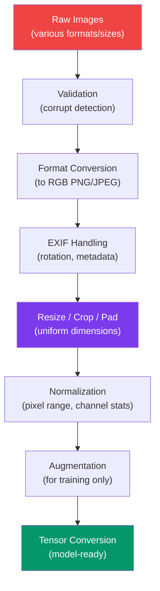

# Image Preprocessing

Image data requires a completely different preprocessing pipeline than tabular or text data. A single 4K photo is 25 million pixels, each with 3 color channels — 75 million values from one row of data. Images come in inconsistent sizes, formats, orientations, and quality. Models expect uniform dimensions, specific pixel ranges, and consistent color spaces. This page covers every step from raw image files to model-ready tensors.

---

## Image Preprocessing Pipeline



---

## Corrupt Image Detection

```python
# corrupt_detection.py — Find and handle corrupt images
from PIL import Image
import io
from pathlib import Path
import logging
from concurrent.futures import ThreadPoolExecutor, as_completed

logger = logging.getLogger(__name__)


def validate_image(filepath: str | Path) -> dict:
    """
    Validate that an image file is not corrupt.
    Checks: file exists, can be opened, can be fully decoded, has valid dimensions.
    """
    filepath = Path(filepath)
    result = {
        "path": str(filepath),
        "valid": False,
        "error": None,
        "width": 0,
        "height": 0,
        "mode": "",
        "format": "",
        "filesize_kb": 0,
    }

    if not filepath.exists():
        result["error"] = "File not found"
        return result

    result["filesize_kb"] = filepath.stat().st_size / 1024

    try:
        with Image.open(filepath) as img:
            # Force full decode (catches truncated files)
            img.load()

            result["valid"] = True
            result["width"] = img.width
            result["height"] = img.height
            result["mode"] = img.mode
            result["format"] = img.format

            # Check for suspicious dimensions
            if img.width == 0 or img.height == 0:
                result["valid"] = False
                result["error"] = "Zero dimension"
            elif img.width > 20000 or img.height > 20000:
                result["error"] = "Suspiciously large dimensions"

    except Exception as e:
        result["error"] = str(e)

    return result


def validate_image_batch(
    image_paths: list[str | Path],
    max_workers: int = 8,
) -> dict:
    """Validate a batch of images in parallel."""
    results = {"valid": [], "corrupt": [], "missing": []}

    with ThreadPoolExecutor(max_workers=max_workers) as executor:
        futures = {
            executor.submit(validate_image, path): path
            for path in image_paths
        }

        for future in as_completed(futures):
            result = future.result()
            if result["valid"]:
                results["valid"].append(result)
            elif result["error"] == "File not found":
                results["missing"].append(result)
            else:
                results["corrupt"].append(result)

    logger.info(
        f"Validation complete: {len(results['valid'])} valid, "
        f"{len(results['corrupt'])} corrupt, "
        f"{len(results['missing'])} missing"
    )
    return results
```

---

## Resize, Crop, and Pad

```python
# resize_ops.py — Image resizing strategies
from PIL import Image
import numpy as np
from enum import Enum


class ResizeStrategy(Enum):
    STRETCH = "stretch"            # Distort aspect ratio to fit
    FIT = "fit"                    # Fit inside target, pad remainder
    COVER = "cover"                # Cover target, crop overflow
    CENTER_CROP = "center_crop"    # Resize then center crop


class ImageResizer:
    """Resize images to uniform dimensions with multiple strategies."""

    def __init__(
        self,
        target_size: tuple[int, int] = (224, 224),
        strategy: ResizeStrategy = ResizeStrategy.FIT,
        pad_color: tuple[int, int, int] = (0, 0, 0),
        interpolation: int = Image.LANCZOS,
    ):
        self.target_size = target_size
        self.strategy = strategy
        self.pad_color = pad_color
        self.interpolation = interpolation

    def resize(self, img: Image.Image) -> Image.Image:
        """Resize image according to configured strategy."""
        if self.strategy == ResizeStrategy.STRETCH:
            return self._stretch(img)
        elif self.strategy == ResizeStrategy.FIT:
            return self._fit_and_pad(img)
        elif self.strategy == ResizeStrategy.COVER:
            return self._cover_and_crop(img)
        elif self.strategy == ResizeStrategy.CENTER_CROP:
            return self._resize_center_crop(img)
        else:
            raise ValueError(f"Unknown strategy: {self.strategy}")

    def _stretch(self, img: Image.Image) -> Image.Image:
        """Simple resize, ignoring aspect ratio."""
        return img.resize(self.target_size, self.interpolation)

    def _fit_and_pad(self, img: Image.Image) -> Image.Image:
        """Resize to fit within target, pad with solid color."""
        target_w, target_h = self.target_size
        img_w, img_h = img.size

        # Calculate scale to fit
        scale = min(target_w / img_w, target_h / img_h)
        new_w = int(img_w * scale)
        new_h = int(img_h * scale)

        resized = img.resize((new_w, new_h), self.interpolation)

        # Create padded canvas
        canvas = Image.new("RGB", self.target_size, self.pad_color)
        paste_x = (target_w - new_w) // 2
        paste_y = (target_h - new_h) // 2
        canvas.paste(resized, (paste_x, paste_y))

        return canvas

    def _cover_and_crop(self, img: Image.Image) -> Image.Image:
        """Resize to cover target, crop the overflow."""
        target_w, target_h = self.target_size
        img_w, img_h = img.size

        # Calculate scale to cover
        scale = max(target_w / img_w, target_h / img_h)
        new_w = int(img_w * scale)
        new_h = int(img_h * scale)

        resized = img.resize((new_w, new_h), self.interpolation)

        # Center crop
        left = (new_w - target_w) // 2
        top = (new_h - target_h) // 2
        return resized.crop((left, top, left + target_w, top + target_h))

    def _resize_center_crop(self, img: Image.Image) -> Image.Image:
        """Resize shortest side to target, then center crop."""
        target_w, target_h = self.target_size
        img_w, img_h = img.size

        # Resize so shortest side matches target
        if img_w / img_h > target_w / target_h:
            # Image is wider — resize height
            new_h = target_h
            new_w = int(img_w * (target_h / img_h))
        else:
            # Image is taller — resize width
            new_w = target_w
            new_h = int(img_h * (target_w / img_w))

        resized = img.resize((new_w, new_h), self.interpolation)

        # Center crop
        left = (new_w - target_w) // 2
        top = (new_h - target_h) // 2
        return resized.crop((left, top, left + target_w, top + target_h))


# Usage
resizer = ImageResizer(
    target_size=(224, 224),
    strategy=ResizeStrategy.FIT,
    pad_color=(128, 128, 128),
)

img = Image.open("photo.jpg")
resized = resizer.resize(img)
resized.save("photo_224.jpg")
```

---

## Normalization

```python
# image_normalization.py — Pixel normalization strategies
import numpy as np
from PIL import Image


class ImageNormalizer:
    """Normalize image pixel values for ML models."""

    # ImageNet statistics (standard for transfer learning)
    IMAGENET_MEAN = np.array([0.485, 0.456, 0.406])
    IMAGENET_STD = np.array([0.229, 0.224, 0.225])

    @staticmethod
    def to_0_1(img: np.ndarray) -> np.ndarray:
        """Scale pixels from [0, 255] to [0, 1]."""
        return img.astype(np.float32) / 255.0

    @staticmethod
    def to_minus1_1(img: np.ndarray) -> np.ndarray:
        """Scale pixels from [0, 255] to [-1, 1]."""
        return (img.astype(np.float32) / 127.5) - 1.0

    @classmethod
    def imagenet_normalize(cls, img: np.ndarray) -> np.ndarray:
        """
        Normalize using ImageNet statistics.
        Standard for ResNet, VGG, EfficientNet, etc.

        Input: [0, 255] uint8 array with shape (H, W, 3)
        Output: float32 array normalized per channel
        """
        img_float = img.astype(np.float32) / 255.0
        return (img_float - cls.IMAGENET_MEAN) / cls.IMAGENET_STD

    @staticmethod
    def per_image_standardize(img: np.ndarray) -> np.ndarray:
        """
        Standardize per-image (zero mean, unit variance).
        Useful when dataset statistics are unknown.
        """
        img_float = img.astype(np.float32)
        mean = img_float.mean()
        std = img_float.std()
        if std == 0:
            return img_float - mean
        return (img_float - mean) / std

    @staticmethod
    def compute_dataset_stats(image_paths: list[str]) -> dict:
        """Compute mean and std across entire dataset (per channel)."""
        pixel_sum = np.zeros(3)
        pixel_sq_sum = np.zeros(3)
        pixel_count = 0

        for path in image_paths:
            img = np.array(Image.open(path).convert("RGB")) / 255.0
            pixel_sum += img.sum(axis=(0, 1))
            pixel_sq_sum += (img ** 2).sum(axis=(0, 1))
            pixel_count += img.shape[0] * img.shape[1]

        mean = pixel_sum / pixel_count
        std = np.sqrt(pixel_sq_sum / pixel_count - mean ** 2)

        return {
            "mean": mean.tolist(),
            "std": std.tolist(),
            "n_images": len(image_paths),
            "n_pixels": pixel_count,
        }
```

---

## Data Augmentation

```python
# augmentation.py — Image augmentation for training data
import numpy as np
from PIL import Image, ImageEnhance, ImageFilter, ImageOps
import random


class ImageAugmenter:
    """
    Apply random augmentations to training images.
    NEVER apply augmentation to validation/test data.
    """

    def __init__(self, seed: int | None = None):
        if seed is not None:
            random.seed(seed)
            np.random.seed(seed)

    def random_horizontal_flip(self, img: Image.Image, p: float = 0.5) -> Image.Image:
        """Randomly flip horizontally."""
        if random.random() < p:
            return img.transpose(Image.FLIP_LEFT_RIGHT)
        return img

    def random_vertical_flip(self, img: Image.Image, p: float = 0.5) -> Image.Image:
        """Randomly flip vertically."""
        if random.random() < p:
            return img.transpose(Image.FLIP_TOP_BOTTOM)
        return img

    def random_rotation(
        self, img: Image.Image, max_degrees: float = 15.0
    ) -> Image.Image:
        """Randomly rotate within range."""
        angle = random.uniform(-max_degrees, max_degrees)
        return img.rotate(angle, fillcolor=(128, 128, 128), expand=False)

    def random_brightness(
        self, img: Image.Image, factor_range: tuple = (0.8, 1.2)
    ) -> Image.Image:
        """Randomly adjust brightness."""
        factor = random.uniform(*factor_range)
        return ImageEnhance.Brightness(img).enhance(factor)

    def random_contrast(
        self, img: Image.Image, factor_range: tuple = (0.8, 1.2)
    ) -> Image.Image:
        """Randomly adjust contrast."""
        factor = random.uniform(*factor_range)
        return ImageEnhance.Contrast(img).enhance(factor)

    def random_saturation(
        self, img: Image.Image, factor_range: tuple = (0.8, 1.2)
    ) -> Image.Image:
        """Randomly adjust color saturation."""
        factor = random.uniform(*factor_range)
        return ImageEnhance.Color(img).enhance(factor)

    def random_crop(
        self,
        img: Image.Image,
        crop_size: tuple[int, int],
    ) -> Image.Image:
        """Randomly crop a region of the specified size."""
        w, h = img.size
        cw, ch = crop_size

        if w < cw or h < ch:
            # Image smaller than crop, resize first
            img = img.resize(
                (max(w, cw), max(h, ch)), Image.LANCZOS
            )
            w, h = img.size

        left = random.randint(0, w - cw)
        top = random.randint(0, h - ch)
        return img.crop((left, top, left + cw, top + ch))

    def random_gaussian_blur(
        self, img: Image.Image, p: float = 0.3, radius: float = 2.0
    ) -> Image.Image:
        """Randomly apply Gaussian blur."""
        if random.random() < p:
            r = random.uniform(0.1, radius)
            return img.filter(ImageFilter.GaussianBlur(radius=r))
        return img

    def random_cutout(
        self,
        img: Image.Image,
        n_holes: int = 1,
        hole_size: int = 32,
    ) -> Image.Image:
        """Random erasing (cutout) — mask random patches with gray."""
        img_array = np.array(img)
        h, w = img_array.shape[:2]

        for _ in range(n_holes):
            y = random.randint(0, h - hole_size)
            x = random.randint(0, w - hole_size)
            img_array[y:y + hole_size, x:x + hole_size] = 128

        return Image.fromarray(img_array)

    def augment(
        self,
        img: Image.Image,
        strength: str = "medium",
    ) -> Image.Image:
        """Apply a preset combination of augmentations."""
        if strength == "light":
            img = self.random_horizontal_flip(img, p=0.5)
            img = self.random_brightness(img, (0.9, 1.1))
            return img

        elif strength == "medium":
            img = self.random_horizontal_flip(img, p=0.5)
            img = self.random_rotation(img, max_degrees=10)
            img = self.random_brightness(img, (0.8, 1.2))
            img = self.random_contrast(img, (0.8, 1.2))
            img = self.random_gaussian_blur(img, p=0.2)
            return img

        elif strength == "heavy":
            img = self.random_horizontal_flip(img, p=0.5)
            img = self.random_vertical_flip(img, p=0.3)
            img = self.random_rotation(img, max_degrees=20)
            img = self.random_brightness(img, (0.6, 1.4))
            img = self.random_contrast(img, (0.6, 1.4))
            img = self.random_saturation(img, (0.6, 1.4))
            img = self.random_gaussian_blur(img, p=0.3, radius=3.0)
            img = self.random_cutout(img, n_holes=2, hole_size=32)
            return img

        return img
```

---

## EXIF Handling

```python
# exif_handling.py — Extract and handle EXIF metadata
from PIL import Image, ExifTags
from PIL.ExifTags import TAGS, GPSTAGS
from pathlib import Path
import json
import logging

logger = logging.getLogger(__name__)


def extract_exif(filepath: str | Path) -> dict:
    """Extract all EXIF metadata from an image."""
    metadata = {}
    try:
        img = Image.open(filepath)
        exif_data = img._getexif()

        if exif_data is None:
            return metadata

        for tag_id, value in exif_data.items():
            tag_name = TAGS.get(tag_id, str(tag_id))

            # Convert bytes to string for JSON serialization
            if isinstance(value, bytes):
                try:
                    value = value.decode("utf-8", errors="replace")
                except Exception:
                    value = str(value)

            metadata[tag_name] = value

    except Exception as e:
        logger.warning(f"Failed to extract EXIF from {filepath}: {e}")

    return metadata


def extract_gps(exif: dict) -> dict | None:
    """Extract GPS coordinates from EXIF data."""
    gps_info = exif.get("GPSInfo")
    if not gps_info:
        return None

    def to_degrees(value):
        """Convert GPS coordinates to decimal degrees."""
        d, m, s = value
        return float(d) + float(m) / 60 + float(s) / 3600

    try:
        lat = to_degrees(gps_info[2])
        lon = to_degrees(gps_info[4])

        if gps_info[1] == "S":
            lat = -lat
        if gps_info[3] == "W":
            lon = -lon

        return {"latitude": lat, "longitude": lon}
    except (KeyError, IndexError, TypeError):
        return None


def auto_orient(img: Image.Image) -> Image.Image:
    """
    Auto-orient image based on EXIF rotation tag.
    Many cameras store photos in landscape orientation with an EXIF
    tag indicating the actual orientation. PIL does not apply this
    automatically.
    """
    return ImageOps.exif_transpose(img)


def strip_exif(filepath: str | Path, output_path: str | Path):
    """Remove all EXIF metadata from an image (for privacy)."""
    img = Image.open(filepath)
    # Create new image without EXIF
    data = list(img.getdata())
    clean_img = Image.new(img.mode, img.size)
    clean_img.putdata(data)
    clean_img.save(output_path)
```

---

## Batch Processing Pipeline

```python
# batch_pipeline.py — Process large image datasets efficiently
from PIL import Image
import numpy as np
from pathlib import Path
from concurrent.futures import ProcessPoolExecutor, as_completed
from dataclasses import dataclass
import logging
import json

logger = logging.getLogger(__name__)


@dataclass
class BatchConfig:
    """Configuration for batch image processing."""
    input_dir: str
    output_dir: str
    target_size: tuple[int, int] = (224, 224)
    output_format: str = "JPEG"
    quality: int = 85
    max_workers: int = 4
    augment: bool = False


def process_single_image(args: tuple) -> dict:
    """Process a single image (runs in subprocess)."""
    input_path, output_path, target_size, output_format, quality = args

    try:
        img = Image.open(input_path).convert("RGB")

        # Auto-orient based on EXIF
        from PIL import ImageOps
        img = ImageOps.exif_transpose(img)

        # Resize with padding
        target_w, target_h = target_size
        img_w, img_h = img.size
        scale = min(target_w / img_w, target_h / img_h)
        new_w = int(img_w * scale)
        new_h = int(img_h * scale)
        resized = img.resize((new_w, new_h), Image.LANCZOS)

        canvas = Image.new("RGB", target_size, (128, 128, 128))
        paste_x = (target_w - new_w) // 2
        paste_y = (target_h - new_h) // 2
        canvas.paste(resized, (paste_x, paste_y))

        # Save
        Path(output_path).parent.mkdir(parents=True, exist_ok=True)
        canvas.save(output_path, output_format, quality=quality)

        return {
            "input": str(input_path),
            "output": str(output_path),
            "original_size": (img_w, img_h),
            "status": "success",
        }
    except Exception as e:
        return {
            "input": str(input_path),
            "status": "error",
            "error": str(e),
        }


class ImageBatchProcessor:
    """Process large image datasets with parallel workers."""

    def __init__(self, config: BatchConfig):
        self.config = config
        self.input_dir = Path(config.input_dir)
        self.output_dir = Path(config.output_dir)
        self.output_dir.mkdir(parents=True, exist_ok=True)

    def discover_images(self) -> list[Path]:
        """Find all images in input directory."""
        extensions = {".jpg", ".jpeg", ".png", ".bmp", ".webp", ".tiff"}
        images = []
        for ext in extensions:
            images.extend(self.input_dir.rglob(f"*{ext}"))
            images.extend(self.input_dir.rglob(f"*{ext.upper()}"))
        return sorted(set(images))

    def process_all(self) -> dict:
        """Process all images in parallel."""
        images = self.discover_images()
        logger.info(f"Found {len(images)} images to process")

        # Build task arguments
        tasks = []
        for img_path in images:
            relative = img_path.relative_to(self.input_dir)
            output_path = self.output_dir / relative.with_suffix(
                ".jpg" if self.config.output_format == "JPEG" else ".png"
            )
            tasks.append((
                str(img_path),
                str(output_path),
                self.config.target_size,
                self.config.output_format,
                self.config.quality,
            ))

        # Process in parallel
        results = {"success": 0, "error": 0, "errors": []}

        with ProcessPoolExecutor(max_workers=self.config.max_workers) as executor:
            futures = [executor.submit(process_single_image, task) for task in tasks]

            for i, future in enumerate(as_completed(futures)):
                result = future.result()
                if result["status"] == "success":
                    results["success"] += 1
                else:
                    results["error"] += 1
                    results["errors"].append(result)

                if (i + 1) % 100 == 0:
                    logger.info(f"Processed {i + 1}/{len(tasks)} images")

        logger.info(
            f"Batch complete: {results['success']} success, "
            f"{results['error']} errors"
        )

        # Save report
        report_path = self.output_dir / "processing_report.json"
        report_path.write_text(json.dumps(results, indent=2))

        return results


# Usage
config = BatchConfig(
    input_dir="./raw_images",
    output_dir="./processed_images",
    target_size=(224, 224),
    output_format="JPEG",
    quality=85,
    max_workers=4,
)

processor = ImageBatchProcessor(config)
results = processor.process_all()
```

---

## Quick Reference

| Operation | PIL | OpenCV |
|-----------|-----|--------|
| Open | `Image.open(path)` | `cv2.imread(path)` |
| Resize | `img.resize((w, h))` | `cv2.resize(img, (w, h))` |
| Crop | `img.crop((l, t, r, b))` | `img[t:b, l:r]` |
| Rotate | `img.rotate(angle)` | `cv2.rotate(img, code)` |
| Color convert | `img.convert("RGB")` | `cv2.cvtColor(img, code)` |
| Save | `img.save(path)` | `cv2.imwrite(path, img)` |
| To numpy | `np.array(img)` | Already numpy |
| Color order | RGB | BGR |

| Normalization | Range | When to Use |
|--------------|-------|-------------|
| / 255.0 | [0, 1] | General purpose |
| ImageNet stats | ~[-2, 2] | Transfer learning (ResNet, VGG) |
| / 127.5 - 1 | [-1, 1] | GANs, some architectures |
| Per-image std | ~[-3, 3] | Unknown domain |
