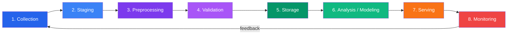

# Data Pipeline Overview

A data pipeline is the full journey data takes from its raw source to the moment it produces value — a trained model, a dashboard metric, an automated decision. Every organization that uses data has pipelines, whether they know it or not. The difference between a successful data team and a struggling one is usually not the algorithms they use but the quality and reliability of the pipelines feeding those algorithms.

This section covers the entire pipeline lifecycle: collection, preprocessing, validation, orchestration, and the end-to-end projects that tie everything together. If you are building anything that touches data — machine learning, analytics, reporting, or automation — this is where you start.

---

## The Pipeline Lifecycle

Every data pipeline, from a three-line script to a thousand-node distributed system, follows the same fundamental stages:



### Stage 1: Collection

Data enters the pipeline from external sources — APIs, web pages, databases, files, IoT sensors, or event streams. The collection layer must handle:

- **Authentication and authorization** — API keys, OAuth tokens, database credentials
- **Rate limiting and backoff** — respecting source system limits
- **Schema discovery** — understanding what the source provides
- **Incremental extraction** — fetching only what has changed since the last run
- **Error handling** — retries, dead-letter queues, partial failure recovery

```python
# collection_example.py — A minimal collection pattern
import requests
import json
from pathlib import Path
from datetime import datetime

class DataCollector:
    """Base class for all data collectors."""

    def __init__(self, name: str, output_dir: str = "./raw"):
        self.name = name
        self.output_dir = Path(output_dir)
        self.output_dir.mkdir(parents=True, exist_ok=True)

    def collect(self) -> Path:
        """Override in subclasses. Returns path to collected data."""
        raise NotImplementedError

    def _save_raw(self, data: dict | list, suffix: str = "") -> Path:
        """Save raw data with timestamp for lineage tracking."""
        timestamp = datetime.utcnow().strftime("%Y%m%d_%H%M%S")
        filename = f"{self.name}_{timestamp}{suffix}.json"
        filepath = self.output_dir / filename
        with open(filepath, "w") as f:
            json.dump(data, f, indent=2, default=str)
        return filepath


class APICollector(DataCollector):
    """Collect data from a REST API with pagination."""

    def __init__(self, name: str, base_url: str, **kwargs):
        super().__init__(name, **kwargs)
        self.base_url = base_url
        self.session = requests.Session()

    def collect(self) -> Path:
        all_records = []
        url = self.base_url
        page = 1

        while url:
            response = self.session.get(url, timeout=30)
            response.raise_for_status()
            data = response.json()

            records = data.get("results", data.get("data", []))
            all_records.extend(records)

            # Handle common pagination patterns
            url = data.get("next", None)
            page += 1

            if page > 1000:  # Safety valve
                break

        return self._save_raw(all_records)


# Usage
collector = APICollector(
    name="products",
    base_url="https://api.example.com/v1/products?page=1"
)
raw_path = collector.collect()
print(f"Collected {raw_path}")
```

### Stage 2: Staging

Raw data lands in a staging area before any transformation. This is critical for:

- **Reproducibility** — you can always reprocess from the raw data
- **Debugging** — when something goes wrong downstream, you can inspect the original input
- **Auditing** — regulatory requirements often mandate raw data retention
- **Idempotency** — reprocessing produces the same output from the same raw input

```python
# staging_example.py — Staging layer with metadata
import hashlib
import json
from dataclasses import dataclass, asdict
from datetime import datetime
from pathlib import Path


@dataclass
class StagingMetadata:
    """Metadata attached to every staged file."""
    source: str
    collected_at: str
    record_count: int
    file_hash: str
    schema_version: str
    collector_version: str


def stage_file(
    raw_path: Path,
    staging_dir: Path,
    source: str,
    schema_version: str = "1.0"
) -> Path:
    """Move raw file to staging with metadata sidecar."""
    staging_dir.mkdir(parents=True, exist_ok=True)

    # Read and hash the raw data
    raw_bytes = raw_path.read_bytes()
    file_hash = hashlib.sha256(raw_bytes).hexdigest()

    # Count records
    data = json.loads(raw_bytes)
    record_count = len(data) if isinstance(data, list) else 1

    # Write staged file
    staged_path = staging_dir / raw_path.name
    staged_path.write_bytes(raw_bytes)

    # Write metadata sidecar
    metadata = StagingMetadata(
        source=source,
        collected_at=datetime.utcnow().isoformat(),
        record_count=record_count,
        file_hash=file_hash,
        schema_version=schema_version,
        collector_version="1.0.0",
    )
    meta_path = staged_path.with_suffix(".meta.json")
    meta_path.write_text(json.dumps(asdict(metadata), indent=2))

    return staged_path
```

### Stage 3: Preprocessing

Raw data is messy. Preprocessing transforms it into a clean, typed, consistent format ready for analysis:

- **Type inference and casting** — detecting and converting data types
- **String normalization** — encoding fixes, whitespace cleanup, case standardization
- **Numerical cleaning** — outlier handling, scaling, missing value treatment
- **Categorical standardization** — merging inconsistent labels, encoding strategies
- **Datetime parsing** — handling dozens of date formats, timezone normalization
- **Deduplication** — finding and removing duplicate records

```python
# preprocessing_example.py — Pipeline stage pattern
import pandas as pd
from typing import Callable


class PreprocessingStep:
    """A single preprocessing operation with logging."""

    def __init__(self, name: str, fn: Callable[[pd.DataFrame], pd.DataFrame]):
        self.name = name
        self.fn = fn

    def __call__(self, df: pd.DataFrame) -> pd.DataFrame:
        rows_before = len(df)
        cols_before = len(df.columns)
        mem_before = df.memory_usage(deep=True).sum()

        result = self.fn(df)

        rows_after = len(result)
        cols_after = len(result.columns)
        mem_after = result.memory_usage(deep=True).sum()

        print(
            f"[{self.name}] "
            f"rows: {rows_before} -> {rows_after} | "
            f"cols: {cols_before} -> {cols_after} | "
            f"mem: {mem_before / 1e6:.1f}MB -> {mem_after / 1e6:.1f}MB"
        )
        return result


class PreprocessingPipeline:
    """Chain of preprocessing steps executed in order."""

    def __init__(self, steps: list[PreprocessingStep] | None = None):
        self.steps = steps or []

    def add(self, name: str, fn: Callable[[pd.DataFrame], pd.DataFrame]):
        self.steps.append(PreprocessingStep(name, fn))
        return self  # Enable chaining

    def run(self, df: pd.DataFrame) -> pd.DataFrame:
        result = df.copy()
        for step in self.steps:
            result = step(result)
        return result


# Usage
pipeline = PreprocessingPipeline()
pipeline.add("drop_duplicates", lambda df: df.drop_duplicates())
pipeline.add("strip_strings", lambda df: df.apply(
    lambda col: col.str.strip() if col.dtype == "object" else col
))
pipeline.add("lowercase_columns", lambda df: df.rename(
    columns={c: c.lower().replace(" ", "_") for c in df.columns}
))

df_raw = pd.read_csv("products.csv")
df_clean = pipeline.run(df_raw)
```

### Stage 4: Validation

Clean data must be validated against expectations before it moves downstream:

- **Schema validation** — correct column names, types, and constraints
- **Statistical validation** — distributions within expected ranges
- **Business rule validation** — domain-specific invariants
- **Completeness checks** — no unexpected nulls, all required records present

### Stage 5: Storage

Validated data is persisted in an appropriate format and location:

- **Data lakes** — raw and processed data in Parquet/Delta Lake format on object storage
- **Data warehouses** — structured data in Snowflake, BigQuery, or Redshift
- **Feature stores** — ML-ready features with versioning and serving capability
- **Databases** — operational data stores for application consumption

### Stage 6: Analysis and Modeling

The payload of the pipeline — the reason all the upstream work exists:

- **Exploratory Data Analysis** — understanding distributions, relationships, anomalies
- **Feature engineering** — creating model-ready features from clean data
- **Model training** — fitting algorithms to prepared datasets
- **Experiment tracking** — recording parameters, metrics, and artifacts

### Stage 7: Serving

Models and insights reach end users:

- **REST APIs** — model predictions served on demand
- **Dashboards** — Streamlit, Grafana, Metabase, or Tableau
- **Batch predictions** — scheduled scoring of new data
- **Embedded analytics** — insights integrated into applications

### Stage 8: Monitoring

The feedback loop that keeps everything healthy:

- **Data freshness** — is the pipeline running on schedule?
- **Data quality** — are distributions stable? Are null rates normal?
- **Model performance** — is prediction accuracy degrading?
- **Infrastructure health** — are resources within limits?

---

## Pipeline Architecture Patterns

### Batch Processing

Data is collected and processed in scheduled intervals (hourly, daily, weekly):

```
┌──────────┐    ┌──────────┐    ┌──────────┐    ┌──────────┐
│  Source   │───>│ Extract  │───>│Transform │───>│   Load   │
│ (DB/API) │    │ (daily)  │    │ (pandas) │    │  (DWH)   │
└──────────┘    └──────────┘    └──────────┘    └──────────┘
                     │                               │
                     └── Scheduled by Airflow/Prefect─┘
```

**When to use:** Historical analytics, ML training data, regulatory reporting, cost-sensitive workloads.

**Trade-offs:** Higher latency (hours), simpler to build and debug, cheaper infrastructure.

### Stream Processing

Data is processed as it arrives, with sub-second to sub-minute latency:

```
┌──────────┐    ┌──────────┐    ┌──────────┐    ┌──────────┐
│  Source   │───>│  Kafka   │───>│  Flink/  │───>│  Sink    │
│ (events) │    │ (buffer) │    │  Spark   │    │ (DB/API) │
└──────────┘    └──────────┘    └──────────┘    └──────────┘
                     │                               │
                     └── Always running, stateful ───┘
```

**When to use:** Real-time dashboards, fraud detection, IoT alerting, recommendation engines.

**Trade-offs:** Lower latency, harder to debug, more expensive, complex state management.

### Lambda Architecture

Parallel batch and streaming layers that merge at the serving layer:

```python
# lambda_architecture.py — Conceptual pattern
class LambdaArchitecture:
    """
    Batch layer: Reprocesses all historical data periodically.
    Speed layer: Processes real-time data for low-latency results.
    Serving layer: Merges both views for queries.
    """

    def __init__(self):
        self.batch_view = {}   # Complete but delayed
        self.speed_view = {}   # Recent but approximate

    def batch_process(self, all_historical_data: list[dict]):
        """Runs periodically (e.g., nightly). Recomputes everything."""
        self.batch_view = self._aggregate(all_historical_data)

    def stream_process(self, event: dict):
        """Runs on every new event. Updates real-time view."""
        key = event["key"]
        if key not in self.speed_view:
            self.speed_view[key] = 0
        self.speed_view[key] += event["value"]

    def query(self, key: str) -> float:
        """Merge batch and speed views."""
        batch = self.batch_view.get(key, 0)
        speed = self.speed_view.get(key, 0)
        return batch + speed

    def _aggregate(self, data: list[dict]) -> dict:
        result = {}
        for record in data:
            key = record["key"]
            result[key] = result.get(key, 0) + record["value"]
        return result
```

### Kappa Architecture

Simplifies Lambda by treating everything as a stream:

```
All data → Kafka (immutable log) → Stream processor → Serving layer
                    │
                    └── Replay from any offset for reprocessing
```

**When to use:** When the batch/streaming code duplication of Lambda is too costly, and your streaming framework can handle reprocessing.

---

## Tools Landscape

### Collection

| Tool | Use Case | Complexity |
|------|----------|------------|
| **requests** | Simple HTTP/API calls | Low |
| **Scrapy** | Large-scale web scraping | Medium |
| **Selenium/Playwright** | JavaScript-rendered pages | Medium |
| **aiodataloader** | Async batch API calls | Medium |
| **Debezium** | Database change data capture | High |
| **Kafka Connect** | Source connectors for databases, APIs | High |
| **Airbyte** | No-code/low-code connectors | Low |
| **Fivetran** | Managed ELT connectors | Low |

### Preprocessing

| Tool | Use Case | Complexity |
|------|----------|------------|
| **pandas** | Single-machine tabular data | Low |
| **Polars** | Fast single-machine processing | Low |
| **PySpark** | Distributed processing | High |
| **Dask** | Parallel pandas-like processing | Medium |
| **Great Expectations** | Data validation | Medium |
| **Pandera** | Schema validation for DataFrames | Low |
| **scikit-learn** | Preprocessing transforms (scalers, encoders) | Low |

### Orchestration

| Tool | Use Case | Complexity |
|------|----------|------------|
| **Airflow** | Production DAG scheduling | High |
| **Prefect** | Modern Python-native orchestration | Medium |
| **Dagster** | Software-defined assets | Medium |
| **Luigi** | Simple task dependencies | Low |
| **cron** | Minimal scheduling (do not use in production) | Low |

### Storage

| Tool | Use Case | Complexity |
|------|----------|------------|
| **Parquet** | Columnar analytics files | Low |
| **Delta Lake** | ACID transactions on data lakes | Medium |
| **Apache Iceberg** | Table format with time travel | Medium |
| **Snowflake** | Cloud data warehouse | Medium |
| **BigQuery** | Serverless analytics warehouse | Medium |
| **DuckDB** | Embedded analytics database | Low |

---

## Choosing Your Pipeline Complexity

Not every project needs Airflow, Kafka, and a data lake. The right architecture depends on:

```python
# complexity_decision.py — Pipeline complexity selector
def select_pipeline_complexity(
    data_volume_gb: float,
    latency_requirement: str,  # "batch", "near-real-time", "real-time"
    team_size: int,
    source_count: int,
    regulatory_requirements: bool,
) -> str:
    """Suggest appropriate pipeline complexity level."""

    score = 0

    # Volume scoring
    if data_volume_gb < 1:
        score += 0
    elif data_volume_gb < 100:
        score += 1
    elif data_volume_gb < 1000:
        score += 2
    else:
        score += 3

    # Latency scoring
    latency_scores = {"batch": 0, "near-real-time": 2, "real-time": 3}
    score += latency_scores.get(latency_requirement, 0)

    # Team size (small teams cannot maintain complex infra)
    if team_size < 3:
        score = min(score, 2)

    # Multiple sources increase complexity
    if source_count > 5:
        score += 1

    # Regulation demands lineage, testing, monitoring
    if regulatory_requirements:
        score += 1

    # Map to recommendation
    if score <= 1:
        return (
            "SIMPLE: Python scripts + cron + CSV/Parquet files. "
            "No orchestrator needed. Use pandas for processing."
        )
    elif score <= 3:
        return (
            "MODERATE: Prefect/Dagster + Parquet + Great Expectations. "
            "Single-machine processing with proper scheduling."
        )
    elif score <= 5:
        return (
            "PRODUCTION: Airflow + data warehouse + dbt + monitoring. "
            "Formal data contracts and CI/CD for pipeline code."
        )
    else:
        return (
            "ENTERPRISE: Kafka + Spark/Flink + Delta Lake + Airflow. "
            "Streaming + batch, full lineage, dedicated platform team."
        )


# Examples
print(select_pipeline_complexity(0.5, "batch", 1, 2, False))
# SIMPLE: Python scripts + cron + CSV/Parquet files...

print(select_pipeline_complexity(50, "near-real-time", 5, 8, True))
# PRODUCTION: Airflow + data warehouse + dbt + monitoring...
```

---

## Data Pipeline Anti-Patterns

### 1. No Raw Data Retention

Transforming data in-place with no way to get back to the original. When (not if) a bug is discovered in your preprocessing, you cannot reprocess.

### 2. Tightly Coupled Stages

When the collection code directly calls the preprocessing code, which directly calls the loading code. Any change ripples through the entire pipeline.

### 3. Schema-on-Read Everywhere

Never validating schemas means every downstream consumer must handle every possible edge case. One source change silently corrupts everything.

### 4. Manual Intervention Required

Pipelines that require a human to fix failures instead of automated retries, dead-letter queues, and alerting. These fail silently on weekends.

### 5. No Idempotency

Running the pipeline twice produces different results (e.g., duplicate records). Every stage should be safe to re-run.

```python
# idempotent_write.py — Idempotent load pattern
import pandas as pd
from pathlib import Path


def idempotent_load(
    df: pd.DataFrame,
    output_path: Path,
    key_columns: list[str],
) -> int:
    """
    Load data idempotently by upserting on key columns.
    Safe to run multiple times with the same input.
    """
    if output_path.exists():
        existing = pd.read_parquet(output_path)
        # Remove existing records that match incoming keys
        merge_keys = df[key_columns].drop_duplicates()
        mask = ~existing.set_index(key_columns).index.isin(
            merge_keys.set_index(key_columns).index
        )
        existing = existing[mask.values]
        combined = pd.concat([existing, df], ignore_index=True)
    else:
        combined = df

    combined.to_parquet(output_path, index=False)
    return len(combined)
```

---

## Section Map

This section is organized into five sub-sections that follow the pipeline lifecycle:

### Data Collection (Pages 1-4)
How to get data from the outside world into your pipeline:
- **Web Scraping at Scale** — Scrapy, BeautifulSoup, Selenium, Playwright
- **API Data Ingestion** — REST pagination, OAuth, rate limiting, async ingestion
- **Database Extraction** — SQLAlchemy, incremental extraction, CDC
- **File Formats Deep Dive** — CSV, JSON, Parquet, Avro, Arrow

### Data Preprocessing (Pages 5-14)
Transforming raw data into analysis-ready datasets:
- **Preprocessing Pipeline Architecture** — staging, checkpoints, DAG design
- **Type Inference & Casting** — dtype optimization, mixed types, memory reduction
- **String Preprocessing** — unicode, encoding, regex extraction, normalization
- **Numerical Preprocessing** — outliers, scaling, transforms, precision
- **Categorical Preprocessing** — fuzzy matching, encoding selection, hierarchy
- **Datetime Preprocessing** — format parsing, timezone handling, DST
- **Text Preprocessing for NLP** — tokenization, stemming, spell correction
- **Image Preprocessing** — resize, augment, normalize, batch process
- **Deduplication Strategies** — exact, fuzzy, LSH, entity resolution
- **Advanced Missing Data Imputation** — KNN, MICE, MissForest, deep learning

### Pipeline Orchestration (Pages 15-18)
Running pipelines reliably in production:
- **Airflow for Data Pipelines** — DAGs, TaskFlow, sensors, monitoring
- **Prefect for Data Pipelines** — flows, tasks, caching, deployments
- **Pipeline Design Patterns** — fan-out, checkpoint-resume, dead letters
- **Pipeline Monitoring & Alerting** — freshness, anomalies, SLA tracking

### Data Validation (Pages 19-21)
Ensuring data quality before it reaches consumers:
- **Great Expectations Deep Dive** — expectations, checkpoints, data docs
- **Pandera Schema Validation** — column checks, hypothesis tests, CI
- **Data Contracts** — SLAs, breaking change detection, contract testing

### End-to-End Projects (Pages 22-24)
Full working pipelines from source to insight:
- **Project: E-Commerce Pipeline** — API to Streamlit dashboard
- **Project: Real Estate Pipeline** — scraping to price analysis
- **Project: IoT Sensor Pipeline** — streaming to anomaly alerting

---

## Prerequisites

This section assumes you are comfortable with:
- **Python fundamentals** — functions, classes, error handling, file I/O
- **pandas basics** — DataFrames, Series, reading/writing files
- **SQL basics** — SELECT, JOIN, WHERE, GROUP BY
- **Command line** — navigating directories, running scripts

If you need to brush up, start with the pandas pages in the EDA section before diving into pipeline architecture.

---

## How to Read This Section

If you are new to data pipelines, read linearly from collection through preprocessing. The concepts build on each other, and the projects at the end assume familiarity with all preceding material.

If you are experienced and looking for specific techniques, jump directly to the page you need — each page is self-contained with working code examples.

If you are building a production pipeline right now, start with **Pipeline Design Patterns** and **Pipeline Monitoring**, then refer back to specific preprocessing pages as needed.
