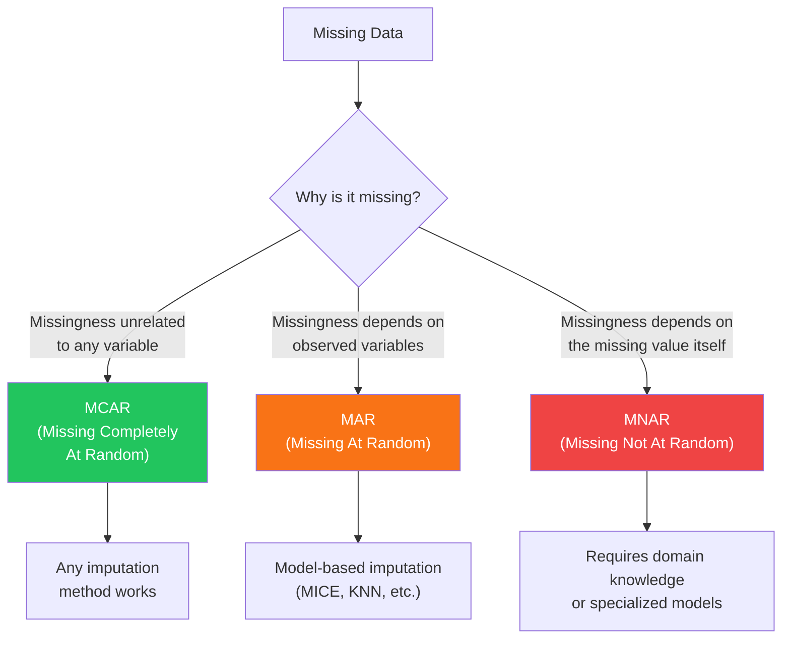

# Advanced Missing Data Imputation

Mean imputation is a lie. It preserves the mean but destroys variance, correlations, and every other statistical property of your data. If 30% of a column is missing and you fill it all with the mean, you have created a spike in the distribution that never existed. Advanced imputation methods use the structure and relationships in your data to generate plausible values, preserving statistical properties and even quantifying uncertainty. This page covers every method worth knowing.

---

## Missing Data Mechanisms

Before choosing an imputation method, you must understand why data is missing:



| Mechanism | Example | Safe to Impute? |
|-----------|---------|-----------------|
| **MCAR** | Random sensor failures | Yes — any method |
| **MAR** | High-income people skip income question, but you know their education level | Yes — use related variables |
| **MNAR** | Depressed patients skip depression score questions | Dangerous — imputed values are biased |

```python
# missing_analysis.py — Analyze missing data patterns
import pandas as pd
import numpy as np
import matplotlib
matplotlib.use("Agg")


def analyze_missing(df: pd.DataFrame) -> dict:
    """Comprehensive missing data analysis."""
    n_rows = len(df)

    column_stats = []
    for col in df.columns:
        n_missing = df[col].isnull().sum()
        pct_missing = n_missing / n_rows * 100

        column_stats.append({
            "column": col,
            "n_missing": n_missing,
            "pct_missing": pct_missing,
            "dtype": str(df[col].dtype),
        })

    stats_df = pd.DataFrame(column_stats).sort_values(
        "pct_missing", ascending=False
    )

    # Missing data pattern analysis
    missing_pattern = df.isnull().astype(int)
    pattern_counts = (
        missing_pattern.groupby(list(missing_pattern.columns))
        .size()
        .reset_index(name="count")
        .sort_values("count", ascending=False)
    )

    # Test MCAR using Little's test approximation
    # Correlation between missingness indicators and observed values
    correlations = {}
    for col in df.columns:
        if df[col].isnull().sum() == 0:
            continue
        missing_indicator = df[col].isnull().astype(int)
        for other_col in df.select_dtypes(include=[np.number]).columns:
            if other_col == col:
                continue
            corr = missing_indicator.corr(df[other_col])
            if abs(corr) > 0.1:
                correlations[f"{col}_missing ~ {other_col}"] = corr

    return {
        "column_stats": stats_df,
        "n_complete_rows": (df.isnull().sum(axis=1) == 0).sum(),
        "pct_complete_rows": (df.isnull().sum(axis=1) == 0).mean() * 100,
        "n_patterns": len(pattern_counts),
        "top_patterns": pattern_counts.head(10),
        "mar_correlations": correlations,
    }
```

---

## KNN Imputation

```python
# knn_imputation.py — K-Nearest Neighbors imputation
import pandas as pd
import numpy as np
from sklearn.impute import KNNImputer
from sklearn.preprocessing import StandardScaler
import logging

logger = logging.getLogger(__name__)


class KNNImputerWrapper:
    """
    KNN Imputation: fill missing values using the mean of K nearest neighbors.

    How it works:
    1. For each missing value, find K complete records most similar to this row.
    2. Use the mean (or weighted mean) of their values for the missing feature.
    3. Similarity is measured by Euclidean distance on non-missing features.

    Pros: Captures local patterns, no distributional assumptions
    Cons: Slow for large datasets (O(n^2)), sensitive to scale, struggles with high-dimensional data
    """

    def __init__(
        self,
        n_neighbors: int = 5,
        weights: str = "distance",  # "uniform" or "distance"
    ):
        self.n_neighbors = n_neighbors
        self.weights = weights
        self.scaler = StandardScaler()
        self.imputer = KNNImputer(
            n_neighbors=n_neighbors,
            weights=weights,
        )

    def fit_transform(
        self,
        df: pd.DataFrame,
        numeric_columns: list[str] | None = None,
    ) -> pd.DataFrame:
        """Impute missing values using KNN."""
        result = df.copy()
        cols = numeric_columns or df.select_dtypes(include=[np.number]).columns.tolist()

        if not cols:
            return result

        # Scale before KNN (distance-based method)
        scaled = self.scaler.fit_transform(result[cols])
        imputed_scaled = self.imputer.fit_transform(scaled)
        imputed = self.scaler.inverse_transform(imputed_scaled)

        result[cols] = imputed

        n_imputed = df[cols].isnull().sum().sum()
        logger.info(f"KNN imputed {n_imputed} values across {len(cols)} columns")

        return result


# Usage
knn = KNNImputerWrapper(n_neighbors=5, weights="distance")
df_imputed = knn.fit_transform(df, numeric_columns=["age", "income", "score"])
```

---

## MICE (Multiple Imputation by Chained Equations)

```python
# mice_imputation.py — MICE iterative imputation
import pandas as pd
import numpy as np
from sklearn.experimental import enable_iterative_imputer
from sklearn.impute import IterativeImputer
from sklearn.linear_model import BayesianRidge, Ridge
from sklearn.ensemble import RandomForestRegressor
import logging

logger = logging.getLogger(__name__)


class MICEImputer:
    """
    MICE: Multiple Imputation by Chained Equations.

    How it works:
    1. Initialize missing values (e.g., with mean).
    2. For each column with missing values:
       a. Treat it as the target variable.
       b. Use all other columns as predictors.
       c. Fit a regression model on observed values.
       d. Predict missing values.
    3. Repeat steps 2a-2d for multiple iterations until convergence.
    4. Optionally, create multiple imputed datasets for uncertainty.

    This is the gold standard for MAR data.
    """

    def __init__(
        self,
        estimator: str = "bayesian_ridge",
        max_iter: int = 10,
        n_imputations: int = 5,
        random_state: int = 42,
    ):
        self.estimator_name = estimator
        self.max_iter = max_iter
        self.n_imputations = n_imputations
        self.random_state = random_state

    def _get_estimator(self):
        estimators = {
            "bayesian_ridge": BayesianRidge(),
            "ridge": Ridge(alpha=1.0),
            "random_forest": RandomForestRegressor(
                n_estimators=50, max_depth=10, random_state=self.random_state
            ),
        }
        return estimators.get(self.estimator_name, BayesianRidge())

    def single_imputation(
        self,
        df: pd.DataFrame,
        numeric_columns: list[str] | None = None,
    ) -> pd.DataFrame:
        """Perform single MICE imputation."""
        result = df.copy()
        cols = numeric_columns or df.select_dtypes(include=[np.number]).columns.tolist()

        imputer = IterativeImputer(
            estimator=self._get_estimator(),
            max_iter=self.max_iter,
            random_state=self.random_state,
            sample_posterior=False,
        )

        result[cols] = imputer.fit_transform(result[cols])

        n_imputed = df[cols].isnull().sum().sum()
        logger.info(f"MICE imputed {n_imputed} values ({self.estimator_name})")

        return result

    def multiple_imputation(
        self,
        df: pd.DataFrame,
        numeric_columns: list[str] | None = None,
    ) -> list[pd.DataFrame]:
        """
        Create multiple imputed datasets for uncertainty quantification.

        Each dataset has slightly different imputed values, reflecting
        uncertainty about the true values. Analyze each separately,
        then combine results using Rubin's rules.
        """
        cols = numeric_columns or df.select_dtypes(include=[np.number]).columns.tolist()
        imputed_datasets = []

        for i in range(self.n_imputations):
            imputer = IterativeImputer(
                estimator=self._get_estimator(),
                max_iter=self.max_iter,
                random_state=self.random_state + i,
                sample_posterior=True,  # Add randomness for multiple imputation
            )

            result = df.copy()
            result[cols] = imputer.fit_transform(result[cols])
            imputed_datasets.append(result)

            logger.info(f"MICE imputation {i + 1}/{self.n_imputations} complete")

        return imputed_datasets


def rubins_rules(estimates: list[float], variances: list[float]) -> dict:
    """
    Combine estimates from multiple imputed datasets using Rubin's rules.

    Returns pooled estimate and confidence interval.
    """
    m = len(estimates)
    mean_estimate = np.mean(estimates)

    # Within-imputation variance
    within_var = np.mean(variances)

    # Between-imputation variance
    between_var = np.var(estimates, ddof=1)

    # Total variance
    total_var = within_var + (1 + 1 / m) * between_var

    # Confidence interval
    se = np.sqrt(total_var)

    return {
        "pooled_estimate": mean_estimate,
        "total_variance": total_var,
        "within_variance": within_var,
        "between_variance": between_var,
        "standard_error": se,
        "ci_lower": mean_estimate - 1.96 * se,
        "ci_upper": mean_estimate + 1.96 * se,
    }


# Usage
mice = MICEImputer(estimator="bayesian_ridge", n_imputations=5)
df_single = mice.single_imputation(df)

# Multiple imputation with uncertainty
imputed_datasets = mice.multiple_imputation(df)

# Example: pool regression coefficients
estimates = []
variances = []
for imp_df in imputed_datasets:
    from sklearn.linear_model import LinearRegression
    model = LinearRegression()
    X = imp_df[["feature1", "feature2"]].values
    y = imp_df["target"].values
    model.fit(X, y)
    estimates.append(model.coef_[0])
    # Use bootstrap or analytic formula for variance
    variances.append(0.01)  # Simplified

pooled = rubins_rules(estimates, variances)
print(f"Pooled coefficient: {pooled['pooled_estimate']:.4f} "
      f"[{pooled['ci_lower']:.4f}, {pooled['ci_upper']:.4f}]")
```

---

## MissForest

```python
# missforest.py — Random Forest-based imputation
import pandas as pd
import numpy as np
from sklearn.ensemble import RandomForestRegressor, RandomForestClassifier
from sklearn.preprocessing import LabelEncoder
import logging

logger = logging.getLogger(__name__)


class MissForest:
    """
    MissForest: Non-parametric imputation using Random Forests.

    Advantages over MICE:
    - Handles both numeric and categorical variables natively
    - Captures non-linear relationships
    - No distributional assumptions
    - Generally more accurate than MICE on mixed-type data

    Disadvantage: slower than MICE for large datasets
    """

    def __init__(
        self,
        max_iter: int = 10,
        n_estimators: int = 100,
        random_state: int = 42,
        convergence_threshold: float = 1e-4,
    ):
        self.max_iter = max_iter
        self.n_estimators = n_estimators
        self.random_state = random_state
        self.convergence_threshold = convergence_threshold

    def fit_transform(self, df: pd.DataFrame) -> pd.DataFrame:
        """Impute missing values using MissForest algorithm."""
        result = df.copy()

        # Identify column types
        numeric_cols = result.select_dtypes(include=[np.number]).columns.tolist()
        categorical_cols = result.select_dtypes(include=["object", "category"]).columns.tolist()

        # Encode categoricals
        encoders = {}
        for col in categorical_cols:
            le = LabelEncoder()
            non_null = result[col].dropna()
            le.fit(non_null)
            result.loc[non_null.index, col] = le.transform(non_null)
            encoders[col] = le

        # Sort columns by number of missing values (ascending)
        missing_counts = result.isnull().sum()
        cols_with_missing = missing_counts[missing_counts > 0].sort_values().index.tolist()

        if not cols_with_missing:
            return df  # Nothing to impute

        # Initialize with column medians/modes
        for col in cols_with_missing:
            if col in numeric_cols:
                result[col] = result[col].fillna(result[col].median())
            else:
                mode = result[col].mode()
                fill_val = mode[0] if len(mode) > 0 else 0
                result[col] = result[col].fillna(fill_val)

        # Iterative imputation
        all_cols = numeric_cols + categorical_cols
        previous_values = result[cols_with_missing].values.copy()

        for iteration in range(self.max_iter):
            for col in cols_with_missing:
                # Split into observed and missing
                missing_mask = df[col].isnull()
                observed_mask = ~missing_mask

                if missing_mask.sum() == 0:
                    continue

                # Features = all other columns
                feature_cols = [c for c in all_cols if c != col]
                X_train = result.loc[observed_mask, feature_cols].astype(float)
                y_train = result.loc[observed_mask, col].astype(float)
                X_predict = result.loc[missing_mask, feature_cols].astype(float)

                # Choose model based on column type
                if col in numeric_cols:
                    model = RandomForestRegressor(
                        n_estimators=self.n_estimators,
                        random_state=self.random_state,
                        n_jobs=-1,
                    )
                else:
                    model = RandomForestClassifier(
                        n_estimators=self.n_estimators,
                        random_state=self.random_state,
                        n_jobs=-1,
                    )

                model.fit(X_train, y_train)
                predictions = model.predict(X_predict)
                result.loc[missing_mask, col] = predictions

            # Check convergence
            current_values = result[cols_with_missing].values
            diff = np.sum((current_values - previous_values) ** 2)
            norm = np.sum(current_values ** 2)
            relative_change = diff / norm if norm > 0 else 0

            logger.info(
                f"Iteration {iteration + 1}: relative change = {relative_change:.6f}"
            )

            if relative_change < self.convergence_threshold:
                logger.info(f"Converged at iteration {iteration + 1}")
                break

            previous_values = current_values.copy()

        # Decode categoricals back
        for col, le in encoders.items():
            result[col] = le.inverse_transform(result[col].astype(int))

        return result


# Usage
mf = MissForest(max_iter=10, n_estimators=100)
df_imputed = mf.fit_transform(df)
```

---

## Imputation Evaluation

```python
# imputation_evaluation.py — Evaluate imputation quality
import pandas as pd
import numpy as np
from sklearn.metrics import mean_squared_error, mean_absolute_error
import logging

logger = logging.getLogger(__name__)


class ImputationEvaluator:
    """
    Evaluate imputation quality by artificially introducing missing values
    into complete data and comparing imputed values to the truth.
    """

    def __init__(self, random_state: int = 42):
        self.random_state = random_state
        self.rng = np.random.RandomState(random_state)

    def create_artificial_missing(
        self,
        df: pd.DataFrame,
        columns: list[str],
        missing_rate: float = 0.2,
    ) -> tuple[pd.DataFrame, pd.DataFrame]:
        """
        Introduce artificial missing values into complete data.

        Returns: (df_with_missing, mask_of_artificial_missing)
        """
        result = df.copy()
        mask = pd.DataFrame(False, index=df.index, columns=columns)

        for col in columns:
            complete_rows = df[col].notna()
            n_to_mask = int(complete_rows.sum() * missing_rate)
            mask_indices = self.rng.choice(
                df[complete_rows].index, n_to_mask, replace=False
            )
            result.loc[mask_indices, col] = np.nan
            mask.loc[mask_indices, col] = True

        return result, mask

    def evaluate(
        self,
        original: pd.DataFrame,
        imputed: pd.DataFrame,
        mask: pd.DataFrame,
        columns: list[str],
    ) -> pd.DataFrame:
        """Compare imputed values to original values where artificially masked."""
        results = []

        for col in columns:
            masked = mask[col]
            if not masked.any():
                continue

            true_values = original.loc[masked, col].astype(float)
            pred_values = imputed.loc[masked, col].astype(float)

            rmse = np.sqrt(mean_squared_error(true_values, pred_values))
            mae = mean_absolute_error(true_values, pred_values)
            orig_std = original[col].std()
            nrmse = rmse / orig_std if orig_std > 0 else np.inf

            # Distribution similarity
            orig_mean = original[col].mean()
            imp_mean = imputed[col].mean()
            mean_shift = abs(imp_mean - orig_mean) / orig_std if orig_std > 0 else 0

            orig_var = original[col].var()
            imp_var = imputed[col].var()
            var_ratio = imp_var / orig_var if orig_var > 0 else np.inf

            results.append({
                "column": col,
                "n_imputed": int(masked.sum()),
                "rmse": rmse,
                "mae": mae,
                "nrmse": nrmse,
                "mean_shift": mean_shift,
                "variance_ratio": var_ratio,
            })

        return pd.DataFrame(results)

    def compare_methods(
        self,
        df: pd.DataFrame,
        columns: list[str],
        imputers: dict,
        missing_rate: float = 0.2,
    ) -> pd.DataFrame:
        """Compare multiple imputation methods on the same data."""
        df_missing, mask = self.create_artificial_missing(df, columns, missing_rate)

        all_results = []
        for method_name, imputer_fn in imputers.items():
            logger.info(f"Evaluating: {method_name}")
            try:
                imputed = imputer_fn(df_missing)
                eval_results = self.evaluate(df, imputed, mask, columns)
                eval_results["method"] = method_name
                all_results.append(eval_results)
            except Exception as e:
                logger.error(f"Method '{method_name}' failed: {e}")

        if all_results:
            return pd.concat(all_results, ignore_index=True)
        return pd.DataFrame()


# Usage
evaluator = ImputationEvaluator()

# Define imputation methods to compare
from sklearn.impute import SimpleImputer, KNNImputer

def mean_impute(df):
    result = df.copy()
    cols = df.select_dtypes(include=[np.number]).columns
    result[cols] = SimpleImputer(strategy="mean").fit_transform(result[cols])
    return result

def median_impute(df):
    result = df.copy()
    cols = df.select_dtypes(include=[np.number]).columns
    result[cols] = SimpleImputer(strategy="median").fit_transform(result[cols])
    return result

def knn_impute(df):
    result = df.copy()
    cols = df.select_dtypes(include=[np.number]).columns
    result[cols] = KNNImputer(n_neighbors=5).fit_transform(result[cols])
    return result

def mice_impute(df):
    mice = MICEImputer(estimator="bayesian_ridge")
    return mice.single_imputation(df)

# Compare
comparison = evaluator.compare_methods(
    df_complete,
    columns=["age", "income", "score"],
    imputers={
        "mean": mean_impute,
        "median": median_impute,
        "knn_5": knn_impute,
        "mice": mice_impute,
    },
    missing_rate=0.2,
)

print(comparison[["method", "column", "nrmse", "variance_ratio"]].to_string())
```

---

## Imputation Strategy Selection

```python
# strategy_selection.py — Recommend imputation strategy
def recommend_imputation(
    df: pd.DataFrame,
    column: str,
    target_column: str | None = None,
) -> str:
    """Recommend an imputation strategy based on data characteristics."""
    series = df[column]
    missing_pct = series.isnull().mean() * 100
    n_rows = len(df)
    n_numeric = len(df.select_dtypes(include=[np.number]).columns)

    if missing_pct == 0:
        return "No missing values"

    if missing_pct > 70:
        return (
            "DROP COLUMN: >70% missing. Column is likely uninformative. "
            "Consider adding a 'was_present' indicator before dropping."
        )

    if missing_pct > 40:
        return (
            "MICE or MissForest: High missing rate requires model-based "
            "imputation to avoid bias. Create a missing indicator column. "
            "Consider whether data is MNAR."
        )

    if pd.api.types.is_numeric_dtype(series):
        if missing_pct < 5:
            return (
                "MEDIAN: Low missing rate, simple median imputation is "
                "sufficient. Less sensitive to outliers than mean."
            )
        elif n_rows < 1000:
            return (
                "KNN (k=5): Small dataset, KNN captures local patterns "
                "without needing many observations."
            )
        elif n_numeric > 5:
            return (
                "MICE (BayesianRidge): Multiple numeric columns available. "
                "MICE leverages inter-column correlations. Use multiple "
                "imputation if doing statistical inference."
            )
        else:
            return (
                "KNN or MICE: Moderate missing rate. Both work well. "
                "KNN for non-linear relationships, MICE for linear."
            )
    else:
        if missing_pct < 5:
            return "MODE: Low missing rate, use most frequent category."
        else:
            return (
                "MissForest: Categorical data with significant missingness. "
                "MissForest handles mixed types natively."
            )
```

---

## Quick Reference

| Method | Type | Handles Categorical | Speed | Accuracy | Preserves Variance |
|--------|------|-------------------|-------|----------|-------------------|
| Mean/Median | Simple | No | Instant | Low | No |
| Mode | Simple | Yes | Instant | Low | No |
| KNN | Model-based | No (needs encoding) | Slow (O(n^2)) | Medium | Partially |
| MICE | Model-based | Via encoding | Medium | High | Yes |
| MissForest | Model-based | Yes (native) | Slow | Highest | Yes |
| EM Algorithm | Statistical | No | Medium | High | Yes |
| Matrix Factorization | Latent | No | Medium | Medium | Partially |

| Missing % | Recommended Approach |
|-----------|---------------------|
| < 5% | Mean/median/mode (simple) |
| 5-20% | KNN or MICE |
| 20-40% | MICE with multiple imputation |
| 40-70% | MissForest + missing indicator |
| > 70% | Drop column + missing indicator |

| Evaluation Metric | Measures | Good Value |
|-------------------|----------|------------|
| NRMSE | Accuracy of imputed values | < 0.3 |
| Mean shift | Bias in imputed distribution | < 0.1 |
| Variance ratio | Preservation of spread | 0.8 - 1.2 |
| Correlation preservation | Relationship maintenance | > 0.9 |

---

::: tip Key Takeaway
- Mean imputation preserves the mean but destroys variance, correlations, and distributional shape -- it is almost never the right choice for more than 5% missing data.
- MICE (Multiple Imputation by Chained Equations) is the gold standard for MAR data because it models inter-column relationships and can quantify imputation uncertainty.
- Before choosing an imputation method, determine why data is missing (MCAR, MAR, MNAR) -- MNAR data cannot be safely imputed without domain-specific models.
:::

::: details Exercise
**Compare Imputation Methods**

Given a complete DataFrame, artificially mask 20% of values in 3 numeric columns, then:
1. Impute using mean, median, KNN (k=5), and MICE (BayesianRidge).
2. For each method, compute NRMSE (normalized root mean squared error) against the true values.
3. Compare the variance ratio (imputed variance / original variance) for each method.
4. Determine which method best preserves the correlation structure.

**Solution Sketch**

```python
import numpy as np, pandas as pd
from sklearn.impute import SimpleImputer, KNNImputer
from sklearn.experimental import enable_iterative_imputer
from sklearn.impute import IterativeImputer
from sklearn.metrics import mean_squared_error

np.random.seed(42)
df = pd.DataFrame({"a": np.random.randn(1000), "b": np.random.randn(1000)*2+5, "c": np.random.randn(1000)*0.5})
# Mask 20%
mask = np.random.random(df.shape) < 0.2
df_masked = df.copy()
df_masked[mask] = np.nan

methods = {
    "mean": SimpleImputer(strategy="mean"),
    "median": SimpleImputer(strategy="median"),
    "knn_5": KNNImputer(n_neighbors=5),
    "mice": IterativeImputer(max_iter=10, random_state=42),
}

for name, imp in methods.items():
    filled = pd.DataFrame(imp.fit_transform(df_masked), columns=df.columns)
    nrmse = np.sqrt(mean_squared_error(df[mask], filled[mask])) / df.std().mean()
    var_ratio = filled.var().mean() / df.var().mean()
    print(f"{name:8s}: NRMSE={nrmse:.4f}, VarRatio={var_ratio:.3f}")
```
:::

::: details Debugging Scenario
**After imputing missing values in your dataset, your linear regression model's R-squared drops from 0.85 to 0.60. The number of missing values was only 8%.**

Diagnose and fix it.

**Answer**

Mean imputation is the most likely culprit. When 8% of values are replaced with the column mean:
1. **Variance shrinks**: the imputed values cluster at the mean, reducing the column's spread.
2. **Correlations weaken**: imputed values have no relationship to other columns, diluting genuine correlations that the regression relies on.
3. **Artificial spike**: the distribution gains an artificial spike at the mean, violating the normality assumption.

Fix:
1. **Use MICE or KNN imputation** which model inter-column relationships, preserving correlations.
2. **Add a missing indicator** column (`column_is_missing`) so the model can learn that imputed rows behave differently.
3. **Evaluate imputation quality** by comparing variance ratios and correlations before and after imputation.
4. **If doing statistical inference**, use multiple imputation with Rubin's rules to get correct standard errors and confidence intervals.
:::

::: warning Common Misconceptions
- **"Mean imputation is simple and harmless."** It destroys variance, attenuates correlations, and biases every statistical test. It is only acceptable for trivially small missing rates (< 2%).
- **"KNN imputation is always better than MICE."** KNN is O(n^2), struggles with high-dimensional data, and does not handle categorical variables natively. MICE scales better and handles mixed types.
- **"If data is MNAR, you should still impute."** MNAR means the missingness depends on the missing value itself (e.g., high-income people skip the income question). Standard imputation methods produce biased results for MNAR data.
- **"One imputed dataset is sufficient."** Single imputation underestimates uncertainty. Multiple imputation creates several datasets, analyzes each separately, and pools results using Rubin's rules for correct inference.
- **"MissForest is always the best imputation method."** MissForest is the most flexible but also the slowest. For purely numeric datasets with linear relationships, MICE with BayesianRidge is faster and equally accurate.
:::

::: details Quiz
**1. What are the three missing data mechanisms (MCAR, MAR, MNAR)?**

> MCAR: missingness is completely random (sensor failure). MAR: missingness depends on observed variables (high-income people skip income question, but we know their education). MNAR: missingness depends on the missing value itself (depressed patients skip depression scores).

**2. Why does mean imputation destroy variance?**

> All imputed values are identical (the mean), creating a spike in the distribution that shrinks the overall spread. The standard deviation decreases artificially, making the data appear more concentrated than it truly is.

**3. How does MICE differ from single regression imputation?**

> Single regression imputes each column once using other columns as predictors. MICE iterates: it imputes column 1, then uses the imputed column 1 to improve column 2's imputation, then re-imputes column 1 using the improved column 2, repeating until convergence. This captures inter-column dependencies more accurately.

**4. What is Rubin's rules, and when do you need it?**

> Rubin's rules combine estimates from multiple imputed datasets into a single pooled estimate with correct standard errors. You need it when doing statistical inference (hypothesis tests, confidence intervals) with multiply imputed data.

**5. When should you drop a column instead of imputing it?**

> When more than 70% of values are missing. At that point, any imputation method is essentially fabricating the majority of the column, and the imputed values carry little genuine information. Add a binary "was_present" indicator before dropping.
:::

> **One-Liner Summary:** Mean imputation is a statistically destructive lie; production pipelines use MICE, KNN, or MissForest to preserve variance, correlations, and distributional shape while quantifying imputation uncertainty.
