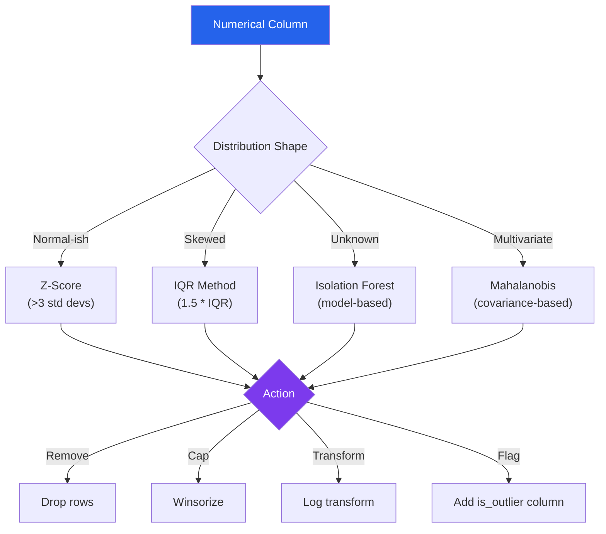

# Numerical Preprocessing

Numerical columns are deceptively complex. A price column with one value of -999 (sentinel for missing) destroys your mean. An income column spanning $0 to $10,000,000 makes most ML algorithms focus entirely on the outliers. A sensor reading of `inf` crashes your scaler. Two features on different scales make distance-based algorithms useless. This page covers every technique for turning raw numbers into clean, analysis-ready values.

---

## Outlier Detection Strategies



### Statistical Outlier Detection

```python
# outlier_detection.py — Multiple outlier detection methods
import pandas as pd
import numpy as np
from scipy import stats
from sklearn.ensemble import IsolationForest
from sklearn.neighbors import LocalOutlierFactor


class OutlierDetector:
    """Detect outliers using multiple statistical methods."""

    @staticmethod
    def zscore_outliers(
        series: pd.Series,
        threshold: float = 3.0,
    ) -> pd.Series:
        """
        Z-score method: flag values more than `threshold` standard
        deviations from the mean.

        Best for: approximately normal distributions.
        Problem: mean and std are themselves affected by outliers.
        """
        z_scores = np.abs(stats.zscore(series.dropna()))
        mask = pd.Series(False, index=series.index)
        mask[series.dropna().index] = z_scores > threshold
        return mask

    @staticmethod
    def modified_zscore_outliers(
        series: pd.Series,
        threshold: float = 3.5,
    ) -> pd.Series:
        """
        Modified Z-score using median and MAD (Median Absolute Deviation).
        More robust than standard Z-score because median and MAD
        are not influenced by extreme values.
        """
        median = series.median()
        mad = np.median(np.abs(series.dropna() - median))
        if mad == 0:
            return pd.Series(False, index=series.index)

        modified_z = 0.6745 * (series - median) / mad
        return np.abs(modified_z) > threshold

    @staticmethod
    def iqr_outliers(
        series: pd.Series,
        multiplier: float = 1.5,
    ) -> pd.Series:
        """
        IQR method: flag values below Q1 - multiplier*IQR
        or above Q3 + multiplier*IQR.

        Best for: skewed distributions.
        multiplier=1.5 -> "outliers", multiplier=3.0 -> "extreme outliers"
        """
        Q1 = series.quantile(0.25)
        Q3 = series.quantile(0.75)
        IQR = Q3 - Q1

        lower_bound = Q1 - multiplier * IQR
        upper_bound = Q3 + multiplier * IQR

        return (series < lower_bound) | (series > upper_bound)

    @staticmethod
    def percentile_outliers(
        series: pd.Series,
        lower_pct: float = 0.01,
        upper_pct: float = 0.99,
    ) -> pd.Series:
        """Simple percentile-based clipping boundaries."""
        lower = series.quantile(lower_pct)
        upper = series.quantile(upper_pct)
        return (series < lower) | (series > upper)

    @staticmethod
    def isolation_forest_outliers(
        df: pd.DataFrame,
        columns: list[str],
        contamination: float = 0.05,
    ) -> pd.Series:
        """
        Isolation Forest: model-based multivariate outlier detection.
        Works on multiple columns simultaneously.
        No assumption about distribution shape.
        """
        data = df[columns].dropna()
        clf = IsolationForest(
            contamination=contamination,
            random_state=42,
            n_estimators=100,
        )
        predictions = clf.fit_predict(data)

        mask = pd.Series(False, index=df.index)
        mask[data.index] = predictions == -1
        return mask

    @staticmethod
    def lof_outliers(
        df: pd.DataFrame,
        columns: list[str],
        contamination: float = 0.05,
        n_neighbors: int = 20,
    ) -> pd.Series:
        """Local Outlier Factor: density-based outlier detection."""
        data = df[columns].dropna()
        clf = LocalOutlierFactor(
            n_neighbors=n_neighbors,
            contamination=contamination,
        )
        predictions = clf.fit_predict(data)

        mask = pd.Series(False, index=df.index)
        mask[data.index] = predictions == -1
        return mask


# Comprehensive outlier analysis
def analyze_outliers(
    df: pd.DataFrame,
    column: str,
) -> pd.DataFrame:
    """Run all outlier methods and compare results."""
    detector = OutlierDetector()
    series = df[column]

    results = pd.DataFrame({
        "zscore": detector.zscore_outliers(series),
        "modified_zscore": detector.modified_zscore_outliers(series),
        "iqr_1.5": detector.iqr_outliers(series, 1.5),
        "iqr_3.0": detector.iqr_outliers(series, 3.0),
        "percentile_1_99": detector.percentile_outliers(series),
    })

    print(f"Outlier counts for '{column}':")
    print(results.sum().to_string())
    print(f"\nAgreement (flagged by all methods): {results.all(axis=1).sum()}")

    return results
```

### Outlier Handling Strategies

```python
# outlier_handling.py — What to do with detected outliers
import pandas as pd
import numpy as np


class OutlierHandler:
    """Apply different strategies for handling outliers."""

    @staticmethod
    def remove(
        df: pd.DataFrame,
        column: str,
        outlier_mask: pd.Series,
    ) -> pd.DataFrame:
        """Remove outlier rows entirely."""
        result = df[~outlier_mask].copy()
        removed = outlier_mask.sum()
        print(f"Removed {removed} outliers ({removed / len(df):.1%})")
        return result

    @staticmethod
    def winsorize(
        series: pd.Series,
        lower_pct: float = 0.01,
        upper_pct: float = 0.99,
    ) -> pd.Series:
        """
        Winsorize: cap extreme values at percentile boundaries.
        Keeps all rows but limits extreme values.
        """
        lower = series.quantile(lower_pct)
        upper = series.quantile(upper_pct)
        return series.clip(lower=lower, upper=upper)

    @staticmethod
    def cap_at_iqr(
        series: pd.Series,
        multiplier: float = 1.5,
    ) -> pd.Series:
        """Cap values at IQR boundaries."""
        Q1 = series.quantile(0.25)
        Q3 = series.quantile(0.75)
        IQR = Q3 - Q1
        return series.clip(
            lower=Q1 - multiplier * IQR,
            upper=Q3 + multiplier * IQR,
        )

    @staticmethod
    def replace_with_nan(
        series: pd.Series,
        outlier_mask: pd.Series,
    ) -> pd.Series:
        """Replace outliers with NaN for later imputation."""
        result = series.copy()
        result[outlier_mask] = np.nan
        return result

    @staticmethod
    def flag_outliers(
        df: pd.DataFrame,
        column: str,
        outlier_mask: pd.Series,
    ) -> pd.DataFrame:
        """Add a boolean column flagging outliers (keep data, add metadata)."""
        result = df.copy()
        result[f"{column}_is_outlier"] = outlier_mask
        return result

    @staticmethod
    def log_transform(series: pd.Series) -> pd.Series:
        """
        Log transform to reduce impact of extreme values.
        Only works for positive values.
        """
        if (series <= 0).any():
            # Use log1p for values that include zero
            return np.log1p(series - series.min())
        return np.log(series)
```

---

## Scaling Methods Comparison

```python
# scaling_comparison.py — All major scaling methods with trade-offs
import pandas as pd
import numpy as np
from sklearn.preprocessing import (
    StandardScaler,
    MinMaxScaler,
    RobustScaler,
    MaxAbsScaler,
    PowerTransformer,
    QuantileTransformer,
)


class ScalingComparison:
    """Compare scaling methods on a dataset."""

    SCALERS = {
        "standard": {
            "class": StandardScaler,
            "description": "Mean=0, Std=1. Assumes roughly normal distribution.",
            "pros": "Works with most ML algorithms",
            "cons": "Sensitive to outliers (mean/std affected)",
            "use_when": "Data is approximately normal, no extreme outliers",
        },
        "minmax": {
            "class": MinMaxScaler,
            "description": "Scale to [0, 1] range.",
            "pros": "Preserves shape, bounded output",
            "cons": "Very sensitive to outliers (min/max affected)",
            "use_when": "Neural networks, image pixel values, bounded features",
        },
        "robust": {
            "class": RobustScaler,
            "description": "Uses median and IQR instead of mean and std.",
            "pros": "Resistant to outliers",
            "cons": "Output not bounded, not zero-centered",
            "use_when": "Data has outliers you want to keep",
        },
        "maxabs": {
            "class": MaxAbsScaler,
            "description": "Scale by maximum absolute value. Range: [-1, 1].",
            "pros": "Preserves sparsity (zeros stay zero)",
            "cons": "Sensitive to single extreme value",
            "use_when": "Sparse data (text features, one-hot encoded)",
        },
    }

    @classmethod
    def compare(cls, df: pd.DataFrame, columns: list[str]) -> dict:
        """Apply all scalers and compare results."""
        data = df[columns].dropna()
        results = {}

        for name, config in cls.SCALERS.items():
            scaler = config["class"]()
            scaled = scaler.fit_transform(data)
            scaled_df = pd.DataFrame(scaled, columns=columns, index=data.index)

            results[name] = {
                "data": scaled_df,
                "stats": {
                    "mean": scaled_df.mean().to_dict(),
                    "std": scaled_df.std().to_dict(),
                    "min": scaled_df.min().to_dict(),
                    "max": scaled_df.max().to_dict(),
                },
                "description": config["description"],
            }

        return results


# Practical scaling pipeline
def scale_features(
    df: pd.DataFrame,
    numeric_columns: list[str],
    method: str = "standard",
    fit_data: pd.DataFrame | None = None,
) -> tuple[pd.DataFrame, object]:
    """
    Scale numeric features, returning scaled DataFrame and fitted scaler.

    IMPORTANT: Fit on training data only, then transform both train and test.
    """
    scaler_classes = {
        "standard": StandardScaler,
        "minmax": MinMaxScaler,
        "robust": RobustScaler,
        "maxabs": MaxAbsScaler,
    }

    scaler = scaler_classes[method]()

    # Fit on provided data (training set) or the input data
    reference = fit_data if fit_data is not None else df
    scaler.fit(reference[numeric_columns])

    # Transform
    result = df.copy()
    result[numeric_columns] = scaler.transform(df[numeric_columns])

    return result, scaler


# Usage — correct train/test scaling
from sklearn.model_selection import train_test_split

train, test = train_test_split(df, test_size=0.2, random_state=42)
numeric_cols = ["price", "quantity", "weight"]

# Fit ONLY on training data
train_scaled, scaler = scale_features(train, numeric_cols, method="robust")
# Transform test with the SAME scaler
test_scaled = test.copy()
test_scaled[numeric_cols] = scaler.transform(test[numeric_cols])
```

---

## Log and Power Transforms

```python
# transforms.py — Transform skewed distributions
import pandas as pd
import numpy as np
from scipy import stats
from sklearn.preprocessing import PowerTransformer


def analyze_skewness(df: pd.DataFrame, columns: list[str]) -> pd.DataFrame:
    """Analyze skewness of numeric columns and recommend transforms."""
    results = []
    for col in columns:
        series = df[col].dropna()
        skew = series.skew()
        kurt = series.kurtosis()

        if abs(skew) < 0.5:
            recommendation = "No transform needed (approximately symmetric)"
        elif abs(skew) < 1.0:
            recommendation = "Mild skew — consider sqrt transform"
        elif skew > 1.0:
            recommendation = "Right-skewed — use log or Box-Cox transform"
        elif skew < -1.0:
            recommendation = "Left-skewed — use square or exponential transform"
        else:
            recommendation = "Evaluate visually"

        results.append({
            "column": col,
            "skewness": skew,
            "kurtosis": kurt,
            "min": series.min(),
            "max": series.max(),
            "has_zeros": (series == 0).any(),
            "has_negatives": (series < 0).any(),
            "recommendation": recommendation,
        })

    return pd.DataFrame(results)


def safe_log_transform(series: pd.Series) -> pd.Series:
    """
    Log transform that handles zeros and negatives.

    Strategy:
    - All positive: log(x)
    - Has zeros: log1p(x)
    - Has negatives: log1p(x - min + 1)
    """
    if (series.dropna() > 0).all():
        return np.log(series)
    elif (series.dropna() >= 0).all():
        return np.log1p(series)
    else:
        shift = abs(series.min()) + 1
        return np.log1p(series + shift)


def box_cox_transform(
    series: pd.Series,
) -> tuple[pd.Series, float]:
    """
    Box-Cox transform: find optimal power parameter lambda.

    - lambda = 0: log transform
    - lambda = 0.5: square root
    - lambda = 1: no transform (linear)
    - lambda = -1: reciprocal

    Requires all values > 0.
    """
    clean = series.dropna()
    if (clean <= 0).any():
        shift = abs(clean.min()) + 1
        clean = clean + shift
    else:
        shift = 0

    transformed, lmbda = stats.boxcox(clean)
    result = pd.Series(index=series.index, dtype=float)
    result[clean.index] = transformed

    print(f"Box-Cox lambda: {lmbda:.4f}")
    return result, lmbda


def yeo_johnson_transform(df: pd.DataFrame, columns: list[str]) -> pd.DataFrame:
    """
    Yeo-Johnson transform: like Box-Cox but handles zeros and negatives.
    Finds optimal parameter per column to make distributions more Gaussian.
    """
    transformer = PowerTransformer(method="yeo-johnson", standardize=True)
    result = df.copy()
    result[columns] = transformer.fit_transform(df[columns].fillna(df[columns].median()))

    for col, lmbda in zip(columns, transformer.lambdas_):
        print(f"  {col}: lambda = {lmbda:.4f}")

    return result
```

---

## Binning Strategies

```python
# binning.py — Convert continuous values to categorical bins
import pandas as pd
import numpy as np


class Binner:
    """Convert continuous numerical values into categorical bins."""

    @staticmethod
    def equal_width(
        series: pd.Series,
        n_bins: int = 5,
        labels: list[str] | None = None,
    ) -> pd.Series:
        """Equal-width bins: split range into equal intervals."""
        return pd.cut(series, bins=n_bins, labels=labels)

    @staticmethod
    def equal_frequency(
        series: pd.Series,
        n_bins: int = 5,
        labels: list[str] | None = None,
    ) -> pd.Series:
        """Equal-frequency (quantile) bins: each bin has ~same count."""
        return pd.qcut(series, q=n_bins, labels=labels, duplicates="drop")

    @staticmethod
    def custom_bins(
        series: pd.Series,
        boundaries: list[float],
        labels: list[str],
    ) -> pd.Series:
        """Custom bin boundaries based on domain knowledge."""
        return pd.cut(
            series,
            bins=[-np.inf] + boundaries + [np.inf],
            labels=labels,
        )

    @staticmethod
    def kmeans_bins(
        series: pd.Series,
        n_bins: int = 5,
    ) -> pd.Series:
        """K-Means based binning: natural clusters in the data."""
        from sklearn.cluster import KMeans

        data = series.dropna().values.reshape(-1, 1)
        kmeans = KMeans(n_clusters=n_bins, random_state=42, n_init=10)
        labels = kmeans.fit_predict(data)

        result = pd.Series(index=series.index, dtype="Int64")
        result[series.dropna().index] = labels
        return result

    @staticmethod
    def decision_tree_bins(
        series: pd.Series,
        target: pd.Series,
        max_bins: int = 5,
    ) -> pd.Series:
        """
        Supervised binning: use a decision tree to find optimal splits
        that maximize separation of the target variable.
        """
        from sklearn.tree import DecisionTreeClassifier

        data = series.dropna()
        target_aligned = target[data.index].dropna()
        common_idx = data.index.intersection(target_aligned.index)

        tree = DecisionTreeClassifier(max_leaf_nodes=max_bins, random_state=42)
        tree.fit(data[common_idx].values.reshape(-1, 1), target_aligned[common_idx])

        # Extract split thresholds
        thresholds = sorted(set(tree.tree_.threshold[tree.tree_.threshold != -2]))
        labels = [f"bin_{i}" for i in range(len(thresholds) + 1)]

        return Binner.custom_bins(series, thresholds, labels)


# Usage
# Domain-specific binning example: age groups
df["age_group"] = Binner.custom_bins(
    df["age"],
    boundaries=[18, 25, 35, 45, 55, 65],
    labels=["<18", "18-24", "25-34", "35-44", "45-54", "55-64", "65+"],
)

# Income quintiles
df["income_quintile"] = Binner.equal_frequency(
    df["income"],
    n_bins=5,
    labels=["Q1 (lowest)", "Q2", "Q3", "Q4", "Q5 (highest)"],
)
```

---

## Handling Infinity and Overflow

```python
# infinity_handling.py — Deal with inf, -inf, and overflow
import pandas as pd
import numpy as np
import warnings


def handle_infinity(
    df: pd.DataFrame,
    strategy: str = "nan",
    replacement: float | None = None,
) -> pd.DataFrame:
    """
    Handle infinite values in a DataFrame.

    Strategies:
    - "nan": Replace with NaN (then handle with imputation)
    - "clip": Replace with column min/max of finite values
    - "replace": Replace with a specific value
    - "drop": Drop rows containing infinity
    """
    result = df.copy()
    inf_counts = np.isinf(result.select_dtypes(include=[np.number])).sum()

    if inf_counts.sum() == 0:
        return result

    print(f"Infinite values found:\n{inf_counts[inf_counts > 0]}")

    numeric_cols = result.select_dtypes(include=[np.number]).columns

    if strategy == "nan":
        result[numeric_cols] = result[numeric_cols].replace(
            [np.inf, -np.inf], np.nan
        )
    elif strategy == "clip":
        for col in numeric_cols:
            finite = result[col][np.isfinite(result[col])]
            if len(finite) > 0:
                result[col] = result[col].replace(np.inf, finite.max())
                result[col] = result[col].replace(-np.inf, finite.min())
    elif strategy == "replace":
        result[numeric_cols] = result[numeric_cols].replace(
            [np.inf, -np.inf], replacement or 0
        )
    elif strategy == "drop":
        mask = np.isinf(result[numeric_cols]).any(axis=1)
        result = result[~mask]

    return result


def handle_precision_issues(series: pd.Series, decimals: int = 10) -> pd.Series:
    """
    Fix floating-point precision issues.

    Example: 0.1 + 0.2 = 0.30000000000000004 in IEEE 754
    """
    return series.round(decimals)


def detect_overflow_risk(df: pd.DataFrame) -> dict:
    """Check numeric columns for values near type limits."""
    risks = {}
    for col in df.select_dtypes(include=[np.number]).columns:
        dtype = df[col].dtype
        col_min = df[col].min()
        col_max = df[col].max()

        if np.issubdtype(dtype, np.integer):
            info = np.iinfo(dtype)
            headroom_low = col_min - info.min
            headroom_high = info.max - col_max

            if headroom_low < info.max * 0.01 or headroom_high < info.max * 0.01:
                risks[col] = {
                    "dtype": str(dtype),
                    "range": f"[{col_min}, {col_max}]",
                    "type_range": f"[{info.min}, {info.max}]",
                    "risk": "Near integer overflow",
                }

        elif np.issubdtype(dtype, np.floating):
            if np.isinf(df[col]).any():
                risks[col] = {
                    "dtype": str(dtype),
                    "risk": "Contains infinity",
                    "inf_count": int(np.isinf(df[col]).sum()),
                }

    return risks
```

---

## Domain-Specific Normalization

```python
# domain_normalization.py — Specialized normalization for common domains
import pandas as pd
import numpy as np


class DomainNormalizer:
    """Domain-specific normalization recipes."""

    @staticmethod
    def normalize_currency(
        series: pd.Series,
        base_currency: str = "USD",
        exchange_rates: dict | None = None,
    ) -> pd.Series:
        """
        Normalize currency values:
        - Remove currency symbols and commas
        - Convert to base currency
        - Handle negative formats: (100) -> -100
        """
        result = series.astype(str)

        # Remove currency symbols
        result = result.str.replace(r"[$€£¥₹]", "", regex=True)

        # Handle accounting negative: (1,234.56) -> -1234.56
        neg_mask = result.str.match(r"^\s*\(.*\)\s*$")
        result = result.str.replace(r"[(),]", "", regex=True)
        result = pd.to_numeric(result, errors="coerce")
        result[neg_mask] = -result[neg_mask]

        return result

    @staticmethod
    def normalize_percentage(series: pd.Series) -> pd.Series:
        """
        Normalize percentages to [0, 1] range.
        Handles: "50%", "0.5", "50", "50.0%"
        """
        result = series.astype(str).str.replace("%", "").str.strip()
        result = pd.to_numeric(result, errors="coerce")

        # If values are > 1, they are probably in percent form
        if result.median() > 1:
            result = result / 100

        return result

    @staticmethod
    def normalize_temperature(
        series: pd.Series,
        from_unit: str = "F",
        to_unit: str = "C",
    ) -> pd.Series:
        """Convert temperatures between Celsius and Fahrenheit."""
        if from_unit == "F" and to_unit == "C":
            return (series - 32) * 5 / 9
        elif from_unit == "C" and to_unit == "F":
            return series * 9 / 5 + 32
        elif from_unit == "K" and to_unit == "C":
            return series - 273.15
        return series

    @staticmethod
    def normalize_geolocation(
        lat: pd.Series,
        lon: pd.Series,
    ) -> tuple[pd.Series, pd.Series]:
        """Validate and normalize lat/lon coordinates."""
        # Clamp to valid ranges
        lat_clean = lat.clip(-90, 90)
        lon_clean = lon.clip(-180, 180)

        # Flag potentially swapped coordinates
        swapped = (lat.abs() > 90) & (lon.abs() <= 90)
        if swapped.any():
            print(f"WARNING: {swapped.sum()} records may have swapped lat/lon")

        return lat_clean, lon_clean
```

---

## Quick Reference

| Scaling Method | Formula | Outlier Robust | Output Range | Best For |
|---------------|---------|---------------|--------------|----------|
| Standard | (x - mean) / std | No | Unbounded | Linear models, SVM |
| MinMax | (x - min) / (max - min) | No | [0, 1] | Neural nets, images |
| Robust | (x - median) / IQR | Yes | Unbounded | Data with outliers |
| MaxAbs | x / max(abs(x)) | No | [-1, 1] | Sparse data |
| Yeo-Johnson | Power transform | No | Unbounded | Skewed distributions |

| Outlier Method | Assumption | When to Use |
|---------------|------------|-------------|
| Z-score | Normal distribution | Normally distributed data |
| Modified Z-score | Any distribution | Default choice |
| IQR | Any distribution | Skewed data |
| Isolation Forest | None | Multivariate, complex patterns |
| LOF | Density-based | Clusters of varying density |

| Transform | Handles Zeros | Handles Negatives | Effect |
|-----------|--------------|-------------------|--------|
| log(x) | No | No | Reduces right skew |
| log1p(x) | Yes | No | Reduces right skew |
| sqrt(x) | Yes | No | Mild skew reduction |
| Box-Cox | No | No | Optimal power transform |
| Yeo-Johnson | Yes | Yes | Generalized power transform |

---

::: tip Key Takeaway
- Outlier handling is a decision, not a default: removing, capping, transforming, or flagging outliers depends on whether they are errors or genuine extreme values.
- Always fit scalers on training data only and transform both train and test with the same fitted scaler to prevent data leakage.
- Skewed distributions should be transformed (log, Box-Cox, Yeo-Johnson) before scaling, because mean and standard deviation are meaningless on heavily skewed data.
:::

::: details Exercise
**Outlier Detection and Scaling Pipeline**

Given a DataFrame with columns `price`, `quantity`, and `rating`:
1. Detect outliers in `price` using both IQR and Modified Z-score methods.
2. Compare the number of outliers detected by each method.
3. Winsorize `price` at the 1st and 99th percentiles.
4. Apply Yeo-Johnson transform to `price` to reduce skewness.
5. Scale all three columns using RobustScaler and verify that the output mean is near 0.

**Solution Sketch**

```python
import pandas as pd, numpy as np
from sklearn.preprocessing import RobustScaler, PowerTransformer

df = pd.DataFrame({
    "price": np.concatenate([np.random.lognormal(4, 1, 950), [100000, 200000]*25]),
    "quantity": np.random.randint(1, 100, 1000),
    "rating": np.random.uniform(1, 5, 1000),
})

# IQR outliers
Q1, Q3 = df["price"].quantile([0.25, 0.75])
iqr_mask = (df["price"] < Q1 - 1.5*(Q3-Q1)) | (df["price"] > Q3 + 1.5*(Q3-Q1))

# Modified Z-score outliers
median = df["price"].median()
mad = np.median(np.abs(df["price"] - median))
mz_mask = np.abs(0.6745 * (df["price"] - median) / mad) > 3.5

print(f"IQR: {iqr_mask.sum()}, Modified Z: {mz_mask.sum()}")

# Winsorize
df["price_w"] = df["price"].clip(*df["price"].quantile([0.01, 0.99]))

# Yeo-Johnson
pt = PowerTransformer(method="yeo-johnson")
df["price_yj"] = pt.fit_transform(df[["price_w"]])

# Scale
scaler = RobustScaler()
cols = ["price_yj", "quantity", "rating"]
df[cols] = scaler.fit_transform(df[cols])
```
:::

::: details Debugging Scenario
**Your ML model performs well on training data but poorly on test data. You discover that the test set has different scaling than the training set.**

Diagnose and fix it.

**Answer**

This is a classic **data leakage through scaling** bug. The scaler was fit on the entire dataset (train + test) or separately on train and test, rather than being fit on training data only and then applied to both.

When you fit `StandardScaler()` on the combined data, the test set's statistics influence the scaling parameters, giving the model information about the test set during training. When you fit separate scalers, the test set has a different mean/std, making predictions inconsistent.

Fix:
```python
from sklearn.preprocessing import StandardScaler

scaler = StandardScaler()
X_train_scaled = scaler.fit_transform(X_train)  # fit + transform
X_test_scaled = scaler.transform(X_test)         # transform only
```

The scaler must be serialized (pickled) and reused at inference time. Never call `fit()` or `fit_transform()` on test or production data.
:::

::: warning Common Misconceptions
- **"Outliers should always be removed."** Domain-dependent. A $10M transaction at a bank is a real outlier, not an error. Removing it biases your fraud detection model.
- **"StandardScaler makes data normal."** StandardScaler shifts mean to 0 and std to 1 but does not change the distribution shape. Skewed data remains skewed after scaling.
- **"MinMaxScaler is safe for most use cases."** A single extreme outlier compresses the entire rest of the data into a tiny range. RobustScaler is almost always a better default.
- **"Binning continuous variables is always information loss."** For tree-based models, binning provides no benefit (trees bin internally). For linear models, intelligent binning can capture non-linear relationships.
- **"Scaling does not matter for tree-based models."** Correct for decision trees, random forests, and gradient boosting. But if you ensemble trees with linear models or use distance-based features, scaling matters.
:::

::: details Quiz
**1. Why is Modified Z-score more robust than standard Z-score for outlier detection?**

> Modified Z-score uses the median and MAD (Median Absolute Deviation) instead of mean and standard deviation. Since median and MAD are not influenced by extreme values, the method does not mask outliers the way mean/std-based Z-score can.

**2. What is winsorization, and how does it differ from trimming?**

> Winsorization caps extreme values at percentile boundaries (e.g., values above the 99th percentile are set to the 99th percentile value). Trimming removes those rows entirely. Winsorization preserves row count while reducing outlier influence.

**3. When should you use Yeo-Johnson instead of Box-Cox?**

> Use Yeo-Johnson when your data contains zero or negative values. Box-Cox requires strictly positive values. Yeo-Johnson is a generalized version that handles the full real number line.

**4. What does `RobustScaler` use instead of mean and standard deviation?**

> RobustScaler uses the median for centering and the interquartile range (IQR) for scaling, making it resistant to outliers.

**5. Why is it important to apply the same scaler to both training and test data?**

> If different scaling parameters are used, the model sees test data on a different scale than what it was trained on, leading to degraded predictions. The scaler fitted on training data encodes the expected data distribution.
:::

> **One-Liner Summary:** Numerical preprocessing is the art of detecting outliers without bias, scaling features without leakage, and transforming distributions without destroying information.
