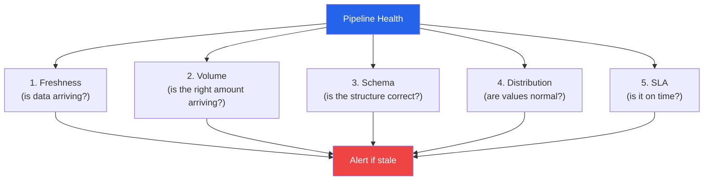

# Pipeline Monitoring & Alerting

A pipeline that runs without monitoring is a pipeline waiting to fail silently. The most dangerous failure mode is not a crash — it is a pipeline that produces wrong data without anyone noticing. Revenue gets double-counted for a week. A model trains on stale data for a month. A dashboard shows numbers that no one questions until the board meeting. Monitoring catches these problems before they reach humans.

---

## The Five Pillars of Pipeline Monitoring



---

## Data Freshness Monitoring

```python
# freshness_monitor.py — Detect stale data
import pandas as pd
from datetime import datetime, timedelta
from dataclasses import dataclass
from pathlib import Path
import logging
import json

logger = logging.getLogger(__name__)


@dataclass
class FreshnessCheck:
    table_name: str
    timestamp_column: str
    max_age_hours: float
    current_age_hours: float
    is_fresh: bool
    last_update: str
    checked_at: str


class FreshnessMonitor:
    """Monitor data freshness across tables and files."""

    def __init__(self, alert_fn=None):
        self.alert_fn = alert_fn or self._default_alert
        self.results: list[FreshnessCheck] = []

    def check_table(
        self,
        engine,
        table_name: str,
        timestamp_column: str,
        max_age_hours: float = 24.0,
    ) -> FreshnessCheck:
        """Check if a database table has recent data."""
        from sqlalchemy import text

        with engine.connect() as conn:
            result = conn.execute(
                text(f"SELECT MAX({timestamp_column}) as latest FROM {table_name}")
            )
            latest = result.scalar()

        if latest is None:
            age_hours = float("inf")
        else:
            age = datetime.utcnow() - latest
            age_hours = age.total_seconds() / 3600

        check = FreshnessCheck(
            table_name=table_name,
            timestamp_column=timestamp_column,
            max_age_hours=max_age_hours,
            current_age_hours=round(age_hours, 2),
            is_fresh=age_hours <= max_age_hours,
            last_update=str(latest) if latest else "NEVER",
            checked_at=datetime.utcnow().isoformat(),
        )

        self.results.append(check)

        if not check.is_fresh:
            self.alert_fn(
                f"STALE DATA: {table_name} is {age_hours:.1f}h old "
                f"(max: {max_age_hours}h)",
                severity="critical",
            )

        return check

    def check_file(
        self,
        file_path: str,
        max_age_hours: float = 24.0,
    ) -> FreshnessCheck:
        """Check if a file has been updated recently."""
        path = Path(file_path)

        if not path.exists():
            check = FreshnessCheck(
                table_name=str(path),
                timestamp_column="file_mtime",
                max_age_hours=max_age_hours,
                current_age_hours=float("inf"),
                is_fresh=False,
                last_update="FILE NOT FOUND",
                checked_at=datetime.utcnow().isoformat(),
            )
            self.alert_fn(f"FILE MISSING: {file_path}", severity="critical")
            self.results.append(check)
            return check

        mtime = datetime.fromtimestamp(path.stat().st_mtime)
        age_hours = (datetime.utcnow() - mtime).total_seconds() / 3600

        check = FreshnessCheck(
            table_name=str(path),
            timestamp_column="file_mtime",
            max_age_hours=max_age_hours,
            current_age_hours=round(age_hours, 2),
            is_fresh=age_hours <= max_age_hours,
            last_update=mtime.isoformat(),
            checked_at=datetime.utcnow().isoformat(),
        )

        self.results.append(check)
        if not check.is_fresh:
            self.alert_fn(
                f"STALE FILE: {file_path} is {age_hours:.1f}h old",
                severity="warning",
            )

        return check

    @staticmethod
    def _default_alert(message: str, severity: str = "warning"):
        if severity == "critical":
            logger.critical(message)
        else:
            logger.warning(message)
```

---

## Row Count Anomaly Detection

```python
# volume_monitor.py — Detect unusual data volumes
import pandas as pd
import numpy as np
from collections import deque
from datetime import datetime
from dataclasses import dataclass
import json
from pathlib import Path
import logging

logger = logging.getLogger(__name__)


@dataclass
class VolumeCheck:
    table_name: str
    current_count: int
    expected_range: tuple[int, int]
    is_normal: bool
    deviation_pct: float
    checked_at: str


class VolumeMonitor:
    """
    Detect anomalous row counts using historical baselines.
    Catches: empty loads, duplicate loads, missing partitions.
    """

    def __init__(self, history_dir: str = "./monitoring/volume"):
        self.history_dir = Path(history_dir)
        self.history_dir.mkdir(parents=True, exist_ok=True)

    def _load_history(self, table_name: str) -> list[dict]:
        path = self.history_dir / f"{table_name}_history.json"
        if path.exists():
            return json.loads(path.read_text())
        return []

    def _save_history(self, table_name: str, history: list[dict]):
        path = self.history_dir / f"{table_name}_history.json"
        # Keep last 90 days
        history = history[-90:]
        path.write_text(json.dumps(history, indent=2))

    def check(
        self,
        table_name: str,
        current_count: int,
        std_multiplier: float = 3.0,
        min_history: int = 7,
    ) -> VolumeCheck:
        """
        Compare current row count against historical baseline.

        Uses rolling mean +/- std_multiplier * std as bounds.
        """
        history = self._load_history(table_name)

        if len(history) < min_history:
            # Not enough history, accept anything > 0
            check = VolumeCheck(
                table_name=table_name,
                current_count=current_count,
                expected_range=(0, current_count * 10),
                is_normal=current_count > 0,
                deviation_pct=0,
                checked_at=datetime.utcnow().isoformat(),
            )
        else:
            counts = [h["count"] for h in history]
            mean = np.mean(counts)
            std = np.std(counts)

            lower = max(0, int(mean - std_multiplier * std))
            upper = int(mean + std_multiplier * std)

            is_normal = lower <= current_count <= upper

            if mean > 0:
                deviation_pct = ((current_count - mean) / mean) * 100
            else:
                deviation_pct = 100 if current_count > 0 else 0

            check = VolumeCheck(
                table_name=table_name,
                current_count=current_count,
                expected_range=(lower, upper),
                is_normal=is_normal,
                deviation_pct=round(deviation_pct, 1),
                checked_at=datetime.utcnow().isoformat(),
            )

            if not is_normal:
                logger.warning(
                    f"VOLUME ANOMALY: {table_name} has {current_count} rows "
                    f"(expected {lower}-{upper}, deviation: {deviation_pct:+.1f}%)"
                )

        # Record current count
        history.append({
            "count": current_count,
            "timestamp": datetime.utcnow().isoformat(),
        })
        self._save_history(table_name, history)

        return check

    def check_zero(self, table_name: str, count: int):
        """Simple check: is the count zero when it shouldn't be?"""
        if count == 0:
            logger.critical(f"ZERO ROWS: {table_name} has 0 rows!")
            return False
        return True


# Usage
monitor = VolumeMonitor()
check = monitor.check("daily_orders", current_count=len(df))
if not check.is_normal:
    print(f"Alert: {check.deviation_pct:+.1f}% from baseline")
```

---

## Schema Drift Detection

```python
# schema_drift.py — Detect when source schemas change
import pandas as pd
import json
from pathlib import Path
from datetime import datetime
from dataclasses import dataclass
import logging

logger = logging.getLogger(__name__)


@dataclass
class SchemaDrift:
    table_name: str
    drift_type: str  # "column_added", "column_removed", "type_changed"
    column_name: str
    previous_value: str
    current_value: str
    detected_at: str


class SchemaDriftMonitor:
    """Detect and alert on schema changes between pipeline runs."""

    def __init__(self, state_dir: str = "./monitoring/schemas"):
        self.state_dir = Path(state_dir)
        self.state_dir.mkdir(parents=True, exist_ok=True)

    def _get_schema(self, df: pd.DataFrame) -> dict:
        return {
            col: {
                "dtype": str(df[col].dtype),
                "nullable": bool(df[col].isnull().any()),
                "n_unique": int(df[col].nunique()),
            }
            for col in df.columns
        }

    def check(
        self,
        table_name: str,
        df: pd.DataFrame,
    ) -> list[SchemaDrift]:
        """Compare current schema against saved baseline."""
        state_path = self.state_dir / f"{table_name}.json"
        current = self._get_schema(df)
        now = datetime.utcnow().isoformat()
        drifts = []

        if not state_path.exists():
            state_path.write_text(json.dumps(current, indent=2))
            logger.info(f"Schema baseline saved for {table_name}")
            return drifts

        previous = json.loads(state_path.read_text())

        # Added columns
        for col in set(current) - set(previous):
            drifts.append(SchemaDrift(
                table_name=table_name,
                drift_type="column_added",
                column_name=col,
                previous_value="(did not exist)",
                current_value=current[col]["dtype"],
                detected_at=now,
            ))

        # Removed columns
        for col in set(previous) - set(current):
            drifts.append(SchemaDrift(
                table_name=table_name,
                drift_type="column_removed",
                column_name=col,
                previous_value=previous[col]["dtype"],
                current_value="(removed)",
                detected_at=now,
            ))

        # Type changes
        for col in set(current) & set(previous):
            if current[col]["dtype"] != previous[col]["dtype"]:
                drifts.append(SchemaDrift(
                    table_name=table_name,
                    drift_type="type_changed",
                    column_name=col,
                    previous_value=previous[col]["dtype"],
                    current_value=current[col]["dtype"],
                    detected_at=now,
                ))

        if drifts:
            logger.warning(
                f"SCHEMA DRIFT in {table_name}: {len(drifts)} changes detected"
            )
            # Update baseline
            state_path.write_text(json.dumps(current, indent=2))

            # Log drift history
            history_path = self.state_dir / f"{table_name}_drift_log.jsonl"
            with open(history_path, "a") as f:
                for drift in drifts:
                    f.write(json.dumps({
                        "type": drift.drift_type,
                        "column": drift.column_name,
                        "from": drift.previous_value,
                        "to": drift.current_value,
                        "detected_at": drift.detected_at,
                    }) + "\n")

        return drifts
```

---

## Distribution Monitoring

```python
# distribution_monitor.py — Detect statistical distribution shifts
import pandas as pd
import numpy as np
from scipy import stats
from dataclasses import dataclass
from pathlib import Path
import json
from datetime import datetime
import logging

logger = logging.getLogger(__name__)


@dataclass
class DistributionAlert:
    column: str
    metric: str
    current_value: float
    baseline_value: float
    threshold: float
    is_anomalous: bool


class DistributionMonitor:
    """Monitor statistical properties of data columns over time."""

    def __init__(self, state_dir: str = "./monitoring/distributions"):
        self.state_dir = Path(state_dir)
        self.state_dir.mkdir(parents=True, exist_ok=True)

    def _compute_stats(self, series: pd.Series) -> dict:
        clean = series.dropna()
        if len(clean) == 0:
            return {}

        return {
            "mean": float(clean.mean()),
            "std": float(clean.std()),
            "median": float(clean.median()),
            "min": float(clean.min()),
            "max": float(clean.max()),
            "null_rate": float(series.isnull().mean()),
            "q25": float(clean.quantile(0.25)),
            "q75": float(clean.quantile(0.75)),
            "skew": float(clean.skew()),
            "kurtosis": float(clean.kurtosis()),
            "n_unique": int(clean.nunique()),
            "n_zeros": int((clean == 0).sum()),
        }

    def check_column(
        self,
        table_name: str,
        column_name: str,
        series: pd.Series,
        thresholds: dict | None = None,
    ) -> list[DistributionAlert]:
        """Compare current distribution against historical baseline."""
        state_file = self.state_dir / f"{table_name}_{column_name}.json"
        current_stats = self._compute_stats(series)
        alerts = []

        default_thresholds = {
            "mean_shift_pct": 20,     # Mean changed by >20%
            "std_change_pct": 50,     # Std changed by >50%
            "null_rate_change": 0.1,  # Null rate changed by >10 pct points
            "zero_rate_change": 0.1,  # Zero rate changed by >10 pct points
        }
        thresholds = thresholds or default_thresholds

        if not state_file.exists():
            state_file.write_text(json.dumps(current_stats, indent=2))
            return alerts

        baseline = json.loads(state_file.read_text())

        # Mean shift
        if baseline.get("mean", 0) != 0:
            shift_pct = abs(
                (current_stats["mean"] - baseline["mean"]) / baseline["mean"]
            ) * 100
            if shift_pct > thresholds["mean_shift_pct"]:
                alerts.append(DistributionAlert(
                    column=column_name,
                    metric="mean",
                    current_value=current_stats["mean"],
                    baseline_value=baseline["mean"],
                    threshold=thresholds["mean_shift_pct"],
                    is_anomalous=True,
                ))

        # Std change
        if baseline.get("std", 0) != 0:
            std_change = abs(
                (current_stats["std"] - baseline["std"]) / baseline["std"]
            ) * 100
            if std_change > thresholds["std_change_pct"]:
                alerts.append(DistributionAlert(
                    column=column_name,
                    metric="std",
                    current_value=current_stats["std"],
                    baseline_value=baseline["std"],
                    threshold=thresholds["std_change_pct"],
                    is_anomalous=True,
                ))

        # Null rate change
        null_diff = abs(
            current_stats["null_rate"] - baseline.get("null_rate", 0)
        )
        if null_diff > thresholds["null_rate_change"]:
            alerts.append(DistributionAlert(
                column=column_name,
                metric="null_rate",
                current_value=current_stats["null_rate"],
                baseline_value=baseline.get("null_rate", 0),
                threshold=thresholds["null_rate_change"],
                is_anomalous=True,
            ))

        if alerts:
            logger.warning(
                f"DISTRIBUTION DRIFT: {table_name}.{column_name} — "
                f"{len(alerts)} anomalies"
            )

        # Update baseline (rolling average)
        state_file.write_text(json.dumps(current_stats, indent=2))

        return alerts

    def check_dataframe(
        self,
        table_name: str,
        df: pd.DataFrame,
        numeric_columns: list[str] | None = None,
    ) -> list[DistributionAlert]:
        """Check all numeric columns in a DataFrame."""
        cols = numeric_columns or df.select_dtypes(include=[np.number]).columns.tolist()
        all_alerts = []

        for col in cols:
            alerts = self.check_column(table_name, col, df[col])
            all_alerts.extend(alerts)

        return all_alerts
```

---

## SLA Tracking

```python
# sla_tracker.py — Track pipeline SLA compliance
import json
from pathlib import Path
from datetime import datetime, timedelta
from dataclasses import dataclass, asdict
import logging

logger = logging.getLogger(__name__)


@dataclass
class SLARecord:
    pipeline_name: str
    expected_by: str
    actual_completion: str | None
    met_sla: bool
    duration_minutes: float
    sla_minutes: float


class SLATracker:
    """Track and report on pipeline SLA compliance."""

    def __init__(self, state_dir: str = "./monitoring/sla"):
        self.state_dir = Path(state_dir)
        self.state_dir.mkdir(parents=True, exist_ok=True)

    def record_run(
        self,
        pipeline_name: str,
        start_time: datetime,
        end_time: datetime,
        sla_deadline: datetime,
    ) -> SLARecord:
        """Record a pipeline run and check SLA compliance."""
        duration = (end_time - start_time).total_seconds() / 60
        sla_minutes = (sla_deadline - start_time).total_seconds() / 60
        met_sla = end_time <= sla_deadline

        record = SLARecord(
            pipeline_name=pipeline_name,
            expected_by=sla_deadline.isoformat(),
            actual_completion=end_time.isoformat(),
            met_sla=met_sla,
            duration_minutes=round(duration, 2),
            sla_minutes=round(sla_minutes, 2),
        )

        # Persist
        history_path = self.state_dir / f"{pipeline_name}_sla.jsonl"
        with open(history_path, "a") as f:
            f.write(json.dumps(asdict(record)) + "\n")

        if not met_sla:
            overshoot = (end_time - sla_deadline).total_seconds() / 60
            logger.critical(
                f"SLA BREACH: {pipeline_name} finished {overshoot:.0f} min late "
                f"(took {duration:.0f} min, SLA was {sla_minutes:.0f} min)"
            )
        else:
            buffer = (sla_deadline - end_time).total_seconds() / 60
            logger.info(
                f"SLA MET: {pipeline_name} finished {buffer:.0f} min early "
                f"(took {duration:.0f} min)"
            )

        return record

    def get_compliance_report(
        self, pipeline_name: str, days: int = 30
    ) -> dict:
        """Generate SLA compliance report for last N days."""
        history_path = self.state_dir / f"{pipeline_name}_sla.jsonl"
        if not history_path.exists():
            return {"error": "No history found"}

        records = []
        cutoff = datetime.utcnow() - timedelta(days=days)

        with open(history_path) as f:
            for line in f:
                record = json.loads(line)
                completion = datetime.fromisoformat(record["actual_completion"])
                if completion >= cutoff:
                    records.append(record)

        if not records:
            return {"error": "No records in period"}

        met = sum(1 for r in records if r["met_sla"])
        total = len(records)

        durations = [r["duration_minutes"] for r in records]

        return {
            "pipeline": pipeline_name,
            "period_days": days,
            "total_runs": total,
            "sla_met": met,
            "sla_missed": total - met,
            "compliance_pct": round(met / total * 100, 1),
            "avg_duration_min": round(sum(durations) / len(durations), 1),
            "max_duration_min": round(max(durations), 1),
            "p95_duration_min": round(
                sorted(durations)[int(len(durations) * 0.95)], 1
            ),
        }
```

---

## Alert Routing

```python
# alert_router.py — Route alerts to appropriate channels
import requests
import json
import logging
from dataclasses import dataclass
from datetime import datetime
from enum import Enum

logger = logging.getLogger(__name__)


class Severity(Enum):
    INFO = "info"
    WARNING = "warning"
    ERROR = "error"
    CRITICAL = "critical"


@dataclass
class Alert:
    title: str
    message: str
    severity: Severity
    pipeline: str
    timestamp: str = ""

    def __post_init__(self):
        if not self.timestamp:
            self.timestamp = datetime.utcnow().isoformat()


class AlertRouter:
    """Route alerts to different channels based on severity."""

    def __init__(self):
        self.channels: dict[Severity, list[callable]] = {
            Severity.INFO: [],
            Severity.WARNING: [],
            Severity.ERROR: [],
            Severity.CRITICAL: [],
        }

    def add_channel(self, min_severity: Severity, handler: callable):
        """Add a notification channel for alerts at or above severity."""
        severity_order = [Severity.INFO, Severity.WARNING, Severity.ERROR, Severity.CRITICAL]
        start_idx = severity_order.index(min_severity)
        for sev in severity_order[start_idx:]:
            self.channels[sev].append(handler)
        return self

    def send(self, alert: Alert):
        """Send alert to all configured channels for its severity."""
        handlers = self.channels.get(alert.severity, [])
        for handler in handlers:
            try:
                handler(alert)
            except Exception as e:
                logger.error(f"Alert handler failed: {e}")


def slack_handler(webhook_url: str):
    def send(alert: Alert):
        emoji = {"info": "blue_book", "warning": "warning", "error": "x", "critical": "rotating_light"}
        requests.post(webhook_url, json={
            "text": f":{emoji.get(alert.severity.value, 'bell')}: *{alert.title}*\n{alert.message}\nPipeline: {alert.pipeline}",
        }, timeout=10)
    return send

def email_handler(recipients: list[str]):
    def send(alert: Alert):
        logger.info(f"Email to {recipients}: {alert.title}")
        # Integration with email service
    return send

def pagerduty_handler(routing_key: str):
    def send(alert: Alert):
        requests.post("https://events.pagerduty.com/v2/enqueue", json={
            "routing_key": routing_key,
            "event_action": "trigger",
            "payload": {
                "summary": f"{alert.pipeline}: {alert.title}",
                "severity": alert.severity.value,
                "source": alert.pipeline,
            },
        }, timeout=10)
    return send


# Usage
router = AlertRouter()
router.add_channel(Severity.INFO, slack_handler("https://hooks.slack.com/..."))
router.add_channel(Severity.ERROR, email_handler(["oncall@company.com"]))
router.add_channel(Severity.CRITICAL, pagerduty_handler("xxx-routing-key"))

router.send(Alert(
    title="Volume Anomaly Detected",
    message="orders table has 50% fewer rows than baseline",
    severity=Severity.WARNING,
    pipeline="daily_etl",
))
```

---

## Quick Reference

| Monitor Type | What It Catches | Check Frequency |
|-------------|----------------|-----------------|
| Freshness | Stale/missing data | Every pipeline run |
| Volume | Empty loads, duplicates | Every pipeline run |
| Schema drift | Source changes | Every pipeline run |
| Distribution | Data quality shifts | Daily |
| SLA | Late pipelines | Every pipeline run |
| Custom rules | Business logic violations | As needed |

| Severity | Action | Channel |
|----------|--------|---------|
| INFO | Log only | Slack (low-priority channel) |
| WARNING | Investigate today | Slack + email |
| ERROR | Fix within hours | Slack + email + ticket |
| CRITICAL | Wake someone up | PagerDuty + phone call |
