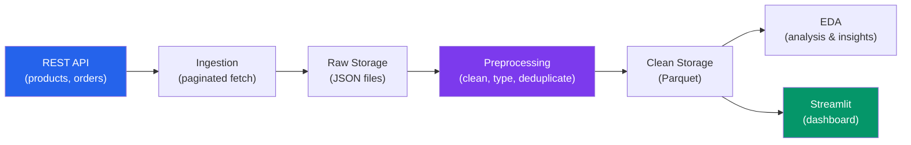

# Project: E-Commerce Pipeline

This project builds a complete data pipeline from API ingestion to an interactive Streamlit dashboard. You will ingest product and order data from a REST API, clean and preprocess it through a multi-stage pipeline, perform exploratory analysis, and serve the results through a real-time dashboard. Every piece of code is production-ready and extensible.

---

## Architecture



---

## Step 1: Data Generation (Simulated API)

Since we need reproducible data, we generate a realistic e-commerce dataset.

```python
# generate_data.py — Create realistic e-commerce test data
import pandas as pd
import numpy as np
from datetime import datetime, timedelta
import json
from pathlib import Path

np.random.seed(42)


def generate_products(n: int = 500) -> list[dict]:
    """Generate realistic product catalog data."""
    categories = {
        "Electronics": (50, 2000, ["Smartphone", "Laptop", "Tablet", "Headphones", "Camera", "Speaker", "Monitor", "Keyboard"]),
        "Clothing": (10, 200, ["T-Shirt", "Jeans", "Jacket", "Dress", "Sneakers", "Hat", "Socks", "Scarf"]),
        "Home": (15, 500, ["Lamp", "Pillow", "Rug", "Vase", "Clock", "Mirror", "Frame", "Candle"]),
        "Books": (5, 50, ["Novel", "Textbook", "Cookbook", "Biography", "Guide", "Journal", "Atlas", "Manual"]),
        "Sports": (20, 300, ["Yoga Mat", "Dumbbell", "Ball", "Racket", "Gloves", "Helmet", "Bottle", "Band"]),
    }

    products = []
    for i in range(n):
        category = np.random.choice(list(categories.keys()), p=[0.3, 0.25, 0.2, 0.15, 0.1])
        min_price, max_price, items = categories[category]
        item_type = np.random.choice(items)
        brand = np.random.choice(["ProMax", "ValueLine", "TechCo", "HomeStyle", "SportPlus", "EcoGreen"])

        price = round(np.random.uniform(min_price, max_price), 2)
        rating = round(min(5.0, max(1.0, np.random.normal(3.8, 0.8))), 1)

        # Add some messy data
        name = f"{brand} {item_type}"
        if np.random.random() < 0.05:
            name = name.upper()  # Inconsistent casing
        if np.random.random() < 0.03:
            name = f"  {name}  "  # Leading/trailing spaces
        if np.random.random() < 0.02:
            price = -price  # Bad data

        products.append({
            "product_id": i + 1,
            "name": name,
            "category": category if np.random.random() > 0.03 else None,
            "price": price if np.random.random() > 0.02 else "N/A",
            "rating": rating if np.random.random() > 0.05 else None,
            "stock": int(np.random.exponential(50)),
            "created_at": (datetime(2023, 1, 1) + timedelta(days=np.random.randint(0, 700))).isoformat(),
        })

    return products


def generate_orders(n: int = 5000, n_products: int = 500) -> list[dict]:
    """Generate realistic order data."""
    statuses = ["pending", "confirmed", "shipped", "delivered", "cancelled"]
    status_probs = [0.05, 0.1, 0.15, 0.6, 0.1]

    orders = []
    for i in range(n):
        n_items = np.random.choice([1, 2, 3, 4, 5], p=[0.5, 0.25, 0.15, 0.07, 0.03])
        product_ids = np.random.choice(range(1, n_products + 1), n_items, replace=False).tolist()
        quantities = [int(np.random.choice([1, 2, 3], p=[0.7, 0.2, 0.1])) for _ in range(n_items)]

        order_date = datetime(2023, 6, 1) + timedelta(
            days=np.random.randint(0, 500),
            hours=np.random.randint(0, 24),
            minutes=np.random.randint(0, 60),
        )

        total = round(np.random.uniform(10, 500), 2)
        status = np.random.choice(statuses, p=status_probs)

        orders.append({
            "order_id": i + 1,
            "customer_id": np.random.randint(1, 2000),
            "product_ids": product_ids,
            "quantities": quantities,
            "total": total if np.random.random() > 0.01 else None,
            "status": status,
            "payment_method": np.random.choice(["credit_card", "paypal", "debit_card", "crypto"]),
            "shipping_city": np.random.choice(["New York", "Los Angeles", "Chicago", "Houston", "Phoenix", "San Francisco"]),
            "created_at": order_date.isoformat(),
            "updated_at": (order_date + timedelta(days=np.random.randint(0, 14))).isoformat(),
        })

    return orders


# Generate and save
Path("data/raw").mkdir(parents=True, exist_ok=True)

products = generate_products(500)
orders = generate_orders(5000, 500)

with open("data/raw/products.json", "w") as f:
    json.dump(products, f, indent=2)

with open("data/raw/orders.json", "w") as f:
    json.dump(orders, f, indent=2)

print(f"Generated {len(products)} products and {len(orders)} orders")
```

---

## Step 2: Ingestion Layer

```python
# ingest.py — Load and stage raw data
import json
import pandas as pd
from pathlib import Path
from datetime import datetime
import hashlib
import logging

logging.basicConfig(level=logging.INFO)
logger = logging.getLogger(__name__)


class DataIngester:
    """Ingest raw JSON data into staged Parquet files."""

    def __init__(self, raw_dir: str = "data/raw", staged_dir: str = "data/staged"):
        self.raw_dir = Path(raw_dir)
        self.staged_dir = Path(staged_dir)
        self.staged_dir.mkdir(parents=True, exist_ok=True)

    def ingest_json(self, filename: str) -> pd.DataFrame:
        """Load JSON file and stage as Parquet."""
        raw_path = self.raw_dir / filename
        with open(raw_path) as f:
            data = json.load(f)

        df = pd.DataFrame(data)

        # Add ingestion metadata
        df["_ingested_at"] = datetime.utcnow().isoformat()
        df["_source_file"] = filename
        df["_row_hash"] = df.apply(
            lambda row: hashlib.md5(str(row.to_dict()).encode()).hexdigest()[:12],
            axis=1,
        )

        # Stage
        name = Path(filename).stem
        staged_path = self.staged_dir / f"{name}.parquet"
        df.to_parquet(staged_path, index=False)

        logger.info(f"Ingested {filename}: {len(df)} rows -> {staged_path}")
        return df

    def ingest_all(self) -> dict[str, pd.DataFrame]:
        """Ingest all JSON files in raw directory."""
        results = {}
        for json_file in self.raw_dir.glob("*.json"):
            df = self.ingest_json(json_file.name)
            results[json_file.stem] = df
        return results


# Run ingestion
ingester = DataIngester()
data = ingester.ingest_all()
```

---

## Step 3: Preprocessing Pipeline

```python
# preprocess.py — Clean and transform staged data
import pandas as pd
import numpy as np
from pathlib import Path
import logging

logging.basicConfig(level=logging.INFO)
logger = logging.getLogger(__name__)


class EcommercePreprocessor:
    """Preprocess e-commerce data through standardized stages."""

    def __init__(self, staged_dir: str = "data/staged", clean_dir: str = "data/clean"):
        self.staged_dir = Path(staged_dir)
        self.clean_dir = Path(clean_dir)
        self.clean_dir.mkdir(parents=True, exist_ok=True)
        self.logs: list[dict] = []

    def _log_step(self, step: str, before: int, after: int, details: str = ""):
        self.logs.append({
            "step": step,
            "rows_before": before,
            "rows_after": after,
            "rows_removed": before - after,
            "details": details,
        })
        logger.info(f"  [{step}] {before} -> {after} rows {details}")

    def clean_products(self) -> pd.DataFrame:
        """Full product cleaning pipeline."""
        logger.info("=== Cleaning Products ===")
        df = pd.read_parquet(self.staged_dir / "products.parquet")
        initial = len(df)

        # 1. Remove exact duplicates
        before = len(df)
        df = df.drop_duplicates(subset=["product_id"])
        self._log_step("deduplicate", before, len(df))

        # 2. Clean strings
        before = len(df)
        df["name"] = df["name"].str.strip().str.title()
        df["category"] = df["category"].str.strip().str.title()
        self._log_step("clean_strings", before, len(df))

        # 3. Fix types
        df["price"] = pd.to_numeric(df["price"], errors="coerce")
        df["rating"] = pd.to_numeric(df["rating"], errors="coerce")
        df["created_at"] = pd.to_datetime(df["created_at"], errors="coerce")
        df["product_id"] = df["product_id"].astype("Int64")
        df["stock"] = df["stock"].astype("Int64")

        # 4. Handle invalid values
        before = len(df)
        df = df[df["price"] > 0]  # Remove negative/zero prices
        df = df[df["price"].notna()]  # Remove unparseable prices
        self._log_step("remove_invalid_prices", before, len(df))

        # 5. Cap outlier prices
        p99 = df["price"].quantile(0.99)
        df["price"] = df["price"].clip(upper=p99)

        # 6. Fill missing categories
        df["category"] = df["category"].fillna("Unknown")

        # 7. Clip ratings to valid range
        df["rating"] = df["rating"].clip(1.0, 5.0)

        # 8. Add derived features
        df["price_tier"] = pd.cut(
            df["price"],
            bins=[0, 25, 100, 500, float("inf")],
            labels=["Budget", "Mid-Range", "Premium", "Luxury"],
        )

        # 9. Optimize memory
        df["category"] = df["category"].astype("category")
        df["price_tier"] = df["price_tier"].astype("category")

        # Save
        output_path = self.clean_dir / "products.parquet"
        df.to_parquet(output_path, index=False)
        logger.info(f"Products: {initial} -> {len(df)} rows saved to {output_path}")

        return df

    def clean_orders(self) -> pd.DataFrame:
        """Full order cleaning pipeline."""
        logger.info("=== Cleaning Orders ===")
        df = pd.read_parquet(self.staged_dir / "orders.parquet")
        initial = len(df)

        # 1. Deduplicate
        before = len(df)
        df = df.drop_duplicates(subset=["order_id"])
        self._log_step("deduplicate", before, len(df))

        # 2. Parse dates
        df["created_at"] = pd.to_datetime(df["created_at"], errors="coerce")
        df["updated_at"] = pd.to_datetime(df["updated_at"], errors="coerce")

        # 3. Fix types
        df["total"] = pd.to_numeric(df["total"], errors="coerce")
        df["order_id"] = df["order_id"].astype("Int64")
        df["customer_id"] = df["customer_id"].astype("Int64")

        # 4. Remove orders with missing totals
        before = len(df)
        df = df.dropna(subset=["total", "created_at"])
        self._log_step("drop_missing_critical", before, len(df))

        # 5. Validate status
        valid_statuses = ["pending", "confirmed", "shipped", "delivered", "cancelled"]
        df["status"] = df["status"].where(df["status"].isin(valid_statuses), "unknown")

        # 6. Add features
        df["order_month"] = df["created_at"].dt.to_period("M").astype(str)
        df["order_dow"] = df["created_at"].dt.day_name()
        df["order_hour"] = df["created_at"].dt.hour
        df["n_items"] = df["product_ids"].apply(
            lambda x: len(x) if isinstance(x, list) else 0
        )

        # 7. Categorize
        df["status"] = df["status"].astype("category")
        df["payment_method"] = df["payment_method"].astype("category")
        df["shipping_city"] = df["shipping_city"].astype("category")

        # Save
        output_path = self.clean_dir / "orders.parquet"
        df.to_parquet(output_path, index=False)
        logger.info(f"Orders: {initial} -> {len(df)} rows saved to {output_path}")

        return df

    def run(self) -> dict[str, pd.DataFrame]:
        """Run full preprocessing pipeline."""
        products = self.clean_products()
        orders = self.clean_orders()

        # Print summary
        print("\n=== Preprocessing Summary ===")
        for log in self.logs:
            print(f"  {log['step']}: {log['rows_before']} -> {log['rows_after']} ({log['rows_removed']} removed)")

        return {"products": products, "orders": orders}


# Run
preprocessor = EcommercePreprocessor()
clean_data = preprocessor.run()
```

---

## Step 4: Exploratory Data Analysis

```python
# eda.py — Exploratory analysis of cleaned e-commerce data
import pandas as pd
import numpy as np
from pathlib import Path
import json


class EcommerceEDA:
    """Run EDA on cleaned e-commerce data."""

    def __init__(self, clean_dir: str = "data/clean"):
        self.clean_dir = Path(clean_dir)
        self.products = pd.read_parquet(self.clean_dir / "products.parquet")
        self.orders = pd.read_parquet(self.clean_dir / "orders.parquet")

    def product_analysis(self) -> dict:
        """Analyze product catalog."""
        df = self.products

        analysis = {
            "total_products": len(df),
            "categories": df["category"].value_counts().to_dict(),
            "price_stats": {
                "mean": round(df["price"].mean(), 2),
                "median": round(df["price"].median(), 2),
                "std": round(df["price"].std(), 2),
                "min": round(df["price"].min(), 2),
                "max": round(df["price"].max(), 2),
            },
            "price_by_category": df.groupby("category")["price"].agg(
                ["mean", "median", "count"]
            ).round(2).to_dict(),
            "rating_stats": {
                "mean": round(df["rating"].mean(), 2),
                "null_pct": round(df["rating"].isnull().mean() * 100, 1),
            },
            "stock_stats": {
                "total_units": int(df["stock"].sum()),
                "zero_stock": int((df["stock"] == 0).sum()),
                "avg_stock": round(df["stock"].mean(), 1),
            },
            "price_tiers": df["price_tier"].value_counts().to_dict(),
        }

        return analysis

    def order_analysis(self) -> dict:
        """Analyze order patterns."""
        df = self.orders

        # Revenue analysis
        revenue_by_month = (
            df.groupby("order_month")["total"]
            .agg(["sum", "count", "mean"])
            .round(2)
        )

        # Customer analysis
        customer_orders = df.groupby("customer_id").agg(
            order_count=("order_id", "count"),
            total_spend=("total", "sum"),
            avg_order=("total", "mean"),
            first_order=("created_at", "min"),
            last_order=("created_at", "max"),
        )

        # RFM segments
        repeat_customers = (customer_orders["order_count"] > 1).sum()
        top_10_pct = customer_orders["total_spend"].quantile(0.9)

        analysis = {
            "total_orders": len(df),
            "total_revenue": round(df["total"].sum(), 2),
            "avg_order_value": round(df["total"].mean(), 2),
            "status_distribution": df["status"].value_counts().to_dict(),
            "payment_distribution": df["payment_method"].value_counts().to_dict(),
            "city_distribution": df["shipping_city"].value_counts().to_dict(),
            "monthly_revenue": revenue_by_month["sum"].to_dict(),
            "monthly_orders": revenue_by_month["count"].to_dict(),
            "unique_customers": int(df["customer_id"].nunique()),
            "repeat_customers": int(repeat_customers),
            "repeat_rate": round(repeat_customers / df["customer_id"].nunique() * 100, 1),
            "top_10_pct_threshold": round(top_10_pct, 2),
            "busiest_day": df["order_dow"].value_counts().index[0],
            "busiest_hour": int(df["order_hour"].value_counts().index[0]),
            "avg_items_per_order": round(df["n_items"].mean(), 2),
        }

        return analysis

    def run_full_eda(self) -> dict:
        """Run complete EDA and save results."""
        product_insights = self.product_analysis()
        order_insights = self.order_analysis()

        report = {
            "products": product_insights,
            "orders": order_insights,
            "generated_at": pd.Timestamp.utcnow().isoformat(),
        }

        # Save insights
        output_path = self.clean_dir / "eda_insights.json"
        with open(output_path, "w") as f:
            json.dump(report, f, indent=2, default=str)

        # Print key findings
        print("\n=== Key Findings ===")
        print(f"Products: {product_insights['total_products']} in catalog")
        print(f"  Avg price: ${product_insights['price_stats']['mean']}")
        print(f"  Avg rating: {product_insights['rating_stats']['mean']}")
        print(f"\nOrders: {order_insights['total_orders']} total")
        print(f"  Revenue: ${order_insights['total_revenue']:,.2f}")
        print(f"  AOV: ${order_insights['avg_order_value']}")
        print(f"  Repeat rate: {order_insights['repeat_rate']}%")
        print(f"  Busiest day: {order_insights['busiest_day']}")

        return report


# Run EDA
eda = EcommerceEDA()
insights = eda.run_full_eda()
```

---

## Step 5: Streamlit Dashboard

```python
# dashboard.py — Interactive Streamlit dashboard
# Run with: streamlit run dashboard.py
import streamlit as st
import pandas as pd
import numpy as np
import plotly.express as px
import plotly.graph_objects as go
from pathlib import Path

st.set_page_config(page_title="E-Commerce Dashboard", layout="wide")


@st.cache_data
def load_data():
    """Load clean data with caching."""
    products = pd.read_parquet("data/clean/products.parquet")
    orders = pd.read_parquet("data/clean/orders.parquet")
    return products, orders


products, orders = load_data()

st.title("E-Commerce Analytics Dashboard")

# --- KPI Row ---
col1, col2, col3, col4 = st.columns(4)
with col1:
    st.metric("Total Revenue", f"${orders['total'].sum():,.0f}")
with col2:
    st.metric("Total Orders", f"{len(orders):,}")
with col3:
    st.metric("Avg Order Value", f"${orders['total'].mean():.2f}")
with col4:
    st.metric("Unique Customers", f"{orders['customer_id'].nunique():,}")

st.divider()

# --- Filters ---
with st.sidebar:
    st.header("Filters")
    categories = st.multiselect(
        "Product Category",
        options=sorted(products["category"].unique()),
        default=sorted(products["category"].unique()),
    )
    status_filter = st.multiselect(
        "Order Status",
        options=sorted(orders["status"].unique()),
        default=sorted(orders["status"].unique()),
    )
    date_range = st.date_input(
        "Date Range",
        value=(orders["created_at"].min().date(), orders["created_at"].max().date()),
    )

# Apply filters
filtered_orders = orders[
    (orders["status"].isin(status_filter)) &
    (orders["created_at"].dt.date >= date_range[0]) &
    (orders["created_at"].dt.date <= date_range[1])
]
filtered_products = products[products["category"].isin(categories)]

# --- Charts Row 1 ---
col_left, col_right = st.columns(2)

with col_left:
    st.subheader("Monthly Revenue Trend")
    monthly = (
        filtered_orders.groupby("order_month")["total"]
        .sum()
        .reset_index()
    )
    fig = px.line(
        monthly, x="order_month", y="total",
        labels={"total": "Revenue ($)", "order_month": "Month"},
    )
    st.plotly_chart(fig, use_container_width=True)

with col_right:
    st.subheader("Orders by Status")
    status_counts = filtered_orders["status"].value_counts().reset_index()
    status_counts.columns = ["status", "count"]
    fig = px.pie(
        status_counts, values="count", names="status",
        color_discrete_sequence=px.colors.qualitative.Set2,
    )
    st.plotly_chart(fig, use_container_width=True)

# --- Charts Row 2 ---
col_left2, col_right2 = st.columns(2)

with col_left2:
    st.subheader("Price Distribution by Category")
    fig = px.box(
        filtered_products, x="category", y="price",
        color="category",
        labels={"price": "Price ($)", "category": "Category"},
    )
    fig.update_layout(showlegend=False)
    st.plotly_chart(fig, use_container_width=True)

with col_right2:
    st.subheader("Orders by City")
    city_revenue = (
        filtered_orders.groupby("shipping_city")["total"]
        .agg(["sum", "count"])
        .reset_index()
    )
    city_revenue.columns = ["city", "revenue", "orders"]
    fig = px.bar(
        city_revenue.sort_values("revenue", ascending=True),
        x="revenue", y="city", orientation="h",
        labels={"revenue": "Revenue ($)", "city": "City"},
    )
    st.plotly_chart(fig, use_container_width=True)

# --- Hourly Heatmap ---
st.subheader("Order Volume by Day and Hour")
heatmap_data = (
    filtered_orders
    .assign(dow=filtered_orders["created_at"].dt.dayofweek)
    .groupby(["order_dow", "order_hour"])
    .size()
    .reset_index(name="count")
)
dow_order = ["Monday", "Tuesday", "Wednesday", "Thursday", "Friday", "Saturday", "Sunday"]
fig = px.density_heatmap(
    heatmap_data, x="order_hour", y="order_dow",
    z="count", color_continuous_scale="YlOrRd",
    category_orders={"order_dow": dow_order},
    labels={"order_hour": "Hour", "order_dow": "Day", "count": "Orders"},
)
st.plotly_chart(fig, use_container_width=True)

# --- Data Tables ---
with st.expander("Raw Data Preview"):
    tab1, tab2 = st.tabs(["Products", "Orders"])
    with tab1:
        st.dataframe(filtered_products.head(100), use_container_width=True)
    with tab2:
        st.dataframe(filtered_orders.head(100), use_container_width=True)

st.caption("Data refreshed from pipeline. Last updated: " + str(pd.Timestamp.utcnow().strftime("%Y-%m-%d %H:%M UTC")))
```

---

## Running the Full Pipeline

```python
# run_pipeline.py — Execute the complete pipeline
import logging

logging.basicConfig(level=logging.INFO, format="%(asctime)s [%(name)s] %(levelname)s: %(message)s")


def main():
    print("=" * 60)
    print("E-COMMERCE DATA PIPELINE")
    print("=" * 60)

    # Step 1: Generate data (replace with real API ingestion)
    print("\n--- Step 1: Generate Data ---")
    exec(open("generate_data.py").read())

    # Step 2: Ingest
    print("\n--- Step 2: Ingest ---")
    from ingest import DataIngester
    ingester = DataIngester()
    ingester.ingest_all()

    # Step 3: Preprocess
    print("\n--- Step 3: Preprocess ---")
    from preprocess import EcommercePreprocessor
    preprocessor = EcommercePreprocessor()
    preprocessor.run()

    # Step 4: EDA
    print("\n--- Step 4: EDA ---")
    from eda import EcommerceEDA
    eda = EcommerceEDA()
    eda.run_full_eda()

    print("\n" + "=" * 60)
    print("PIPELINE COMPLETE")
    print("Run dashboard: streamlit run dashboard.py")
    print("=" * 60)


if __name__ == "__main__":
    main()
```

---

## Project Structure

```
ecommerce-pipeline/
├── generate_data.py       # Data generation (or API client)
├── ingest.py              # Ingestion layer
├── preprocess.py          # Preprocessing pipeline
├── eda.py                 # Exploratory analysis
├── dashboard.py           # Streamlit dashboard
├── run_pipeline.py        # Orchestrator
├── requirements.txt       # Dependencies
└── data/
    ├── raw/               # Raw JSON from API
    │   ├── products.json
    │   └── orders.json
    ├── staged/            # Parquet with metadata
    │   ├── products.parquet
    │   └── orders.parquet
    └── clean/             # Analysis-ready
        ├── products.parquet
        ├── orders.parquet
        └── eda_insights.json
```

### requirements.txt

```
pandas>=2.0
numpy>=1.24
pyarrow>=14.0
streamlit>=1.30
plotly>=5.18
```
