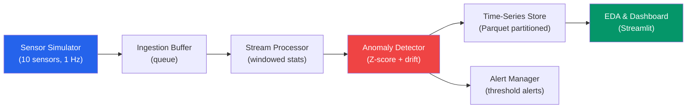

# Project: IoT Sensor Pipeline

IoT sensor data has unique challenges: it arrives continuously, often out of order, frequently contains outliers from sensor malfunctions, and demands near-real-time anomaly detection. A temperature sensor reading 500 degrees C is not an outlier — it is a broken sensor. A gradual 2-degree drift over a week might be the real anomaly that indicates equipment failure. This project builds a streaming pipeline that ingests, detects anomalies, analyzes trends, and alerts — all from simulated sensor data.

---

## Architecture



---

## Step 1: Sensor Simulator

```python
# sensor_simulator.py — Simulate realistic IoT sensor data
import time
import json
import random
import math
from datetime import datetime, timezone, timedelta
from dataclasses import dataclass, asdict
from queue import Queue
from threading import Thread
import logging

logging.basicConfig(level=logging.INFO)
logger = logging.getLogger(__name__)


@dataclass
class SensorReading:
    """A single sensor reading."""
    sensor_id: str
    timestamp: str
    temperature: float
    humidity: float
    pressure: float
    vibration: float
    battery_level: float


class SensorSimulator:
    """
    Simulate IoT sensors with realistic patterns:
    - Diurnal temperature cycles
    - Random noise
    - Occasional sensor faults (spikes)
    - Gradual drift (equipment degradation)
    - Missing readings (connectivity issues)
    """

    def __init__(
        self,
        n_sensors: int = 10,
        readings_per_second: float = 1.0,
        output_queue: Queue | None = None,
    ):
        self.n_sensors = n_sensors
        self.interval = 1.0 / readings_per_second
        self.queue = output_queue or Queue(maxsize=100_000)
        self.running = False

        # Per-sensor state
        self.sensors = {}
        for i in range(n_sensors):
            sensor_id = f"sensor_{i + 1:03d}"
            self.sensors[sensor_id] = {
                "base_temp": random.uniform(20, 25),
                "base_humidity": random.uniform(40, 60),
                "base_pressure": random.uniform(1010, 1020),
                "vibration_mean": random.uniform(0.1, 0.5),
                "battery": 100.0,
                "drift_rate": random.uniform(-0.001, 0.001),  # Degrees per reading
                "fault_probability": random.uniform(0.001, 0.01),
                "reading_count": 0,
            }

    def generate_reading(self, sensor_id: str, timestamp: datetime) -> SensorReading | None:
        """Generate one reading from a sensor."""
        state = self.sensors[sensor_id]
        state["reading_count"] += 1
        count = state["reading_count"]

        # Connectivity drop (2% chance)
        if random.random() < 0.02:
            return None  # Missing reading

        # Time of day effect (diurnal cycle)
        hour = timestamp.hour + timestamp.minute / 60
        diurnal = 3 * math.sin(2 * math.pi * (hour - 6) / 24)

        # Gradual drift
        drift = state["drift_rate"] * count

        # Temperature
        temp = state["base_temp"] + diurnal + drift
        temp += random.gauss(0, 0.3)  # Noise

        # Sensor fault (spike)
        if random.random() < state["fault_probability"]:
            temp += random.choice([-50, 50, 100, -30])  # Major spike

        # Humidity (correlated with temperature)
        humidity = state["base_humidity"] - (temp - state["base_temp"]) * 1.5
        humidity += random.gauss(0, 2)
        humidity = max(10, min(100, humidity))

        # Pressure (slow variation)
        pressure = state["base_pressure"] + math.sin(count / 1000) * 5
        pressure += random.gauss(0, 0.5)

        # Vibration (mostly steady, occasional spikes)
        vibration = state["vibration_mean"] + random.gauss(0, 0.05)
        if random.random() < 0.005:
            vibration *= random.uniform(3, 10)  # Equipment issue
        vibration = max(0, vibration)

        # Battery drain
        state["battery"] = max(0, state["battery"] - random.uniform(0, 0.01))

        return SensorReading(
            sensor_id=sensor_id,
            timestamp=timestamp.isoformat(),
            temperature=round(temp, 2),
            humidity=round(humidity, 2),
            pressure=round(pressure, 2),
            vibration=round(vibration, 4),
            battery_level=round(state["battery"], 2),
        )

    def generate_batch(self, n_readings: int = 10_000) -> list[dict]:
        """Generate a batch of readings (for offline processing)."""
        readings = []
        start_time = datetime(2024, 1, 1, tzinfo=timezone.utc)

        for i in range(n_readings):
            timestamp = start_time + timedelta(seconds=i * self.interval)
            for sensor_id in self.sensors:
                reading = self.generate_reading(sensor_id, timestamp)
                if reading:
                    readings.append(asdict(reading))

        return readings

    def start_streaming(self, duration_seconds: int = 60):
        """Start streaming readings to the queue."""
        self.running = True

        def stream():
            while self.running:
                timestamp = datetime.now(timezone.utc)
                for sensor_id in self.sensors:
                    reading = self.generate_reading(sensor_id, timestamp)
                    if reading:
                        try:
                            self.queue.put_nowait(asdict(reading))
                        except Exception:
                            pass  # Queue full, drop reading
                time.sleep(self.interval)

        thread = Thread(target=stream, daemon=True)
        thread.start()
        logger.info(f"Streaming {self.n_sensors} sensors at {1/self.interval:.0f} Hz")

        time.sleep(duration_seconds)
        self.running = False
        logger.info(f"Streaming stopped. Queue size: {self.queue.qsize()}")

    def stop(self):
        self.running = False


# Generate batch data for offline analysis
simulator = SensorSimulator(n_sensors=10, readings_per_second=1.0)
readings = simulator.generate_batch(n_readings=86_400)  # 24 hours of data

import pandas as pd
from pathlib import Path

Path("data/raw").mkdir(parents=True, exist_ok=True)
df = pd.DataFrame(readings)
df.to_parquet("data/raw/sensor_readings.parquet", index=False)
print(f"Generated {len(df)} sensor readings ({len(df) / 10 / 3600:.1f} hours of data)")
```

---

## Step 2: Stream Processor

```python
# stream_processor.py — Process sensor data in sliding windows
import pandas as pd
import numpy as np
from collections import deque, defaultdict
from datetime import datetime, timedelta
from dataclasses import dataclass, field
import logging

logger = logging.getLogger(__name__)


@dataclass
class WindowStats:
    """Statistics computed over a time window."""
    sensor_id: str
    window_end: str
    window_size_seconds: int
    n_readings: int
    temp_mean: float
    temp_std: float
    temp_min: float
    temp_max: float
    humidity_mean: float
    pressure_mean: float
    vibration_mean: float
    vibration_max: float
    battery_level: float
    missing_rate: float


class StreamProcessor:
    """
    Process sensor readings in sliding time windows.
    Computes rolling statistics for downstream anomaly detection.
    """

    def __init__(self, window_seconds: int = 300, slide_seconds: int = 60):
        self.window_seconds = window_seconds
        self.slide_seconds = slide_seconds
        self.buffers: dict[str, deque] = defaultdict(lambda: deque(maxlen=10_000))

    def add_reading(self, reading: dict):
        """Add a reading to the appropriate sensor buffer."""
        sensor_id = reading["sensor_id"]
        self.buffers[sensor_id].append(reading)

    def compute_window_stats(self, sensor_id: str) -> WindowStats | None:
        """Compute statistics for the current window."""
        buffer = self.buffers.get(sensor_id)
        if not buffer or len(buffer) < 5:
            return None

        # Get readings within window
        now = datetime.fromisoformat(buffer[-1]["timestamp"])
        window_start = now - timedelta(seconds=self.window_seconds)

        window_readings = [
            r for r in buffer
            if datetime.fromisoformat(r["timestamp"]) >= window_start
        ]

        if len(window_readings) < 3:
            return None

        temps = [r["temperature"] for r in window_readings]
        humidities = [r["humidity"] for r in window_readings]
        pressures = [r["pressure"] for r in window_readings]
        vibrations = [r["vibration"] for r in window_readings]
        batteries = [r["battery_level"] for r in window_readings]

        # Calculate expected readings vs actual (for missing rate)
        expected = self.window_seconds  # 1 reading per second
        missing_rate = max(0, 1 - len(window_readings) / expected)

        return WindowStats(
            sensor_id=sensor_id,
            window_end=now.isoformat(),
            window_size_seconds=self.window_seconds,
            n_readings=len(window_readings),
            temp_mean=round(np.mean(temps), 3),
            temp_std=round(np.std(temps), 3),
            temp_min=round(min(temps), 3),
            temp_max=round(max(temps), 3),
            humidity_mean=round(np.mean(humidities), 3),
            pressure_mean=round(np.mean(pressures), 3),
            vibration_mean=round(np.mean(vibrations), 4),
            vibration_max=round(max(vibrations), 4),
            battery_level=round(batteries[-1], 2),
            missing_rate=round(missing_rate, 3),
        )

    def process_batch(self, readings: list[dict]) -> list[WindowStats]:
        """Process a batch of readings and compute window stats."""
        # Sort by timestamp
        sorted_readings = sorted(readings, key=lambda r: r["timestamp"])

        # Add all readings to buffers
        for reading in sorted_readings:
            self.add_reading(reading)

        # Compute stats for all sensors
        stats = []
        for sensor_id in self.buffers:
            window_stat = self.compute_window_stats(sensor_id)
            if window_stat:
                stats.append(window_stat)

        return stats
```

---

## Step 3: Anomaly Detection

```python
# anomaly_detector.py — Detect anomalies in sensor data
import pandas as pd
import numpy as np
from collections import defaultdict, deque
from dataclasses import dataclass
from datetime import datetime
from enum import Enum
import logging

logger = logging.getLogger(__name__)


class AnomalyType(Enum):
    SPIKE = "spike"              # Sudden extreme value
    DRIFT = "drift"              # Gradual shift from baseline
    FLATLINE = "flatline"        # Sensor stuck on one value
    HIGH_VIBRATION = "high_vibration"
    LOW_BATTERY = "low_battery"
    HIGH_MISSING = "high_missing_rate"


@dataclass
class Anomaly:
    sensor_id: str
    timestamp: str
    anomaly_type: AnomalyType
    severity: str  # "warning", "critical"
    metric: str
    value: float
    threshold: float
    message: str


class AnomalyDetector:
    """
    Multi-method anomaly detection for IoT sensor data.

    Methods:
    1. Z-score: flag values far from rolling mean
    2. Drift detection: CUSUM for gradual shifts
    3. Flatline: detect stuck sensors
    4. Threshold: fixed limits for known metrics
    """

    def __init__(
        self,
        zscore_threshold: float = 3.0,
        drift_threshold: float = 5.0,
        flatline_window: int = 30,
    ):
        self.zscore_threshold = zscore_threshold
        self.drift_threshold = drift_threshold
        self.flatline_window = flatline_window

        # Per-sensor historical stats for drift detection
        self.baselines: dict[str, dict] = defaultdict(lambda: {
            "temp_cusum_pos": 0,
            "temp_cusum_neg": 0,
            "temp_history": deque(maxlen=1000),
        })

    def detect(self, stats, reading: dict | None = None) -> list[Anomaly]:
        """Run all anomaly detection methods."""
        anomalies = []

        anomalies.extend(self._check_zscore(stats))
        anomalies.extend(self._check_drift(stats))
        anomalies.extend(self._check_flatline(stats))
        anomalies.extend(self._check_thresholds(stats))

        return anomalies

    def _check_zscore(self, stats) -> list[Anomaly]:
        """Detect sudden spikes using Z-score."""
        anomalies = []

        if stats.temp_std > 0:
            # Check if max/min are extreme relative to window mean
            z_max = (stats.temp_max - stats.temp_mean) / max(stats.temp_std, 0.1)
            z_min = (stats.temp_mean - stats.temp_min) / max(stats.temp_std, 0.1)

            if z_max > self.zscore_threshold:
                anomalies.append(Anomaly(
                    sensor_id=stats.sensor_id,
                    timestamp=stats.window_end,
                    anomaly_type=AnomalyType.SPIKE,
                    severity="critical" if z_max > 5 else "warning",
                    metric="temperature",
                    value=stats.temp_max,
                    threshold=stats.temp_mean + self.zscore_threshold * stats.temp_std,
                    message=f"Temperature spike: {stats.temp_max:.1f}C (z={z_max:.1f})",
                ))

            if z_min > self.zscore_threshold:
                anomalies.append(Anomaly(
                    sensor_id=stats.sensor_id,
                    timestamp=stats.window_end,
                    anomaly_type=AnomalyType.SPIKE,
                    severity="critical" if z_min > 5 else "warning",
                    metric="temperature",
                    value=stats.temp_min,
                    threshold=stats.temp_mean - self.zscore_threshold * stats.temp_std,
                    message=f"Temperature drop: {stats.temp_min:.1f}C (z={z_min:.1f})",
                ))

        return anomalies

    def _check_drift(self, stats) -> list[Anomaly]:
        """Detect gradual drift using CUSUM algorithm."""
        anomalies = []
        baseline = self.baselines[stats.sensor_id]
        baseline["temp_history"].append(stats.temp_mean)

        if len(baseline["temp_history"]) < 100:
            return anomalies

        # CUSUM: cumulative sum of deviations from mean
        history = list(baseline["temp_history"])
        long_term_mean = np.mean(history[:len(history) // 2])

        deviation = stats.temp_mean - long_term_mean
        baseline["temp_cusum_pos"] = max(0, baseline["temp_cusum_pos"] + deviation - 0.5)
        baseline["temp_cusum_neg"] = max(0, baseline["temp_cusum_neg"] - deviation - 0.5)

        if baseline["temp_cusum_pos"] > self.drift_threshold:
            anomalies.append(Anomaly(
                sensor_id=stats.sensor_id,
                timestamp=stats.window_end,
                anomaly_type=AnomalyType.DRIFT,
                severity="warning",
                metric="temperature",
                value=stats.temp_mean,
                threshold=long_term_mean,
                message=(
                    f"Upward drift: current={stats.temp_mean:.2f}C, "
                    f"baseline={long_term_mean:.2f}C, "
                    f"CUSUM={baseline['temp_cusum_pos']:.2f}"
                ),
            ))
            baseline["temp_cusum_pos"] = 0  # Reset after alert

        if baseline["temp_cusum_neg"] > self.drift_threshold:
            anomalies.append(Anomaly(
                sensor_id=stats.sensor_id,
                timestamp=stats.window_end,
                anomaly_type=AnomalyType.DRIFT,
                severity="warning",
                metric="temperature",
                value=stats.temp_mean,
                threshold=long_term_mean,
                message=f"Downward drift detected",
            ))
            baseline["temp_cusum_neg"] = 0

        return anomalies

    def _check_flatline(self, stats) -> list[Anomaly]:
        """Detect stuck sensors (zero variance)."""
        anomalies = []

        if stats.temp_std < 0.01 and stats.n_readings > self.flatline_window:
            anomalies.append(Anomaly(
                sensor_id=stats.sensor_id,
                timestamp=stats.window_end,
                anomaly_type=AnomalyType.FLATLINE,
                severity="critical",
                metric="temperature",
                value=stats.temp_std,
                threshold=0.01,
                message=f"Sensor flatlined: std={stats.temp_std:.4f} over {stats.n_readings} readings",
            ))

        return anomalies

    def _check_thresholds(self, stats) -> list[Anomaly]:
        """Check fixed thresholds for known metrics."""
        anomalies = []

        if stats.vibration_max > 2.0:
            anomalies.append(Anomaly(
                sensor_id=stats.sensor_id,
                timestamp=stats.window_end,
                anomaly_type=AnomalyType.HIGH_VIBRATION,
                severity="critical" if stats.vibration_max > 5.0 else "warning",
                metric="vibration",
                value=stats.vibration_max,
                threshold=2.0,
                message=f"High vibration: {stats.vibration_max:.3f}",
            ))

        if stats.battery_level < 20:
            anomalies.append(Anomaly(
                sensor_id=stats.sensor_id,
                timestamp=stats.window_end,
                anomaly_type=AnomalyType.LOW_BATTERY,
                severity="critical" if stats.battery_level < 5 else "warning",
                metric="battery",
                value=stats.battery_level,
                threshold=20,
                message=f"Low battery: {stats.battery_level:.1f}%",
            ))

        if stats.missing_rate > 0.1:
            anomalies.append(Anomaly(
                sensor_id=stats.sensor_id,
                timestamp=stats.window_end,
                anomaly_type=AnomalyType.HIGH_MISSING,
                severity="warning",
                metric="missing_rate",
                value=stats.missing_rate,
                threshold=0.1,
                message=f"High missing rate: {stats.missing_rate:.1%}",
            ))

        return anomalies
```

---

## Step 4: Pipeline Orchestrator

```python
# run_iot_pipeline.py — Orchestrate the full IoT pipeline
import pandas as pd
import numpy as np
from pathlib import Path
from dataclasses import asdict
from collections import defaultdict
import json
import logging

logging.basicConfig(level=logging.INFO, format="%(asctime)s [%(name)s] %(levelname)s: %(message)s")
logger = logging.getLogger(__name__)


def run_pipeline():
    """Execute the full IoT sensor pipeline."""
    from sensor_simulator import SensorSimulator
    from stream_processor import StreamProcessor
    from anomaly_detector import AnomalyDetector

    output_dir = Path("data/clean")
    output_dir.mkdir(parents=True, exist_ok=True)

    # Step 1: Generate data
    logger.info("=== Step 1: Generating sensor data ===")
    simulator = SensorSimulator(n_sensors=10, readings_per_second=1.0)
    readings = simulator.generate_batch(n_readings=86_400)
    logger.info(f"Generated {len(readings)} readings")

    # Step 2: Process in windows
    logger.info("=== Step 2: Processing streams ===")
    processor = StreamProcessor(window_seconds=300, slide_seconds=60)

    # Process in chunks (simulating streaming)
    chunk_size = 600  # 10 minutes of data (10 sensors * 60 seconds)
    all_stats = []

    for i in range(0, len(readings), chunk_size):
        chunk = readings[i:i + chunk_size]
        stats = processor.process_batch(chunk)
        all_stats.extend(stats)

    stats_df = pd.DataFrame([asdict(s) for s in all_stats])
    logger.info(f"Computed {len(stats_df)} window statistics")

    # Step 3: Detect anomalies
    logger.info("=== Step 3: Detecting anomalies ===")
    detector = AnomalyDetector(zscore_threshold=3.0, drift_threshold=5.0)
    all_anomalies = []

    for stat in all_stats:
        anomalies = detector.detect(stat)
        all_anomalies.extend(anomalies)

    anomaly_df = pd.DataFrame([asdict(a) for a in all_anomalies])
    anomaly_df["anomaly_type"] = anomaly_df["anomaly_type"].apply(lambda x: x.value if hasattr(x, "value") else x)

    # Step 4: Save results
    logger.info("=== Step 4: Saving results ===")
    readings_df = pd.DataFrame(readings)
    readings_df.to_parquet(output_dir / "sensor_readings.parquet", index=False)
    stats_df.to_parquet(output_dir / "window_stats.parquet", index=False)
    anomaly_df.to_parquet(output_dir / "anomalies.parquet", index=False)

    # Step 5: Summary
    logger.info("=== Pipeline Summary ===")
    logger.info(f"  Readings: {len(readings_df):,}")
    logger.info(f"  Window stats: {len(stats_df):,}")
    logger.info(f"  Anomalies: {len(anomaly_df):,}")

    if len(anomaly_df) > 0:
        anomaly_summary = anomaly_df["anomaly_type"].value_counts()
        for atype, count in anomaly_summary.items():
            logger.info(f"    {atype}: {count}")

        severity_summary = anomaly_df["severity"].value_counts()
        for sev, count in severity_summary.items():
            logger.info(f"    {sev}: {count}")

        # Top offending sensors
        sensor_anomaly_counts = anomaly_df["sensor_id"].value_counts().head(5)
        logger.info("  Top 5 sensors by anomaly count:")
        for sensor, count in sensor_anomaly_counts.items():
            logger.info(f"    {sensor}: {count} anomalies")


if __name__ == "__main__":
    run_pipeline()
```

---

## Step 5: Time-Series EDA

```python
# iot_eda.py — Analyze sensor data patterns
import pandas as pd
import numpy as np
from pathlib import Path


def run_eda():
    """Run EDA on processed IoT sensor data."""
    clean_dir = Path("data/clean")
    readings = pd.read_parquet(clean_dir / "sensor_readings.parquet")
    stats = pd.read_parquet(clean_dir / "window_stats.parquet")
    anomalies = pd.read_parquet(clean_dir / "anomalies.parquet")

    readings["timestamp"] = pd.to_datetime(readings["timestamp"])

    print("=== Sensor Fleet Overview ===")
    sensor_summary = readings.groupby("sensor_id").agg(
        readings=("temperature", "count"),
        temp_mean=("temperature", "mean"),
        temp_std=("temperature", "std"),
        temp_range=("temperature", lambda x: x.max() - x.min()),
        humidity_mean=("humidity", "mean"),
        battery_min=("battery_level", "min"),
    ).round(2)
    print(sensor_summary.to_string())

    print("\n=== Temperature Distribution by Sensor ===")
    for sensor_id in sorted(readings["sensor_id"].unique())[:5]:
        data = readings[readings["sensor_id"] == sensor_id]["temperature"]
        print(
            f"  {sensor_id}: mean={data.mean():.2f}, "
            f"std={data.std():.2f}, "
            f"range=[{data.min():.1f}, {data.max():.1f}]"
        )

    print(f"\n=== Anomaly Summary ===")
    if len(anomalies) > 0:
        print(f"  Total anomalies: {len(anomalies)}")
        print(f"  By type:")
        for atype, count in anomalies["anomaly_type"].value_counts().items():
            print(f"    {atype}: {count}")
        print(f"  By severity:")
        for sev, count in anomalies["severity"].value_counts().items():
            print(f"    {sev}: {count}")
    else:
        print("  No anomalies detected")

    # Correlation analysis
    print("\n=== Sensor Correlations (Temperature) ===")
    pivot = readings.pivot_table(
        index="timestamp", columns="sensor_id", values="temperature"
    )
    corr = pivot.corr()
    # Find most and least correlated pairs
    corr_pairs = []
    for i in range(len(corr)):
        for j in range(i + 1, len(corr)):
            corr_pairs.append((corr.index[i], corr.columns[j], corr.iloc[i, j]))
    corr_pairs.sort(key=lambda x: x[2])
    print("  Least correlated:", corr_pairs[0])
    print("  Most correlated:", corr_pairs[-1])


if __name__ == "__main__":
    run_eda()
```

---

## Project Structure

```
iot-pipeline/
├── sensor_simulator.py     # Data generation
├── stream_processor.py     # Windowed statistics
├── anomaly_detector.py     # Multi-method anomaly detection
├── run_iot_pipeline.py     # Orchestrator
├── iot_eda.py              # Time-series analysis
├── requirements.txt
└── data/
    ├── raw/
    │   └── sensor_readings.parquet
    └── clean/
        ├── sensor_readings.parquet
        ├── window_stats.parquet
        └── anomalies.parquet
```

---

## Key Lessons from This Project

| Challenge | Solution |
|-----------|----------|
| Sensor spikes vs real anomalies | Z-score on rolling windows, not raw values |
| Gradual equipment drift | CUSUM algorithm with baseline tracking |
| Stuck/broken sensors | Flatline detection (near-zero variance) |
| Missing readings | Missing rate monitoring per window |
| Out-of-order data | Sort by timestamp before window computation |
| Data volume (millions/day) | Parquet partitioning by date, window aggregation |
| Alert fatigue | Severity levels (warning vs critical) |
| Battery degradation | Threshold monitoring with early warning |
