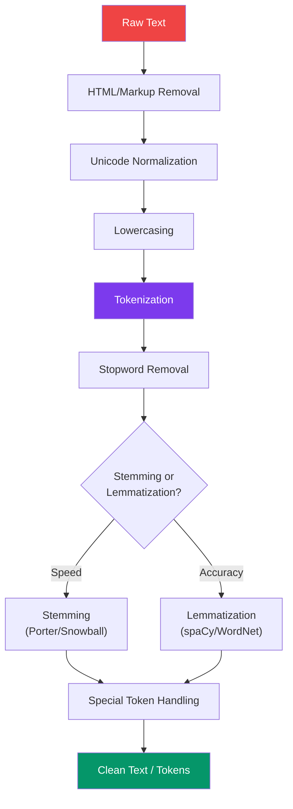

# Text Preprocessing for NLP

Text preprocessing transforms raw human language into a format that algorithms can process. The same sentence — "I can't believe it's NOT working!!!" — needs different preprocessing depending on whether you are building a sentiment classifier (keep the emphasis), a search index (remove punctuation), or a topic model (keep only meaningful words). This page covers every preprocessing technique and when to apply each.

---

## The NLP Preprocessing Pipeline



---

## HTML and Markup Removal

```python
# html_removal.py — Strip HTML, Markdown, and markup from text
import re
from html import unescape
from bs4 import BeautifulSoup


def strip_html(text: str) -> str:
    """Remove HTML tags and decode entities."""
    # Decode HTML entities first: &amp; -> &, &lt; -> <
    text = unescape(text)
    # Remove HTML tags
    text = BeautifulSoup(text, "html.parser").get_text(separator=" ")
    # Clean up whitespace
    text = re.sub(r"\s+", " ", text).strip()
    return text


def strip_markdown(text: str) -> str:
    """Remove common Markdown formatting."""
    # Headers: ## Title -> Title
    text = re.sub(r"#{1,6}\s*", "", text)
    # Bold/italic: **bold**, *italic*, __bold__, _italic_
    text = re.sub(r"\*{1,3}(.*?)\*{1,3}", r"\1", text)
    text = re.sub(r"_{1,3}(.*?)_{1,3}", r"\1", text)
    # Links: [text](url) -> text
    text = re.sub(r"\[([^\]]+)\]\([^\)]+\)", r"\1", text)
    # Images:  -> alt
    text = re.sub(r"!\[([^\]]*)\]\([^\)]+\)", r"\1", text)
    # Code blocks: ```code``` or `code`
    text = re.sub(r"```[\s\S]*?```", "", text)
    text = re.sub(r"`([^`]+)`", r"\1", text)
    # Blockquotes: > text -> text
    text = re.sub(r"^\s*>\s*", "", text, flags=re.MULTILINE)
    # Lists: - item or * item or 1. item
    text = re.sub(r"^\s*[-*+]\s+", "", text, flags=re.MULTILINE)
    text = re.sub(r"^\s*\d+\.\s+", "", text, flags=re.MULTILINE)
    # Horizontal rules
    text = re.sub(r"^\s*[-*_]{3,}\s*$", "", text, flags=re.MULTILINE)
    return text.strip()


def strip_urls(text: str) -> str:
    """Remove URLs from text."""
    return re.sub(r"https?://\S+|www\.\S+", "", text)


def strip_emails(text: str) -> str:
    """Remove email addresses."""
    return re.sub(r"\S+@\S+\.\S+", "", text)


def strip_special_characters(text: str, keep: str = "") -> str:
    """Remove special characters, optionally keeping some."""
    pattern = f"[^a-zA-Z0-9\\s{re.escape(keep)}]"
    return re.sub(pattern, " ", text)
```

---

## Tokenization Strategies

```python
# tokenization.py — Different tokenization approaches
import re
from typing import Iterator
import logging

logger = logging.getLogger(__name__)


class Tokenizer:
    """Multiple tokenization strategies for different NLP tasks."""

    @staticmethod
    def whitespace_tokenize(text: str) -> list[str]:
        """Split on whitespace. Simplest and fastest."""
        return text.split()

    @staticmethod
    def word_tokenize(text: str) -> list[str]:
        """
        Regex-based word tokenization.
        Handles contractions and hyphenated words better than split().
        """
        return re.findall(r"\b\w+(?:'\w+)?\b", text.lower())

    @staticmethod
    def nltk_tokenize(text: str) -> list[str]:
        """NLTK's word tokenizer — handles English contractions properly."""
        from nltk.tokenize import word_tokenize
        return word_tokenize(text)

    @staticmethod
    def spacy_tokenize(text: str, nlp=None) -> list[str]:
        """spaCy tokenizer — linguistically informed."""
        if nlp is None:
            import spacy
            nlp = spacy.load("en_core_web_sm")
        doc = nlp(text)
        return [token.text for token in doc]

    @staticmethod
    def sentence_tokenize(text: str) -> list[str]:
        """Split text into sentences."""
        from nltk.tokenize import sent_tokenize
        return sent_tokenize(text)

    @staticmethod
    def subword_tokenize(text: str, vocab_size: int = 10000) -> list[str]:
        """
        Byte-Pair Encoding (BPE) tokenization.
        Used by modern LLMs (GPT, BERT variants).
        Handles out-of-vocabulary words by splitting into subwords.
        """
        from tokenizers import Tokenizer as HFTokenizer
        from tokenizers.models import BPE
        from tokenizers.trainers import BpeTrainer
        from tokenizers.pre_tokenizers import Whitespace

        tokenizer = HFTokenizer(BPE(unk_token="[UNK]"))
        tokenizer.pre_tokenizer = Whitespace()

        # In practice, load a pre-trained tokenizer
        # tokenizer = HFTokenizer.from_pretrained("bert-base-uncased")
        output = tokenizer.encode(text)
        return output.tokens

    @staticmethod
    def character_ngrams(text: str, n: int = 3) -> list[str]:
        """Character n-grams — useful for fuzzy matching and language detection."""
        text = text.lower().strip()
        return [text[i:i + n] for i in range(len(text) - n + 1)]

    @staticmethod
    def word_ngrams(tokens: list[str], n: int = 2) -> list[str]:
        """Word n-grams from a token list."""
        return [
            " ".join(tokens[i:i + n])
            for i in range(len(tokens) - n + 1)
        ]


# Usage comparison
text = "I can't believe it's not working! Dr. Smith's algorithm isn't great."

print("Whitespace:", Tokenizer.whitespace_tokenize(text))
# ["I", "can't", "believe", "it's", "not", "working!", "Dr.", "Smith's", ...]

print("Word regex:", Tokenizer.word_tokenize(text))
# ["i", "can't", "believe", "it's", "not", "working", "dr", "smith's", ...]

print("NLTK:", Tokenizer.nltk_tokenize(text))
# ["I", "ca", "n't", "believe", "it", "'s", "not", "working", "!", ...]
```

---

## Stopword Removal

```python
# stopwords.py — Intelligent stopword handling
import re
from typing import Set


class StopwordRemover:
    """Remove stopwords with domain-aware customization."""

    # English stopwords (subset — full list has ~180 words)
    ENGLISH_STOPWORDS = {
        "a", "an", "the", "and", "or", "but", "in", "on", "at", "to",
        "for", "of", "with", "by", "from", "is", "are", "was", "were",
        "be", "been", "being", "have", "has", "had", "do", "does",
        "did", "will", "would", "could", "should", "may", "might",
        "shall", "can", "this", "that", "these", "those", "it", "its",
        "i", "me", "my", "we", "our", "you", "your", "he", "she",
        "him", "her", "his", "they", "them", "their", "what", "which",
        "who", "whom", "where", "when", "how", "not", "no", "nor",
        "if", "then", "than", "too", "very", "just", "about", "above",
        "after", "again", "all", "also", "am", "any", "because",
        "before", "between", "both", "each", "few", "more", "most",
        "other", "own", "same", "so", "some", "such", "only", "into",
        "over", "under", "up", "down", "out", "off", "here", "there",
    }

    def __init__(
        self,
        language: str = "english",
        custom_stopwords: set | None = None,
        keep_words: set | None = None,
    ):
        if language == "english":
            self.stopwords = self.ENGLISH_STOPWORDS.copy()
        else:
            try:
                from nltk.corpus import stopwords as nltk_sw
                self.stopwords = set(nltk_sw.words(language))
            except Exception:
                self.stopwords = set()

        if custom_stopwords:
            self.stopwords.update(custom_stopwords)
        if keep_words:
            self.stopwords -= keep_words

    def remove(self, tokens: list[str]) -> list[str]:
        """Remove stopwords from token list."""
        return [t for t in tokens if t.lower() not in self.stopwords]

    def remove_from_text(self, text: str) -> str:
        """Remove stopwords from raw text string."""
        tokens = text.lower().split()
        filtered = self.remove(tokens)
        return " ".join(filtered)


# Domain-specific stopword handling
# IMPORTANT: "not" is a stopword, but removing it flips sentiment!
# "This product is NOT good" -> "product good" (wrong!)

# For sentiment analysis, keep negation words:
sentiment_remover = StopwordRemover(
    keep_words={"not", "no", "nor", "never", "neither", "nobody",
                "nothing", "nowhere", "hardly", "barely", "scarcely"},
)

# For medical text, add domain stopwords:
medical_remover = StopwordRemover(
    custom_stopwords={"patient", "presented", "history", "examination"},
)
```

---

## Stemming vs Lemmatization

```python
# stem_lemma.py — Reduce words to base forms
import logging

logger = logging.getLogger(__name__)


class TextNormalizer:
    """Stemming and lemmatization with trade-off analysis."""

    @staticmethod
    def porter_stem(tokens: list[str]) -> list[str]:
        """
        Porter stemmer: aggressive, rule-based suffix stripping.

        Pros: Fast, no dictionary needed
        Cons: Produces non-words ("studies" -> "studi", "university" -> "univers")
        """
        from nltk.stem import PorterStemmer
        stemmer = PorterStemmer()
        return [stemmer.stem(t) for t in tokens]

    @staticmethod
    def snowball_stem(tokens: list[str], language: str = "english") -> list[str]:
        """
        Snowball stemmer: improved Porter, supports multiple languages.
        Slightly less aggressive than Porter.
        """
        from nltk.stem import SnowballStemmer
        stemmer = SnowballStemmer(language)
        return [stemmer.stem(t) for t in tokens]

    @staticmethod
    def wordnet_lemmatize(tokens: list[str]) -> list[str]:
        """
        WordNet lemmatizer: dictionary lookup for base forms.

        Pros: Produces real words ("studies" -> "study")
        Cons: Slower, needs POS tagging for best results
        """
        from nltk.stem import WordNetLemmatizer
        from nltk import pos_tag
        from nltk.corpus import wordnet

        lemmatizer = WordNetLemmatizer()

        def get_wordnet_pos(treebank_tag):
            if treebank_tag.startswith("J"):
                return wordnet.ADJ
            elif treebank_tag.startswith("V"):
                return wordnet.VERB
            elif treebank_tag.startswith("N"):
                return wordnet.NOUN
            elif treebank_tag.startswith("R"):
                return wordnet.ADV
            return wordnet.NOUN  # Default

        tagged = pos_tag(tokens)
        return [
            lemmatizer.lemmatize(word, get_wordnet_pos(pos))
            for word, pos in tagged
        ]

    @staticmethod
    def spacy_lemmatize(tokens: list[str], nlp=None) -> list[str]:
        """
        spaCy lemmatizer: uses trained models for accurate lemmatization.
        Best accuracy but slowest.
        """
        import spacy
        if nlp is None:
            nlp = spacy.load("en_core_web_sm")
        text = " ".join(tokens)
        doc = nlp(text)
        return [token.lemma_ for token in doc]

    @staticmethod
    def compare(tokens: list[str]) -> dict:
        """Compare all methods on the same input."""
        return {
            "original": tokens,
            "porter": TextNormalizer.porter_stem(tokens),
            "snowball": TextNormalizer.snowball_stem(tokens),
            "wordnet": TextNormalizer.wordnet_lemmatize(tokens),
        }


# Comparison example
tokens = ["running", "studies", "better", "feet", "geese", "universities"]
comparison = TextNormalizer.compare(tokens)
for method, result in comparison.items():
    print(f"  {method:12s}: {result}")

# original    : ['running', 'studies', 'better', 'feet', 'geese', 'universities']
# porter      : ['run', 'studi', 'better', 'feet', 'gees', 'univers']
# snowball    : ['run', 'studi', 'better', 'feet', 'gees', 'univers']
# wordnet     : ['run', 'study', 'good', 'foot', 'goose', 'university']
```

---

## Language Detection

```python
# language_detection.py — Detect text language
from langdetect import detect, detect_langs, DetectorFactory
import pandas as pd
import logging

# Make detection deterministic
DetectorFactory.seed = 42

logger = logging.getLogger(__name__)


def detect_language(text: str) -> dict:
    """Detect language of a text string."""
    if not text or len(text.strip()) < 10:
        return {"language": "unknown", "confidence": 0.0}

    try:
        langs = detect_langs(text)
        top = langs[0]
        return {
            "language": top.lang,
            "confidence": top.prob,
            "alternatives": [
                {"lang": l.lang, "prob": l.prob} for l in langs[1:3]
            ],
        }
    except Exception:
        return {"language": "unknown", "confidence": 0.0}


def filter_by_language(
    df: pd.DataFrame,
    column: str,
    target_language: str = "en",
    min_confidence: float = 0.8,
) -> pd.DataFrame:
    """Filter DataFrame to rows matching target language."""
    detections = df[column].apply(
        lambda x: detect_language(str(x)) if pd.notna(x)
        else {"language": "unknown", "confidence": 0.0}
    )

    df_result = df.copy()
    df_result["_detected_language"] = detections.apply(lambda x: x["language"])
    df_result["_language_confidence"] = detections.apply(lambda x: x["confidence"])

    mask = (
        (df_result["_detected_language"] == target_language) &
        (df_result["_language_confidence"] >= min_confidence)
    )

    filtered = df_result[mask].drop(columns=["_detected_language", "_language_confidence"])
    removed = len(df) - len(filtered)
    logger.info(f"Filtered {removed} rows (not '{target_language}' or low confidence)")

    return filtered
```

---

## Spell Correction

```python
# spell_correction.py — Fix spelling errors in text
from spellchecker import SpellChecker
import re
import pandas as pd
import logging

logger = logging.getLogger(__name__)


class TextSpellCorrector:
    """Spell correction for text data."""

    def __init__(self, language: str = "en", custom_words: set | None = None):
        self.checker = SpellChecker(language=language)
        if custom_words:
            self.checker.word_frequency.load_words(list(custom_words))

    def correct_text(self, text: str, max_corrections: int = 50) -> str:
        """Correct spelling in a text string."""
        words = text.split()
        corrections = 0
        corrected = []

        for word in words:
            # Skip non-alphabetic tokens
            if not word.isalpha() or len(word) <= 2:
                corrected.append(word)
                continue

            if word.lower() in self.checker:
                corrected.append(word)
            else:
                correction = self.checker.correction(word.lower())
                if correction and corrections < max_corrections:
                    corrected.append(correction)
                    corrections += 1
                else:
                    corrected.append(word)

        return " ".join(corrected)

    def correct_column(
        self,
        series: pd.Series,
        min_word_count: int = 3,
    ) -> pd.Series:
        """Correct spelling in a text column."""
        return series.apply(
            lambda x: self.correct_text(str(x))
            if pd.notna(x) and len(str(x).split()) >= min_word_count
            else x
        )

    def get_misspelled(self, text: str) -> list[dict]:
        """Find misspelled words and their suggestions."""
        words = [w for w in text.split() if w.isalpha() and len(w) > 2]
        misspelled = self.checker.unknown(words)

        return [
            {
                "word": word,
                "correction": self.checker.correction(word),
                "candidates": list(self.checker.candidates(word))[:5],
            }
            for word in misspelled
        ]


# Usage
corrector = TextSpellCorrector(
    custom_words={"sklearn", "pytorch", "tensorflow", "numpy", "pandas"}
)

text = "The machne lerning modle was trainned on teh datset"
corrected = corrector.correct_text(text)
print(f"Original:  {text}")
print(f"Corrected: {corrected}")
```

---

## Complete Text Preprocessing Pipeline

```python
# text_pipeline.py — Composable NLP preprocessing pipeline
import pandas as pd
import re
import unicodedata
from typing import Callable
from html import unescape


class NLPPreprocessor:
    """Composable text preprocessing pipeline for NLP tasks."""

    def __init__(self):
        self.steps: list[tuple[str, Callable]] = []

    def add(self, name: str, fn: Callable) -> "NLPPreprocessor":
        """Add a preprocessing step."""
        self.steps.append((name, fn))
        return self

    def process(self, text: str) -> str:
        """Apply all steps to a single text."""
        if not isinstance(text, str) or not text:
            return ""
        for _, fn in self.steps:
            text = fn(text)
        return text

    def process_series(self, series: pd.Series) -> pd.Series:
        """Apply pipeline to a pandas Series."""
        return series.apply(lambda x: self.process(x) if pd.notna(x) else "")

    # --- Factory methods for common pipelines ---

    @classmethod
    def for_classification(cls) -> "NLPPreprocessor":
        """Pipeline optimized for text classification."""
        return (
            cls()
            .add("html", lambda t: unescape(re.sub(r"<[^>]+>", " ", t)))
            .add("urls", lambda t: re.sub(r"https?://\S+", " URL ", t))
            .add("emails", lambda t: re.sub(r"\S+@\S+", " EMAIL ", t))
            .add("unicode", lambda t: unicodedata.normalize("NFKC", t))
            .add("lowercase", str.lower)
            .add("numbers", lambda t: re.sub(r"\d+", " NUM ", t))
            .add("punctuation", lambda t: re.sub(r"[^\w\s]", " ", t))
            .add("whitespace", lambda t: re.sub(r"\s+", " ", t).strip())
        )

    @classmethod
    def for_search(cls) -> "NLPPreprocessor":
        """Pipeline optimized for search/retrieval."""
        return (
            cls()
            .add("html", lambda t: re.sub(r"<[^>]+>", " ", t))
            .add("unicode", lambda t: unicodedata.normalize("NFKC", t))
            .add("lowercase", str.lower)
            .add("special_chars", lambda t: re.sub(r"[^\w\s\-]", " ", t))
            .add("whitespace", lambda t: re.sub(r"\s+", " ", t).strip())
        )

    @classmethod
    def for_embeddings(cls) -> "NLPPreprocessor":
        """Minimal cleaning for transformer-based embeddings."""
        return (
            cls()
            .add("html", lambda t: re.sub(r"<[^>]+>", " ", t))
            .add("unicode", lambda t: unicodedata.normalize("NFKC", t))
            .add("whitespace", lambda t: re.sub(r"\s+", " ", t).strip())
            # Keep casing and punctuation — transformers use them
        )

    @classmethod
    def for_topic_modeling(cls) -> "NLPPreprocessor":
        """Aggressive cleaning for topic modeling (LDA, NMF)."""
        return (
            cls()
            .add("html", lambda t: re.sub(r"<[^>]+>", " ", t))
            .add("urls", lambda t: re.sub(r"https?://\S+", "", t))
            .add("unicode", lambda t: unicodedata.normalize("NFKC", t))
            .add("lowercase", str.lower)
            .add("numbers", lambda t: re.sub(r"\d+", "", t))
            .add("punctuation", lambda t: re.sub(r"[^\w\s]", "", t))
            .add("short_words", lambda t: " ".join(
                w for w in t.split() if len(w) > 2
            ))
            .add("whitespace", lambda t: re.sub(r"\s+", " ", t).strip())
        )


# Usage
classifier_pipeline = NLPPreprocessor.for_classification()
embedding_pipeline = NLPPreprocessor.for_embeddings()

text = "<p>Check out https://example.com for 50% off! Contact info@test.com</p>"

print("Classification:", classifier_pipeline.process(text))
# "check out URL for NUM off contact EMAIL"

print("Embeddings:", embedding_pipeline.process(text))
# "Check out https://example.com for 50% off! Contact info@test.com"

# Apply to DataFrame
df["text_clean"] = classifier_pipeline.process_series(df["text"])
```

---

## Quick Reference

| Task | Preprocessing | Keep | Remove |
|------|--------------|------|--------|
| Sentiment Analysis | Minimal | Negations, punctuation, case | HTML, URLs |
| Text Classification | Moderate | Content words | Stopwords, numbers, special chars |
| Topic Modeling | Aggressive | Nouns, meaningful words | Everything else |
| Search/Retrieval | Moderate | Hyphenated words | HTML, special chars |
| Named Entity Recognition | Minimal | Case, punctuation | HTML only |
| Transformer Embeddings | Very Minimal | Almost everything | HTML tags |

| Technique | Speed | Accuracy | Produces Real Words |
|-----------|-------|----------|-------------------|
| Porter Stemming | Fast | Low | No |
| Snowball Stemming | Fast | Medium | No |
| WordNet Lemmatization | Medium | High | Yes |
| spaCy Lemmatization | Slow | Highest | Yes |

---

::: tip Key Takeaway
- The right preprocessing depends entirely on the NLP task: sentiment analysis needs punctuation and negations, while topic modeling aggressively removes everything but content words.
- Lemmatization produces real words and is more accurate than stemming, but stemming is 10x faster and sufficient for information retrieval tasks.
- Transformer-based models (BERT, GPT) need minimal preprocessing -- they were trained on raw text with casing and punctuation, so aggressive cleaning degrades their performance.
:::

::: details Exercise
**Build Task-Specific Text Preprocessors**

Create three preprocessing pipelines and compare their output on the sentence: `"<p>I can't believe it's NOT working! Check https://help.com for $50 off.</p>"`:
1. **Sentiment analysis pipeline**: keep negations and emphasis, remove HTML and URLs.
2. **Search index pipeline**: lowercase, remove special characters, keep hyphens.
3. **Topic modeling pipeline**: remove everything except meaningful words longer than 2 characters.

**Solution Sketch**

```python
import re
from html import unescape

text = "<p>I can't believe it's NOT working! Check https://help.com for $50 off.</p>"

# Sentiment: keep negation, emphasis
sent = re.sub(r"<[^>]+>", " ", text)
sent = re.sub(r"https?://\S+", "", sent)
sent = re.sub(r"\s+", " ", sent).strip()
# "I can't believe it's NOT working! Check for $50 off."

# Search: lowercase, remove special
search = re.sub(r"<[^>]+>", " ", text)
search = search.lower()
search = re.sub(r"[^\w\s\-]", " ", search)
search = re.sub(r"\s+", " ", search).strip()
# "i can t believe it s not working check https help com for 50 off"

# Topic: only long meaningful words
topic = re.sub(r"<[^>]+>", " ", text)
topic = re.sub(r"https?://\S+", "", topic)
topic = topic.lower()
topic = re.sub(r"[^\w\s]", "", topic)
topic = " ".join(w for w in topic.split() if len(w) > 2)
# "can believe not working check for off"
```
:::

::: details Debugging Scenario
**Your sentiment classifier achieves 95% accuracy in development but only 60% in production. The production text contains HTML email content with inline CSS and base64 images.**

Diagnose and fix it.

**Answer**

The model was trained on clean text but production data contains raw HTML that was not stripped. The HTML tags, CSS, and base64 strings are treated as "words" by the tokenizer, drowning out the actual text content.

Fix:
1. **Add HTML stripping to the production preprocessing pipeline**: use `BeautifulSoup(text, "html.parser").get_text(separator=" ")` followed by `html.unescape()`.
2. **Remove base64 content**: `re.sub(r"data:[^;]+;base64,[A-Za-z0-9+/=]+", "", text)`.
3. **Strip inline CSS**: `re.sub(r"style=\"[^\"]*\"", "", text)` before HTML parsing.
4. **Retrain or fine-tune** the model on data preprocessed with the production pipeline to ensure train-time and inference-time preprocessing match exactly.

The root cause is **training-serving skew**: the preprocessing pipeline used during training differed from production.
:::

::: warning Common Misconceptions
- **"Removing stopwords always improves NLP models."** Removing "not" from "not good" flips the sentiment. Keep negation words for sentiment tasks. For topic modeling, removing stopwords is essential.
- **"Stemming and lemmatization are interchangeable."** Stemming produces non-words ("studies" becomes "studi"), which is acceptable for search but breaks readability. Lemmatization produces real base forms ("studies" becomes "study").
- **"Transformers do not need any preprocessing."** Transformers need minimal preprocessing, but HTML tags, base64 content, and excessive whitespace should still be removed. Over-cleaning (lowercasing, removing punctuation) hurts transformer performance.
- **"Spell correction improves all NLP tasks."** Spell correction changes domain-specific terms, product names, and intentional misspellings (slang). Only use it when misspelling genuinely introduces noise.
:::

::: details Quiz
**1. Why should you keep punctuation for sentiment analysis but remove it for topic modeling?**

> Punctuation carries emotional signal in sentiment ("amazing!!!" vs "amazing"), but adds noise in topic modeling where only content words matter for identifying themes.

**2. What is the difference between character n-grams and word n-grams?**

> Character n-grams are substrings of N characters ("hello" with n=3 produces "hel", "ell", "llo"). Word n-grams are sequences of N consecutive words. Character n-grams are useful for language detection and fuzzy matching; word n-grams capture phrases.

**3. Why does spaCy's lemmatizer outperform WordNet's?**

> spaCy uses trained statistical models that understand context, so "better" as an adjective lemmatizes to "good" but "better" as a verb lemmatizes to "better." WordNet relies on explicit POS tags that may be wrong.

**4. When should you use subword tokenization (BPE) instead of word tokenization?**

> When handling out-of-vocabulary words, morphologically rich languages, or training/using transformer models. BPE splits unknown words into known subword pieces, ensuring every input can be tokenized.

**5. Why is `langdetect` unreliable on short texts?**

> Language detection relies on character n-gram frequency distributions, which need enough text to produce stable statistics. Short texts (under 20 characters) have too few n-grams for reliable classification.
:::

> **One-Liner Summary:** Text preprocessing is task-dependent: sentiment analysis needs negations and emphasis, topic modeling needs only content words, and transformers need almost nothing -- the wrong pipeline for the wrong task silently destroys model performance.
