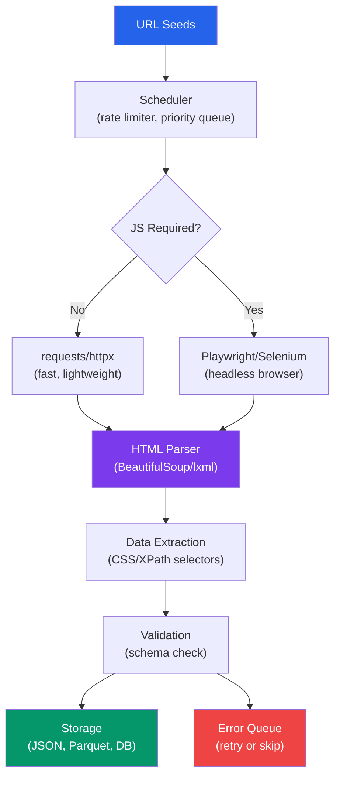

# Web Scraping at Scale

Web scraping is the art of extracting structured data from unstructured web pages. At small scale it is straightforward — a few requests, some HTML parsing, done. At scale, it becomes a distributed systems problem: you must handle rate limiting, IP bans, JavaScript rendering, anti-bot detection, schema changes, partial failures, and legal compliance. This page covers every layer, from simple scripts to production-grade Scrapy pipelines.

---

## Scraping Architecture Overview



---

## Level 1: requests + BeautifulSoup

For simple, static HTML pages, this combination handles 80% of scraping needs.

### Basic Scraping Pattern

```python
# basic_scraper.py — Simple scraping with error handling
import requests
from bs4 import BeautifulSoup
import pandas as pd
import time
import logging
from typing import Optional

logging.basicConfig(level=logging.INFO)
logger = logging.getLogger(__name__)


class BasicScraper:
    """Simple scraper for static HTML pages."""

    def __init__(self, delay: float = 1.0, timeout: int = 30):
        self.delay = delay
        self.timeout = timeout
        self.session = requests.Session()
        self.session.headers.update({
            "User-Agent": (
                "Mozilla/5.0 (Windows NT 10.0; Win64; x64) "
                "AppleWebKit/537.36 (KHTML, like Gecko) "
                "Chrome/120.0.0.0 Safari/537.36"
            ),
            "Accept": "text/html,application/xhtml+xml,application/xml;q=0.9",
            "Accept-Language": "en-US,en;q=0.9",
        })

    def fetch(self, url: str) -> Optional[BeautifulSoup]:
        """Fetch a URL and return parsed HTML."""
        try:
            response = self.session.get(url, timeout=self.timeout)
            response.raise_for_status()
            time.sleep(self.delay)  # Be respectful
            return BeautifulSoup(response.text, "lxml")
        except requests.RequestException as e:
            logger.error(f"Failed to fetch {url}: {e}")
            return None

    def scrape_table(self, url: str, table_index: int = 0) -> pd.DataFrame:
        """Extract an HTML table into a DataFrame."""
        soup = self.fetch(url)
        if soup is None:
            return pd.DataFrame()

        tables = soup.find_all("table")
        if table_index >= len(tables):
            logger.warning(f"Table index {table_index} not found at {url}")
            return pd.DataFrame()

        table = tables[table_index]
        headers = [th.get_text(strip=True) for th in table.find_all("th")]
        rows = []
        for tr in table.find_all("tr")[1:]:  # Skip header row
            cells = [td.get_text(strip=True) for td in tr.find_all(["td", "th"])]
            if cells:
                rows.append(cells)

        if headers:
            return pd.DataFrame(rows, columns=headers[:len(rows[0])] if rows else headers)
        return pd.DataFrame(rows)


# Usage
scraper = BasicScraper(delay=1.5)
soup = scraper.fetch("https://example.com/products")
if soup:
    products = []
    for card in soup.select(".product-card"):
        products.append({
            "name": card.select_one(".product-name").get_text(strip=True),
            "price": card.select_one(".price").get_text(strip=True),
            "rating": card.select_one(".rating").get("data-score", "N/A"),
            "url": card.select_one("a")["href"],
        })
    df = pd.DataFrame(products)
    print(f"Scraped {len(df)} products")
```

### Handling Pagination

```python
# paginated_scraper.py — Scraping across multiple pages
import requests
from bs4 import BeautifulSoup
import time
import logging
from urllib.parse import urljoin, urlparse, parse_qs, urlencode

logger = logging.getLogger(__name__)


class PaginatedScraper:
    """Scrape across paginated listing pages."""

    def __init__(self, base_url: str, delay: float = 1.0):
        self.base_url = base_url
        self.delay = delay
        self.session = requests.Session()
        self.session.headers["User-Agent"] = (
            "Mozilla/5.0 (compatible; DataBot/1.0)"
        )

    def scrape_all_pages(self, max_pages: int = 100) -> list[dict]:
        """Follow pagination links until exhausted."""
        all_items = []
        url = self.base_url
        page_num = 0

        while url and page_num < max_pages:
            page_num += 1
            logger.info(f"Scraping page {page_num}: {url}")

            try:
                response = self.session.get(url, timeout=30)
                response.raise_for_status()
            except requests.RequestException as e:
                logger.error(f"Page {page_num} failed: {e}")
                break

            soup = BeautifulSoup(response.text, "lxml")
            items = self._extract_items(soup)
            all_items.extend(items)

            if not items:
                logger.info("No items found, stopping pagination")
                break

            url = self._find_next_page(soup, response.url)
            time.sleep(self.delay)

        logger.info(f"Total items scraped: {len(all_items)}")
        return all_items

    def _extract_items(self, soup: BeautifulSoup) -> list[dict]:
        """Override this method for your specific site."""
        items = []
        for listing in soup.select(".listing-item"):
            items.append({
                "title": listing.select_one("h2").get_text(strip=True),
                "price": listing.select_one(".price").get_text(strip=True),
                "link": listing.select_one("a")["href"],
            })
        return items

    def _find_next_page(self, soup: BeautifulSoup, current_url: str) -> str | None:
        """Detect next page URL from common pagination patterns."""
        # Pattern 1: <a rel="next">
        next_link = soup.select_one('a[rel="next"]')
        if next_link and next_link.get("href"):
            return urljoin(current_url, next_link["href"])

        # Pattern 2: <li class="next"><a href="...">
        next_li = soup.select_one("li.next a, .pagination .next a")
        if next_li and next_li.get("href"):
            return urljoin(current_url, next_li["href"])

        # Pattern 3: aria-label="Next"
        next_aria = soup.select_one('[aria-label="Next"]')
        if next_aria and next_aria.get("href"):
            return urljoin(current_url, next_aria["href"])

        return None
```

### Robust Retry Logic

```python
# retry_fetch.py — Exponential backoff with jitter
import requests
import time
import random
import logging
from typing import Optional

logger = logging.getLogger(__name__)


def fetch_with_retry(
    url: str,
    session: requests.Session | None = None,
    max_retries: int = 5,
    base_delay: float = 1.0,
    max_delay: float = 60.0,
    timeout: int = 30,
) -> Optional[requests.Response]:
    """
    Fetch URL with exponential backoff and jitter.

    Retries on: 429, 500, 502, 503, 504, ConnectionError, Timeout.
    Does NOT retry on: 400, 401, 403, 404 (client errors are permanent).
    """
    session = session or requests.Session()
    retryable_status_codes = {429, 500, 502, 503, 504}

    for attempt in range(max_retries):
        try:
            response = session.get(url, timeout=timeout)

            if response.status_code == 200:
                return response

            if response.status_code == 429:
                # Respect Retry-After header if present
                retry_after = response.headers.get("Retry-After")
                if retry_after:
                    delay = float(retry_after)
                    logger.warning(f"Rate limited, waiting {delay}s")
                    time.sleep(delay)
                    continue

            if response.status_code in retryable_status_codes:
                delay = min(base_delay * (2 ** attempt), max_delay)
                jitter = random.uniform(0, delay * 0.1)
                total_delay = delay + jitter
                logger.warning(
                    f"Attempt {attempt + 1}/{max_retries}: "
                    f"HTTP {response.status_code}, retrying in {total_delay:.1f}s"
                )
                time.sleep(total_delay)
                continue

            # Non-retryable HTTP error
            logger.error(f"HTTP {response.status_code} for {url} (not retryable)")
            return response

        except (requests.ConnectionError, requests.Timeout) as e:
            delay = min(base_delay * (2 ** attempt), max_delay)
            jitter = random.uniform(0, delay * 0.1)
            logger.warning(
                f"Attempt {attempt + 1}/{max_retries}: {type(e).__name__}, "
                f"retrying in {delay + jitter:.1f}s"
            )
            time.sleep(delay + jitter)

    logger.error(f"All {max_retries} attempts failed for {url}")
    return None
```

---

## Level 2: Scrapy for Production Scraping

Scrapy is a framework, not a library. It handles concurrency, rate limiting, retries, pipelines, and middleware out of the box.

### Scrapy Project Structure

```
my_scraper/
├── scrapy.cfg
├── my_scraper/
│   ├── __init__.py
│   ├── items.py          # Data models
│   ├── middlewares.py     # Request/response processing
│   ├── pipelines.py       # Item processing pipeline
│   ├── settings.py        # Configuration
│   └── spiders/
│       ├── __init__.py
│       └── products.py    # Spider definition
```

### Defining Items

```python
# items.py — Structured data models for scraped data
import scrapy
from itemloaders.processors import TakeFirst, MapCompose, Join
from w3lib.html import remove_tags
import re


def clean_price(value: str) -> float | None:
    """Extract numeric price from string like '$1,234.56'."""
    if not value:
        return None
    cleaned = re.sub(r"[^\d.]", "", value)
    try:
        return float(cleaned)
    except ValueError:
        return None


def clean_rating(value: str) -> float | None:
    """Extract rating from strings like '4.5 out of 5'."""
    if not value:
        return None
    match = re.search(r"(\d+\.?\d*)", value)
    return float(match.group(1)) if match else None


class ProductItem(scrapy.Item):
    """Product data model with field processors."""
    name = scrapy.Field(
        input_processor=MapCompose(remove_tags, str.strip),
        output_processor=TakeFirst(),
    )
    price = scrapy.Field(
        input_processor=MapCompose(remove_tags, str.strip, clean_price),
        output_processor=TakeFirst(),
    )
    rating = scrapy.Field(
        input_processor=MapCompose(remove_tags, str.strip, clean_rating),
        output_processor=TakeFirst(),
    )
    category = scrapy.Field(
        input_processor=MapCompose(remove_tags, str.strip),
        output_processor=TakeFirst(),
    )
    description = scrapy.Field(
        input_processor=MapCompose(remove_tags, str.strip),
        output_processor=Join(" "),
    )
    url = scrapy.Field(output_processor=TakeFirst())
    scraped_at = scrapy.Field(output_processor=TakeFirst())
```

### Writing a Spider

```python
# spiders/products.py — Full spider with pagination
import scrapy
from scrapy.loader import ItemLoader
from datetime import datetime, timezone
from my_scraper.items import ProductItem


class ProductSpider(scrapy.Spider):
    name = "products"
    allowed_domains = ["example-store.com"]
    start_urls = ["https://example-store.com/products?page=1"]

    custom_settings = {
        "CONCURRENT_REQUESTS": 4,
        "DOWNLOAD_DELAY": 1.5,
        "RANDOMIZE_DOWNLOAD_DELAY": True,
        "RETRY_TIMES": 3,
        "RETRY_HTTP_CODES": [500, 502, 503, 504, 429],
    }

    def parse(self, response):
        """Parse listing page, yield items and follow pagination."""
        self.logger.info(f"Parsing: {response.url}")

        # Extract product cards
        for card in response.css(".product-card"):
            loader = ItemLoader(item=ProductItem(), selector=card)
            loader.add_css("name", "h2.product-title::text")
            loader.add_css("price", ".price::text")
            loader.add_css("rating", ".star-rating::attr(data-rating)")
            loader.add_css("category", ".category-badge::text")

            # Follow detail page for full description
            detail_url = card.css("a.product-link::attr(href)").get()
            if detail_url:
                yield response.follow(
                    detail_url,
                    callback=self.parse_detail,
                    meta={"loader": loader},
                )
            else:
                loader.add_value("url", response.url)
                loader.add_value(
                    "scraped_at",
                    datetime.now(timezone.utc).isoformat()
                )
                yield loader.load_item()

        # Follow pagination
        next_page = response.css('a[rel="next"]::attr(href)').get()
        if next_page:
            yield response.follow(next_page, callback=self.parse)

    def parse_detail(self, response):
        """Parse product detail page for description."""
        loader = response.meta["loader"]
        loader.add_value("url", response.url)
        loader.add_value(
            "scraped_at",
            datetime.now(timezone.utc).isoformat()
        )

        # Extract description from detail page
        loader.selector = response
        loader.add_css("description", ".product-description p::text")

        yield loader.load_item()
```

### Scrapy Pipelines

```python
# pipelines.py — Item processing chain
import json
import logging
from datetime import datetime
from pathlib import Path

import pandas as pd
from scrapy.exceptions import DropItem


logger = logging.getLogger(__name__)


class ValidationPipeline:
    """Drop items that fail validation."""

    required_fields = ["name", "price"]

    def process_item(self, item, spider):
        for field in self.required_fields:
            if not item.get(field):
                raise DropItem(f"Missing required field: {field}")

        # Price sanity check
        if item.get("price") is not None:
            if item["price"] <= 0 or item["price"] > 1_000_000:
                raise DropItem(
                    f"Price out of range: {item['price']} for {item['name']}"
                )

        return item


class DeduplicationPipeline:
    """Drop duplicate items based on URL."""

    def __init__(self):
        self.seen_urls = set()

    def process_item(self, item, spider):
        url = item.get("url", "")
        if url in self.seen_urls:
            raise DropItem(f"Duplicate URL: {url}")
        self.seen_urls.add(url)
        return item


class ParquetExportPipeline:
    """Batch items and write to Parquet periodically."""

    def __init__(self, batch_size: int = 1000):
        self.batch_size = batch_size
        self.items: list[dict] = []
        self.file_count = 0
        self.output_dir = Path("output")

    @classmethod
    def from_crawler(cls, crawler):
        batch_size = crawler.settings.getint("PARQUET_BATCH_SIZE", 1000)
        return cls(batch_size=batch_size)

    def open_spider(self, spider):
        self.output_dir.mkdir(parents=True, exist_ok=True)
        self.items = []
        self.file_count = 0

    def process_item(self, item, spider):
        self.items.append(dict(item))
        if len(self.items) >= self.batch_size:
            self._flush(spider)
        return item

    def close_spider(self, spider):
        if self.items:
            self._flush(spider)
        logger.info(f"Wrote {self.file_count} Parquet files")

    def _flush(self, spider):
        df = pd.DataFrame(self.items)
        timestamp = datetime.utcnow().strftime("%Y%m%d_%H%M%S")
        path = self.output_dir / f"{spider.name}_{timestamp}_{self.file_count:04d}.parquet"
        df.to_parquet(path, index=False, engine="pyarrow")
        logger.info(f"Flushed {len(self.items)} items to {path}")
        self.items = []
        self.file_count += 1
```

### Scrapy Middleware for Proxy Rotation

```python
# middlewares.py — Rotating proxy middleware
import random
import logging
from scrapy import signals

logger = logging.getLogger(__name__)


class RotatingProxyMiddleware:
    """Rotate through a list of proxy servers."""

    def __init__(self, proxy_list: list[str]):
        self.proxies = proxy_list
        self.failed_proxies: set[str] = set()

    @classmethod
    def from_crawler(cls, crawler):
        proxy_list = crawler.settings.getlist("PROXY_LIST", [])
        if not proxy_list:
            raise ValueError("PROXY_LIST setting is required")

        middleware = cls(proxy_list)
        crawler.signals.connect(
            middleware.spider_opened, signal=signals.spider_opened
        )
        return middleware

    def spider_opened(self, spider):
        logger.info(f"Proxy pool size: {len(self.proxies)}")

    def process_request(self, request, spider):
        available = [p for p in self.proxies if p not in self.failed_proxies]
        if not available:
            logger.warning("All proxies failed, resetting pool")
            self.failed_proxies.clear()
            available = self.proxies

        proxy = random.choice(available)
        request.meta["proxy"] = proxy

    def process_exception(self, request, exception, spider):
        proxy = request.meta.get("proxy")
        if proxy:
            self.failed_proxies.add(proxy)
            logger.warning(f"Proxy failed, removing: {proxy}")


class RotatingUserAgentMiddleware:
    """Rotate User-Agent headers to avoid detection."""

    USER_AGENTS = [
        "Mozilla/5.0 (Windows NT 10.0; Win64; x64) AppleWebKit/537.36 Chrome/120.0.0.0",
        "Mozilla/5.0 (Macintosh; Intel Mac OS X 10_15_7) AppleWebKit/605.1.15 Safari/605.1.15",
        "Mozilla/5.0 (X11; Linux x86_64) AppleWebKit/537.36 Chrome/119.0.0.0",
        "Mozilla/5.0 (Windows NT 10.0; Win64; x64; rv:121.0) Gecko/20100101 Firefox/121.0",
        "Mozilla/5.0 (Macintosh; Intel Mac OS X 10_15_7) AppleWebKit/537.36 Chrome/120.0.0.0",
    ]

    def process_request(self, request, spider):
        request.headers["User-Agent"] = random.choice(self.USER_AGENTS)
```

### Scrapy Settings

```python
# settings.py — Production-ready settings
BOT_NAME = "my_scraper"
SPIDER_MODULES = ["my_scraper.spiders"]
NEWSPIDER_MODULE = "my_scraper.spiders"

# Crawl responsibly
ROBOTSTXT_OBEY = True
CONCURRENT_REQUESTS = 8
CONCURRENT_REQUESTS_PER_DOMAIN = 4
DOWNLOAD_DELAY = 1.0
RANDOMIZE_DOWNLOAD_DELAY = True

# Retry configuration
RETRY_ENABLED = True
RETRY_TIMES = 3
RETRY_HTTP_CODES = [500, 502, 503, 504, 408, 429]

# Timeout
DOWNLOAD_TIMEOUT = 30

# AutoThrottle — dynamically adjusts speed based on server load
AUTOTHROTTLE_ENABLED = True
AUTOTHROTTLE_START_DELAY = 1
AUTOTHROTTLE_MAX_DELAY = 60
AUTOTHROTTLE_TARGET_CONCURRENCY = 2.0

# Pipeline ordering (lower number = runs first)
ITEM_PIPELINES = {
    "my_scraper.pipelines.ValidationPipeline": 100,
    "my_scraper.pipelines.DeduplicationPipeline": 200,
    "my_scraper.pipelines.ParquetExportPipeline": 300,
}

# Middleware
DOWNLOADER_MIDDLEWARES = {
    "my_scraper.middlewares.RotatingUserAgentMiddleware": 400,
    "my_scraper.middlewares.RotatingProxyMiddleware": 410,
}

# Proxy list
PROXY_LIST = [
    "http://proxy1.example.com:8080",
    "http://proxy2.example.com:8080",
    "http://proxy3.example.com:8080",
]

# Cache (useful during development)
HTTPCACHE_ENABLED = True
HTTPCACHE_EXPIRATION_SECS = 86400  # 24 hours
HTTPCACHE_DIR = "httpcache"

# Logging
LOG_LEVEL = "INFO"
LOG_FORMAT = "%(asctime)s [%(name)s] %(levelname)s: %(message)s"

# Feed export
FEEDS = {
    "output/%(name)s_%(time)s.jsonl": {
        "format": "jsonlines",
        "encoding": "utf-8",
        "overwrite": False,
    }
}
```

---

## Level 3: JavaScript-Rendered Pages

When pages load content dynamically via JavaScript, requests sees only the initial HTML shell. You need a headless browser.

### Playwright (Recommended)

```python
# playwright_scraper.py — Scraping JS-rendered pages
import asyncio
from playwright.async_api import async_playwright, Page
import json
import logging

logger = logging.getLogger(__name__)


class PlaywrightScraper:
    """Scrape JavaScript-heavy pages with Playwright."""

    def __init__(self, headless: bool = True):
        self.headless = headless
        self._playwright = None
        self._browser = None

    async def __aenter__(self):
        self._playwright = await async_playwright().start()
        self._browser = await self._playwright.chromium.launch(
            headless=self.headless
        )
        return self

    async def __aexit__(self, exc_type, exc_val, exc_tb):
        if self._browser:
            await self._browser.close()
        if self._playwright:
            await self._playwright.stop()

    async def scrape_page(self, url: str, wait_selector: str = "body") -> dict:
        """Scrape a single page, waiting for content to load."""
        context = await self._browser.new_context(
            viewport={"width": 1920, "height": 1080},
            user_agent=(
                "Mozilla/5.0 (Windows NT 10.0; Win64; x64) "
                "AppleWebKit/537.36 Chrome/120.0.0.0"
            ),
        )
        page = await context.new_page()

        try:
            await page.goto(url, wait_until="networkidle", timeout=30000)
            await page.wait_for_selector(wait_selector, timeout=10000)

            # Extract data using page.evaluate (runs JS in browser)
            data = await page.evaluate("""
                () => {
                    const items = [];
                    document.querySelectorAll('.product-card').forEach(card => {
                        items.push({
                            name: card.querySelector('.name')?.textContent?.trim(),
                            price: card.querySelector('.price')?.textContent?.trim(),
                            image: card.querySelector('img')?.src,
                        });
                    });
                    return items;
                }
            """)
            return {"url": url, "items": data, "status": "success"}

        except Exception as e:
            logger.error(f"Failed to scrape {url}: {e}")
            return {"url": url, "items": [], "status": "error", "error": str(e)}
        finally:
            await context.close()

    async def scrape_infinite_scroll(
        self, url: str, max_scrolls: int = 20, scroll_delay: float = 2.0
    ) -> list[dict]:
        """Handle infinite scroll pages."""
        context = await self._browser.new_context()
        page = await context.new_page()

        try:
            await page.goto(url, wait_until="networkidle")
            previous_height = 0

            for scroll_num in range(max_scrolls):
                # Scroll to bottom
                await page.evaluate("window.scrollTo(0, document.body.scrollHeight)")
                await page.wait_for_timeout(int(scroll_delay * 1000))

                # Check if page grew
                current_height = await page.evaluate("document.body.scrollHeight")
                if current_height == previous_height:
                    logger.info(f"Scroll exhausted at scroll {scroll_num + 1}")
                    break
                previous_height = current_height
                logger.info(f"Scroll {scroll_num + 1}: height = {current_height}")

            # Extract all loaded content
            items = await page.evaluate("""
                () => {
                    return Array.from(document.querySelectorAll('.item')).map(el => ({
                        text: el.textContent.trim(),
                        href: el.querySelector('a')?.href,
                    }));
                }
            """)
            return items

        finally:
            await context.close()

    async def scrape_with_interaction(self, url: str) -> list[dict]:
        """Handle pages requiring clicks, dropdowns, or form fills."""
        context = await self._browser.new_context()
        page = await context.new_page()

        try:
            await page.goto(url, wait_until="networkidle")

            # Click a dropdown to reveal content
            await page.click("#category-dropdown")
            await page.wait_for_timeout(500)
            await page.click('[data-value="electronics"]')
            await page.wait_for_timeout(1000)

            # Click "Load More" button until it disappears
            while True:
                load_more = page.locator("button.load-more")
                if await load_more.count() == 0:
                    break
                if not await load_more.is_visible():
                    break
                await load_more.click()
                await page.wait_for_timeout(1500)

            # Extract after all interactions
            return await page.evaluate("""
                () => Array.from(document.querySelectorAll('.result-item')).map(el => ({
                    title: el.querySelector('h3')?.textContent?.trim(),
                    detail: el.querySelector('.detail')?.textContent?.trim(),
                }))
            """)
        finally:
            await context.close()


# Usage
async def main():
    async with PlaywrightScraper(headless=True) as scraper:
        result = await scraper.scrape_page(
            "https://example-spa.com/products",
            wait_selector=".product-card"
        )
        print(f"Scraped {len(result['items'])} items")

        # Infinite scroll
        items = await scraper.scrape_infinite_scroll(
            "https://example-spa.com/feed",
            max_scrolls=10,
        )
        print(f"Scrolled and found {len(items)} items")

asyncio.run(main())
```

### Selenium (Legacy but Common)

```python
# selenium_scraper.py — For sites that need Selenium specifically
from selenium import webdriver
from selenium.webdriver.chrome.options import Options
from selenium.webdriver.chrome.service import Service
from selenium.webdriver.common.by import By
from selenium.webdriver.support.ui import WebDriverWait
from selenium.webdriver.support import expected_conditions as EC
from selenium.common.exceptions import TimeoutException
import logging

logger = logging.getLogger(__name__)


def create_driver(headless: bool = True) -> webdriver.Chrome:
    """Create a configured Chrome WebDriver."""
    options = Options()
    if headless:
        options.add_argument("--headless=new")
    options.add_argument("--no-sandbox")
    options.add_argument("--disable-dev-shm-usage")
    options.add_argument("--disable-blink-features=AutomationControlled")
    options.add_argument("--window-size=1920,1080")
    options.add_experimental_option("excludeSwitches", ["enable-automation"])

    driver = webdriver.Chrome(options=options)
    driver.implicitly_wait(10)
    return driver


def scrape_dynamic_page(url: str) -> list[dict]:
    """Scrape a JS-rendered page with Selenium."""
    driver = create_driver(headless=True)

    try:
        driver.get(url)

        # Wait for specific element to appear
        WebDriverWait(driver, 15).until(
            EC.presence_of_all_elements_located(
                (By.CSS_SELECTOR, ".product-card")
            )
        )

        items = []
        cards = driver.find_elements(By.CSS_SELECTOR, ".product-card")
        for card in cards:
            try:
                items.append({
                    "name": card.find_element(By.CSS_SELECTOR, ".name").text,
                    "price": card.find_element(By.CSS_SELECTOR, ".price").text,
                })
            except Exception:
                continue

        return items

    except TimeoutException:
        logger.error(f"Timeout waiting for content at {url}")
        return []
    finally:
        driver.quit()
```

---

## Rate Limiting and Politeness

Aggressive scraping gets your IP banned and may violate terms of service. Always be a good citizen.

```python
# rate_limiter.py — Token bucket rate limiter
import time
import threading
from collections import defaultdict


class TokenBucketRateLimiter:
    """
    Token bucket algorithm for rate limiting requests.

    - Tokens are added at a fixed rate (tokens_per_second).
    - Each request consumes one token.
    - If no tokens available, the caller waits.
    """

    def __init__(
        self,
        tokens_per_second: float = 1.0,
        burst_size: int = 5,
    ):
        self.rate = tokens_per_second
        self.burst_size = burst_size
        self.tokens = burst_size  # Start full
        self.last_refill = time.monotonic()
        self.lock = threading.Lock()

    def acquire(self):
        """Block until a token is available, then consume it."""
        while True:
            with self.lock:
                self._refill()
                if self.tokens >= 1:
                    self.tokens -= 1
                    return
            time.sleep(0.05)  # Brief sleep before retry

    def _refill(self):
        """Add tokens based on elapsed time."""
        now = time.monotonic()
        elapsed = now - self.last_refill
        new_tokens = elapsed * self.rate
        self.tokens = min(self.tokens + new_tokens, self.burst_size)
        self.last_refill = now


class PerDomainRateLimiter:
    """Separate rate limits per domain."""

    def __init__(self, default_rate: float = 1.0):
        self.default_rate = default_rate
        self.limiters: dict[str, TokenBucketRateLimiter] = {}
        self.domain_rates: dict[str, float] = {}

    def set_rate(self, domain: str, tokens_per_second: float):
        self.domain_rates[domain] = tokens_per_second

    def acquire(self, domain: str):
        if domain not in self.limiters:
            rate = self.domain_rates.get(domain, self.default_rate)
            self.limiters[domain] = TokenBucketRateLimiter(rate, burst_size=3)
        self.limiters[domain].acquire()


# Usage
limiter = PerDomainRateLimiter(default_rate=0.5)  # 1 request per 2 seconds
limiter.set_rate("api.fast-site.com", 5.0)  # This API allows more

# Before each request:
limiter.acquire("example.com")
# ... make request ...
```

---

## Storing Scraped Data

### Incremental Storage with Deduplication

```python
# storage.py — Append-only storage with deduplication
import pandas as pd
import hashlib
import json
from pathlib import Path
from datetime import datetime


class ScrapedDataStore:
    """
    Append-only store for scraped data with deduplication.
    Uses content hashing to detect duplicates across runs.
    """

    def __init__(self, store_dir: str = "./scraped_data"):
        self.store_dir = Path(store_dir)
        self.store_dir.mkdir(parents=True, exist_ok=True)
        self.seen_hashes_file = self.store_dir / "_seen_hashes.json"
        self.seen_hashes = self._load_seen_hashes()

    def _load_seen_hashes(self) -> set:
        if self.seen_hashes_file.exists():
            data = json.loads(self.seen_hashes_file.read_text())
            return set(data)
        return set()

    def _save_seen_hashes(self):
        self.seen_hashes_file.write_text(
            json.dumps(list(self.seen_hashes))
        )

    def _hash_record(self, record: dict) -> str:
        """Create a content hash for deduplication."""
        # Use a subset of fields for identity (not scraped_at)
        identity_fields = {
            k: v for k, v in sorted(record.items())
            if k not in ("scraped_at", "scrape_id")
        }
        content = json.dumps(identity_fields, sort_keys=True, default=str)
        return hashlib.md5(content.encode()).hexdigest()

    def store(self, records: list[dict], source: str) -> int:
        """Store new records, skip duplicates. Returns count of new records."""
        new_records = []
        for record in records:
            content_hash = self._hash_record(record)
            if content_hash not in self.seen_hashes:
                self.seen_hashes.add(content_hash)
                record["_content_hash"] = content_hash
                new_records.append(record)

        if not new_records:
            return 0

        df = pd.DataFrame(new_records)
        timestamp = datetime.utcnow().strftime("%Y%m%d_%H%M%S")
        filename = f"{source}_{timestamp}.parquet"
        df.to_parquet(self.store_dir / filename, index=False)
        self._save_seen_hashes()

        return len(new_records)

    def load_all(self, source: str | None = None) -> pd.DataFrame:
        """Load all stored data, optionally filtered by source."""
        pattern = f"{source}_*.parquet" if source else "*.parquet"
        files = sorted(self.store_dir.glob(pattern))
        if not files:
            return pd.DataFrame()
        dfs = [pd.read_parquet(f) for f in files]
        return pd.concat(dfs, ignore_index=True)


# Usage
store = ScrapedDataStore("./data/products")
new_count = store.store(scraped_items, source="example_store")
print(f"Stored {new_count} new records (skipped duplicates)")

all_data = store.load_all("example_store")
print(f"Total records in store: {len(all_data)}")
```

---

## Legal Considerations

Web scraping exists in a legal gray area that varies by jurisdiction. These guidelines reduce risk but do not constitute legal advice.

### robots.txt

Always check `robots.txt` before scraping:

```python
# robots_check.py — Check robots.txt compliance
from urllib.robotparser import RobotFileParser
from urllib.parse import urlparse


def can_scrape(url: str, user_agent: str = "*") -> bool:
    """Check if scraping a URL is allowed by robots.txt."""
    parsed = urlparse(url)
    robots_url = f"{parsed.scheme}://{parsed.netloc}/robots.txt"

    parser = RobotFileParser()
    parser.set_url(robots_url)
    try:
        parser.read()
        return parser.can_fetch(user_agent, url)
    except Exception:
        # If robots.txt is unreachable, default to allowed
        return True


# Check before scraping
url = "https://example.com/products"
if can_scrape(url):
    print("Scraping allowed")
else:
    print("Scraping disallowed by robots.txt")
```

### Legal Checklist

| Check | Description |
|-------|-------------|
| **robots.txt** | Obey disallow directives |
| **Terms of Service** | Read the site's ToS for scraping restrictions |
| **Rate limiting** | Do not overwhelm the server |
| **Personal data** | Be cautious scraping PII (GDPR, CCPA) |
| **Copyright** | Scraped content may be copyrighted |
| **Authentication bypass** | Do not circumvent access controls |
| **API availability** | If an API exists, use it instead of scraping |

### Key Legal Precedents

- **hiQ Labs v. LinkedIn (2022)** — Scraping publicly available data is generally not a CFAA violation in the US.
- **Ryanair v. PR Aviation (2015)** — EU ruled that database rights can restrict scraping even of publicly available data.
- **GDPR/CCPA** — Scraping personal data triggers data protection obligations regardless of whether the data is public.

The safest approach: use official APIs when available, obey robots.txt, rate-limit aggressively, avoid personal data, and consult legal counsel for commercial scraping operations.

---

## Putting It All Together

### Complete Scraping Pipeline

```python
# complete_pipeline.py — End-to-end scraping with all best practices
import asyncio
import logging
from dataclasses import dataclass, field
from datetime import datetime, timezone
from pathlib import Path

import pandas as pd
from playwright.async_api import async_playwright

logging.basicConfig(level=logging.INFO)
logger = logging.getLogger(__name__)


@dataclass
class ScrapeConfig:
    """Configuration for a scraping job."""
    name: str
    start_url: str
    output_dir: str = "./output"
    max_pages: int = 50
    delay_seconds: float = 1.5
    headless: bool = True
    requires_js: bool = False


@dataclass
class ScrapeResult:
    """Result of a scraping job."""
    config: ScrapeConfig
    records: list[dict] = field(default_factory=list)
    errors: list[str] = field(default_factory=list)
    started_at: str = ""
    finished_at: str = ""
    pages_scraped: int = 0

    @property
    def success_rate(self) -> float:
        total = self.pages_scraped + len(self.errors)
        return self.pages_scraped / total if total > 0 else 0.0


class ScrapingPipeline:
    """Full scraping pipeline with validation and storage."""

    def __init__(self, config: ScrapeConfig):
        self.config = config
        self.output_dir = Path(config.output_dir)
        self.output_dir.mkdir(parents=True, exist_ok=True)

    async def run(self) -> ScrapeResult:
        """Execute the full pipeline."""
        result = ScrapeResult(
            config=self.config,
            started_at=datetime.now(timezone.utc).isoformat(),
        )

        logger.info(f"Starting scrape: {self.config.name}")

        try:
            if self.config.requires_js:
                records = await self._scrape_with_browser()
            else:
                records = await self._scrape_with_requests()

            # Validate
            valid_records = self._validate(records)
            result.records = valid_records
            result.pages_scraped = len(valid_records)

            # Store
            if valid_records:
                self._store(valid_records)

        except Exception as e:
            result.errors.append(str(e))
            logger.error(f"Pipeline error: {e}")
        finally:
            result.finished_at = datetime.now(timezone.utc).isoformat()

        logger.info(
            f"Scrape complete: {len(result.records)} records, "
            f"{len(result.errors)} errors, "
            f"success rate: {result.success_rate:.1%}"
        )
        return result

    async def _scrape_with_browser(self) -> list[dict]:
        """Playwright-based scraping."""
        records = []
        async with async_playwright() as p:
            browser = await p.chromium.launch(headless=self.config.headless)
            page = await browser.new_page()

            await page.goto(self.config.start_url, wait_until="networkidle")

            items = await page.evaluate("""
                () => Array.from(document.querySelectorAll('.item')).map(el => ({
                    title: el.querySelector('.title')?.textContent?.trim(),
                    value: el.querySelector('.value')?.textContent?.trim(),
                }))
            """)
            records.extend(items)

            await browser.close()
        return records

    async def _scrape_with_requests(self) -> list[dict]:
        """Simple HTTP-based scraping (runs sync in executor)."""
        import requests
        from bs4 import BeautifulSoup
        import time

        records = []
        url = self.config.start_url

        for page_num in range(self.config.max_pages):
            if not url:
                break

            response = requests.get(url, timeout=30)
            response.raise_for_status()
            soup = BeautifulSoup(response.text, "lxml")

            for item in soup.select(".item"):
                records.append({
                    "title": item.select_one(".title").get_text(strip=True),
                    "value": item.select_one(".value").get_text(strip=True),
                    "page": page_num + 1,
                })

            next_link = soup.select_one('a[rel="next"]')
            url = next_link["href"] if next_link else None
            time.sleep(self.config.delay_seconds)

        return records

    def _validate(self, records: list[dict]) -> list[dict]:
        """Remove records that fail basic validation."""
        valid = []
        for r in records:
            if r.get("title") and r.get("value"):
                valid.append(r)
        dropped = len(records) - len(valid)
        if dropped:
            logger.warning(f"Dropped {dropped} invalid records")
        return valid

    def _store(self, records: list[dict]):
        """Save to Parquet with metadata."""
        df = pd.DataFrame(records)
        timestamp = datetime.utcnow().strftime("%Y%m%d_%H%M%S")
        path = self.output_dir / f"{self.config.name}_{timestamp}.parquet"
        df.to_parquet(path, index=False)
        logger.info(f"Saved {len(df)} records to {path}")


# Usage
async def main():
    config = ScrapeConfig(
        name="product_catalog",
        start_url="https://example.com/products",
        max_pages=25,
        delay_seconds=2.0,
        requires_js=False,
    )
    pipeline = ScrapingPipeline(config)
    result = await pipeline.run()
    print(f"Done: {len(result.records)} records scraped")

asyncio.run(main())
```

---

## Quick Reference

| Scenario | Tool | Why |
|----------|------|-----|
| Static HTML, simple structure | requests + BeautifulSoup | Fastest, lowest overhead |
| Large-scale crawling (10K+ pages) | Scrapy | Built-in concurrency, pipelines, middleware |
| JavaScript-rendered SPA | Playwright | Modern async API, auto-waits |
| Legacy browser automation | Selenium | Wide browser support, mature ecosystem |
| Login-protected pages | Playwright or Selenium | Can fill forms, handle cookies |
| API exists alongside website | requests (API) | Always prefer the API |
