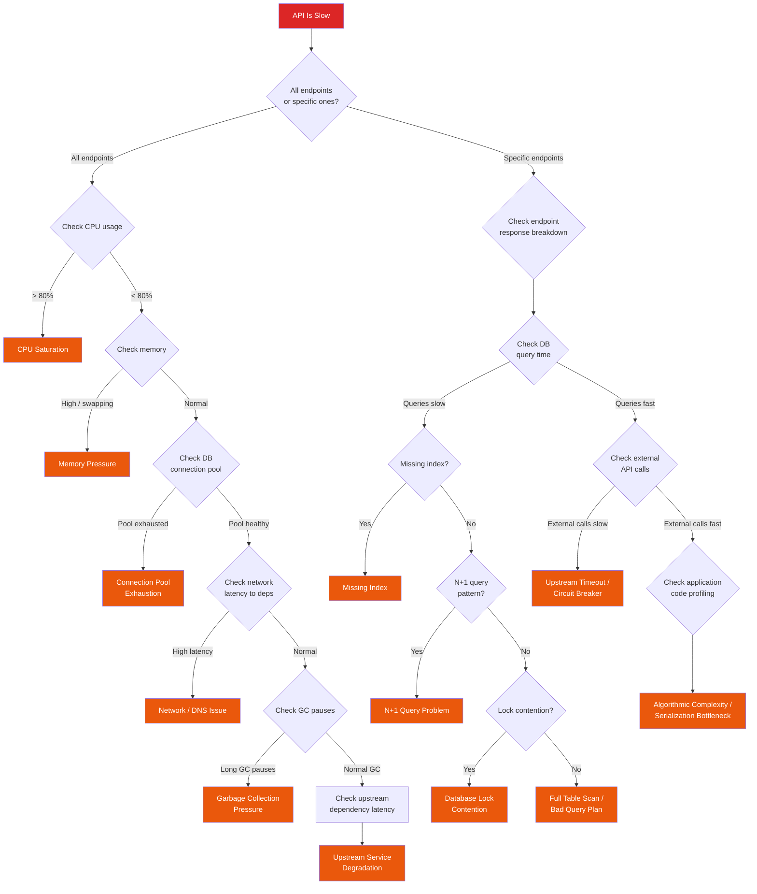

# "API Is Slow" Playbook

You get the alert: p99 latency crossed the threshold, or users are reporting that the app "feels slow." This playbook walks you through systematic diagnosis from symptom to root cause.

## Symptoms

You are here because one or more of the following is true:

- Latency metrics (p50, p95, p99) have increased significantly
- Users are reporting slow page loads or API responses
- Timeout errors are increasing
- The application "works but is unusable"
- SLO for latency is burning error budget faster than expected

::: warning Slow for Everyone vs. Slow for Some
Before diving in, determine scope. If latency is elevated for **all** endpoints, the problem is likely infrastructure-level (CPU, memory, network, database). If only **specific** endpoints are slow, the problem is likely application-level (bad query, missing index, expensive computation). This distinction halves your search space immediately.
:::

## Decision Tree



## Step-by-Step Investigation

### Step 1: Quantify the Problem

Before anything else, understand *how* slow and *since when*.

```bash
# Check p50, p95, p99 latency trends (Prometheus)
# Compare current values to baseline
histogram_quantile(0.50, rate(http_request_duration_seconds_bucket[5m]))
histogram_quantile(0.95, rate(http_request_duration_seconds_bucket[5m]))
histogram_quantile(0.99, rate(http_request_duration_seconds_bucket[5m]))

# Break down by endpoint to find the outliers
histogram_quantile(0.99,
  sum(rate(http_request_duration_seconds_bucket[5m])) by (le, handler)
)

# Check if request rate changed (traffic spike?)
rate(http_requests_total[5m])
```

```bash
# Check when latency started increasing
# Look for the inflection point — overlay with deploy markers
# In Grafana: add annotation query for deployments
```

### Step 2: Check CPU Saturation

```bash
# Current CPU usage
top -b -n1 | head -15

# CPU usage per core over time (Prometheus)
1 - avg by (instance)(rate(node_cpu_seconds_total{mode="idle"}[5m]))

# CPU throttling in Kubernetes (critical for containers)
# If throttled_seconds is increasing, your CPU limits are too low
rate(container_cpu_cfs_throttled_seconds_total[5m])

# Check which processes are consuming CPU
pidstat -u 1 5

# For Java/Node.js — check if it is application code or GC
top -H -p $(pgrep -f your-app)  # thread-level CPU
```

::: tip CPU Throttling Is Invisible Latency
In Kubernetes, a pod can appear to have low CPU usage while being severely throttled. If `container_cpu_cfs_throttled_periods_total` is high relative to `container_cpu_cfs_periods_total`, your CPU *limit* is the bottleneck even though CPU *usage* looks fine. This is the most common false negative in latency diagnosis.
:::

### Step 3: Check Memory and Swap

```bash
# Memory usage
free -h

# Is the system swapping? (any swap usage = potential latency)
vmstat 1 5
# Look at 'si' (swap in) and 'so' (swap out) columns — should be 0

# In Kubernetes
kubectl top pods -n your-namespace | sort -k3 -rn

# Check if pods are approaching their memory limits
kubectl describe pod <pod-name> | grep -A2 "Limits"
kubectl describe pod <pod-name> | grep -A2 "Requests"

# Memory usage as percentage of limit
container_memory_working_set_bytes / container_spec_memory_limit_bytes
```

### Step 4: Check Database Connection Pool

```bash
# Application-side: check pool metrics
# Most connection pools expose these metrics:
# - pool.active    (connections currently in use)
# - pool.idle      (connections available)
# - pool.waiting   (requests waiting for a connection)
# - pool.timeout   (requests that timed out waiting)

# HikariCP (Java) — JMX or Prometheus
hikaricp_connections_active
hikaricp_connections_pending
hikaricp_connections_timeout_total

# Node.js (pg-pool)
# Log pool stats: pool.totalCount, pool.idleCount, pool.waitingCount
```

```sql
-- PostgreSQL: check connection count vs max
SELECT count(*) AS current_connections,
       (SELECT setting::int FROM pg_settings WHERE name = 'max_connections') AS max_connections,
       round(100.0 * count(*) /
         (SELECT setting::int FROM pg_settings WHERE name = 'max_connections'), 1) AS pct_used
FROM pg_stat_activity;

-- Connections by state
SELECT state, count(*)
FROM pg_stat_activity
GROUP BY state
ORDER BY count DESC;

-- Connections by application
SELECT application_name, count(*)
FROM pg_stat_activity
GROUP BY application_name
ORDER BY count DESC;
```

::: danger Connection Pool Exhaustion Cascades Fast
When the pool runs out, new requests queue up. Each queued request holds a thread/goroutine. Those threads consume memory. Memory pressure triggers GC. GC pauses add more latency. More requests queue up. This is a classic cascading failure that can take down the entire service in minutes.
:::

### Step 5: Check Database Query Performance

```sql
-- Find the slowest queries currently running
SELECT pid, now() - query_start AS duration, query, state,
       wait_event_type, wait_event
FROM pg_stat_activity
WHERE state = 'active' AND query NOT LIKE '%pg_stat%'
ORDER BY duration DESC
LIMIT 10;

-- Find queries that are slow on average (pg_stat_statements)
SELECT query,
       calls,
       round(total_exec_time::numeric / calls, 2) AS avg_ms,
       round(total_exec_time::numeric, 2) AS total_ms,
       rows
FROM pg_stat_statements
ORDER BY total_exec_time DESC
LIMIT 20;

-- Check for sequential scans on large tables (missing index indicator)
SELECT relname, seq_scan, seq_tup_read,
       idx_scan, idx_tup_fetch,
       CASE WHEN seq_scan > 0
            THEN round(seq_tup_read::numeric / seq_scan, 0)
            ELSE 0 END AS avg_rows_per_seq_scan
FROM pg_stat_user_tables
WHERE seq_scan > 100
ORDER BY seq_tup_read DESC
LIMIT 10;
```

### Step 6: Detect N+1 Query Patterns

```bash
# Look for repeated similar queries in slow query log
# Classic N+1: one query fetches a list, then N individual queries fetch related data
tail -1000 /var/log/postgresql/postgresql-slow.log \
  | grep -oP 'SELECT.*?FROM \w+' \
  | sort | uniq -c | sort -rn | head -20

# In application logs, look for endpoints that make many DB calls
grep "query" /var/log/app/app.log \
  | grep "$(date +%H:%M)" \
  | awk '{print $NF}' | sort | uniq -c | sort -rn
```

```sql
-- Check for high call count queries (N+1 signature)
SELECT query, calls,
       round(mean_exec_time::numeric, 2) AS avg_ms,
       round(total_exec_time::numeric, 2) AS total_ms
FROM pg_stat_statements
WHERE calls > 1000
  AND query LIKE 'SELECT%'
ORDER BY calls DESC
LIMIT 10;
```

::: tip Spotting N+1 in Distributed Traces
The fastest way to find N+1 queries is to look at a distributed trace (Jaeger, Zipkin) for the slow endpoint. If you see 50+ sequential spans of the same DB query with different parameters, that is N+1.
:::

### Step 7: Check Network Latency to Dependencies

```bash
# DNS resolution time
dig +stats your-database-host | grep "Query time"
dig +stats your-redis-host | grep "Query time"

# TCP connection time to database
curl -o /dev/null -s -w "TCP connect: %{time_connect}s\n" \
  telnet://your-database-host:5432

# Ping latency to critical services
ping -c 5 your-database-host
ping -c 5 your-redis-host
ping -c 5 your-upstream-api-host

# Check for packet loss
mtr -r -c 20 your-database-host
```

### Step 8: Check Garbage Collection

```bash
# Java: GC pause times
# Add to JVM flags: -Xlog:gc*:file=/var/log/gc.log
grep "Pause" /var/log/gc.log | tail -20

# Java: GC metrics via Prometheus
jvm_gc_pause_seconds_sum
jvm_gc_pause_seconds_count
rate(jvm_gc_pause_seconds_sum[5m]) / rate(jvm_gc_pause_seconds_count[5m])

# Node.js: check event loop lag
# If using prom-client:
nodejs_eventloop_lag_seconds

# Node.js: event loop utilization (Node 14+)
# Should be < 0.7 for healthy apps
nodejs_eventloop_utilization

# Go: check GC pause times
go_gc_duration_seconds{quantile="1"}
```

### Step 9: Check Upstream Dependencies

```bash
# Trace a single request end-to-end
# Use your tracing system (Jaeger, Zipkin, Datadog)
# Look for the span that takes the longest

# Manual check: time external API calls
time curl -s -o /dev/null -w "%{time_total}s" https://external-api.com/health

# Check circuit breaker state
# If using Resilience4j, Hystrix, or similar:
# - CLOSED = normal operation
# - OPEN = upstream is down, failing fast
# - HALF_OPEN = testing if upstream recovered
```

### Step 10: Profile Application Code

```bash
# Node.js: CPU profile
node --prof app.js
# Then process with:
node --prof-process isolate-*.log > processed.txt

# Node.js: clinic.js (comprehensive)
npx clinic doctor -- node app.js
npx clinic flame -- node app.js

# Java: async-profiler
./profiler.sh -d 30 -f /tmp/flamegraph.svg <pid>

# Go: pprof
curl -o cpu.prof http://localhost:6060/debug/pprof/profile?seconds=30
go tool pprof -http=:8080 cpu.prof

# Python: py-spy
py-spy record -o profile.svg --pid <pid>
```

## Common Root Causes

| Root Cause | Probability | Key Indicator | Typical Fix Time |
|---|---|---|---|
| Missing database index | 25% | Sequential scans on large tables, specific endpoints slow | 5-15 min |
| N+1 query pattern | 20% | High query count per request, sequential DB spans in traces | 1-4 hours |
| Connection pool exhaustion | 15% | Pool waiting count > 0, connection timeout errors | 15-30 min |
| CPU throttling (K8s) | 12% | High throttled periods, low actual CPU usage | 5 min |
| Upstream dependency slow | 10% | Specific external spans slow in traces | Depends on upstream |
| GC pressure | 8% | Long GC pauses, high heap usage, sawtooth memory pattern | 30-60 min |
| Lock contention (DB) | 5% | Lock wait events in `pg_stat_activity`, specific tables | 15-60 min |
| Network issue | 3% | High ping latency, packet loss, DNS resolution slow | 15-60 min |
| Algorithmic complexity | 2% | CPU-bound on specific endpoints, no DB involvement | 1-8 hours |

## Fixes

### Fix: Missing Index

```sql
-- Identify the slow query
EXPLAIN (ANALYZE, BUFFERS, FORMAT TEXT)
SELECT * FROM orders WHERE customer_id = 12345 AND status = 'pending';
-- Look for "Seq Scan" in the output

-- Create the index
CREATE INDEX CONCURRENTLY idx_orders_customer_status
ON orders (customer_id, status);
-- CONCURRENTLY avoids locking the table during creation

-- Verify the query now uses the index
EXPLAIN (ANALYZE, BUFFERS, FORMAT TEXT)
SELECT * FROM orders WHERE customer_id = 12345 AND status = 'pending';
-- Should now show "Index Scan" or "Index Only Scan"
```

::: warning Indexes Are Not Free
Every index slows down writes and consumes disk space. Do not blindly add indexes — use `EXPLAIN ANALYZE` to confirm the index will actually be used by the query planner.
:::

### Fix: N+1 Query

```python
# BEFORE: N+1 (1 query for orders + N queries for customers)
orders = db.query("SELECT * FROM orders WHERE date > ?", [today])
for order in orders:
    customer = db.query("SELECT * FROM customers WHERE id = ?", [order.customer_id])
    # process...

# AFTER: Eager loading / JOIN (2 queries or 1 join)
orders = db.query("""
    SELECT o.*, c.name, c.email
    FROM orders o
    JOIN customers c ON c.id = o.customer_id
    WHERE o.date > ?
""", [today])

# OR: Batch loading
orders = db.query("SELECT * FROM orders WHERE date > ?", [today])
customer_ids = [o.customer_id for o in orders]
customers = db.query("SELECT * FROM customers WHERE id = ANY(?)", [customer_ids])
customer_map = {c.id: c for c in customers}
```

### Fix: Connection Pool Exhaustion

```yaml
# Increase pool size (but not blindly — each connection uses ~10MB on PostgreSQL)
# Rule of thumb: pool_size = (2 * num_cpu_cores) + num_disks
# For most cloud databases: 20-50 connections per application instance

# HikariCP (Java)
spring:
  datasource:
    hikari:
      maximum-pool-size: 30
      minimum-idle: 10
      connection-timeout: 5000   # Fail fast instead of waiting forever
      idle-timeout: 300000
      max-lifetime: 900000

# Node.js pg-pool
pool:
  max: 20
  min: 5
  idleTimeoutMillis: 30000
  connectionTimeoutMillis: 5000
```

```sql
-- If the database itself is running out of connections:
-- Check current usage
SELECT count(*) FROM pg_stat_activity;

-- Check max_connections setting
SHOW max_connections;

-- If needed (requires restart):
ALTER SYSTEM SET max_connections = 200;

-- Better: use PgBouncer as a connection pooler
-- PgBouncer can multiplex thousands of app connections
-- into a much smaller number of actual DB connections
```

### Fix: CPU Throttling in Kubernetes

```yaml
# Option 1: Increase CPU limits
resources:
  requests:
    cpu: "500m"
    memory: "512Mi"
  limits:
    cpu: "2000m"    # Was 1000m — doubled
    memory: "512Mi"

# Option 2: Remove CPU limits entirely (controversial but effective)
# Google's recommendation: set CPU requests, remove CPU limits
# This prevents throttling while still allowing fair scheduling
resources:
  requests:
    cpu: "500m"
    memory: "512Mi"
  limits:
    # cpu: removed intentionally
    memory: "512Mi"
```

### Fix: GC Pressure

```bash
# Java: Increase heap and tune GC
# Switch to G1GC or ZGC for lower pause times
JAVA_OPTS="-Xmx4g -Xms4g -XX:+UseZGC -XX:+ZGenerational"

# Java: Reduce allocation rate
# Profile with jfr to find hot allocation sites
jcmd <pid> JFR.start duration=60s filename=/tmp/recording.jfr
```

```javascript
// Node.js: Increase old space size
// Default is ~1.4GB — increase if your app needs more
// node --max-old-space-size=4096 app.js

// Reduce allocation: reuse objects, avoid unnecessary copies
// BEFORE: creates new array every time
function getActiveUsers(users) {
  return users.filter(u => u.active).map(u => u.id);
}

// AFTER: single pass, pre-allocated
function getActiveUsers(users) {
  const result = [];
  for (let i = 0; i < users.length; i++) {
    if (users[i].active) result.push(users[i].id);
  }
  return result;
}
```

### Fix: Upstream Dependency Slow

::: code-group

```javascript
// Add timeouts and circuit breakers to all external calls
const circuitBreaker = new CircuitBreaker(callExternalAPI, {
  timeout: 3000,           // 3 second timeout
  errorThresholdPercentage: 50,  // Open circuit at 50% errors
  resetTimeout: 30000,     // Try again after 30 seconds
});

// Add a fallback
circuitBreaker.fallback(() => {
  return cachedResponse || defaultResponse;
});
```

```go
// Go: context with timeout
ctx, cancel := context.WithTimeout(context.Background(), 3*time.Second)
defer cancel()

resp, err := httpClient.Do(req.WithContext(ctx))
if err != nil {
    // Use cached/default response
    return fallbackResponse, nil
}
```

:::

## Prevention

### Monitoring That Catches This Early

```yaml
# Prometheus alerting rules
groups:
  - name: api-latency
    rules:
      - alert: HighP99Latency
        expr: |
          histogram_quantile(0.99,
            sum(rate(http_request_duration_seconds_bucket[5m])) by (le, service)
          ) > 2.0
        for: 5m
        labels:
          severity: warning
        annotations:
          summary: "p99 latency above 2s for {​{ $labels.service }}"

      - alert: ConnectionPoolNearExhaustion
        expr: |
          hikaricp_connections_active / hikaricp_connections_max > 0.8
        for: 2m
        labels:
          severity: warning
        annotations:
          summary: "Connection pool >80% utilized for {​{ $labels.service }}"

      - alert: CPUThrottling
        expr: |
          rate(container_cpu_cfs_throttled_periods_total[5m])
          / rate(container_cpu_cfs_periods_total[5m]) > 0.25
        for: 5m
        labels:
          severity: warning
        annotations:
          summary: "CPU throttling >25% for {​{ $labels.pod }}"
```

### Architecture Patterns

| Pattern | What It Prevents | Implementation Cost |
|---|---|---|
| Connection pooling with PgBouncer | Connection exhaustion | Low |
| Read replicas | Single DB bottleneck | Medium |
| Response caching (Redis) | Redundant computation | Medium |
| Circuit breakers on all external calls | Upstream cascade | Low |
| Query result pagination | Full table scans | Low |
| Background processing for heavy work | Request-path bottlenecks | Medium |
| CDN for static assets | Origin server load | Low |
| Database query review in CI | Missing indexes, N+1 | Medium |

### Development Practices

1. **Load test before release.** Use tools like k6, Locust, or Gatling to simulate production load patterns. Focus on realistic scenarios, not just throughput.
2. **Add `EXPLAIN ANALYZE` to your code review checklist.** Every new query that touches a table with >10k rows should have an explain plan reviewed.
3. **Set timeouts on everything.** Database queries, HTTP calls, cache operations. No call should be allowed to block indefinitely.
4. **Monitor connection pool metrics.** Add dashboards for pool utilization, waiting count, and timeout count. Alert when waiting count > 0.
5. **Profile in staging.** Run CPU and memory profiles against staging with production-like load before deploying to production.

## Cross-References

- [Database CPU at 100%](/debugging-playbooks/database-cpu) --- When the DB itself is the bottleneck
- [Memory Keeps Growing](/debugging-playbooks/memory-leak) --- When memory pressure is causing latency
- [Intermittent 502s](/debugging-playbooks/intermittent-502) --- When slowness escalates to failures
- [Caching Strategies](/system-design/distributed-systems/caching-strategies) --- Using caches to reduce latency
- [Connection Pooling](/system-design/databases/connection-pooling) --- Database connection management
- [Circuit Breaker](/system-design/distributed-systems/circuit-breaker) --- Protecting against slow dependencies
