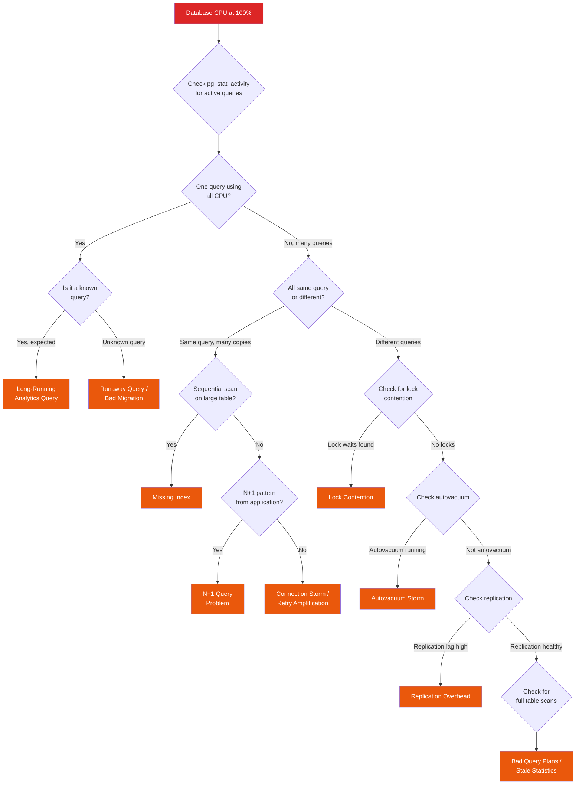

# "Database CPU at 100%" Playbook

Your database monitoring just fired: CPU is pegged at 100% and climbing. Queries are queueing up, application response times are spiking, and your connection pool is filling fast. This is one of the highest-urgency production problems because the database is usually the single point of failure. Everything downstream depends on it.

This playbook focuses on **PostgreSQL** but the diagnostic approach applies to MySQL, MariaDB, and other relational databases with equivalent commands.

## Symptoms

You are here because one or more of the following is true:

- Database CPU utilization is at or near 100%
- Application queries are timing out or returning errors
- Connection pool is exhausted (all connections in use, requests waiting)
- `pg_stat_activity` shows dozens or hundreds of active queries
- Replication lag is increasing on replicas
- Application latency has spiked across all endpoints that hit the database

::: warning CPU vs. I/O
Verify the bottleneck is actually CPU, not I/O. If `iowait` is high, the database is waiting on disk, not computation. The fix is completely different — you need faster storage, more memory for caching, or better query plans that read fewer pages. Check with `iostat -x 1 5` or `top` (look at the `%wa` column).
:::

## Decision Tree



## Step-by-Step Investigation

### Step 1: Get the Lay of the Land

```sql
-- How many connections? What state are they in?
SELECT state, count(*), avg(now() - query_start) AS avg_duration
FROM pg_stat_activity
WHERE backend_type = 'client backend'
GROUP BY state
ORDER BY count DESC;

-- Expected healthy output:
-- idle         | 45 | ...
-- active       | 5  | 00:00:00.012
-- idle in tx   | 2  | 00:00:01.234

-- Dangerous output:
-- active       | 150 | 00:00:05.678  ← Many active queries, high avg duration
-- idle in tx   | 50  | 00:02:34.567  ← Abandoned transactions holding locks
```

```sql
-- What's actually running right now?
SELECT pid, now() - query_start AS duration,
       state, wait_event_type, wait_event,
       left(query, 100) AS query_preview
FROM pg_stat_activity
WHERE state = 'active'
  AND query NOT LIKE '%pg_stat%'
ORDER BY duration DESC
LIMIT 20;
```

### Step 2: Find the CPU-Consuming Queries

```sql
-- pg_stat_statements: top queries by total CPU time
-- (requires pg_stat_statements extension)
SELECT
    left(query, 80) AS query,
    calls,
    round(total_exec_time::numeric, 0) AS total_ms,
    round(mean_exec_time::numeric, 2) AS avg_ms,
    round((total_exec_time / sum(total_exec_time) OVER()) * 100, 1) AS pct_total,
    rows
FROM pg_stat_statements
ORDER BY total_exec_time DESC
LIMIT 15;
```

```sql
-- Find queries with high CPU per execution
SELECT
    left(query, 100) AS query,
    calls,
    round(mean_exec_time::numeric, 2) AS avg_ms,
    round((shared_blks_hit + shared_blks_read)::numeric / NULLIF(calls, 0), 0) AS avg_blocks,
    rows / NULLIF(calls, 0) AS avg_rows
FROM pg_stat_statements
WHERE calls > 10
ORDER BY mean_exec_time DESC
LIMIT 15;
```

::: tip The Pareto Principle of Database CPU
In most production databases, 2-3 queries are responsible for 80%+ of total CPU time. Find them with `pg_stat_statements` sorted by `total_exec_time` and you have found your targets. The query at the top of the list is almost always the one to fix first.
:::

### Step 3: Check for Sequential Scans (Missing Indexes)

```sql
-- Tables with high sequential scan activity
SELECT
    schemaname, relname,
    seq_scan, seq_tup_read,
    idx_scan, idx_tup_fetch,
    CASE WHEN (seq_scan + idx_scan) > 0
         THEN round(100.0 * seq_scan / (seq_scan + idx_scan), 1)
         ELSE 0 END AS seq_pct,
    pg_size_pretty(pg_total_relation_size(relid)) AS table_size,
    n_live_tup AS row_count
FROM pg_stat_user_tables
WHERE seq_scan > 0
  AND n_live_tup > 10000
ORDER BY seq_tup_read DESC
LIMIT 15;

-- A table with 1M rows, seq_pct > 50%, and high seq_tup_read
-- is almost certainly missing an index for a common query pattern
```

```sql
-- Get the actual query plan for a suspect query
EXPLAIN (ANALYZE, BUFFERS, FORMAT TEXT)
-- paste the slow query here

-- Look for these red flags in the output:
-- "Seq Scan on large_table"  (should be Index Scan)
-- "Rows Removed by Filter: 999000" (reading 1M rows to return 1000)
-- "Sort Method: external merge Disk" (not enough work_mem)
-- "Nested Loop" with high row counts (possible N+1 at DB level)
```

### Step 4: Check for Lock Contention

```sql
-- Find blocked queries and what is blocking them
SELECT
    blocked.pid AS blocked_pid,
    blocked.query AS blocked_query,
    now() - blocked.query_start AS blocked_duration,
    blocking.pid AS blocking_pid,
    blocking.query AS blocking_query,
    now() - blocking.query_start AS blocking_duration
FROM pg_stat_activity blocked
JOIN pg_locks blocked_locks ON blocked.pid = blocked_locks.pid
JOIN pg_locks blocking_locks ON blocked_locks.locktype = blocking_locks.locktype
    AND blocked_locks.relation = blocking_locks.relation
    AND blocked_locks.pid != blocking_locks.pid
    AND blocking_locks.granted
JOIN pg_stat_activity blocking ON blocking_locks.pid = blocking.pid
WHERE NOT blocked_locks.granted
ORDER BY blocked_duration DESC;
```

```sql
-- Simplified: just show locks and waiters
SELECT
    pg_blocking_pids(pid) AS blocked_by,
    pid,
    state,
    wait_event_type,
    wait_event,
    left(query, 80) AS query,
    now() - query_start AS duration
FROM pg_stat_activity
WHERE cardinality(pg_blocking_pids(pid)) > 0
ORDER BY duration DESC;
```

::: danger Long-Running Transactions Kill Performance
A transaction that has been open for hours (state = `idle in transaction`) holds locks that block other transactions. Those blocked transactions queue up, consuming connections. When the connection pool fills, the application starts timing out. One forgotten transaction can cascade into a full outage.
:::

### Step 5: Check Autovacuum Activity

```sql
-- Is autovacuum running? What is it doing?
SELECT pid, datname, relid::regclass AS table_name,
       phase, heap_blks_total, heap_blks_scanned, heap_blks_vacuumed,
       now() - xact_start AS duration
FROM pg_stat_progress_vacuum;

-- Are any tables badly in need of vacuum?
SELECT relname,
       n_dead_tup,
       n_live_tup,
       round(100.0 * n_dead_tup / NULLIF(n_live_tup + n_dead_tup, 0), 1) AS dead_pct,
       last_autovacuum,
       last_autoanalyze
FROM pg_stat_user_tables
WHERE n_dead_tup > 10000
ORDER BY n_dead_tup DESC
LIMIT 10;

-- Check autovacuum settings
SELECT name, setting, unit
FROM pg_settings
WHERE name LIKE 'autovacuum%'
ORDER BY name;
```

### Step 6: Check Replication Status

```sql
-- On primary: check replication slots and lag
SELECT
    slot_name,
    active,
    pg_size_pretty(pg_wal_lsn_diff(pg_current_wal_lsn(), confirmed_flush_lsn)) AS lag
FROM pg_replication_slots;

-- On primary: check streaming replication status
SELECT
    client_addr,
    state,
    sent_lsn,
    write_lsn,
    flush_lsn,
    replay_lsn,
    pg_size_pretty(pg_wal_lsn_diff(sent_lsn, replay_lsn)) AS replay_lag,
    now() - backend_start AS connection_age
FROM pg_stat_replication;

-- On replica: check how far behind we are
SELECT now() - pg_last_xact_replay_timestamp() AS replay_lag;
```

### Step 7: Check for Connection Storms

```sql
-- Connections opened recently (storm indicator)
SELECT count(*),
       date_trunc('minute', backend_start) AS minute
FROM pg_stat_activity
GROUP BY minute
ORDER BY minute DESC
LIMIT 10;

-- Connections by client IP (identify the source)
SELECT client_addr, count(*) AS connections
FROM pg_stat_activity
WHERE client_addr IS NOT NULL
GROUP BY client_addr
ORDER BY connections DESC
LIMIT 10;

-- Connections by application name
SELECT application_name, count(*),
       count(*) FILTER (WHERE state = 'active') AS active,
       count(*) FILTER (WHERE state = 'idle') AS idle,
       count(*) FILTER (WHERE state = 'idle in transaction') AS idle_in_tx
FROM pg_stat_activity
WHERE backend_type = 'client backend'
GROUP BY application_name
ORDER BY count DESC;
```

### Step 8: Check for Bad Query Plans (Stale Statistics)

```sql
-- Check when statistics were last updated
SELECT relname, last_analyze, last_autoanalyze,
       n_live_tup, n_mod_since_analyze
FROM pg_stat_user_tables
WHERE n_mod_since_analyze > n_live_tup * 0.1
ORDER BY n_mod_since_analyze DESC
LIMIT 10;

-- Force statistics update on a specific table
ANALYZE verbose your_table;

-- Check if query plan changes after ANALYZE
EXPLAIN (ANALYZE, BUFFERS)
SELECT ... -- your problematic query
```

## Common Root Causes

| Root Cause | Probability | Key Indicator | Urgency |
|---|---|---|---|
| Missing index → sequential scan | 30% | `seq_scan` high on large table, `Seq Scan` in EXPLAIN | High — fix in minutes |
| Runaway/unoptimized query | 20% | Single query in `pg_stat_activity` running for minutes/hours | Critical — kill immediately |
| N+1 queries from application | 15% | Same query repeated thousands of times in `pg_stat_statements` | High — app code change |
| Lock contention | 10% | `wait_event_type = 'Lock'` in `pg_stat_activity` | Critical — find and resolve blocker |
| Connection storm / retry amplification | 8% | Connection count spiking, many short-lived connections | Critical — throttle connections |
| Autovacuum on large table | 7% | Vacuum process visible in `pg_stat_progress_vacuum` | Medium — usually self-resolving |
| Stale statistics → bad plans | 5% | `n_mod_since_analyze` >> 10% of `n_live_tup` | Medium — run ANALYZE |
| Replication overhead | 3% | High WAL generation, replication slot lag | Medium — architectural |
| Disk I/O saturated (not CPU) | 2% | High `iowait`, low CPU user/sys | High — different fix path |

## Fixes

### Fix: Kill the Runaway Query (Immediate Relief)

```sql
-- First, identify the culprit PID
SELECT pid, now() - query_start AS duration, left(query, 200)
FROM pg_stat_activity
WHERE state = 'active'
ORDER BY duration DESC
LIMIT 5;

-- Cancel the query gracefully (sends SIGINT)
SELECT pg_cancel_backend(<pid>);

-- If cancel doesn't work within 5 seconds, terminate forcefully
SELECT pg_terminate_backend(<pid>);

-- Nuclear option: kill ALL long-running queries (use with caution)
SELECT pg_cancel_backend(pid)
FROM pg_stat_activity
WHERE state = 'active'
  AND now() - query_start > interval '5 minutes'
  AND query NOT LIKE '%pg_stat%'
  AND query NOT LIKE '%pg_cancel%';
```

::: danger pg_terminate_backend vs pg_cancel_backend
`pg_cancel_backend` cancels the current query but keeps the connection alive. `pg_terminate_backend` kills the entire connection — the client will see an error and need to reconnect. Always try `cancel` first. Use `terminate` only if the backend is stuck in a non-cancellable state.
:::

### Fix: Add Missing Index

```sql
-- Identify the columns that need indexing from the slow query
-- Example: SELECT * FROM orders WHERE customer_id = ? AND status = ?

-- Create index without locking the table
CREATE INDEX CONCURRENTLY idx_orders_customer_status
ON orders (customer_id, status);

-- For queries with ORDER BY, consider including the sort column
CREATE INDEX CONCURRENTLY idx_orders_customer_date
ON orders (customer_id, created_at DESC);

-- For queries that only need a few columns, use a covering index
CREATE INDEX CONCURRENTLY idx_orders_covering
ON orders (customer_id, status)
INCLUDE (total_amount, created_at);

-- Verify the index is being used
EXPLAIN (ANALYZE, BUFFERS)
SELECT * FROM orders WHERE customer_id = 12345 AND status = 'pending';
```

### Fix: Resolve Lock Contention

```sql
-- Find the blocking transaction
SELECT blocking.pid, blocking.query,
       now() - blocking.query_start AS blocking_duration,
       blocking.state
FROM pg_stat_activity blocked
JOIN pg_stat_activity blocking
  ON blocking.pid = ANY(pg_blocking_pids(blocked.pid))
WHERE NOT EXISTS (
  SELECT 1 FROM pg_stat_activity b2
  WHERE b2.pid = ANY(pg_blocking_pids(blocking.pid))
)
LIMIT 5;  -- This gives you the ROOT blockers

-- If the blocking transaction is idle in transaction, kill it
-- (it is probably an abandoned transaction from a crashed client)
SELECT pg_terminate_backend(<blocking_pid>);

-- Prevent future long-running idle transactions
ALTER SYSTEM SET idle_in_transaction_session_timeout = '5min';
SELECT pg_reload_conf();
```

### Fix: Tune Autovacuum

```sql
-- If autovacuum is consuming too much CPU, throttle it
ALTER SYSTEM SET autovacuum_vacuum_cost_delay = 20;  -- ms between bursts
ALTER SYSTEM SET autovacuum_vacuum_cost_limit = 200;  -- work per burst
SELECT pg_reload_conf();

-- For specific high-churn tables, tune autovacuum per-table
ALTER TABLE high_churn_table SET (
  autovacuum_vacuum_scale_factor = 0.01,  -- vacuum at 1% dead tuples
  autovacuum_analyze_scale_factor = 0.005,
  autovacuum_vacuum_cost_delay = 10
);

-- If the table has never been vacuumed and is full of dead tuples:
-- Run a manual vacuum (won't block reads, but will use CPU)
VACUUM (VERBOSE) your_table;

-- If the table has severe bloat, consider VACUUM FULL
-- WARNING: VACUUM FULL locks the table exclusively — schedule during maintenance
```

### Fix: Connection Storm

```sql
-- Immediate: set a connection limit per database
ALTER DATABASE your_db CONNECTION LIMIT 100;

-- Set a connection limit per user/role
ALTER ROLE app_user CONNECTION LIMIT 50;

-- Better long-term: deploy PgBouncer
-- PgBouncer config (pgbouncer.ini):
-- [databases]
-- your_db = host=localhost port=5432 dbname=your_db
--
-- [pgbouncer]
-- pool_mode = transaction
-- max_client_conn = 1000
-- default_pool_size = 30
-- reserve_pool_size = 5
```

### Fix: Stale Statistics

```sql
-- Update statistics on all tables
ANALYZE;

-- Update statistics on a specific table with verbose output
ANALYZE VERBOSE your_table;

-- If the planner is making bad choices despite good stats,
-- check these settings:
SHOW random_page_cost;     -- default 4.0, set to 1.1 for SSDs
SHOW effective_cache_size; -- should be ~75% of total RAM
SHOW work_mem;             -- increase for complex sorts/joins

-- Tune for SSDs (most cloud databases)
ALTER SYSTEM SET random_page_cost = 1.1;
ALTER SYSTEM SET effective_io_concurrency = 200;
SELECT pg_reload_conf();
```

## Prevention

### Monitoring Queries

```yaml
# Prometheus alerting rules for PostgreSQL
groups:
  - name: postgresql-cpu
    rules:
      - alert: PostgreSQLCPUHigh
        expr: |
          rate(process_cpu_seconds_total{job="postgresql"}[5m]) > 0.9
        for: 5m
        labels:
          severity: critical
        annotations:
          summary: "PostgreSQL CPU >90% for {​{ $labels.instance }}"

      - alert: PostgreSQLLongQuery
        expr: |
          pg_stat_activity_max_tx_duration{datname!~"template.*"} > 300
        for: 1m
        labels:
          severity: warning
        annotations:
          summary: "Query running >5min on {​{ $labels.datname }}"

      - alert: PostgreSQLHighConnections
        expr: |
          sum(pg_stat_activity_count) by (instance)
          / pg_settings_max_connections > 0.8
        for: 5m
        labels:
          severity: warning
        annotations:
          summary: "Connection usage >80% on {​{ $labels.instance }}"

      - alert: PostgreSQLDeadTuples
        expr: |
          pg_stat_user_tables_n_dead_tup > 1000000
        for: 30m
        labels:
          severity: warning
        annotations:
          summary: "Table {​{ $labels.relname }} has >1M dead tuples"
```

### Database Configuration Checklist

| Setting | Default | Recommended | Why |
|---|---|---|---|
| `shared_buffers` | 128MB | 25% of RAM | More data cached in memory |
| `effective_cache_size` | 4GB | 75% of RAM | Helps planner choose index scans |
| `work_mem` | 4MB | 64-256MB | Prevents disk-based sorts |
| `random_page_cost` | 4.0 | 1.1 (SSD) | Accurate cost estimates for SSDs |
| `max_connections` | 100 | 200 (with PgBouncer) | Prevent connection exhaustion |
| `statement_timeout` | 0 (off) | 30s | Kill runaway queries automatically |
| `idle_in_transaction_session_timeout` | 0 (off) | 5min | Kill abandoned transactions |
| `log_min_duration_statement` | -1 (off) | 1000 (ms) | Log slow queries for analysis |

### Development Practices

1. **Every migration must include `EXPLAIN ANALYZE` results** for all new queries touching tables with >10k rows.
2. **Use `CREATE INDEX CONCURRENTLY`** — never use plain `CREATE INDEX` on production tables, it locks the entire table.
3. **Add `statement_timeout`** to application database connections as a safety net.
4. **Run `pg_stat_statements` analysis weekly** to catch slow-burning query problems before they become crises.
5. **Deploy PgBouncer** between your application and database from day one. It costs nothing and prevents connection storms.
6. **Set up continuous EXPLAIN monitoring** with tools like auto_explain, pgMustard, or Datadog's Database Monitoring.

### Query Review Checklist

```markdown
Before merging any PR that changes database queries:

- [ ] EXPLAIN ANALYZE shows Index Scan, not Seq Scan, on tables > 10k rows
- [ ] No N+1 patterns (use JOINs or batch loading)
- [ ] Query has a WHERE clause or LIMIT (no unbounded full-table reads)
- [ ] Transactions are short-lived (< 1 second ideally)
- [ ] New indexes are created with CONCURRENTLY
- [ ] Query is tested with production-scale data volume
- [ ] Connection timeout is set on the query/transaction
```

## Cross-References

- [API Is Slow](/debugging-playbooks/api-slow) --- When database CPU is causing application latency
- [Pods Keep Restarting](/debugging-playbooks/pods-restarting) --- Database connection failures crash app pods
- [PostgreSQL Internals](/data-engineering/postgresql-internals) --- Deep dive into how PostgreSQL works
- [Database Scaling](/system-design/databases/database-scaling) --- When one database is no longer enough
- [Connection Pooling](/system-design/databases/connection-pooling) --- PgBouncer and connection management
