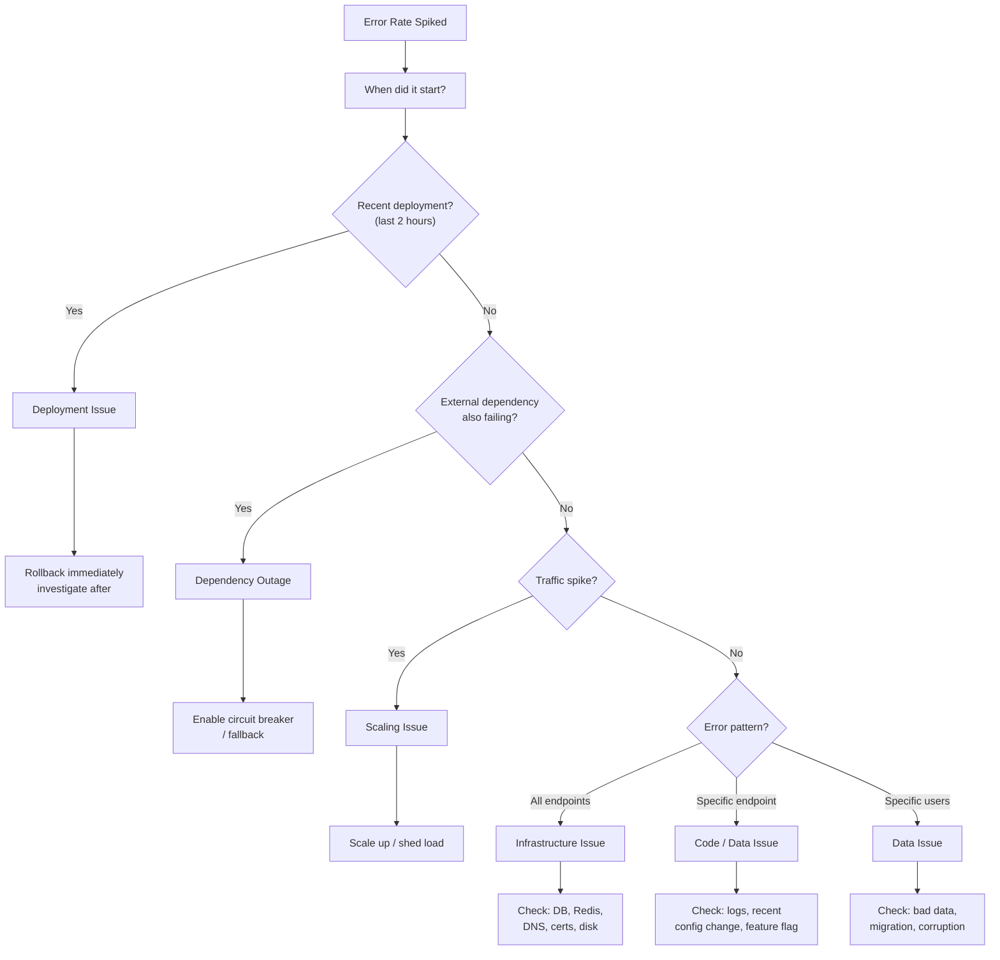

# "Error Rate Spiked" Playbook

Your error rate alert just fired. Errors jumped from 0.1% to 5%. Users are seeing 500s. Here's exactly how to find the cause.

## Symptoms

- Error rate dashboard shows spike
- PagerDuty/OpsGenie alert fired
- Users reporting errors, support tickets incoming
- Possibly affecting revenue

## Decision Tree



## Step-by-Step Investigation

### Step 1: Correlate with time (30 seconds)

```bash
# When exactly did errors start?
# Check your monitoring dashboard (Grafana, Datadog)
# Look for the exact timestamp of the inflection point
```

**Key question**: Does the error spike correlate with:
- A deployment? → **Go to Step 2a**
- A traffic spike? → **Go to Step 2b**
- Nothing obvious? → **Go to Step 2c**

### Step 2a: Deployment-Related

If errors started right after a deploy:

```bash
# What was deployed?
git log --oneline -10

# Who deployed?
kubectl rollout history deployment/api-server

# Rollback immediately — investigate AFTER service is restored
kubectl rollout undo deployment/api-server
```

::: danger Rollback first, debug second
If errors correlate with a deployment, rollback immediately. You can always redeploy after fixing. Every minute of investigation is a minute of user impact.
:::

**After rollback**, diff the deployment:
```bash
git diff HEAD~1 HEAD -- src/
```

Common deployment causes:
| Cause | How to spot it |
|-------|---------------|
| Bad code | Errors in new code paths, stack traces point to changed files |
| Missing env var | `undefined` errors, config-related failures |
| Missing migration | Database errors, column not found |
| Dependency version | Package update broke API contract |
| Feature flag enabled | New feature path has bugs |

### Step 2b: Traffic-Related

```bash
# Check current QPS vs normal
curl -s 'http://prometheus:9090/api/v1/query?query=rate(http_requests_total[5m])' | jq

# Is it organic growth or attack?
# Check by IP distribution
kubectl logs -l app=api --tail=1000 | awk '{print $1}' | sort | uniq -c | sort -rn | head -20
```

If traffic spike:
- **Organic**: Scale up, add more pods/instances
- **Attack/bot**: Enable rate limiting, block IPs, activate WAF rules
- **Retry storm**: Clients retrying → exponential backoff, circuit breaker

### Step 2c: No Obvious Trigger

Check these in order:

```bash
# 1. Which endpoints are failing?
# Grafana query: rate of 5xx by endpoint
# sum by (path) (rate(http_requests_total{status=~"5.."}[5m]))

# 2. What error codes?
# 500 = server bug, 502 = upstream down, 503 = overloaded, 504 = timeout

# 3. Check application logs
kubectl logs -l app=api --tail=500 | grep -i "error\|exception\|fatal"

# 4. Check external dependencies
curl -o /dev/null -s -w "%{http_code} %{time_total}s\n" https://payment-api.example.com/health
curl -o /dev/null -s -w "%{http_code} %{time_total}s\n" https://email-api.example.com/health
```

### Step 3: Check Infrastructure

```bash
# Database
psql -c "SELECT count(*) FROM pg_stat_activity WHERE state = 'active';"
psql -c "SELECT pid, now() - pg_stat_activity.query_start AS duration, query FROM pg_stat_activity WHERE state != 'idle' ORDER BY duration DESC LIMIT 5;"

# Redis
redis-cli info memory | grep used_memory_human
redis-cli info clients | grep connected_clients

# Disk space
df -h
kubectl exec -it pod/api-0 -- df -h

# DNS
dig api.internal.example.com +short +time=2

# TLS certificates
echo | openssl s_client -connect api.example.com:443 2>/dev/null | openssl x509 -noout -enddate
```

### Step 4: Check for Data Issues

```sql
-- Recent data changes?
SELECT schemaname, relname, last_autovacuum, last_autoanalyze
FROM pg_stat_user_tables
ORDER BY last_autovacuum DESC NULLS LAST
LIMIT 10;

-- Any locked tables?
SELECT relation::regclass, mode, granted
FROM pg_locks
WHERE NOT granted;

-- Bad data causing application errors?
SELECT count(*), error_message
FROM application_errors
WHERE created_at > now() - interval '1 hour'
GROUP BY error_message
ORDER BY count DESC
LIMIT 10;
```

## Common Root Causes

| Cause | Probability | How to confirm | Fix |
|-------|-------------|---------------|-----|
| Bad deployment | 35% | Errors start exactly at deploy time | Rollback |
| Dependency outage | 25% | Health checks failing on upstream | Circuit breaker, fallback |
| Database issue | 15% | Slow queries, connection pool exhausted | Kill queries, scale connections |
| Certificate expiry | 5% | TLS errors in logs | Renew cert |
| Disk full | 5% | `df -h` shows 100% | Clean up, expand volume |
| DNS issue | 5% | Resolution failures in logs | Check DNS, restart CoreDNS |
| Config change | 5% | Feature flag, env var changed | Revert config |
| Data corruption | 3% | Specific records causing errors | Fix data, add validation |
| Rate limiting | 2% | 429 responses from upstream | Increase limits, add caching |

## Prevention

- **Canary deployments** — Catch bad deploys before they hit 100% traffic
- **Health check endpoints** — Detect dependency failures early
- **Circuit breakers** — Prevent cascade failures
- **Error budget alerts** — Alert before SLO is breached, not after
- **Pre-deploy smoke tests** — Catch obvious issues before production
- **Feature flags** — Deploy dark, enable gradually
- **Dependency health dashboard** — Single pane of glass for all upstreams

## Further Reading

- [Circuit Breaker Pattern](/system-design/distributed-systems/circuit-breaker)
- [Deployment Strategies](/devops/deployment-strategies/)
- [SLI / SLO / SLA](/devops/sre/sli-slo-sla)
- [Service Degradation Runbook](/devops/runbooks/service-degradation)
- [DDoS Response Runbook](/devops/runbooks/ddos-response)
