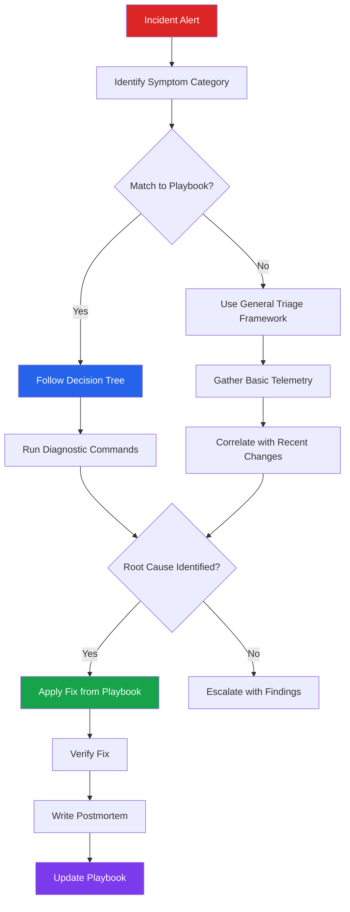
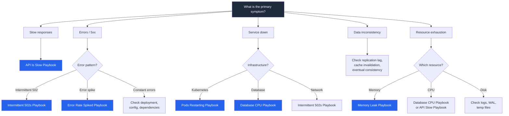
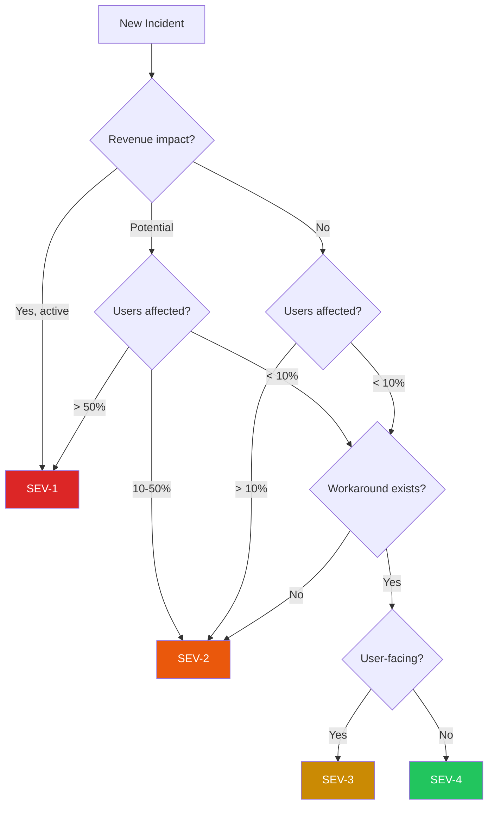

# Debugging Playbooks

Production incidents do not wait for you to think clearly. They happen at 2 AM on a Friday, during a product launch, while half the team is on vacation. The difference between a 10-minute fix and a 4-hour disaster is not how smart you are under pressure. It is whether you have a **system** for diagnosis.

These playbooks are **decision trees** — structured, repeatable paths from symptom to root cause. They encode the diagnostic intuition that senior engineers develop over years of on-call rotations, compressed into flowcharts you can follow even when your brain is running on caffeine and adrenaline.

## Why Playbooks

There are three reasons debugging playbooks exist:

1. **Cognitive load is the enemy.** Under stress, human working memory drops from ~7 items to ~3. A playbook offloads the diagnostic process from your brain to a document, freeing you to focus on the specifics of *this* incident.
2. **Knowledge transfer is slow.** The senior SRE who can diagnose a memory leak in 5 minutes has 10 years of pattern matching in their head. A playbook captures those patterns so a junior engineer can follow the same diagnostic path.
3. **Consistency beats heroics.** When every engineer follows the same diagnostic tree, you get consistent incident response times regardless of who is on call. No more praying that the "good debugger" is online.

::: tip Playbooks Are Living Documents
Every time you debug a production issue and discover a diagnostic path not covered here, **add it**. The best playbooks are written in the aftermath of incidents, while the pain is fresh.
:::

## How to Use These Playbooks

Every playbook in this section follows the same structure:

```
1. Symptoms       → What you are seeing (alerts, user reports, metrics)
2. Decision Tree  → Mermaid flowchart of diagnostic steps
3. Investigation  → Commands, queries, and tools for each branch
4. Root Causes    → Table of causes ranked by probability
5. Fixes          → Specific remediation for each root cause
6. Prevention     → How to never see this problem again
```

### The Process



## Triage Framework

Before diving into any specific playbook, run through this triage framework. It takes 60 seconds and ensures you are looking at the right problem.

### Step 1: Scope the Impact

| Question | How to Answer | Why It Matters |
|---|---|---|
| Who is affected? | Check error rates by user segment, region, or tenant | Determines severity and blast radius |
| What percentage of traffic? | Compare error rate to total request rate | 1% vs 100% changes everything |
| Which services? | Check service mesh dashboard or dependency graph | Narrows the search space |
| When did it start? | Overlay metrics with deploy timeline | Correlation with changes |
| Is it getting worse? | Look at trend over last 15 minutes | Determines urgency of response |

### Step 2: Classify the Symptom



### Step 3: Establish the Timeline

The single most valuable debugging technique is **correlating the symptom with what changed**.

```bash
# When did the symptom start? (Prometheus example)
# Look for the inflection point in error rate
rate(http_requests_total{status=~"5.."}[1m])

# What deployed around that time?
kubectl get events --sort-by='.lastTimestamp' | tail -20

# Any config changes?
git log --since="2 hours ago" --oneline -- '*.yaml' '*.json' '*.env'

# Any infrastructure changes?
# Check Terraform/Pulumi history, cloud provider activity log
aws cloudtrail lookup-events \
  --start-time "$(date -u -d '2 hours ago' +%Y-%m-%dT%H:%M:%SZ)" \
  --max-results 20
```

::: warning The Five-Minute Rule
If you have been staring at the problem for 5 minutes without a hypothesis, **stop and widen your search**. You are probably looking in the wrong place. Go back to the triage framework and re-classify the symptom.
:::

## Severity Classification

Every incident gets a severity level. This determines who gets paged, how fast you need to respond, and what communication is required.

| Severity | Criteria | Response Time | Who Gets Paged | Communication |
|---|---|---|---|---|
| **SEV-1** | Complete outage, data loss risk, security breach | Immediate | On-call + engineering lead + management | Status page update every 15 min |
| **SEV-2** | Major feature broken, significant user impact, degraded performance >50% | < 15 min | On-call + team lead | Status page update every 30 min |
| **SEV-3** | Minor feature broken, workaround exists, <10% users affected | < 1 hour | On-call only | Internal update in incident channel |
| **SEV-4** | Cosmetic issue, no user impact, internal tooling broken | Next business day | Ticket assigned | No external communication needed |

### Severity Decision Tree



## Available Playbooks

Each playbook targets a specific symptom pattern. Choose based on what you are observing:

### Performance & Latency
| Playbook | When to Use | Typical Time to Diagnose |
|---|---|---|
| [API Is Slow](/debugging-playbooks/api-slow) | p99 latency increased, users reporting slowness, timeout alerts | 10-30 min |
| [Database CPU at 100%](/debugging-playbooks/database-cpu) | Database CPU alarm, slow queries, connection pool exhaustion | 15-45 min |

### Resource Exhaustion
| Playbook | When to Use | Typical Time to Diagnose |
|---|---|---|
| [Memory Keeps Growing](/debugging-playbooks/memory-leak) | OOM kills, steadily increasing RSS, heap alarms | 30-60 min |
| [Pods Keep Restarting](/debugging-playbooks/pods-restarting) | CrashLoopBackOff, OOMKilled, frequent restarts in Kubernetes | 10-30 min |

### Errors & Availability
| Playbook | When to Use | Typical Time to Diagnose |
|---|---|---|
| [Intermittent 502s](/debugging-playbooks/intermittent-502) | Sporadic 502 errors, load balancer alarms, upstream timeouts | 15-45 min |
| [Error Rate Spiked](/debugging-playbooks/high-error-rate) | Error rate jump on dashboard, PagerDuty alert, user complaints | 10-30 min |

## General Debugging Principles

These principles apply across all playbooks:

### 1. Observe Before Acting

```bash
# WRONG: Immediately restart the service
kubectl rollout restart deployment/api-server

# RIGHT: First understand the current state
kubectl describe pod <pod-name>
kubectl logs <pod-name> --tail=100
kubectl top pods
```

::: danger Do Not Restart Without Understanding
Restarting a service destroys evidence. If the problem is a memory leak, a restart buys you time but erases the heap state you need to diagnose the root cause. Always capture diagnostic data **before** you restart.
:::

### 2. Binary Search the Problem Space

Do not test hypotheses linearly. Divide the search space in half with each diagnostic step.

```
Full Stack:  Client → CDN → LB → API → Cache → DB
                                    ↑
                          Is the problem before or after this point?

Step 1: Check API response times at the LB level
        → Slow? Problem is API or downstream.
        → Fast? Problem is LB, CDN, or client.

Step 2: Check DB query times
        → Slow? Problem is DB.
        → Fast? Problem is API application code.
```

### 3. Correlate with the Three Axes

Every production problem has three axes of correlation:

| Axis | Questions | Tools |
|---|---|---|
| **Time** | When did it start? Does it correlate with a deploy? A traffic pattern? A cron job? | Grafana, deploy logs, cron schedules |
| **Scope** | All users or some? All endpoints or one? All pods or one? All regions or one? | Metrics by dimension, log aggregation |
| **Depth** | Which layer of the stack? Network? Application? Database? Infrastructure? | Distributed traces, `strace`, `tcpdump` |

### 4. The "What Changed?" Checklist

In order of likelihood, check these:

```markdown
1. [ ] Code deployment in the last 2 hours
2. [ ] Configuration change (feature flags, env vars, secrets)
3. [ ] Infrastructure change (scaling, migration, certificate renewal)
4. [ ] Dependency update (library version, OS patch)
5. [ ] Traffic pattern change (marketing campaign, viral content, bot attack)
6. [ ] External dependency failure (third-party API, DNS, CDN)
7. [ ] Data change (migration, backfill, corrupted record)
8. [ ] Certificate or credential expiry
9. [ ] Resource exhaustion (disk full, connection pool, file descriptors)
10. [ ] Upstream provider incident (AWS, GCP, Cloudflare)
```

## Essential Tools Reference

Every on-call engineer should have these tools ready:

### System-Level

```bash
# CPU usage by process
top -b -n1 | head -20

# Memory usage
free -h
cat /proc/meminfo | grep -E "MemTotal|MemFree|MemAvailable|Buffers|Cached"

# Disk usage
df -h
du -sh /var/log/*

# Open file descriptors
ls /proc/$(pgrep -f your-app)/fd | wc -l
cat /proc/$(pgrep -f your-app)/limits | grep "open files"

# Network connections
ss -tunap | awk '{print $1, $2}' | sort | uniq -c | sort -rn

# I/O stats
iostat -x 1 3
```

### Kubernetes

```bash
# Cluster overview
kubectl top nodes
kubectl top pods --all-namespaces | sort -k3 -rn | head -20

# Pod status
kubectl get pods -o wide | grep -v Running

# Recent events
kubectl get events --sort-by='.lastTimestamp' -A | tail -30

# Resource usage vs limits
kubectl describe node <node> | grep -A5 "Allocated resources"
```

### Database (PostgreSQL)

```sql
-- Active queries
SELECT pid, now() - pg_stat_activity.query_start AS duration,
       query, state, wait_event_type, wait_event
FROM pg_stat_activity
WHERE state != 'idle'
ORDER BY duration DESC;

-- Table sizes
SELECT relname, pg_size_pretty(pg_total_relation_size(relid))
FROM pg_catalog.pg_statio_user_tables
ORDER BY pg_total_relation_size(relid) DESC
LIMIT 10;

-- Index usage
SELECT relname, idx_scan, seq_scan,
       CASE WHEN idx_scan + seq_scan > 0
            THEN round(100.0 * idx_scan / (idx_scan + seq_scan), 1)
            ELSE 0 END AS idx_pct
FROM pg_stat_user_tables
ORDER BY seq_scan DESC
LIMIT 10;
```

### Observability

```bash
# Prometheus: error rate over last 5 minutes
rate(http_requests_total{status=~"5.."}[5m])

# Prometheus: p99 latency
histogram_quantile(0.99, rate(http_request_duration_seconds_bucket[5m]))

# Prometheus: saturation (CPU)
1 - avg(rate(node_cpu_seconds_total{mode="idle"}[5m]))

# Check if any alerts are currently firing
curl -s http://prometheus:9090/api/v1/alerts | jq '.data.alerts[] | select(.state=="firing")'
```

## Incident Communication Template

While debugging, keep stakeholders informed. Use this template:

```markdown
**Incident: [Brief description]**
**Severity:** SEV-[1/2/3]
**Status:** Investigating / Identified / Monitoring / Resolved
**Impact:** [Who is affected and how]
**Start Time:** [UTC timestamp]

**Timeline:**
- HH:MM — [What was observed]
- HH:MM — [What action was taken]
- HH:MM — [Current status]

**Next Update:** [Time of next update]
**Incident Commander:** [Name]
```

## Cross-References

These playbooks complement other sections of Archon:

- [War Room](/war-room/) --- Real incident case studies from major companies
- [Monitoring & Alerting](/devops/monitoring-alerting) --- Setting up the observability that feeds these playbooks
- [Incident Response](/devops/incident-response/) --- The organizational process around incidents
- [War Room Procedures](/devops/incident-response/war-room-procedures) --- Running the war room during SEV-1s
- [Network Debugging](/system-design/networking/network-debugging) --- Deep-dive network diagnosis
- [Kubernetes Troubleshooting](/cheat-sheets/kubernetes) --- kubectl quick reference
- [Debugging Prompts](/prompt-engineering/engineering-prompts/debugging-prompts) --- LLM prompts for debugging assistance

## Building Your Own Playbooks

When you encounter a new failure mode not covered here, create a playbook using this template:

```markdown
---
title: "[Symptom] Playbook"
description: "Step-by-step diagnosis for [symptom description]"
tags: [debugging, ...]
difficulty: intermediate
prerequisites: []
lastReviewed: "YYYY-MM-DD"
---

# [Symptom] Playbook

## Symptoms
[What the operator sees — alerts, user reports, dashboard anomalies]

## Decision Tree
[Mermaid flowchart with diagnostic branches]

## Step-by-Step Investigation
[Commands and queries for each branch in the tree]

## Common Root Causes
[Table: Cause | Probability | Key Indicator]

## Fixes
[Specific remediation for each root cause]

## Prevention
[Architecture, monitoring, and process changes to prevent recurrence]
```

::: tip The Postmortem Feedback Loop
Every resolved incident should feed back into these playbooks. After writing the postmortem, ask: "If this happened again tomorrow, what diagnostic steps would I add to the playbook so the next on-call engineer finds it in 5 minutes instead of 45?"
:::
