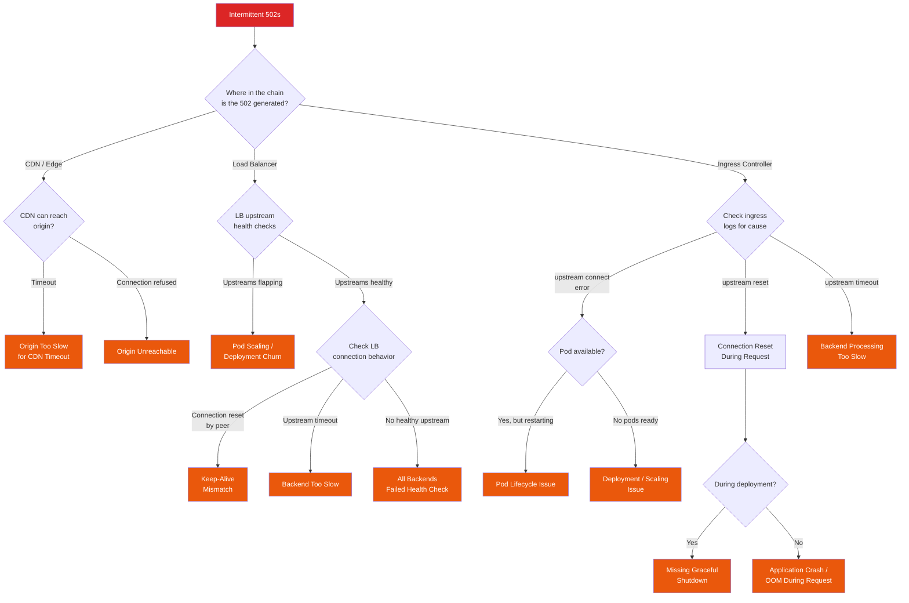

# "Intermittent 502s" Playbook

Intermittent 502 errors are among the most frustrating production problems. They do not happen on every request, making them hard to reproduce. They often appear in monitoring as a small percentage of errors that "look fine" until you realize each 502 represents a user seeing a broken page. The core challenge is that a 502 Bad Gateway means the **proxy or load balancer** received an invalid response from the **upstream server** — but the problem could be in either component, or in the network between them.

## Symptoms

You are here because one or more of the following is true:

- Users report pages occasionally failing to load (but refresh works)
- Monitoring shows a low but persistent rate of 502 errors (0.1% - 5%)
- Load balancer access logs contain 502 status codes
- The 502s may correlate with deployments, scaling events, or traffic spikes
- Error rate is not high enough to trigger a major alert, but SLO is burning

::: tip The Intermittent Part Is the Clue
If 502s were constant, the upstream would simply be down. Intermittent means the upstream is *mostly* working. This narrows the cause to: timing issues (race conditions during scaling/deployment), resource exhaustion under load (some requests hit a saturated backend), or connection management problems (keep-alive mismatches, connection reuse failures).
:::

## Decision Tree



## Step-by-Step Investigation

### Step 1: Locate Where the 502 Is Generated

The first and most critical question: **which component is returning the 502?** The 502 could come from any proxy in the chain.

```
Client → CDN → Load Balancer → Ingress Controller → Service → Pod
                                                         ↑
                    Any of these could be generating the 502
```

```bash
# Check CDN logs (Cloudflare example)
# In Cloudflare dashboard: Analytics → Traffic → filter by status 502
# Look at the "Origin Status" column:
# - If origin returned 502: the 502 comes from your infrastructure
# - If origin returned 5xx: CDN is forwarding the upstream error
# - If origin returned 0 or timeout: CDN could not reach origin at all

# Check load balancer logs (AWS ALB)
# In CloudWatch Logs: filter for ELB status 502
# Key field: "target_status_code" vs "elb_status_code"
# - If target_status_code is 502: your app returned 502
# - If target_status_code is "-": ALB could not connect to target
aws logs filter-log-events \
  --log-group-name "/aws/alb/your-alb" \
  --filter-pattern "502"

# Check NGINX Ingress Controller logs
kubectl logs -l app.kubernetes.io/name=ingress-nginx \
  -n ingress-nginx --tail=100 | grep " 502 "

# In the NGINX log, look for the upstream that failed:
# "upstream" field shows which backend was attempted
# "upstream_status" shows what the backend returned
```

### Step 2: Check if 502s Correlate with Deployments

```bash
# Get recent deployment events
kubectl rollout history deployment/your-app -n your-namespace

# Check deployment timestamps vs 502 spikes
kubectl get events --sort-by='.lastTimestamp' -n your-namespace | grep -i "rolling\|scaled\|killing"

# In Grafana: overlay deploy annotations on the error rate graph
# Prometheus:
rate(http_requests_total{status="502"}[1m])
# Add annotation for deployments

# Check if HPA (Horizontal Pod Autoscaler) is scaling
kubectl get hpa -n your-namespace
kubectl describe hpa your-app -n your-namespace
# Look for: "New size: X; reason: ..."
```

::: warning Deployment 502s Are the Most Common Cause
In Kubernetes, rolling deployments replace old pods with new ones. During the transition, old pods receive SIGTERM and start shutting down. If the pod is still in the load balancer's target list when it starts shutting down, in-flight requests to that pod get 502s. This is the single most common cause of intermittent 502 errors.
:::

### Step 3: Check Upstream Health and Connectivity

```bash
# Kubernetes: are all pods ready?
kubectl get pods -n your-namespace -o wide
# Look for pods that are Running but not Ready (0/1)

# Check endpoints — these are the actual IPs the service routes to
kubectl get endpoints your-service -n your-namespace
# If the endpoint list is empty or changing frequently, that is the problem

# Watch endpoints in real-time during a deployment
kubectl get endpoints your-service -n your-namespace -w

# From inside the cluster: test connectivity to the service
kubectl run debug --image=curlimages/curl --rm -it -- \
  curl -v http://your-service.your-namespace.svc.cluster.local:8080/health

# Check if DNS resolution is stable
kubectl run debug --image=busybox --rm -it -- \
  nslookup your-service.your-namespace.svc.cluster.local
```

### Step 4: Investigate Keep-Alive Mismatches

This is one of the most subtle causes of intermittent 502s. It happens when the **upstream server closes a keep-alive connection** at the exact moment the **load balancer sends a request** on that connection.

```
Timeline:
  T=0:  LB opens connection to upstream
  T=1:  LB sends request 1, upstream responds (connection kept alive)
  T=55: Upstream's keep-alive timeout is 60s
  T=58: LB sends request 2 on the same connection
  T=59: Upstream decides to close the idle connection (timeout at 60s)
  RACE: Both events happen ~simultaneously
  Result: LB sent the request but connection is being closed → 502
```

```bash
# Check your application's keep-alive timeout
# Node.js: default server.keepAliveTimeout is 5s
# If your LB's idle timeout is also 60s, you will get 502s

# The fix: application keep-alive timeout MUST be LONGER than LB idle timeout
# Node.js example:
# server.keepAliveTimeout = 65000; // 65s (LB is 60s)
# server.headersTimeout = 66000;   // Must be > keepAliveTimeout

# Check NGINX upstream keepalive settings
kubectl exec -it <ingress-pod> -- cat /etc/nginx/nginx.conf | grep -A5 keepalive

# Check AWS ALB idle timeout
aws elbv2 describe-target-group-attributes \
  --target-group-arn <arn> \
  --query 'Attributes[?Key==`deregistration_delay.timeout_seconds`]'
```

```nginx
# NGINX ingress: verify upstream keepalive configuration
# In the ingress annotations:
nginx.ingress.kubernetes.io/upstream-keepalive-connections: "32"
nginx.ingress.kubernetes.io/upstream-keepalive-timeout: "60"
nginx.ingress.kubernetes.io/upstream-keepalive-requests: "100"

# The proxy read timeout must accommodate your slowest endpoint
nginx.ingress.kubernetes.io/proxy-read-timeout: "60"
nginx.ingress.kubernetes.io/proxy-send-timeout: "60"
nginx.ingress.kubernetes.io/proxy-connect-timeout: "10"
```

### Step 5: Check Graceful Shutdown

```bash
# When a pod receives SIGTERM, it should:
# 1. Stop accepting new connections
# 2. Finish in-flight requests
# 3. Close connections gracefully
# 4. Exit

# Check if your app handles SIGTERM
kubectl logs <pod-name> --previous | grep -i "sigterm\|shutdown\|graceful"

# Check terminationGracePeriodSeconds
kubectl get pod <pod-name> -o jsonpath='{.spec.terminationGracePeriodSeconds}'
# Default is 30s — may not be enough for long-running requests

# The critical timing issue:
# 1. Kubernetes sends SIGTERM to pod
# 2. Kubernetes removes pod from service endpoints
# These happen CONCURRENTLY, not sequentially!
# So the pod can receive new requests AFTER it starts shutting down

# The fix: add a preStop hook with a sleep
# This delays SIGTERM, giving Kubernetes time to update endpoints
```

```yaml
# Graceful shutdown configuration
spec:
  terminationGracePeriodSeconds: 60
  containers:
    - name: app
      lifecycle:
        preStop:
          exec:
            command: ["/bin/sh", "-c", "sleep 15"]
      # This ensures:
      # 1. Kubernetes starts removing pod from endpoints
      # 2. preStop sleep gives 15s for endpoint removal to propagate
      # 3. After sleep, SIGTERM is sent to the application
      # 4. Application has (60 - 15) = 45s to finish in-flight requests
```

### Step 6: Check DNS Resolution Issues

```bash
# DNS issues can cause intermittent 502s when the LB resolves upstream
# addresses and gets stale or incorrect results

# Check CoreDNS health in the cluster
kubectl get pods -n kube-system -l k8s-app=kube-dns
kubectl logs -l k8s-app=kube-dns -n kube-system --tail=50

# Check DNS resolution latency from inside a pod
kubectl run debug --image=busybox --rm -it -- \
  sh -c "for i in $(seq 1 10); do time nslookup your-service; done"

# Check if CoreDNS is overloaded
kubectl top pods -n kube-system -l k8s-app=kube-dns

# For external DNS (e.g., upstream APIs):
# DNS TTL might be too long — cached entries point to dead backends
dig +short +ttlid your-upstream-api.com
```

### Step 7: Check Connection Pooling and Reuse

```bash
# If your load balancer reuses connections to upstreams,
# a backend that closes the connection unexpectedly causes 502s

# Check NGINX ingress connection reuse stats
kubectl exec -it <ingress-pod> -- \
  curl -s http://localhost:10254/metrics | grep "nginx_ingress_controller_connect"

# Check active connections to upstream
kubectl exec -it <ingress-pod> -- \
  curl -s http://localhost:10254/metrics | grep "upstream"

# Check for connection errors in ingress logs
kubectl logs -l app.kubernetes.io/name=ingress-nginx -n ingress-nginx \
  | grep -E "connect\(\) failed|upstream prematurely closed|reset by peer"
```

### Step 8: Check for Resource Exhaustion Under Load

```bash
# 502s under load often mean the backend cannot handle the request rate

# Check pod CPU and memory under load
kubectl top pods -n your-namespace

# Check if HPA is scaling fast enough
kubectl get hpa your-app -n your-namespace -w

# Check request queue depth (if available)
# Prometheus:
rate(http_requests_total[1m])
# Compare to: rate(http_requests_handled_total[1m])
# Difference = requests queuing or being dropped

# Check if the connection pool to upstream is exhausted
# NGINX: look for "no live upstreams" in logs
kubectl logs -l app.kubernetes.io/name=ingress-nginx -n ingress-nginx \
  | grep "no live upstreams"

# Check max concurrent connections on the backend
ss -tunap | grep :8080 | wc -l  # From inside the pod
```

### Step 9: Reproduce the Issue

```bash
# Use a load testing tool to reproduce the intermittent 502s
# k6 can detect and count 502 responses:

# k6 script (save as load-test.js):
cat << 'SCRIPT'
import http from 'k6/http';
import { check, sleep } from 'k6';
import { Rate } from 'k6/metrics';

const error502Rate = new Rate('502_errors');

export const options = {
  vus: 50,
  duration: '5m',
};

export default function () {
  const res = http.get('https://your-api.com/endpoint');
  error502Rate.add(res.status === 502);
  check(res, {
    'not 502': (r) => r.status !== 502,
  });
  sleep(0.1);
}
SCRIPT

# Run during a deployment to see if 502s spike
k6 run load-test.js
```

## Common Root Causes

| Root Cause | Probability | Key Indicator | Pattern |
|---|---|---|---|
| Missing graceful shutdown during deployments | 25% | 502s spike during deploys, exit code 143 | Correlates exactly with deployment events |
| Keep-alive timeout mismatch | 20% | "connection reset by peer" in LB logs | Random, low-rate, no correlation with events |
| Pod not ready but receiving traffic | 15% | Readiness probe not configured or too lenient | 502s during startup or under load |
| Upstream timeout (backend too slow) | 12% | "upstream timed out" in ingress logs | Correlates with high latency on specific endpoints |
| HPA scaling too slow | 8% | 502s during traffic spikes, resolved when pods scale up | Correlates with traffic increases |
| Health check misconfiguration | 7% | Backends flapping between healthy/unhealthy | Periodic pattern matching health check interval |
| DNS resolution failure | 5% | "no resolver defined" or stale DNS entries | Intermittent, may affect specific upstream targets |
| Connection pool exhaustion | 5% | "no live upstreams" or max connections reached | Under high load only |
| OOM/crash during request processing | 3% | Pod restarts correlate with 502 spikes | Follows pod restart events |

## Fixes

### Fix: Graceful Shutdown During Deployments

```yaml
apiVersion: apps/v1
kind: Deployment
metadata:
  name: your-app
spec:
  strategy:
    rollingUpdate:
      maxSurge: 1         # Only create 1 new pod at a time
      maxUnavailable: 0   # Never have fewer pods than desired
  template:
    spec:
      terminationGracePeriodSeconds: 60
      containers:
        - name: app
          lifecycle:
            preStop:
              exec:
                # Sleep to allow endpoint deregistration to propagate
                command: ["/bin/sh", "-c", "sleep 15"]
          readinessProbe:
            httpGet:
              path: /ready
              port: 8080
            initialDelaySeconds: 5
            periodSeconds: 5
            failureThreshold: 2
```

```javascript
// Node.js graceful shutdown handler
const server = app.listen(8080);

// Keep-alive timeout must be LONGER than load balancer idle timeout
server.keepAliveTimeout = 65000;  // 65s (assume LB is 60s)
server.headersTimeout = 66000;    // Must be > keepAliveTimeout

let isShuttingDown = false;

process.on('SIGTERM', () => {
  console.log('SIGTERM received, starting graceful shutdown');
  isShuttingDown = true;

  // Stop accepting new connections
  server.close(() => {
    console.log('All connections closed, exiting');
    process.exit(0);
  });

  // Force exit after timeout (safety net)
  setTimeout(() => {
    console.error('Forced exit after timeout');
    process.exit(1);
  }, 45000);
});

// Readiness probe should return 503 during shutdown
app.get('/ready', (req, res) => {
  if (isShuttingDown) {
    return res.status(503).send('Shutting down');
  }
  res.status(200).send('OK');
});
```

### Fix: Keep-Alive Timeout Mismatch

```javascript
// Node.js: set keep-alive timeout LONGER than LB idle timeout
const server = app.listen(8080);
server.keepAliveTimeout = 65000;  // ALB default is 60s
server.headersTimeout = 66000;    // Must be slightly higher
```

```go
// Go: set idle timeout on the HTTP server
srv := &http.Server{
    Addr:         ":8080",
    Handler:      router,
    IdleTimeout:  65 * time.Second,  // > LB idle timeout
    ReadTimeout:  10 * time.Second,
    WriteTimeout: 30 * time.Second,
}
```

```yaml
# If using NGINX ingress, align timeouts:
apiVersion: networking.k8s.io/v1
kind: Ingress
metadata:
  annotations:
    nginx.ingress.kubernetes.io/proxy-read-timeout: "60"
    nginx.ingress.kubernetes.io/proxy-send-timeout: "60"
    nginx.ingress.kubernetes.io/proxy-connect-timeout: "10"
    # Upstream keepalive must be shorter than backend's keepAliveTimeout
    nginx.ingress.kubernetes.io/upstream-keepalive-timeout: "55"
```

### Fix: HPA Scaling Too Slow

```yaml
apiVersion: autoscaling/v2
kind: HorizontalPodAutoscaler
metadata:
  name: your-app-hpa
spec:
  scaleTargetRef:
    apiVersion: apps/v1
    kind: Deployment
    name: your-app
  minReplicas: 3           # Always have enough baseline capacity
  maxReplicas: 20
  metrics:
    - type: Resource
      resource:
        name: cpu
        target:
          type: Utilization
          averageUtilization: 60   # Scale earlier (before saturation)
  behavior:
    scaleUp:
      stabilizationWindowSeconds: 30   # React faster to traffic spikes
      policies:
        - type: Pods
          value: 4                     # Add up to 4 pods at once
          periodSeconds: 60
    scaleDown:
      stabilizationWindowSeconds: 300  # Scale down slowly (avoid thrash)
```

### Fix: AWS ALB Target Deregistration

```yaml
# When a target is deregistered (pod shutting down), ALB continues
# sending requests for the deregistration_delay period.
# The default is 300s which is far too long for most applications.

# Reduce via target group attribute:
# AWS CLI:
aws elbv2 modify-target-group-attributes \
  --target-group-arn <arn> \
  --attributes Key=deregistration_delay.timeout_seconds,Value=30

# In Kubernetes with AWS Load Balancer Controller:
apiVersion: v1
kind: Service
metadata:
  annotations:
    service.beta.kubernetes.io/aws-load-balancer-target-group-attributes: |
      deregistration_delay.timeout_seconds=30
```

## Prevention

### The Zero-Downtime Deployment Checklist

```markdown
Before deploying:
- [ ] Application handles SIGTERM and finishes in-flight requests
- [ ] preStop hook with sleep (10-15s) is configured
- [ ] Readiness probe returns 503 during shutdown
- [ ] terminationGracePeriodSeconds > preStop sleep + request drain time
- [ ] Rolling update with maxUnavailable: 0
- [ ] Keep-alive timeout on app > idle timeout on LB
- [ ] PodDisruptionBudget ensures minimum availability

After deploying:
- [ ] Monitor 502 rate for 5 minutes post-deploy
- [ ] Check that old pods fully drained before termination
- [ ] Verify new pods pass readiness probe before receiving traffic
```

### Alerting Rules

```yaml
groups:
  - name: 502-errors
    rules:
      - alert: Intermittent502s
        expr: |
          sum(rate(http_requests_total{status="502"}[5m])) by (service)
          / sum(rate(http_requests_total[5m])) by (service) > 0.001
        for: 5m
        labels:
          severity: warning
        annotations:
          summary: "502 error rate >0.1% for {​{ $labels.service }}"

      - alert: High502Rate
        expr: |
          sum(rate(http_requests_total{status="502"}[5m])) by (service)
          / sum(rate(http_requests_total[5m])) by (service) > 0.01
        for: 2m
        labels:
          severity: critical
        annotations:
          summary: "502 error rate >1% for {​{ $labels.service }}"

      - alert: UpstreamTimeout
        expr: |
          rate(nginx_ingress_controller_requests{status="502"}[5m]) > 0
        for: 5m
        labels:
          severity: warning
        annotations:
          summary: "NGINX ingress returning 502s for {​{ $labels.ingress }}"
```

### Architecture Best Practices

| Practice | What It Prevents | Implementation |
|---|---|---|
| preStop sleep + readiness probe | 502s during deployment | Pod lifecycle configuration |
| Keep-alive timeout alignment | Random connection resets | Application server config |
| PodDisruptionBudget | Too many pods down simultaneously | Kubernetes PDB resource |
| Connection draining on LB | Requests to dying backends | LB deregistration delay |
| Retry with idempotency | Impact of unavoidable transient 502s | Application-level retry logic |
| Minimum 3 replicas | Single pod failure causing outage | Deployment spec |
| HPA with aggressive scale-up | 502s during traffic spikes | HPA configuration |

## Cross-References

- [Pods Keep Restarting](/debugging-playbooks/pods-restarting) --- Pod restarts cause 502s to in-flight requests
- [API Is Slow](/debugging-playbooks/api-slow) --- Slow backends trigger upstream timeouts resulting in 502s
- [Error Rate Spiked](/debugging-playbooks/high-error-rate) --- 502s contribute to error rate spikes
- [Load Balancing](/system-design/networking/load-balancing) --- Load balancer architecture and algorithms
- [Kubernetes Networking](/infrastructure/kubernetes/networking) --- Kubernetes service networking
- [Zero-Downtime Deployments](/devops/deployment-strategies) --- Deployment strategies that prevent 502s
