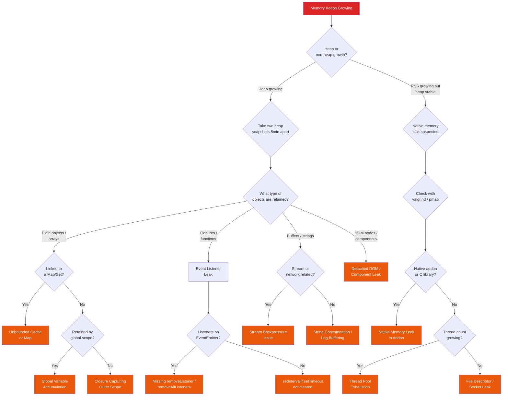

# "Memory Keeps Growing" Playbook

Memory leaks are insidious. They do not crash your service immediately. Instead, memory usage climbs steadily over hours or days until something breaks — an OOM kill, GC thrashing that grinds latency to a halt, or swap usage that turns your service into a turtle. This playbook helps you find what is holding on to memory and why.

## Symptoms

You are here because one or more of the following is true:

- Process RSS (Resident Set Size) is growing over time without stabilizing
- OOM kills are happening periodically (the classic "restarts every N hours" pattern)
- Heap usage shows a sawtooth pattern where the baseline keeps climbing
- GC is running more frequently and reclaiming less memory each time
- Latency is increasing over the lifetime of the process (GC pressure symptom)
- Kubernetes pods are being evicted due to memory pressure

::: danger Memory Leak vs. Memory-Hungry
Not every growing memory usage is a leak. Some applications legitimately need more memory over time (caches warming up, large datasets loaded). A true leak is memory that is **allocated but never freed** and **never used again**. The distinction matters because the diagnostic path is different.
:::

## Decision Tree



## Step-by-Step Investigation

### Step 1: Confirm the Leak Is Real

```bash
# Monitor RSS over time (Linux)
while true; do
  ps -p $(pgrep -f your-app) -o pid,rss,vsz,%mem,etime --no-headers
  sleep 60
done >> /tmp/memory_log.txt

# Kubernetes: watch memory usage
kubectl top pod <pod-name> --containers

# Prometheus: graph memory over hours/days
container_memory_working_set_bytes{pod=~"your-app.*"}
process_resident_memory_bytes{job="your-app"}

# Node.js: built-in memory reporting
node -e "setInterval(() => console.log(JSON.stringify(process.memoryUsage())), 5000)"
# Outputs: rss, heapTotal, heapUsed, external, arrayBuffers
```

::: tip The 3x Rule
If memory doubles within a timeframe and then doubles again in the same timeframe, you almost certainly have a leak. If it grows 50% and then plateaus, it is probably cache warming or legitimate growth.
:::

### Step 2: Determine Heap vs. Non-Heap

```bash
# Compare heap size to total RSS
# Node.js
node -e "
setInterval(() => {
  const mem = process.memoryUsage();
  console.log({
    rss_mb: (mem.rss / 1024 / 1024).toFixed(1),
    heap_used_mb: (mem.heapUsed / 1024 / 1024).toFixed(1),
    heap_total_mb: (mem.heapTotal / 1024 / 1024).toFixed(1),
    external_mb: (mem.external / 1024 / 1024).toFixed(1),
    array_buffers_mb: (mem.arrayBuffers / 1024 / 1024).toFixed(1),
    non_heap_mb: ((mem.rss - mem.heapTotal) / 1024 / 1024).toFixed(1),
  });
}, 10000);
"
```

```bash
# Java: separate heap from native
jcmd <pid> VM.native_memory summary

# Key areas:
# - Java Heap: managed by GC
# - Thread: each thread stack (~1MB by default)
# - Class: loaded class metadata
# - Internal: JVM internal structures
# - Code: JIT compiled code cache

# Java: heap breakdown
jmap -histo <pid> | head -30
```

```bash
# Generic: memory map of the process
pmap -x <pid> | tail -5
# Look at the total — compare RSS to heap size
# If RSS >> heap, the leak is in native/off-heap memory
```

### Step 3: Take Heap Snapshots (Node.js)

```javascript
// Method 1: Send signal to running process
// Add this to your app startup:
process.on('SIGUSR2', () => {
  const v8 = require('v8');
  const fs = require('fs');
  const filename = `/tmp/heap-${Date.now()}.heapsnapshot`;
  const stream = fs.createWriteStream(filename);
  v8.writeHeapSnapshot(filename);
  console.log(`Heap snapshot written to ${filename}`);
});

// Then trigger from outside:
// kill -USR2 <pid>
```

```bash
# Method 2: Chrome DevTools remote debugging
node --inspect=0.0.0.0:9229 app.js

# In Chrome: navigate to chrome://inspect
# Click "inspect" next to your Node.js process
# Go to Memory tab → Take heap snapshot

# Method 3: Using the v8 module programmatically
node -e "
const v8 = require('v8');
const fs = require('fs');

// Take snapshot 1
v8.writeHeapSnapshot('/tmp/snap1.heapsnapshot');
console.log('Snapshot 1 taken');

// Wait and take snapshot 2
setTimeout(() => {
  v8.writeHeapSnapshot('/tmp/snap2.heapsnapshot');
  console.log('Snapshot 2 taken');
}, 300000); // 5 minutes later
"
```

### Step 4: Analyze Heap Snapshots

```
In Chrome DevTools (Memory tab):
1. Load snapshot 1
2. Load snapshot 2
3. Select snapshot 2
4. Change view from "Summary" to "Comparison"
5. Sort by "# Delta" (descending) to find what grew
6. Look for:
   - Large positive deltas in object count
   - Objects with high "Retained Size"
   - Strings, closures, or arrays that should not persist

Key columns:
- Shallow Size: memory used by the object itself
- Retained Size: memory that would be freed if the object were GC'd
  (includes all objects it references exclusively)
```

::: tip The Retainer Path Is Everything
When you find the leaked objects, click on one and look at the "Retainers" panel. This shows **why** the object cannot be garbage collected — the chain of references from the GC root to the leaked object. The fix is to break this chain.
:::

### Step 5: Check for Event Listener Leaks

```javascript
// Node.js: check EventEmitter listener counts
const emitter = require('events');

// This warning appears in logs if you have a leak:
// MaxListenersExceededWarning: Possible EventEmitter memory leak detected.
// 11 'data' listeners added to [Socket]

// Check listener count programmatically
console.log(myEmitter.listenerCount('data'));
console.log(myEmitter.listenerCount('error'));

// List all event names with listeners
console.log(myEmitter.eventNames());
```

```bash
# Check for the MaxListenersExceededWarning in logs
grep -r "MaxListenersExceededWarning" /var/log/app/
grep -r "memory leak detected" /var/log/app/

# Node.js: trace listener additions
# Start with --trace-warnings to get stack traces
node --trace-warnings app.js
```

### Step 6: Check for Unbounded Caches

```javascript
// Common pattern: Map used as cache with no eviction
// This WILL leak memory:
const cache = new Map();

function getCachedData(key) {
  if (cache.has(key)) return cache.get(key);
  const data = expensiveComputation(key);
  cache.set(key, data);  // Entries are NEVER removed
  return data;
}

// Check cache size in running process
console.log(`Cache size: ${cache.size} entries`);

// Estimate memory usage
let totalSize = 0;
for (const [key, value] of cache) {
  totalSize += key.length + JSON.stringify(value).length;
}
console.log(`Cache memory: ~${(totalSize / 1024 / 1024).toFixed(1)} MB`);
```

### Step 7: Check for Closure Leaks

```javascript
// Closures capture variables from outer scope
// If a closure outlives its expected lifetime, everything it captures leaks

// LEAKY: the callback captures `largeData` and lives forever in the timer
function processRequest(req) {
  const largeData = fetchHugeDataset();  // 50MB object

  setInterval(() => {
    // This closure captures `largeData` even if it only uses `req.id`
    console.log(`Still processing ${req.id}`);
  }, 60000);

  return summarize(largeData);
  // largeData should be GC'd here, but the closure prevents it
}
```

### Step 8: Check for Stream Backpressure Issues

```javascript
// Readable streams produce data faster than writable streams consume it
// Without backpressure handling, data accumulates in memory

// LEAKY: no backpressure handling
const readable = fs.createReadStream('huge-file.csv');
const writable = slowDatabaseWriter();

readable.on('data', (chunk) => {
  writable.write(chunk);  // If writable is slow, data buffers in memory
});

// FIXED: use pipe() which handles backpressure automatically
readable.pipe(writable);

// Or handle backpressure manually
readable.on('data', (chunk) => {
  const canContinue = writable.write(chunk);
  if (!canContinue) {
    readable.pause();
    writable.once('drain', () => readable.resume());
  }
});
```

### Step 9: Check for Timer Leaks

```bash
# Node.js: check active handles and requests
# These are things keeping the event loop alive
node -e "
setInterval(() => {
  const handles = process._getActiveHandles();
  const requests = process._getActiveRequests();
  console.log({
    active_handles: handles.length,
    handle_types: [...new Set(handles.map(h => h.constructor.name))],
    active_requests: requests.length,
  });
}, 10000);
"
```

```javascript
// Common timer leak: setInterval without clearInterval
function startMonitoring(connection) {
  const timerId = setInterval(() => {
    if (connection.isAlive()) {
      connection.ping();
    }
    // BUG: if connection dies, the interval keeps running
    // and the closure retains the `connection` object
  }, 30000);

  // FIX: clear the interval when the connection closes
  connection.on('close', () => {
    clearInterval(timerId);
  });
}
```

### Step 10: Java-Specific Investigation

```bash
# Generate heap dump
jmap -dump:live,format=b,file=/tmp/heapdump.hprof <pid>

# Analyze with Eclipse MAT (Memory Analyzer Tool)
# Key reports:
# 1. Leak Suspects — automatic analysis of likely leaks
# 2. Dominator Tree — largest objects by retained heap
# 3. Top Consumers — classes/packages using most memory

# Quick check: class histogram
jmap -histo:live <pid> | head -30
# Look for classes with unexpectedly high instance counts

# JFR (Java Flight Recorder) — low overhead profiling
jcmd <pid> JFR.start duration=300s filename=/tmp/recording.jfr \
  settings=profile
# Analyze with JDK Mission Control (jmc)
```

```java
// Common Java memory leaks:

// 1. Static collections that grow
class SessionManager {
    // BUG: entries are added but never removed
    private static final Map<String, Session> sessions = new HashMap<>();

    void addSession(String id, Session session) {
        sessions.put(id, session);  // Where is removeSession()?
    }
}

// 2. Unclosed resources
// LEAKY:
Connection conn = dataSource.getConnection();
Statement stmt = conn.createStatement();
ResultSet rs = stmt.executeQuery("SELECT ...");
// If an exception occurs before close(), the connection leaks

// FIXED: try-with-resources
try (Connection conn = dataSource.getConnection();
     Statement stmt = conn.createStatement();
     ResultSet rs = stmt.executeQuery("SELECT ...")) {
    // process results
}

// 3. ThreadLocal not cleaned up
private static final ThreadLocal<ExpensiveObject> cache =
    ThreadLocal.withInitial(ExpensiveObject::new);
// In thread pools, threads are reused — ThreadLocal values persist
// FIX: call cache.remove() in a finally block
```

## Common Root Causes

| Root Cause | Probability | Key Indicator | Language |
|---|---|---|---|
| Unbounded cache / Map | 25% | Map/Set size growing, keys are per-request data | All |
| Event listener not removed | 20% | MaxListenersExceededWarning, listener count growing | Node.js |
| Closure capturing large scope | 15% | Retained objects linked to function closures | Node.js, JS |
| Unclosed resources (DB conn, streams) | 12% | File descriptor count growing, connection pool drain | Java, Python |
| Stream without backpressure | 8% | Buffer/ArrayBuffer growth, high external memory | Node.js |
| Timer (setInterval) not cleared | 8% | Active handle count growing, timer objects in heap | Node.js |
| Static collection growth | 5% | Static Map/List in heap dump dominator tree | Java |
| ThreadLocal in thread pool | 3% | Thread-associated objects in heap, grows with thread count | Java |
| Native addon leak | 2% | RSS grows but heap is stable, C/C++ addon in use | Node.js, Python |
| Detached DOM nodes | 2% | DOM node count in heap snapshot, SSR apps | Node.js (SSR) |

## Fixes

### Fix: Unbounded Cache

```javascript
// Option 1: Use an LRU cache with a size limit
const LRU = require('lru-cache');
const cache = new LRU({
  max: 500,         // maximum number of entries
  maxSize: 50 * 1024 * 1024,  // 50MB max
  sizeCalculation: (value) => JSON.stringify(value).length,
  ttl: 1000 * 60 * 15,  // 15 minute TTL
});

// Option 2: Use WeakMap (entries are GC'd when key is GC'd)
// Only works if keys are objects, not strings/numbers
const cache = new WeakMap();

// Option 3: Manual eviction with TTL
class TTLCache {
  constructor(ttlMs) {
    this.ttl = ttlMs;
    this.cache = new Map();
  }

  set(key, value) {
    this.cache.set(key, { value, expires: Date.now() + this.ttl });
    // Evict expired entries periodically
    if (this.cache.size % 100 === 0) this.evict();
  }

  get(key) {
    const entry = this.cache.get(key);
    if (!entry) return undefined;
    if (Date.now() > entry.expires) {
      this.cache.delete(key);
      return undefined;
    }
    return entry.value;
  }

  evict() {
    const now = Date.now();
    for (const [key, entry] of this.cache) {
      if (now > entry.expires) this.cache.delete(key);
    }
  }
}
```

### Fix: Event Listener Leak

```javascript
// BEFORE: listener added on every request, never removed
app.get('/stream', (req, res) => {
  const handler = (data) => {
    res.write(JSON.stringify(data));
  };
  eventBus.on('update', handler);
  // When the client disconnects, the handler is still registered
});

// AFTER: clean up on disconnect
app.get('/stream', (req, res) => {
  const handler = (data) => {
    res.write(JSON.stringify(data));
  };
  eventBus.on('update', handler);

  req.on('close', () => {
    eventBus.removeListener('update', handler);
  });
});

// Or use AbortController (Node.js 16+)
app.get('/stream', (req, res) => {
  const ac = new AbortController();

  eventBus.on('update', (data) => {
    res.write(JSON.stringify(data));
  }, { signal: ac.signal });

  req.on('close', () => ac.abort());
});
```

### Fix: Closure Capturing Large Scope

```javascript
// BEFORE: closure captures entire scope including largeData
function process(input) {
  const largeData = loadLargeDataset(input);  // 100MB
  const summary = computeSummary(largeData);   // 1KB

  return {
    getSummary: () => summary,
    // BUG: this closure captures `largeData` too
    // because it is in the same scope
    getCount: () => summary.count,
  };
}

// AFTER: isolate the closure from the large data
function process(input) {
  const summary = computeFromInput(input);

  return {
    getSummary: () => summary,
    getCount: () => summary.count,
  };
}

function computeFromInput(input) {
  const largeData = loadLargeDataset(input);
  const summary = computeSummary(largeData);
  // largeData goes out of scope and can be GC'd
  return summary;
}
```

### Fix: Stream Backpressure

```javascript
// Use pipeline() instead of pipe() for proper error handling + backpressure
const { pipeline } = require('stream/promises');

async function processFile(inputPath, outputPath) {
  await pipeline(
    fs.createReadStream(inputPath),
    new Transform({
      transform(chunk, encoding, callback) {
        const processed = processChunk(chunk);
        callback(null, processed);
      },
      highWaterMark: 16 * 1024,  // Control buffer size
    }),
    fs.createWriteStream(outputPath)
  );
}
```

### Fix: Java ThreadLocal Leak

```java
// Use try-finally to ensure ThreadLocal cleanup
public class RequestContext {
    private static final ThreadLocal<Map<String, Object>> context =
        ThreadLocal.withInitial(HashMap::new);

    public static void set(String key, Object value) {
        context.get().put(key, value);
    }

    public static void clear() {
        context.remove();  // Critical: removes the ThreadLocal value
    }
}

// In a servlet filter or interceptor:
public class ContextFilter implements Filter {
    @Override
    public void doFilter(ServletRequest req, ServletResponse res,
                         FilterChain chain) throws IOException, ServletException {
        try {
            chain.doFilter(req, res);
        } finally {
            RequestContext.clear();  // Always clean up
        }
    }
}
```

## Prevention

### Automated Leak Detection

```javascript
// Node.js: add memory monitoring to your health check
app.get('/health', (req, res) => {
  const mem = process.memoryUsage();
  const uptimeHours = process.uptime() / 3600;
  const mbPerHour = (mem.heapUsed / 1024 / 1024) / uptimeHours;

  res.json({
    status: 'ok',
    memory: {
      heap_used_mb: (mem.heapUsed / 1024 / 1024).toFixed(1),
      rss_mb: (mem.rss / 1024 / 1024).toFixed(1),
      uptime_hours: uptimeHours.toFixed(1),
      heap_growth_mb_per_hour: mbPerHour.toFixed(2),
    },
  });
});
```

### Prometheus Alerting Rules

```yaml
groups:
  - name: memory-leak-detection
    rules:
      - alert: MemoryLeakSuspected
        expr: |
          deriv(process_resident_memory_bytes{job="your-app"}[1h]) > 10 * 1024 * 1024
        for: 2h
        labels:
          severity: warning
        annotations:
          summary: "Possible memory leak in {​{ $labels.instance }}"
          description: "RSS growing >10MB/hour for 2+ hours"

      - alert: HeapNearLimit
        expr: |
          process_heap_bytes{job="your-app"} /
          process_heap_limit_bytes{job="your-app"} > 0.85
        for: 10m
        labels:
          severity: critical
        annotations:
          summary: "Heap usage >85% of limit for {​{ $labels.instance }}"

      - alert: OOMKillDetected
        expr: |
          increase(kube_pod_container_status_restarts_total[1h]) > 0
          and kube_pod_container_status_last_terminated_reason{reason="OOMKilled"} == 1
        labels:
          severity: critical
        annotations:
          summary: "OOM kill detected for {​{ $labels.pod }}"
```

### Coding Standards

| Rule | Rationale | Enforcement |
|---|---|---|
| Every `setInterval` must have a corresponding `clearInterval` | Prevents timer leaks | ESLint custom rule |
| Every `on()` must have a corresponding `off()` or use `{ signal }` | Prevents listener leaks | Code review checklist |
| All caches must have a max size or TTL | Prevents unbounded growth | Architectural review |
| All streams must use `pipeline()` not manual `.pipe()` | Ensures backpressure and error handling | ESLint rule |
| Resources must be closed in `finally` / `try-with-resources` | Prevents descriptor leaks | Static analysis (SpotBugs) |
| Load test for 8+ hours to validate no memory growth | Catches leaks before production | CI pipeline |

### Load Testing for Leaks

```bash
# Run a sustained load test and monitor memory growth
# Using k6:
k6 run --duration 8h --vus 50 load-test.js

# While k6 runs, record memory every minute
while true; do
  curl -s http://localhost:3000/health \
    | jq '.memory' >> /tmp/memory_over_time.json
  sleep 60
done

# After the test, check for linear growth:
# Plot heap_used_mb vs time — a flat line is healthy
# A steadily climbing line is a leak
```

## Cross-References

- [API Is Slow](/debugging-playbooks/api-slow) --- GC pressure from memory leaks causes latency
- [Pods Keep Restarting](/debugging-playbooks/pods-restarting) --- OOM kills lead to pod restarts
- [Performance Profiling](/performance/profiling) --- CPU and memory profiling techniques
- [Node.js Performance](/performance/nodejs-performance) --- V8 memory model and optimization
- [Kubernetes Resource Management](/infrastructure/kubernetes/resource-management) --- Setting memory limits correctly
