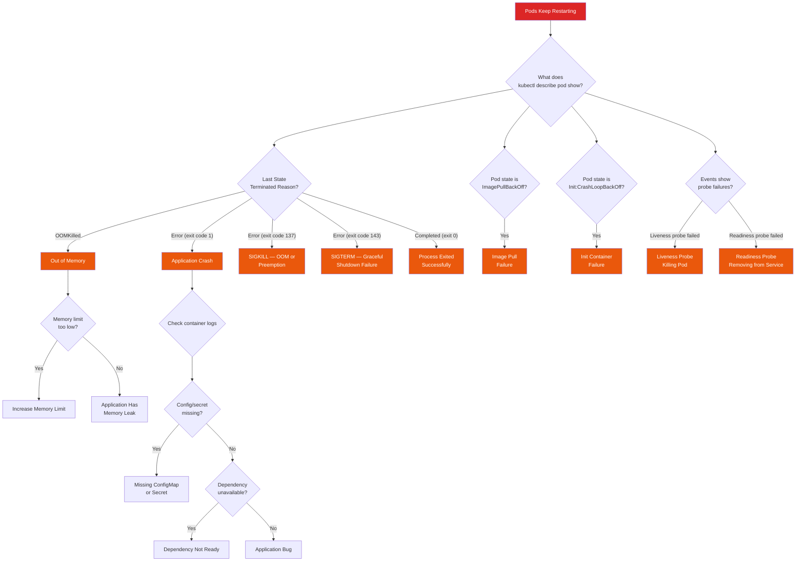

# "Pods Keep Restarting" Playbook

Your monitoring shows pods restarting repeatedly. Maybe PagerDuty woke you up because a deployment is stuck in `CrashLoopBackOff`. Maybe you noticed the restart counter climbing during a routine check. Either way, pods that cannot stay running mean your service is degraded or down, and Kubernetes' exponential backoff means each restart takes longer to attempt.

This playbook covers the full spectrum of pod restart causes, from the obvious (OOM kills) to the subtle (readiness probe misconfiguration causing a healthy pod to be killed and replaced endlessly).

## Symptoms

You are here because one or more of the following is true:

- `kubectl get pods` shows pods in `CrashLoopBackOff`, `Error`, or `ImagePullBackOff`
- Restart counter for one or more pods is incrementing
- Pods reach `Running` state briefly then die
- Deployment rollout is stuck or progressing very slowly
- Application is intermittently unavailable as pods cycle
- Alerts firing for pod restart rate or availability

::: tip Quick Status Check
Before diving deep, get a snapshot of the current state:
```bash
kubectl get pods -o wide | grep -v Running
kubectl get events --sort-by='.lastTimestamp' | tail -20
```
These two commands tell you *what* is failing and *when* it started.
:::

## Decision Tree



## Step-by-Step Investigation

### Step 1: Get the Current State

```bash
# Overview: which pods are failing?
kubectl get pods -n your-namespace -o wide

# Detailed status of the failing pod
kubectl describe pod <pod-name> -n your-namespace

# Key sections to read in describe output:
# - Status:           Current phase (Pending, Running, etc.)
# - Conditions:       Ready, ContainersReady, PodScheduled
# - Containers:       State, Last State, Restart Count, Ready
# - Events:           Recent events (scheduling, pulling, starting, killing)

# Quick way to see the termination reason
kubectl get pod <pod-name> -o jsonpath='{.status.containerStatuses[0].lastState.terminated}'
```

### Step 2: Check the Exit Code

The exit code tells you *how* the container died:

| Exit Code | Signal | Meaning |
|---|---|---|
| 0 | — | Process exited successfully (normal completion) |
| 1 | — | Application error (uncaught exception, failed assertion) |
| 2 | — | Shell misuse (wrong command syntax) |
| 126 | — | Permission denied (cannot execute the entrypoint) |
| 127 | — | Command not found (bad entrypoint or missing binary) |
| 128+N | Signal N | Process killed by signal N |
| 137 | SIGKILL (9) | OOM killed or `kubectl delete --force` |
| 139 | SIGSEGV (11) | Segmentation fault (native code crash) |
| 143 | SIGTERM (15) | Graceful shutdown requested but process did not exit in time |

```bash
# Get the exit code from the last termination
kubectl get pod <pod-name> -o jsonpath='{.status.containerStatuses[0].lastState.terminated.exitCode}'

# Get the reason
kubectl get pod <pod-name> -o jsonpath='{.status.containerStatuses[0].lastState.terminated.reason}'
```

### Step 3: Check Container Logs

```bash
# Current container logs
kubectl logs <pod-name> -n your-namespace

# Previous container logs (from the last crash)
kubectl logs <pod-name> -n your-namespace --previous

# If there are multiple containers in the pod
kubectl logs <pod-name> -c <container-name> --previous

# Follow logs in real-time (if pod is running intermittently)
kubectl logs <pod-name> -f

# Get logs from all pods matching a label
kubectl logs -l app=your-app --tail=50

# If logs are empty, the process may be crashing before producing output
# Check if the entrypoint is correct:
kubectl describe pod <pod-name> | grep -A5 "Command\|Args"
```

::: warning Empty Logs Are a Clue
If `kubectl logs --previous` returns nothing, the container is crashing before it can write any output. Common causes: wrong entrypoint/command, missing binary, missing shared library, or permission denied on the executable. Try running the image locally with `docker run -it <image> /bin/sh` to debug the startup.
:::

### Step 4: Diagnose OOMKilled

```bash
# Confirm it is OOMKilled
kubectl describe pod <pod-name> | grep -A5 "Last State"
# Should show: Reason: OOMKilled

# Check the memory limit vs actual usage
kubectl describe pod <pod-name> | grep -A3 "Limits"
kubectl top pod <pod-name> --containers

# Compare to the node's available memory
kubectl describe node <node-name> | grep -A10 "Allocated resources"

# Check the kernel OOM killer logs on the node
# (if you have node access)
dmesg | grep -i "oom\|killed" | tail -20
journalctl -k | grep -i "oom\|killed" | tail -20
```

```bash
# Prometheus: memory usage over time for this pod
container_memory_working_set_bytes{pod="your-pod-name"}

# Prometheus: memory usage as percentage of limit
container_memory_working_set_bytes{pod=~"your-app.*"}
/ container_spec_memory_limit_bytes{pod=~"your-app.*"}

# If this ratio is consistently > 0.9, the limit is too tight
# If it grows linearly over time, you have a memory leak
```

::: tip OOMKilled vs. Node-Level OOM
Kubernetes has two OOM kill mechanisms: (1) the container exceeds its **cgroup memory limit** — the kernel kills it immediately; (2) the **node** is running low on memory and the kubelet evicts pods based on QoS class. Check `kubectl describe node` for eviction events. Node-level OOM means you need more nodes or smaller pods, not just higher limits.
:::

### Step 5: Diagnose CrashLoopBackOff

```bash
# CrashLoopBackOff means the container starts, crashes, and Kubernetes
# is waiting with exponential backoff before trying again.
# Backoff schedule: 10s, 20s, 40s, 80s, 160s, 300s (capped at 5 min)

# Check how many restarts and the current backoff
kubectl get pod <pod-name> -o jsonpath='{.status.containerStatuses[0].restartCount}'

# The most important thing: WHY is it crashing?
# Check the previous container's logs
kubectl logs <pod-name> --previous

# Common CrashLoopBackOff causes:
# 1. Application cannot connect to a required dependency (DB, Redis, etc.)
# 2. Missing or invalid configuration (env vars, config files, secrets)
# 3. Port conflict (another process already using the port)
# 4. File permission issues (running as non-root, volume mount permissions)
# 5. Binary incompatibility (built for wrong architecture)
```

### Step 6: Diagnose ImagePullBackOff

```bash
# Check the events for the specific error
kubectl describe pod <pod-name> | grep -A10 "Events"
# Common messages:
# - "repository does not exist" — wrong image name
# - "unauthorized" — missing or expired image pull secret
# - "manifest unknown" — tag doesn't exist
# - "TLS handshake timeout" — network issue to registry

# Verify the image exists
docker pull <image-name>:<tag>

# Check image pull secrets
kubectl get pod <pod-name> -o jsonpath='{.spec.imagePullSecrets}'
kubectl get secret <secret-name> -o jsonpath='{.data.\.dockerconfigjson}' | base64 -d

# Verify the secret has correct credentials
kubectl create secret docker-registry test-secret \
  --docker-server=your-registry.com \
  --docker-username=your-user \
  --docker-password=your-password \
  --dry-run=client -o yaml
```

### Step 7: Diagnose Liveness Probe Failures

```bash
# Check if the liveness probe is killing the pod
kubectl describe pod <pod-name> | grep -B5 -A10 "Liveness"
# Look for: "Liveness probe failed: ..."
# And events: "Killing" with "failed liveness probe"

# Get the probe configuration
kubectl get pod <pod-name> -o jsonpath='{.spec.containers[0].livenessProbe}' | jq .
```

```yaml
# Common liveness probe problems:

# Problem 1: initialDelaySeconds too short
# The app takes 30s to start, but probe starts checking at 10s
livenessProbe:
  httpGet:
    path: /healthz
    port: 8080
  initialDelaySeconds: 10   # Too short — app isn't ready yet
  periodSeconds: 10
  failureThreshold: 3

# Fix: increase initialDelaySeconds or use startupProbe
startupProbe:              # Runs only during startup
  httpGet:
    path: /healthz
    port: 8080
  failureThreshold: 30     # 30 * 10s = 5 minutes to start
  periodSeconds: 10
livenessProbe:             # Runs after startup succeeds
  httpGet:
    path: /healthz
    port: 8080
  periodSeconds: 10
  failureThreshold: 3

# Problem 2: Probe path returns 500 under load
# The /healthz endpoint does a DB query that times out under load
# Fix: make the liveness probe trivially cheap (return 200 if process is alive)

# Problem 3: timeoutSeconds too short
livenessProbe:
  httpGet:
    path: /healthz
    port: 8080
  timeoutSeconds: 1        # Under GC pressure, even /healthz takes > 1s
  # Fix: increase to 5-10s
```

::: danger Liveness Probes Should Not Check Dependencies
A liveness probe should answer: "Is this process alive and functional?" It should **not** check if the database is reachable, if Redis is up, or if upstream APIs are healthy. If the liveness probe fails because a dependency is down, Kubernetes kills and restarts the pod — which cannot fix a dependency failure and makes things worse by adding restart churn.
:::

### Step 8: Diagnose Init Container Failures

```bash
# Init containers run before the main container
# If they fail, the main container never starts
kubectl describe pod <pod-name> | grep -A20 "Init Containers"

# Get init container logs
kubectl logs <pod-name> -c <init-container-name>

# Common init container failures:
# 1. Waiting for a dependency that never comes ready
# 2. Database migration that fails
# 3. Certificate or secret download that times out
# 4. Volume mount permissions
```

### Step 9: Check Resource Pressure on the Node

```bash
# Is the node under resource pressure?
kubectl describe node <node-name> | grep -A5 "Conditions"
# Look for:
# MemoryPressure: True
# DiskPressure: True
# PIDPressure: True

# Check resource allocation on the node
kubectl describe node <node-name> | grep -A15 "Allocated resources"
# If CPU or memory requests are > 90% of capacity, pods may be evicted

# Check if pods are being evicted
kubectl get events -A | grep -i evict

# Check node disk usage (if you have node access)
df -h /var/lib/kubelet
df -h /var/lib/containers
# Full disk = container images can't be pulled, logs can't be written
```

### Step 10: Debug Interactively

```bash
# If the pod runs long enough, exec into it
kubectl exec -it <pod-name> -- /bin/sh

# If the pod crashes immediately, create a debug copy
# that overrides the entrypoint to keep it alive
kubectl debug <pod-name> -it --copy-to=debug-pod \
  --container=app -- /bin/sh

# Or run the image directly with a sleep command
kubectl run debug-pod --image=<your-image> \
  --overrides='{"spec":{"containers":[{"name":"debug","image":"<your-image>","command":["sleep","3600"]}]}}' \
  --restart=Never

# Check if the filesystem is writable
touch /tmp/test-write

# Check if environment variables are set correctly
env | sort

# Check if secrets/config are mounted
ls -la /etc/config/
cat /etc/config/app.yaml

# Check DNS resolution
nslookup your-database-service
nslookup your-database-service.your-namespace.svc.cluster.local

# Check network connectivity
wget -qO- http://your-dependency-service:8080/health
```

## Common Root Causes

| Root Cause | Probability | Key Indicator | Restart Pattern |
|---|---|---|---|
| OOMKilled — limit too low | 25% | Exit code 137, Reason: OOMKilled | Crashes after running for a while (memory grows) |
| Application crash (unhandled exception) | 20% | Exit code 1, error in logs | Immediate crash on startup or on specific input |
| Liveness probe misconfiguration | 15% | "Killing" events with "failed liveness probe" | Regular interval restarts (e.g., every 30-60s) |
| Missing config/secret/env var | 10% | Error in logs about missing configuration | Immediate crash on startup, every time |
| Dependency unavailable at startup | 8% | Connection refused/timeout errors in logs | CrashLoopBackOff, resolves when dependency comes up |
| Image pull failure | 7% | ImagePullBackOff status, registry errors in events | Pod never starts |
| Memory leak (OOMKilled) | 5% | OOMKilled after running for hours/days | Restarts on a slow cycle (every N hours) |
| Resource pressure / eviction | 5% | Eviction events, node conditions True | Random restarts, often affects multiple pods |
| File permission denied | 3% | "Permission denied" in logs | Immediate crash, every time |
| Port conflict | 2% | "Address already in use" in logs | Immediate crash, consistent |

## Fixes

### Fix: OOMKilled — Increase Memory Limit

```yaml
# Before: limit too tight
resources:
  requests:
    memory: "256Mi"
  limits:
    memory: "256Mi"

# After: give headroom (typically 1.5-2x of observed usage)
resources:
  requests:
    memory: "256Mi"    # Keep request at observed steady-state
  limits:
    memory: "512Mi"    # Limit at 2x request for burst headroom

# If you are unsure about the right values, use VPA (Vertical Pod Autoscaler)
# in recommendation mode to get suggestions:
# kubectl get vpa <vpa-name> -o yaml
```

::: tip Requests vs. Limits Strategy
**Requests** determine scheduling: Kubernetes places the pod on a node with this much free capacity. **Limits** are hard caps: exceed the memory limit and the kernel kills your process. Set requests to your steady-state usage and limits to your peak usage plus 20% headroom. Never set limits equal to requests unless you know the exact maximum memory your application will use.
:::

### Fix: Liveness Probe Tuning

```yaml
# Use a startupProbe for slow-starting applications
startupProbe:
  httpGet:
    path: /healthz
    port: 8080
  initialDelaySeconds: 5
  periodSeconds: 5
  failureThreshold: 60    # 60 * 5s = 5 minutes to start up
  timeoutSeconds: 3

# Make the livenessProbe forgiving
livenessProbe:
  httpGet:
    path: /healthz       # Should be trivially cheap
    port: 8080
  periodSeconds: 15       # Check every 15 seconds
  failureThreshold: 3     # Allow 3 consecutive failures (45s total)
  timeoutSeconds: 5       # Allow 5 seconds for the response
  # No initialDelaySeconds needed — startupProbe handles startup

# Readiness probe can be more sensitive
readinessProbe:
  httpGet:
    path: /ready          # Can check dependencies
    port: 8080
  periodSeconds: 5
  failureThreshold: 2
  timeoutSeconds: 3
```

### Fix: Missing Config or Secret

```bash
# Check if the ConfigMap/Secret exists
kubectl get configmap <name> -n your-namespace
kubectl get secret <name> -n your-namespace

# Check if the env var references exist
kubectl get pod <pod-name> -o yaml | grep -A3 "configMapKeyRef\|secretKeyRef"

# Verify the specific keys exist in the ConfigMap/Secret
kubectl get configmap <name> -o yaml
kubectl get secret <name> -o jsonpath='{.data}' | jq 'keys'

# If using envFrom, check that the source exists
kubectl get pod <pod-name> -o yaml | grep -A2 "envFrom"
```

### Fix: Dependency Not Ready at Startup

```yaml
# Option 1: Init container that waits for the dependency
initContainers:
  - name: wait-for-db
    image: busybox:1.36
    command: ['sh', '-c',
      'until nc -z postgres-service 5432; do
        echo "Waiting for PostgreSQL...";
        sleep 2;
      done']

# Option 2: Application-level retry with backoff
# Most frameworks have built-in connection retry:
# Spring Boot: spring.datasource.hikari.connection-timeout=30000
# Node.js pg: connectionTimeoutMillis: 30000

# Option 3: Use a sidecar or service mesh for dependency management
```

### Fix: Graceful Shutdown (Exit Code 143)

```yaml
# Increase terminationGracePeriodSeconds
spec:
  terminationGracePeriodSeconds: 60  # Default is 30s

# In your application: handle SIGTERM
# Node.js:
# process.on('SIGTERM', () => {
#   server.close(() => process.exit(0));
# });

# Add a preStop hook to delay SIGTERM
# (gives load balancer time to remove the pod from rotation)
lifecycle:
  preStop:
    exec:
      command: ["/bin/sh", "-c", "sleep 10"]
```

## Prevention

### Resource Configuration Standards

| Application Type | Memory Request | Memory Limit | CPU Request | CPU Limit |
|---|---|---|---|---|
| Stateless API (Node.js) | 256Mi | 512Mi | 100m | 1000m |
| Stateless API (Java) | 512Mi | 1Gi | 250m | 2000m |
| Background worker | 256Mi | 512Mi | 100m | 500m |
| Cache (Redis sidecar) | 128Mi | 256Mi | 50m | 200m |

### Alerting Rules

```yaml
groups:
  - name: pod-health
    rules:
      - alert: PodCrashLooping
        expr: |
          rate(kube_pod_container_status_restarts_total[15m]) * 60 * 15 > 0
        for: 5m
        labels:
          severity: warning
        annotations:
          summary: "Pod {​{ $labels.pod }} is crash looping"

      - alert: PodOOMKilled
        expr: |
          kube_pod_container_status_last_terminated_reason{reason="OOMKilled"} == 1
        for: 0m
        labels:
          severity: critical
        annotations:
          summary: "Pod {​{ $labels.pod }} was OOM killed"

      - alert: PodNotReady
        expr: |
          kube_pod_status_ready{condition="true"} == 0
        for: 10m
        labels:
          severity: warning
        annotations:
          summary: "Pod {​{ $labels.pod }} not ready for >10m"

      - alert: DeploymentReplicasMismatch
        expr: |
          kube_deployment_spec_replicas != kube_deployment_status_available_replicas
        for: 15m
        labels:
          severity: warning
        annotations:
          summary: "Deployment {​{ $labels.deployment }} has unavailable replicas"
```

### Development Practices

1. **Always set resource requests and limits.** Pods without limits can consume unbounded resources and get evicted unpredictably.
2. **Use `startupProbe` for applications that take more than 10 seconds to start.** This separates startup health from runtime health.
3. **Make liveness probes cheap and dependency-free.** Return 200 if the process is alive. Check dependencies only in the readiness probe.
4. **Handle SIGTERM in your application.** Finish in-flight requests, close connections, flush buffers, then exit 0.
5. **Test with resource limits locally** before deploying to Kubernetes. Use `docker run --memory=512m` to validate the application works within the memory budget.
6. **Use Pod Disruption Budgets** to prevent voluntary evictions from taking down too many replicas at once.

```yaml
# Pod Disruption Budget
apiVersion: policy/v1
kind: PodDisruptionBudget
metadata:
  name: your-app-pdb
spec:
  minAvailable: 2    # At least 2 pods must always be running
  selector:
    matchLabels:
      app: your-app
```

## Cross-References

- [Memory Keeps Growing](/debugging-playbooks/memory-leak) --- When OOMKilled is caused by a memory leak
- [Intermittent 502s](/debugging-playbooks/intermittent-502) --- Pod restarts cause 502s to clients
- [Error Rate Spiked](/debugging-playbooks/high-error-rate) --- Pod crashes surface as error rate increase
- [Kubernetes Cheat Sheet](/cheat-sheets/kubernetes) --- kubectl command quick reference
- [Kubernetes Troubleshooting](/devops/kubernetes-troubleshooting) --- Broader Kubernetes debugging guide
- [Container Security](/security/container-security) --- Secure container configuration
